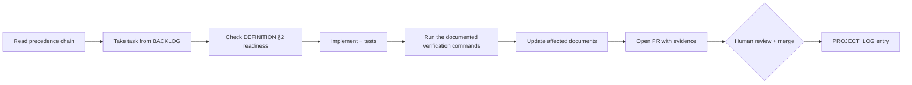

# AGENTS.md — Master Instruction Manual

- **Status:** Active
- **Last verified:** 2026-10-03
- **Owner:** Documentation Maintainer
- **Authoritative for:** operating rules for AI agents working in this repository — precedence, roles, permissions, workflow, escalation, completion.
- **Not authoritative for:** product requirements (`docs/REQUIREMENTS.md`), architecture (`docs/DESIGN.md`), code conventions (`docs/GUIDELINES.md`), contribution process (`docs/CONTRIBUTING.md`), gates (`docs/DEFINITION.md`). Link to those; never restate them.

This file applies to every agent, human-supervised or autonomous, working in this repository. When this file and another document disagree about *what to build*, the precedence rules in §2 decide. When they disagree about *how to operate*, this file wins.

---

## 1. Project context

**Multiverse Explorer** — a Kotlin Multiplatform client for the public [Rick and Morty API](https://rickandmortyapi.com/). It is a recruitment deliverable for ZARA based on [`assessment.md`](assessment.md).

| Fact | Value |
| --- | --- |
| Product | Multiverse Explorer: browse every character, inspect one character, favourite characters |
| Deliverable | A repository a reviewer can read and a pair of apps they can run |
| Platforms | Android (Jetpack Compose, `minSdk` 26) first; iOS (SwiftUI, iOS 18+) second — DEC-001, DEC-040 |
| Shared code | Kotlin Multiplatform: domain, data, UI-state contracts, formatters, copy keys |
| Remote stack | Ktor 3.6.0 + kotlinx.serialization, REST — DEC-011 |
| Verification | Tests plus measurable performance evidence — DEC-029, DEC-033 |
| Emphasis | Code and architecture quality; interview discussion centres on it (`assessment.md` l.8) — DEC-003 |

**Current repository state (verified 2026-10-03, after the B2 remediation merged):** the Gradle/KMP build skeleton (TASK-014, PR #6) and the five feature route declarations exist; `.gitignore` and the repository-hygiene check run in `check` (TASK-016, PR #13); the version catalog pins the full planned inventory with its policy checks (TASK-015, PR #10); the internal contract baseline is accepted (TASK-019, PR #31); `verifyModuleBoundaries` enforces the module graph, including the effective inherited edges and the Compose-only rule for `:core:designsystem` (TASK-017, PR #33, hardened by TASK-088); one `VERSION` file (`0.1.0`) is the single version source, with the Android `versionName` derived from it and every artifact task depending on its validation (TASK-018, PR #34, hardened by TASK-089); the pull-request gate runs on both platform runners with every action pinned by SHA (TASK-025, PR #52) and the shared test harness with its fixtures exists in `:core:testing` (TASK-024, PR #52); ktlint, Android Lint, `buildHealth` and the documented-gate check are active and blocking (TASK-029, PR #65); the Swift toolchain is pinned with a checksum-verified provisioning script (TASK-030, PR #63); the workflow guard rejects any automated integration and any merge-gate reference to live mode (TASK-028/TASK-093/TASK-026, PRs #52, #64, #67); and the reusable templates carry structured TDD evidence (TASK-031/TASK-073, PRs #62, #66). **B3 Phase 3.1** (`TASK-036`, `TASK-037`) is merged (PR #110): the `:core:domain` model and seams, the REST adapter and the first product tests exist, the API/IMPL boundary keeps every feature off `:core:data` (`DEC-091`), and the `ios` pull-request job is suspended until the iOS app exists (`DEC-083`). **B3 Phase 3.2** (`TASK-038`, `TASK-039`, `TASK-047`) is merged (PR #114): the repository's coalescing, bounded retry and host allow-list, the shared pager, the logging contract and the debug-only `:core:diagnostics` module. **B3 Phase 3.3** (`TASK-040`, `TASK-041`) is in review: the favourites store on both platforms and the presentation primitives with the copy-parity verifier. **There is still no feature behaviour, no screen and no iOS app**, and the APK has no activity, so the product has never been launched. From 2026-10-01 the remaining work is delivered in nine execution blocks (`B1`…`B9`, `DEC-063`). Block 1 is **integrated and locally verified, not `Done` under D2** — it merged before CI existed; from `TASK-025` onward every change runs under real required checks, and `DEC-071` activates the required-check set in stages. **Block 2 is complete, its own remediation included:** its nine original rows are `Done` against the checks active at their stage (PRs #52, #62–#67, #69, #70), and an audit of the merged block then reproduced ten defects which were registered as `TASK-098`…`TASK-107` and closed between `4953bde` (#88) and `a1de389` (#102) — the workflow gate parses structure and binds execution, the documented gate decides on the effective graph, the Swift scripts fail closed, the contract replay decides per target, the exclusion register decides per edge, the boundary model enforces the target set, the macOS job covers every current KMP module, the live observation path is bounded, and the settings packet is applied. The `main protection` ruleset now requires the `android` context with no bypass actor (the `ios` context is removed for the `DEC-083` suspension, `TASK-108`), so a head without it is `BLOCKED` (`CONTRIBUTING.md` §5.3). Documentation describes the **target** state and is updated in the same change that ships a feature (DEC-046). Never claim that unbuilt code works.

Agent writes stay limited to `docs/**`, `README.md`, `README.es.md` and `AGENTS.md` except where the owner grants an explicit, task-scoped authorization (§4.3). The rule holds after the build landed: `docs/CONTRIBUTING.md` §9 no longer claims the limit lifts on its own, and `DEC-064` records that the restriction is task-scoped rather than phase-scoped.

---

## 2. Authoritative sources and precedence

Read in this order. A source higher in the list overrides one below it on conflict.

1. [`assessment.md`](assessment.md) — the assignment. Frozen and authoritative. Partially truncated at l.4 and l.10; record the interpretation instead of guessing (`docs/REQUIREMENTS.md` `CON-003`).
2. `docs/REQUIREMENTS.md` — what the product must do and how well, with acceptance criteria.
3. `docs/API_SPECS.md` — the remote data contract. `docs/DESIGN.md` — architecture, modules, state contracts, navigation. `docs/UI_SPEC.md` — visual and interaction specification.
4. `docs/CONTRACTS.md` — canonical internal Kotlin interfaces and invariants. `docs/ERROR_FLOW.md` — canonical failure→state→copy chain.
5. `docs/adr/` — rationale for a decision. `docs/DECISION_BOARD.md` — decision status index.
6. `docs/PROJECT_LOG.md` — why the project evolved as it did.

Ownership is exclusive: each topic has exactly one authoritative file (see each file's `Authoritative for:` header). If you need to change normative content, change it there and nowhere else.

### 2.1 Before you start any task

1. Read this file.
2. Read the authoritative document for the area you are touching, and the requirement IDs you are implementing.
3. Check `docs/DECISION_BOARD.md` for decisions that constrain the work and for `Deferred` items you must not implement.
4. Check `docs/BACKLOG.md` for the task and its acceptance criteria; check `docs/DEFINITION.md` for readiness conditions.

Do not begin from memory or from a similar project. Repository state is evidence; recollection is not.

---

## 3. Specialized agents

Each role has a core objective, required inputs and a deliverable. A role may be filled by a human, an AI agent, or the same agent wearing two hats — but its deliverable must exist and must live in the file named.

The nine names below are the **only** `Owner:` values a document header may use: the nine sections of this section are the role vocabulary, and a document whose `Owner:` is not one of them fails the documentation gate (`docs/DEFINITION.md` §6, DOC1). Where a template or a specification shows a role as a metavariable — `docs/adr/0000-adr-template.md` and `docs/GUIDELINES.md` §9.1 — the author replaces it with one of the nine names; it is template notation, not a fourth kind of owner.

### 3.1 Requirements Analyst

- **Objective:** extract, formalize and maintain requirements and their acceptance criteria; keep the assignment mapping honest.
- **Inputs:** `assessment.md`, `docs/API_SPECS.md`, reviewer feedback.
- **Deliverable:** `docs/REQUIREMENTS.md` — MoSCoW priorities, stable `REQ-*` identifiers, `AC-*` criteria, constraints, risks, assessment traceability.
- **May not:** invent scope that is not traceable to `assessment.md` or an explicit decision; mark a deferred item as MVP.

### 3.2 API Architect

- **Objective:** define and maintain the remote contract, its error semantics and its caching policy.
- **Inputs:** `docs/REQUIREMENTS.md`, the live API, `docs/adr/0004-rest-client.md`, `docs/adr/0005-caching-strategy.md`.
- **Deliverable:** `docs/API_SPECS.md` — endpoint map, DTO shapes, `ApiFailure` taxonomy, cache policy with `API-*` ids, contract-test list.
- **May not:** state a server guarantee without a date and a verification method; hardcode totals or page counts as schema.

### 3.3 System Architect

- **Objective:** keep the architecture coherent: layers, module boundaries, dependency direction, state contracts, navigation, failure mapping.
- **Inputs:** `docs/REQUIREMENTS.md`, `docs/API_SPECS.md`, `docs/CONTRACTS.md`.
- **Deliverable:** `docs/DESIGN.md` plus `docs/adr/` for architecturally significant decisions, and `docs/CONTRACTS.md` for interface invariants.
- **Owns:** `docs/DECISION_BOARD.md` status accuracy and the decision IDs referenced elsewhere.

### 3.4 UI/UX Designer

- **Objective:** translate the image-first requirement into an implementable specification for both native clients.
- **Inputs:** `docs/REQUIREMENTS.md`, `docs/DESIGN.md`, the Figma file and the committed exports in `docs/figma/`, `docs/design/*`.
- **Deliverable:** `docs/UI_SPEC.md` — tokens, component specification per platform, screen specification, motion, states, accessibility, iconography.
- **May not:** contradict `docs/REQUIREMENTS.md` on behaviour; the two design briefs in `docs/design/` are historical inputs and are not normative where `docs/UI_SPEC.md` decided otherwise.

### 3.5 Implementation Engineer

- **Objective:** turn the specifications into correct, maintainable, testable code.
- **Inputs:** `docs/DESIGN.md`, `docs/CONTRACTS.md`, `docs/API_SPECS.md`, `docs/UI_SPEC.md`, `docs/GUIDELINES.md`.
- **Deliverable:** production source code implementing the specified architecture, plus the tests required by `docs/TESTING.md`.
- **May not:** add a dependency without a recorded justification; implement a `Deferred` item; leave a stub, a no-op or a placeholder in place of specified behaviour.

### 3.6 QA & Validation Engineer

- **Objective:** prove the implementation meets the requirements and degrades safely.
- **Inputs:** `docs/REQUIREMENTS.md`, `docs/API_SPECS.md`, `docs/ERROR_FLOW.md`, `docs/TESTING.md`, the implementation.
- **Deliverable:** the test suite, the requirement→test traceability in `docs/TESTING.md`, and validation evidence recorded in `docs/PROJECT_LOG.md`.
- **May not:** report a result it did not observe; mark a requirement validated on the strength of a passing build alone.

### 3.7 Security Reviewer

- **Objective:** keep the threat model, trust boundaries and permissions honest.
- **Inputs:** `docs/SECURITY.md`, `docs/API_SPECS.md` §9, dependency manifests.
- **Deliverable:** `docs/SECURITY.md` including the advisory register (`SEC-*`), and dependency-scanning configuration.
- **May not:** claim compliance, certification or a security guarantee; record a finding that is not evidenced.

### 3.8 Delivery Planner

- **Objective:** keep the work sequenced, sized and traceable to requirements; keep the reviewer's view current.
- **Inputs:** `docs/REQUIREMENTS.md`, `docs/DECISION_BOARD.md`, `docs/DEFINITION.md`.
- **Deliverable:** `docs/TECHNICAL_PLAN.md`, `docs/BACKLOG.md`, `docs/HANDOFF.md`, release mechanics (`VERSION`, tags, release notes).

### 3.9 Documentation Maintainer

- **Objective:** keep the documentation system coherent: one owner per topic, no drift, no dead links, no unresolved placeholders.
- **Inputs:** every document.
- **Deliverable:** `docs/DOCUMENTATION_AUDIT.md`, `docs/PROJECT_LOG.md`, `README.md`, `README.es.md`, `docs/templates/`.
- **May not:** let two files claim authorship of the same topic; allow a document without a header block to merge.

---

## 4. Permitted and prohibited actions

### 4.1 Permitted

- Reading any file in the repository; running the project's build, test and analysis commands.
- Editing files required by the task, including updating the authoritative document for a topic you changed.
- Opening a pull request (branch `feat|fix|docs|test|build|chore/<slug>`, Conventional Commits).
- Adding a dependency when the justification is recorded in `docs/DESIGN.md` or an ADR.
- Adding a new document only when an established workflow needs it (a template with a single user is not a workflow).
- Writing outside the documentation paths listed in §4.3 only under an explicit, task-scoped owner authorization that names the paths and the task (`DEC-064`).

### 4.2 Prohibited — no exceptions without an explicit human instruction

- Merging, force-pushing, rewriting history, tagging or publishing a release.
- Changing repository settings, branch protection, secrets, or CI credentials.
- Committing secrets, tokens, keystores, API keys or credentials of any kind. None are required (`REQ-SEC-002`).
- Deleting or rewriting another author's work to make your own change easier. If existing content looks obsolete, say so with evidence and propose the change.
- Editing generated output, build artifacts, or files under `build/`.
- Implementing a `Deferred` item, or a requirement with `Could have` priority, without a new accepted decision.
- Reporting unverified results as verified. Never state that a build, test or app run succeeded unless you observed it.
- Adding analytics, tracking, advertising or telemetry SDKs (`REQ-OBS-003`).
- Adding microphone or speech permissions while voice search is deferred (`REQ-SEC-004`).
- Introducing a third solution for a concern that already has two, or a second solution without a recorded rationale (for example a second HTTP client or a second image loader) — `REQ-NFR-002`; rationale is recorded in `docs/DESIGN.md` §3.5 or an ADR. `TEST-UNIT-013` rule R5 enforces the cap of two.

### 4.3 Permission boundary for AI agents

Agents may create and edit files and open pull requests. A human performs merging, tagging, releases, repository-settings changes and secret management (DEC-049). Agent writes are limited to `docs/**`, `README.md`, `README.es.md` and `AGENTS.md`; any write outside those paths requires an explicit, task-scoped authorization from the owner naming the paths and the task — the restriction is task-scoped, not tied to a phase, and it does not lift on its own (`DEC-064`; `docs/CONTRIBUTING.md` §9).

An agent-authored pull request must state which documents it touched and which checks it actually ran. A claim without a command and an observed result is a defect.

---

## 5. Workflow and handoff protocol

1. **Take work from the index.** `docs/BACKLOG.md` is canonical; GitHub Issues carry state and reference the `TASK-###` id.
2. **Check readiness** against `docs/DEFINITION.md` before starting.
3. **Implement the smallest complete change** that satisfies the requirement — no opportunistic refactors, no unrelated cleanup, no speculative abstraction.
4. **Verify by executing.** Run the commands in `README.md`/`CONTRIBUTING.md` that cover your change and record the observed result. A test that was not run is not evidence.
5. **Update documents in the same change** (DEC-046): the authoritative document for the behaviour you changed, the backlog row, and `docs/PROJECT_LOG.md` when the change is decision-relevant.
6. **Hand off via pull request** using `docs/templates/pull-request.md`, naming requirement, decision and test IDs.
7. **On handoff to another agent or developer,** update `docs/HANDOFF.md`: current state, what changed, what is next, what is blocked. The block model does not change this: every task handoff follows it (DEC-063).

**B3 packaging exception (`DEC-082`).** Block 3 alone lands as three phase pull requests — 3.1 `TASK-036`+`TASK-037`, 3.2 `TASK-038`+`TASK-039`+`TASK-047`, 3.3 `TASK-040`+`TASK-041` — instead of one per task. Each member keeps its own backlog row, issue, acceptance and red/green evidence inside the phase pull request; each phase starts from merged `main` after the owner merges the previous one; no extra prerequisite, documentation, CI or task-level pull request is opened for B3. Every other block keeps one pull request per task (`DEC-063`, `BACKLOG.md` §2.6).

When two agents work concurrently: one owner per file, and the integration owner is decided before editing. Communicate interface expectations (module boundaries, contract signatures) before writing code against them. A block does not relax this rule — block members still land as separate pull requests and must not edit the same tracking rows concurrently (DEC-063); where two tasks would touch one file, the later task starts from the merged `main`, not from the earlier task's branch.

---

## 6. Decision and escalation rules

- A decision that changes architecture, a module boundary, a public contract, tooling or scope requires an entry in `docs/DECISION_BOARD.md` and, when architecturally significant, an ADR in `docs/adr/`.
- ADRs are immutable once `Accepted`: supersede with a new ADR and mark the old one `Superseded`. Never rewrite the rationale of an accepted decision.
- Never resolve a conflict silently. Record it in `docs/DOCUMENTATION_AUDIT.md` with a `CONF-###` id, severity, and the blocked artifact, then escalate.
- Escalate to the human owner when: a requirement contradicts `assessment.md`; two authoritative documents disagree; a gate in `docs/DEFINITION.md` cannot be met; a change needs a prohibited action; a decision is `Deferred` but the task requires it.
- When escalating, state: what you were asked to do, what you found (with file/section or command evidence), the options with their trade-offs, your recommendation, and the tasks and acceptance criteria blocked. Do not stop at the problem. This shape is the one every `CONF-###` escalation in `docs/DOCUMENTATION_AUDIT.md` follows and the one an owner-decision packet must carry.
- A waiver of a gate must be explicit, dated, recorded in `docs/DEFINITION.md`, and given an expiry.

---

## 7. Repository-inspection expectations

- Inspect before acting: list the tree, read the authoritative documents for the area, and confirm the current state of any file you intend to change.
- Evidence over assumption. Cite file and line, section, or command output. Distinguish observed facts, documented decisions, inferences and assumptions — label inferences as `[INFERENCE]`.
- Distinguish current state from target state (DEC-046). Documentation may describe behaviour that does not exist yet; say which it is.
- When documentation and implementation disagree, implementation is the current truth and documentation is the defect — report it, do not silently "fix" the code to match the document.
- Treat existing content as intentional. Do not delete, rename or reorganize another author's work without explaining why and proposing the replacement.
- Verify external facts (library versions, platform API availability, API behaviour) against a primary source and record the verification date. The decision interview that produced the initial decision set is recorded on 2026-09-29 in the owning documents (its working brief is not a repository artifact); those facts carry 2026-09-29 as their verification date, and anything older must be re-checked before being relied on.

---

## 8. Implementation constraints

- Architecture: feature-per-module with Clean Architecture inside each feature module; dependencies point inward (feature → core → domain). Platform types stay out of `:core:domain`; DTOs stay inside `:core:data`; no feature module depends on another feature module. See `docs/DESIGN.md` §3 and `docs/adr/0001-module-boundaries.md`.
- Contracts: interface signatures and invariants are owned by `docs/CONTRACTS.md`. Changing one changes that file in the same commit.
- Code conventions: `docs/GUIDELINES.md` is authoritative. Anything a tool enforces (ktlint, detekt, Android Lint, dependency-analysis, SwiftLint, swift-format) is not restated as prose — run the tool.
- Dependencies: every dependency needs a recorded justification and must be pinned exactly (`REQ-NFR-002`, `REQ-NFR-006`). Alpha dependencies are permitted only where an ADR records the accepted risk (`docs/adr/0008-alpha-dependencies.md`).
- Localisation: no user-visible string literal in code; all copy comes from resources with English and Spanish values, and identical copy on both platforms (`REQ-FUNC-013`, `REQ-UX-008`).
- State: screens render immutable state and emit intents; state holders are platform-owned (DEC-013); business logic never lives in a composable or a view.
- Error handling: map failures per `docs/ERROR_FLOW.md`; never swallow an error, never surface a raw exception, never map `CancellationException`.
- Accessibility is part of the implementation, not a follow-up: labels, target sizes, scaling and colour-independent status (`REQ-UX-003`…`REQ-UX-007`).
- Performance is a budget, not an aspiration: respect the numeric budgets and the measurement method in `docs/PERFORMANCE.md` (`REQ-NFR-003`).

---

## 9. Testing requirements

- `docs/TESTING.md` is authoritative for strategy, layers, tooling and naming. `docs/DEFINITION.md` is authoritative for the gate. The phase-and-commit protocol (red `test:` → green `feat:`/`fix:` → `refactor:`, pushed commits never rewritten, integration by merge commit) is owned by `docs/CONTRIBUTING.md` §3 and stated for authors in `docs/GUIDELINES.md` §8.1 (DEC-053, DEC-059); it is not restated here.
- Every behaviour change ships with the tests that would fail without it, or a recorded justification in the pull request. Bug fixes carry a regression test where practical.
- Do not write tests that assert incidental implementation detail, tautologies, mock echoes or source text; delete such a test rather than re-pinning it when the implementation changes.
- No test performs real network I/O or depends on wall-clock time; use the injected clock and dispatchers (`REQ-REL-004`).
- Verify by executing the documented command and observing the result. Report the command and the outcome, including failures.

---

## 10. Documentation-update requirements

- One authoritative owner per topic; normative statements appear in exactly one file and are referenced elsewhere by identifier.
- Every document carries a header block: `Status:`, `Last verified:`, `Owner:`, `Authoritative for:`, `Inputs:`.
- Update the owning document in the same change that alters the behaviour it describes (DEC-046).
- Use stable identifiers from the owning index — `REQ-*`/`AC-*` (`docs/REQUIREMENTS.md`), `DEC-###` (`docs/DECISION_BOARD.md`), `TASK-###` (`docs/BACKLOG.md`), `TEST-*` (`docs/TESTING.md`), `IC-###` (`docs/CONTRACTS.md`); never renumber or reuse one (`docs/GUIDELINES.md` §7.1).
- Documentation is written in English; `README.es.md` is the only translated document (DEC-047).
- Keep links relative and working; verify links in any document you touch.
- No placeholders, TODOs or unresolved angle-bracket templates in a merged document. If a fact cannot be verified, mark it as an assumption with an owner and a date.
- Diagrams use Mermaid in the owning document (DEC-050).

---

## 11. Definition of completion

A change is complete when **all** of the following hold:

1. The specified behaviour exists end-to-end — no stubs, no placeholders, no partial subset of the acceptance criteria.
2. Every acceptance criterion for the involved requirement is satisfied and verifiable.
3. The documented verification commands were executed and their results observed; failures reported, not hidden.
4. Tests required by `docs/TESTING.md` exist and pass; traceability from the requirement to the test is recorded.
5. The affected documents are updated in the same change, and no document now contradicts the code.
6. Static analysis, formatting and dependency checks pass (`DEC-032`).
7. `docs/BACKLOG.md` reflects the task state, and `docs/PROJECT_LOG.md` has an entry when the change is decision-relevant.
8. No unresolved conflict, no unexplained deviation from `docs/GUIDELINES.md`, and no claim without evidence.

If any item cannot be met, the work is not complete: state exactly what is missing, what you tried, and what is needed. Do not present partial work as done, and do not reduce scope without an approved decision.

---

## 12. Conflict-resolution policy

1. Stop and identify the conflict precisely: which documents, which statements, which identifiers.
2. Apply precedence (§2). If precedence does not resolve it, `assessment.md` wins over everything, and a product-scope conflict requires a human decision.
3. Record it in `docs/DOCUMENTATION_AUDIT.md` with severity `S1` (blocks planning), `S2` (blocks a document) or `S3` (consistency), plus the blocked artifact.
4. Propose options with trade-offs and a recommendation; do not implement a guess.
5. After resolution, update the owning document and the decision board — never leave the resolution only in a conversation.

## 13. Handling uncertainty

- Missing information is not a licence to invent. State the assumption, mark it as an assumption, name the owner and date it, then proceed only if the assumption cannot change the outcome.
- If an assumption could invalidate the work, stop and escalate instead of building on it.
- Prefer the boring, well-documented option when two designs are otherwise equal.
- Never fabricate an API response, a benchmark number, a test result or a file path. `[INFERENCE]` labels are acceptable; invented evidence is not.
- When a tool or command fails, report the failure and its message rather than describing the intended outcome.

## 14. Preserving user changes

- Treat the current repository state as intentional and authoritative for what exists.
- Do not overwrite, reformat or relocate existing content without stating why and what replaces it.
- When reorganising, migrate every reference in the same change; leave no duplicate or stale copy behind.
- Commit only what your task requires. Unrelated improvements belong in their own change with their own justification.

## 15. Security and privacy restrictions

- `docs/SECURITY.md` is authoritative for policy; `docs/OBSERVABILITY.md` for what may be logged.
- Never commit secrets, credentials or machine-specific configuration.
- Never log search text, response bodies, image bytes, personal data or stack traces in release builds (`REQ-SEC-005`).
- Network access is HTTPS-only to the configured host; never follow a relation or pagination URL to another host (`REQ-SEC-001`).
- Do not add a permission, an SDK or a data collection path without an accepted decision and security review.
- Report a suspected vulnerability privately through the route in `docs/SECURITY.md` — never in a public issue or pull request.
