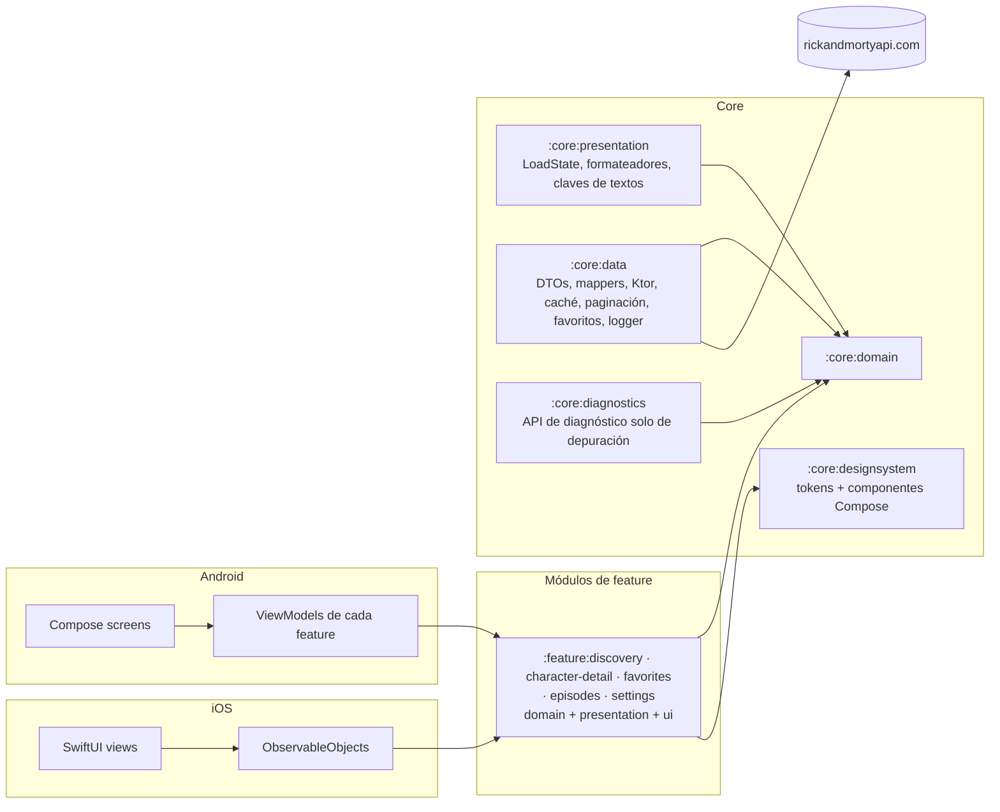

# Multiverse Explorer

- **Status / Estado:** Activo — el esqueleto de build de Gradle/KMP ya existe (TASK-014); la aplicación sigue siendo estado objetivo (ver [`docs/DOCUMENTATION_AUDIT.md`](docs/DOCUMENTATION_AUDIT.md) §5)
- **Last verified:** 2026-10-02
- **Owner / Responsable:** Delivery Planner (ver [`AGENTS.md`](AGENTS.md))
- **Authoritative for / Documento autoritativo para:** el punto de entrada del desarrollador — requisitos previos, comandos de compilación, ejecución, test y calidad, plataformas soportadas, limitaciones conocidas e índice de documentación.
- **No autoritativo para:** requisitos, arquitectura, contrato remoto, especificación visual ni proceso; cada uno se enlaza más abajo.
- **Entradas:** [`assessment.md`](assessment.md), [`docs/REQUIREMENTS.md`](docs/REQUIREMENTS.md), [`docs/DESIGN.md`](docs/DESIGN.md), [`docs/TECHNICAL_PLAN.md`](docs/TECHNICAL_PLAN.md)

Cliente de [Kotlin Multiplatform](https://kotlinlang.org/docs/multiplatform.html) para la API pública de [Rick and Morty](https://rickandmortyapi.com/): explora todos los personajes, abre uno concreto y marca tus favoritos.

Proyecto realizado como prueba técnica de desarrollo móvil para ZARA, descrita en [`assessment.md`](assessment.md).

> **Estado del proyecto: herramientas de build y gobernanza, sin aplicación todavía.**
> El repositorio contiene el conjunto documental, el esqueleto Gradle/KMP (TASK-014), `.gitignore` y su comprobación de higiene (TASK-016), el catálogo de versiones fijado con sus comprobaciones (TASK-015), la base de contratos aceptada (TASK-019), la comprobación ejecutable de fronteras de módulos (TASK-017, endurecida por TASK-088), la fuente única `VERSION` (`0.1.0`, TASK-018, con todas las tareas de artefacto Android dependiendo de su validación vía TASK-089), el arnés de pruebas compartido en `:core:testing` (TASK-024), el **gate de pull request en ambos runners** (TASK-025, PR #52) y la cadena de calidad — ktlint, Android Lint, `buildHealth` y la comprobación del gate documentado están activos y bloquean (TASK-029, PR #65), la cadena Swift está fijada con un script verificado por checksum (TASK-030, PR #63), y el guardián de workflows rechaza la integración automatizada y cualquier referencia al modo live desde el gate (TASK-028/TASK-093/TASK-026). Todavía **no hay comportamiento de producto, ni tests de producto, ni app lanzable**; el APK no tiene actividad. Block 1 está *integrado y verificado localmente* porque se fusionó antes de que existiera el gate; cada cambio desde `TASK-025` corre bajo checks requeridos reales (`DEC-071`). Los comandos marcados *ejecutado* se corrieron en la fecha indicada; el resto es la interfaz prevista.

## 1. Objetivos de la prueba

La prueba ([`assessment.md`](assessment.md)) pide:

| Requisito | Cómo lo responde este proyecto |
| --- | --- |
| Listar todos los personajes y ver el seleccionado | Listado paginado, con búsqueda y filtro, y pantalla de detalle |
| Revisar cómo está estructurado el proyecto y si se aplica SOLID | Los 12 módulos de ADR-0001 con sus enmiendas (incluido `:core:diagnostics`, solo de depuración) con dependencias hacia dentro, capas de Clean Architecture, contratos documentados y ADRs |
| "Somos una empresa muy visual, la UX es importante" | Sistema de diseño centrado en la imagen, color derivado del retrato, transiciones compartidas y UI verificada con capturas |
| Hablar de rendimiento | Presupuestos numéricos y método de medición en [`docs/PERFORMANCE.md`](docs/PERFORMANCE.md) |
| Extras: caché de imágenes, gestión de errores, caché de respuestas, tests, filtro/búsqueda | Todos comprometidos — ver la tabla de funcionalidades en el `README.md` en inglés (§3) |
| "Usa las librerías con criterio, cada dependencia cuenta" | Una librería por necesidad, cada una justificada en [`docs/DESIGN.md`](docs/DESIGN.md) o en un ADR |
| Usar Jetpack Compose o SwiftUI | Ambos, como dos clientes nativos sobre un núcleo Kotlin compartido |

## 2. Plataformas soportadas

| Plataforma | UI | Mínimo | Estado |
| --- | --- | --- | --- |
| Android | Jetpack Compose, Material 3 Expressive | API 26 (compile/target 37) | Hito M1 — primera entrega |
| iOS | SwiftUI, Liquid Glass en iOS 26+ con alternativa material | iOS 18.0 | Hito M2 — segunda entrega |

Solo teléfono en vertical; tablet, plegable y horizontal quedan fuera de alcance ([`docs/REQUIREMENTS.md`](docs/REQUIREMENTS.md) §1.2).

## 3. Funcionalidades

### Comprometidas

| Funcionalidad | Requisito |
| --- | --- |
| Listado paginado con total real desde la API | `REQ-FUNC-001` |
| Detalle con origen, última ubicación conocida, número de episodios y primera aparición | `REQ-FUNC-002`, `REQ-FUNC-023` |
| Búsqueda por nombre con 300 ms de debounce y cancelación de peticiones | `REQ-FUNC-003` |
| Filtro de estado: All, Alive, Dead, Unknown | `REQ-FUNC-004` |
| Tarjetas centradas en la imagen, con placeholder, crossfade y estado de error de marca | `REQ-FUNC-005` |
| Favoritos almacenados localmente, con sección propia | `REQ-FUNC-006` |
| Splash de marca cuyo portal giratorio es el indicador de carga | `REQ-FUNC-007` |
| Cuatro destinos: Characters, Episodes, Favorites, Settings | `REQ-FUNC-008` |
| Transición de tarjeta a detalle, con alternativa si "Reducir movimiento" está activo | `REQ-FUNC-009` |
| Estados diseñados de vacío, datos obsoletos, error y datos parciales | `REQ-FUNC-010`, `REQ-FUNC-022` |
| Reintento y actualización manual | `REQ-FUNC-011`, `REQ-FUNC-012` |
| Localización: inglés y español | `REQ-FUNC-013` |
| Caché de respuestas con política de frescura explícita | `REQ-FUNC-020` |
| Caché de imágenes en memoria y disco | `REQ-FUNC-021` |
| Ajustes: preferencia de sonidos (desactivada por defecto), origen de datos REST API o GraphQL (REST por defecto), borrar todos los favoritos con confirmación | `REQ-FUNC-033`, `REQ-FUNC-034`, `REQ-FUNC-035` |

### Aplazadas por decisión

| Funcionalidad | Estado |
| --- | --- |
| Búsqueda por voz (voz a texto) | Aplazada — `DEC-002`. No se solicita permiso de micrófono ni de reconocimiento de voz. |
| Pantallas reales de Episodes | Aplazada — `DEC-005`. Episodes se entrega como pantalla provisional diseñada, con vuelta a Characters. |
| Pantallas reales de Locations | Aplazada — `DEC-005`, `DEC-055`. Locations no está en la navegación. |
| Efectos de sonido | Aplazada — `DEC-055`. El ajuste de sonidos se guarda, pero todavía no reproduce nada. |

### Pantallas y capturas previstas

La especificación visual es [`docs/UI_SPEC.md`](docs/UI_SPEC.md). Define siete pantallas por plataforma (Splash, Discovery, Detail, la pantalla provisional de Episodes, el estado vacío de Favorites, Settings y la confirmación de borrar favoritos) y enlaza cada componente con su nodo de Figma.

Las capturas **aún no están incluidas**. Hay dos conjuntos pendientes, registrados en [`docs/BACKLOG.md`](docs/BACKLOG.md):

- exportaciones PNG de las pantallas de Figma en `docs/figma/` (el archivo de Figma requiere acceso);
- capturas de las aplicaciones en ejecución, que se añadirán a este README al verificar cada hito.

## 4. Arquitectura en breve

Clean Architecture con flujo de datos unidireccional sobre Kotlin Multiplatform:



- Las dependencias apuntan hacia dentro: features → core → domain. El módulo `:core:domain` no depende de frameworks, HTTP ni UI, y ningún módulo de feature depende de otro módulo de feature.
- Frontera API/IMPL ([`ADR-0014`](docs/adr/0014-api-impl-boundary.md)): `:core:domain` es la API y `:core:data` la implementación. Las features dependen solo de la API y nunca de `:core:data`; la app (y, en iOS, el módulo de exportación `:core:ios`) es la raíz de composición que conecta las implementaciones, de modo que ningún tipo HTTP ni de almacenamiento llega al código de una feature.
- La UI es nativa en cada plataforma; el dominio, los datos, los contratos de estado de UI, los formateadores y las claves de textos son compartidos.
- Detalle completo, tabla de módulos, reglas de dependencia y diagrama de clases: [`docs/DESIGN.md`](docs/DESIGN.md). Justificación: [`docs/adr/0001-module-boundaries.md`](docs/adr/0001-module-boundaries.md).

## 5. Estructura del repositorio

```text
.
├── assessment.md                 # La prueba (autoritativa, congelada)
├── AGENTS.md                     # Reglas de operación para agentes de IA
├── README.md                     # Versión inglesa (autoritativa)
├── README.es.md                  # Este archivo
└── docs/                         # Requisitos, arquitectura, API, UI, proceso y decisiones
```

El contenido de `docs/` se describe en la sección 12 del [`README.md`](README.md) en inglés. El build añade `core/{domain,data,presentation,designsystem,testing}`, `feature/{discovery,character-detail,favorites,episodes,settings}` y `androidApp/` (TASK-014), y añadirá `core/ios` (módulo de exportación del framework iOS, [`ADR-0012`](docs/adr/0012-ios-framework-export.md)), `iosApp/`, un módulo `benchmark` y los flujos de CI (`CONF-41` sigue pendiente de decisión para los artefactos `benchmark` y `contract-live`). Cada módulo de feature contiene sus propias capas de Clean Architecture como paquetes.

## 6. Requisitos previos

| Herramienta | Versión | Notas |
| --- | --- | --- |
| JDK | 17 o superior | Necesario para Gradle |
| Android SDK | Plataforma 37 (Android 17) | `minSdk` 26 |
| Xcode | 26 o superior | Necesario para compilar las APIs de Liquid Glass de iOS 26 |
| Kotlin | 2.4.20 | Lo aporta el toolchain de Gradle |
| Node.js | No necesario | No hay objetivo web |

No se necesita clave de API, cuenta ni credencial: la API de Rick and Morty es pública, sin autenticación y de solo lectura.

## 7. Puesta en marcha

```bash
git clone <repository-url>
cd RickAndMorty
```

El wrapper de Gradle está incluido (Gradle 9.7.0, con la suma de comprobación de la distribución fijada), así que no hace falta instalar Gradle aparte. No hay nada más que configurar: la URL base de la API es una constante de compilación, la raíz de paquetes se declara una sola vez en `gradle.properties` y no se requiere ningún archivo de propiedades, keystore ni variable de entorno.

## 8. Compilar y ejecutar

> El esqueleto de build existe y sus comandos están marcados como **ejecutados** abajo. Los comandos de funcionalidad, tests y release siguen siendo la interfaz prevista; cada uno indica por qué no se ha ejecutado.

| Tarea | Comando | Estado |
| --- | --- | --- |
| Listar el conjunto de módulos | `./gradlew projects` | Ejecutado 2026-10-02 — los 12 módulos de ADR-0001 con la enmienda de ADR-0013, agrupados por los proyectos contenedores `:core` y `:feature` (15 proyectos Gradle) |
| Compilar todos los módulos, Android y los klib de iOS | `./gradlew assemble` · `./gradlew build` | Ejecutado 2026-10-01 — correcto, sin errores de Android Lint |
| Compilar la app Android de debug | `./gradlew :androidApp:assembleDebug` | Ejecutado 2026-10-01 — correcto sin `iosApp/` y desde un clon limpio |
| Instalar en un dispositivo o emulador | `./gradlew :androidApp:installDebug` | No ejecutado — el APK del esqueleto aún no tiene activity (TASK-044) |
| Compilar el framework compartido para iOS | `./gradlew :core:ios:linkDebugFrameworkIosSimulatorArm64` | No ejecutado — `:core:ios` todavía no existe (`TASK-078`); ese módulo es el único productor del framework que enlaza la app iOS (`DEC-058`, [`ADR-0012`](docs/adr/0012-ios-framework-export.md)) |
| Compilar la app iOS | `xcodebuild -project iosApp/iosApp.xcodeproj -scheme iosApp -destination 'platform=iOS Simulator,name=iPhone 17 Pro' build` | No ejecutado — `iosApp/` no existe (TASK-051) |

## 9. Comandos de test y calidad

Todo pull request debe pasar la suite completa en ambas plataformas antes de poder aprobarse (`DEC-054`); las definiciones de Ready, Done y del merge gate están en [`docs/DEFINITION.md`](docs/DEFINITION.md) y la estrategia de pruebas en [`docs/TESTING.md`](docs/TESTING.md).

| Tarea | Comando | Estado |
| --- | --- | --- |
<!-- local-gate:begin -->
<!-- local-gate:begin -->
| Todos los tests compartidos y unitarios, más la suite de regresión del build-logic | `./gradlew allTests :build-logic:convention:test` | Ejecutado 2026-10-02: las suites compartidas corren en el target host-test de la JVM y en ambos targets Apple (`:core:testing:testAndroidHostTest`, `:core:testing:iosSimulatorArm64Test`) y la suite de regresión del build-logic corre en el build incluido. La fila anterior documentaba `./gradlew test`, que solo selecciona las tareas de test Android y no alcanza ni las suites KMP compartidas ni la suite del build-logic (`GAP-020`; `TASK-103`) |
| Formato, análisis estático y dependencias | `./gradlew ktlintCheck lintDebug buildHealth` | Ejecutado 2026-10-02 — ktlint, Android Lint y `buildHealth` pasan (TASK-029, `DEC-075`, `DEC-077`); detekt sigue siendo estado objetivo (`DEC-075`) |
| Fronteras de módulos y política de versión | `./gradlew verifyModuleBoundaries verifyDependencyPolicy verifyNoLiveHosts verifyWorkflowGate` | Ejecutado 2026-10-02: todos pasan — 15 proyectos (`R1`–`R18`, `S1`–`S3`, aristas heredadas efectivas, Compose-only para `:core:designsystem` y `:core:diagnostics` enlazado solo desde configuraciones de depuración, con su cierre de release comprobado), `VERSION` validado con todas las tareas de artefacto Android dependiendo de él, y ningún artefacto de analítica en el catálogo ni en el grafo de release resuelto de `:androidApp` (`verifyNoAnalytics`, `TEST-UNIT-034`) |
| Verificar la política de dependencias (pines exactos, justificación, inventario, ningún artefacto de analítica) | `./gradlew verifyDependencyPolicy` | Ejecutado 2026-10-02: pasa; también se ejecuta dentro de `./gradlew check` y `./gradlew build` |
| Suite de contrato en modo fixture/replay en el target host de Android (el paso de contrato del job `android`) | `./gradlew :core:data:contractTestReplayAndroidHost` | Ejecutado 2026-10-02: ejecuta exactamente los casos `TEST-CONTRACT-*` de `testAndroidHostTest` — 18 casos, 0 fallos — y falla cuando su target no ejecuta ninguno (`TASK-037`, `DEC-073`, `DEC-090`) |
| Verificar la higiene del repositorio y de secretos | `./gradlew verifyRepositoryHygiene` | Ejecutado 2026-10-01: pasa (0 hallazgos sobre el working set, todos los blobs alcanzables y todas las rutas históricas únicas); corregido en revisión; también se ejecuta dentro de `./gradlew check` y `./gradlew build` |
<!-- local-gate:end -->
| Verificación de capturas Android | `./gradlew :feature:discovery:verifyRoborazziDebug` | No ejecutado — Roborazzi no está configurado; llega con las capturas Android (`TASK-045`) |
| Regrabar capturas de referencia (revisar el diff antes de commitear) | `./gradlew :feature:discovery:recordRoborazziDebug` | No ejecutado — no hay capturas de referencia (`TASK-045`) |
| Capturas iOS y tests de los state holders | `xcodebuild test -scheme iosApp -destination 'platform=iOS Simulator,name=iPhone 17 Pro'` | No ejecutado — `iosApp/` no existe (TASK-051) |
| Benchmarks de rendimiento (requiere dispositivo) | `./gradlew :benchmark:connectedCheck` | No definido: no existe módulo de benchmark y `PERF-Q1` sigue abierto, así que el comando es estado objetivo, no una tarea real |
| Suite de contrato en modo fixture/replay en el target del simulador de Apple, y en ambos targets | `./gradlew :core:data:contractTestReplayIosSimulator` · `./gradlew :core:data:contractTestReplay` | Ejecutado 2026-10-02 en local sobre macOS: 18 casos de contrato en `iosSimulatorArm64Test` y 36 en ambos targets para el agregado. Fuera de CI mientras `DEC-083` suspende el job `ios`; el punto de entrada nativo pasa a ser bloqueante con `TASK-051`. Cada punto de entrada verifica los informes de su propio target, de modo que un informe del host nunca satisface el nativo |
| Sondas de observación contra la API real (señal programada, no bloqueante) | `./gradlew :core:data:contractLiveProbe` | Ejecutado 2026-10-02: registró los totales y el número de páginas publicados (`TASK-027`, `DEC-074`); `.github/workflows/contract-live.yml` lo ejecuta semanalmente y sube las capturas, y ningún workflow disparado por pull request o push puede alcanzarlo |

El desarrollo sigue el protocolo TDD descrito en [`docs/CONTRIBUTING.md`](docs/CONTRIBUTING.md): escribir el test que falla y commitearlo (`test:`), hacerlo pasar y commitear (`feat:`/`fix:`), refactorizar y commitear (`refactor:`), y después hacer push.

## 10. Configuración

| Elemento | Valor | Dónde |
| --- | --- | --- |
| URL base de la API | `https://rickandmortyapi.com/api/` | Constante de compilación; no se descubre en tiempo de ejecución |
| Versión de la app | Fuente única `VERSION` (`0.1.0`). El `versionName` de Android es ese valor literal hoy; el `CFBundleShortVersionString` de iOS deriva de él desde `TASK-051` (`DEC-043`, `DEC-067`) | `DEC-043` |
| Protocolo remoto | Ambos se entregan y el usuario elige en Ajustes: REST API (por defecto) o GraphQL, con el mismo cliente Ktor | `DEC-056`, [`docs/API_SPECS.md`](docs/API_SPECS.md) §2 |
| Frescura de caché | 24 h fresco, 7 d revalidación en segundo plano, 30 d en modo offline | `DEC-012` |
| Publicación | Etiqueta `vMAJOR.MINOR.PATCH`, GitHub Release con el APK adjunto | `DEC-043` |

## 11. Limitaciones conocidas

1. **Las imágenes son de 300 × 300.** La API publica un único avatar cuadrado por personaje y nada mayor. El hero del detalle reescala la fuente; los degradados y el fondo difuminado de iOS convierten esto en una decisión estilística y no en un defecto visible ([`docs/UI_SPEC.md`](docs/UI_SPEC.md) §5.3, `CON-002`).
2. **Una pestaña es provisional.** Episodes es una pantalla "próximamente"; Favorites y Settings son reales (`DEC-005`, `DEC-055`). El ajuste Sounds no reproduce nada hasta que se decida un conjunto de sonidos.
3. **La búsqueda por voz no está implementada.** Está aplazada y no se solicita permiso de micrófono ni de voz (`DEC-002`).
4. **Solo teléfono en vertical.** Sin tablet, plegable ni horizontal (`DEC-027`).
5. **Sin analítica.** No hay SDK de analítica, seguimiento ni publicidad (`REQ-OBS-003`).
6. **Solo un artefacto está fijado en una versión preliminar.** Material 3 Expressive `1.5.0-alpha29` está fijado en el catálogo de versiones y ningún módulo lo declara todavía; el riesgo aceptado y el plan de vuelta atrás están en [`docs/adr/0008-alpha-dependencies.md`](docs/adr/0008-alpha-dependencies.md). Los otros dos componentes solo-alpha no se adoptan.
7. **La API no está versionada.** Su forma puede cambiar sin aviso, por lo que los tests de contrato se ejecutan fuera del gate de merge (`DEC-029`).
8. **El dispositivo de referencia para rendimiento aún no está fijado.** Los presupuestos y el método de medición existen; el dispositivo concreto está registrado como suposición pendiente en [`docs/PERFORMANCE.md`](docs/PERFORMANCE.md).

## 12. Índice de documentación

El índice completo, con propósito y audiencia de cada documento, está en la sección 12 del [`README.md`](README.md) en inglés. Documentos principales:

| Documento | Propósito |
| --- | --- |
| [`assessment.md`](assessment.md) | La prueba. Prevalece sobre todo en caso de conflicto |
| [`AGENTS.md`](AGENTS.md) | Reglas de operación para agentes de IA |
| [`docs/REQUIREMENTS.md`](docs/REQUIREMENTS.md) | Requisitos, criterios de aceptación, alcance y riesgos |
| [`docs/DESIGN.md`](docs/DESIGN.md) | Arquitectura, módulos, contratos de estado y navegación |
| [`docs/API_SPECS.md`](docs/API_SPECS.md) | Contrato remoto, DTOs, errores y política de caché |
| [`docs/UI_SPEC.md`](docs/UI_SPEC.md) | Tokens, componentes, pantallas, movimiento y accesibilidad |
| [`docs/TESTING.md`](docs/TESTING.md) | Estrategia de pruebas y trazabilidad |
| [`docs/DEFINITION.md`](docs/DEFINITION.md) | Puertas de calidad: Ready, Done y publicación |
| [`docs/TECHNICAL_PLAN.md`](docs/TECHNICAL_PLAN.md) | Hitos, secuenciación y puertas de calidad |
| [`docs/BACKLOG.md`](docs/BACKLOG.md) | Índice de trabajo con criterios de aceptación |
| [`docs/DECISION_BOARD.md`](docs/DECISION_BOARD.md) | Índice de todas las decisiones y su estado |
| [`docs/HANDOFF.md`](docs/HANDOFF.md) | Estado actual y siguientes pasos |

Deliberadamente no creados, con motivos en [`docs/DECISION_BOARD.md`](docs/DECISION_BOARD.md) §3: `ARCHITECTURE.md` (fusionado en `DESIGN.md`), `SPECIFICATION.md` (duplicaría los requisitos), `ANALYTICS.md` (no hay analítica — sustituido por `OBSERVABILITY.md`), `SECURITY_ADVISORY_REGISTER.md` (por ahora una sección de `SECURITY.md`), `CHANGELOG.md` (sustituido por `PROJECT_LOG.md` más notas de release generadas).

## 13. Contribuir

Empieza por [`docs/CONTRIBUTING.md`](docs/CONTRIBUTING.md): puesta en marcha, convenciones de ramas y commits, plantilla de pull request y comprobaciones requeridas. Las convenciones de código están en [`docs/GUIDELINES.md`](docs/GUIDELINES.md) y la definición de terminado en [`docs/DEFINITION.md`](docs/DEFINITION.md).

El trabajo se indexa en [`docs/BACKLOG.md`](docs/BACKLOG.md) y se sigue con GitHub Issues. Los problemas de seguridad se comunican de forma privada por la vía indicada en [`docs/SECURITY.md`](docs/SECURITY.md), nunca en una issue pública.

## 14. Estado del proyecto

| Área | Estado |
| --- | --- |
| Análisis de la prueba | Completo — [`docs/REQUIREMENTS.md`](docs/REQUIREMENTS.md) |
| Contrato remoto | Completo y verificado contra la API real el 2026-09-29 — [`docs/API_SPECS.md`](docs/API_SPECS.md) |
| Arquitectura y decisiones | Completo — [`docs/DESIGN.md`](docs/DESIGN.md), [`docs/adr/`](docs/adr/), [`docs/DECISION_BOARD.md`](docs/DECISION_BOARD.md) |
| Especificación visual | Completa, pendiente de dos pantallas de Figma (estados de error) — [`docs/UI_SPEC.md`](docs/UI_SPEC.md) |
| Documentación de proceso | Completa — `GUIDELINES`, `CONTRIBUTING`, `DEFINITION`, `TESTING`, `SECURITY`, `OBSERVABILITY` |
| Esqueleto de build | Hecho — TASK-014, fusionado en el PR #6 el 2026-09-30: los 11 módulos compilan y la app Android se ensambla sin que exista `iosApp/`; ver `docs/PROJECT_LOG.md` LOG-0026 |
| Implementación | En curso — la fase 3.1 de B3 (`TASK-036`, `TASK-037`) está fusionada en el PR #110: el modelo y las interfaces de `:core:domain`, el adaptador REST con sus tests de contrato sobre fixtures y los dobles de comportamiento. La fase 3.2 (`TASK-038`, `TASK-039`, `TASK-047`) está en revisión: el repositorio con agrupación de peticiones concurrentes, la política de reintentos acotada y la lista de hosts permitidos, el paginador compartido, el contrato de logging con su redacción y la API de diagnóstico solo de depuración. Aún no existe ninguna feature ni pantalla — ver [`docs/HANDOFF.md`](docs/HANDOFF.md) §1.4 y [`docs/BACKLOG.md`](docs/BACKLOG.md) |
| Catálogo de versiones | Hecho — TASK-015, fusionado en el PR #10 el 2026-09-30: el catálogo fija todo el inventario previsto, `DESIGN.md` §3.5 recoge la justificación y la §15 siguiente el inventario, y `verifyDependencyPolicy` hace cumplir ambos |
| `VERSION` | Hecho — TASK-018, fusionado en el PR #34 el 2026-10-01: un único fichero `VERSION` (`0.1.0`) es la fuente única de versión; el `versionName` de Android es ese valor literal y `verifyDependencyPins` rechaza un segundo literal. El `CFBundleShortVersionString` real de iOS llega con `TASK-051` (`DEC-067`) |
| CI | Activo — TASK-025, PR #52: `.github/workflows/pull-request.yml` controla cada pull request y cada push a `main`. El job `ios` está suspendido por `DEC-083` hasta que `TASK-051` introduzca la app iOS; mientras tanto el job `android` sostiene el gate |
| `.gitignore` | Hecho — TASK-016, fusionado en el PR #13 el 2026-09-30: `verifyRepositoryHygiene` (`TEST-UNIT-026`) escanea el working set, todos los blobs alcanzables y todas las rutas históricas únicas, dentro de `check` y `build` (ver [`docs/PROJECT_LOG.md`](docs/PROJECT_LOG.md) LOG-0036…LOG-0039) |
| Contratos | Aceptados — TASK-019, fusionado en el PR #31 el 2026-10-01: `docs/CONTRACTS.md` es la base `IC-###` |
| Documentos de proceso | Reconciliados — TASK-034, fusionado en el PR #32 el 2026-10-01: auditoría DOC1–DOC8 registrada |
| Capturas (Figma y de la app) | No iniciado |

## 15. Inventario de dependencias

`gradle/libs.versions.toml` es la única fuente de toda versión externa (DEC-060). Fija el **inventario previsto antes de su primer uso**, de modo que una entrada puede existir antes de la tarea que la declara; la tabla siguiente es su contrapartida para quien revisa, y `./gradlew verifyDependencyPolicy` la comprueba contra el catálogo y los scripts de build.

- **Declared** — al menos un script de build referencia la entrada, por lo que está en el grafo resuelto.
- **Pinned** — la entrada está en el catálogo pero ningún script la referencia todavía; queda fijada antes de su uso para la tarea indicada en "Planned for" (DEC-060).

Dos notaciones en "Declared by":

- `:` es el script de build raíz, que pone un plugin en el classpath de build con `apply false`; los plugins de convención lo aplican después por id.
- `:build-logic:convention` es el build de los plugins de convención, que compila contra las APIs de los plugins de Gradle.

La justificación de cada entrada — la necesidad que cubre, la alternativa que sustituye y la fuente primaria con su fecha de verificación — está en [`docs/DESIGN.md`](docs/DESIGN.md) §3.5. Ejecuta `./gradlew verifyDependencyPolicy` para verificar los pines, la justificación y esta tabla (`TEST-UNIT-013`, `TEST-UNIT-014`, `TEST-UNIT-051`).

<!-- dependency-inventory:begin -->

| Entrada | Artefacto o id de plugin | Versión | Estado | Declarada en | Prevista para |
| --- | --- | --- | --- | --- | --- |
| `libs.android.gradle.plugin` | `com.android.tools.build:gradle` | `9.3.1` | Declared | `:build-logic:convention` | — |
| `libs.kotlin.gradle.plugin` | `org.jetbrains.kotlin:kotlin-gradle-plugin` | `2.4.20` | Declared | `:build-logic:convention` | — |
| `libs.ktlint.gradle` | `org.jlleitschuh.gradle:ktlint-gradle` | `14.2.0` | Declared | `:build-logic:convention` | TASK-029 |
| `libs.snakeyaml.engine` | `org.snakeyaml:snakeyaml-engine` | `2.10` | Declared | `:build-logic:convention` | TASK-098 |
| `libs.kotlinx.serialization.core` | `org.jetbrains.kotlinx:kotlinx-serialization-core` | `1.11.0` | Declared | `:core:data`, `:feature:character-detail`, `:feature:discovery`, `:feature:episodes`, `:feature:favorites`, `:feature:settings` | — |
| `libs.kotlinx.serialization.json` | `org.jetbrains.kotlinx:kotlinx-serialization-json` | `1.11.0` | Declared | `:core:data` | TASK-027, TASK-037 |
| `libs.kotlinx.coroutines.core` | `org.jetbrains.kotlinx:kotlinx-coroutines-core` | `1.11.0` | Declared | `:core:data`, `:core:diagnostics`, `:core:domain`, `:core:testing` | TASK-036 (CONF-47) |
| `libs.kotlinx.coroutines.test` | `org.jetbrains.kotlinx:kotlinx-coroutines-test` | `1.11.0` | Declared | `:core:data`, `:core:diagnostics`, `:core:testing` | TASK-024 |
| `libs.kotlin.test` | `org.jetbrains.kotlin:kotlin-test` | `2.4.20` | Declared | `:build-logic:convention`, `:core:data`, `:core:diagnostics`, `:core:domain`, `:core:testing` | TASK-024, TASK-091 |
| `libs.kotlin.test.junit` | `org.jetbrains.kotlin:kotlin-test-junit` | `2.4.20` | Declared | `:core:data`, `:core:diagnostics`, `:core:domain`, `:core:testing` | TASK-027, TASK-029 |
| `libs.ktor.client.core` | `io.ktor:ktor-client-core` | `3.6.0` | Declared | `:core:data`, `:core:diagnostics`, `:core:testing` | TASK-024, TASK-037 |
| `libs.ktor.client.okhttp` | `io.ktor:ktor-client-okhttp` | `3.6.0` | Declared | `:core:data` | TASK-037 |
| `libs.ktor.client.darwin` | `io.ktor:ktor-client-darwin` | `3.6.0` | Declared | `:core:data` | TASK-037 |
| `libs.ktor.client.mock` | `io.ktor:ktor-client-mock` | `3.6.0` | Declared | `:core:data`, `:core:testing` | TASK-024, TASK-026 |
| `libs.ktor.http` | `io.ktor:ktor-http` | `3.6.0` | Declared | `:core:data`, `:core:testing` | TASK-029 |
| `libs.okhttp` | `com.squareup.okhttp3:okhttp` | `5.5.0` | Declared | `:core:data` | TASK-020, TASK-037 |
| `libs.okhttp.mockwebserver` | `com.squareup.okhttp3:mockwebserver3` | `5.5.0` | Pinned | — | TASK-020, TASK-037 |
| `libs.koin.core` | `io.insert-koin:koin-core` | `4.2.2` | Pinned | — | TASK-044 |
| `libs.koin.android` | `io.insert-koin:koin-android` | `4.2.2` | Pinned | — | TASK-044 |
| `libs.koin.androidx.compose` | `io.insert-koin:koin-androidx-compose` | `4.2.2` | Pinned | — | TASK-044 |
| `libs.androidx.compose.bom` | `androidx.compose:compose-bom` | `2026.09.00` | Pinned | — | TASK-043, TASK-044 |
| `libs.androidx.compose.runtime` | `androidx.compose.runtime:runtime` | `2026.09.00` (BOM) | Pinned | — | TASK-043, TASK-044 |
| `libs.androidx.compose.ui` | `androidx.compose.ui:ui` | `2026.09.00` (BOM) | Pinned | — | TASK-043, TASK-044 |
| `libs.androidx.compose.foundation` | `androidx.compose.foundation:foundation` | `2026.09.00` (BOM) | Pinned | — | TASK-001, TASK-043 |
| `libs.androidx.compose.animation` | `androidx.compose.animation:animation` | `2026.09.00` (BOM) | Pinned | — | TASK-009 |
| `libs.androidx.compose.ui.tooling.preview` | `androidx.compose.ui:ui-tooling-preview` | `2026.09.00` (BOM) | Pinned | — | TASK-043 |
| `libs.androidx.compose.ui.tooling` | `androidx.compose.ui:ui-tooling` | `2026.09.00` (BOM) | Pinned | — | TASK-043 |
| `libs.androidx.compose.ui.test.junit4` | `androidx.compose.ui:ui-test-junit4` | `2026.09.00` (BOM) | Pinned | — | TASK-045, TASK-046 |
| `libs.androidx.compose.ui.test.manifest` | `androidx.compose.ui:ui-test-manifest` | `2026.09.00` (BOM) | Pinned | — | TASK-045 |
| `libs.androidx.compose.material3` | `androidx.compose.material3:material3` | `1.5.0-alpha29` | Pinned | — | TASK-043 |
| `libs.androidx.activity.compose` | `androidx.activity:activity-compose` | `1.13.0` | Pinned | — | TASK-044 |
| `libs.androidx.lifecycle.viewmodel` | `androidx.lifecycle:lifecycle-viewmodel` | `2.11.0` | Pinned | — | TASK-001, TASK-002, TASK-006, TASK-074 |
| `libs.androidx.navigation.compose` | `androidx.navigation:navigation-compose` | `2.10.2` | Pinned | — | TASK-008, TASK-044 |
| `libs.androidx.core.splashscreen` | `androidx.core:core-splashscreen` | `1.2.0` | Pinned | — | TASK-007, TASK-044 |
| `libs.androidx.datastore.preferences` | `androidx.datastore:datastore-preferences` | `1.2.1` | Declared | `:core:data` | TASK-040, TASK-074 |
| `libs.coil.compose` | `io.coil-kt.coil3:coil-compose` | `3.6.3` | Pinned | — | TASK-005, TASK-021 |
| `libs.coil.network.ktor3` | `io.coil-kt.coil3:coil-network-ktor3` | `3.6.3` | Pinned | — | TASK-021, TASK-044 |
| `libs.junit4` | `junit:junit` | `4.13.2` | Declared | `:build-logic:convention` | TASK-024, TASK-045, TASK-091 |
| `libs.robolectric` | `org.robolectric:robolectric` | `4.17` | Pinned | — | TASK-045 |
| `libs.roborazzi` | `io.github.takahirom.roborazzi:roborazzi` | `1.76.0` | Pinned | — | TASK-029, TASK-045 |
| `libs.roborazzi.compose` | `io.github.takahirom.roborazzi:roborazzi-compose` | `1.76.0` | Pinned | — | TASK-029, TASK-045 |
| `libs.roborazzi.junit.rule` | `io.github.takahirom.roborazzi:roborazzi-junit-rule` | `1.76.0` | Pinned | — | TASK-029, TASK-045 |
| `libs.plugins.kotlin.multiplatform` | `org.jetbrains.kotlin.multiplatform` | `2.4.20` | Declared | `:` | — |
| `libs.plugins.kotlin.serialization` | `org.jetbrains.kotlin.plugin.serialization` | `2.4.20` | Declared | `:`, `:core:data`, `:feature:character-detail`, `:feature:discovery`, `:feature:episodes`, `:feature:favorites`, `:feature:settings` | — |
| `libs.plugins.kotlin.compose` | `org.jetbrains.kotlin.plugin.compose` | `2.4.20` | Pinned | — | TASK-043 |
| `libs.plugins.android.application` | `com.android.application` | `9.3.1` | Declared | `:` | — |
| `libs.plugins.android.library` | `com.android.library` | `9.3.1` | Declared | `:` | — |
| `libs.plugins.android.kotlin.multiplatform.library` | `com.android.kotlin.multiplatform.library` | `9.3.1` | Declared | `:` | — |
| `libs.plugins.roborazzi` | `io.github.takahirom.roborazzi` | `1.76.0` | Pinned | — | TASK-029, TASK-045 |
| `libs.plugins.ktlint` | `org.jlleitschuh.gradle.ktlint` | `14.2.0` | Declared | `:` | — |
| `libs.plugins.dependency.analysis` | `com.autonomousapps.dependency-analysis` | `3.19.2` | Declared | `:` | — |

<!-- dependency-inventory:end -->

**Dependencias implícitas.** El plugin de Gradle de Kotlin añade `org.jetbrains.kotlin:kotlin-stdlib` a toda compilación Kotlin, por lo que aparece en el grafo resuelto sin entrada en el catálogo. La versión observada es `2.4.20`.

Las herramientas del lado iOS se fijan fuera de este inventario Gradle, en su ubicación real (DEC-076): SwiftLint `0.65.1` por versión exacta con el SHA-256 de su artefacto de release en `tools/swift-tools.lock`; swift-format por la versión de Xcode que lo incluye (Xcode 27.0 — `macos-latest` por sí solo no fija el toolchain); swift-snapshot-testing con las fuentes Swift de la app iOS en `TASK-051` (DEC-024, DEC-025, DEC-032).
