# Multiverse Explorer

- **Status / Estado:** Activo. Las dos apps están construidas y verificadas en `main`, y este archivo describe el código tal como es. [`docs/HANDOFF.md`](docs/HANDOFF.md) separa lo verificado de lo no verificado.
- **Last verified:** 2026-10-06
- **Owner / Responsable:** Delivery Planner (ver [`AGENTS.md`](AGENTS.md))
- **Authoritative for / Documento autoritativo para:** el punto de entrada del desarrollador — requisitos previos, comandos de compilación, ejecución, test y calidad, plataformas soportadas, limitaciones conocidas e índice de documentación.
- **No autoritativo para:** requisitos, arquitectura, contrato remoto, especificación visual ni proceso; cada uno se enlaza más abajo.
- **Entradas:** [`assessment.md`](assessment.md), [`docs/REQUIREMENTS.md`](docs/REQUIREMENTS.md), [`docs/DESIGN.md`](docs/DESIGN.md), [`docs/TECHNICAL_PLAN.md`](docs/TECHNICAL_PLAN.md)

[](https://github.com/davidru85/RickAndMorty/actions/workflows/pull-request.yml)


Cliente de [Kotlin Multiplatform](https://kotlinlang.org/docs/multiplatform.html) para la API pública de [Rick and Morty](https://rickandmortyapi.com/): explora todos los personajes, abre uno concreto y guarda tus favoritos. Incluye dos apps nativas, Jetpack Compose con Material 3 Expressive en Android y SwiftUI con Liquid Glass en iOS. Las dos funcionan sobre un núcleo Kotlin compartido.

Proyecto realizado como prueba técnica de desarrollo móvil para ZARA, descrita en [`assessment.md`](assessment.md).

> **Estado del proyecto: las dos apps están completas y verificadas. Los hitos están etiquetados como `v0.1.0` (Android) y `v0.2.0` (iOS), y publicar sus GitHub Releases corresponde al propietario.**
> Ambas apps tienen Discovery, el detalle de personaje, Favoritos, Ajustes y la pantalla provisional de Episodios. Cubren los estados sin conexión, desactualizado y de error, los textos en inglés y español, y una fuente de datos REST o GraphQL que se elige en Ajustes. Todas las vistas tienen sus previews, y hay 54 capturas de referencia Android y 18 iOS confirmadas. Todas las comprobaciones de calidad y de política se ejecutan en cada pull request: 1.380 tests de Gradle y 173 tests de iOS, con 0 fallos, el 2026-10-06. Hay evidencia que solo un dispositivo de referencia puede dar, y se nombra en lugar de afirmarse (§11): los presupuestos de rendimiento, una ejecución en iOS 18 y la revisión con VoiceOver en iOS.

## 1. Objetivos de la prueba

La prueba ([`assessment.md`](assessment.md)) pide:

| Requisito | Cómo lo resuelve este proyecto |
| --- | --- |
| Listar todos los personajes e inspeccionar el seleccionado | Un listado de personajes paginado, con búsqueda y filtro, y un detalle de personaje, en las dos plataformas |
| Revisar cómo está estructurado el proyecto y si se aplica SOLID | 13 módulos de Gradle con dependencias solo hacia dentro, que `verifyModuleBoundaries` comprueba en cada build. Cada funcionalidad tiene capas de Clean Architecture. `:core:domain` es la API y `:core:data` la implementación (ADR-0014). Los contratos internos están documentados, y las decisiones se recogen en 15 ADR |
| "Empresa muy orientada a la imagen; la UX es importante" | Un sistema de diseño centrado en la imagen en cada plataforma, acentos de color extraídos de cada retrato, la transición de elemento compartido de la tarjeta al detalle, y pantallas con tests de captura |
| Discusión de rendimiento | Presupuestos numéricos con su método de medida en [`docs/PERFORMANCE.md`](docs/PERFORMANCE.md). El APK de release mide 2,26 MiB frente a su presupuesto de 12 MiB en cada pull request; los presupuestos en dispositivo esperan un dispositivo de referencia (§11) |
| Extras: caché de imágenes, gestión de errores, caché de respuestas, tests, filtro/búsqueda | Todos entregados: cachés de imágenes en memoria y disco, caché de respuestas con política de frescura, un modelo de fallos tipado con estados diseñados, búsqueda con filtro de estado, y las suites de tests anteriores |
| "Úsalas con cabeza: cada librería de terceros es una dependencia" | Una librería por necesidad (Ktor, kotlinx.serialization, Koin, Coil 3, DataStore), cada una justificada en [`docs/DESIGN.md`](docs/DESIGN.md) §3.5 o en un ADR; §15 lista cada versión fijada |
| Usar Jetpack Compose o SwiftUI | Ambos, como dos clientes nativos sobre un núcleo Kotlin compartido |

## 2. Plataformas soportadas

| Plataforma | UI | Mínimo | Estado |
| --- | --- | --- | --- |
| Android | Jetpack Compose, Material 3 Expressive | API 26 (compile y target 37) | Construida y verificada; hito M1, etiquetado `v0.1.0` |
| iOS | SwiftUI, Liquid Glass en iOS 26+ con alternativa de material | iOS 18.0 | Construida y verificada en el simulador de iOS 27; hito M2, etiquetado `v0.2.0`. Aún no se ha ejecutado en iOS 18 (§11) |

Solo teléfono en vertical; tablet, plegables y horizontal quedan fuera de alcance de forma explícita ([`docs/REQUIREMENTS.md`](docs/REQUIREMENTS.md) §1.2).

## 3. Funcionalidades

### Entregadas

| Funcionalidad | Requisito |
| --- | --- |
| Listado paginado de personajes con el total en vivo de la API | `REQ-FUNC-001` |
| Detalle de personaje con origen, última ubicación conocida, número de episodios y primera aparición | `REQ-FUNC-002`, `REQ-FUNC-023` |
| Búsqueda por nombre, debounce de 300 ms y cancelación de peticiones | `REQ-FUNC-003` |
| Filtro de estado: Todos, Vivo, Muerto, Desconocido | `REQ-FUNC-004` |
| Tarjetas centradas en la imagen con placeholder, fundido y estado de error con la marca | `REQ-FUNC-005` |
| Favoritos guardados en local, con una sección Favoritos | `REQ-FUNC-006` |
| Splash con la marca cuya rotación del portal es el indicador de carga | `REQ-FUNC-007` |
| Cuatro destinos: Personajes, Episodios, Favoritos, Ajustes | `REQ-FUNC-008` |
| Transición de elemento compartido de la tarjeta al detalle, con alternativa para Reducir movimiento | `REQ-FUNC-009` |
| Estados diseñados de vacío, desactualizado, error y datos parciales | `REQ-FUNC-010`, `REQ-FUNC-022` |
| Reintento y refresco manual | `REQ-FUNC-011`, `REQ-FUNC-012` |
| Localización: inglés y español | `REQ-FUNC-013` |
| Caché de respuestas con una política de frescura explícita | `REQ-FUNC-020` |
| Caché de imágenes en memoria y en disco | `REQ-FUNC-021` |
| Ajustes: preferencia de Sonidos (desactivada por defecto), fuente de datos API REST o GraphQL (REST por defecto), borrar todos los favoritos con confirmación | `REQ-FUNC-033`, `REQ-FUNC-034`, `REQ-FUNC-035` |
| Un sonido de selección con Sonidos activado: al cambiar de destino en la barra de navegación y en cada toque del filtro de estado | `REQ-FUNC-036` |

### Aplazadas por decisión

| Funcionalidad | Estado |
| --- | --- |
| Búsqueda por voz (voz a texto) | Aplazada — `DEC-002`. No se pide permiso de micrófono ni de reconocimiento de voz. |
| Pantallas reales de Episodios | Aplazadas — `DEC-005`. Episodios se entrega como pantalla provisional diseñada, con acceso de vuelta a Personajes. |
| Pantallas reales de Ubicaciones | Aplazadas — `DEC-005`, `DEC-055`. Ubicaciones no está en la navegación. |

### Capturas

Las apps en ejecución el 2026-10-06, con datos en vivo de la API.

- **Android:** la build de depuración en el emulador con API 37.
- **iOS:** el simulador de iOS 27. El simulador no admite toques, así que cada pantalla se renderizó a partir de las propias vistas y hosts de la app, en una ventana de la app. El splash es el primer fotograma de su animación.

Las pantallas en inglés están en [`README.md`](README.md).

| | Discovery | Detalle de personaje | Favoritos | Ajustes |
| --- | --- | --- | --- | --- |
| **Android** | 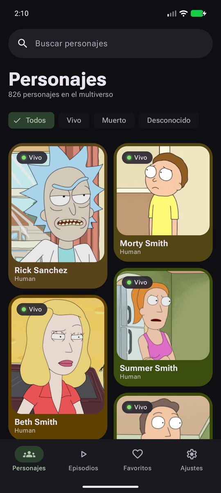 | 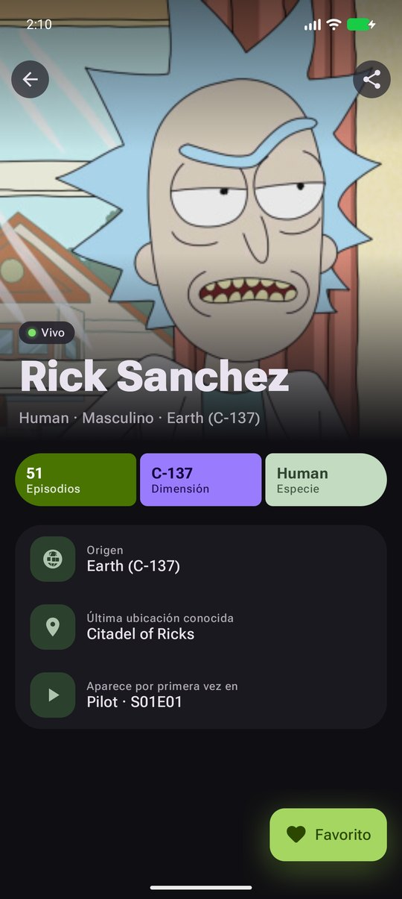 | 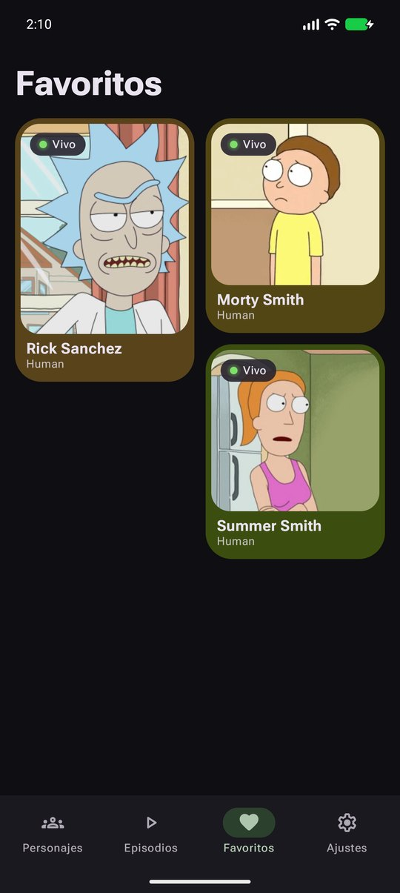 | 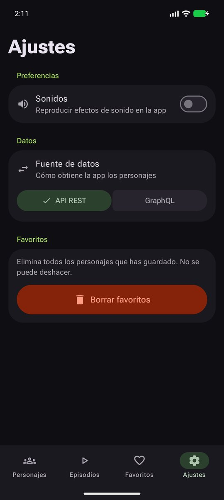 |
| **iOS** | 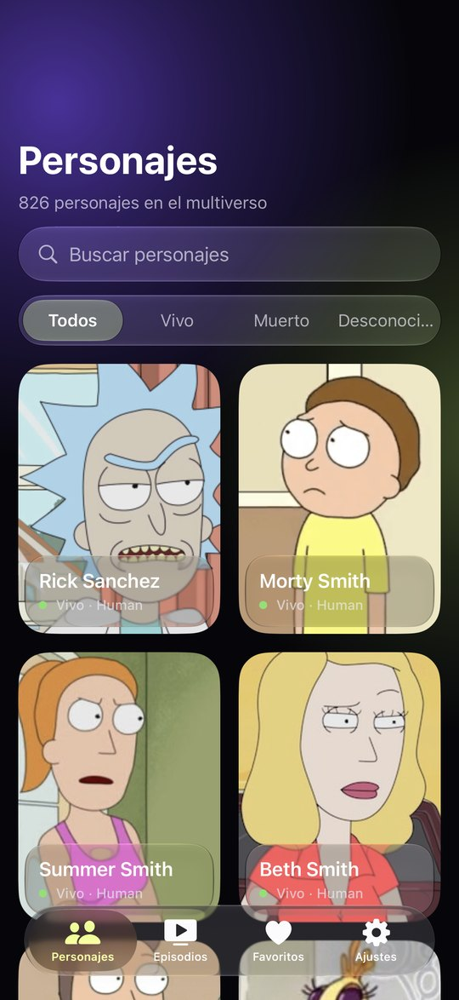 | 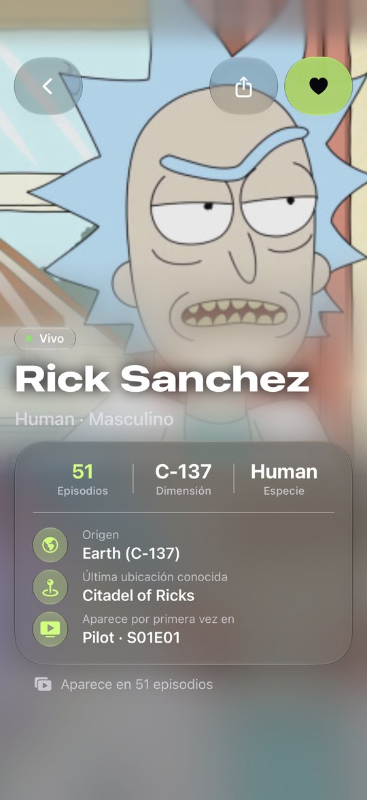 | 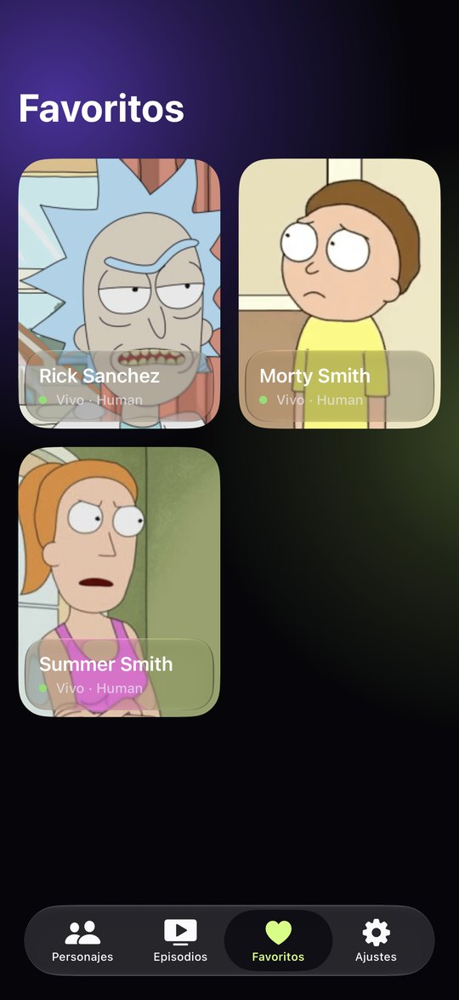 | 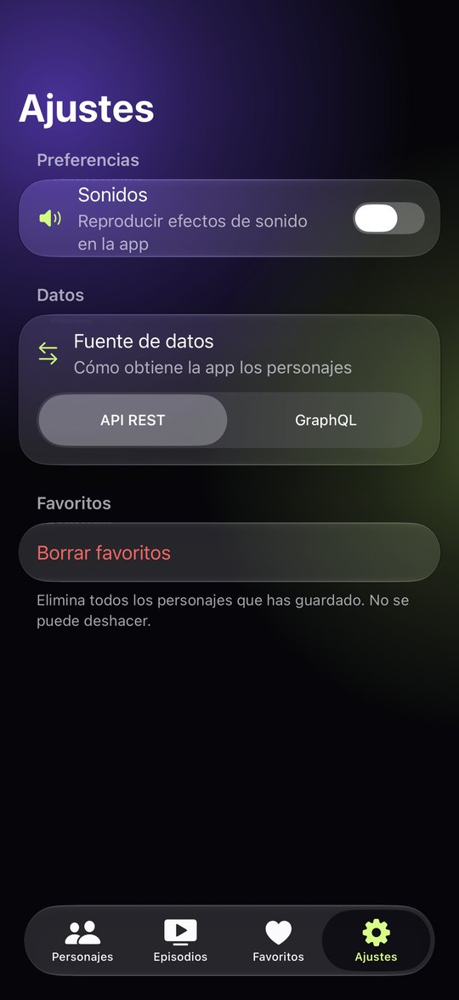 |

| | Splash | Episodios (provisional) |
| --- | --- | --- |
| **Android** | 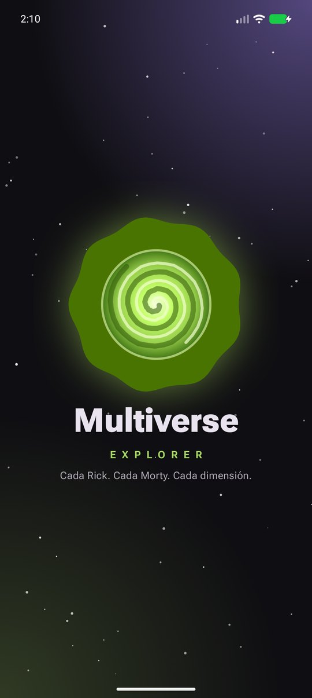 | 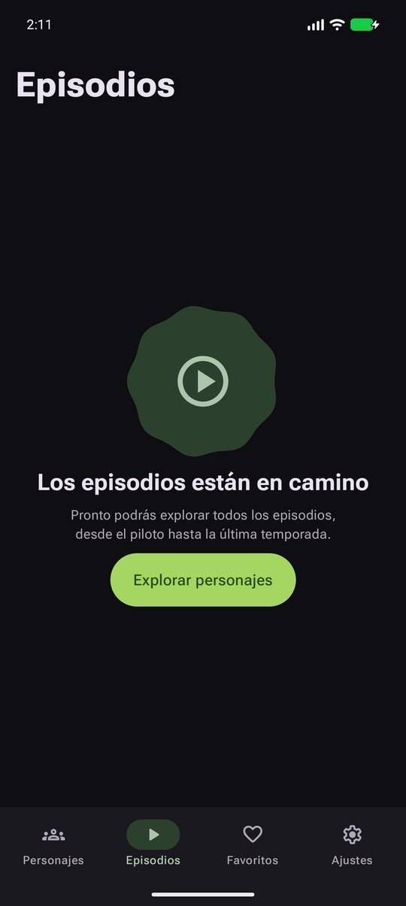 |
| **iOS** | 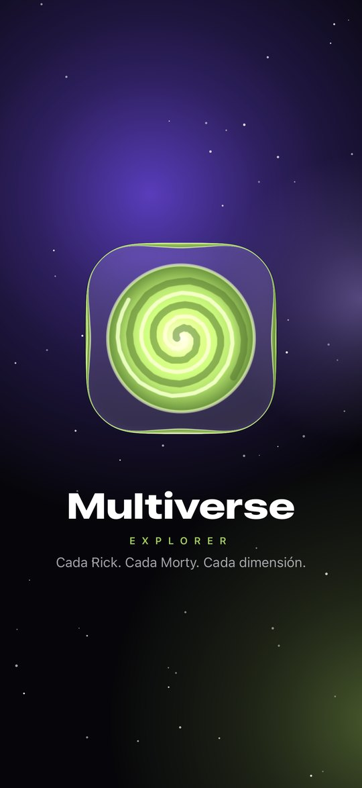 | 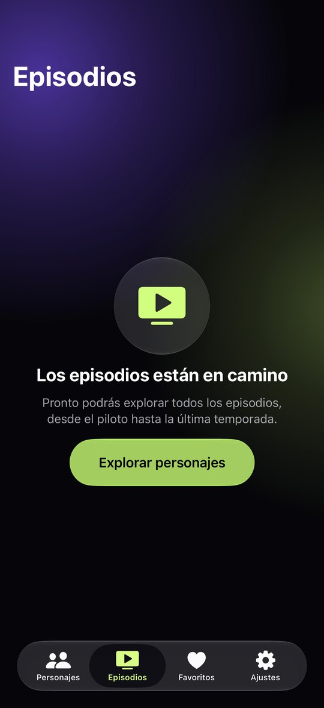 |

La especificación visual es [`docs/UI_SPEC.md`](docs/UI_SPEC.md). Enlaza cada componente con su nodo de Figma, y las exportaciones del diseño están confirmadas en [`docs/figma/`](docs/figma/README.md).

## 4. Arquitectura en breve

Clean Architecture con flujo de datos unidireccional, en Kotlin Multiplatform:

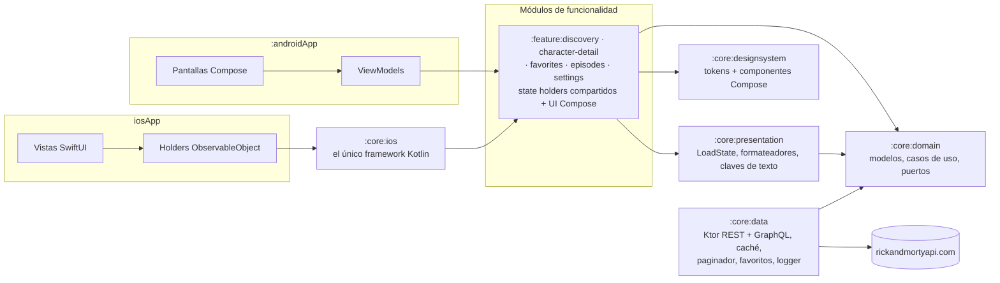

- **Las dependencias apuntan hacia dentro:** funcionalidades → core → dominio. `:core:domain` no tiene dependencias de frameworks, HTTP ni UI, y ningún módulo de funcionalidad depende de otro.
- **Frontera API/IMPL ([`ADR-0014`](docs/adr/0014-api-impl-boundary.md)):** las funcionalidades dependen solo de `:core:domain` y nunca de `:core:data`. Las raíces de composición — `:androidApp` y, para iOS, `:core:ios` — conectan las implementaciones, así que ningún tipo HTTP ni de almacenamiento llega al código de una funcionalidad.
- **Partes compartidas y nativas:** el state holder, el reducer y el contrato de estado de UI de cada funcionalidad son Kotlin compartido. La UI es nativa: Compose en el `androidMain` de cada funcionalidad y SwiftUI en `iosApp`, que envuelve los holders compartidos en `ObservableObject`s.
- **Dos módulos de soporte:** `:core:diagnostics` es una API de diagnóstico solo de depuración que las builds de release nunca enlazan, y `:core:testing` contiene los fakes y fixtures compartidos.
- **Más detalle:** la tabla completa de módulos, las reglas de dependencia y el diagrama de clases están en [`docs/DESIGN.md`](docs/DESIGN.md), y la justificación en [`docs/adr/0001-module-boundaries.md`](docs/adr/0001-module-boundaries.md).

## 5. Estructura del repositorio

```text
.
├── androidApp/              # App Android: activity, shell de navegación, grafo Koin, Coil, splash, sonido
├── core/
│   ├── domain/              # Modelos, casos de uso y puertos; sin tipos de framework, HTTP ni UI
│   ├── data/                # Clientes Ktor REST y GraphQL, DTOs, caché, paginador, favoritos, logger
│   ├── presentation/        # Primitivas de estado de UI, formateadores y claves de texto compartidas
│   ├── designsystem/        # Tokens, tema, componentes Compose y sus previews de Android
│   ├── ios/                 # Exporta el único framework Kotlin que enlaza la app iOS
│   ├── diagnostics/         # API de diagnóstico solo de depuración
│   └── testing/             # Fakes, fixtures y arnés de tests compartidos
├── feature/
│   ├── discovery/           # Listado de personajes: búsqueda, filtro de estado, paginación
│   ├── character-detail/    # Detalle de personaje, enriquecimiento de episodios, favorito
│   ├── favorites/           # Personajes favoritos
│   ├── episodes/            # Pantalla provisional diseñada
│   └── settings/            # Sonidos, fuente de datos, borrar favoritos
├── iosApp/                  # App SwiftUI: App, DesignSystem, Features, ImagePipeline, Tests (proyecto XcodeGen)
├── build-logic/             # Plugins de convención de Gradle y comprobaciones de política
├── gradle/                  # Catálogo de versiones, wrapper, JDK del daemon, registro de dependency-advice
├── tools/                   # Versiones fijadas de herramientas Swift y scripts de lint, versión y notas de release
├── .github/workflows/       # Puerta de pull request y la sonda semanal del contrato en vivo
├── docs/                    # Especificaciones, proceso, decisiones, exportaciones de diseño, capturas (§12)
├── assessment.md            # La prueba (autoritativa, congelada)
├── AGENTS.md                # Reglas de operación para agentes de IA
├── README.md · README.es.md # Este archivo en inglés y en español
└── VERSION                  # La única fuente de versión
```

Cada módulo de funcionalidad contiene sus propias capas de Clean Architecture como paquetes: `domain`, `presentation` (compartidas) y `ui` (Android). La suite del contrato en vivo es un source set de `:core:data` que solo ejecuta el workflow semanal. Ver [`docs/DESIGN.md`](docs/DESIGN.md) §3.

## 6. Requisitos previos

| Herramienta | Versión | Notas |
| --- | --- | --- |
| JDK | 17 o posterior para arrancar Gradle | El daemon de compilación usa JDK 25, que Gradle aprovisiona por sí mismo (`gradle/gradle-daemon-jvm.properties`) |
| Android SDK | Plataforma 37 (Android 17), build tools actuales | Se localiza mediante `local.properties` (`sdk.dir`) o `ANDROID_HOME` |
| Xcode | 27.0 | La toolchain que fija `tools/swift-tools.lock`; el SDK de iOS 26+ aporta las APIs de Liquid Glass |
| XcodeGen | 2.46.0 | Solo para regenerar `iosApp/MultiverseExplorer.xcodeproj` a partir de `iosApp/project.yml` |
| SwiftLint | 0.65.1 | Lo descarga y verifica por checksum `tools/swift-tools-setup.sh`; sin instalación manual |
| Kotlin | 2.4.20 | Lo aporta el build de Gradle; no hace falta instalarlo |

No se necesita clave de API, cuenta ni credencial: la API de Rick and Morty es pública, sin autenticación y de solo lectura.

## 7. Puesta en marcha

```bash
git clone https://github.com/davidru85/RickAndMorty.git
cd RickAndMorty
```

El wrapper de Gradle está confirmado (Gradle 9.7.0, con el checksum de la distribución fijado), así que no hace falta instalar Gradle aparte. No hay nada más que configurar: el host de la API es una constante de compilación, la raíz de paquetes se declara una vez en `gradle.properties`, y no hace falta ningún archivo de propiedades, keystore ni variable de entorno aparte de la ubicación del Android SDK.

## 8. Compilar y ejecutar

> Cada comando de abajo lleva la fecha en que se ejecutó y el resultado observado. Etiquetar y publicar una release sigue siendo acción del propietario (`DEC-049`).

| Tarea | Comando | Estado |
| --- | --- | --- |
| Listar el conjunto de módulos | `./gradlew projects` | Ejecutado el 2026-10-06: 13 módulos (siete de core, cinco de funcionalidad y la app Android) en 16 proyectos de Gradle, contando la raíz y los contenedores `:core` y `:feature` |
| Compilar todos los módulos, Android y las klibs de iOS | `./gradlew assemble` · `./gradlew build` | Ejecutado el 2026-10-06: `./gradlew build --continue` BUILD SUCCESSFUL |
| Compilar la app Android de depuración | `./gradlew :androidApp:assembleDebug` | Ejecutado el 2026-10-06: correcto |
| Instalar y ejecutar en un dispositivo o emulador conectado | `./gradlew :androidApp:installDebug` | Ejecutado el 2026-10-06: instalada en el emulador con API 37 y lanzada; `MainActivity` quedó en primer plano sin registro de crash. La misma build cargó los 826 personajes de Discovery para las capturas de §3 |
| Compilar el framework compartido para iOS | `./gradlew :core:ios:linkDebugFrameworkIosSimulatorArm64` | Ejecutado el 2026-10-06: BUILD SUCCESSFUL. Genera el único `MultiverseExplorer.framework` estático que enlaza la app iOS: las cinco funcionalidades, `:core:domain` y `:core:presentation`, y ningún tipo de `:core:data` (`DEC-058`, `DEC-091`, [`ADR-0012`](docs/adr/0012-ios-framework-export.md)). El paso previo de compilación de la app lo enlaza para el SDK y la configuración activos, así que Xcode lo ejecuta en cada build |
| Compilar la app iOS | `xcodebuild -project iosApp/MultiverseExplorer.xcodeproj -scheme MultiverseExplorer -destination 'platform=iOS Simulator,name=iPhone 17,OS=27.0' build` | Ejecutado el 2026-10-06: la compila la ejecución de `xcodebuild test` de §9 (TEST SUCCEEDED). Una build de release para dispositivo (`-configuration Release -destination 'generic/platform=iOS' CODE_SIGNING_ALLOWED=NO`) también compila, con `CFBundleShortVersionString` 0.2.0 desde `VERSION` y `MinimumOSVersion` 18.0. `iosApp/MultiverseExplorer.xcodeproj` se genera desde `iosApp/project.yml` con XcodeGen 2.46.0 y está confirmado |
| Ejecutar la app iOS | Abre `iosApp/MultiverseExplorer.xcodeproj` en Xcode y ejecuta el esquema `MultiverseExplorer` en un simulador de iOS. Desde la línea de comandos, tras compilar: `xcrun simctl install booted "$(find ~/Library/Developer/Xcode/DerivedData -path '*Debug-iphonesimulator/MultiverseExplorer.app' -maxdepth 6 \| head -1)"` y después `xcrun simctl launch booted io.github.davidru85.multiverse.app` | Ejecutado el 2026-10-06 desde la línea de comandos, en el simulador del iPhone 17 (iOS 27.0): la app arrancó y Discovery cargó 826 personajes |

**Integración continua (`DEC-112`).** `.github/workflows/pull-request.yml` ejecuta trabajos independientes en cada pull request y en cada push a `main`: una comprobación por módulo, los tests de la app, la verificación del APK, la suite de build-logic, las políticas del repositorio, la salud de dependencias, el replay del contrato y el trabajo `ios` en un runner con Xcode 27. El resultado obligatorio `android` solo pasa cuando todos los trabajos de Linux terminan bien. El trabajo `ios` se ejecuta en cada pull request, pero volver a hacerlo obligatorio es un paso del propietario (`TASK-108`).

## 9. Comandos de test y calidad

Cada pull request debe pasar la suite completa en las dos plataformas antes de poder aprobarse (`DEC-054`). Las definiciones de Ready, Done y la puerta de merge están en [`docs/DEFINITION.md`](docs/DEFINITION.md), y la estrategia de tests en [`docs/TESTING.md`](docs/TESTING.md). La puerta local completa es `./gradlew check buildHealth --continue`: el 2026-10-06 ejecutó 1.380 tests con 0 fallos.

| Tarea | Comando | Estado |
| --- | --- | --- |
<!-- local-gate:begin -->
| Todos los tests compartidos y unitarios, más la suite de regresión de build-logic | `./gradlew allTests :build-logic:convention:test` | Ejecutado el 2026-10-06: BUILD SUCCESSFUL. Ejecuta las suites compartidas en el target de test de host JVM y en el target del simulador de Apple (por ejemplo `:core:testing:testAndroidHostTest` y `:core:testing:iosSimulatorArm64Test`), y la suite de regresión de build-logic en la build incluida |
| Formato, análisis estático y comprobación de dependencias | `./gradlew ktlintCheck lintDebug buildHealth` | Ejecutado el 2026-10-06: ktlint, Android Lint y `buildHealth` pasan, y el informe del análisis de dependencias está vacío (`DEC-075`, `DEC-077`) |
| Fronteras de módulos y política de versiones | `./gradlew verifyModuleBoundaries verifyDependencyPolicy verifyNoLiveHosts verifyWorkflowGate` | Ejecutado el 2026-10-06: todo pasa. Se comprueban 16 proyectos frente a `R1`–`R18` y `S1`–`S3`, incluidas las aristas heredadas efectivas, la regla de solo Compose para `:core:designsystem` y que `:core:diagnostics` solo se enlace desde configuraciones de depuración. `VERSION` se valida, y no hay ningún artefacto de analítica en el catálogo ni en el grafo de release de la app (`TEST-UNIT-034`) |
| Verificar la política de dependencias (versiones exactas, justificación, inventario, `VERSION` único, sin analítica) | `./gradlew verifyDependencyPolicy` | Ejecutado el 2026-10-06: pasa. También se ejecuta dentro de `./gradlew check` y `./gradlew build` |
| Suite de contrato en modo fixture/replay en el target de host Android (el paso de contrato del trabajo `android`) | `./gradlew :core:data:contractTestReplayAndroidHost` | Ejecutado el 2026-10-06: ejecuta exactamente los casos `TEST-CONTRACT-*` (35, de REST y GraphQL, 0 fallos), y falla si su target no ejecuta ninguno (`DEC-073`, `DEC-090`) |
| Verificar la higiene del repositorio y de secretos | `./gradlew verifyRepositoryHygiene` | Ejecutado el 2026-10-06: pasa con 0 hallazgos sobre el conjunto de trabajo, cada blob alcanzable y cada ruta histórica única. También se ejecuta dentro de `./gradlew check` y `./gradlew build` |
<!-- local-gate:end -->
| Verificación de capturas Android (todas las referencias confirmadas) | `./gradlew :core:designsystem:verifyRoborazziDebug :androidApp:verifyRoborazziDebug :feature:discovery:verifyRoborazziAndroidHostTest :feature:character-detail:verifyRoborazziAndroidHostTest :feature:favorites:verifyRoborazziAndroidHostTest :feature:settings:verifyRoborazziAndroidHostTest` | Ejecutado el 2026-10-06 dentro de `./gradlew check`: pasan las 54 referencias confirmadas. Cubren el catálogo de componentes, cada estado de `ERROR_FLOW.md`, las superficies de las funcionalidades y el shell, cada una capturada con el sistema en claro y en oscuro y probadas idénticas byte a byte (`TEST-UI-012`, `TEST-UI-016`). Los módulos KMP usan el nombre de variante `AndroidHostTest`; `:androidApp` y `:core:designsystem` usan `Debug` |
| Grabar nuevas capturas de referencia (revisa el diff antes de confirmar) | `./gradlew :core:designsystem:recordRoborazziDebug :androidApp:recordRoborazziDebug :feature:discovery:recordRoborazziAndroidHostTest :feature:character-detail:recordRoborazziAndroidHostTest :feature:favorites:recordRoborazziAndroidHostTest :feature:settings:recordRoborazziAndroidHostTest` | Escribe las referencias en `src/*/snapshots/` de cada módulo. Ejecútalo solo para un estado que exista y sea correcto (`TESTING.md` §8.2) |
| Capturas, state holders y tests de pantalla de iOS | `xcodebuild test -project iosApp/MultiverseExplorer.xcodeproj -scheme MultiverseExplorer -destination 'platform=iOS Simulator,name=iPhone 17,OS=27.0'` | Ejecutado el 2026-10-06: 173 tests, 0 fallos, incluidas las 18 referencias confirmadas, grabadas en ese dispositivo y runtime (`TESTING.md` §8.3). El trabajo `ios` ejecuta el mismo comando |
| Formato y lint de Swift | `sh tools/swift-lint.sh iosApp` | Ejecutado el 2026-10-06: swift-format `--strict` queda limpio, y SwiftLint informa de 0 incidencias en 87 archivos |
| Benchmarks de rendimiento (requiere dispositivo) | `./gradlew :benchmark:connectedCheck` | No definido: no existe módulo de benchmark y `PERF-Q1` sigue sin resolver, así que el comando es estado objetivo y no una tarea real |
| Suite de contrato en modo fixture/replay en el target del simulador de Apple, y en ambos targets | `./gradlew :core:data:contractTestReplayIosSimulator` · `./gradlew :core:data:contractTestReplay` | Ejecutado el 2026-10-06: 35 casos de contrato en `iosSimulatorArm64Test`, y 70 entre ambos targets para el agregado. El trabajo `ios` ejecuta el punto de entrada del simulador en cada pull request. Cada punto de entrada verifica los informes de su propio target, así que un informe de host nunca cubre el nativo |
| Sondas de observación en vivo contra la API (señal programada, no bloquea el merge) | `./gradlew :core:data:contractLiveProbe` | Ejecutado el 2026-10-02: registró los totales publicados y el número de páginas (`TASK-027`, `DEC-074`). `.github/workflows/contract-live.yml` lo ejecuta cada semana y sube las capturas, y ningún workflow de pull request ni de push puede alcanzarlo |

El desarrollo sigue el protocolo TDD de [`docs/CONTRIBUTING.md`](docs/CONTRIBUTING.md): escribe el test que falla y confírmalo (`test:`), haz que pase y confírmalo (`feat:`/`fix:`), refactoriza y confírmalo (`refactor:`), y después haz push.

## 10. Configuración

| Elemento | Valor | Dónde |
| --- | --- | --- |
| Endpoints de la API | REST `https://rickandmortyapi.com/api/` y GraphQL `https://rickandmortyapi.com/graphql`, en el único host permitido | Constante de compilación; no se descubre en tiempo de ejecución (`REQ-SEC-001`) |
| Versión de la app | `0.2.0`, desde el único archivo `VERSION`. El `versionName` de Android es ese valor literal; el `CFBundleShortVersionString` de iOS se deriva de él mediante el `iosApp/App/Version.xcconfig` generado, que el trabajo `ios` comprueba con `tools/ios-version.sh --check` | `DEC-043`, `DEC-067`, `DEC-121` |
| Protocolo remoto | Se entregan los dos, y el usuario elige uno en Ajustes: API REST (por defecto) o GraphQL, con el mismo cliente Ktor | `DEC-056`, [`docs/API_SPECS.md`](docs/API_SPECS.md) §2 |
| Frescura de caché | 24 h fresco, 7 d de revalidación en segundo plano, 30 d de respaldo sin conexión | `DEC-012` |
| Publicación | Una etiqueta `vMAJOR.MINOR.PATCH` y una GitHub Release con el APK adjunto. `v0.1.0` y `v0.2.0` están etiquetadas; sus Releases aún no se han publicado | `DEC-043` |

## 11. Limitaciones conocidas

1. **Las imágenes son de 300 × 300.** La API publica un único avatar cuadrado por personaje y nada mayor. El hero del detalle reescala la fuente; los degradados y el fondo desenfocado de iOS hacen de ello una elección estilística y no un defecto visible ([`docs/UI_SPEC.md`](docs/UI_SPEC.md) §5.3, `CON-002`).
2. **Una pestaña es provisional.** Episodios es una pantalla diseñada de "próximamente"; Favoritos y Ajustes son reales (`DEC-005`, `DEC-055`).
3. **La búsqueda por voz no está implementada.** Está aplazada, y no se pide permiso de micrófono ni de reconocimiento de voz (`DEC-002`).
4. **Solo teléfono en vertical.** No hay diseño para tablet, plegables ni horizontal (`DEC-027`).
5. **Sin analítica.** No hay, de forma intencionada, ningún SDK de analítica, seguimiento ni publicidad (`REQ-OBS-003`).
6. **Se entrega exactamente un artefacto preliminar.** Material 3 Expressive `1.5.0-alpha29` está fijado en el catálogo de versiones y lo declaran `:core:designsystem` y tres módulos de funcionalidad (`:feature:character-detail`, `:feature:discovery`, `:feature:settings`), así que la app Android lo contiene. El riesgo aceptado y el plan alternativo están en [`docs/adr/0008-alpha-dependencies.md`](docs/adr/0008-alpha-dependencies.md). Ese ADR dice que solo el sistema de diseño lo declara, una regla que esos tres módulos aún no cumplen (`CONF-84`, abierto con el propietario).
7. **La API no tiene versiones.** Su forma puede cambiar sin aviso, así que la sonda del contrato en vivo se ejecuta cada semana fuera de la puerta de merge (`DEC-029`).
8. **Los presupuestos de rendimiento en dispositivo aún no se han medido.** Los presupuestos y su método de medida existen, pero el dispositivo de referencia sigue siendo una suposición pendiente en [`docs/PERFORMANCE.md`](docs/PERFORMANCE.md). La puerta de merge mide el tamaño del APK de release y comprueba cero llamadas de red con una página en caché (`DEC-115`).
9. **iOS 18 es el mínimo declarado pero no se ha ejecutado.** La app apunta a iOS 18.0, y su alternativa sin vidrio tiene tests de captura mediante una costura en el simulador de iOS 27. No existe ninguna ejecución en simulador ni dispositivo con iOS 18, porque Xcode 27 no ofrece runtime de iOS 18 (`DEC-117`). La app iOS no está firmada ni distribuida.
10. **Hay dos defectos de visualización abiertos.** Con el tamaño de texto dinámico más grande de iOS, el título "Sounds" de Ajustes se parte dentro de la palabra (`GAP-049`). El error a pantalla completa del detalle en Android, un fallo sin nada en caché, dibuja su ilustración sin el logotipo del portal (`GAP-050`). Ambos están registrados en [`docs/DOCUMENTATION_AUDIT.md`](docs/DOCUMENTATION_AUDIT.md).

## 12. Índice de documentación

| Documento | Propósito | Destinatarios |
| --- | --- | --- |
| [`assessment.md`](assessment.md) | La prueba. Prevalece sobre todo en caso de conflicto | Todos |
| [`AGENTS.md`](AGENTS.md) | Reglas de operación para agentes de IA: precedencia, permisos, escalado | Agentes de IA, colaboradores |
| [`docs/REQUIREMENTS.md`](docs/REQUIREMENTS.md) | Requisitos, criterios de aceptación, alcance, riesgos | Producto, desarrollo, QA |
| [`docs/DESIGN.md`](docs/DESIGN.md) | Arquitectura, módulos, contratos de estado, navegación | Desarrollo |
| [`docs/API_SPECS.md`](docs/API_SPECS.md) | Contrato remoto, DTOs, errores, política de caché | Desarrollo, revisores de API |
| [`docs/UI_SPEC.md`](docs/UI_SPEC.md) | Tokens, componentes, pantallas, movimiento, accesibilidad | Diseño, desarrollo, QA |
| [`docs/CONTRACTS.md`](docs/CONTRACTS.md) | Interfaces internas e invariantes | Desarrollo |
| [`docs/ERROR_FLOW.md`](docs/ERROR_FLOW.md) | Cada fallo asociado a un estado y un texto | Desarrollo, QA |
| [`docs/PERFORMANCE.md`](docs/PERFORMANCE.md) | Presupuestos y cómo se miden | Desarrollo, revisores |
| [`docs/OBSERVABILITY.md`](docs/OBSERVABILITY.md) | Contrato de logging, redacción, diagnósticos de depuración | Desarrollo, seguridad |
| [`docs/SECURITY.md`](docs/SECURITY.md) | Modelo de amenazas, privacidad, registro de avisos | Revisores de seguridad |
| [`docs/TESTING.md`](docs/TESTING.md) | Estrategia de tests, herramientas, trazabilidad de requisitos | Desarrollo, QA |
| [`docs/DEFINITION.md`](docs/DEFINITION.md) | Puertas de Ready, Done, release y documentación | Todos |
| [`docs/GUIDELINES.md`](docs/GUIDELINES.md) | Convenciones de código y cómo se hacen cumplir | Desarrollo |
| [`docs/CONTRIBUTING.md`](docs/CONTRIBUTING.md) | Puesta en marcha, ramas, PRs, revisión | Colaboradores |
| [`docs/TECHNICAL_PLAN.md`](docs/TECHNICAL_PLAN.md) | Hitos, secuencia, puertas de calidad | Revisores, planificación |
| [`docs/BACKLOG.md`](docs/BACKLOG.md) | Índice de trabajo con aceptación por tarea | Revisores, desarrollo |
| [`docs/DECISION_BOARD.md`](docs/DECISION_BOARD.md) | Cada decisión, su estado y su ADR | Revisores |
| [`docs/adr/`](docs/adr/) | Justificación de las decisiones de arquitectura relevantes | Revisores |
| [`docs/PROJECT_LOG.md`](docs/PROJECT_LOG.md) | Registro cronológico de por qué cambiaron las cosas | Todos |
| [`docs/HANDOFF.md`](docs/HANDOFF.md) | Estado actual y próximos pasos | Desarrollador o agente entrante |
| [`docs/DOCUMENTATION_AUDIT.md`](docs/DOCUMENTATION_AUDIT.md) | Inventario, responsables, huecos abiertos | Responsable de documentación |
| [`docs/figma/`](docs/figma/README.md) | Las exportaciones del diseño de Figma y de los tokens | Diseño, revisores |
| [`docs/screenshots/`](docs/screenshots/) | Capturas de las apps en ejecución, en inglés y en español | Todos |
| [`docs/templates/`](docs/templates/) | Plantillas de trabajo para artefactos recurrentes | Colaboradores |

No creados de forma deliberada, con los motivos en [`docs/DECISION_BOARD.md`](docs/DECISION_BOARD.md) §3: `ARCHITECTURE.md` (integrado en `DESIGN.md`), `SPECIFICATION.md` (duplicaría los requisitos), `ANALYTICS.md` (no hay analítica; lo sustituye `OBSERVABILITY.md`), `SECURITY_ADVISORY_REGISTER.md` (por ahora una sección de `SECURITY.md`), `CHANGELOG.md` (lo sustituyen `PROJECT_LOG.md` y las notas de release generadas).

## 13. Contribuir

Empieza por [`docs/CONTRIBUTING.md`](docs/CONTRIBUTING.md) para la puesta en marcha, las convenciones de ramas y commits, la plantilla de pull request y las comprobaciones obligatorias. Las convenciones de código están en [`docs/GUIDELINES.md`](docs/GUIDELINES.md); la definición de terminado, en [`docs/DEFINITION.md`](docs/DEFINITION.md).

El trabajo se indexa en [`docs/BACKLOG.md`](docs/BACKLOG.md) y se sigue como GitHub Issues. Comunica las vulnerabilidades de forma privada por la vía de [`docs/SECURITY.md`](docs/SECURITY.md), nunca en una issue pública.

## 14. Estado del proyecto

| Área | Estado |
| --- | --- |
| Análisis de la prueba | Completo — [`docs/REQUIREMENTS.md`](docs/REQUIREMENTS.md) |
| Contrato remoto | Completo, verificado contra la API en vivo y sondeado cada semana — [`docs/API_SPECS.md`](docs/API_SPECS.md) |
| Arquitectura y decisiones | Completas — [`docs/DESIGN.md`](docs/DESIGN.md), 15 ADR en [`docs/adr/`](docs/adr/), y de `DEC-001` a `DEC-165` en [`docs/DECISION_BOARD.md`](docs/DECISION_BOARD.md) |
| Especificación visual | Completa — [`docs/UI_SPEC.md`](docs/UI_SPEC.md), con 32 exportaciones de Figma en [`docs/figma/`](docs/figma/README.md) |
| Núcleo compartido y app Android | Terminados — bloques B1–B6; hito M1 etiquetado `v0.1.0` |
| App iOS | Terminada — bloques B7–B8; hito M2 etiquetado `v0.2.0` |
| Endurecimiento y traspaso | Terminados — bloque B9 |
| Desde `v0.2.0` | Integrado en `main`: la corrección de la revisión de código (`TASK-111`…`TASK-126`), las correcciones de la auditoría del propietario (`TASK-127`…`TASK-138`), el sonido de selección (`TASK-139`) y las previews de todas las vistas (`TASK-140`) |
| Tests | 1.380 tests de Gradle y 173 tests de iOS, 0 fallos (2026-10-06); 54 capturas de referencia Android y 18 iOS |
| CI | Todas las comprobaciones se ejecutan en cada pull request; `android` es el contexto obligatorio, e `ios` se ejecuta sin ser obligatorio (§8) |
| Releases | Etiquetas `v0.1.0` y `v0.2.0`; sus GitHub Releases aún no se han publicado (`DEC-049`) |
| Pendiente | `CONF-84`, `GAP-049` y `GAP-050`, y la evidencia de §11 que solo da un dispositivo — ver [`docs/HANDOFF.md`](docs/HANDOFF.md) |

## 15. Inventario de dependencias

`gradle/libs.versions.toml` es la única fuente de toda versión externa (DEC-060). Fija el **inventario previsto antes de su primer uso**, de modo que una entrada puede existir antes de la tarea que la declara; la tabla siguiente es su contrapartida para quien revisa, y `./gradlew verifyDependencyPolicy` la comprueba contra el catálogo y los scripts de build.

- **Declared** — al menos un script de build referencia la entrada, por lo que está en el grafo resuelto.
- **Pinned** — la entrada está en el catálogo pero ningún script la referencia todavía; queda fijada antes de su uso para la tarea indicada en "Planned for" (DEC-060).

Dos notaciones en "Declared by":

- `:` es el script de build raíz, que pone un plugin en el classpath de build con `apply false`; los plugins de convención lo aplican después por id.
- `:build-logic:convention` es el build de los plugins de convención, que compila contra las APIs de los plugins de Gradle.

La justificación de cada entrada — la necesidad que cubre, la alternativa que sustituye y la fuente primaria con su fecha de verificación — está en [`docs/DESIGN.md`](docs/DESIGN.md) §3.5. Ejecuta `./gradlew verifyDependencyPolicy` para verificar los pines, la justificación y esta tabla (`TEST-UNIT-013`, `TEST-UNIT-014`, `TEST-UNIT-051`).

<!-- dependency-inventory:begin -->

| Entrada | Artefacto o id de plugin | Versión | Estado | Declarada en | Prevista para |
| --- | --- | --- | --- | --- | --- |
| `libs.android.gradle.plugin` | `com.android.tools.build:gradle` | `9.3.1` | Declared | `:build-logic:convention` | — |
| `libs.kotlin.gradle.plugin` | `org.jetbrains.kotlin:kotlin-gradle-plugin` | `2.4.20` | Declared | `:build-logic:convention` | — |
| `libs.ktlint.gradle` | `org.jlleitschuh.gradle:ktlint-gradle` | `14.2.0` | Declared | `:build-logic:convention` | TASK-029 |
| `libs.snakeyaml.engine` | `org.snakeyaml:snakeyaml-engine` | `2.10` | Declared | `:build-logic:convention` | TASK-098 |
| `libs.kotlinx.serialization.core` | `org.jetbrains.kotlinx:kotlinx-serialization-core` | `1.11.0` | Declared | `:core:data`, `:feature:character-detail`, `:feature:discovery`, `:feature:episodes`, `:feature:favorites`, `:feature:settings` | — |
| `libs.kotlinx.serialization.json` | `org.jetbrains.kotlinx:kotlinx-serialization-json` | `1.11.0` | Declared | `:androidApp`, `:core:data`, `:core:designsystem` | TASK-027, TASK-037, TASK-042 |
| `libs.kotlinx.coroutines.core` | `org.jetbrains.kotlinx:kotlinx-coroutines-core` | `1.11.0` | Declared | `:core:data`, `:core:diagnostics`, `:core:domain`, `:core:presentation`, `:core:testing`, `:feature:character-detail`, `:feature:discovery`, `:feature:favorites`, `:feature:settings` | TASK-036 (CONF-47), TASK-112 |
| `libs.kotlinx.coroutines.test` | `org.jetbrains.kotlinx:kotlinx-coroutines-test` | `1.11.0` | Declared | `:androidApp`, `:core:data`, `:core:diagnostics`, `:core:presentation`, `:core:testing`, `:feature:character-detail`, `:feature:discovery`, `:feature:favorites`, `:feature:settings` | TASK-006, TASK-024, TASK-112 |
| `libs.kotlin.test` | `org.jetbrains.kotlin:kotlin-test` | `2.4.20` | Declared | `:build-logic:convention`, `:core:data`, `:core:diagnostics`, `:core:domain`, `:core:presentation`, `:core:testing`, `:feature:character-detail`, `:feature:discovery`, `:feature:favorites`, `:feature:settings` | TASK-006, TASK-024, TASK-091 |
| `libs.kotlin.test.junit` | `org.jetbrains.kotlin:kotlin-test-junit` | `2.4.20` | Declared | `:core:data`, `:core:diagnostics`, `:core:domain`, `:core:presentation`, `:core:testing`, `:feature:character-detail`, `:feature:discovery`, `:feature:favorites`, `:feature:settings` | TASK-006, TASK-027, TASK-029 |
| `libs.ktor.client.core` | `io.ktor:ktor-client-core` | `3.6.0` | Declared | `:core:data`, `:core:diagnostics`, `:core:testing`, `:feature:character-detail` | TASK-024, TASK-037 |
| `libs.ktor.client.okhttp` | `io.ktor:ktor-client-okhttp` | `3.6.0` | Declared | `:core:data` | TASK-037 |
| `libs.ktor.client.darwin` | `io.ktor:ktor-client-darwin` | `3.6.0` | Declared | `:core:data` | TASK-037 |
| `libs.ktor.client.mock` | `io.ktor:ktor-client-mock` | `3.6.0` | Declared | `:core:data`, `:core:testing` | TASK-024, TASK-026 |
| `libs.ktor.http` | `io.ktor:ktor-http` | `3.6.0` | Declared | `:core:data`, `:core:testing`, `:feature:character-detail` | TASK-029 |
| `libs.ktor.utils` | `io.ktor:ktor-utils` | `3.6.0` | Declared | `:core:data` | — |
| `libs.okhttp` | `com.squareup.okhttp3:okhttp` | `5.5.0` | Declared | `:core:data` | TASK-020, TASK-037 |
| `libs.okhttp.mockwebserver` | `com.squareup.okhttp3:mockwebserver3` | `5.5.0` | Pinned | — | TASK-020, TASK-037 |
| `libs.koin.core` | `io.insert-koin:koin-core` | `4.2.2` | Declared | `:core:data`, `:feature:character-detail`, `:feature:discovery`, `:feature:favorites`, `:feature:settings` | TASK-044 |
| `libs.koin.android` | `io.insert-koin:koin-android` | `4.2.2` | Declared | `:androidApp`, `:feature:character-detail`, `:feature:discovery`, `:feature:favorites`, `:feature:settings` | TASK-001, TASK-002, TASK-006, TASK-044, TASK-074 |
| `libs.koin.androidx.compose` | `io.insert-koin:koin-androidx-compose` | `4.2.2` | Declared | `:androidApp`, `:feature:character-detail`, `:feature:discovery`, `:feature:favorites`, `:feature:settings` | TASK-001, TASK-002, TASK-006, TASK-044, TASK-074 |
| `libs.koin.compose` | `io.insert-koin:koin-compose` | `4.2.2` | Declared | `:feature:character-detail`, `:feature:discovery`, `:feature:favorites`, `:feature:settings` | TASK-001, TASK-002 |
| `libs.koin.core.viewmodel` | `io.insert-koin:koin-core-viewmodel` | `4.2.2` | Declared | `:feature:character-detail`, `:feature:discovery`, `:feature:favorites`, `:feature:settings` | TASK-001, TASK-002 |
| `libs.androidx.compose.bom` | `androidx.compose:compose-bom` | `2026.09.00` | Declared | `:androidApp`, `:core:designsystem` | TASK-043, TASK-044 |
| `libs.androidx.compose.runtime` | `androidx.compose.runtime:runtime` | `2026.09.00` (BOM) | Declared | `:androidApp`, `:core:designsystem`, `:feature:character-detail`, `:feature:discovery`, `:feature:episodes`, `:feature:favorites`, `:feature:settings` | TASK-008, TASK-043, TASK-044 |
| `libs.androidx.compose.ui` | `androidx.compose.ui:ui` | `2026.09.00` (BOM) | Declared | `:androidApp`, `:core:designsystem`, `:feature:character-detail`, `:feature:discovery`, `:feature:episodes`, `:feature:favorites`, `:feature:settings` | TASK-008, TASK-042, TASK-043, TASK-044 |
| `libs.androidx.compose.ui.geometry` | `androidx.compose.ui:ui-geometry` | `2026.09.00` (BOM) | Declared | `:feature:character-detail`, `:feature:settings` | TASK-046 |
| `libs.androidx.compose.ui.test` | `androidx.compose.ui:ui-test` | `2026.09.00` (BOM) | Declared | `:feature:character-detail`, `:feature:discovery`, `:feature:favorites`, `:feature:settings` | TASK-001, TASK-002, TASK-045 |
| `libs.androidx.compose.ui.text` | `androidx.compose.ui:ui-text` | `2026.09.00` (BOM) | Declared | `:feature:character-detail`, `:feature:discovery`, `:feature:settings` | TASK-001, TASK-002, TASK-008 |
| `libs.androidx.compose.foundation.layout` | `androidx.compose.foundation:foundation-layout` | `2026.09.00` (BOM) | Declared | `:feature:character-detail`, `:feature:discovery`, `:feature:episodes`, `:feature:favorites`, `:feature:settings` | TASK-001, TASK-002 |
| `libs.androidx.compose.ui.graphics` | `androidx.compose.ui:ui-graphics` | `2026.09.00` (BOM) | Declared | `:feature:character-detail`, `:feature:discovery`, `:feature:episodes`, `:feature:favorites`, `:feature:settings` | TASK-008 |
| `libs.androidx.compose.ui.unit` | `androidx.compose.ui:ui-unit` | `2026.09.00` (BOM) | Declared | `:feature:character-detail`, `:feature:discovery`, `:feature:settings` | TASK-001, TASK-002, TASK-008, TASK-113 |
| `libs.androidx.compose.foundation` | `androidx.compose.foundation:foundation` | `2026.09.00` (BOM) | Declared | `:androidApp`, `:core:designsystem`, `:feature:character-detail`, `:feature:discovery`, `:feature:favorites`, `:feature:settings` | TASK-001, TASK-006, TASK-043 |
| `libs.androidx.compose.animation` | `androidx.compose.animation:animation` | `2026.09.00` (BOM) | Declared | `:feature:character-detail` | TASK-009, TASK-113, TASK-137 |
| `libs.androidx.compose.animation.core` | `androidx.compose.animation:animation-core` | `2026.09.00` (BOM) | Declared | `:feature:character-detail`, `:feature:discovery` | TASK-001, TASK-009, TASK-113 |
| `libs.androidx.compose.ui.tooling.preview` | `androidx.compose.ui:ui-tooling-preview` | `2026.09.00` (BOM) | Declared | `:core:designsystem` | TASK-043, TASK-140 |
| `libs.androidx.compose.ui.tooling` | `androidx.compose.ui:ui-tooling` | `2026.09.00` (BOM) | Declared | `:androidApp`, `:core:designsystem`, `:feature:character-detail`, `:feature:discovery`, `:feature:episodes`, `:feature:favorites`, `:feature:settings` | TASK-043, TASK-140 |
| `libs.androidx.compose.ui.test.junit4` | `androidx.compose.ui:ui-test-junit4` | `2026.09.00` (BOM) | Declared | `:androidApp`, `:core:designsystem`, `:feature:character-detail`, `:feature:discovery`, `:feature:favorites`, `:feature:settings` | TASK-006, TASK-043, TASK-045, TASK-046 |
| `libs.androidx.compose.ui.test.manifest` | `androidx.compose.ui:ui-test-manifest` | `2026.09.00` (BOM) | Declared | `:androidApp`, `:core:designsystem`, `:feature:favorites`, `:feature:settings` | TASK-006, TASK-043, TASK-045 |
| `libs.androidx.compose.material3` | `androidx.compose.material3:material3` | `1.5.0-alpha29` | Declared | `:core:designsystem`, `:feature:character-detail`, `:feature:discovery`, `:feature:settings` | TASK-043 |
| `libs.androidx.activity.compose` | `androidx.activity:activity-compose` | `1.13.0` | Declared | `:androidApp` | TASK-044 |
| `libs.androidx.lifecycle.viewmodel` | `androidx.lifecycle:lifecycle-viewmodel` | `2.11.0` | Declared | `:feature:character-detail`, `:feature:discovery`, `:feature:favorites`, `:feature:settings` | TASK-001, TASK-002, TASK-006, TASK-074 |
| `libs.androidx.lifecycle.common` | `androidx.lifecycle:lifecycle-common` | `2.11.0` | Declared | `:feature:character-detail`, `:feature:discovery`, `:feature:favorites`, `:feature:settings` | TASK-001, TASK-002 |
| `libs.androidx.lifecycle.runtime.compose` | `androidx.lifecycle:lifecycle-runtime-compose` | `2.11.0` | Declared | `:feature:character-detail`, `:feature:discovery`, `:feature:favorites`, `:feature:settings` | TASK-001, TASK-002 |
| `libs.androidx.lifecycle.viewmodel.compose` | `androidx.lifecycle:lifecycle-viewmodel-compose` | `2.11.0` | Declared | `:feature:character-detail`, `:feature:discovery`, `:feature:favorites`, `:feature:settings` | TASK-001, TASK-002 |
| `libs.androidx.navigation.compose` | `androidx.navigation:navigation-compose` | `2.10.2` | Declared | `:androidApp` | TASK-008, TASK-044 |
| `libs.androidx.core.splashscreen` | `androidx.core:core-splashscreen` | `1.2.0` | Declared | `:androidApp` | TASK-007, TASK-044 |
| `libs.androidx.datastore.preferences` | `androidx.datastore:datastore-preferences` | `1.2.1` | Declared | `:core:data` | TASK-040, TASK-074 |
| `libs.coil.compose` | `io.coil-kt.coil3:coil-compose` | `3.6.3` | Declared | `:androidApp` | TASK-005, TASK-021 |
| `libs.coil.network.ktor3` | `io.coil-kt.coil3:coil-network-ktor3` | `3.6.3` | Declared | `:androidApp` | TASK-021, TASK-044 |
| `libs.junit4` | `junit:junit` | `4.13.2` | Declared | `:androidApp`, `:build-logic:convention`, `:core:designsystem`, `:feature:character-detail`, `:feature:discovery`, `:feature:favorites`, `:feature:settings` | TASK-006, TASK-024, TASK-042, TASK-045, TASK-091 |
| `libs.androidx.test.ext.junit` | `androidx.test.ext:junit` | `1.1.5` | Declared | `:feature:character-detail`, `:feature:discovery`, `:feature:favorites`, `:feature:settings` | TASK-002, TASK-042 |
| `libs.robolectric` | `org.robolectric:robolectric` | `4.17` | Declared | `:androidApp`, `:core:designsystem`, `:feature:character-detail`, `:feature:discovery`, `:feature:favorites`, `:feature:settings` | TASK-006, TASK-042, TASK-043, TASK-045, TASK-046 |
| `libs.robolectric.annotations` | `org.robolectric:annotations` | `4.17` | Declared | `:feature:character-detail`, `:feature:discovery`, `:feature:favorites`, `:feature:settings` | TASK-002, TASK-042 |
| `libs.robolectric.shadows.framework` | `org.robolectric:shadows-framework` | `4.17` | Declared | `:feature:character-detail`, `:feature:favorites`, `:feature:settings` | TASK-002, TASK-042 |
| `libs.roborazzi` | `io.github.takahirom.roborazzi:roborazzi` | `1.76.0` | Declared | `:androidApp`, `:core:designsystem`, `:feature:character-detail`, `:feature:discovery`, `:feature:favorites`, `:feature:settings` | TASK-029, TASK-045 |
| `libs.roborazzi.core` | `io.github.takahirom.roborazzi:roborazzi-core` | `1.76.0` | Declared | `:feature:character-detail`, `:feature:discovery`, `:feature:favorites`, `:feature:settings` | TASK-029, TASK-045 |
| `libs.roborazzi.compose` | `io.github.takahirom.roborazzi:roborazzi-compose` | `1.76.0` | Declared | `:androidApp`, `:core:designsystem` | TASK-029, TASK-045 |
| `libs.roborazzi.junit.rule` | `io.github.takahirom.roborazzi:roborazzi-junit-rule` | `1.76.0` | Declared | `:androidApp`, `:core:designsystem` | TASK-029, TASK-045 |
| `libs.plugins.kotlin.multiplatform` | `org.jetbrains.kotlin.multiplatform` | `2.4.20` | Declared | `:` | — |
| `libs.plugins.kotlin.serialization` | `org.jetbrains.kotlin.plugin.serialization` | `2.4.20` | Declared | `:`, `:androidApp`, `:core:data`, `:feature:character-detail`, `:feature:discovery`, `:feature:episodes`, `:feature:favorites`, `:feature:settings` | — |
| `libs.plugins.kotlin.compose` | `org.jetbrains.kotlin.plugin.compose` | `2.4.20` | Declared | `:`, `:androidApp`, `:core:designsystem`, `:feature:character-detail`, `:feature:discovery`, `:feature:episodes`, `:feature:favorites`, `:feature:settings` | TASK-043 |
| `libs.plugins.android.application` | `com.android.application` | `9.3.1` | Declared | `:` | — |
| `libs.plugins.android.library` | `com.android.library` | `9.3.1` | Declared | `:` | — |
| `libs.plugins.android.kotlin.multiplatform.library` | `com.android.kotlin.multiplatform.library` | `9.3.1` | Declared | `:` | — |
| `libs.plugins.roborazzi` | `io.github.takahirom.roborazzi` | `1.76.0` | Declared | `:androidApp`, `:core:designsystem`, `:feature:character-detail`, `:feature:discovery`, `:feature:favorites`, `:feature:settings` | TASK-029, TASK-045 |
| `libs.plugins.ktlint` | `org.jlleitschuh.gradle.ktlint` | `14.2.0` | Declared | `:` | — |
| `libs.plugins.dependency.analysis` | `com.autonomousapps.dependency-analysis` | `3.19.2` | Declared | `:` | — |
<!-- dependency-inventory:end -->

**Dependencias implícitas.** El plugin de Gradle de Kotlin añade `org.jetbrains.kotlin:kotlin-stdlib` a toda compilación Kotlin, por lo que aparece en el grafo resuelto sin entrada en el catálogo. La versión observada es `2.4.20`.

Las herramientas del lado iOS se fijan fuera de este inventario Gradle, en su ubicación real (DEC-076): SwiftLint `0.65.1` por versión exacta con el SHA-256 de su artefacto de release en `tools/swift-tools.lock`; swift-format por la versión de Xcode que lo incluye (Xcode 27.0 — `macos-latest` por sí solo no fija el toolchain); swift-snapshot-testing `1.19.2` por versión exacta en `iosApp/project.yml`, enlazado solo en el target de tests, con su resolución transitiva — swift-custom-dump `1.7.3`, swift-issue-reporting `2.1.1`, swift-syntax `604.0.0` — fijada en el `Package.resolved` versionado (DEC-024, DEC-025, DEC-032). XcodeGen `2.46.0` genera `iosApp/MultiverseExplorer.xcodeproj/project.pbxproj` desde `iosApp/project.yml`; regenerar la especificación sin cambios reproduce el archivo versionado.
