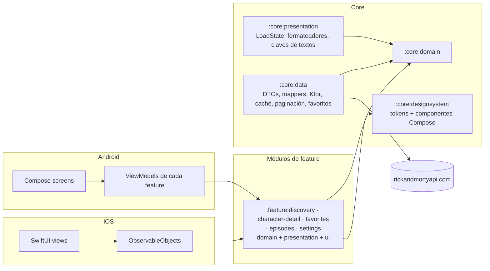

# Multiverse Explorer

- **Status / Estado:** Activo — el esqueleto de build de Gradle/KMP ya existe (TASK-014); la aplicación sigue siendo estado objetivo (ver [`docs/DOCUMENTATION_AUDIT.md`](docs/DOCUMENTATION_AUDIT.md) §5)
- **Last verified:** 2026-09-30
- **Owner / Responsable:** Delivery Planner (ver [`AGENTS.md`](AGENTS.md))
- **Authoritative for / Documento autoritativo para:** el punto de entrada del desarrollador — requisitos previos, comandos de compilación, ejecución, test y calidad, plataformas soportadas, limitaciones conocidas e índice de documentación.
- **No autoritativo para:** requisitos, arquitectura, contrato remoto, especificación visual ni proceso; cada uno se enlaza más abajo.
- **Entradas:** [`assessment.md`](assessment.md), [`docs/REQUIREMENTS.md`](docs/REQUIREMENTS.md), [`docs/DESIGN.md`](docs/DESIGN.md), [`docs/TECHNICAL_PLAN.md`](docs/TECHNICAL_PLAN.md)

Cliente de [Kotlin Multiplatform](https://kotlinlang.org/docs/multiplatform.html) para la API pública de [Rick and Morty](https://rickandmortyapi.com/): explora todos los personajes, abre uno concreto y marca tus favoritos.

Proyecto realizado como prueba técnica de desarrollo móvil para ZARA, descrita en [`assessment.md`](assessment.md).

> **Estado del proyecto: esqueleto de build, todavía sin aplicación.**
> El repositorio contiene el conjunto de documentación, el esqueleto de build de Gradle/KMP (TASK-014: wrapper, plugins de convención, los 11 módulos de ADR-0001 y cinco declaraciones de ruta de navegación) y ninguna funcionalidad. Sigue sin haber CI, `.gitignore`, `VERSION` ni aplicación ejecutable. Los comandos de §8 que el esqueleto ya soporta están marcados como ejecutados; el resto son los **previstos**. Nada de lo aquí descrito se ha obtenido ejecutando la aplicación.

> Versión en inglés (autoritativa): [`README.md`](README.md). Si ambos difieren, prevalece el inglés (`DEC-047`).

## 1. Objetivos de la prueba

La prueba ([`assessment.md`](assessment.md)) pide:

| Requisito | Cómo lo responde este proyecto |
| --- | --- |
| Listar todos los personajes y ver el seleccionado | Listado paginado, con búsqueda y filtro, y pantalla de detalle |
| Revisar cómo está estructurado el proyecto y si se aplica SOLID | Ocho módulos explícitos con dependencias hacia dentro, capas de Clean Architecture, contratos documentados y ADRs |
| "Somos una empresa muy visual, la UX es importante" | Sistema de diseño centrado en la imagen, color derivado del retrato, transiciones compartidas y UI verificada con capturas |
| Hablar de rendimiento | Presupuestos numéricos y método de medición en [`docs/PERFORMANCE.md`](docs/PERFORMANCE.md) |
| Extras: caché de imágenes, gestión de errores, caché de respuestas, tests, filtro/búsqueda | Todos comprometidos — ver la tabla de funcionalidades en el `README.md` en inglés (§3) |
| "Usa las librerías con criterio, cada dependencia cuenta" | Una librería por necesidad, cada una justificada en [`docs/DESIGN.md`](docs/DESIGN.md) o en un ADR |
| Usar Jetpack Compose o SwiftUI | Ambos, como dos clientes nativos sobre un núcleo Kotlin compartido |

## 2. Plataformas soportadas

| Plataforma | UI | Mínimo | Estado |
| --- | --- | --- | --- |
| Android | Jetpack Compose, Material 3 Expressive | API 26 (compile/target 37) | Hito M1 — primera entrega |
| iOS | SwiftUI, Liquid Glass en iOS 26+ con alternativa material | iOS 18.0 | Hito M2 — segunda entrega |

Solo teléfono en vertical; tablet, plegable y horizontal quedan fuera de alcance ([`docs/REQUIREMENTS.md`](docs/REQUIREMENTS.md) §1.2).

## 3. Funcionalidades

### Comprometidas

| Funcionalidad | Requisito |
| --- | --- |
| Listado paginado con total real desde la API | `REQ-FUNC-001` |
| Detalle con origen, última ubicación conocida, número de episodios y primera aparición | `REQ-FUNC-002`, `REQ-FUNC-023` |
| Búsqueda por nombre con 300 ms de debounce y cancelación de peticiones | `REQ-FUNC-003` |
| Filtro de estado: All, Alive, Dead, Unknown | `REQ-FUNC-004` |
| Tarjetas centradas en la imagen, con placeholder, crossfade y estado de error de marca | `REQ-FUNC-005` |
| Favoritos almacenados localmente, con sección propia | `REQ-FUNC-006` |
| Splash de marca cuyo portal giratorio es el indicador de carga | `REQ-FUNC-007` |
| Cuatro destinos: Characters, Episodes, Favorites, Settings | `REQ-FUNC-008` |
| Transición de tarjeta a detalle, con alternativa si "Reducir movimiento" está activo | `REQ-FUNC-009` |
| Estados diseñados de vacío, datos obsoletos, error y datos parciales | `REQ-FUNC-010`, `REQ-FUNC-022` |
| Reintento y actualización manual | `REQ-FUNC-011`, `REQ-FUNC-012` |
| Localización: inglés y español | `REQ-FUNC-013` |
| Caché de respuestas con política de frescura explícita | `REQ-FUNC-020` |
| Caché de imágenes en memoria y disco | `REQ-FUNC-021` |
| Ajustes: preferencia de sonidos (desactivada por defecto), origen de datos REST API o GraphQL (REST por defecto), borrar todos los favoritos con confirmación | `REQ-FUNC-033`, `REQ-FUNC-034`, `REQ-FUNC-035` |

### Aplazadas por decisión

| Funcionalidad | Estado |
| --- | --- |
| Búsqueda por voz (voz a texto) | Aplazada — `DEC-002`. No se solicita permiso de micrófono ni de reconocimiento de voz. |
| Pantallas reales de Episodes | Aplazada — `DEC-005`. Episodes se entrega como pantalla provisional diseñada, con vuelta a Characters. |
| Pantallas reales de Locations | Aplazada — `DEC-005`, `DEC-055`. Locations no está en la navegación. |
| Efectos de sonido | Aplazada — `DEC-055`. El ajuste de sonidos se guarda, pero todavía no reproduce nada. |

### Pantallas y capturas previstas

La especificación visual es [`docs/UI_SPEC.md`](docs/UI_SPEC.md). Define siete pantallas por plataforma (Splash, Discovery, Detail, la pantalla provisional de Episodes, el estado vacío de Favorites, Settings y la confirmación de borrar favoritos) y enlaza cada componente con su nodo de Figma.

Las capturas **aún no están incluidas**. Hay dos conjuntos pendientes, registrados en [`docs/BACKLOG.md`](docs/BACKLOG.md):

- exportaciones PNG de las pantallas de Figma en `docs/figma/` (el archivo de Figma requiere acceso);
- capturas de las aplicaciones en ejecución, que se añadirán a este README al verificar cada hito.

## 4. Arquitectura en breve

Clean Architecture con flujo de datos unidireccional sobre Kotlin Multiplatform:



- Las dependencias apuntan hacia dentro: features → core → domain. El módulo `:core:domain` no depende de frameworks, HTTP ni UI, y ningún módulo de feature depende de otro módulo de feature.
- La UI es nativa en cada plataforma; el dominio, los datos, los contratos de estado de UI, los formateadores y las claves de textos son compartidos.
- Detalle completo, tabla de módulos, reglas de dependencia y diagrama de clases: [`docs/DESIGN.md`](docs/DESIGN.md). Justificación: [`docs/adr/0001-module-boundaries.md`](docs/adr/0001-module-boundaries.md).

## 5. Estructura del repositorio

```text
.
├── assessment.md                 # La prueba (autoritativa, congelada)
├── AGENTS.md                     # Reglas de operación para agentes de IA
├── README.md                     # Versión inglesa (autoritativa)
├── README.es.md                  # Este archivo
└── docs/                         # Requisitos, arquitectura, API, UI, proceso y decisiones
```

El contenido de `docs/` se describe en la sección 12 del [`README.md`](README.md) en inglés. El build añadirá `core/{domain,data,presentation,designsystem,testing}`, `feature/{discovery,character-detail,favorites,episodes,settings}`, `androidApp/`, `iosApp/`, un módulo `benchmark` y los flujos de CI. Cada módulo de feature contiene sus propias capas de Clean Architecture como paquetes.

## 6. Requisitos previos

| Herramienta | Versión | Notas |
| --- | --- | --- |
| JDK | 17 o superior | Necesario para Gradle |
| Android SDK | Plataforma 37 (Android 17) | `minSdk` 26 |
| Xcode | 26 o superior | Necesario para compilar las APIs de Liquid Glass de iOS 26 |
| Kotlin | 2.4.20 | Lo aporta el toolchain de Gradle |
| Node.js | No necesario | No hay objetivo web |

No se necesita clave de API, cuenta ni credencial: la API de Rick and Morty es pública, sin autenticación y de solo lectura.

## 7. Puesta en marcha

```bash
git clone <repository-url>
cd RickAndMorty
```

El wrapper de Gradle está incluido (Gradle 9.7.0, con la suma de comprobación de la distribución fijada), así que no hace falta instalar Gradle aparte. No hay nada más que configurar: la URL base de la API es una constante de compilación, la raíz de paquetes se declara una sola vez en `gradle.properties` y no se requiere ningún archivo de propiedades, keystore ni variable de entorno.

## 8. Compilar y ejecutar

> El esqueleto de build existe y sus comandos están marcados como **ejecutados** abajo. Los comandos de funcionalidad, tests y release siguen siendo la interfaz prevista; cada uno indica por qué no se ha ejecutado.

| Tarea | Comando | Estado |
| --- | --- | --- |
| Listar el conjunto de módulos | `./gradlew projects` | Ejecutado 2026-09-30 — exactamente los 11 módulos de ADR-0001 |
| Compilar todos los módulos, Android y los klib de iOS | `./gradlew assemble` · `./gradlew build` | Ejecutado 2026-09-30 — correcto, sin errores de Android Lint |
| Compilar la app Android de debug | `./gradlew :androidApp:assembleDebug` | Ejecutado 2026-09-30 — correcto sin `iosApp/` y desde un clon limpio |
| Instalar en un dispositivo o emulador | `./gradlew :androidApp:installDebug` | No ejecutado — el APK del esqueleto aún no tiene activity (TASK-044) |
| Compilar el framework compartido para iOS | `./gradlew :core:presentation:linkDebugFrameworkIosSimulatorArm64` | Bloqueado — ver `CONF-40` en [`docs/DOCUMENTATION_AUDIT.md`](docs/DOCUMENTATION_AUDIT.md) §6.3 |
| Compilar la app iOS | `xcodebuild -project iosApp/iosApp.xcodeproj -scheme iosApp -destination 'platform=iOS Simulator,name=iPhone 17 Pro' build` | No ejecutado — `iosApp/` no existe (TASK-051) |

## 9. Comandos de test y calidad

Todo pull request debe pasar la suite completa en ambas plataformas antes de poder aprobarse (`DEC-054`); las definiciones de Ready, Done y del merge gate están en [`docs/DEFINITION.md`](docs/DEFINITION.md) y la estrategia de pruebas en [`docs/TESTING.md`](docs/TESTING.md).

| Tarea | Comando | Estado |
| --- | --- | --- |
| Todos los tests compartidos y unitarios | `./gradlew test` | No ejecutado — todavía no hay source set de test (TASK-024) |
| Verificación de capturas Android | `./gradlew :feature:discovery:verifyRoborazziDebug` | No ejecutado — Roborazzi no está configurado (TASK-029) |
| Regrabar capturas de referencia (revisar el diff antes de commitear) | `./gradlew :feature:discovery:recordRoborazziDebug` | No ejecutado — no hay capturas de referencia (TASK-029) |
| Formato, análisis estático y dependencias | `./gradlew ktlintCheck detekt lintDebug buildHealth` | Parcial — `lintDebug` funciona y está limpio; ktlint, detekt y `buildHealth` no están configurados (TASK-029) |
| Comprobación del grafo de módulos (sin dependencias entre features) | `./gradlew buildHealth` | No ejecutado — falta el plugin de dependency-analysis (TASK-017, TASK-029) |
| Capturas iOS y tests de los state holders | `xcodebuild test -scheme iosApp -destination 'platform=iOS Simulator,name=iPhone 17 Pro'` | No ejecutado — `iosApp/` no existe (TASK-051) |
| Benchmarks de rendimiento (requiere dispositivo) | `./gradlew :benchmark:connectedCheck` | No ejecutado — falta la decisión sobre el módulo del harness (`CONF-41`) |
| Suite de contrato en modo fixture/replay (dentro del gate del PR) | `./gradlew :core:data:contractTestReplay` | No ejecutado — no existe el test de contrato (TASK-026) |
| Suite de contrato contra la API real (señal programada, no bloqueante) | `./gradlew :core:data:contractTestLive` | No ejecutado — no existe el job live (TASK-027) |

El desarrollo sigue el protocolo TDD descrito en [`docs/CONTRIBUTING.md`](docs/CONTRIBUTING.md): escribir el test que falla y commitearlo (`test:`), hacerlo pasar y commitear (`feat:`/`fix:`), refactorizar y commitear (`refactor:`), y después hacer push.

## 10. Configuración

| Elemento | Valor | Dónde |
| --- | --- | --- |
| URL base de la API | `https://rickandmortyapi.com/api/` | Constante de compilación; no se descubre en tiempo de ejecución |
| Versión de la app | Un único `VERSION` que alimenta `versionName` y `CFBundleShortVersionString` | `DEC-043` |
| Protocolo remoto | Ambos se entregan y el usuario elige en Ajustes: REST API (por defecto) o GraphQL, con el mismo cliente Ktor | `DEC-056`, [`docs/API_SPECS.md`](docs/API_SPECS.md) §2 |
| Frescura de caché | 24 h fresco, 7 d revalidación en segundo plano, 30 d en modo offline | `DEC-012` |
| Publicación | Etiqueta `vMAJOR.MINOR.PATCH`, GitHub Release con el APK adjunto | `DEC-043` |

## 11. Limitaciones conocidas

1. **Las imágenes son de 300 × 300.** La API publica un único avatar cuadrado por personaje y nada mayor. El hero del detalle reescala la fuente; los degradados y el fondo difuminado de iOS lo convierten en una decisión estilística y no en un defecto visible ([`docs/UI_SPEC.md`](docs/UI_SPEC.md) §5.3, `CON-002`).
2. **Una pestaña es provisional.** Episodes es una pantalla "próximamente"; Favorites y Settings sí son funcionales (`DEC-005`, `DEC-055`). El ajuste de sonidos no reproduce nada hasta que se decida qué sonidos habrá.
3. **La búsqueda por voz no está implementada.** Está aplazada y no se solicita permiso de micrófono ni de voz (`DEC-002`).
4. **Solo teléfono en vertical.** Sin tablet, plegable ni horizontal (`DEC-027`).
5. **Sin analítica.** No hay SDK de analítica, seguimiento ni publicidad (`REQ-OBS-003`).
6. **Tres componentes del toolchain están fijados en versiones preliminares.** Material 3 Expressive está fijado en una versión alpha; el riesgo aceptado y el plan de contingencia están en [`docs/adr/0008-alpha-dependencies.md`](docs/adr/0008-alpha-dependencies.md).
7. **La API no está versionada.** Su forma puede cambiar sin aviso, por lo que los tests de contrato se ejecutan fuera del merge gate (`DEC-029`).
8. **El dispositivo de referencia para rendimiento aún no está fijado.** Los presupuestos y el método de medición existen; el dispositivo concreto figura como suposición pendiente en [`docs/PERFORMANCE.md`](docs/PERFORMANCE.md).

## 12. Índice de documentación

El índice completo, con propósito y audiencia de cada documento, está en la sección 12 del [`README.md`](README.md) en inglés. Documentos principales:

| Documento | Propósito |
| --- | --- |
| [`assessment.md`](assessment.md) | La prueba. Prevalece sobre todo en caso de conflicto |
| [`AGENTS.md`](AGENTS.md) | Reglas de operación para agentes de IA |
| [`docs/REQUIREMENTS.md`](docs/REQUIREMENTS.md) | Requisitos, criterios de aceptación, alcance y riesgos |
| [`docs/DESIGN.md`](docs/DESIGN.md) | Arquitectura, módulos, contratos de estado y navegación |
| [`docs/API_SPECS.md`](docs/API_SPECS.md) | Contrato remoto, DTOs, errores y política de caché |
| [`docs/UI_SPEC.md`](docs/UI_SPEC.md) | Tokens, componentes, pantallas, movimiento y accesibilidad |
| [`docs/TESTING.md`](docs/TESTING.md) | Estrategia de pruebas y trazabilidad |
| [`docs/DEFINITION.md`](docs/DEFINITION.md) | Puertas de calidad: Ready, Done y publicación |
| [`docs/TECHNICAL_PLAN.md`](docs/TECHNICAL_PLAN.md) | Hitos, secuenciación y puertas de calidad |
| [`docs/BACKLOG.md`](docs/BACKLOG.md) | Índice de trabajo con criterios de aceptación |
| [`docs/DECISION_BOARD.md`](docs/DECISION_BOARD.md) | Índice de todas las decisiones y su estado |
| [`docs/HANDOFF.md`](docs/HANDOFF.md) | Estado actual y siguientes pasos |

## 13. Contribuir

Empieza por [`docs/CONTRIBUTING.md`](docs/CONTRIBUTING.md): puesta en marcha, convenciones de ramas y commits, plantilla de pull request y comprobaciones requeridas. Las convenciones de código están en [`docs/GUIDELINES.md`](docs/GUIDELINES.md) y la definición de terminado en [`docs/DEFINITION.md`](docs/DEFINITION.md).

El trabajo se indexa en [`docs/BACKLOG.md`](docs/BACKLOG.md) y se sigue con GitHub Issues. Los problemas de seguridad se comunican de forma privada por la vía indicada en [`docs/SECURITY.md`](docs/SECURITY.md), nunca en una issue pública.

## 14. Estado del proyecto

| Área | Estado |
| --- | --- |
| Análisis de la prueba | Completo — [`docs/REQUIREMENTS.md`](docs/REQUIREMENTS.md) |
| Contrato remoto | Completo y verificado contra la API real el 2026-09-29 — [`docs/API_SPECS.md`](docs/API_SPECS.md) |
| Arquitectura y decisiones | Completo — [`docs/DESIGN.md`](docs/DESIGN.md), [`docs/adr/`](docs/adr/), [`docs/DECISION_BOARD.md`](docs/DECISION_BOARD.md) |
| Especificación visual | Completa, pendiente de dos pantallas de Figma (estados de error) — [`docs/UI_SPEC.md`](docs/UI_SPEC.md) |
| Documentación de proceso | Completa — `GUIDELINES`, `CONTRIBUTING`, `DEFINITION`, `TESTING`, `SECURITY`, `OBSERVABILITY` |
| Esqueleto de build | En revisión — TASK-014 en `build/gradle-kmp-skeleton`: los 11 módulos compilan y la app Android se ensambla sin que exista `iosApp/`; ver `docs/PROJECT_LOG.md` LOG-0026 |
| Implementación | No iniciada — ver [`docs/TECHNICAL_PLAN.md`](docs/TECHNICAL_PLAN.md) y [`docs/BACKLOG.md`](docs/BACKLOG.md) |
| CI, `.gitignore`, `VERSION`, catálogo de versiones completo | No iniciado — TASK-025, TASK-016, TASK-018, TASK-015 |
| Capturas (Figma y de la app) | No iniciado |
