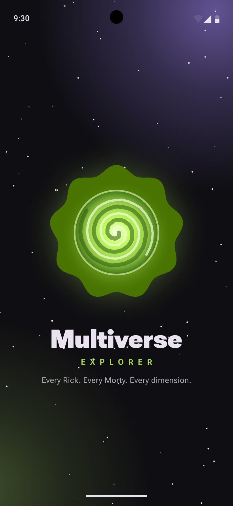
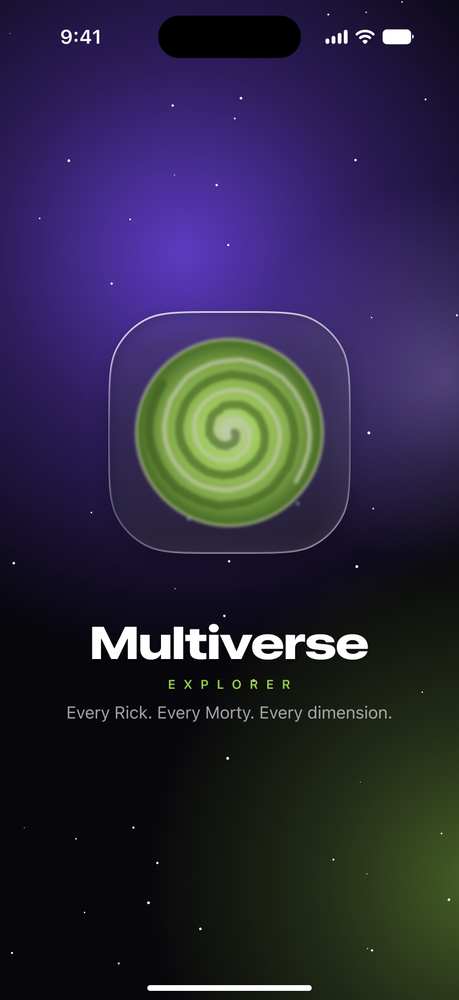
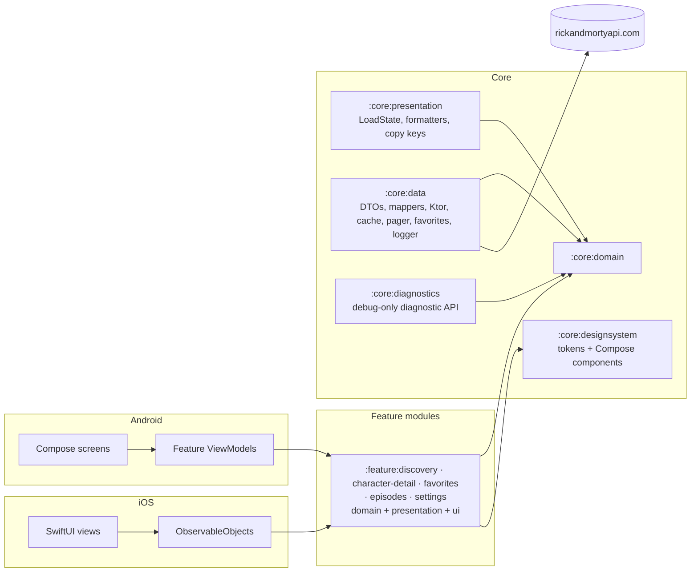

# Multiverse Explorer

- **Status:** Active — the Gradle/KMP build skeleton exists (TASK-014); the application itself is still target state (see [`docs/DOCUMENTATION_AUDIT.md`](docs/DOCUMENTATION_AUDIT.md) §5)
- **Last verified:** 2026-10-04
- **Owner:** Delivery Planner (see [`AGENTS.md`](AGENTS.md))
- **Authoritative for:** the developer entry point — prerequisites, build, run, test and quality commands, platform support, known limitations, documentation index.
- **Not authoritative for:** requirements, architecture, the remote contract, the visual specification or process — each links below.
- **Inputs:** [`assessment.md`](assessment.md), [`docs/REQUIREMENTS.md`](docs/REQUIREMENTS.md), [`docs/DESIGN.md`](docs/DESIGN.md), [`docs/TECHNICAL_PLAN.md`](docs/TECHNICAL_PLAN.md)

A Kotlin Multiplatform client for the public [Rick and Morty API](https://rickandmortyapi.com/): browse every character, open one character, favourite the ones you like.

Built as a recruitment deliverable for the ZARA mobile assignment described in [`assessment.md`](assessment.md).

> **Project status: both apps are built and verified; the releases await the owner's tags.**
> The repository holds the shared Kotlin Multiplatform core, the design system, the Android app (Compose, `minSdk` 26) and the iOS app (SwiftUI over one Kotlin framework). Both apps have Discovery, Character detail, Favorites and Settings, with the offline and error states. 52 Android and 17 iOS screenshot baselines are committed, and every policy and quality check blocks in CI. M1 is prepared as `v0.1.0` and M2 as `v0.2.0`; tagging and publishing are the owner's (`DEC-049`). The evidence only a device can give is carried as unevidenced rather than claimed: the performance budgets on a reference device, the iOS 18 floor run and the iOS VoiceOver checklist. [`docs/HANDOFF.md`](docs/HANDOFF.md) separates what was verified from what was not; commands marked *executed* were run on the recorded date.

## 1. Assessment objectives

The assignment ([`assessment.md`](assessment.md)) asks for:

| Requirement | How this project answers it |
| --- | --- |
| List all characters and inspect the selected one | Character list (paginated, searchable, filterable) and character detail |
| Review how the project is structured, whether SOLID is applied | The 12 modules of ADR-0001 as amended (the debug-only `:core:diagnostics` included) with inward-only dependencies, Clean Architecture layers inside each feature, documented contracts and ADRs |
| "Very image oriented company, UX is important" | Image-first design system, dynamic portrait accents, shared-element transitions, screenshot-tested UI |
| Performance discussion | Numeric budgets with a measurement method in [`docs/PERFORMANCE.md`](docs/PERFORMANCE.md) |
| Extras: image caching, error handling, response caching, tests, filter/search | All committed — see the feature table in §3 |
| "use them wisely, each third party library added is a dependency" | One library per concern, each justified in [`docs/DESIGN.md`](docs/DESIGN.md) or an ADR |
| Use Jetpack Compose or SwiftUI | Both, as two native clients over a shared Kotlin core |

## 2. Supported platforms

| Platform | UI | Minimum | Status |
| --- | --- | --- | --- |
| Android | Jetpack Compose, Material 3 Expressive | API 26 (compile/target 37) | Milestone M1 — first deliverable |
| iOS | SwiftUI, Liquid Glass on iOS 26+ with a material fallback | iOS 18.0 | Milestone M2 — second deliverable |

Phone portrait only; tablet, foldable and landscape are explicit non-goals ([`docs/REQUIREMENTS.md`](docs/REQUIREMENTS.md) §1.2).

## 3. Features

### Committed for the deliverable

| Feature | Requirement |
| --- | --- |
| Paginated character list with a live total from the API | `REQ-FUNC-001` |
| Character detail with origin, last known location, episode count and first appearance | `REQ-FUNC-002`, `REQ-FUNC-023` |
| Name search, 300 ms debounce, request cancellation | `REQ-FUNC-003` |
| Status filter: All, Alive, Dead, Unknown | `REQ-FUNC-004` |
| Image-first cards with placeholder, crossfade and branded error state | `REQ-FUNC-005` |
| Favourites, stored locally, with a Favorites section | `REQ-FUNC-006` |
| Branded splash whose portal rotation is the loading indicator | `REQ-FUNC-007` |
| Four destinations: Characters, Episodes, Favorites, Settings | `REQ-FUNC-008` |
| Card-to-detail shared-element transition with Reduce Motion fallback | `REQ-FUNC-009` |
| Designed empty, stale, error and partial-data states | `REQ-FUNC-010`, `REQ-FUNC-022` |
| Retry and manual refresh | `REQ-FUNC-011`, `REQ-FUNC-012` |
| Localisation: English and Spanish | `REQ-FUNC-013` |
| Response caching with an explicit freshness policy | `REQ-FUNC-020` |
| Memory and disk image caching | `REQ-FUNC-021` |
| Settings: Sounds preference (off by default), REST API or GraphQL data source (REST by default), delete all favorites with confirmation | `REQ-FUNC-033`, `REQ-FUNC-034`, `REQ-FUNC-035` |
| A selection sound while Sounds is on: on a change of destination from the navigation bar and on every tap of the status filter | `REQ-FUNC-036` |

### Deferred by decision

| Feature | Status |
| --- | --- |
| Voice search (speech-to-text) | Deferred — `DEC-002`. No microphone or speech permission is requested. |
| Real Episodes screens | Deferred — `DEC-005`. Episodes ships as a designed placeholder with a route back to Characters. |
| Real Locations screens | Deferred — `DEC-005`, `DEC-055`. Locations is not in the navigation. |

### Planned screens and screenshots

The visual specification is [`docs/UI_SPEC.md`](docs/UI_SPEC.md). It defines seven frames per platform (Splash, Discovery, Detail, Episodes placeholder, Favorites empty state, Settings, and the Delete favorites confirmation) and cross-links every component to its Figma node.

The rendered design exports are committed under [`docs/figma/`](docs/figma/README.md): every screen frame of `UI_SPEC.md` §1.1 and every component frame of §1.2, rendered from the actual Figma frames at 2× (see that directory's export log). The Figma source itself still requires project access, so these exports are the design evidence a reviewer can open.

| Android | iOS |
| --- | --- |
|  |  |

In-app screenshots of the running apps are still pending: the first runnable milestone is the Android shell (`TASK-044`), and they join this section once a run is verified.

## 4. Architecture in brief

Clean Architecture with unidirectional data flow, in Kotlin Multiplatform:



- Dependencies point inward: features → core → domain. The `:core:domain` module has no framework, HTTP or UI dependency, and no feature module depends on another feature module.
- API/IMPL boundary ([`ADR-0014`](docs/adr/0014-api-impl-boundary.md)): `:core:domain` is the API and `:core:data` the implementation. Features depend on the API only and never on `:core:data`; the app shell (and, on iOS, the `:core:ios` export module) is the composition root that wires the implementations, so no HTTP or storage type reaches feature code.
- UI is native on each platform; domain, data, UI-state contracts, formatters and copy keys are shared.
- Full detail, module table, dependency rules and class diagram: [`docs/DESIGN.md`](docs/DESIGN.md). Rationale: [`docs/adr/0001-module-boundaries.md`](docs/adr/0001-module-boundaries.md).

## 5. Repository structure

```text
.
├── assessment.md                 # The assignment (authoritative, frozen)
├── AGENTS.md                     # Operating rules for AI agents
├── README.md                     # This file
├── README.es.md                  # Spanish translation of this file
└── docs/
    ├── REQUIREMENTS.md           # Requirements, acceptance criteria, traceability
    ├── DESIGN.md                 # Architecture, modules, contracts, navigation
    ├── API_SPECS.md              # Remote contract, errors, caching policy
    ├── UI_SPEC.md                # Visual and interaction specification
    ├── CONTRACTS.md              # Internal module interfaces and invariants
    ├── ERROR_FLOW.md             # Failure → state → copy chain
    ├── PERFORMANCE.md            # Budgets and measurement method
    ├── OBSERVABILITY.md          # Logging contract and debug diagnostics
    ├── SECURITY.md               # Threat model, privacy, advisory register
    ├── TESTING.md                # Test strategy, tooling, traceability
    ├── DEFINITION.md             # Ready, Done, release and documentation gates
    ├── GUIDELINES.md             # Code conventions and where they are enforced
    ├── CONTRIBUTING.md           # Setup, branch, PR and review process
    ├── TECHNICAL_PLAN.md         # Milestones, sequencing, quality gates
    ├── BACKLOG.md                # Canonical work index (TASK ids)
    ├── DECISION_BOARD.md         # Decision status index (DEC ids)
    ├── PROJECT_LOG.md            # Why the project evolved as it did
    ├── HANDOFF.md                # Current state and next actions
    ├── DOCUMENTATION_AUDIT.md    # Documentation inventory and open gaps
    ├── adr/                      # Architecture decision records
    ├── design/                   # Historical Figma generation briefs (inputs)
    ├── figma/                    # Rendered PNG exports (pending)
    └── templates/                # Backlog item, test case, PR, bug report
```

The build adds `core/{domain,data,presentation,designsystem,testing}`, `feature/{discovery,character-detail,favorites,episodes,settings}` and `androidApp/` (TASK-014), then `core/ios` (the iOS framework export module, [`ADR-0012`](docs/adr/0012-ios-framework-export.md), TASK-078) and `iosApp/` (TASK-051); a `benchmark` module is still planned (`CONF-41` still needs the decision for the benchmark and `contract-live` artifacts). Each feature module contains its own Clean Architecture layers as packages. See [`docs/DESIGN.md`](docs/DESIGN.md) §3.

## 6. Prerequisites

| Tool | Version | Notes |
| --- | --- | --- |
| JDK | 17 or newer | Required by the Gradle build |
| Android SDK | Platform 37 (Android 17), Build Tools current | `minSdk` 26 |
| Xcode | 26 or newer | Required to compile the iOS 26 Liquid Glass APIs |
| Kotlin | 2.4.20 | Supplied by the Gradle toolchain; no local install needed |
| Node.js | Not required | No web target |

No API key, account or credential is needed: the Rick and Morty API is public, unauthenticated and read-only.

## 7. Setup

```bash
git clone <repository-url>
cd RickAndMorty
```

The Gradle wrapper is committed (Gradle 9.7.0, distribution checksum pinned), so no separate Gradle installation is required. There is nothing else to configure: the API base URL is a build constant, the package root is declared once in `gradle.properties`, and no property file, keystore or environment variable is needed.

## 8. Build and run

> Every command below carries the date it was executed and the observed result. Tagging and publishing a release stay the owner's actions (`DEC-049`).

| Task | Command | State |
| --- | --- | --- |
| List the module set | `./gradlew projects` | Executed 2026-10-02 — the 12 modules of ADR-0001 as amended by ADR-0013, grouped by the `:core` and `:feature` container projects (15 Gradle projects) |
| Build every module, Android and the iOS klibs | `./gradlew assemble` · `./gradlew build` | Executed 2026-10-01 — succeeded, no Android Lint error |
| Build the Android debug app | `./gradlew :androidApp:assembleDebug` | Executed 2026-10-01 — succeeded with no `iosApp/` present and from a clean clone |
| Install on a connected device/emulator | `./gradlew :androidApp:installDebug` | **Executed 2026-10-03** — installed and launched on API 37 and API 26, activity resumed, no crash record (`TASK-044`) |
| Build the shared framework for iOS | `./gradlew :core:ios:linkDebugFrameworkIosSimulatorArm64` | Executed 2026-10-05: BUILD SUCCESSFUL — the one static `MultiverseExplorer.framework` the iOS app links, exporting the five features, `:core:domain` and `:core:presentation` and no `:core:data` type (`TASK-078`, `DEC-058`, `DEC-091`, [`ADR-0012`](docs/adr/0012-ios-framework-export.md)). The app's pre-build step links the framework for the active SDK and configuration — `linkDebugFrameworkIosSimulatorArm64` for a simulator Debug build, `linkReleaseFrameworkIosArm64` for a device Release build |
| Build the iOS app | `xcodebuild -project iosApp/MultiverseExplorer.xcodeproj -scheme MultiverseExplorer -destination 'platform=iOS Simulator,name=iPhone 17,OS=27.0' build` | Executed 2026-10-05: BUILD SUCCEEDED; a Release device build (`-configuration Release -destination 'generic/platform=iOS' CODE_SIGNING_ALLOWED=NO`) also succeeds, `CFBundleShortVersionString` 0.1.0 from `VERSION`, `MinimumOSVersion` 18.0 (`TASK-051`). `iosApp/project.pbxproj` is generated from `iosApp/project.yml` with XcodeGen 2.46.0 and committed. A Release simulator build (`-configuration Release -destination 'generic/platform=iOS Simulator'`) also succeeds, and a Kotlin-only change relinks the app in the same incremental build (`TASK-121`, `GAP-033`) |

**Parallel CI (`DEC-112`).** Module checks, app tests, APK verification, tooling, policies, dependency health and contract replay run independently. The required `android` result passes only when every worker succeeds; the local commands below retain the comprehensive gate.

## 9. Test and quality commands

Every pull request must pass the full suite on both platforms before it can be approved (`DEC-054`); the definitions of Ready, Done and the merge gate are in [`docs/DEFINITION.md`](docs/DEFINITION.md), and the test strategy is in [`docs/TESTING.md`](docs/TESTING.md).

| Task | Command | State |
| --- | --- | --- |
<!-- local-gate:begin -->
| All shared and unit tests, plus the build-logic regression suite | `./gradlew allTests :build-logic:convention:test` | Executed 2026-10-02: the shared suites run on the JVM host-test target and on both Apple targets (`:core:testing:testAndroidHostTest`, `:core:testing:iosSimulatorArm64Test`) and the build-logic regression suite runs in the included build. The earlier row documented `./gradlew test`, which selects only the Android unit-test tasks and reaches neither the shared KMP suites nor the build-logic suite (`GAP-020`; `TASK-103`) |
| Formatting, static analysis and dependency checks | `./gradlew ktlintCheck lintDebug buildHealth` | Executed 2026-10-01 — ktlint, Android Lint and `buildHealth` pass (TASK-029, `DEC-075`, `DEC-077`) |
| Module-boundary and version policy | `./gradlew verifyModuleBoundaries verifyDependencyPolicy verifyNoLiveHosts verifyWorkflowGate` | Executed 2026-10-02: all pass — 15 projects checked (`R1`–`R18`, `S1`–`S3`, effective inherited edges, Compose-only for `:core:designsystem`, and `:core:diagnostics` linked from debug configurations only with its release closure checked), `VERSION` validated with every Android artifact task depending on it, and no analytics artifact in the catalog or in `:androidApp`'s resolved release graph (`verifyNoAnalytics`, `TEST-UNIT-034`) |
| Verify the dependency policy (exact pins, rationale, inventory, single `VERSION`, no analytics artifact) | `./gradlew verifyDependencyPolicy` | Executed 2026-10-02: passes; also runs as part of `./gradlew check` and `./gradlew build` |
| Contract suite in fixture/replay mode on the Android host target (the `android` job's contract step) | `./gradlew :core:data:contractTestReplayAndroidHost` | Executed 2026-10-02: runs exactly the `TEST-CONTRACT-*` cases of `testAndroidHostTest` — 18 cases, 0 failures — and fails when its target executes none (`TASK-037`, `DEC-073`, `DEC-090`) |
| Verify repository and secret hygiene | `./gradlew verifyRepositoryHygiene` | Executed 2026-10-01: passes (0 findings over the working set, every reachable blob and every unique historical path); also runs as part of `./gradlew check` and `./gradlew build` |
<!-- local-gate:end -->
| Android screenshot verification (every committed baseline) | `./gradlew :core:designsystem:verifyRoborazziDebug :androidApp:verifyRoborazziDebug :feature:discovery:verifyRoborazziAndroidHostTest :feature:character-detail:verifyRoborazziAndroidHostTest :feature:favorites:verifyRoborazziAndroidHostTest :feature:settings:verifyRoborazziAndroidHostTest` | Executed 2026-10-04: passes — 52 committed baselines across the component catalogue, the seven `ERROR_FLOW.md` states, the four feature surfaces and the shell (Episodes and the maximum-text detail and shell captures included), each captured in system light and dark and proved byte-identical (`TEST-UI-012`, `TEST-UI-016`, `TASK-045`). The KMP modules use the `AndroidHostTest` variant name; `:androidApp` and `:core:designsystem` use the `Debug` one |
| Record new screenshot baselines (review the diff before committing) | `./gradlew :core:designsystem:recordRoborazziDebug :androidApp:recordRoborazziDebug :feature:discovery:recordRoborazziAndroidHostTest :feature:character-detail:recordRoborazziAndroidHostTest :feature:favorites:recordRoborazziAndroidHostTest :feature:settings:recordRoborazziAndroidHostTest` | Executed 2026-10-04: writes the baselines under each module's `src/*/snapshots/`. Run it only for a state that exists and is correct (`TESTING.md` §8.2) |
| iOS snapshots and state-holder tests | `xcodebuild test -project iosApp/MultiverseExplorer.xcodeproj -scheme MultiverseExplorer -destination 'platform=iOS Simulator,name=iPhone 17,OS=27.0'` | Executed 2026-10-05: 159 tests, 0 failures — the state-holder, navigation, transition, layout and screen cases and the committed component and screen baselines, recorded on that device and runtime (`TESTING.md` §8.3); the `ios` job runs the same command |
| Performance benchmarks (requires a device) | `./gradlew :benchmark:connectedCheck` | Not defined: no benchmark module exists and `PERF-Q1` is unresolved, so the command is target state rather than a real task |
| Contract suite in fixture/replay mode on the Apple simulator target, and on both targets | `./gradlew :core:data:contractTestReplayIosSimulator` · `./gradlew :core:data:contractTestReplay` | Executed 2026-10-02 locally on macOS: 18 contract cases on `iosSimulatorArm64Test`, and 36 across both targets for the aggregate. Not in CI while `DEC-083` suspends the `ios` job; the native entry point becomes blocking with `TASK-051`. Each entry point verifies its own target's reports, so a host report never satisfies the native one |
| Live observation probes against the API (scheduled signal, not a merge blocker) | `./gradlew :core:data:contractLiveProbe` | Executed 2026-10-02: recorded the published totals and page count (`TASK-027`, `DEC-074`); `.github/workflows/contract-live.yml` runs it weekly and uploads the captures, and no pull-request- or push-triggered workflow may reach it |

Development follows the TDD protocol in [`docs/CONTRIBUTING.md`](docs/CONTRIBUTING.md): write the failing test and commit it (`test:`), make it pass and commit (`feat:`/`fix:`), refactor and commit (`refactor:`), then push.

## 10. Configuration

| Item | Value | Where |
| --- | --- | --- |
| API base URL | `https://rickandmortyapi.com/api/` | Build constant; not discovered at runtime |
| App version | Single `VERSION` source (`0.2.0`, prepared for the M2 release; M1 is `0.1.0`). The Android `versionName` is that value verbatim; the iOS `CFBundleShortVersionString` derives from it through the generated `iosApp/App/Version.xcconfig`, which the `ios` job checks with `tools/ios-version.sh --check` (`DEC-043`, `DEC-067`, `DEC-121`) | `DEC-043` |
| Remote protocol | Both ship and the user picks in Settings: REST API (default) or GraphQL, through the one Ktor client | `DEC-056`, [`docs/API_SPECS.md`](docs/API_SPECS.md) §2 |
| Cache freshness | 24 h fresh, 7 d stale-while-revalidate, 30 d offline fallback | `DEC-012` |
| Release mechanism | Tag `vMAJOR.MINOR.PATCH`, GitHub Release with the APK attached | `DEC-043` |

## 11. Known limitations

1. **Images are 300 × 300.** The API publishes one square avatar per character and nothing larger. The detail hero therefore upscales the source; scrims and the blurred iOS backdrop make this a stylistic choice rather than a visible defect ([`docs/UI_SPEC.md`](docs/UI_SPEC.md) §5.3, `CON-002`).
2. **One tab is a placeholder.** Episodes is a designed coming-soon screen; Favorites and Settings are real (`DEC-005`, `DEC-055`).
3. **Voice search is not implemented.** It is deferred, and no microphone or speech permission is requested (`DEC-002`).
4. **Phone portrait only.** No tablet, foldable or landscape layout (`DEC-027`).
5. **No analytics.** There is intentionally no analytics, tracking or advertising SDK (`REQ-OBS-003`).
6. **Exactly one pre-release artifact ships.** Material 3 Expressive `1.5.0-alpha29` is pinned in the version catalog and declared by `:core:designsystem` and by four feature modules (`:feature:character-detail`, `:feature:discovery`, `:feature:favorites`, `:feature:settings`), so the Android app contains it. The accepted risk and the fallback plan are recorded in [`docs/adr/0008-alpha-dependencies.md`](docs/adr/0008-alpha-dependencies.md), whose rule that only the design system declares it the four feature modules do not yet meet (`CONF-84`). The other two alpha-only components are not adopted.
7. **The API is unversioned.** Its shape can change without notice, so contract tests run outside the merge gate (`DEC-029`).
8. **The reference device for performance budgets is not yet locked.** Budgets and the measurement method exist; the named device is recorded as a pending assumption in [`docs/PERFORMANCE.md`](docs/PERFORMANCE.md), so no performance budget has been measured yet. Only the zero-network assertion on a cached page runs in the merge gate (`DEC-115`).
9. **iOS 18 is the declared floor but has not been run.** The app targets iOS 18.0 and its non-glass fallback is snapshot-tested through a seam on the iOS 27 simulator, but no iOS 18 simulator or device run exists: Xcode 27 offers no iOS 18 runtime (`DEC-117`). The iOS app is not signed or distributed; the GitHub Release carries the Android APK.

## 12. Documentation index

| Document | Purpose | Audience |
| --- | --- | --- |
| [`assessment.md`](assessment.md) | The assignment. Overrides everything on conflict | Everyone |
| [`AGENTS.md`](AGENTS.md) | Operating rules for AI agents: precedence, permissions, escalation | AI agents, contributors |
| [`docs/REQUIREMENTS.md`](docs/REQUIREMENTS.md) | Requirements, acceptance criteria, scope, risks | Product, developers, QA |
| [`docs/DESIGN.md`](docs/DESIGN.md) | Architecture, modules, state contracts, navigation | Developers |
| [`docs/API_SPECS.md`](docs/API_SPECS.md) | Remote contract, DTOs, errors, caching policy | Developers, API reviewers |
| [`docs/UI_SPEC.md`](docs/UI_SPEC.md) | Tokens, components, screens, motion, accessibility | Design, developers, QA |
| [`docs/CONTRACTS.md`](docs/CONTRACTS.md) | Internal interfaces and invariants | Developers |
| [`docs/ERROR_FLOW.md`](docs/ERROR_FLOW.md) | Every failure mapped to a state and copy | Developers, QA |
| [`docs/PERFORMANCE.md`](docs/PERFORMANCE.md) | Budgets and how they are measured | Developers, reviewers |
| [`docs/OBSERVABILITY.md`](docs/OBSERVABILITY.md) | Logging contract, redaction, debug diagnostics | Developers, security |
| [`docs/SECURITY.md`](docs/SECURITY.md) | Threat model, privacy, advisory register | Security reviewers |
| [`docs/TESTING.md`](docs/TESTING.md) | Test strategy, tooling, requirement traceability | Developers, QA |
| [`docs/DEFINITION.md`](docs/DEFINITION.md) | Ready, Done, release and documentation gates | Everyone |
| [`docs/GUIDELINES.md`](docs/GUIDELINES.md) | Code conventions and their enforcement | Developers |
| [`docs/CONTRIBUTING.md`](docs/CONTRIBUTING.md) | Setup, branching, PRs, review | Contributors |
| [`docs/TECHNICAL_PLAN.md`](docs/TECHNICAL_PLAN.md) | Milestones, sequencing, quality gates | Reviewers, planners |
| [`docs/BACKLOG.md`](docs/BACKLOG.md) | Work index with task-level acceptance | Reviewers, developers |
| [`docs/DECISION_BOARD.md`](docs/DECISION_BOARD.md) | Every decision, its status and its ADR | Reviewers |
| [`docs/adr/`](docs/adr/) | Rationale for architecturally significant decisions | Reviewers |
| [`docs/PROJECT_LOG.md`](docs/PROJECT_LOG.md) | Chronological record of why things changed | Everyone |
| [`docs/HANDOFF.md`](docs/HANDOFF.md) | Current state and next actions | Incoming developer or agent |
| [`docs/DOCUMENTATION_AUDIT.md`](docs/DOCUMENTATION_AUDIT.md) | Inventory, ownership, open gaps | Documentation maintainer |
| [`docs/templates/`](docs/templates/) | Working templates for recurring artifacts | Contributors |

Deliberately not created, with reasons in [`docs/DECISION_BOARD.md`](docs/DECISION_BOARD.md) §3: `ARCHITECTURE.md` (merged into `DESIGN.md`), `SPECIFICATION.md` (would duplicate requirements), `ANALYTICS.md` (no analytics — replaced by `OBSERVABILITY.md`), `SECURITY_ADVISORY_REGISTER.md` (a section of `SECURITY.md` for now), `CHANGELOG.md` (superseded by `PROJECT_LOG.md` plus generated release notes).

## 13. Contributing

Start with [`docs/CONTRIBUTING.md`](docs/CONTRIBUTING.md) for setup, branch and commit conventions, the pull-request template, and the required checks. Code conventions live in [`docs/GUIDELINES.md`](docs/GUIDELINES.md); the definition of done lives in [`docs/DEFINITION.md`](docs/DEFINITION.md).

Work is indexed in [`docs/BACKLOG.md`](docs/BACKLOG.md) and tracked as GitHub Issues. Report vulnerabilities privately through the route in [`docs/SECURITY.md`](docs/SECURITY.md) — never in a public issue.

## 14. Project status

| Area | State |
| --- | --- |
| Assignment analysis | Complete — [`docs/REQUIREMENTS.md`](docs/REQUIREMENTS.md) |
| Remote contract | Complete and verified against the live API on 2026-09-29 — [`docs/API_SPECS.md`](docs/API_SPECS.md) |
| Architecture and decisions | Complete — [`docs/DESIGN.md`](docs/DESIGN.md), [`docs/adr/`](docs/adr/), [`docs/DECISION_BOARD.md`](docs/DECISION_BOARD.md) |
| Visual specification | Complete, pending two Figma screens (error states) — [`docs/UI_SPEC.md`](docs/UI_SPEC.md) |
| Process documentation | Complete — `GUIDELINES`, `CONTRIBUTING`, `DEFINITION`, `TESTING`, `SECURITY`, `OBSERVABILITY` |
| Build skeleton | Done — TASK-014, merged in PR #6 on 2026-09-30: the 11 modules of ADR-0001 build, with the Android app assembling while no `iosApp/` exists yet |
| Implementation | Shared core complete (B3) and the Android surface landed (B4 Phases 4.2–4.3): `MultiverseTheme`, the component vocabulary, the portrait transport with its accent policy, the Koin graph with `coreModule`, the branded splash as a real loading indicator, four reachable destinations with both placeholders, the launcher icon and the debug-only diagnostics panel. The feature screens arrive with B5 — see [`docs/HANDOFF.md`](docs/HANDOFF.md) §1.8 |
| Version catalog | Done — TASK-015, merged in PR #10 on 2026-09-30: the catalog pins the full planned inventory, `DESIGN.md` §3.5 carries the rationale and §15 below the inventory, and `verifyDependencyPolicy` enforces both |
| `VERSION` | Done — TASK-018, merged in PR #34 on 2026-10-01: one `VERSION` file (`0.1.0`) is the single version source; the Android `versionName` is that value verbatim, `verifyDependencyPins` rejects every malformed value, and every Android artifact task depends on its validation (TASK-089). The iOS `CFBundleShortVersionString` derivation arrives with `TASK-051` |
| CI | Active — TASK-025, PR #52: `.github/workflows/pull-request.yml` gates every pull request and every push to `main`. The `ios` job is suspended by `DEC-083` until `TASK-051` introduces the iOS app; the independent Linux module and verification jobs feed the required `android` result meanwhile (`DEC-112`, `docs/TESTING.md` §14.2) |
| `.gitignore` | Done — TASK-016, merged in PR #13 on 2026-09-30: `verifyRepositoryHygiene` (`TEST-UNIT-026`) scans the working set, every reachable blob and every unique historical path, in `check` and `build` (see [`docs/PROJECT_LOG.md`](docs/PROJECT_LOG.md) LOG-0036…LOG-0039) |
| Contracts | Accepted — TASK-019, merged in PR #31 on 2026-10-01: `docs/CONTRACTS.md` is the `IC-###` baseline |
| Process documents | Reconciled — TASK-034, merged in PR #32 on 2026-10-01: DOC1–DOC8 audit recorded |
| Screenshots | Figma exports committed (32 PNGs under `docs/figma/`, `TASK-035`); in-app screenshots pending the first runnable milestone (`TASK-044`) |

## 15. Dependency inventory

`gradle/libs.versions.toml` is the single source of every external version (DEC-060). It pins the **planned inventory ahead of first use**, so an entry can exist before the task that declares it; the table below is the reviewer-visible counterpart, and `./gradlew verifyDependencyPolicy` checks it against the catalog and the build scripts.

- **Declared** — at least one build script references the entry, so it is in the resolved graph.
- **Pinned** — the entry is in the catalog but no build script references it yet; it is pinned ahead of use for the task named in "Planned for" (DEC-060).

Two notations in "Declared by":

- `:` is the root build script, which puts a plugin on the build classpath with `apply false`; the convention plugins then apply it by id.
- `:build-logic:convention` is the convention-plugin build, which compiles against the Gradle plugin APIs.

Rationale for every entry — the concern it serves, the alternative it replaced, and the primary source with its verification date — is in [`docs/DESIGN.md`](docs/DESIGN.md) §3.5. Run `./gradlew verifyDependencyPolicy` to verify the pins, the rationale and this table (`TEST-UNIT-013`, `TEST-UNIT-014`, `TEST-UNIT-051`).

<!-- dependency-inventory:begin -->

| Entry | Artifact or plugin id | Version | State | Declared by | Planned for |
| --- | --- | --- | --- | --- | --- |
| `libs.android.gradle.plugin` | `com.android.tools.build:gradle` | `9.3.1` | Declared | `:build-logic:convention` | — |
| `libs.kotlin.gradle.plugin` | `org.jetbrains.kotlin:kotlin-gradle-plugin` | `2.4.20` | Declared | `:build-logic:convention` | — |
| `libs.ktlint.gradle` | `org.jlleitschuh.gradle:ktlint-gradle` | `14.2.0` | Declared | `:build-logic:convention` | TASK-029 |
| `libs.snakeyaml.engine` | `org.snakeyaml:snakeyaml-engine` | `2.10` | Declared | `:build-logic:convention` | TASK-098 |
| `libs.kotlinx.serialization.core` | `org.jetbrains.kotlinx:kotlinx-serialization-core` | `1.11.0` | Declared | `:core:data`, `:feature:character-detail`, `:feature:discovery`, `:feature:episodes`, `:feature:favorites`, `:feature:settings` | — |
| `libs.kotlinx.serialization.json` | `org.jetbrains.kotlinx:kotlinx-serialization-json` | `1.11.0` | Declared | `:androidApp`, `:core:data`, `:core:designsystem` | TASK-027, TASK-037, TASK-042 |
| `libs.kotlinx.coroutines.core` | `org.jetbrains.kotlinx:kotlinx-coroutines-core` | `1.11.0` | Declared | `:core:data`, `:core:diagnostics`, `:core:domain`, `:core:presentation`, `:core:testing`, `:feature:character-detail`, `:feature:discovery`, `:feature:favorites`, `:feature:settings` | TASK-036 (CONF-47), TASK-112 |
| `libs.kotlinx.coroutines.test` | `org.jetbrains.kotlinx:kotlinx-coroutines-test` | `1.11.0` | Declared | `:androidApp`, `:core:data`, `:core:diagnostics`, `:core:presentation`, `:core:testing`, `:feature:character-detail`, `:feature:discovery`, `:feature:favorites`, `:feature:settings` | TASK-006, TASK-024, TASK-112 |
| `libs.kotlin.test` | `org.jetbrains.kotlin:kotlin-test` | `2.4.20` | Declared | `:build-logic:convention`, `:core:data`, `:core:diagnostics`, `:core:domain`, `:core:presentation`, `:core:testing`, `:feature:character-detail`, `:feature:discovery`, `:feature:favorites`, `:feature:settings` | TASK-006, TASK-024, TASK-091 |
| `libs.kotlin.test.junit` | `org.jetbrains.kotlin:kotlin-test-junit` | `2.4.20` | Declared | `:core:data`, `:core:diagnostics`, `:core:domain`, `:core:presentation`, `:core:testing`, `:feature:character-detail`, `:feature:discovery`, `:feature:favorites`, `:feature:settings` | TASK-006, TASK-027, TASK-029 |
| `libs.ktor.client.core` | `io.ktor:ktor-client-core` | `3.6.0` | Declared | `:core:data`, `:core:diagnostics`, `:core:testing`, `:feature:character-detail` | TASK-024, TASK-037 |
| `libs.ktor.client.okhttp` | `io.ktor:ktor-client-okhttp` | `3.6.0` | Declared | `:core:data` | TASK-037 |
| `libs.ktor.client.darwin` | `io.ktor:ktor-client-darwin` | `3.6.0` | Declared | `:core:data` | TASK-037 |
| `libs.ktor.client.mock` | `io.ktor:ktor-client-mock` | `3.6.0` | Declared | `:core:data`, `:core:testing` | TASK-024, TASK-026 |
| `libs.ktor.http` | `io.ktor:ktor-http` | `3.6.0` | Declared | `:core:data`, `:core:testing`, `:feature:character-detail` | TASK-029 |
| `libs.ktor.utils` | `io.ktor:ktor-utils` | `3.6.0` | Declared | `:core:data` | — |
| `libs.okhttp` | `com.squareup.okhttp3:okhttp` | `5.5.0` | Declared | `:core:data` | TASK-020, TASK-037 |
| `libs.okhttp.mockwebserver` | `com.squareup.okhttp3:mockwebserver3` | `5.5.0` | Pinned | — | TASK-020, TASK-037 |
| `libs.koin.core` | `io.insert-koin:koin-core` | `4.2.2` | Declared | `:core:data`, `:feature:character-detail`, `:feature:discovery`, `:feature:favorites`, `:feature:settings` | TASK-044 |
| `libs.koin.android` | `io.insert-koin:koin-android` | `4.2.2` | Declared | `:androidApp`, `:feature:character-detail`, `:feature:discovery`, `:feature:favorites`, `:feature:settings` | TASK-001, TASK-002, TASK-006, TASK-044, TASK-074 |
| `libs.koin.androidx.compose` | `io.insert-koin:koin-androidx-compose` | `4.2.2` | Declared | `:androidApp`, `:feature:character-detail`, `:feature:discovery`, `:feature:favorites`, `:feature:settings` | TASK-001, TASK-002, TASK-006, TASK-044, TASK-074 |
| `libs.koin.compose` | `io.insert-koin:koin-compose` | `4.2.2` | Declared | `:feature:character-detail`, `:feature:discovery`, `:feature:favorites`, `:feature:settings` | TASK-001, TASK-002 |
| `libs.koin.core.viewmodel` | `io.insert-koin:koin-core-viewmodel` | `4.2.2` | Declared | `:feature:character-detail`, `:feature:discovery`, `:feature:favorites`, `:feature:settings` | TASK-001, TASK-002 |
| `libs.androidx.compose.bom` | `androidx.compose:compose-bom` | `2026.09.00` | Declared | `:androidApp`, `:core:designsystem` | TASK-043, TASK-044 |
| `libs.androidx.compose.runtime` | `androidx.compose.runtime:runtime` | `2026.09.00` (BOM) | Declared | `:androidApp`, `:core:designsystem`, `:feature:character-detail`, `:feature:discovery`, `:feature:episodes`, `:feature:favorites`, `:feature:settings` | TASK-008, TASK-043, TASK-044 |
| `libs.androidx.compose.ui` | `androidx.compose.ui:ui` | `2026.09.00` (BOM) | Declared | `:androidApp`, `:core:designsystem`, `:feature:character-detail`, `:feature:discovery`, `:feature:episodes`, `:feature:favorites`, `:feature:settings` | TASK-008, TASK-042, TASK-043, TASK-044 |
| `libs.androidx.compose.ui.geometry` | `androidx.compose.ui:ui-geometry` | `2026.09.00` (BOM) | Declared | `:feature:character-detail`, `:feature:settings` | TASK-046 |
| `libs.androidx.compose.ui.test` | `androidx.compose.ui:ui-test` | `2026.09.00` (BOM) | Declared | `:feature:character-detail`, `:feature:discovery`, `:feature:favorites`, `:feature:settings` | TASK-001, TASK-002, TASK-045 |
| `libs.androidx.compose.ui.text` | `androidx.compose.ui:ui-text` | `2026.09.00` (BOM) | Declared | `:feature:character-detail`, `:feature:discovery`, `:feature:settings` | TASK-001, TASK-002, TASK-008 |
| `libs.androidx.compose.foundation.layout` | `androidx.compose.foundation:foundation-layout` | `2026.09.00` (BOM) | Declared | `:feature:character-detail`, `:feature:discovery`, `:feature:episodes`, `:feature:favorites`, `:feature:settings` | TASK-001, TASK-002 |
| `libs.androidx.compose.ui.graphics` | `androidx.compose.ui:ui-graphics` | `2026.09.00` (BOM) | Declared | `:feature:character-detail`, `:feature:discovery`, `:feature:episodes`, `:feature:favorites`, `:feature:settings` | TASK-008 |
| `libs.androidx.compose.ui.unit` | `androidx.compose.ui:ui-unit` | `2026.09.00` (BOM) | Declared | `:feature:character-detail`, `:feature:discovery`, `:feature:settings` | TASK-001, TASK-002, TASK-008, TASK-113 |
| `libs.androidx.compose.foundation` | `androidx.compose.foundation:foundation` | `2026.09.00` (BOM) | Declared | `:androidApp`, `:core:designsystem`, `:feature:character-detail`, `:feature:discovery`, `:feature:favorites`, `:feature:settings` | TASK-001, TASK-006, TASK-043 |
| `libs.androidx.compose.animation` | `androidx.compose.animation:animation` | `2026.09.00` (BOM) | Declared | `:feature:character-detail` | TASK-009, TASK-113, TASK-137 |
| `libs.androidx.compose.animation.core` | `androidx.compose.animation:animation-core` | `2026.09.00` (BOM) | Declared | `:feature:character-detail`, `:feature:discovery` | TASK-001, TASK-009, TASK-113 |
| `libs.androidx.compose.ui.tooling.preview` | `androidx.compose.ui:ui-tooling-preview` | `2026.09.00` (BOM) | Declared | `:core:designsystem` | TASK-043 |
| `libs.androidx.compose.ui.tooling` | `androidx.compose.ui:ui-tooling` | `2026.09.00` (BOM) | Declared | `:androidApp`, `:core:designsystem` | TASK-043 |
| `libs.androidx.compose.ui.test.junit4` | `androidx.compose.ui:ui-test-junit4` | `2026.09.00` (BOM) | Declared | `:androidApp`, `:core:designsystem`, `:feature:character-detail`, `:feature:discovery`, `:feature:favorites`, `:feature:settings` | TASK-006, TASK-043, TASK-045, TASK-046 |
| `libs.androidx.compose.ui.test.manifest` | `androidx.compose.ui:ui-test-manifest` | `2026.09.00` (BOM) | Declared | `:androidApp`, `:core:designsystem`, `:feature:favorites`, `:feature:settings` | TASK-006, TASK-043, TASK-045 |
| `libs.androidx.compose.material3` | `androidx.compose.material3:material3` | `1.5.0-alpha29` | Declared | `:core:designsystem`, `:feature:character-detail`, `:feature:discovery`, `:feature:settings` | TASK-043 |
| `libs.androidx.activity.compose` | `androidx.activity:activity-compose` | `1.13.0` | Declared | `:androidApp` | TASK-044 |
| `libs.androidx.lifecycle.viewmodel` | `androidx.lifecycle:lifecycle-viewmodel` | `2.11.0` | Declared | `:feature:character-detail`, `:feature:discovery`, `:feature:favorites`, `:feature:settings` | TASK-001, TASK-002, TASK-006, TASK-074 |
| `libs.androidx.lifecycle.common` | `androidx.lifecycle:lifecycle-common` | `2.11.0` | Declared | `:feature:character-detail`, `:feature:discovery`, `:feature:favorites`, `:feature:settings` | TASK-001, TASK-002 |
| `libs.androidx.lifecycle.runtime.compose` | `androidx.lifecycle:lifecycle-runtime-compose` | `2.11.0` | Declared | `:feature:character-detail`, `:feature:discovery`, `:feature:favorites`, `:feature:settings` | TASK-001, TASK-002 |
| `libs.androidx.lifecycle.viewmodel.compose` | `androidx.lifecycle:lifecycle-viewmodel-compose` | `2.11.0` | Declared | `:feature:character-detail`, `:feature:discovery`, `:feature:favorites`, `:feature:settings` | TASK-001, TASK-002 |
| `libs.androidx.navigation.compose` | `androidx.navigation:navigation-compose` | `2.10.2` | Declared | `:androidApp` | TASK-008, TASK-044 |
| `libs.androidx.core.splashscreen` | `androidx.core:core-splashscreen` | `1.2.0` | Declared | `:androidApp` | TASK-007, TASK-044 |
| `libs.androidx.datastore.preferences` | `androidx.datastore:datastore-preferences` | `1.2.1` | Declared | `:core:data` | TASK-040, TASK-074 |
| `libs.coil.compose` | `io.coil-kt.coil3:coil-compose` | `3.6.3` | Declared | `:androidApp` | TASK-005, TASK-021 |
| `libs.coil.network.ktor3` | `io.coil-kt.coil3:coil-network-ktor3` | `3.6.3` | Declared | `:androidApp` | TASK-021, TASK-044 |
| `libs.junit4` | `junit:junit` | `4.13.2` | Declared | `:androidApp`, `:build-logic:convention`, `:core:designsystem`, `:feature:character-detail`, `:feature:discovery`, `:feature:favorites`, `:feature:settings` | TASK-006, TASK-024, TASK-042, TASK-045, TASK-091 |
| `libs.androidx.test.ext.junit` | `androidx.test.ext:junit` | `1.1.5` | Declared | `:feature:character-detail`, `:feature:discovery`, `:feature:favorites`, `:feature:settings` | TASK-002, TASK-042 |
| `libs.robolectric` | `org.robolectric:robolectric` | `4.17` | Declared | `:androidApp`, `:core:designsystem`, `:feature:character-detail`, `:feature:discovery`, `:feature:favorites`, `:feature:settings` | TASK-006, TASK-042, TASK-043, TASK-045, TASK-046 |
| `libs.robolectric.annotations` | `org.robolectric:annotations` | `4.17` | Declared | `:feature:character-detail`, `:feature:discovery`, `:feature:favorites`, `:feature:settings` | TASK-002, TASK-042 |
| `libs.robolectric.shadows.framework` | `org.robolectric:shadows-framework` | `4.17` | Declared | `:feature:character-detail`, `:feature:favorites`, `:feature:settings` | TASK-002, TASK-042 |
| `libs.roborazzi` | `io.github.takahirom.roborazzi:roborazzi` | `1.76.0` | Declared | `:androidApp`, `:core:designsystem`, `:feature:character-detail`, `:feature:discovery`, `:feature:favorites`, `:feature:settings` | TASK-029, TASK-045 |
| `libs.roborazzi.core` | `io.github.takahirom.roborazzi:roborazzi-core` | `1.76.0` | Declared | `:feature:character-detail`, `:feature:discovery`, `:feature:favorites`, `:feature:settings` | TASK-029, TASK-045 |
| `libs.roborazzi.compose` | `io.github.takahirom.roborazzi:roborazzi-compose` | `1.76.0` | Declared | `:androidApp`, `:core:designsystem` | TASK-029, TASK-045 |
| `libs.roborazzi.junit.rule` | `io.github.takahirom.roborazzi:roborazzi-junit-rule` | `1.76.0` | Declared | `:androidApp`, `:core:designsystem` | TASK-029, TASK-045 |
| `libs.plugins.kotlin.multiplatform` | `org.jetbrains.kotlin.multiplatform` | `2.4.20` | Declared | `:` | — |
| `libs.plugins.kotlin.serialization` | `org.jetbrains.kotlin.plugin.serialization` | `2.4.20` | Declared | `:`, `:androidApp`, `:core:data`, `:feature:character-detail`, `:feature:discovery`, `:feature:episodes`, `:feature:favorites`, `:feature:settings` | — |
| `libs.plugins.kotlin.compose` | `org.jetbrains.kotlin.plugin.compose` | `2.4.20` | Declared | `:`, `:androidApp`, `:core:designsystem`, `:feature:character-detail`, `:feature:discovery`, `:feature:episodes`, `:feature:favorites`, `:feature:settings` | TASK-043 |
| `libs.plugins.android.application` | `com.android.application` | `9.3.1` | Declared | `:` | — |
| `libs.plugins.android.library` | `com.android.library` | `9.3.1` | Declared | `:` | — |
| `libs.plugins.android.kotlin.multiplatform.library` | `com.android.kotlin.multiplatform.library` | `9.3.1` | Declared | `:` | — |
| `libs.plugins.roborazzi` | `io.github.takahirom.roborazzi` | `1.76.0` | Declared | `:androidApp`, `:core:designsystem`, `:feature:character-detail`, `:feature:discovery`, `:feature:favorites`, `:feature:settings` | TASK-029, TASK-045 |
| `libs.plugins.ktlint` | `org.jlleitschuh.gradle.ktlint` | `14.2.0` | Declared | `:` | — |
| `libs.plugins.dependency.analysis` | `com.autonomousapps.dependency-analysis` | `3.19.2` | Declared | `:` | — |
<!-- dependency-inventory:end -->

**Implicit dependencies.** The Kotlin Gradle plugin adds `org.jetbrains.kotlin:kotlin-stdlib` to every Kotlin compilation, so it appears in the resolved graph without a catalog entry. The observed version is `2.4.20`.

The iOS-side tools are pinned outside this Gradle inventory, at their real locations (DEC-076): SwiftLint `0.65.1` by exact version with the SHA-256 of its release artifact in `tools/swift-tools.lock`; swift-format by the Xcode version that ships it (Xcode 27.0 — `macos-latest` alone does not pin the toolchain); swift-snapshot-testing `1.19.2` by exact version in `iosApp/project.yml`, linked into the test target only, with its transitive resolution — swift-custom-dump `1.7.3`, swift-issue-reporting `2.1.1`, swift-syntax `604.0.0` — pinned in the committed `Package.resolved` (DEC-024, DEC-025, DEC-032). XcodeGen `2.46.0` generates `iosApp/MultiverseExplorer.xcodeproj/project.pbxproj` from `iosApp/project.yml`; regenerating the unchanged spec reproduces the committed file.
