# Multiverse Explorer

- **Status:** Active. Both apps are built and verified on `main`, and this file describes the code as it is. [`docs/HANDOFF.md`](docs/HANDOFF.md) separates what was verified from what was not.
- **Last verified:** 2026-10-06
- **Owner:** Delivery Planner (see [`AGENTS.md`](AGENTS.md))
- **Authoritative for:** the developer entry point — prerequisites, build, run, test and quality commands, platform support, known limitations, documentation index.
- **Not authoritative for:** requirements, architecture, the remote contract, the visual specification or process — each links below.
- **Inputs:** [`assessment.md`](assessment.md), [`docs/REQUIREMENTS.md`](docs/REQUIREMENTS.md), [`docs/DESIGN.md`](docs/DESIGN.md), [`docs/TECHNICAL_PLAN.md`](docs/TECHNICAL_PLAN.md)

[](https://github.com/davidru85/RickAndMorty/actions/workflows/pull-request.yml)


A Kotlin Multiplatform client for the public [Rick and Morty API](https://rickandmortyapi.com/): browse every character, open one character, and keep your favourites. It ships two native apps, Jetpack Compose with Material 3 Expressive on Android and SwiftUI with Liquid Glass on iOS. Both run on one shared Kotlin core.

Built as a recruitment deliverable for the ZARA mobile assignment described in [`assessment.md`](assessment.md).

> **Project status: both apps are complete and verified. The milestones are tagged `v0.1.0` (Android) and `v0.2.0` (iOS), and publishing their GitHub Releases is the owner's step.**
> Both apps have Discovery, Character detail, Favorites, Settings and the Episodes placeholder. They cover the offline, stale and error states, English and Spanish copy, and a REST or GraphQL data source chosen in Settings. Every view has its previews, and 54 Android and 18 iOS screenshot baselines are committed. Every quality and policy check runs on each pull request: 1,380 Gradle tests and 173 iOS tests, with 0 failures, on 2026-10-06. Some evidence only a reference device can give, and it is named rather than claimed (§11): the performance budgets, a run on iOS 18 and the iOS VoiceOver pass.

## 1. Assessment objectives

The assignment ([`assessment.md`](assessment.md)) asks for:

| Requirement | How this project answers it |
| --- | --- |
| List all characters and inspect the selected one | A paginated, searchable and filterable character list, and a character detail, on both platforms |
| Review how the project is structured, whether SOLID is applied | 13 Gradle modules with inward-only dependencies, which `verifyModuleBoundaries` enforces on every build. Each feature has Clean Architecture layers. `:core:domain` is the API and `:core:data` the implementation (ADR-0014). Internal contracts are documented, and decisions are recorded in 15 ADRs |
| "Very image oriented company, UX is important" | An image-first design system on each platform, portrait accents sampled from each image, the card → detail shared-element transition, and snapshot-tested screens |
| Performance discussion | Numeric budgets with a measurement method in [`docs/PERFORMANCE.md`](docs/PERFORMANCE.md). The release APK measures 2.26 MiB against its 12 MiB budget on every pull request; the device budgets await a reference device (§11) |
| Extras: image caching, error handling, response caching, tests, filter/search | All delivered: memory and disk image caches, response caching with a freshness policy, a typed failure model with designed states, search with a status filter, and the test suites above |
| "use them wisely, each third party library added is a dependency" | One library per concern (Ktor, kotlinx.serialization, Koin, Coil 3, DataStore), each justified in [`docs/DESIGN.md`](docs/DESIGN.md) §3.5 or an ADR; §15 lists every pinned version |
| Use Jetpack Compose or SwiftUI | Both, as two native clients over a shared Kotlin core |

## 2. Supported platforms

| Platform | UI | Minimum | Status |
| --- | --- | --- | --- |
| Android | Jetpack Compose, Material 3 Expressive | API 26 (compile and target 37) | Built and verified; milestone M1, tagged `v0.1.0` |
| iOS | SwiftUI, Liquid Glass on iOS 26+ with a material fallback | iOS 18.0 | Built and verified on the iOS 27 simulator; milestone M2, tagged `v0.2.0`. Not yet run on iOS 18 (§11) |

Phone portrait only; tablet, foldable and landscape are explicit non-goals ([`docs/REQUIREMENTS.md`](docs/REQUIREMENTS.md) §1.2).

## 3. Features

### Delivered

| Feature | Requirement |
| --- | --- |
| Paginated character list with a live total from the API | `REQ-FUNC-001` |
| Character detail with origin, last known location, episode count and first appearance | `REQ-FUNC-002`, `REQ-FUNC-023` |
| Name search, 300 ms debounce, request cancellation | `REQ-FUNC-003` |
| Status filter: All, Alive, Dead, Unknown | `REQ-FUNC-004` |
| Image-first cards with placeholder, crossfade and branded error state | `REQ-FUNC-005` |
| Favourites, stored locally, with a Favorites section | `REQ-FUNC-006` |
| Branded splash whose portal rotation is the loading indicator | `REQ-FUNC-007` |
| Four destinations: Characters, Episodes, Favorites, Settings | `REQ-FUNC-008` |
| Card-to-detail shared-element transition with Reduce Motion fallback | `REQ-FUNC-009` |
| Designed empty, stale, error and partial-data states | `REQ-FUNC-010`, `REQ-FUNC-022` |
| Retry and manual refresh | `REQ-FUNC-011`, `REQ-FUNC-012` |
| Localisation: English and Spanish | `REQ-FUNC-013` |
| Response caching with an explicit freshness policy | `REQ-FUNC-020` |
| Memory and disk image caching | `REQ-FUNC-021` |
| Settings: Sounds preference (off by default), REST API or GraphQL data source (REST by default), delete all favorites with confirmation | `REQ-FUNC-033`, `REQ-FUNC-034`, `REQ-FUNC-035` |
| A selection sound while Sounds is on: on a change of destination from the navigation bar and on every tap of the status filter | `REQ-FUNC-036` |

### Deferred by decision

| Feature | Status |
| --- | --- |
| Voice search (speech-to-text) | Deferred — `DEC-002`. No microphone or speech permission is requested. |
| Real Episodes screens | Deferred — `DEC-005`. Episodes ships as a designed placeholder with a route back to Characters. |
| Real Locations screens | Deferred — `DEC-005`, `DEC-055`. Locations is not in the navigation. |

### Screenshots

The running apps on 2026-10-06, with live data from the API.

- **Android:** the debug build on the API 37 emulator.
- **iOS:** the iOS 27 simulator. The simulator has no tap input, so each screen was rendered from the app's own views and hosts in a window of the app. The splash is the first frame of its animation.

The Spanish screens are in [`README.es.md`](README.es.md).

| | Discovery | Character detail | Favorites | Settings |
| --- | --- | --- | --- | --- |
| **Android** | 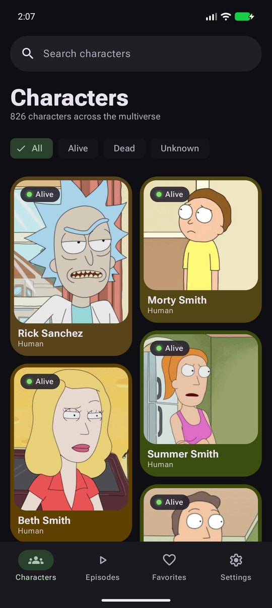 | 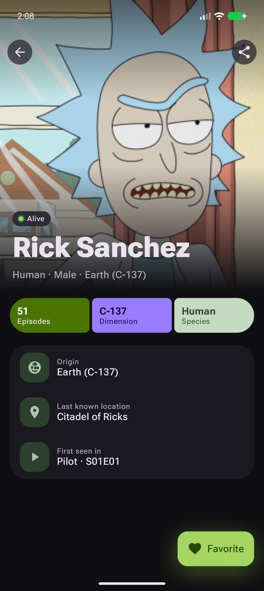 | 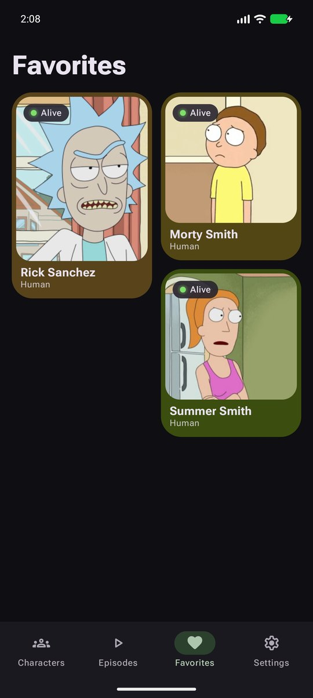 | 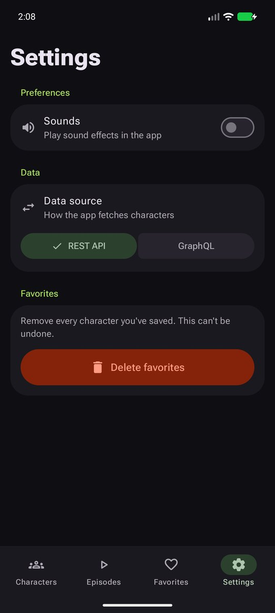 |
| **iOS** | 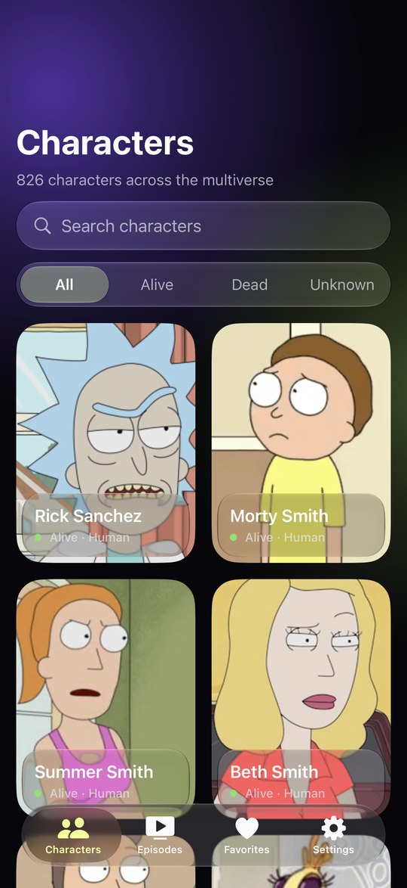 | 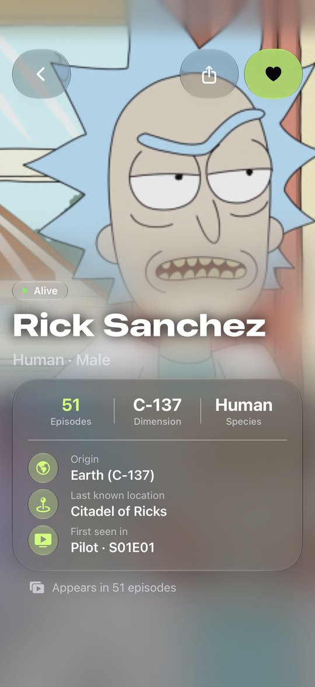 | 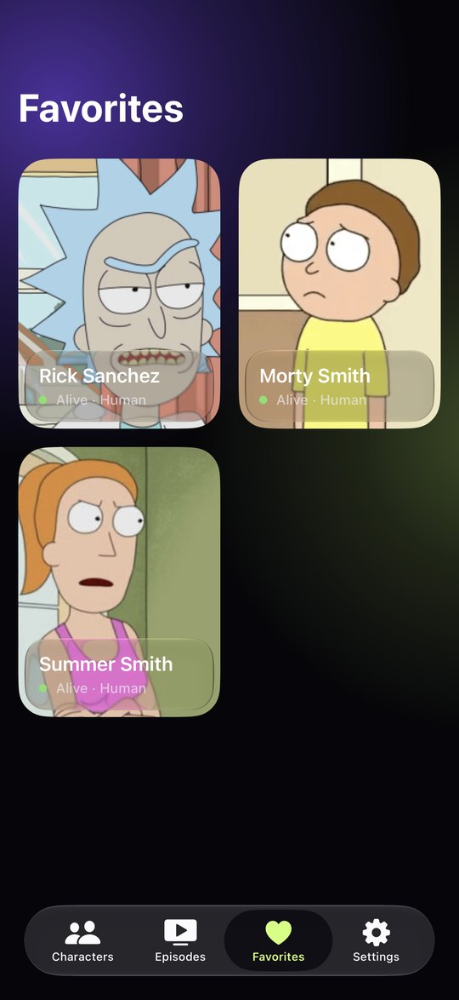 | 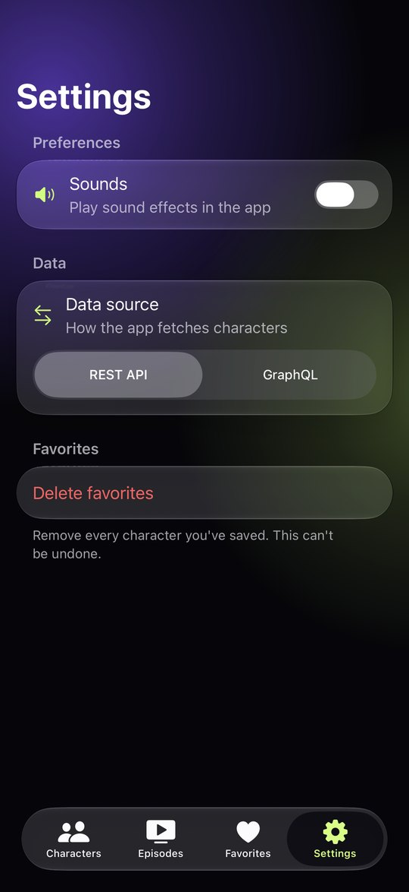 |

| | Splash | Episodes placeholder |
| --- | --- | --- |
| **Android** | 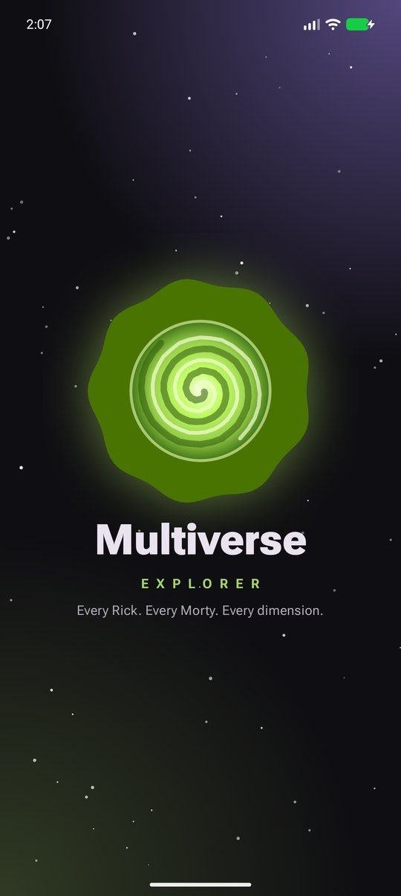 | 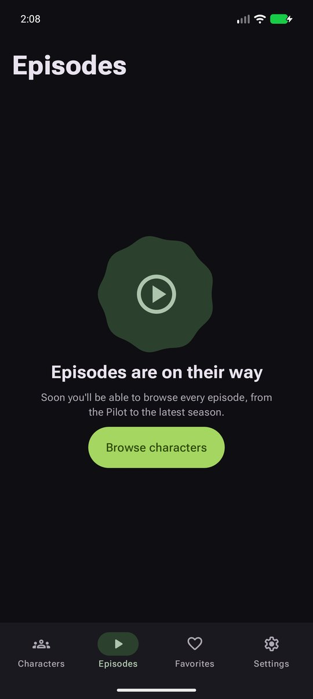 |
| **iOS** | 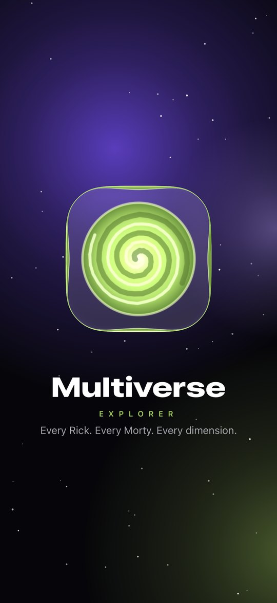 | 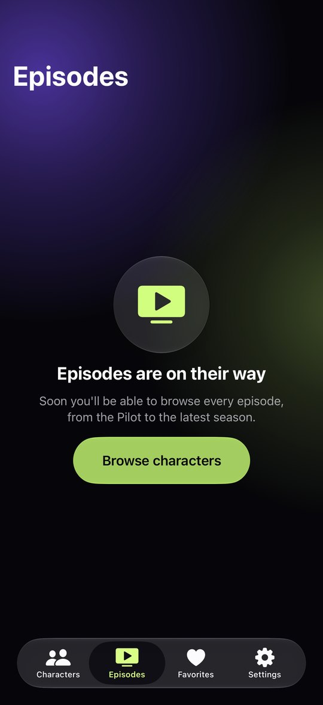 |

The visual specification is [`docs/UI_SPEC.md`](docs/UI_SPEC.md). It cross-links every component to its Figma node, and the design exports are committed under [`docs/figma/`](docs/figma/README.md).

## 4. Architecture in brief

Clean Architecture with unidirectional data flow, in Kotlin Multiplatform:

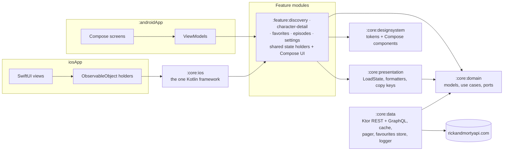

- **Dependencies point inward:** features → core → domain. `:core:domain` has no framework, HTTP or UI dependency, and no feature module depends on another feature module.
- **API/IMPL boundary ([`ADR-0014`](docs/adr/0014-api-impl-boundary.md)):** features depend on `:core:domain` only and never on `:core:data`. The composition roots — `:androidApp` and, for iOS, `:core:ios` — wire the implementations, so no HTTP or storage type reaches feature code.
- **Shared and native parts:** each feature's state holder, reducer and UI-state contract are shared Kotlin. The UI is native: Compose in each feature's `androidMain`, SwiftUI in `iosApp`, which wraps the shared holders in `ObservableObject`s.
- **Two support modules:** `:core:diagnostics` is a debug-only diagnostic API that release builds never link, and `:core:testing` holds the shared fakes and fixtures.
- **More:** the full module table, dependency rules and class diagram are in [`docs/DESIGN.md`](docs/DESIGN.md), and the rationale in [`docs/adr/0001-module-boundaries.md`](docs/adr/0001-module-boundaries.md).

## 5. Repository structure

```text
.
├── androidApp/              # Android app: activity, navigation shell, Koin graph, Coil, splash, sound
├── core/
│   ├── domain/              # Models, use cases and ports; no framework, HTTP or UI type
│   ├── data/                # Ktor REST and GraphQL clients, DTOs, cache, pager, favourites store, logger
│   ├── presentation/        # Shared UI-state primitives, formatters and copy keys
│   ├── designsystem/        # Android tokens, theme, Compose components and their previews
│   ├── ios/                 # Exports the one Kotlin framework the iOS app links
│   ├── diagnostics/         # Debug-only diagnostic API
│   └── testing/             # Shared fakes, fixtures and test harness
├── feature/
│   ├── discovery/           # Character list: search, status filter, paging
│   ├── character-detail/    # Character detail, episode enrichment, favourite toggle
│   ├── favorites/           # Favourite characters
│   ├── episodes/            # Designed placeholder
│   └── settings/            # Sounds, data source, delete favourites
├── iosApp/                  # SwiftUI app: App, DesignSystem, Features, ImagePipeline, Tests (XcodeGen project)
├── build-logic/             # Gradle convention plugins and the policy checks
├── gradle/                  # Version catalog, wrapper, daemon JDK, dependency-advice register
├── tools/                   # Swift tool pins, lint, version and release-note scripts
├── .github/workflows/       # Pull-request gate and the weekly live-contract probe
├── docs/                    # Specifications, process, decisions, design exports, screenshots (§12)
├── assessment.md            # The assignment (authoritative, frozen)
├── AGENTS.md                # Operating rules for AI agents
├── README.md · README.es.md # This file and its Spanish translation
└── VERSION                  # The single version source
```

Each feature module carries its own Clean Architecture layers as packages: `domain`, `presentation` (shared) and `ui` (Android). The live-contract suite is a source set of `:core:data` that only the weekly workflow runs. See [`docs/DESIGN.md`](docs/DESIGN.md) §3.

## 6. Prerequisites

| Tool | Version | Notes |
| --- | --- | --- |
| JDK | 17 or newer to start Gradle | The build daemon runs on JDK 25, which Gradle provisions itself (`gradle/gradle-daemon-jvm.properties`) |
| Android SDK | Platform 37 (Android 17), current build tools | Located through `local.properties` (`sdk.dir`) or `ANDROID_HOME` |
| Xcode | 27.0 | The toolchain `tools/swift-tools.lock` pins; the iOS 26+ SDK provides the Liquid Glass APIs |
| XcodeGen | 2.46.0 | Only to regenerate `iosApp/MultiverseExplorer.xcodeproj` from `iosApp/project.yml` |
| SwiftLint | 0.65.1 | Downloaded and checksum-verified by `tools/swift-tools-setup.sh`; no manual install |
| Kotlin | 2.4.20 | Supplied by the Gradle build; no local install needed |

No API key, account or credential is needed: the Rick and Morty API is public, unauthenticated and read-only.

## 7. Setup

```bash
git clone https://github.com/davidru85/RickAndMorty.git
cd RickAndMorty
```

The Gradle wrapper is committed (Gradle 9.7.0, distribution checksum pinned), so no separate Gradle installation is required. There is nothing else to configure: the API host is a build constant, the package root is declared once in `gradle.properties`, and no property file, keystore or environment variable is needed beyond the Android SDK location.

## 8. Build and run

> Every command below carries the date it was executed and the observed result. Tagging and publishing a release stay the owner's actions (`DEC-049`).

| Task | Command | State |
| --- | --- | --- |
| List the module set | `./gradlew projects` | Executed 2026-10-06: 13 modules (seven core, five feature, and the Android app) in 16 Gradle projects, counting the root and the `:core` and `:feature` containers |
| Build every module, Android and the iOS klibs | `./gradlew assemble` · `./gradlew build` | Executed 2026-10-06: `./gradlew build --continue` BUILD SUCCESSFUL |
| Build the Android debug app | `./gradlew :androidApp:assembleDebug` | Executed 2026-10-06: succeeded |
| Install and run on a connected device or emulator | `./gradlew :androidApp:installDebug` | Executed 2026-10-06: installed on the API 37 emulator and launched; `MainActivity` resumed with no crash record. The same build loaded Discovery's 826 characters for the screenshots of §3 |
| Build the shared framework for iOS | `./gradlew :core:ios:linkDebugFrameworkIosSimulatorArm64` | Executed 2026-10-06: BUILD SUCCESSFUL. It builds the one static `MultiverseExplorer.framework` the iOS app links: the five features, `:core:domain` and `:core:presentation`, and no `:core:data` type (`DEC-058`, `DEC-091`, [`ADR-0012`](docs/adr/0012-ios-framework-export.md)). The app's pre-build step links it for the active SDK and configuration, so Xcode runs it on every build |
| Build the iOS app | `xcodebuild -project iosApp/MultiverseExplorer.xcodeproj -scheme MultiverseExplorer -destination 'platform=iOS Simulator,name=iPhone 17,OS=27.0' build` | Executed 2026-10-06: built by the `xcodebuild test` run of §9 (TEST SUCCEEDED). A Release device build (`-configuration Release -destination 'generic/platform=iOS' CODE_SIGNING_ALLOWED=NO`) also succeeds, with `CFBundleShortVersionString` 0.2.0 from `VERSION` and `MinimumOSVersion` 18.0. `iosApp/MultiverseExplorer.xcodeproj` is generated from `iosApp/project.yml` with XcodeGen 2.46.0 and committed |
| Run the iOS app | Open `iosApp/MultiverseExplorer.xcodeproj` in Xcode and run the `MultiverseExplorer` scheme on an iOS simulator. From the command line, after the build: `xcrun simctl install booted "$(find ~/Library/Developer/Xcode/DerivedData -path '*Debug-iphonesimulator/MultiverseExplorer.app' -maxdepth 6 \| head -1)"`, then `xcrun simctl launch booted io.github.davidru85.multiverse.app` | Executed 2026-10-06 from the command line, on the iPhone 17 simulator (iOS 27.0): the app launched, and Discovery loaded 826 characters |

**Continuous integration (`DEC-112`).** `.github/workflows/pull-request.yml` runs independent jobs on every pull request and every push to `main`: one check per module, the app tests, the APK verification, the build-logic suite, the repository policies, the dependency health, the contract replay, and the `ios` job on an Xcode 27 runner. The required `android` result passes only when every Linux job succeeds. The `ios` job runs on every pull request, but making it a required check again is the owner's step (`TASK-108`).

## 9. Test and quality commands

Every pull request must pass the full suite on both platforms before it can be approved (`DEC-054`). The definitions of Ready, Done and the merge gate are in [`docs/DEFINITION.md`](docs/DEFINITION.md), and the test strategy is in [`docs/TESTING.md`](docs/TESTING.md). The whole local gate is `./gradlew check buildHealth --continue`: on 2026-10-06 it ran 1,380 tests with 0 failures.

| Task | Command | State |
| --- | --- | --- |
<!-- local-gate:begin -->
| All shared and unit tests, plus the build-logic regression suite | `./gradlew allTests :build-logic:convention:test` | Executed 2026-10-06: BUILD SUCCESSFUL. It runs the shared suites on the JVM host-test target and on the Apple simulator target (for example `:core:testing:testAndroidHostTest` and `:core:testing:iosSimulatorArm64Test`), and the build-logic regression suite in the included build |
| Formatting, static analysis and dependency checks | `./gradlew ktlintCheck lintDebug buildHealth` | Executed 2026-10-06: ktlint, Android Lint and `buildHealth` pass, and the dependency-analysis report is empty (`DEC-075`, `DEC-077`) |
| Module-boundary and version policy | `./gradlew verifyModuleBoundaries verifyDependencyPolicy verifyNoLiveHosts verifyWorkflowGate` | Executed 2026-10-06: all pass. 16 projects are checked against `R1`–`R18` and `S1`–`S3`, including the effective inherited edges, the Compose-only rule for `:core:designsystem`, and `:core:diagnostics` linked from debug configurations only. `VERSION` is validated, and no analytics artifact is in the catalog or in the app's release graph (`TEST-UNIT-034`) |
| Verify the dependency policy (exact pins, rationale, inventory, single `VERSION`, no analytics artifact) | `./gradlew verifyDependencyPolicy` | Executed 2026-10-06: passes. It also runs as part of `./gradlew check` and `./gradlew build` |
| Contract suite in fixture/replay mode on the Android host target (the `android` job's contract step) | `./gradlew :core:data:contractTestReplayAndroidHost` | Executed 2026-10-06: runs exactly the `TEST-CONTRACT-*` cases (35, REST and GraphQL, 0 failures), and fails when its target runs none (`DEC-073`, `DEC-090`) |
| Verify repository and secret hygiene | `./gradlew verifyRepositoryHygiene` | Executed 2026-10-06: passes with 0 findings over the working set, every reachable blob and every unique historical path. It also runs as part of `./gradlew check` and `./gradlew build` |
<!-- local-gate:end -->
| Android screenshot verification (every committed baseline) | `./gradlew :core:designsystem:verifyRoborazziDebug :androidApp:verifyRoborazziDebug :feature:discovery:verifyRoborazziAndroidHostTest :feature:character-detail:verifyRoborazziAndroidHostTest :feature:favorites:verifyRoborazziAndroidHostTest :feature:settings:verifyRoborazziAndroidHostTest` | Executed 2026-10-06 as part of `./gradlew check`: the 54 committed baselines pass. They cover the component catalogue, every `ERROR_FLOW.md` state, the feature surfaces and the shell, each captured with the system in light and in dark and proved byte-identical (`TEST-UI-012`, `TEST-UI-016`). The KMP modules use the `AndroidHostTest` variant name; `:androidApp` and `:core:designsystem` use the `Debug` one |
| Record new screenshot baselines (review the diff before committing) | `./gradlew :core:designsystem:recordRoborazziDebug :androidApp:recordRoborazziDebug :feature:discovery:recordRoborazziAndroidHostTest :feature:character-detail:recordRoborazziAndroidHostTest :feature:favorites:recordRoborazziAndroidHostTest :feature:settings:recordRoborazziAndroidHostTest` | Writes the baselines under each module's `src/*/snapshots/`. Run it only for a state that exists and is correct (`TESTING.md` §8.2) |
| iOS snapshots, state-holder and screen tests | `xcodebuild test -project iosApp/MultiverseExplorer.xcodeproj -scheme MultiverseExplorer -destination 'platform=iOS Simulator,name=iPhone 17,OS=27.0'` | Executed 2026-10-06: 173 tests, 0 failures, including the 18 committed baselines recorded on that device and runtime (`TESTING.md` §8.3). The `ios` job runs the same command |
| Swift formatting and lint | `sh tools/swift-lint.sh iosApp` | Executed 2026-10-06: swift-format `--strict` is clean, and SwiftLint reports 0 violations in 87 files |
| Performance benchmarks (requires a device) | `./gradlew :benchmark:connectedCheck` | Not defined: no benchmark module exists and `PERF-Q1` is unresolved, so the command is target state rather than a real task |
| Contract suite in fixture/replay mode on the Apple simulator target, and on both targets | `./gradlew :core:data:contractTestReplayIosSimulator` · `./gradlew :core:data:contractTestReplay` | Executed 2026-10-06: 35 contract cases on `iosSimulatorArm64Test`, and 70 across both targets for the aggregate. The `ios` job runs the simulator entry point on every pull request. Each entry point verifies its own target's reports, so a host report never satisfies the native one |
| Live observation probes against the API (scheduled signal, not a merge blocker) | `./gradlew :core:data:contractLiveProbe` | Executed 2026-10-02: recorded the published totals and page count (`TASK-027`, `DEC-074`). `.github/workflows/contract-live.yml` runs it weekly and uploads the captures, and no pull-request or push workflow may reach it |

Development follows the TDD protocol in [`docs/CONTRIBUTING.md`](docs/CONTRIBUTING.md): write the failing test and commit it (`test:`), make it pass and commit (`feat:`/`fix:`), refactor and commit (`refactor:`), then push.

## 10. Configuration

| Item | Value | Where |
| --- | --- | --- |
| API endpoints | REST `https://rickandmortyapi.com/api/` and GraphQL `https://rickandmortyapi.com/graphql`, on the one allow-listed host | Build constant; not discovered at run time (`REQ-SEC-001`) |
| App version | `0.2.0`, from the single `VERSION` file. The Android `versionName` is that value verbatim; the iOS `CFBundleShortVersionString` derives from it through the generated `iosApp/App/Version.xcconfig`, which the `ios` job checks with `tools/ios-version.sh --check` | `DEC-043`, `DEC-067`, `DEC-121` |
| Remote protocol | Both ship, and the user picks one in Settings: REST API (the default) or GraphQL, through the one Ktor client | `DEC-056`, [`docs/API_SPECS.md`](docs/API_SPECS.md) §2 |
| Cache freshness | 24 h fresh, 7 d stale-while-revalidate, 30 d offline fallback | `DEC-012` |
| Release mechanism | A `vMAJOR.MINOR.PATCH` tag, and a GitHub Release with the APK attached. `v0.1.0` and `v0.2.0` are tagged; their Releases are not published yet | `DEC-043` |

## 11. Known limitations

1. **Images are 300 × 300.** The API publishes one square avatar per character and nothing larger. The detail hero therefore upscales the source; scrims and the blurred iOS backdrop make this a stylistic choice rather than a visible defect ([`docs/UI_SPEC.md`](docs/UI_SPEC.md) §5.3, `CON-002`).
2. **One tab is a placeholder.** Episodes is a designed coming-soon screen; Favorites and Settings are real (`DEC-005`, `DEC-055`).
3. **Voice search is not implemented.** It is deferred, and no microphone or speech permission is requested (`DEC-002`).
4. **Phone portrait only.** No tablet, foldable or landscape layout (`DEC-027`).
5. **No analytics.** There is intentionally no analytics, tracking or advertising SDK (`REQ-OBS-003`).
6. **Exactly one pre-release artifact ships.** Material 3 Expressive `1.5.0-alpha29` is pinned in the version catalog and declared by `:core:designsystem` and by three feature modules (`:feature:character-detail`, `:feature:discovery`, `:feature:settings`), so the Android app contains it. The accepted risk and the fallback plan are recorded in [`docs/adr/0008-alpha-dependencies.md`](docs/adr/0008-alpha-dependencies.md). That ADR says only the design system declares it, a rule the three feature modules do not yet meet (`CONF-84`, open with the owner).
7. **The API is unversioned.** Its shape can change without notice, so the live contract probe runs weekly outside the merge gate (`DEC-029`).
8. **The device performance budgets are not measured yet.** The budgets and their measurement method exist, but the reference device is still a pending assumption in [`docs/PERFORMANCE.md`](docs/PERFORMANCE.md). The merge gate measures the release APK size and asserts zero network calls on a cached page (`DEC-115`).
9. **iOS 18 is the declared floor but has not been run.** The app targets iOS 18.0, and its non-glass fallback is snapshot-tested through a seam on the iOS 27 simulator. No iOS 18 simulator or device run exists, because Xcode 27 offers no iOS 18 runtime (`DEC-117`). The iOS app is not signed or distributed.
10. **Two known display defects are open.** At the largest iOS Dynamic Type size, the Settings title "Sounds" breaks inside the word (`GAP-049`). The Android Detail's full-surface error, a failure with nothing cached, draws its illustration without the portal logo (`GAP-050`). Both are registered in [`docs/DOCUMENTATION_AUDIT.md`](docs/DOCUMENTATION_AUDIT.md).

## 12. Documentation index

| Document | Purpose | Audience |
| --- | --- | --- |
| [`assessment.md`](assessment.md) | The assignment. Overrides everything on conflict | Everyone |
| [`AGENTS.md`](AGENTS.md) | Operating rules for AI agents: precedence, permissions, escalation | AI agents, contributors |
| [`docs/REQUIREMENTS.md`](docs/REQUIREMENTS.md) | Requirements, acceptance criteria, scope, risks | Product, developers, QA |
| [`docs/DESIGN.md`](docs/DESIGN.md) | Architecture, modules, state contracts, navigation | Developers |
| [`docs/API_SPECS.md`](docs/API_SPECS.md) | Remote contract, DTOs, errors, caching policy | Developers, API reviewers |
| [`docs/UI_SPEC.md`](docs/UI_SPEC.md) | Tokens, components, screens, motion, accessibility | Design, developers, QA |
| [`docs/CONTRACTS.md`](docs/CONTRACTS.md) | Internal interfaces and invariants | Developers |
| [`docs/ERROR_FLOW.md`](docs/ERROR_FLOW.md) | Every failure mapped to a state and copy | Developers, QA |
| [`docs/PERFORMANCE.md`](docs/PERFORMANCE.md) | Budgets and how they are measured | Developers, reviewers |
| [`docs/OBSERVABILITY.md`](docs/OBSERVABILITY.md) | Logging contract, redaction, debug diagnostics | Developers, security |
| [`docs/SECURITY.md`](docs/SECURITY.md) | Threat model, privacy, advisory register | Security reviewers |
| [`docs/TESTING.md`](docs/TESTING.md) | Test strategy, tooling, requirement traceability | Developers, QA |
| [`docs/DEFINITION.md`](docs/DEFINITION.md) | Ready, Done, release and documentation gates | Everyone |
| [`docs/GUIDELINES.md`](docs/GUIDELINES.md) | Code conventions and their enforcement | Developers |
| [`docs/CONTRIBUTING.md`](docs/CONTRIBUTING.md) | Setup, branching, PRs, review | Contributors |
| [`docs/TECHNICAL_PLAN.md`](docs/TECHNICAL_PLAN.md) | Milestones, sequencing, quality gates | Reviewers, planners |
| [`docs/BACKLOG.md`](docs/BACKLOG.md) | Work index with task-level acceptance | Reviewers, developers |
| [`docs/DECISION_BOARD.md`](docs/DECISION_BOARD.md) | Every decision, its status and its ADR | Reviewers |
| [`docs/adr/`](docs/adr/) | Rationale for architecturally significant decisions | Reviewers |
| [`docs/PROJECT_LOG.md`](docs/PROJECT_LOG.md) | Chronological record of why things changed | Everyone |
| [`docs/HANDOFF.md`](docs/HANDOFF.md) | Current state and next actions | Incoming developer or agent |
| [`docs/DOCUMENTATION_AUDIT.md`](docs/DOCUMENTATION_AUDIT.md) | Inventory, ownership, open gaps | Documentation maintainer |
| [`docs/figma/`](docs/figma/README.md) | The Figma design exports and the token export | Design, reviewers |
| [`docs/screenshots/`](docs/screenshots/) | Screenshots of the running apps, in English and Spanish | Everyone |
| [`docs/templates/`](docs/templates/) | Working templates for recurring artifacts | Contributors |

Deliberately not created, with reasons in [`docs/DECISION_BOARD.md`](docs/DECISION_BOARD.md) §3: `ARCHITECTURE.md` (merged into `DESIGN.md`), `SPECIFICATION.md` (would duplicate requirements), `ANALYTICS.md` (no analytics — replaced by `OBSERVABILITY.md`), `SECURITY_ADVISORY_REGISTER.md` (a section of `SECURITY.md` for now), `CHANGELOG.md` (superseded by `PROJECT_LOG.md` plus generated release notes).

## 13. Contributing

Start with [`docs/CONTRIBUTING.md`](docs/CONTRIBUTING.md) for setup, branch and commit conventions, the pull-request template, and the required checks. Code conventions live in [`docs/GUIDELINES.md`](docs/GUIDELINES.md); the definition of done lives in [`docs/DEFINITION.md`](docs/DEFINITION.md).

Work is indexed in [`docs/BACKLOG.md`](docs/BACKLOG.md) and tracked as GitHub Issues. Report vulnerabilities privately through the route in [`docs/SECURITY.md`](docs/SECURITY.md) — never in a public issue.

## 14. Project status

| Area | State |
| --- | --- |
| Assignment analysis | Complete — [`docs/REQUIREMENTS.md`](docs/REQUIREMENTS.md) |
| Remote contract | Complete, verified against the live API, and probed weekly — [`docs/API_SPECS.md`](docs/API_SPECS.md) |
| Architecture and decisions | Complete — [`docs/DESIGN.md`](docs/DESIGN.md), 15 ADRs in [`docs/adr/`](docs/adr/), and `DEC-001`…`DEC-165` in [`docs/DECISION_BOARD.md`](docs/DECISION_BOARD.md) |
| Visual specification | Complete — [`docs/UI_SPEC.md`](docs/UI_SPEC.md), with 32 Figma exports in [`docs/figma/`](docs/figma/README.md) |
| Shared core and Android app | Done — blocks B1–B6; milestone M1 tagged `v0.1.0` |
| iOS app | Done — blocks B7–B8; milestone M2 tagged `v0.2.0` |
| Hardening and handover | Done — block B9 |
| Since `v0.2.0` | Merged on `main`: the code-review remediation (`TASK-111`…`TASK-126`), the owner's audit fixes (`TASK-127`…`TASK-138`), the selection sound (`TASK-139`) and previews for every view (`TASK-140`) |
| Tests | 1,380 Gradle tests and 173 iOS tests, 0 failures (2026-10-06); 54 Android and 18 iOS screenshot baselines |
| CI | Every check runs on each pull request; `android` is the required context, and `ios` runs without being required (§8) |
| Releases | Tags `v0.1.0` and `v0.2.0`; their GitHub Releases are not published yet (`DEC-049`) |
| Open items | `CONF-84`, `GAP-049` and `GAP-050`, and the device-only evidence of §11 — see [`docs/HANDOFF.md`](docs/HANDOFF.md) |

## 15. Dependency inventory

`gradle/libs.versions.toml` is the single source of every external version (DEC-060). It pins the **planned inventory ahead of first use**, so an entry can exist before the task that declares it; the table below is the reviewer-visible counterpart, and `./gradlew verifyDependencyPolicy` checks it against the catalog and the build scripts.

- **Declared** — at least one build script references the entry, so it is in the resolved graph.
- **Pinned** — the entry is in the catalog but no build script references it yet; it is pinned ahead of use for the task named in "Planned for" (DEC-060).

Two notations in "Declared by":

- `:` is the root build script, which puts a plugin on the build classpath with `apply false`; the convention plugins then apply it by id.
- `:build-logic:convention` is the convention-plugin build, which compiles against the Gradle plugin APIs.

Rationale for every entry — the concern it serves, the alternative it replaced, and the primary source with its verification date — is in [`docs/DESIGN.md`](docs/DESIGN.md) §3.5. Run `./gradlew verifyDependencyPolicy` to verify the pins, the rationale and this table (`TEST-UNIT-013`, `TEST-UNIT-014`, `TEST-UNIT-051`).

<!-- dependency-inventory:begin -->

| Entry | Artifact or plugin id | Version | State | Declared by | Planned for |
| --- | --- | --- | --- | --- | --- |
| `libs.android.gradle.plugin` | `com.android.tools.build:gradle` | `9.3.1` | Declared | `:build-logic:convention` | — |
| `libs.kotlin.gradle.plugin` | `org.jetbrains.kotlin:kotlin-gradle-plugin` | `2.4.20` | Declared | `:build-logic:convention` | — |
| `libs.ktlint.gradle` | `org.jlleitschuh.gradle:ktlint-gradle` | `14.2.0` | Declared | `:build-logic:convention` | TASK-029 |
| `libs.snakeyaml.engine` | `org.snakeyaml:snakeyaml-engine` | `2.10` | Declared | `:build-logic:convention` | TASK-098 |
| `libs.kotlinx.serialization.core` | `org.jetbrains.kotlinx:kotlinx-serialization-core` | `1.11.0` | Declared | `:core:data`, `:feature:character-detail`, `:feature:discovery`, `:feature:episodes`, `:feature:favorites`, `:feature:settings` | — |
| `libs.kotlinx.serialization.json` | `org.jetbrains.kotlinx:kotlinx-serialization-json` | `1.11.0` | Declared | `:androidApp`, `:core:data`, `:core:designsystem` | TASK-027, TASK-037, TASK-042 |
| `libs.kotlinx.coroutines.core` | `org.jetbrains.kotlinx:kotlinx-coroutines-core` | `1.11.0` | Declared | `:core:data`, `:core:diagnostics`, `:core:domain`, `:core:presentation`, `:core:testing`, `:feature:character-detail`, `:feature:discovery`, `:feature:favorites`, `:feature:settings` | TASK-036 (CONF-47), TASK-112 |
| `libs.kotlinx.coroutines.test` | `org.jetbrains.kotlinx:kotlinx-coroutines-test` | `1.11.0` | Declared | `:androidApp`, `:core:data`, `:core:diagnostics`, `:core:presentation`, `:core:testing`, `:feature:character-detail`, `:feature:discovery`, `:feature:favorites`, `:feature:settings` | TASK-006, TASK-024, TASK-112 |
| `libs.kotlin.test` | `org.jetbrains.kotlin:kotlin-test` | `2.4.20` | Declared | `:build-logic:convention`, `:core:data`, `:core:diagnostics`, `:core:domain`, `:core:presentation`, `:core:testing`, `:feature:character-detail`, `:feature:discovery`, `:feature:favorites`, `:feature:settings` | TASK-006, TASK-024, TASK-091 |
| `libs.kotlin.test.junit` | `org.jetbrains.kotlin:kotlin-test-junit` | `2.4.20` | Declared | `:core:data`, `:core:diagnostics`, `:core:domain`, `:core:presentation`, `:core:testing`, `:feature:character-detail`, `:feature:discovery`, `:feature:favorites`, `:feature:settings` | TASK-006, TASK-027, TASK-029 |
| `libs.ktor.client.core` | `io.ktor:ktor-client-core` | `3.6.0` | Declared | `:core:data`, `:core:diagnostics`, `:core:testing`, `:feature:character-detail` | TASK-024, TASK-037 |
| `libs.ktor.client.okhttp` | `io.ktor:ktor-client-okhttp` | `3.6.0` | Declared | `:core:data` | TASK-037 |
| `libs.ktor.client.darwin` | `io.ktor:ktor-client-darwin` | `3.6.0` | Declared | `:core:data` | TASK-037 |
| `libs.ktor.client.mock` | `io.ktor:ktor-client-mock` | `3.6.0` | Declared | `:core:data`, `:core:testing` | TASK-024, TASK-026 |
| `libs.ktor.http` | `io.ktor:ktor-http` | `3.6.0` | Declared | `:core:data`, `:core:testing`, `:feature:character-detail` | TASK-029 |
| `libs.ktor.utils` | `io.ktor:ktor-utils` | `3.6.0` | Declared | `:core:data` | — |
| `libs.okhttp` | `com.squareup.okhttp3:okhttp` | `5.5.0` | Declared | `:core:data` | TASK-020, TASK-037 |
| `libs.okhttp.mockwebserver` | `com.squareup.okhttp3:mockwebserver3` | `5.5.0` | Pinned | — | TASK-020, TASK-037 |
| `libs.koin.core` | `io.insert-koin:koin-core` | `4.2.2` | Declared | `:core:data`, `:feature:character-detail`, `:feature:discovery`, `:feature:favorites`, `:feature:settings` | TASK-044 |
| `libs.koin.android` | `io.insert-koin:koin-android` | `4.2.2` | Declared | `:androidApp`, `:feature:character-detail`, `:feature:discovery`, `:feature:favorites`, `:feature:settings` | TASK-001, TASK-002, TASK-006, TASK-044, TASK-074 |
| `libs.koin.androidx.compose` | `io.insert-koin:koin-androidx-compose` | `4.2.2` | Declared | `:androidApp`, `:feature:character-detail`, `:feature:discovery`, `:feature:favorites`, `:feature:settings` | TASK-001, TASK-002, TASK-006, TASK-044, TASK-074 |
| `libs.koin.compose` | `io.insert-koin:koin-compose` | `4.2.2` | Declared | `:feature:character-detail`, `:feature:discovery`, `:feature:favorites`, `:feature:settings` | TASK-001, TASK-002 |
| `libs.koin.core.viewmodel` | `io.insert-koin:koin-core-viewmodel` | `4.2.2` | Declared | `:feature:character-detail`, `:feature:discovery`, `:feature:favorites`, `:feature:settings` | TASK-001, TASK-002 |
| `libs.androidx.compose.bom` | `androidx.compose:compose-bom` | `2026.09.00` | Declared | `:androidApp`, `:core:designsystem` | TASK-043, TASK-044 |
| `libs.androidx.compose.runtime` | `androidx.compose.runtime:runtime` | `2026.09.00` (BOM) | Declared | `:androidApp`, `:core:designsystem`, `:feature:character-detail`, `:feature:discovery`, `:feature:episodes`, `:feature:favorites`, `:feature:settings` | TASK-008, TASK-043, TASK-044 |
| `libs.androidx.compose.ui` | `androidx.compose.ui:ui` | `2026.09.00` (BOM) | Declared | `:androidApp`, `:core:designsystem`, `:feature:character-detail`, `:feature:discovery`, `:feature:episodes`, `:feature:favorites`, `:feature:settings` | TASK-008, TASK-042, TASK-043, TASK-044 |
| `libs.androidx.compose.ui.geometry` | `androidx.compose.ui:ui-geometry` | `2026.09.00` (BOM) | Declared | `:feature:character-detail`, `:feature:settings` | TASK-046 |
| `libs.androidx.compose.ui.test` | `androidx.compose.ui:ui-test` | `2026.09.00` (BOM) | Declared | `:feature:character-detail`, `:feature:discovery`, `:feature:favorites`, `:feature:settings` | TASK-001, TASK-002, TASK-045 |
| `libs.androidx.compose.ui.text` | `androidx.compose.ui:ui-text` | `2026.09.00` (BOM) | Declared | `:feature:character-detail`, `:feature:discovery`, `:feature:settings` | TASK-001, TASK-002, TASK-008 |
| `libs.androidx.compose.foundation.layout` | `androidx.compose.foundation:foundation-layout` | `2026.09.00` (BOM) | Declared | `:feature:character-detail`, `:feature:discovery`, `:feature:episodes`, `:feature:favorites`, `:feature:settings` | TASK-001, TASK-002 |
| `libs.androidx.compose.ui.graphics` | `androidx.compose.ui:ui-graphics` | `2026.09.00` (BOM) | Declared | `:feature:character-detail`, `:feature:discovery`, `:feature:episodes`, `:feature:favorites`, `:feature:settings` | TASK-008 |
| `libs.androidx.compose.ui.unit` | `androidx.compose.ui:ui-unit` | `2026.09.00` (BOM) | Declared | `:feature:character-detail`, `:feature:discovery`, `:feature:settings` | TASK-001, TASK-002, TASK-008, TASK-113 |
| `libs.androidx.compose.foundation` | `androidx.compose.foundation:foundation` | `2026.09.00` (BOM) | Declared | `:androidApp`, `:core:designsystem`, `:feature:character-detail`, `:feature:discovery`, `:feature:favorites`, `:feature:settings` | TASK-001, TASK-006, TASK-043 |
| `libs.androidx.compose.animation` | `androidx.compose.animation:animation` | `2026.09.00` (BOM) | Declared | `:feature:character-detail` | TASK-009, TASK-113, TASK-137 |
| `libs.androidx.compose.animation.core` | `androidx.compose.animation:animation-core` | `2026.09.00` (BOM) | Declared | `:feature:character-detail`, `:feature:discovery` | TASK-001, TASK-009, TASK-113 |
| `libs.androidx.compose.ui.tooling.preview` | `androidx.compose.ui:ui-tooling-preview` | `2026.09.00` (BOM) | Declared | `:core:designsystem` | TASK-043, TASK-140 |
| `libs.androidx.compose.ui.tooling` | `androidx.compose.ui:ui-tooling` | `2026.09.00` (BOM) | Declared | `:androidApp`, `:core:designsystem`, `:feature:character-detail`, `:feature:discovery`, `:feature:episodes`, `:feature:favorites`, `:feature:settings` | TASK-043, TASK-140 |
| `libs.androidx.compose.ui.test.junit4` | `androidx.compose.ui:ui-test-junit4` | `2026.09.00` (BOM) | Declared | `:androidApp`, `:core:designsystem`, `:feature:character-detail`, `:feature:discovery`, `:feature:favorites`, `:feature:settings` | TASK-006, TASK-043, TASK-045, TASK-046 |
| `libs.androidx.compose.ui.test.manifest` | `androidx.compose.ui:ui-test-manifest` | `2026.09.00` (BOM) | Declared | `:androidApp`, `:core:designsystem`, `:feature:favorites`, `:feature:settings` | TASK-006, TASK-043, TASK-045 |
| `libs.androidx.compose.material3` | `androidx.compose.material3:material3` | `1.5.0-alpha29` | Declared | `:core:designsystem`, `:feature:character-detail`, `:feature:discovery`, `:feature:settings` | TASK-043 |
| `libs.androidx.activity.compose` | `androidx.activity:activity-compose` | `1.13.0` | Declared | `:androidApp` | TASK-044 |
| `libs.androidx.lifecycle.viewmodel` | `androidx.lifecycle:lifecycle-viewmodel` | `2.11.0` | Declared | `:feature:character-detail`, `:feature:discovery`, `:feature:favorites`, `:feature:settings` | TASK-001, TASK-002, TASK-006, TASK-074 |
| `libs.androidx.lifecycle.common` | `androidx.lifecycle:lifecycle-common` | `2.11.0` | Declared | `:feature:character-detail`, `:feature:discovery`, `:feature:favorites`, `:feature:settings` | TASK-001, TASK-002 |
| `libs.androidx.lifecycle.runtime.compose` | `androidx.lifecycle:lifecycle-runtime-compose` | `2.11.0` | Declared | `:feature:character-detail`, `:feature:discovery`, `:feature:favorites`, `:feature:settings` | TASK-001, TASK-002 |
| `libs.androidx.lifecycle.viewmodel.compose` | `androidx.lifecycle:lifecycle-viewmodel-compose` | `2.11.0` | Declared | `:feature:character-detail`, `:feature:discovery`, `:feature:favorites`, `:feature:settings` | TASK-001, TASK-002 |
| `libs.androidx.navigation.compose` | `androidx.navigation:navigation-compose` | `2.10.2` | Declared | `:androidApp` | TASK-008, TASK-044 |
| `libs.androidx.core.splashscreen` | `androidx.core:core-splashscreen` | `1.2.0` | Declared | `:androidApp` | TASK-007, TASK-044 |
| `libs.androidx.datastore.preferences` | `androidx.datastore:datastore-preferences` | `1.2.1` | Declared | `:core:data` | TASK-040, TASK-074 |
| `libs.coil.compose` | `io.coil-kt.coil3:coil-compose` | `3.6.3` | Declared | `:androidApp` | TASK-005, TASK-021 |
| `libs.coil.network.ktor3` | `io.coil-kt.coil3:coil-network-ktor3` | `3.6.3` | Declared | `:androidApp` | TASK-021, TASK-044 |
| `libs.junit4` | `junit:junit` | `4.13.2` | Declared | `:androidApp`, `:build-logic:convention`, `:core:designsystem`, `:feature:character-detail`, `:feature:discovery`, `:feature:favorites`, `:feature:settings` | TASK-006, TASK-024, TASK-042, TASK-045, TASK-091 |
| `libs.androidx.test.ext.junit` | `androidx.test.ext:junit` | `1.1.5` | Declared | `:feature:character-detail`, `:feature:discovery`, `:feature:favorites`, `:feature:settings` | TASK-002, TASK-042 |
| `libs.robolectric` | `org.robolectric:robolectric` | `4.17` | Declared | `:androidApp`, `:core:designsystem`, `:feature:character-detail`, `:feature:discovery`, `:feature:favorites`, `:feature:settings` | TASK-006, TASK-042, TASK-043, TASK-045, TASK-046 |
| `libs.robolectric.annotations` | `org.robolectric:annotations` | `4.17` | Declared | `:feature:character-detail`, `:feature:discovery`, `:feature:favorites`, `:feature:settings` | TASK-002, TASK-042 |
| `libs.robolectric.shadows.framework` | `org.robolectric:shadows-framework` | `4.17` | Declared | `:feature:character-detail`, `:feature:favorites`, `:feature:settings` | TASK-002, TASK-042 |
| `libs.roborazzi` | `io.github.takahirom.roborazzi:roborazzi` | `1.76.0` | Declared | `:androidApp`, `:core:designsystem`, `:feature:character-detail`, `:feature:discovery`, `:feature:favorites`, `:feature:settings` | TASK-029, TASK-045 |
| `libs.roborazzi.core` | `io.github.takahirom.roborazzi:roborazzi-core` | `1.76.0` | Declared | `:feature:character-detail`, `:feature:discovery`, `:feature:favorites`, `:feature:settings` | TASK-029, TASK-045 |
| `libs.roborazzi.compose` | `io.github.takahirom.roborazzi:roborazzi-compose` | `1.76.0` | Declared | `:androidApp`, `:core:designsystem` | TASK-029, TASK-045 |
| `libs.roborazzi.junit.rule` | `io.github.takahirom.roborazzi:roborazzi-junit-rule` | `1.76.0` | Declared | `:androidApp`, `:core:designsystem` | TASK-029, TASK-045 |
| `libs.plugins.kotlin.multiplatform` | `org.jetbrains.kotlin.multiplatform` | `2.4.20` | Declared | `:` | — |
| `libs.plugins.kotlin.serialization` | `org.jetbrains.kotlin.plugin.serialization` | `2.4.20` | Declared | `:`, `:androidApp`, `:core:data`, `:feature:character-detail`, `:feature:discovery`, `:feature:episodes`, `:feature:favorites`, `:feature:settings` | — |
| `libs.plugins.kotlin.compose` | `org.jetbrains.kotlin.plugin.compose` | `2.4.20` | Declared | `:`, `:androidApp`, `:core:designsystem`, `:feature:character-detail`, `:feature:discovery`, `:feature:episodes`, `:feature:favorites`, `:feature:settings` | TASK-043 |
| `libs.plugins.android.application` | `com.android.application` | `9.3.1` | Declared | `:` | — |
| `libs.plugins.android.library` | `com.android.library` | `9.3.1` | Declared | `:` | — |
| `libs.plugins.android.kotlin.multiplatform.library` | `com.android.kotlin.multiplatform.library` | `9.3.1` | Declared | `:` | — |
| `libs.plugins.roborazzi` | `io.github.takahirom.roborazzi` | `1.76.0` | Declared | `:androidApp`, `:core:designsystem`, `:feature:character-detail`, `:feature:discovery`, `:feature:favorites`, `:feature:settings` | TASK-029, TASK-045 |
| `libs.plugins.ktlint` | `org.jlleitschuh.gradle.ktlint` | `14.2.0` | Declared | `:` | — |
| `libs.plugins.dependency.analysis` | `com.autonomousapps.dependency-analysis` | `3.19.2` | Declared | `:` | — |
<!-- dependency-inventory:end -->

**Implicit dependencies.** The Kotlin Gradle plugin adds `org.jetbrains.kotlin:kotlin-stdlib` to every Kotlin compilation, so it appears in the resolved graph without a catalog entry. The observed version is `2.4.20`.

The iOS-side tools are pinned outside this Gradle inventory, at their real locations (DEC-076): SwiftLint `0.65.1` by exact version with the SHA-256 of its release artifact in `tools/swift-tools.lock`; swift-format by the Xcode version that ships it (Xcode 27.0 — `macos-latest` alone does not pin the toolchain); swift-snapshot-testing `1.19.2` by exact version in `iosApp/project.yml`, linked into the test target only, with its transitive resolution — swift-custom-dump `1.7.3`, swift-issue-reporting `2.1.1`, swift-syntax `604.0.0` — pinned in the committed `Package.resolved` (DEC-024, DEC-025, DEC-032). XcodeGen `2.46.0` generates `iosApp/MultiverseExplorer.xcodeproj/project.pbxproj` from `iosApp/project.yml`; regenerating the unchanged spec reproduces the committed file.
