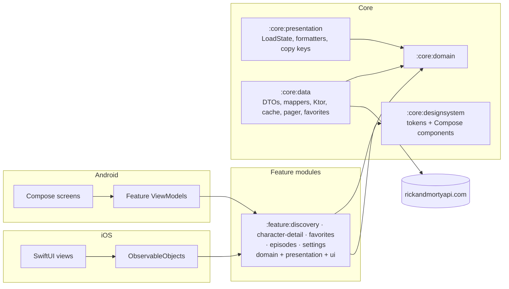

# Multiverse Explorer

- **Status:** Active — target state (no implementation yet; see [`docs/DOCUMENTATION_AUDIT.md`](docs/DOCUMENTATION_AUDIT.md) §5)
- **Last verified:** 2026-09-29
- **Owner:** Delivery Planner (see [`AGENTS.md`](AGENTS.md))
- **Authoritative for:** the developer entry point — prerequisites, build, run, test and quality commands, platform support, known limitations, documentation index.
- **Not authoritative for:** requirements, architecture, the remote contract, the visual specification or process — each links below.
- **Inputs:** [`assessment.md`](assessment.md), [`docs/REQUIREMENTS.md`](docs/REQUIREMENTS.md), [`docs/DESIGN.md`](docs/DESIGN.md), [`docs/TECHNICAL_PLAN.md`](docs/TECHNICAL_PLAN.md)

A Kotlin Multiplatform client for the public [Rick and Morty API](https://rickandmortyapi.com/): browse every character, open one character, favourite the ones you like.

Built as a recruitment deliverable for the ZARA mobile assignment described in [`assessment.md`](assessment.md).

> **Project status: documentation baseline, no implementation yet.**
> This repository currently contains specifications, decisions and process documentation only. There is no Gradle build, no source code, no CI and no `.gitignore` yet. Every command in this README is the **intended** command and is marked as such until the build exists. Nothing in this README has been produced by running the app.

## 1. Assessment objectives

The assignment ([`assessment.md`](assessment.md)) asks for:

| Requirement | How this project answers it |
| --- | --- |
| List all characters and inspect the selected one | Character list (paginated, searchable, filterable) and character detail |
| Review how the project is structured, whether SOLID is applied | Eight explicit modules with inward-only dependencies, Clean Architecture layers, documented contracts and ADRs |
| "Very image oriented company, UX is important" | Image-first design system, dynamic portrait accents, shared-element transitions, screenshot-tested UI |
| Performance discussion | Numeric budgets with a measurement method in [`docs/PERFORMANCE.md`](docs/PERFORMANCE.md) |
| Extras: image caching, error handling, response caching, tests, filter/search | All committed — see the feature table in §3 |
| "use them wisely, each third party library added is a dependency" | One library per concern, each justified in [`docs/DESIGN.md`](docs/DESIGN.md) or an ADR |
| Use Jetpack Compose or SwiftUI | Both, as two native clients over a shared Kotlin core |

## 2. Supported platforms

| Platform | UI | Minimum | Status |
| --- | --- | --- | --- |
| Android | Jetpack Compose, Material 3 Expressive | API 26 (compile/target 37) | Milestone M1 — first deliverable |
| iOS | SwiftUI, Liquid Glass on iOS 26+ with a material fallback | iOS 18.0 | Milestone M2 — second deliverable |

Phone portrait only; tablet, foldable and landscape are explicit non-goals ([`docs/REQUIREMENTS.md`](docs/REQUIREMENTS.md) §1.2).

## 3. Features

### Committed for the deliverable

| Feature | Requirement |
| --- | --- |
| Paginated character list with a live total from the API | `REQ-FUNC-001` |
| Character detail with origin, last known location, episode count and first appearance | `REQ-FUNC-002`, `REQ-FUNC-023` |
| Name search, 300 ms debounce, request cancellation | `REQ-FUNC-003` |
| Status filter: All, Alive, Dead, Unknown | `REQ-FUNC-004` |
| Image-first cards with placeholder, crossfade and branded error state | `REQ-FUNC-005` |
| Favourites, stored locally, with a Favorites section | `REQ-FUNC-006` |
| Branded splash whose portal rotation is the loading indicator | `REQ-FUNC-007` |
| Four destinations: Characters, Episodes, Favorites, Settings | `REQ-FUNC-008` |
| Card-to-detail shared-element transition with Reduce Motion fallback | `REQ-FUNC-009` |
| Designed empty, stale, error and partial-data states | `REQ-FUNC-010`, `REQ-FUNC-022` |
| Retry and manual refresh | `REQ-FUNC-011`, `REQ-FUNC-012` |
| Localisation: English and Spanish | `REQ-FUNC-013` |
| Response caching with an explicit freshness policy | `REQ-FUNC-020` |
| Memory and disk image caching | `REQ-FUNC-021` |
| Settings: Sounds preference (off by default), REST API or GraphQL data source (REST by default), delete all favorites with confirmation | `REQ-FUNC-033`, `REQ-FUNC-034`, `REQ-FUNC-035` |

### Deferred by decision

| Feature | Status |
| --- | --- |
| Voice search (speech-to-text) | Deferred — `DEC-002`. No microphone or speech permission is requested. |
| Real Episodes screens | Deferred — `DEC-005`. Episodes ships as a designed placeholder with a route back to Characters. |
| Real Locations screens | Deferred — `DEC-005`, `DEC-055`. Locations is not in the navigation. |
| Sound effects | Deferred — `DEC-055`. The Sounds setting is stored but plays nothing yet. |

### Planned screens and screenshots

The visual specification is [`docs/UI_SPEC.md`](docs/UI_SPEC.md). It defines seven frames per platform (Splash, Discovery, Detail, Episodes placeholder, Favorites empty state, Settings, and the Delete favorites confirmation) and cross-links every component to its Figma node.

Screenshots are **not committed yet**. Two sets are pending and tracked in [`docs/BACKLOG.md`](docs/BACKLOG.md):

- rendered PNG exports of the Figma screens under `docs/figma/` (the Figma source requires project access);
- in-app screenshots of the running apps, added to this README once the corresponding milestone is verified.

## 4. Architecture in brief

Clean Architecture with unidirectional data flow, in Kotlin Multiplatform:



- Dependencies point inward: features → core → domain. The `:core:domain` module has no framework, HTTP or UI dependency, and no feature module depends on another feature module.
- UI is native on each platform; domain, data, UI-state contracts, formatters and copy keys are shared.
- Full detail, module table, dependency rules and class diagram: [`docs/DESIGN.md`](docs/DESIGN.md). Rationale: [`docs/adr/0001-module-boundaries.md`](docs/adr/0001-module-boundaries.md).

## 5. Repository structure

```text
.
├── assessment.md                 # The assignment (authoritative, frozen)
├── AGENTS.md                     # Operating rules for AI agents
├── README.md                     # This file
├── README.es.md                  # Spanish translation of this file
└── docs/
    ├── REQUIREMENTS.md           # Requirements, acceptance criteria, traceability
    ├── DESIGN.md                 # Architecture, modules, contracts, navigation
    ├── API_SPECS.md              # Remote contract, errors, caching policy
    ├── UI_SPEC.md                # Visual and interaction specification
    ├── CONTRACTS.md              # Internal module interfaces and invariants
    ├── ERROR_FLOW.md             # Failure → state → copy chain
    ├── PERFORMANCE.md            # Budgets and measurement method
    ├── OBSERVABILITY.md          # Logging contract and debug diagnostics
    ├── SECURITY.md               # Threat model, privacy, advisory register
    ├── TESTING.md                # Test strategy, tooling, traceability
    ├── DEFINITION.md             # Ready, Done, release and documentation gates
    ├── GUIDELINES.md             # Code conventions and where they are enforced
    ├── CONTRIBUTING.md           # Setup, branch, PR and review process
    ├── TECHNICAL_PLAN.md         # Milestones, sequencing, quality gates
    ├── BACKLOG.md                # Canonical work index (TASK ids)
    ├── DECISION_BOARD.md         # Decision status index (DEC ids)
    ├── PROJECT_LOG.md            # Why the project evolved as it did
    ├── HANDOFF.md                # Current state and next actions
    ├── DOCUMENTATION_AUDIT.md    # Documentation inventory and open gaps
    ├── adr/                      # Architecture decision records
    ├── design/                   # Historical Figma generation briefs (inputs)
    ├── figma/                    # Rendered PNG exports (pending)
    └── templates/                # Backlog item, test case, PR, bug report
```

The build will add `core/{domain,data,presentation,designsystem,testing}`, `feature/{discovery,character-detail,favorites,episodes,settings}`, `androidApp/`, `iosApp/`, a `benchmark` module and the CI workflows. Each feature module contains its own Clean Architecture layers as packages. See [`docs/DESIGN.md`](docs/DESIGN.md) §3.

## 6. Prerequisites

| Tool | Version | Notes |
| --- | --- | --- |
| JDK | 17 or newer | Required by the Gradle build |
| Android SDK | Platform 37 (Android 17), Build Tools current | `minSdk` 26 |
| Xcode | 26 or newer | Required to compile the iOS 26 Liquid Glass APIs |
| Kotlin | 2.4.20 | Supplied by the Gradle toolchain; no local install needed |
| Node.js | Not required | No web target |

No API key, account or credential is needed: the Rick and Morty API is public, unauthenticated and read-only.

## 7. Setup

```bash
git clone <repository-url>
cd RickAndMorty
```

The Gradle wrapper will be committed with the build; no separate Gradle installation is required. There is nothing else to configure: the API base URL is a build constant, and no property file, keystore or environment variable is needed.

## 8. Build and run

> The build does not exist yet. The commands below are the intended interface, recorded so the plan and the documentation are concrete. They will be verified and this note removed when the build lands.

| Task | Command |
| --- | --- |
| Build the Android debug app | `./gradlew :androidApp:assembleDebug` |
| Install on a connected device/emulator | `./gradlew :androidApp:installDebug` |
| Build the shared framework for iOS | `./gradlew :core:presentation:linkDebugFrameworkIosSimulatorArm64` |
| Build the iOS app | `xcodebuild -project iosApp/iosApp.xcodeproj -scheme iosApp -destination 'platform=iOS Simulator,name=iPhone 17 Pro' build` |

## 9. Test and quality commands

Every pull request must pass the full suite on both platforms before it can be approved (`DEC-054`); the definitions of Ready, Done and the merge gate are in [`docs/DEFINITION.md`](docs/DEFINITION.md), and the test strategy is in [`docs/TESTING.md`](docs/TESTING.md).

| Task | Command |
| --- | --- |
| All shared and unit tests | `./gradlew test` |
| Android screenshot verification | `./gradlew :feature:discovery:verifyRoborazziDebug` |
| Record new screenshot baselines (review the diff before committing) | `./gradlew :feature:discovery:recordRoborazziDebug` |
| Formatting, static analysis, dependency checks | `./gradlew ktlintCheck detekt lintDebug buildHealth` |
| Module-graph rule check (no feature-to-feature edges) | `./gradlew buildHealth` |
| iOS snapshots and state-holder tests | `xcodebuild test -scheme iosApp -destination 'platform=iOS Simulator,name=iPhone 17 Pro'` |
| Performance benchmarks (requires a device) | `./gradlew :benchmark:connectedCheck` |
| Contract suite in fixture/replay mode (part of the PR gate) | `./gradlew :core:data:contractTestReplay` |
| Contract suite against the live API (scheduled signal, not a merge blocker) | `./gradlew :core:data:contractTestLive` |

Development follows the TDD protocol in [`docs/CONTRIBUTING.md`](docs/CONTRIBUTING.md): write the failing test and commit it (`test:`), make it pass and commit (`feat:`/`fix:`), refactor and commit (`refactor:`), then push.

## 10. Configuration

| Item | Value | Where |
| --- | --- | --- |
| API base URL | `https://rickandmortyapi.com/api/` | Build constant; not discovered at runtime |
| App version | Single `VERSION` source feeding `versionName` and `CFBundleShortVersionString` | `DEC-043` |
| Remote protocol | REST. GraphQL is documented as the alternative, not shipped | `DEC-011`, [`docs/API_SPECS.md`](docs/API_SPECS.md) §2 |
| Cache freshness | 24 h fresh, 7 d stale-while-revalidate, 30 d offline fallback | `DEC-012` |
| Release mechanism | Tag `vMAJOR.MINOR.PATCH`, GitHub Release with the APK attached | `DEC-043` |

## 11. Known limitations

1. **Images are 300 × 300.** The API publishes one square avatar per character and nothing larger. The detail hero therefore upscales the source; scrims and the blurred iOS backdrop make this a stylistic choice rather than a visible defect ([`docs/UI_SPEC.md`](docs/UI_SPEC.md) §5.3, `CON-002`).
2. **One tab is a placeholder.** Episodes is a designed coming-soon screen; Favorites and Settings are real (`DEC-005`, `DEC-055`). The Sounds setting plays nothing until a sound set is decided.
3. **Voice search is not implemented.** It is deferred, and no microphone or speech permission is requested (`DEC-002`).
4. **Phone portrait only.** No tablet, foldable or landscape layout (`DEC-027`).
5. **No analytics.** There is intentionally no analytics, tracking or advertising SDK (`REQ-OBS-003`).
6. **Three toolchain artifacts are pinned pre-release.** Material 3 Expressive is pinned at an alpha version; the accepted risk and the fallback plan are recorded in [`docs/adr/0008-alpha-dependencies.md`](docs/adr/0008-alpha-dependencies.md).
7. **The API is unversioned.** Its shape can change without notice, so contract tests run outside the merge gate (`DEC-029`).
8. **The reference device for performance budgets is not yet locked.** Budgets and the measurement method exist; the named device is recorded as a pending assumption in [`docs/PERFORMANCE.md`](docs/PERFORMANCE.md).

## 12. Documentation index

| Document | Purpose | Audience |
| --- | --- | --- |
| [`assessment.md`](assessment.md) | The assignment. Overrides everything on conflict | Everyone |
| [`AGENTS.md`](AGENTS.md) | Operating rules for AI agents: precedence, permissions, escalation | AI agents, contributors |
| [`docs/REQUIREMENTS.md`](docs/REQUIREMENTS.md) | Requirements, acceptance criteria, scope, risks | Product, developers, QA |
| [`docs/DESIGN.md`](docs/DESIGN.md) | Architecture, modules, state contracts, navigation | Developers |
| [`docs/API_SPECS.md`](docs/API_SPECS.md) | Remote contract, DTOs, errors, caching policy | Developers, API reviewers |
| [`docs/UI_SPEC.md`](docs/UI_SPEC.md) | Tokens, components, screens, motion, accessibility | Design, developers, QA |
| [`docs/CONTRACTS.md`](docs/CONTRACTS.md) | Internal interfaces and invariants | Developers |
| [`docs/ERROR_FLOW.md`](docs/ERROR_FLOW.md) | Every failure mapped to a state and copy | Developers, QA |
| [`docs/PERFORMANCE.md`](docs/PERFORMANCE.md) | Budgets and how they are measured | Developers, reviewers |
| [`docs/OBSERVABILITY.md`](docs/OBSERVABILITY.md) | Logging contract, redaction, debug diagnostics | Developers, security |
| [`docs/SECURITY.md`](docs/SECURITY.md) | Threat model, privacy, advisory register | Security reviewers |
| [`docs/TESTING.md`](docs/TESTING.md) | Test strategy, tooling, requirement traceability | Developers, QA |
| [`docs/DEFINITION.md`](docs/DEFINITION.md) | Ready, Done, release and documentation gates | Everyone |
| [`docs/GUIDELINES.md`](docs/GUIDELINES.md) | Code conventions and their enforcement | Developers |
| [`docs/CONTRIBUTING.md`](docs/CONTRIBUTING.md) | Setup, branching, PRs, review | Contributors |
| [`docs/TECHNICAL_PLAN.md`](docs/TECHNICAL_PLAN.md) | Milestones, sequencing, quality gates | Reviewers, planners |
| [`docs/BACKLOG.md`](docs/BACKLOG.md) | Work index with task-level acceptance | Reviewers, developers |
| [`docs/DECISION_BOARD.md`](docs/DECISION_BOARD.md) | Every decision, its status and its ADR | Reviewers |
| [`docs/adr/`](docs/adr/) | Rationale for architecturally significant decisions | Reviewers |
| [`docs/PROJECT_LOG.md`](docs/PROJECT_LOG.md) | Chronological record of why things changed | Everyone |
| [`docs/HANDOFF.md`](docs/HANDOFF.md) | Current state and next actions | Incoming developer or agent |
| [`docs/DOCUMENTATION_AUDIT.md`](docs/DOCUMENTATION_AUDIT.md) | Inventory, ownership, open gaps | Documentation maintainer |
| [`docs/templates/`](docs/templates/) | Working templates for recurring artifacts | Contributors |

Deliberately not created, with reasons in [`docs/DECISION_BOARD.md`](docs/DECISION_BOARD.md) §3: `ARCHITECTURE.md` (merged into `DESIGN.md`), `SPECIFICATION.md` (would duplicate requirements), `ANALYTICS.md` (no analytics — replaced by `OBSERVABILITY.md`), `SECURITY_ADVISORY_REGISTER.md` (a section of `SECURITY.md` for now), `CHANGELOG.md` (superseded by `PROJECT_LOG.md` plus generated release notes).

## 13. Contributing

Start with [`docs/CONTRIBUTING.md`](docs/CONTRIBUTING.md) for setup, branch and commit conventions, the pull-request template, and the required checks. Code conventions live in [`docs/GUIDELINES.md`](docs/GUIDELINES.md); the definition of done lives in [`docs/DEFINITION.md`](docs/DEFINITION.md).

Work is indexed in [`docs/BACKLOG.md`](docs/BACKLOG.md) and tracked as GitHub Issues. Report vulnerabilities privately through the route in [`docs/SECURITY.md`](docs/SECURITY.md) — never in a public issue.

## 14. Project status

| Area | State |
| --- | --- |
| Assignment analysis | Complete — [`docs/REQUIREMENTS.md`](docs/REQUIREMENTS.md) |
| Remote contract | Complete and verified against the live API on 2026-09-29 — [`docs/API_SPECS.md`](docs/API_SPECS.md) |
| Architecture and decisions | Complete — [`docs/DESIGN.md`](docs/DESIGN.md), [`docs/adr/`](docs/adr/), [`docs/DECISION_BOARD.md`](docs/DECISION_BOARD.md) |
| Visual specification | Complete, pending two Figma screens (error states) — [`docs/UI_SPEC.md`](docs/UI_SPEC.md) |
| Process documentation | Complete — `GUIDELINES`, `CONTRIBUTING`, `DEFINITION`, `TESTING`, `SECURITY`, `OBSERVABILITY` |
| Implementation | Not started — see [`docs/TECHNICAL_PLAN.md`](docs/TECHNICAL_PLAN.md) and [`docs/BACKLOG.md`](docs/BACKLOG.md) |
| CI, build files, `.gitignore`, version catalog | Not started |
| Screenshots (Figma exports and in-app) | Not started |
