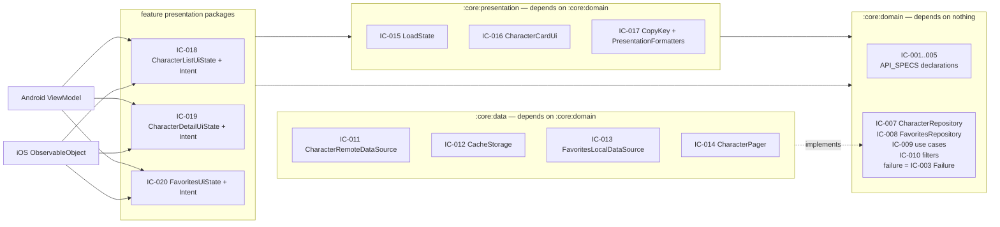

# CONTRACTS.md — Internal Kotlin Contract Baseline

- **Status:** Active — target state (the repository contains no source code, no build files and no CI yet; see `DOCUMENTATION_AUDIT.md` §5 for the drift rule)
- **Last verified:** 2026-09-29
- **Owner:** System Architect (see `AGENTS.md` §3)
- **Authoritative for:** the internal Kotlin contracts `IC-###` — the source-level declarations that cross a module boundary (repository, data-source, cache, storage and pager seams), the shared UI-state types both platforms consume, and the invariants, ownership, reference and compatibility rules attached to each of them.
- **Not authoritative for:** the remote-facing and domain model declarations (`API_SPECS.md` §3, §4.7, §5, §6), the failure → state → copy chain (`ERROR_FLOW.md`), module composition and dependency direction (`DESIGN.md` §3, `adr/0001-module-boundaries.md`), requirement ids and acceptance criteria (`REQUIREMENTS.md`), visual specification (`UI_SPEC.md`), test ids, layers and tooling (`TESTING.md`), user-visible copy strings (`UI_SPEC.md` §6.4, §8).
- **Inputs:** [`REQUIREMENTS.md`](REQUIREMENTS.md) · [`API_SPECS.md`](API_SPECS.md) §3, §4.7, §6, §7, §8 · [`DESIGN.md`](DESIGN.md) §1, §3, §4, §6 · [`ERROR_FLOW.md`](ERROR_FLOW.md) · [`UI_SPEC.md`](UI_SPEC.md) §6, §8 · [`TESTING.md`](TESTING.md) · [`DECISION_BOARD.md`](DECISION_BOARD.md) · [`adr/0001-module-boundaries.md`](adr/0001-module-boundaries.md) · [`adr/0003-ui-sharing-strategy.md`](adr/0003-ui-sharing-strategy.md)
- **Normative terms:** `MUST` mandatory · `SHOULD` strong recommendation · `MAY` optional.

> This file is the single canonical location for the declarations it owns. Another document that needs one of them `MUST` cite its `IC-###` id and `MUST NOT` restate its signature, defaults or invariants.

## Table of contents

1. [Purpose and the one-owner rule](#1-purpose-and-the-one-owner-rule)
2. [Identifier scheme and how contracts are referenced](#2-identifier-scheme-and-how-contracts-are-referenced)
3. [Ownership map: one canonical location per type](#3-ownership-map-one-canonical-location-per-type)
4. [Referenced contracts owned by API_SPECS](#4-referenced-contracts-owned-by-api_specsmd)
5. [Data and domain seam contracts (owned here)](#5-data-and-domain-seam-contracts-owned-here)
6. [Presentation contracts (owned here)](#6-presentation-contracts-owned-here)
7. [Consumption by platform state holders](#7-consumption-by-platform-state-holders)
8. [Change, versioning and compatibility rules](#8-change-versioning-and-compatibility-rules)
9. [Contract verification strategy](#9-contract-verification-strategy)
10. [Assumptions and drift register](#10-assumptions-and-drift-register)
11. [Change log](#11-change-log)

Module names, source-set layout and dependency direction follow `adr/0001-module-boundaries.md` (`DEC-052`, which supersedes `DEC-019`). This file states which module a declaration lives in; it does not restate the dependency rules.



## 1. Purpose and the one-owner rule

### 1.1 Why this file exists

Filtering, paging, enrichment, favourites and display formatting must behave identically on Android and iOS while each platform owns its own UI, navigation, image pipeline and state holder (`DEC-001`, `DEC-013`, `REQ-PLAT-001`). That is only verifiable if the source-level boundary between shared logic and platform code has exactly one normative description. This file is it.

### 1.2 The one-owner rule

| Rule | Statement |
| --- | --- |
| O1 | Every type, interface or enum that crosses a module boundary has exactly **one** canonical declaration, named in §3. |
| O2 | A document that is not the owner references the declaration by `IC-###` id (or by `REQ-*`/`API-*`/`DEC-###` id) and `MUST NOT` repeat its signature, defaults or invariants. |
| O3 | When a signature or an invariant changes, the owning document changes in the same pull request as the code (`DEC-046`, `DEFINITION.md` D7). For the declarations this file owns, the owner is this file. |
| O4 | Ownership never moves silently: relocating a declaration to another module or another document is a contract change (§8). |

`DESIGN.md` §4.1 owns the **data flow** of the shared presentation state; it does not own the type declarations. This file owns them. A change to a UI-state type is therefore made **in this file first**, then consumed by the feature module, and `DESIGN.md` §4.1 is edited only if the flow or the module picture changed.

## 2. Identifier scheme and how contracts are referenced

### 2.1 The `IC-###` namespace

- `IC-###` is the identifier for one internal contract. It is allocated in this file only, in ascending order, and never reused: a contract that stops existing has its id retired with it. A retired id is kept in place, marked `Withdrawn` with the reason and the convention that replaced it, and the surrounding ids are never renumbered (`IC-006` is the first precedent).
- An id names a *contract*, not a file: two closely coupled declarations that always change together (for example a state class and its intent type) `MAY` share one id when they are listed in one table row, and their members are then addressed as `IC-018` (state + intents).
- A contract that is canonically declared in another document is still listed here with an id (§4). The id is the stable reference; the owning document is named in the row.
- The ids are referenced by other families the same way `REQ-*` and `DEC-###` are: permanently, and never renumbered (`DEC-046`).

### 2.2 Reference forms

| Form | Meaning | Example |
| --- | --- | --- |
| `IC-018` | The contract, cited from another document or from code review | "see `IC-018`" |
| `IC-018 (CharacterListUiState)` | The contract with its primary type name, for readability in prose | — |
| `IC-###` inside a pull request | `DEFINITION.md` D7 requires the same-change update of this file | — |

A document `MUST NOT` write "the state class in `DESIGN.md` §4.1" or "the pager in `:core:data`" when an `IC-###` id exists; it cites the id. Requirement-level traceability (requirement → contract → task → test) is maintained in `DOCUMENTATION_AUDIT.md` §6, with the contract half taken from this file.

### 2.3 What a contract row contains

Every contract in §4–§6 states: the `IC-###` id, the declaration (or the pointer to the owning document), the module and source set, the invariants other code may rely on, and the traceability identifiers (`REQ-*`, `AC-*`, `API-*`, `DEC-###`). An invariant is always a testable statement about behaviour, not a restatement of the signature.

## 3. Ownership map: one canonical location per type

```text
Kotlin type                              Canonical document        Module and source set
---------------------------------------  ------------------------  ------------------------------------------
CharacterId, LocationId, EpisodeId       API_SPECS.md §3           :core:domain  commonMain
CharacterSummary, CharacterDetails       API_SPECS.md §3           :core:domain  commonMain
CharacterPage, LocationSummary           API_SPECS.md §3           :core:domain  commonMain
EpisodeSummary, CharacterStatus          API_SPECS.md §3           :core:domain  commonMain
CharacterGender                          API_SPECS.md §3           :core:domain  commonMain
DataResult<T> (sealed), DataSource,        API_SPECS.md §3           :core:domain  commonMain
  ApiWarning
ApiFailure (+ every variant)             API_SPECS.md §6           :core:domain  commonMain
REST DTOs, GraphQL envelopes             API_SPECS.md §4.7, §5.1   :core:data    commonMain (never outside)
CharacterRepository                      CONTRACTS.md IC-007       :core:domain  commonMain
FavoritesRepository                      CONTRACTS.md IC-008       :core:domain  commonMain
Use cases (cross-feature and feature)    CONTRACTS.md IC-009       :core:domain, or the feature's domain package
CharacterFilter, StatusFilter            CONTRACTS.md IC-010       :core:domain  commonMain
CharacterRemoteDataSource                CONTRACTS.md IC-011       :core:data    commonMain
CacheStorage, CacheKey, CacheEntry       CONTRACTS.md IC-012       :core:data    commonMain
FavoritesLocalDataSource                 CONTRACTS.md IC-013       :core:data    commonMain
CharacterPager, PagerState               CONTRACTS.md IC-014       :core:data    commonMain
LoadState                                CONTRACTS.md IC-015       :core:presentation  commonMain
CharacterCardUi                          CONTRACTS.md IC-016       :core:presentation  commonMain
CopyKey, PresentationFormatters          CONTRACTS.md IC-017       :core:presentation  commonMain
CharacterListUiState, CharacterListIntent CONTRACTS.md IC-018      :feature:discovery  presentation package
CharacterDetailUiState, InfoRowUi,       CONTRACTS.md IC-019       :feature:character-detail  presentation package
  InfoRowKind, CharacterDetailIntent
FavoritesUiState, FavoritesIntent         CONTRACTS.md IC-020      :feature:favorites  presentation package
CharacterAccentResolver                   DESIGN.md §4.4            :feature:discovery  androidMain UI
```

### 3.1 The boundary rule between this file and `API_SPECS.md`

| Owner | Owns | Reason |
| --- | --- | --- |
| `API_SPECS.md` §3, §4.7, §5, §6 | Wire-facing and domain model declarations: DTOs, response envelopes, domain models, identity types, `DataResult`, `DataSource`, `ApiFailure`, and the mapping and retry policy | These types are derived from the remote contract and change when the API changes; `API_SPECS.md` §14 already requires the document and its contract tests to move together (`CON-001`, `RISK-004`) |
| This file | Module seam interfaces, the shared presentation-state types, and their invariants | These are internal composition decisions that do not depend on the API shape; they change with the architecture |

Consequence, stated once and applied throughout: this file lists the `API_SPECS.md` declarations as **reference-only entries** (`IC-001`…`IC-005`) carrying the usage invariants that follow from the layering rules, and declares no wire type of its own. No `API_SPECS.md` declaration is duplicated here, and no signature declared here is restated in `API_SPECS.md`.

### 3.2 Types deliberately absent from the contract surface

| Absent | Where it may appear | Rule |
| --- | --- | --- |
| REST DTOs (`RestCharacterDto`, `RestPageDto<T>`, …) and GraphQL envelopes (`GraphQlResponse<T>`, `GraphQlError`) | `:core:data` internals and its test source sets | `MUST NOT` appear in any `IC-###` signature, in a UI-state type, or in a public signature outside `:core:data` (`REQ-NFR-001`, `AC-REQ-NFR-001-2`) |
| Platform and UI types (`Bitmap`, `Color`, `Modifier`, `UIImage`, `View`, lifecycle artifacts) | Platform source sets only | `MUST NOT` appear in any shared contract (`AC-REQ-PLAT-001-1`); `CharacterAccentResolver` is the single documented exception and is Android UI code, not a shared contract (`DESIGN.md` §4.4) |
| Exception types originating in a platform or in Ktor | `:core:data` internals | `MUST NOT` cross a repository or data-source seam: `:core:data` maps them to an `ApiFailure` and returns `DataResult.Failure` (`IC-003`); a `CancellationException` is the only exception that propagates (`ERROR_FLOW.md` §2, §6) |

Test doubles are not contracts: the fakes named in §9 live in `:core:testing`, are owned by `TESTING.md` §6, and `MUST` honour the `IC-###` they stand in for rather than defining competing semantics.

## 4. Referenced contracts owned by `API_SPECS.md`

Each entry below is a pointer plus the invariants that apply to *consumers*. The declaration lives in `API_SPECS.md`; this file `MUST NOT` grow a second copy of it.

### IC-001 — Identity types

- **Declared in:** `API_SPECS.md` §3 (`CharacterId`, `LocationId`, `EpisodeId`).
- **Module:** `:core:domain`.
- **Invariants**
  - An id is the canonical server string in every layer: REST integer ids are converted with `toString()` exactly once, in the mapper (`API_SPECS.md` §3).
  - An id `MUST NOT` be derived from an array index or from a position in a batch response, on any code path.
  - Value-class identity is the only identity: two ids are equal iff their strings are equal; no case folding, trimming or numeric coercion is applied.
- **Traceability:** `API_SPECS.md` §3, `REQ-NFR-001`, `AC-REQ-NFR-001-1`.

### IC-002 — Domain models

- **Declared in:** `API_SPECS.md` §3 (`CharacterSummary`, `CharacterDetails`, `CharacterPage`, `LocationSummary`, `EpisodeSummary`, `CharacterStatus`, `CharacterGender`).
- **Module:** `:core:domain`.
- **Invariants**
  - `CharacterDetails.episodeSummaries == null` means enrichment was not requested, and an empty list means enrichment completed with no appearances (`API_SPECS.md` §3). Consumers `MUST NOT` treat `null` as "no episodes".
  - An unknown `status` or `gender` string is preserved in the model as `Unsupported(raw)` (or the gender equivalent) and never drops the character or throws (`REQ-NFR-004`, `AC-REQ-NFR-004-2`).
  - An empty `type` is absent in the domain (`null`), and a `LocationSummary` with an empty reference URL is valid and has no id (`API_SPECS.md` §4.7).
  - A missing or unparsable `createdAt` maps to `null` and `MUST NOT` prevent the rest of the character from rendering.
  - `CharacterPage.page` is the requested page number; `pageCount`, `totalCount` and `nextPage` remain `null` when the server has not established them. Consumers `MUST NOT` substitute `0` for a null count (`REQ-FUNC-001`, `AC-REQ-FUNC-001-3`).
- **Traceability:** `API_SPECS.md` §3, §4.7, §5.3, `REQ-FUNC-001`, `REQ-FUNC-002`, `REQ-FUNC-023`, `REQ-NFR-004`, `AC-REQ-NFR-004-2`.

### IC-003 — Result envelope and cache provenance

- **Declared in:** `API_SPECS.md` §3 (sealed `DataResult<out T>` with `Success`/`Failure`, `DataSource`, `ApiWarning`). That section owns the declaration; this entry owns the consumer invariants below.
- **Module:** `:core:domain`.
- **Invariants**
  - `DataResult.Success.value` exists only for a payload that was fully decoded and passed domain mapping; a partially decoded or `errors`-accompanied payload is never a silent partial value — it is either a `Success` carrying non-empty `warnings`, when every field the screen needs is valid, or a `Failure` (`API_SPECS.md` §6.2).
  - Failure is a value, not an exception: a suspending seam declared in §5 returns `DataResult.Failure(failure, source, warnings)` for any expected remote failure. It `MUST NOT` throw, `MUST NOT` return a sentinel and `MUST NOT` return a partially populated model to signal failure.
  - `CancellationException` is always rethrown. It is never converted into a `DataResult.Failure`, never wrapped, and never mapped to `ApiFailure` (`ERROR_FLOW.md` §6, `AC-REQ-FUNC-022-2`).
  - `Failure.source` is the source that produced the failure and is never a cache hit: a failure cannot originate from served cache content (`API_SPECS.md` §7.3).
  - `Failure` carries no value: there is no partial payload alongside a failure, and a caller `MUST NOT` reconstruct one.
  - `isStale` exists on `Success` only. `Success.isStale == true` implies `source != NETWORK`: stale means content served from a cache (`API_SPECS.md` §7.3). The converse does not hold — a cache hit inside the fresh window is not stale.
  - `warnings` is available on both outcomes and is non-empty only for a response that was usable but incomplete; it carries `ApiWarning` entries (`API_SPECS.md` §3). A warning `MUST NOT` be rendered as a failure, and a response carrying warnings `MUST NOT` be written to any cache (`API_SPECS.md` §7.2, `REQ-FUNC-020`).
  - `source` is decided by the data layer only. A UI-state consumer reads it; it never computes it.
  - A consumer handles the sealed hierarchy exhaustively; a `when` over `DataResult` `MUST NOT` fall through to a default branch in shared code.
- **Traceability:** `API_SPECS.md` §3, §6.2, §7.1–§7.3, `REQ-FUNC-020`, `REQ-FUNC-022`, `REQ-REL-004`, `DEC-012`, `DEC-018`.

### IC-004 — Failure taxonomy

- **Declared in:** `API_SPECS.md` §6 (`ApiFailure` and its variants).
- **Module:** `:core:domain`.
- **Invariants**
  - Failure classification is total: every failure that reaches a consumer is one `ApiFailure` variant, produced by the mapping rules in `API_SPECS.md` §6.1–§6.2 and the taxonomy in `ERROR_FLOW.md` §2.
  - `CancellationException` is never a failure value: it propagates unchanged (`ERROR_FLOW.md` §6, `AC-REQ-FUNC-022-2`).
  - `ApiFailure.GraphQl` is never produced by the REST adapter (`DEC-011`, `ERROR_FLOW.md` §2).
  - The failure → state → copy chain is owned by `ERROR_FLOW.md` (DEC-021) and `MUST NOT` be restated in a contract: contracts carry the failure, they do not decide the copy.
- **Traceability:** `API_SPECS.md` §6, `ERROR_FLOW.md` §2, §4, `REQ-FUNC-022`, `AC-REQ-FUNC-022-1`, `AC-REQ-FUNC-022-2`.

### IC-005 — Wire types

- **Declared in:** `API_SPECS.md` §4.7 (REST DTOs), §5.1 (GraphQL envelope), §5.5 (operations).
- **Module:** `:core:data`, `commonMain` — and nowhere else.
- **Invariants**
  - A wire type `MUST NOT` appear in a signature declared in §5 or §6 of this file, in a UI-state type, or in any public signature outside `:core:data` (`REQ-NFR-001`, `AC-REQ-NFR-001-2`).
  - A wire type `MUST NOT` be cached as a domain value: the cache stores the decoded-and-validated shape the app consumes, and mappers run before anything is written (`API_SPECS.md` §7.1).
  - JSON field names and nullability follow `API_SPECS.md`; a DTO `MUST NOT` be reshaped by a contract change here.
- **Traceability:** `API_SPECS.md` §4.7, §5.1, §5.5, `REQ-NFR-001`, `AC-REQ-NFR-001-2`, `DEC-030`.

## 5. Data and domain seam contracts (owned here)

### IC-006 — Withdrawn: failure signalling across a seam

- **Status:** Withdrawn, 2026-09-29. The id is retired and is not reallocated; the `IC-###` sequence continues at `IC-007`, so no existing id is renumbered.
- **Invariants:** none — the id no longer names a live contract. The invariants that survive it are the `Carried forward` items below, which are now stated by `IC-003`.
- **Former contract:** `class ApiException(val failure: ApiFailure) : Exception()`, thrown by a data-layer seam to signal a mapped remote failure.
- **Withdrawn because:** failure is now a value, not thrown control flow. The convention was replaced by the sealed `DataResult` declared in `API_SPECS.md` §3 and used by `IC-003`, `IC-007` and `IC-011`:
  - an error is representable in the type system and cannot be silently swallowed by an empty `catch`;
  - no Kotlin exception crosses the Kotlin → Swift interop boundary, where a thrown exception is awkward to observe from an `ObservableObject` — and `DEC-013` makes Swift a first-class consumer of these seams;
  - exhaustive `when` handling of the sealed hierarchy is enforced at compile time;
  - `source` and `warnings` remain available on both outcomes, which a thrown exception could not carry for a successful-but-warned payload.
- **Carried forward:** a `CancellationException` is still rethrown and is never converted into `DataResult.Failure`; the failure is still mapped inside `:core:data` before it reaches a seam (`ERROR_FLOW.md` §2, §3 invariant 1); and a caller that displays a failure still resolves copy through `ERROR_FLOW.md` rather than building user-visible text from the `ApiFailure` fields.
- **Traceability:** `REQ-FUNC-022`, `AC-REQ-FUNC-022-1`, `ERROR_FLOW.md` §2, §3, `adr/0003-ui-sharing-strategy.md`.

### IC-007 — `CharacterRepository`

- **Declaration** (`:core:domain`, `commonMain`):

```kotlin
interface CharacterRepository {
    suspend fun page(filter: CharacterFilter, page: Int): DataResult<CharacterPage>
    suspend fun details(id: CharacterId, enrich: Boolean): DataResult<CharacterDetails>
}
```

- **Invariants**
  - Both methods return `DataResult` and never throw for an expected remote failure: success is `DataResult.Success` carrying a fully mapped value, failure is `DataResult.Failure` carrying the `ApiFailure` (`IC-003`). A `null` value has no meaning here and `MUST NOT` be used to signal a miss.
  - `page` returns the requested page only, and `MUST NOT` fetch a later page as part of the same call (`REQ-FUNC-001`, `AC-REQ-FUNC-001-1`).
  - A filter that matches nothing is a **success** carrying an empty page, not a `Failure` (`REQ-FUNC-010`, `AC-REQ-FUNC-010-1`, `ERROR_FLOW.md` §5).
  - `page` applies the caller's filter unchanged: all active filters are sent on every page (`REQ-FUNC-001`).
  - `details(id, enrich = false)` `MUST NOT` issue an episode request; `details(id, enrich = true)` performs at most one bounded episode batch call, never one request per episode (`REQ-FUNC-023`, `AC-REQ-FUNC-023-1`).
  - A detail for an unknown id returns `DataResult.Failure` carrying `ApiFailure.NotFound`; the repository `MUST NOT` return an empty shell model (`API_SPECS.md` §4.4).
  - Concurrent identical calls are deduplicated in the implementation, so two simultaneous identical loads issue one remote request (`REQ-REL-002`, `AC-REQ-REL-002-1`).
  - Only successfully decoded, domain-valid payloads are promoted to a cache; errors, empty bodies and partial responses are never written (`REQ-FUNC-020`, `AC-REQ-FUNC-020-3`).
  - A `CancellationException` from an underlying suspending call propagates unchanged and is never converted into a `Failure` (`IC-003`).
  - The repository `MUST NOT` expose, accept or depend on a DTO type or a platform type.
- **Traceability:** `REQ-FUNC-001`, `REQ-FUNC-002`, `REQ-FUNC-010`, `REQ-FUNC-020`, `REQ-FUNC-023`, `REQ-REL-002`, `DEC-012`, `DEC-018`.

### IC-008 — `FavoritesRepository`

- **Declaration** (`:core:domain`, `commonMain`):

```kotlin
interface FavoritesRepository {
    fun observe(): Flow<Set<CharacterId>>
    suspend fun toggle(id: CharacterId)
}
```

- **Invariants**
  - `observe()` is a hot, conflated, never-completing stream: it emits the current set to every new collector as its first value, emits again on every change, and never completes on its own (`REQ-FUNC-006`, `AC-REQ-FUNC-006-2`).
  - Emissions are ordered and distinct: a set that is unchanged is not re-emitted.
  - `toggle(id)` applies exactly one flip per call and writes it before returning; concurrent calls are serialised by the implementation so an update cannot be lost.
  - Stored state survives process restart, because persistence is owned by `IC-013` — the repository holds no authoritative in-memory copy (`REQ-FUNC-006`).
  - The set is local to the device: the repository `MUST NOT` perform any network request (`NG-003`, `REQ-SEC-003`).
  - No call on this interface blocks the caller's thread: `observe()` performs no I/O on the subscribing thread and `toggle()` suspends rather than blocking the UI thread.
- **Traceability:** `REQ-FUNC-006`, `DEC-004`, `DEC-017`, [`adr/0007-favorites-storage.md`](adr/0007-favorites-storage.md).

### IC-009 — Use cases

- **Declarations** (one class per row; `invoke` is the only public API):

| Use case | Module and package | Signature | Used by |
| --- | --- | --- | --- |
| `GetCharacterPage` | `:feature:discovery`, `domain` package | `suspend operator fun invoke(filter: CharacterFilter, page: Int): DataResult<CharacterPage>` | `IC-018` state holder, for a one-shot page fetch |
| `GetCharacterDetails` | `:feature:character-detail`, `domain` package | `suspend operator fun invoke(id: CharacterId, enrich: Boolean): DataResult<CharacterDetails>` | `IC-019` state holder |
| `ObserveFavoriteIds` | `:core:domain` (cross-feature) | `operator fun invoke(): Flow<Set<CharacterId>>` | `IC-018`, `IC-019`, `IC-020` state holders |
| `ToggleFavorite` | `:feature:character-detail`, `domain` package | `suspend operator fun invoke(id: CharacterId)` | `IC-019` state holder |

- **Placement rule:** a use case lives in the `domain` package of the feature that uses it, except a use case consumed by more than one feature, which lives in `:core:domain` (`adr/0001-module-boundaries.md`). `ObserveFavoriteIds` is cross-feature for exactly that reason; `GetCharacterPage`, `GetCharacterDetails` and `ToggleFavorite` are feature-local.
- **Invariants**
  - A use case is stateless and holds no cache of its own: two invocations with the same arguments are independent.
  - A use case `MUST NOT` catch `CancellationException`, and `MUST NOT` convert a `CancellationException` into a `DataResult.Failure`. Failure handling and state decisions belong to the state holder (`IC-018`, `IC-019`); a use case returns the `DataResult` it received unchanged.
  - A use case `MUST NOT` read the clock, connectivity or a platform API directly; those arrive through `:core:data` seams.
  - `GetCharacterPage` is the repository call of `IC-007` for one page: paging state, page accumulation and prefetch are not a use-case responsibility. They belong to `IC-014`, which a state holder observes directly through its injected pager.
- **Traceability:** `REQ-FUNC-001`, `REQ-FUNC-002`, `REQ-FUNC-006`, `REQ-FUNC-023`, `adr/0001-module-boundaries.md`.

### IC-010 — `CharacterFilter` and `StatusFilter`

- **Declarations** (`:core:domain`, `commonMain`):

```kotlin
data class CharacterFilter(
    val query: String = "",
    val status: StatusFilter = StatusFilter.All,
)

enum class StatusFilter { All, Alive, Dead, Unknown }
```

- **Why `:core:domain`:** the filter is an input parameter of `IC-007` and therefore part of the domain seam, not a screen-local value. It is immutable, carries no platform type and is the same instance type on both platforms.
- **Invariants**
  - Exactly four status options exist and the default is `All` (`REQ-FUNC-004`, `AC-REQ-FUNC-004-2` refers to the filters the UI offers).
  - `StatusFilter.All` means "send no `status` parameter"; the serialization of that rule happens in `:core:data` and is not a UI decision (`API_SPECS.md` §4.4).
  - A blank `query` means "send no `name` parameter" (`AC-REQ-FUNC-003-3`). The filter retains the raw user text; trimming and encoding are performed by the mapper.
  - `CharacterFilter` is a value: equal filters produce equal cache keys and must resolve to the same cached entry, and different filters must never share one (`REQ-REL-001`, `AC-REQ-REL-001-1`).
  - Species, type and gender are not part of the filter and `MUST NOT` be added without a contract change (§8) and a requirement (`REQ-FUNC-004`, `AC-REQ-FUNC-004-2`).
- **Traceability:** `REQ-FUNC-003`, `REQ-FUNC-004`, `REQ-REL-001`.

### IC-011 — `CharacterRemoteDataSource`

- **Declaration** (`:core:data`, `commonMain`):

```kotlin
interface CharacterRemoteDataSource {
    /** One page of the character list for the given filter. */
    suspend fun characterPage(filter: CharacterFilter, page: Int): CharacterPage
    /** One character with its episode id list; enrichment is orchestrated above this seam. */
    suspend fun characterDetails(id: CharacterId): CharacterDetails
    /** Episode summaries for the given ids, in one bounded batch. */
    suspend fun episodes(ids: List<EpisodeId>): List<EpisodeSummary>
}
```

- **Semantics:** the seam returns **domain** types. DTO decoding and mapping happen inside the implementation (`RestCharacterRemoteDataSource`) so `IC-005` cannot leak through it.
- **Invariants**
  - No DTO or wire envelope crosses this seam (`AC-REQ-NFR-001-2`).
  - An expected remote failure is returned as `DataResult.Failure` (`IC-003`); transport and decoding exceptions never escape, and only a `CancellationException` propagates.
  - `episodes(emptyList())` returns an empty list without any network request; a single-id call uses the single-resource operation and a multi-id call the batch operation, per the routing rule in `API_SPECS.md` §4.2. An implementation `MUST NOT` define one polymorphic batch decoder.
  - A batch chunk is bounded, and the final singleton chunk is routed through the single-resource operation (`API_SPECS.md` §4.4).
  - A batch response that omits a requested id is reconciled by id; the omission is reported as a warning rather than as a failure (`API_SPECS.md` §6.1).
  - Requests are issued only to the configured HTTPS host; a relation or pagination URL naming another host is rejected (`REQ-SEC-001`, `AC-REQ-SEC-001-1`).
  - The seam carries no cache policy: caching is decided above it (`IC-012`).
- **Traceability:** `REQ-FUNC-001`, `REQ-FUNC-023`, `REQ-NFR-001`, `REQ-SEC-001`, `API_SPECS.md` §4.2, §6.1, `DEC-011`.

### IC-012 — `CacheStorage`

- **Declarations** (`:core:data`, `commonMain`):

```kotlin
@JvmInline
value class CacheKey(val value: String)

class CacheEntry(
    val payload: ByteArray,
    val storedAt: Instant,
    val validator: String?,
)

interface CacheStorage {
    suspend fun get(key: CacheKey): CacheEntry?
    suspend fun put(key: CacheKey, entry: CacheEntry)
    suspend fun evict(key: CacheKey)
    suspend fun evictAll()
}
```

- **Semantics:** `CacheStorage` is the persistence seam only — bytes plus the metadata needed to revalidate. Freshness, staleness and write admission are policy owned by the response cache above the seam, using the injected clock (`DEC-012`, `DEC-018`, `API_SPECS.md` §7).
- **Invariants**
  - `get` returns `null` for a miss and never throws: an unreadable or corrupt entry is a miss plus a warning, never a user-visible failure (`REQ-FUNC-020`).
  - A `put` failure is contained: the read path degrades to a cache miss rather than propagating an exception to a screen.
  - `CacheKey.value` is the complete normalized request identity — resource, page and every filter value — so two filter combinations can never share an entry (`REQ-REL-001`, `AC-REQ-REL-001-1`).
  - Only successfully decoded, domain-valid payloads are written; errors, empty bodies and partial responses are never admitted (`REQ-FUNC-020`, `AC-REQ-FUNC-020-3`, `RISK-005`).
  - Image bytes are never stored here: image caching is independent of response caching (`REQ-FUNC-021`, `AC-REQ-FUNC-021-2`).
  - No method reads the wall clock; an entry's age is computed by the caller from `storedAt` and the injected clock, so a device clock change cannot alter freshness evaluation (`REQ-REL-004`, `AC-REQ-REL-004-1`).
  - `evictAll` clears response payloads only and `MUST NOT` touch the favourites store (`IC-013`).
- **Traceability:** `REQ-FUNC-020`, `REQ-FUNC-021`, `REQ-REL-001`, `REQ-REL-004`, `DEC-012`, `DEC-018`.

### IC-013 — `FavoritesLocalDataSource`

- **Declaration** (`:core:data`, `commonMain`, implemented per target by `expect/actual`):

```kotlin
interface FavoritesLocalDataSource {
    fun observe(): Flow<Set<CharacterId>>
    suspend fun add(id: CharacterId)
    suspend fun remove(id: CharacterId)
}
```

- **Semantics:** the storage seam for the favourite id set. `expect/actual` implementations are DataStore on Android and `UserDefaults` on iOS (`DEC-017`, [`adr/0007-favorites-storage.md`](adr/0007-favorites-storage.md)). `IC-008` is the only consumer.
- **Invariants**
  - `add` and `remove` are idempotent set operations: adding a present id and removing an absent id are no-ops that still leave the observable set unchanged.
  - `observe()` emits the persisted set to a new collector without blocking the subscriber, then every subsequent change; the stream is conflated and never completes.
  - Persistence survives process restart, and no id leaks across a simulated reinstall or clear of the store (`REQ-FUNC-006`, `AC-REQ-FUNC-006-2`).
  - Only canonical id strings are persisted (`IC-001`); no index, no ordinal and no name is used as a key.
  - The store holds nothing else: no profile, no token and no personal data (`REQ-SEC-003`).
  - Both `actual` implementations `MUST` satisfy this one contract; semantics `MUST NOT` differ per platform.
- **Traceability:** `REQ-FUNC-006`, `REQ-SEC-003`, `DEC-017`, `TESTING.md` §6.2.

### IC-014 — `CharacterPager`

- **Declarations** (`:core:data`, `commonMain`):

```kotlin
interface CharacterPager {
    val state: Flow<PagerState>
    suspend fun setFilter(filter: CharacterFilter)
    suspend fun next()
    suspend fun refresh()
}

data class PagerState(
    val filter: CharacterFilter,
    val items: List<CharacterSummary>,
    val totalCount: Int?,
    val isAppending: Boolean,
    val isEndReached: Boolean,
    val isStale: Boolean,
    val failure: ApiFailure?,
)
```

- **Semantics:** the shared paging engine (`DEC-016`). It owns page accumulation, prefetch eligibility, cancellation of a superseded load and the end-of-pagination flag. It reports a failure through `PagerState.failure` rather than throwing, because a failed `next()` must not destroy the content already displayed (`REQ-FUNC-012`, `AC-REQ-FUNC-012-2`).
- **Layering note:** `PagerState` does not reuse `IC-015`; `:core:data` depends only on `:core:domain` (`adr/0001-module-boundaries.md`), so a presentation primitive cannot appear in a pager signature. The feature presentation package maps `PagerState` to `IC-018` (see `IC-018` invariants).
- **Invariants**
  - `state` is hot with replay of the current value: a new collector receives the current `PagerState` as its first emission and never triggers a load by collecting.
  - `setFilter` resets to page 1 and cancels any in-flight page load; the items of the previous filter are not carried into the new filter's accumulation (`REQ-FUNC-003`, `REQ-FUNC-004`, `AC-REQ-FUNC-003-2`).
  - `next()` while `isEndReached == true` performs no request; `isEndReached` is set when the server's end-of-pagination signal is observed (`REQ-FUNC-001`, `AC-REQ-FUNC-001-2`, `API_SPECS.md` §4.3).
  - `next()` while a page load is in flight is coalesced: it `MUST NOT` start a second concurrent page request.
  - `isAppending` is `true` only while a page is being appended to existing content; it is always `false` outside an append (so a first page load and a `refresh()` do not set it).
  - `refresh()` performs a network request even when the served entry is fresh, and a failed `refresh()` leaves `items` untouched (`REQ-FUNC-012`, `AC-REQ-FUNC-012-1`, `AC-REQ-FUNC-012-2`).
  - `items` is never emptied by `next()`, `refresh()` or a failure: `setFilter` is the only transition that empties it, and the following successful load replaces rather than appends. A consumer can therefore never observe an empty list that is merely a reload (`ERROR_FLOW.md` §3 invariant 2).
  - `items` preserves server order with no duplicates, and page *n* is appended only after pages `1..n-1` are present.
  - `totalCount` is `null` until the server establishes it and `MUST NOT` be replaced with `0` (`AC-REQ-FUNC-001-3`).
  - `isStale` is `true` only while `items` come from a cache source (`IC-003`).
  - `failure` is the `ApiFailure` from the last `DataResult.Failure` (`IC-003`) that did not clear content, and is reset to `null` by the next successful load; a failure carried in `failure` `MUST NOT` be rethrown to a collector of `state`.
  - Prefetch is bounded to the next page and `MUST NOT` fetch the whole catalogue up front (`API_SPECS.md` §8, `REQ-NFR-003`).
  - `PagerState` carries no `LoadState`: the presentation layer derives it from `items`, `failure` and `isAppending` under the mapping fixed in `IC-018`. The pager therefore never decides which screen state is rendered.
- **Traceability:** `REQ-FUNC-001`, `REQ-FUNC-003`, `REQ-FUNC-004`, `REQ-FUNC-012`, `DEC-016`, `API_SPECS.md` §8.

## 6. Presentation contracts (owned here)

### IC-015 — `LoadState`

- **Declaration** (`:core:presentation`, `commonMain`):

```kotlin
sealed interface LoadState {
    data object Loading : LoadState
    data object Content : LoadState
    data object Empty : LoadState
    data class Error(val failure: ApiFailure) : LoadState
}
```

- **Invariants**
  - `Error` always carries exactly one `ApiFailure`; the variant `MUST NOT` be constructed with a fabricated or default failure.
  - `Empty` means "the newest attempt completed successfully and matched nothing", including the filtered-REST-`404` case; it `MUST NOT` be used for the initial load or for a failure (`REQ-FUNC-010`, `AC-REQ-FUNC-010-1`).
  - `Loading` `MUST NOT` replace `Content` without an explicit reset (a new filter, a new query or a first load). Stale content stays `Content` with a stale flag (`ERROR_FLOW.md` §3 invariant 2).
  - Failure selection is owned by `ERROR_FLOW.md` (DEC-021): a state object carries `LoadState`; it does not derive copy from it.
  - Adding a variant to this hierarchy is a breaking change for the Swift consumer (§8).
- **Traceability:** `REQ-UX-009`, `DEC-021`, `ERROR_FLOW.md` §3, `UI_SPEC.md` §8.

### IC-016 — `CharacterCardUi`

- **Declaration** (`:core:presentation`, `commonMain`):

```kotlin
data class CharacterCardUi(
    val id: CharacterId,
    val name: String,
    val species: String,
    val status: CharacterStatus,
    val imageUrl: String,
)
```

- **Why `:core:presentation`:** the card is rendered by more than one feature (discovery grid, favourites list, the detail header) and is the payload of the shared navigation hand-off (`DESIGN.md` §4.2), so it is a cross-feature presentation primitive, not a discovery-local model.
- **Invariants**
  - `imageUrl` is the API image URL verbatim; it is simultaneously the image cache key, so it `MUST NOT` be rewritten, resized or decorated by a state mapper (`REQ-FUNC-005`, `UI_SPEC.md` §5.1, `API_SPECS.md` §7.4).
  - `species` carries the API `species` value with unknown values already normalised for display (`REQ-FUNC-002`, `UI_SPEC.md` §6.2); `type` is never substituted for it.
  - The four displayed items (photo, name, status, species) are complete in this type: a platform component `MUST NOT` require a fetch or a second model to render a card.
  - The type is immutable and contains no platform and no wire type; a design-system component consumes its primitives only (`DESIGN.md` §3).
  - Adding a required field is a contract change (§8) because both platforms construct and read this type.
- **Traceability:** `REQ-FUNC-002`, `REQ-FUNC-005`, `UI_SPEC.md` §6.2, `DESIGN.md` §4.2.

### IC-017 — `CopyKey` and `PresentationFormatters`

- **Declarations** (`:core:presentation`, `commonMain`):

```kotlin
@JvmInline
value class CopyKey(val value: String)

interface PresentationFormatters {
    fun statusKey(status: CharacterStatus): CopyKey
    fun unknownKey(): CopyKey
    fun dimensionText(origin: LocationSummary, enrichRequested: Boolean): String?
    fun firstSeenText(summaries: List<EpisodeSummary>?): String?
}
```

- **Semantics:** `CopyKey` names a user-visible string; the string itself lives in the platform resource files, and the canonical key list is fixed by `DEC-015`/`DEC-020` and rendered in `UI_SPEC.md` §8. The formatters are pure functions over `IC-002` types.
- **Invariants**
  - Every user-visible literal is a `CopyKey`; a formatter `MUST NOT` embed English copy. Only data-derived text (proper nouns, episode codes, numeric values) is returned as `String`.
  - The formatters are pure and platform-free: no clock, no network, no `Locale`-dependent formatting beyond what the platform resource layer applies, and no platform type in a signature.
  - `unknownKey()` is the single source of the "Unknown" presentation: a raw API value that is absent, blank or `"unknown"` is rendered through it and `MUST NOT` be displayed raw (`REQ-FUNC-002`, `AC-REQ-FUNC-002-2`).
  - `statusKey(CharacterStatus.Unsupported(raw))` returns `unknownKey()`; an unrecognised status never renders as an internal value (`REQ-NFR-004`, `AC-REQ-NFR-004-2`).
  - A formatter returns `null` to mean "hide this row/tile" and `MUST NOT` return an empty or placeholder string (`UI_SPEC.md` §6.3).
  - `dimensionText` derives the value from `origin` and returns `null` when the origin carries neither a dimension nor a parenthesised designation; it `MUST NOT` invent a value (`UI_SPEC.md` §6.3).
  - `firstSeenText(null)` returns `null`; the "first seen in" row is therefore absent exactly when enrichment was not requested (`AC-REQ-FUNC-023-2`).
  - Every `CopyKey` value produced by these formatters `MUST` exist in both the Android resource file and the iOS resource file; the parity test fails on a missing or extra key (`REQ-UX-008`, `AC-REQ-UX-008-1`, `DEC-020`).
- **Traceability:** `REQ-FUNC-002`, `REQ-FUNC-013`, `REQ-FUNC-023`, `REQ-UX-008`, `DEC-015`, `DEC-020`.

### IC-018 — `CharacterListUiState` and `CharacterListIntent`

- **Declarations** (`:feature:discovery`, `presentation` package, `commonMain`):

```kotlin
data class CharacterListUiState(
    val filter: CharacterFilter = CharacterFilter(),
    val items: List<CharacterCardUi> = emptyList(),
    val totalCount: Int? = null,
    val loadState: LoadState = LoadState.Loading,
    val isAppending: Boolean = false,
    val isStale: Boolean = false,
)

sealed interface CharacterListIntent {
    data class QueryChanged(val query: String) : CharacterListIntent
    data class StatusSelected(val status: StatusFilter) : CharacterListIntent
    data object LoadNextPage : CharacterListIntent
    data object Refresh : CharacterListIntent
    data object Retry : CharacterListIntent
}
```

- **Consumed by:** the Android ViewModel in `:feature:discovery` (its Android UI source set) and the iOS `ObservableObject` in `iosApp/Features/Discovery` — the same classes, unchanged (`DEC-013`, `DEC-015`).
- **Invariants**
  - `items`, `totalCount`, `isAppending` and `isStale` are projections of the observed `PagerState` (`IC-014`); the state holder `MUST NOT` introduce an additional source of truth for any of them.
  - `filter` is the filter the current `items` were loaded with; a state whose `filter` has changed but whose `items` still belong to the previous filter `MUST NOT` be emitted.
  - `items` maps one-to-one and in order from `PagerState.items`; a state holder `MUST NOT` reorder, filter or de-duplicate the list.
  - `loadState` is derived from `PagerState` (`IC-014`) plus the state holder's per-filter session flags, using this precedence, evaluated in order and pinned by a test: (1) `Loading` while no load has completed for the current filter; (2) `Error(failure)` when the newest attempt failed and no content is displayable; (3) `Empty` when a load completed for the current filter with no failure and zero items; (4) `Content` otherwise. `TESTING.md` §1 P3 requires this precedence to be asserted.
  - `isAppending` is `true` only with `loadState == Content`; it is `false` in every other combination.
  - `isStale == true` implies `loadState == Content` and a cache source for the displayed items (`IC-003`); stale content is displayed, never replaced by an error, while it exists.
  - `totalCount` is `null` until the server establishes it and is never `0` as a placeholder (`AC-REQ-FUNC-001-3`).
  - `QueryChanged` and `StatusSelected` reset paging to page 1; `StatusSelected` preserves the active query and `QueryChanged` preserves the active status (`REQ-FUNC-003`, `REQ-FUNC-004`, `AC-REQ-FUNC-004-1`).
  - `Retry` starts a fresh attempt budget and clears the error on success; `Refresh` revalidates over the network even when the cache is fresh and keeps the previous items if it fails (`REQ-FUNC-011`, `REQ-FUNC-012`, `AC-REQ-FUNC-011-1`).
  - An intent `MUST` be the only write path: a view `MUST NOT` call a repository or use case directly (`ERROR_FLOW.md` §3 invariant 4).
  - Voice search adds no intent: a dictated query arrives as `QueryChanged` and receives the same debounce and cancellation (`DEC-002`, `UI_SPEC.md` §6.2).
- **Traceability:** `REQ-FUNC-001`, `REQ-FUNC-003`, `REQ-FUNC-004`, `REQ-FUNC-010`, `REQ-FUNC-011`, `REQ-FUNC-012`, `REQ-UX-009`, `DEC-013`, `DEC-015`, `DEC-016`.

### IC-019 — `CharacterDetailUiState`, `InfoRowUi` and `CharacterDetailIntent`

- **Declarations** (`:feature:character-detail`, `presentation` package, `commonMain`):

```kotlin
data class CharacterDetailUiState(
    val header: CharacterCardUi? = null,
    val episodeCount: Int? = null,
    val dimension: String? = null,
    val info: List<InfoRowUi> = emptyList(),
    val isFavorite: Boolean = false,
    val loadState: LoadState = LoadState.Loading,
)

enum class InfoRowKind { Origin, LastKnownLocation, FirstSeenIn }

data class InfoRowUi(
    val kind: InfoRowKind,
    val copyKey: CopyKey,
    val value: String,
)

sealed interface CharacterDetailIntent {
    data object ToggleFavorite : CharacterDetailIntent
    data object Retry : CharacterDetailIntent
}
```

- **Consumed by:** the Android ViewModel in `:feature:character-detail` (its Android UI source set) and the iOS `ObservableObject` in `iosApp/Features/CharacterDetail` (`DEC-013`).
- **Invariants**
  - `header` is populated from the list-provided `CharacterCardUi` before any detail response and `MUST` be rendered first, so the shared-element/zoom transition has a source (`REQ-FUNC-002`, `AC-REQ-FUNC-002-1`, `DESIGN.md` §4.2).
  - `loadState == Error` `MUST NOT` clear a non-null `header`: a detail failure with list data keeps the known fields and offers the inline retry (`AC-REQ-FUNC-002-3`).
  - `episodeCount` is derived from `CharacterDetails.episodeIds.size` and `MUST NOT` be computed from `episodeSummaries`, so it renders even when enrichment is absent (`REQ-FUNC-023`, `AC-REQ-FUNC-023-2`).
  - `InfoRowKind.FirstSeenIn` appears in `info` only when enrichment was requested and `episodeSummaries` is non-null; the row is absent rather than empty (`AC-REQ-FUNC-023-2`).
  - `dimension == null` means "hide the dimension tile"; it is produced by `IC-017.dimensionText` and `MUST NOT` be replaced by a placeholder (`UI_SPEC.md` §6.3).
  - `copyKey` on a row is a `CopyKey`; the row `MUST NOT` carry an English label (`REQ-FUNC-013`, `REQ-UX-008`).
  - `isFavorite` reflects the stored set and updates immediately on `ToggleFavorite`, before the write completes, then reconciles with `ObserveFavoriteIds` emissions; the control therefore never shows a stale toggled state (`REQ-FUNC-006`, `AC-REQ-FUNC-006-1`).
  - `info` order is fixed as `Origin`, `LastKnownLocation`, `FirstSeenIn`, filtered by availability.
  - Only `ToggleFavorite` and `Retry` are intents; `Retry` starts a fresh attempt budget (`REQ-FUNC-011`).
- **Traceability:** `REQ-FUNC-002`, `REQ-FUNC-006`, `REQ-FUNC-011`, `REQ-FUNC-023`, `REQ-UX-009`, `DEC-013`, `DEC-015`.

### IC-020 — `FavoritesUiState` and `FavoritesIntent`

- **Declarations** (`:feature:favorites`, `presentation` package, `commonMain`):

```kotlin
data class FavoritesUiState(
    val items: List<CharacterCardUi> = emptyList(),
    val loadState: LoadState = LoadState.Loading,
)

sealed interface FavoritesIntent {
    data object Retry : FavoritesIntent
}
```

- **Consumed by:** the Android ViewModel in `:feature:favorites` and the iOS `ObservableObject` in `iosApp/Features/Favorites` (`DEC-013`).
- **Invariants**
  - `items` reuses `IC-016` unchanged, and the same card rendering path as discovery, so a favourite is displayed by the same component contract (`UI_SPEC.md` §6.4).
  - `loadState == Empty` while the stored set is empty; the designed empty state is shown only in that condition (`REQ-FUNC-006`, `AC-REQ-FUNC-006-3`, `UI_SPEC.md` §6.4).
  - `loadState == Content` iff at least one favourite is displayable; there is no network load in this feature, so `Loading` appears only while the first store emission is awaited and `Error` only when the store read failed.
  - The items' order `MUST` be deterministic and stable across re-observation; the concrete order is not fixed by any requirement (§10 assumption).
  - The feature issues no remote request and holds no detail data; it renders cards from `IC-016` and resolves a card to its detail screen through the shared navigation hand-off.
- **Traceability:** `REQ-FUNC-006`, `REQ-FUNC-008`, `DEC-004`, `UI_SPEC.md` §6.4.

## 7. Consumption by platform state holders

`DEC-013` removed shared ViewModels; `DEC-015` kept the shared state classes. The consequence is a precise, two-sided obligation.

| Concern | Android | iOS |
| --- | --- | --- |
| State holder | A ViewModel per feature screen in the feature module's Android UI source set (for example `:feature:discovery`, `androidMain/<package>/discovery/ui/`) | An `ObservableObject` (or `@Observable` type) per feature screen in the matching Swift package (for example `iosApp/Features/Discovery`) |
| State types | The `IC-###` classes from the Kotlin framework, unchanged | The same classes, reached through the generated Kotlin framework |
| Intents | `onIntent(CharacterListIntent)` on the shared type | The same intent values dispatched from SwiftUI |
| Derived display values | Provided by `IC-017` formatters and by the state objects | Identical — the same shared code |
| Ownership of state content | Shared Kotlin only | Shared Kotlin only |

### 7.1 Rules

- **R1** A platform state holder `MUST` hold, expose and forward the shared state object; it `MUST NOT` re-declare, copy or shadow any field of an `IC-###` state type with a locally derived value.
- **R2** A platform state holder `MUST NOT` compute a display string, a status label, a dimension or an episode count; those come from `IC-017` or from the state object, so the two platforms cannot diverge (`REQ-UX-008`).
- **R3** A platform state holder owns only platform concerns: lifecycle, observation mechanics, navigation, and the image pipeline.
- **R4** Both platforms consume the same type names and the same `IC-###` ids; a name that exists only in Swift or only in Compose `MUST NOT` be introduced for a shared value.
- **R5** Where a state change is behavioural (a filter applied, a page appended, a favourite toggled), the rule is implemented in shared Kotlin, and the platform state holder only dispatches the intent. Divergence between the two platforms is a defect in the shared contract, not a platform choice.
- **R6** If a UI-state type changes, this file is edited first; then the Kotlin feature module; then the Android ViewModel and the iOS `ObservableObject` if the consumed surface changed; then any test that pins the old shape. `DESIGN.md` §4.1 is edited only when the *flow* or the module picture changed, not when a field changes.

Swift reaches these types without SKIE: the framework exposes them as Objective-C-compatible classes, and the state holder reads properties and dispatches intents (`adr/0003-ui-sharing-strategy.md`). The hand-written bridge is project code and is covered by an iOS test (see §9.4).

## 8. Change, versioning and compatibility rules

### 8.1 How a contract change is made

| Step | Requirement |
| --- | --- |
| 1 | The change is described against this file: the `IC-###` row, the new signature or invariant, and the reason. |
| 2 | A decision id is recorded when the change is a decision rather than a detail: a new seam, a relocated declaration, a changed module boundary, or a new shared type. The `DEC-###` row is added in `DECISION_BOARD.md` and, when the change is architectural, an ADR is added under `docs/adr/` (`DECISION_BOARD.md` §1: an accepted decision that changes architecture requires an ADR). |
| 3 | A failing test precedes the implementation for the changed behaviour, per the TDD protocol (`DEC-053`, `DEFINITION.md` D3). The red test is written against the new contract; a pure documentation change is one of the three recognised exceptions and states so. |
| 4 | This file, the code, the fakes in `:core:testing`, the platform call sites and the documents that cite the id change in the same pull request (`DEC-046`, `DEFINITION.md` D7, D8). |
| 5 | The pull request requires the full mandatory check set on both platforms, green on its final state (`DEC-054`); the red commit from step 3 is expected to fail and is not a violation. |

Relocating a declaration to a different module, or moving ownership between documents, is a contract change under this section even when the signature is unchanged: it changes what a consumer may depend on.

### 8.2 What counts as breaking for the Swift consumer

The iOS app consumes these types through the generated Kotlin framework without SKIE, so the binding is less expressive than Kotlin's: sealed hierarchies and enums surface as classes with `is`/`as` checks, nullability becomes an annotation, and defaults do not exist. The following are therefore **breaking** and require a same-change Swift update plus a test:

| # | Change | Why it breaks Swift |
| --- | --- | --- |
| B1 | Renaming or removing a type, a property, a function or an enum case | The Swift binding name changes or disappears; the build fails or a silent default is used |
| B2 | Changing a parameter's type, order or count; changing a return type | Call-site signature changes |
| B3 | Adding a variant to a sealed hierarchy consumed by Swift (`IC-015`, `IC-018`, `IC-019`, `IC-020` intents) | Swift code that branches with `is` checks silently falls into its `else` path, so the new state renders as the wrong UI without a compile error |
| B4 | Adding, removing or renaming an `enum class` case (`StatusFilter`, `InfoRowKind`) | Enum case sets are part of the surface on both sides |
| B5 | Tightening nullability (`T?` → `T`), or relaxing it (`T` → `T?`) | The nullability annotation consumed by Swift changes; the Kotlin side may compile while the Swift side does not, or a force-unwrap becomes wrong |
| B6 | Changing a default value or an invariant's precedence | No compile error anywhere; the behaviour of both platforms changes silently |
| B7 | Changing an ordering guarantee stated as an invariant (row order, item order) | Swift code that relies on the order renders differently |

### 8.3 What is not breaking

- Adding an `IC-###` row that references a declaration owned elsewhere.
- Adding a member to an interface whose only implementations live in `:core:data`, provided the fakes in `:core:testing` are updated in the same change.
- Adding an optional parameter with a default value, when the change does not alter an invariant.
- Adding a `MAY` clause, a clarification or a traceability reference.
- Adding a new optional state field **only** when both platform state holders ignore it; if either reads it, treat it as B1.

### 8.4 Rules that hold for every change

- **C1** A DTO, a wire envelope, a platform type or an exception originating outside `:core:data` `MUST NOT` appear in a contract signature (§3.2).
- **C2** A contract change `MUST NOT` be introduced by a caller: a feature `MUST NOT` widen a shared type, and a platform `MUST NOT` add a member to an `IC-###` declaration.
- **C3** A contract `MUST NOT` be forked: no `expect/actual` may give two different meanings to one contract. `IC-013` has two `actual` implementations of one meaning, verified by one shared contract suite (`TESTING.md` §6.2).
- **C4** Removing a contract is a clean cutover: every consumer migrates, and the declaration, its fakes and its tests are deleted in the same change. No compatibility shim, alias or re-export is kept.
- **C5** Versioning is by document revision, not by semantic version: this file has no `MAJOR.MINOR` number. Compatibility is decided by the tables above; the app versions in `VERSION` describe the shipped apps (`DEC-043`).

## 9. Contract verification strategy

Test ids and layers are owned by `TESTING.md`; this section states which mechanism verifies which contract and never allocates an id. Every `IC-###` row `MUST` have at least one test in the family that owns its implementation (`TESTING.md` §3.1).

### 9.1 Verified in `commonTest` with fakes

| Contract | Mechanism | Notes |
| --- | --- | --- |
| `IC-003` (with `IC-007`, `IC-011`) | Sealed-outcome tests over fakes: `Success` carries a fully mapped value and may carry warnings; `Failure` carries the `ApiFailure` and no value; `Failure.source` is never a cache hit; a `CancellationException` propagates and produces no `Failure`; the hierarchy is handled exhaustively | No network, no platform type |
| `IC-007` | Fake remote source + fake cache storage; assertions on empty-result success, enrichment bounds, deduplication, `Failure` propagation and cancellation pass-through | `TEST-UNIT-001`, `TEST-UNIT-005`, `TEST-UNIT-011`, `TEST-UNIT-021` |
| `IC-008` | `FakeFavoritesStore` (in-memory, `Flow`-backed) reused across a simulated restart | `TEST-UNIT-004` |
| `IC-009` | Fake repository; assertions that a use case does not swallow failure or cancellation | `TEST-UNIT-003`, `TEST-UNIT-011` |
| `IC-010` | Pure value tests: equality, cache-key distinction per filter combination, blank-query rule | `TEST-UNIT-020` |
| `IC-012` | `FakeCacheStorage` with an injectable clock and a failure mode: miss is not an exception, write failure degrades, keys do not collide, `evictAll` spares favourites | `TEST-UNIT-009`, `TEST-UNIT-020`, `TEST-UNIT-023` |
| `IC-014` | Virtual time and a fake repository: reset, coalesced `next()`, end-of-pagination, `refresh()` semantics, no clearing on failure, prefetch bound | `TEST-UNIT-016`, `TEST-UNIT-006`, `TEST-UNIT-007` |
| `IC-015`–`IC-017` | Pure tests: the `LoadState` variant construction rules, formatter outputs including `Unsupported` status and null-means-hide, `CopyKey` parity against both resource files | `TEST-UNIT-002`, `TEST-UNIT-008`, `TEST-UNIT-036` |
| `IC-018`–`IC-020` | Mapping tests over recorded `PagerState`/store emissions; the precedence and intent rules asserted without a platform test runner | `TEST-UNIT-003`, `TEST-UNIT-005`, `TEST-UNIT-006`, `TEST-UNIT-007` |

Fakes live in `:core:testing` and `MUST` honour the contract rather than merely echo configuration (a fake that returns what it was given is not evidence — `TESTING.md` §1 P2). Where a contract's behaviour cannot be exercised through a fake, it is a `TEST-INT-###` case instead (§9.3).

### 9.2 Verified with Ktor `MockEngine` and fixtures

| Contract | What `MockEngine` proves | Notes |
| --- | --- | --- |
| `IC-011` | The adapter's observable behaviour against committed fixtures: status and query parameter encoding, `All` sending no `status`, blank query sending no `name`, singleton-versus-batch routing, chunk bounds, batch reconciliation by id, and `ApiFailure` classification for empty, malformed, `4xx`, `429` and `5xx` bodies | `TEST-CONTRACT-001`, `TEST-CONTRACT-003`, `TEST-UNIT-010`; fixtures and their inventory are owned by `TESTING.md` §4.3 (`DEC-030`) |
| `IC-007` (through the adapter) | That a filtered `404` becomes an empty page rather than a failure, and that a partial response is never cached | `TEST-CONTRACT-001`, `TEST-UNIT-009` |

`MockEngine` is used because the contract under test is the mapping and failure behaviour, not the socket. The same ids run in fixture/replay mode inside the required check set and in live mode in the separate scheduled job, as reconciled by `DEC-054` and `DEFINITION.md` D2.

### 9.3 Verified by a real integration

| Contract | Mechanism | Notes |
| --- | --- | --- |
| `IC-012` | Real HTTP disk cache behind the OkHttp engine with `MockWebServer`, plus the `404` → `no-store` rewrite | `TEST-INT-001` |
| `IC-013` | One shared contract suite executed against both `actual` implementations, including restart persistence, concurrency of two writes, empty and large sets | `TEST-INT-003`, `TEST-INT-004` |
| `IC-012` versus the image pipeline (outside the contract surface) | Rendering an image leaves the response cache untouched and stores no image bytes | `TEST-INT-002`, `AC-REQ-FUNC-021-2` |

### 9.4 Verified parity between the Kotlin contract and its Swift consumption

The risk this file must close is drift between a Kotlin state contract and the Swift state holder that consumes it, because `DEC-013` makes the bridge hand-written (`adr/0003-ui-sharing-strategy.md`).

| Check | Mechanism |
| --- | --- |
| Type and member visibility | The iOS feature package calls every member of the `IC-###` types it consumes; a renamed or removed member fails the iOS build in the required check set (`DEC-054`) |
| Nullability and enum-case handling | iOS unit tests in `iosApp/Tests` construct each shared state value through the Kotlin framework and assert the Swift-observed values; the sealed-hierarchy and enum cases of `IC-015`, `IC-018`, `IC-019`, `IC-020` are each constructed once, so adding a case without a Swift branch is a visible test change rather than a silent `else` |
| Behavioural parity | The same shared state values drive the Android ViewModel test and the iOS state-holder test, so one set of fixtures proves both platforms render the same state (`TEST-INT-003`, `TEST-INT-004` for storage; the feature state-holder cases for the screens) |
| Rendering parity | One snapshot per `LoadState` on each platform against the same fixture data; the states themselves are specified in `ERROR_FLOW.md` and `UI_SPEC.md` §8, not here (`TEST-UI-016`) |
| Bridging regressions | An iOS test that mutates shared state and asserts the Swift-observed value changes, so a broken observation path cannot pass |

`TESTING.md` allocates `TEST-UNIT-042` to the Kotlin-to-Swift parity check, wired to `REQ-PLAT-001` and `REQ-NFR-005`. The checks above are the parity evidence for that case; a contract change under §8.2 `MUST` name the iOS test that covers it.

### 9.5 What this file does not verify

Failure copy, rendered visuals and retry affordances are verified where they are owned: `ERROR_FLOW.md` (chain and copy keys), `UI_SPEC.md` §8 (visual states), `TESTING.md` (ids, layers, tooling). Coverage policy has no global threshold; the risk-bearing components are named in `TESTING.md` §12 (`DEC-031`).

## 10. Assumptions and drift register

### 10.1 Stated assumptions

| # | Assumption | Why it is stated rather than resolved |
| --- | --- | --- |
| A1 | **Resolved 2026-09-29:** failure signalling is a sealed `DataResult` (`Success`/`Failure`), not a thrown exception — `IC-006` is withdrawn. `API_SPECS.md` §3 owns the declaration; `IC-003` owns the consumer invariants | Recorded here because it reverses the convention first drafted for this file. Reasons: errors stay representable in the type system, no Kotlin exception crosses the Kotlin → Swift interop boundary (`DEC-013`), `when` handling is exhaustive, and `source`/`warnings` remain available on both outcomes (`IC-006`) |
| A2 | `IC-012` stores bytes plus a validator, and the freshness policy lives above the seam | `API_SPECS.md` §7 owns the policy but does not describe the storage shape; this keeps the policy out of the storage contract |
| A3 | `IC-020` pins determinism only; the favourites ordering is not fixed by any requirement | `UI_SPEC.md` §6.4 specifies the empty and populated cases but not an order. The concrete order is recorded when `:feature:favorites` is implemented |
| A4 | `IC-017` returns `CopyKey` for user-visible text and `String` for data-derived text | `ERROR_FLOW.md` §3 invariant 3 requires copy to be resolved from localisable resources; a formatter therefore must not embed English |
| A5 | `PagerState` is pager-local rather than reusing `IC-015` | `:core:data` may not depend on `:core:presentation` (`adr/0001-module-boundaries.md`); mapping to `LoadState` happens in `IC-018` |
| A6 | The repository is the only seam that deduplicates concurrent identical requests | `REQ-REL-002` requires deduplication; this file fixes where it is observable (`IC-007`), not how it is implemented |

### 10.2 Drift found in other documents

| # | Document and section | Drift | Suggested action for that document's owner |
| --- | --- | --- | --- |
| D1 | `DESIGN.md` §3.2 | Named the discovery state and intent types `DiscoveryUiState`/`DiscoveryIntent`, while `DESIGN.md` §4.1 and `ERROR_FLOW.md` §1.2 name `CharacterListUiState`/`CharacterListIntent` | **Resolved 2026-09-29:** `CharacterListUiState`/`CharacterListIntent` (`IC-018`) is the single name repo-wide; `DESIGN.md` §3.2, §4.1 and §6 are aligned to it |
| D2 | `DESIGN.md` §4.1 | Its ownership note correctly delegates the signatures here, but the section still contains the full type block, so the same declarations exist twice | **Resolved 2026-09-29:** `DESIGN.md` §4.1 is now an ownership note plus a contract → type → consumer table, and it cites `IC-015`, `IC-016`, `IC-018`, `IC-019` |
| D3 | `ERROR_FLOW.md` §1.2 | Delegates `LoadState`, the state class names and the intent names to `DESIGN.md` §4.1, which no longer owns them | Open — the row still points at `DESIGN.md` §4.1 although that section now forwards to this file; pointing it directly at `IC-015`, `IC-018`, `IC-019` would remove the hop |
| D4 | `TESTING.md` §1 P3 | Cites the `LoadState` precedence as living in `DESIGN.md` §4.1; the precedence is now an invariant of `IC-018` | Open — same indirect hop as D3; `TESTING.md` §3.2 and §13.1 already cite this file by `IC-###` id |
| D5 | `DESIGN.md` §8 | The architectural testing-hooks section still names the module paths that `DEC-052` superseded | **Resolved 2026-09-29:** `DESIGN.md` §8 names `:core:*`/`:feature:*` and points the state types at this file |
| D6 | `DESIGN.md` §3.2 | Its discovery source-set sketch named a `WatchCharacterPage` use case that no document defined | **Resolved 2026-09-29:** the name is removed from `DESIGN.md`; this file declares no such use case — the pager state is observed through `IC-014` and mapped into `IC-018` |

Rows marked **Resolved** were corrected in the owning document; the remaining open rows are coordination items for that document's owner. This file edits only what it owns.

## 11. Change log

| Date | Change | Decision |
| --- | --- | --- |
| 2026-09-29 | Document created on the `docs/documentation-system` branch: `IC-###` scheme and reference rules, the one-owner map, reference-only entries for the `API_SPECS.md` declarations, the data/domain seam contracts (`CharacterRepository`, `FavoritesRepository`, use cases, filters, `CharacterRemoteDataSource`, `CacheStorage`, `FavoritesLocalDataSource`, `CharacterPager`), the presentation contracts (`LoadState`, `CharacterCardUi`, formatters and copy keys, the list/detail/favorites state and intent types), platform consumption rules, change and Swift-compatibility rules, the verification strategy and the assumptions/drift register. Module names follow the feature-per-module layout of `DEC-052`. | `DEC-013`, `DEC-015`, `DEC-016`, `DEC-017`, `DEC-018`, `DEC-021`, `DEC-052`, `DEC-053`, `DEC-054` |
| 2026-09-29 | Failure signalling changed from a thrown `ApiException` to a sealed `DataResult` (`Success`/`Failure`); `IC-006` withdrawn and its id retired as a gap rather than reallocated, so `IC-007`…`IC-020` keep their numbers. `IC-003` rewritten around the sealed envelope; `IC-007`, `IC-009`, `IC-011` and `IC-014` reworded from throwing/returning to `DataResult` outcomes; §3, §9.1 and §10.1 updated. `API_SPECS.md` §3 owns the declaration. | `DEC-013`, `ADR-0003` |
| 2026-09-29 | Drift register updated against the realigned documents: D1, D2, D5 and D6 marked resolved; D3 and D4 narrowed to the remaining indirect citation hop through `DESIGN.md` §4.1. | `DEC-046`, `DEC-052` |
