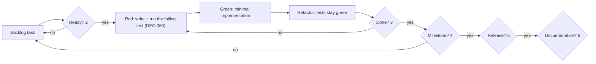

# DEFINITION.md — Gates: Ready, Done, Release and Documentation Completeness

- **Status:** Active — target state
- **Last verified:** 2026-09-29
- **Owner:** Delivery Planner (see `AGENTS.md` §3.8)
- **Authoritative for:** the project's gates — Definition of Ready, Definition of Done, milestone exit criteria, release readiness, documentation completeness, the quality-gate inventory, and the waiver and escalation path when a gate cannot be met.
- **Inputs:** `AGENTS.md`, `../assessment.md`, `REQUIREMENTS.md`, `DECISION_BOARD.md`, `TESTING.md`, `TECHNICAL_PLAN.md`, `BACKLOG.md`, `PERFORMANCE.md`, `SECURITY.md`, `GUIDELINES.md`, `CONTRIBUTING.md`, `DOCUMENTATION_AUDIT.md`, `PROJECT_LOG.md`
- **Not authoritative for:** acceptance criteria (`REQUIREMENTS.md`, `AC-*` ids); test strategy, layers and tooling (`TESTING.md`); terminology and naming conventions (`GUIDELINES.md`); the TDD phase protocol, commit-message forms and merge policy (`CONTRIBUTING.md`, `GUIDELINES.md`, DEC-053); canonical user-visible copy (`UI_SPEC.md`); milestone objectives (`TECHNICAL_PLAN.md`); module boundaries (`DESIGN.md`, `adr/0001-module-boundaries.md`). Each is referenced here by id or by file, never restated.

## 1. Purpose and scope

This file owns the **gates**: the conditions a work item must satisfy before it is started, before it is considered done, before a platform milestone is declared complete, before a release is published, and before the documentation set is declared coherent. It also owns the waiver record when a gate cannot be met.

This file does **not** own acceptance criteria. Behaviour is specified once in `REQUIREMENTS.md` as `REQ-*` requirements with `AC-*` criteria; this file only asserts that the criteria exist, are satisfied and are evidenced. Where a checklist item below needs a behavioural statement, it cites the requirement id instead of repeating the sentence.

Three delegations are explicit, because conflating them is the most common source of drift:

| Concern | Owner | Not in this file |
| --- | --- | --- |
| Terminology, naming and vocabulary rules (what a term means, how things are named) | `GUIDELINES.md` | No glossary or term table is maintained here |
| Canonical user-visible copy (every string a user reads) | `UI_SPEC.md` (§ canonical key list) and `ERROR_FLOW.md` for failure copy | No copy is defined or quoted here |
| Acceptance criteria and their evidence mapping | `REQUIREMENTS.md` (§5–§11) and `TESTING.md` (traceability section) | No criterion is defined here |

The gates form a chain; work that fails an earlier gate is not evaluated against a later one.

A gate is binary. A change is either done or not done; partial satisfaction is reported as partial, with the missing item named (`AGENTS.md` §11). "Blocked" is never a synonym for "done". The per-change gates (§2, §3, §7) are evaluated on the **final state of the pull request**, which is why the red commit required by the TDD protocol (DEC-053) failing tests is expected behaviour rather than a gate violation.

Work is integrated through pull requests, never by pushing to the default branch: the required checks on every pull request are mandatory (DEC-054, §7). An agent prepares a branch and opens a pull request; merging, tagging and publishing stay human-only (DEC-049). The gate definitions here therefore describe what is checked before approval, not a post-merge cleanup. The milestone (§4), release (§5) and documentation (§6) gates are evaluated on the commit they name.

## 2. Definition of Ready

A work item may not be started until every mandatory item below is checkable. Each row names the artifact the check is performed against, so "ready" is a fact about the repository, not an opinion about the task.

| # | Ready item | Checked against | Mandatory to start |
| --- | --- | --- | --- |
| R1 | A requirement id exists and is unambiguous — one `REQ-*` id whose normative sentence is precise enough that two readers would implement the same behaviour | `REQUIREMENTS.md` | Yes |
| R2 | Acceptance criteria exist for that requirement — at least one `AC-*` id, each independently verifiable | `REQUIREMENTS.md` | Yes |
| R3 | Dependencies are identified — prerequisite tasks, contracts, decisions and documents are named in the backlog row, and any unfinished prerequisite is itself at least Ready | `BACKLOG.md` | Yes |
| R4 | A size is assigned in the sizing field defined by the backlog index | `BACKLOG.md` | Yes |
| R5 | Impacted documents are identified — the authoritative file per affected topic, per DEC-046, named in the task so the same change can update them | `BACKLOG.md` row + `AGENTS.md` §10 | Yes |
| R6 | Test intent is known — the `TEST-*` family that will carry the behaviour and, where the id is not yet allocated, the acceptance criterion each planned test maps to | `TESTING.md`, `REQUIREMENTS.md` | Yes |
| R7 | No unresolved blocking decision — every decision whose status board row marks the affected artifact as its blocking impact is `Accepted` | `DECISION_BOARD.md` §2 | Yes |
| R8 | The work is not a `Deferred` or `Could have` item — or an accepted decision has re-admitted it | `DECISION_BOARD.md` §4, `REQUIREMENTS.md` §1.3 | Yes |
| R9 | For UI work: a Figma frame reference or a committed PNG export exists for every surface the task renders | `UI_SPEC.md` §1 (Figma file map), `docs/figma/` | Yes for UI work |
| R10 | For data or contract work: the internal contract (`IC-###`) or the remote contract (`API-*`) the implementation will honour is already defined | `CONTRACTS.md`, `API_SPECS.md` | Yes for data/contract work |
| R11 | For behaviour work: the first failing test is expressible — the observable behaviour that will be asserted, and the point in the code where the assertion will be made, are known before implementation starts (DEC-053) | The task's test intent (`TESTING.md`, `REQUIREMENTS.md`) | Yes for behaviour work; not applicable to the documentation, build/CI and tooling exception classes named in D4 |

Rules that follow from the checklist:

- R1–R8 are mandatory for every task. R9–R11 are mandatory only for their work type; a task that renders UI, consumes a contract and changes behaviour carries all three.
- A task that cannot satisfy a mandatory item stays in the backlog with its blocking item named; it MUST NOT be started "partially" to discover the missing input, because R3–R7 exist precisely to prevent rework.
- R7 is evaluated against the `Blocking impact` column, not against the existence of decisions in general: an accepted decision that does not block the artifact does not gate the task.
- Where the missing item is itself a decision, the task is escalated instead of approximated (`AGENTS.md` §6, and §8 below).
- R9 does not require the app screenshots; it requires the design reference the task renders against. The committed exports under `docs/figma/` are pending (`CON-005`, `DEC-045`), so a UI task that requires an export is not Ready until that export exists — the gap is tracked in `DOCUMENTATION_AUDIT.md`.
- R11 is what makes Ready a precondition of the TDD protocol rather than a formality: a task is not started until its first failing test exists, so the task's first commit is the red phase of that test.

## 3. Definition of Done

A change is done when every item below holds for **that change**, with the evidence named in the row. This checklist is the change-level detail of the completion rule in `AGENTS.md` §11; where the two differ, `AGENTS.md` wins and this file is corrected.

| # | Done item | Evidence |
| --- | --- | --- |
| D1 | The affected platforms build: the Android targets compile and assemble for a change that touches Android, and the iOS targets compile for a change that touches iOS; a change touching a `:core:*` or `:feature:*` module builds every consumer it can affect | Recorded CI run plus the equivalent local command output documented in `README.md` §8 and `CONTRIBUTING.md` |
| D2 | Every required check of the mandatory set (`DEC-054`, as amended by `DEC-071`: **staged activation**) that is **active at this change's stage** is green on the **final state of the pull request**, on both runners, including the contract suite in fixture/replay mode. A check whose harness does not exist yet is recorded against its activation task and is **not** claimed as green; it becomes mandatory and non-empty in the same change that introduces its harness, and the final milestone and release gates still require the complete set of `TESTING.md` §14. A required check that fails, is skipped or is absent **once it exists** means the change is not done. The gate evaluates the final state of the pull request: the red commit from the TDD protocol (D3) is expected to fail and is not a violation | CI run on the pull request head with every active required check green; for a stage with no CI yet, the local run of the same commands plus an explicit statement that the gate is not yet enforced (`GAP-002`) |
| D3 | The behaviour change followed the TDD protocol (DEC-053; the twelve ordered steps are stated in `CONTRIBUTING.md` §3.1, owned there and referenced here): a failing test was written and observed to fail **before** the implementation existed, then observed to pass. A behaviour change with no preceding failing test is incomplete | The recorded red-phase output (in the `test(scope):` commit message or the pull request), the green-phase run of the same test ids, and a `refactor(scope):` commit or an explicit statement that the refactor phase produced no change |
| D4 | The TDD red/green/refactor evidence is the default; when it is genuinely impractical or not applicable, the pull request states the exception explicitly — pure documentation, build/CI configuration, or tooling changes are the only recognised classes | An explicit exception statement in the pull request description, using `docs/templates/pull-request.md` |
| D5 | Static analysis and formatting are clean for every language touched, per DEC-032, and dependency analysis reports no violation | Output of the analysis and formatting tasks named in `GUIDELINES.md` and `CONTRIBUTING.md` |
| D6 | No new dependency is introduced without a recorded justification, and every declared dependency is pinned exactly (`REQ-NFR-002`, `REQ-NFR-006`) | Justification in `DESIGN.md` or an ADR; resolved version in the version catalog |
| D7 | Public contracts are unchanged, or changed with `CONTRACTS.md` in the same change — no interface signature or invariant drifts from its `IC-###` row | Diff of `CONTRACTS.md` alongside the code change |
| D8 | Every affected document is updated in the same change (DEC-046): the authoritative file for each impacted topic named at Ready (R5), and the backlog row | Diff of the owning documents in the same pull request |
| D9 | Links in every document touched by the change resolve, and cross-references name a file that exists | Manual link check of the touched documents (`AGENTS.md` §10) |
| D10 | No unresolved placeholder remains in the change: no `TODO`, no angle-bracket template, no stub, no no-op, no commented-out specification | Diff inspection of the change |
| D11 | `PROJECT_LOG.md` has an entry when the change is decision-relevant — a decision, a scope change, a contract change, a milestone result | `PROJECT_LOG.md` entry in the same change |
| D12 | Traceability holds: the requirement is linked to the task and to the test that now covers it, and any coverage loss is recorded | Traceability row in `TESTING.md`, row updated in `BACKLOG.md` |
| D13 | No test is quarantined without the recorded justification required by the flaky-test policy, and no quarantined test is cited as evidence; a quarantined test is excluded from the required set only with that justification recorded | Quarantine entry with owner and deadline in `TESTING.md`, and the exclusion recorded in the pull request |
| D14 | No gate is waived for this change, or the waiver is recorded and unexpired (§8) | Waiver register, §8 |

- **D2 during the temporary iOS suspension (`DEC-083`).** From B3 Phase 3.1 until `TASK-051` introduces the buildable `iosApp` application target, the active required set runs on the `android` runner only: the `ios` job is suspended by owner directive, and the Kotlin/Native suites and the native contract replay are executed locally on macOS and reported as local evidence, never as CI evidence. This amends the stage of `DEC-071` at which those checks are active; it is not a waiver (§8.3 stays empty) and it does not let any existing Android check be skipped. `TASK-051` restores the `ios` job, the native replay and the required context in the same pull request, and `verifyWorkflowGate`'s tripwire fails that pull request until it does.
- **D2 and cancelled superseded runs.** The pull-request workflow sets `concurrency.cancel-in-progress: true` (`CONTRIBUTING.md` §5.3 area, `.github/workflows/pull-request.yml`), so a push run is cancelled when a newer one starts on the same ref. Merging several pull requests in quick succession therefore leaves some **post-merge** push runs `cancelled`, as happened on 2026-10-02 for `6dc6746` (#87), `4953bde` (#88) and `0e12205` (#90). A cancelled run is not a failure and is not a missing check: the change's D2 evidence is the run on the **pull request's own head**, which was green for each of them. The post-merge run is extra assurance for the merged commit, and on a linear history every later green run covers a superset of its ancestors. Verify a specific commit with `gh api repos/<owner>/<repo>/commits/<sha>/check-runs`; if a needed context is absent rather than cancelled, re-run the workflow on that ref.

Notes that keep the checklist honest:

- D2 and D3 are different claims: a green suite proves nothing about a behaviour no test exercises, and a new test proves nothing about the rest of the suite. D2 without D3 is the "retrofit the test afterwards" failure mode; D3 without D2 is the "it passed on my machine" failure mode.
- D2's staged reading is owned by `DEC-071`: the required-check list is never narrowed, it is **activated**, one suite per harness change, from `TASK-025` onward — the workflow, both runners and the naming of the checks in the ruleset are three separate steps. A change merged before the workflow ran is *integrated and locally verified*, never *Done under D2*; since `TASK-025` (PR #52) that applies only to history, and the distinction is stated in `BACKLOG.md`, `HANDOFF.md` and each pull request.
- D2 is the reconciliation of "all tests are required" with "no network-dependent flakiness in the gate": the contract suite runs in fixture/replay mode inside the gate, while live-network contract testing stays a separate scheduled signal job that does not gate merges (`TESTING.md`, DEC-054). The full required-check list is owned by `TESTING.md` and `CONTRIBUTING.md`; this row states only that all of it must be green.
- D5 is enforced by running the tools, not by prose: anything a tool enforces is not restated as a checklist sentence in `GUIDELINES.md` either.
- D7 applies to the module dependency rules too: `:core:domain` depends on no project module and no platform, HTTP, UI or persistence library, with the Kotlin standard library and `kotlinx-coroutines-core` as its only permitted dependencies (`DEC-066`); `:core:data` and `:core:presentation` depend only on `:core:domain`; a `:feature:*` module MUST NOT depend on another `:feature:*` module; and each feature contains its own `domain` and `presentation` packages (DEC-052; dependency direction is owned by `DESIGN.md` and `adr/0001-module-boundaries.md`, which DEC-052 re-issues).
- D8 makes the "documentation phase" boundary irrelevant to done-ness: a change is not done while the document describing the old behaviour still ships with it.
- D14's waiver MUST NOT cover a test suite: DEC-054 makes every required check mandatory, so a red, skipped or absent suite is not waivable and the change stays not done until the suite is green or the test is formally quarantined under D13.

## 4. Milestone definition of done

Milestone objectives, sequencing and scope per milestone are owned by `TECHNICAL_PLAN.md`; they are not restated here. This section owns only the **exit criteria** a milestone must satisfy to be declared complete (`REQ-PLAT-004`, DEC-040).

### 4.1 M1 — Android

| # | M1 exit criterion | Evidence |
| --- | --- | --- |
| M1-1 | An installable Android APK is produced from a clean clone by the documented commands, with no manual step outside them (`REQ-NFR-006`) | Build log and installed-and-launched screenshot from the APK |
| M1-2 | The four destinations exist and are reachable from each other — Characters, Episodes, Favorites, Settings — with the character list, character detail, favorites and the three settings working and Episodes rendering its designed placeholder (`REQ-FUNC-001`, `REQ-FUNC-002`, `REQ-FUNC-006`, `REQ-FUNC-008`, `REQ-FUNC-033`…`REQ-FUNC-035`) | Snapshot or screenshot per destination |
| M1-3 | Every Must-have requirement in `REQUIREMENTS.md` §5.1 is verified by test evidence, except the requirement whose platform is iOS (`REQ-PLAT-003`), which is carried to M2 because `REQ-PLAT-004` makes M1 releasable with iOS absent | Traceability rows, each pointing at a passing test id |
| M1-4 | The numeric budgets are met on the reference device named in `PERFORMANCE.md`, measured by the method in `PERFORMANCE.md` (DEC-033), not asserted | Measurement output naming device, build type and method |
| M1-5 | The accessibility checklist required by DEC-023 is executed and recorded, and the automated checks pass | Recorded checklist plus automated-check output |
| M1-6 | `README.md` reproduces the build from a clean clone on a machine that has only the documented prerequisites, and its instructions match the commands actually run | Read-through of `README.md` §6–§9 against the M1-1 log |
| M1-7 | No P0 or P1 defect is open against the milestone | Backlog and issue state filtered by severity |
| M1-8 | The documentation completeness gate (§6) passes at the milestone commit | Re-run of `DOCUMENTATION_AUDIT.md` dated to that commit |
| M1-9 | Every required check of the mandatory set (DEC-054) is green on the milestone commit, on both platform runners — including the iOS runner, which is no longer deferred to `main` only | CI run on the milestone commit with every required check green |
| M1-10 | The TDD evidence is complete for every behaviour increment in the milestone (D3): each red phase was observed to fail before its implementation, and its green phase observed to pass | The `test(...)` → `feat(...)`/`fix(...)` → `refactor(...)` commit sequence in the milestone history plus the recorded observed outputs |

Two conditions are prerequisites for M1-4 rather than exit criteria, and they gate the milestone by blocking its evidence: the reference device MUST be named, and the measurement method MUST be the documented one. While the device is still recorded as a pending assumption (`PERFORMANCE.md`, `README.md` §11), M1-4 cannot be evidenced.

### 4.2 M2 — iOS

| # | M2 exit criterion | Evidence |
| --- | --- | --- |
| M2-1 | The iOS app builds and runs on iOS 18.0 (the minimum deployment target) through the documented path | Build and run log on an iOS 18 simulator or device |
| M2-2 | The documented non-glass fallback path is verified on iOS 18 — the material fallback, not the Liquid Glass path (`REQ-PLAT-003`, DEC-008) | Snapshot pair: glass on iOS 26+, fallback on iOS 18 |
| M2-3 | The same user-facing capabilities verified for M1 are delivered on iOS: four destinations, character list, character detail, favorites; plus every Must-have requirement including `REQ-PLAT-003` | Traceability rows for the iOS variants |
| M2-4 | The budgets in `PERFORMANCE.md` are met through the documented iOS measurement procedure | Measurement output naming device, OS version and method |
| M2-5 | iOS verification per DEC-025 (snapshot tests and previews) is green, and the full mandatory check set (DEC-054) is green on the milestone commit — both platform runners are required on every pull request, so no iOS check is deferred to `main` | CI run on the milestone commit plus committed baselines |
| M2-6 | `README.md` reproduces the iOS build from a clean clone, and M1 still holds: the Android gate is green and no Android regression is introduced | Read-through plus the current Android gate run |
| M2-7 | No P0 or P1 defect is open against the milestone, and no M1 exit criterion has silently regressed | Backlog and issue state; M1 checklist re-read |
| M2-8 | The documentation completeness gate (§6) passes at the milestone commit | Re-run of `DOCUMENTATION_AUDIT.md` dated to that commit |
| M2-9 | The TDD evidence is complete for every behaviour increment delivered in the milestone (D3), as in M1-10 | The phase-commit sequence plus the recorded observed outputs |

## 5. Release readiness

A release is published only when the milestone it corresponds to has met its definition of done (§4) and the full mandatory check set (DEC-054) is green on the released commit. The **release gate may not waive a test suite**: a red, skipped or absent suite blocks the release, and only a formally quarantined test with a recorded justification is excluded from the required set. The release steps themselves are:

| # | Release item | Evidence |
| --- | --- | --- |
| REL1 | Every required check of the DEC-054 set is green on the released commit, on both platform runners, with no suite waived and no unexplained quarantine beyond the recorded ones | CI run on the released commit; the required-check list is owned by `TESTING.md` and `CONTRIBUTING.md` |
| REL2 | The version is bumped in the single `VERSION` source; the Android `versionName` derives from it (`AC-REQ-NFR-006-2`, implemented — `TASK-018`; `verifyDependencyPins` rule P9 rejects a second literal) and, from `TASK-051` onward, `CFBundleShortVersionString` derives from it too (`AC-REQ-NFR-006-3`, `DEC-067`); no platform-specific version literal is changed by hand | Diff showing one version source and the generated platform values; the APK's observed `versionName` |
| REL3 | A tag `vMAJOR.MINOR.PATCH` is created on the released commit (DEC-043) | Tag in the repository. Branch protection is a repository setting and therefore a human-only action (DEC-049) |
| REL4 | The Android APK is attached to the GitHub Release (DEC-043) | Release page with the APK asset |
| REL5 | Release notes are generated from Conventional Commits for the range since the previous tag (DEC-042, DEC-041 as amended by DEC-053); no hand-written `CHANGELOG.md` exists. The commit prefixes carry the TDD phase meaning, so the range preserves the red/green/refactor sequence of each increment | Release notes body |
| REL6 | `PROJECT_LOG.md` has an entry for the release (`LOG-####`) stating what shipped and which milestone it closes | Log entry dated to the release |
| REL7 | `DOCUMENTATION_AUDIT.md` is re-run against the released commit, so the documented state and the tagged state agree (DEC-046) | Audit output dated to the tagged commit |
| REL8 | Known limitations are documented in `README.md` and match the release: nothing shipped is undocumented, nothing documented as absent has silently shipped | Read-through of the known-limitations section |
| REL9 | No waiver is in force, or every waiver in force is recorded, unexpired and re-approved for this release (§8); no waiver covers a test suite (REL1) | Waiver register, §8 |

Tagging, merging and publishing are human-only actions (DEC-049); preparation of REL2, REL5–REL8 is agent-eligible, and REL3/REL4 are executed by a human.

## 6. Documentation completeness gate

This gate is evaluated on the whole documentation set, not on a single change, and is re-run at each milestone (§4) and each release (REL6).

| # | Documentation condition |
| --- | --- |
| DOC1 | Every document carries a valid header block with `Status:`, `Last verified:`, `Owner:` (a role from `AGENTS.md` §3), `Authoritative for:` and `Inputs:` (`AGENTS.md` §10) |
| DOC2 | No unresolved link: every relative link resolves, and no cross-reference names a file or identifier that does not exist |
| DOC3 | Every authoritative topic is owned by exactly one file — the `Authoritative for:` blocks do not overlap, and no normative statement is repeated in a second document |
| DOC4 | Every identifier is unique within its namespace (`REQ-*`, `AC-*`, `DEC-*`, `ADR-*`, `API-*`, `IC-*`, `TASK-*`, `TEST-*`, `SEC-*`, `PERF-*`, `LOG-*`, `CONF-*`, `GAP-*`, `NG-*`, `DEF-*`, `CON-*`, `RISK-*`); no identifier is renumbered, reused or retired silently |
| DOC5 | Every Must/Should requirement is traceable to at least one task in `BACKLOG.md` and at least one test id in `TESTING.md` |
| DOC6 | Every `CONF-###` conflict and `GAP-###` gap in `DOCUMENTATION_AUDIT.md` is either resolved or open with a severity, an owner and the blocked artifact named |
| DOC7 | `DOCUMENTATION_AUDIT.md` is updated to the current date, and its inventory matches the files that exist |
| DOC8 | No placeholder text remains anywhere in the set: no `TODO`, no angle-bracket template, no "to be decided" without a `DEC-*` id, no document describing a behaviour as shipped when it is not |

DOC8 has one deliberate, explicit exception: an unverifiable fact is acceptable when it is marked as an assumption with an owner and a date, as documentation of the current state requires (`AGENTS.md` §10, §13). An assumption is not a placeholder; an unfilled template is.

## 7. Quality gates

The table maps each gate to the file that defines it, states whether it blocks, and names the evidence it produces. Gate content is not restated — read the owning file.

| Gate | Defined in | Blocking | Evidence produced |
| --- | --- | --- | --- |
| Mandatory required-check set on every pull request: shared `commonTest`, each platform's unit tests, Compose semantics and accessibility tests, Android screenshot verification, iOS snapshot tests, SwiftUI/state-holder tests, static analysis and formatting, dependency analysis, and the contract suite in fixture/replay mode — on **both** platform runners | `TESTING.md`, CI gates section, and `CONTRIBUTING.md` for the required-check list (DEC-032, DEC-054) | Yes — a pull request is not approvable while any required check is failing, skipped or absent. Branch protection enforcing the checks is a repository setting, therefore a human-only action (DEC-049) | CI run on the pull request head; the equivalent local command output recorded in the pull request |
| TDD protocol (observed red before green; one commit per phase; no rewrite of pushed phase commits) | `CONTRIBUTING.md` and `GUIDELINES.md` (DEC-053) | Yes for behaviour changes (§3, D3); the exception classes are named in D4. The gate evaluates the final state of the pull request, so the red commit failing tests is expected, not a violation | The phase-commit sequence plus the recorded observed failure (red) and observed pass (green) |
| Documentation completeness (§6) | This file, §6 | Yes at milestone and release; the touched-document subset (D8, D9) is blocking per change | `DOCUMENTATION_AUDIT.md` re-run dated to the commit |
| Secret and permission hygiene (no secrets committed; permissions minimised) | `SECURITY.md` (`REQ-SEC-002`, `REQ-SEC-004`) | Yes | Scan output; permission manifest diff |
| Dependency advisory triage | `SECURITY.md` advisory register (DEC-036, DEC-037) | No — findings are triaged and recorded, not gate-blocking on their own | Advisory register row with severity, mitigation and verification |
| Performance budgets | `PERFORMANCE.md` (DEC-033) | Split: budget assertions run inside the mandatory set and block; measurement runs in the scheduled job as a signal | Benchmark report naming device, build type and method |
| Live-network API contract tests and observation probes | `TESTING.md`, contract-test section | No — scheduled signal job only (DEC-054); failures are triaged, never merged around by weakening the gate | Scheduled job report |
| Requirement → task → test traceability | `REQUIREMENTS.md` §15, `DOCUMENTATION_AUDIT.md` | Yes at milestone and release | Traceability rows, each with an existing task and test id |
| Flake quarantine | `TESTING.md`, flaky-test policy | Enforced: a quarantined test is excluded from the required set only with a recorded justification, an owner and a deadline; retry-to-green is forbidden | Quarantine entry with owner, deadline and tracking issue |

A gate not listed here is not a project gate: if a check is worth blocking a change, it belongs in this table, defined in the file that owns it. The authoritative required-check list lives in `TESTING.md` (CI gates section) and `CONTRIBUTING.md`; this table classifies it rather than enumerating it a second time.

## 8. Waivers and escalation

### 8.1 When a gate cannot be met

1. **Stop; do not merge around it.** A failing gate is never bypassed by re-running until it passes, by disabling a check, by narrowing the check's scope, or by deleting the test that produced it (`TESTING.md`, flaky-test policy; `AGENTS.md` §4.2).
2. **Diagnose first.** Determine which gate, which item, which requirement or artifact is affected, and whether the cause is a defect, a missing input, or a gate that is itself wrong.
3. **If the gate is wrong, fix the gate**, not the evidence: propose the change to the owning file (this file for a gate threshold, `TESTING.md` for a test-layer rule, `GUIDELINES.md` for a tool rule), with the reason.
4. **Prepare an escalation** containing: what was asked, what was found (with the failing output), the options with trade-offs, the recommendation, and what is blocked — the shape required by `AGENTS.md` §6. An escalation that stops at the problem is incomplete.
5. **Escalate by severity.** A gate failure that blocks a milestone or a release is raised to the project owner (the human owner of the repository). A gate failure confined to one change is handled by the reviewer of that change during review, without a waiver.

### 8.2 Who decides

| Gate or item | Recommends | Decides | Records |
| --- | --- | --- | --- |
| Per-change gate (D1–D14) | Author, evidenced in the pull request | Reviewing human, per `CONTRIBUTING.md` review rules; approval is impossible while a required check is red, skipped or absent (DEC-054) | Pull request description |
| Milestone exit criteria (§4) | Delivery Planner with QA evidence | Project owner (human) | `PROJECT_LOG.md`, and the milestone row in `TECHNICAL_PLAN.md` |
| Release readiness (§5) | Delivery Planner | Project owner (human) — releasing is human-only (DEC-049) | Release notes plus `PROJECT_LOG.md` |
| Documentation completeness (§6) | Documentation Maintainer | Project owner (human) | `DOCUMENTATION_AUDIT.md` |
| Security and privacy gates | Security Reviewer | Project owner (human) | `SECURITY.md` register |

Roles are the ones defined in `AGENTS.md` §3; an agent may hold a recommending role but never the deciding one for a waiver.

### 8.3 Waiver record

A waiver is explicit, dated, recorded in the table below, and given an expiry. It is granted for a named gate, a named scope and a named period — never "in general".

| Gate | Scope (what is waived) | Reason | Compensating control | Decided by | Granted (ISO 8601) | Expires (ISO 8601) | Follow-up |
| --- | --- | --- | --- | --- | --- | --- | --- |
| — | No waiver has been granted as of 2026-09-29. This is the current state of the register, not a pending entry. | — | — | — | — | — | — |

Rules for the register:

- Every waiver names a **compensating control** — what is done meanwhile to keep the risk bounded — and a **follow-up** `TASK-###` id in `BACKLOG.md` that removes the need for the waiver.
- Every waiver has an **expiry date**. A waiver without an expiry is invalid and MUST NOT be relied on; a waiver whose expiry has passed is automatically void, and the gate it waived blocks again from that date.
- Waivers are re-evaluated at each release (§5, REL9) and each milestone (§4): a waiver that is still needed is re-approved explicitly, and one that is no longer needed is removed from the register with its follow-up closed.
- A waiver MUST NOT cover any part of the mandatory required-check set (DEC-054): a test suite that is red, skipped or absent is not waivable, and neither the merge nor the release gate can be passed with one. The only permitted exclusion from the required set is a **formal quarantine** of an individual flaky test under the policy in `TESTING.md`, with a recorded justification, an owner and a deadline; this is a quarantine, not a waiver, and it is still not evidence (`TESTING.md`, flaky-test policy).
- A waiver MUST NOT be used to: convert a `Deferred` item into shippable work; mark an unverified requirement as verified for a milestone exit criterion; excuse a prohibited action (`AGENTS.md` §4.2); or skip the security and privacy gates, which are not waivable.
- Waiver rows are appended, never edited in place after expiry: the register is a record of what was true, and its history is part of the project's evidence.

## 9. Change log

| Date | Change | Decision |
| --- | --- | --- |
| 2026-09-29 | Created: ownership of gates separated from acceptance criteria; Definition of Ready, Definition of Done, milestone exit criteria for M1/M2, release readiness, documentation completeness, quality-gate inventory and the waiver/escalation path defined. Module names follow the feature-per-module layout. | DEC-023, DEC-032, DEC-040, DEC-042, DEC-043, DEC-046, DEC-052 |
| 2026-09-29 | Amended for the TDD protocol: Ready gained the precondition that the first failing test is expressible (R11), Done replaced "a test exists" with observed red/green/refactor evidence plus the named exception classes, and milestone exit criteria gained the phase-history check. | DEC-053 |
| 2026-09-29 | Amended for the mandatory CI decision: the Done gate, milestone criteria, release readiness and quality-gate table now require the full both-platform required-check set green with the contract suite in fixture/replay mode; test suites are explicitly not waivable and only individual flake quarantine is permitted. | DEC-054 |
