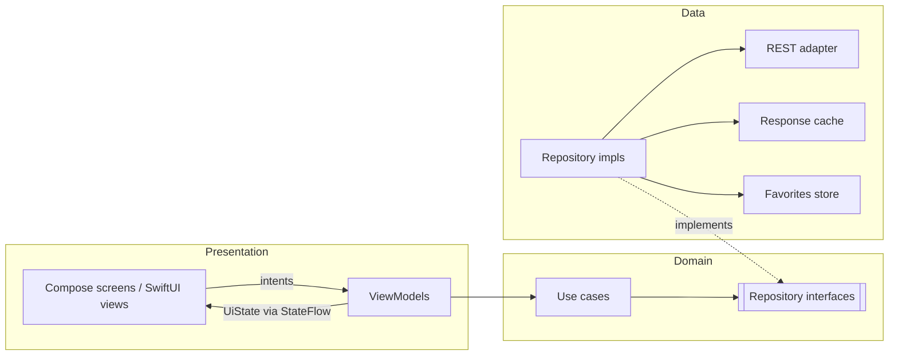
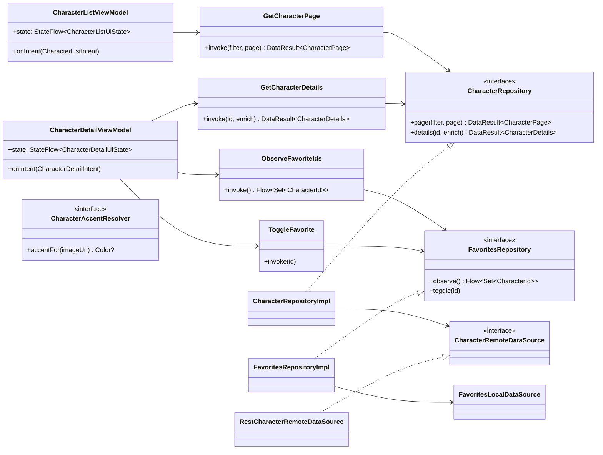

# DESIGN.md - System Architecture Design

- **Status:** architecture baseline, aligned with the Figma designs
- **Last updated:** 2026-09-29
- **Inputs:** `REQUIREMENTS.md`, `API_SPECS.md`, `UI_SPEC.md`, design briefs in `docs/design/`

## 1. Architectural pattern

- **Pattern:** Clean Architecture + MVVM with unidirectional data flow (UDF).
- **Layers:** Data → Domain ← Presentation. Dependencies point inwards: the domain layer knows nothing about HTTP, caches, Compose or SwiftUI.
- **UDF:** screens render an immutable `UiState` and send intents. ViewModels are the only state owners.



## 2. Platform strategy

The design briefs define one product with two native clients:

| Platform | UI stack | Design language | Priority |
| --- | --- | --- | --- |
| Android | Jetpack Compose | Material 3 Expressive | Primary deliverable (`REQUIREMENTS.md`: Jetpack Compose) |
| iOS | SwiftUI | Liquid Glass | Counterpart; the brief frames it as part of a Kotlin Multiplatform (KMP) project |

The split between shared and native code:

- **Shared via KMP:** domain, data and presentation state (ViewModels + `UiState`). Both designs render the same information architecture (`UI_SPEC.md` §2), so filtering, paging, search debounce, detail enrichment and display formatting must behave identically on both platforms. Only rendering differs.
- **Native per platform:** UI, design system, navigation, image loading and portrait colour extraction (these depend on platform bitmaps and toolkits).
- **Android stays unblocked:** Android can ship alone by building the shared modules plus `:androidApp`. The iOS app is additive.

**Networking impact.** `API_SPECS.md` recommends Retrofit/OkHttp, which are JVM-only. A shared REST adapter therefore uses **Ktor client + kotlinx.serialization**:
- On Android, the OkHttp engine keeps the HTTP cache policy from `API_SPECS.md` §7.1.
- On iOS, the Darwin engine uses `URLCache`.

The adapter sits behind `CharacterRemoteDataSource`, so the choice stays local to the data layer. This is decision **D1** (§9).

## 3. Module boundaries

| Module | Target | Responsibility | Depends on |
| --- | --- | --- | --- |
| `:shared:domain` | `commonMain` | Domain models (`CharacterSummary`, `CharacterDetails`, `CharacterStatus`, `CharacterGender`, `EpisodeSummary`, `CharacterFilter`), repository interfaces, use cases | — |
| `:shared:data` | `commonMain` + platform engines | REST adapter (DTOs, mappers), response cache, favorites store, repository implementations, `ApiFailure` mapping | `:shared:domain` |
| `:shared:presentation` | `commonMain` | ViewModels (`androidx.lifecycle` KMP), `UiState`/intents, display formatters (status labels, "Unknown" casing, dimension derivation) | `:shared:domain` |
| `:android:designsystem` | Android | `MultiverseTheme` (single M3 colour scheme with no light/dark or dynamic-colour variants, Roboto Flex type scale, shapes), `MultiverseColors` (brand + status), components: `CharacterCard`, `StatusBadge`, `StatTile`, `InfoListItem`, `PortalLogo`, skeletons | Compose only |
| `:android:feature:characters` | Android | Discovery and Detail screens, filters, shared-element transitions, `CharacterAccentResolver` | `:shared:presentation`, `:android:designsystem` |
| `:androidApp` | Android | `Application`, DI graph, `NavHost`, splash, Coil `ImageLoader`, adaptive launcher icon (`mipmap-anydpi-v26`) | all Android modules |
| `iosApp/DesignSystem` | Swift package | `Color`/`Font` tokens, `GlassCharacterCard`, `GlassSegmentedControl`, `GlassInfoRow`, `GlassIconButton`, `PortalLogo` | SwiftUI only |
| `iosApp/Features` | iOS app | SwiftUI screens bound to the shared ViewModels, `NavigationStack`, image cache, app icon (Icon Composer `.icon`) | `Shared.framework`, `DesignSystem` |

**Design-system rule:** design-system modules never depend on domain types. Components take primitives (strings, colours, image URL, status enum mirror), which keeps them previewable, screenshot-testable and 1:1 with the Figma components listed in `UI_SPEC.md` §1.2.

**Shared brand assets:** the Figma page `00 · Shared — Brand & Sample Data` holds the platform-neutral assets (`UI_SPEC.md` §1):
- **Portal logo:** exported once as SVG. It becomes a VectorDrawable in `:android:designsystem` and a vector asset (preserve vector data) in the iOS `DesignSystem` asset catalog. Each platform wraps it in its own `PortalLogo` component, and the splash treatments stay platform-specific.
- **App icons:** both are built on the portal logo but live on the platform pages, because each follows its own platform format (`UI_SPEC.md` §10).
  - Android: the adaptive-icon layers (background and foreground; no monochrome/themed layer) are exported as SVG and converted to vector drawables in `:androidApp`. The same foreground drives the Android 12+ system splash.
  - iOS: the single 1024 px master (no Dark, Clear or Tinted variants) feeds an Icon Composer `.icon` file in the iOS app target.
- **Sample portraits:** mock content only, never bundled in the release apps. The apps always load portraits from the API through the image cache. The same files may be used as local fixtures for previews and screenshot tests (§8), so those never hit the network.

## 4. Presentation layer

### 4.1 UI state contract (shared)

```kotlin
data class CharacterFilter(
    val query: String = "",                        // name search
    val status: StatusFilter = StatusFilter.All,   // "All" sends no status parameter
)

// Same four options on both platforms (Android filter chips, iOS segmented control).
// Species/gender filters exist in the API but are intentionally not exposed.
enum class StatusFilter { All, Alive, Dead, Unknown }

data class CharacterCardUi(
    val id: CharacterId,
    val name: String,
    val species: String,              // API `species` ("unknown" → "Unknown"); cards show photo, name, status, species
    val status: CharacterStatus,
    val imageUrl: String,             // also the image cache key and colour-extraction key
)

sealed interface LoadState {
    data object Loading : LoadState
    data object Content : LoadState
    data object Empty : LoadState     // includes the REST 404-on-empty-filter case
    data class Error(val failure: ApiFailure) : LoadState
}

data class CharacterListUiState(
    val filter: CharacterFilter = CharacterFilter(),
    val items: List<CharacterCardUi> = emptyList(),
    val totalCount: Int? = null,      // headline "826 beings…" comes from info.count
    val loadState: LoadState = LoadState.Loading,
    val isAppending: Boolean = false,
    val isStale: Boolean = false,     // cached data shown while offline
)

data class CharacterDetailUiState(
    val header: CharacterCardUi?,     // pre-filled from the list for an instant transition
    val episodeCount: Int? = null,
    val dimension: String? = null,
    val info: List<InfoRowUi> = emptyList(),   // Origin, Last known location, First seen in
    val isFavorite: Boolean = false,
    val loadState: LoadState = LoadState.Loading,
)
```

Intents:
- `CharacterListIntent`: `QueryChanged`, `StatusSelected`, `LoadNextPage`, `Refresh`, `Retry`

Voice search is a platform concern with no shared code. The Android recognizer (`RecognizerIntent`) and the iOS one (Speech framework) only return text, which the screen sends as a regular `QueryChanged`. The ViewModel can't tell typed and dictated queries apart, so debounce and cancellation apply equally (`UI_SPEC.md` §6.2).
- `CharacterDetailIntent`: `ToggleFavorite`, `Retry`

The list ViewModel applies the rules from `API_SPECS.md` §8: 300 ms debounce, `distinctUntilChanged`, cancellation, page reset and single-page prefetch.

### 4.2 Navigation

| Route | Android (Navigation Compose, type-safe routes) | iOS (`NavigationStack(path:)`) |
| --- | --- | --- |
| `Splash` | In-app composable after `installSplashScreen()` | Root view before the stack |
| `CharacterList` | Start destination, bottom navigation "Characters" | `TabView` → "Characters" tab root |
| `CharacterDetail(id)` | `@Serializable data class CharacterDetail(val id: String)` | `Route.detail(CharacterId)` |

The card-to-detail transition is part of the architecture, not decoration:
- **Android:** `SharedTransitionLayout` wraps the `NavHost`. The portrait uses the shared key `"portrait-$id"`, and predictive back is supported.
- **iOS:** a `@Namespace` is passed from the grid to the detail for `.matchedTransitionSource` / `.navigationTransition(.zoom)`.
- **Both:** to work, the detail must render the pre-filled `header` immediately, before the network responds (`API_SPECS.md` §8: "Reuse list data during navigation").

The Episodes, Locations and Favorites tabs are reserved routes (Could-Have) and are not wired in the MVP.

### 4.3 Design tokens pipeline

Figma variables are the source of truth. There are three collections:
- `Multiverse · M3 Scheme` (one mode: the app has a single appearance)
- `Multiverse · Brand`
- `Multiverse · Dimensions`

Code syntax is already set on each variable (`MaterialTheme.colorScheme.primary`, `Color.portalGreen`, …).

For the MVP, the tokens are hand-written:
- Android: `MultiverseTheme.kt`
- iOS: `Color+Multiverse.swift`, `Font+Multiverse.swift`

A unit test compares them with a committed `tokens.json` export of the Figma variables, so drift fails CI. Code generation from `tokens.json` can replace the manual step later without changing any call sites.

### 4.4 Portrait accent colour (Android)

The M3 brief asks for card containers tinted from each character's portrait (`UI_SPEC.md` §5.4). This is a UI concern, so it lives in `:android:feature:characters`:

```kotlin
interface CharacterAccentResolver {
    /** Tone-30 container colour derived from the portrait, or null. */
    suspend fun accentFor(imageUrl: String): Color?
}
```

- The implementation reuses Coil's cached image (a software bitmap is required for pixel access). It quantizes and scores the image with `material-color-utilities` on `Dispatchers.Default`.
- Results are memoized in an LRU keyed by image URL, so extraction runs at most once per character per process.
- Cards render Surface Container High until the accent resolves, then animate the colour.

iOS needs no equivalent: its glass surfaces take colour from the portrait by refraction.

### 4.5 Favorites

Both designs add a Favorite action (Android extended FAB, iOS prominent glass button) and a Favorites tab. `REQUIREMENTS.md` does not list the feature. It maps to the Could-Have "Local database persistence" and needs a requirements update (D4).

- **Domain:** `FavoritesRepository` with the use cases `ObserveFavoriteIds(): Flow<Set<CharacterId>>` and `ToggleFavorite(id)`.
- **Data:** a set of IDs in multiplatform DataStore is enough. The UI shows the favourite state instantly and re-fetches details through the normal cached path, so no database is required.

## 5. Dependency injection

- **Framework:** Koin, because it is multiplatform. Hilt is Android-only and cannot provide the shared graph to iOS. If the project stays Android-only, Hilt is an acceptable substitute (D2).
- **Singletons:** Ktor `HttpClient`, response cache, favorites store, repositories, Coil `ImageLoader` (Android), `CharacterAccentResolver`.
- **Factories:** use cases.
- **ViewModel scope:** `CharacterListViewModel`, `CharacterDetailViewModel` (Android: `koinViewModel()`; iOS: exposed through a small `KoinHelper` factory and observed from SwiftUI).

## 6. Class diagram



`CharacterAccentResolver` is Android-only (`:android:feature:characters`). It is injected into the Compose screen, not into a ViewModel, because it depends on the image pipeline.

## 7. Failure → UI mapping

Every `ApiFailure` (`API_SPECS.md` §6) maps to one of the states designed in `UI_SPEC.md` §8:

| Failure | With cached data | Without cached data |
| --- | --- | --- |
| `Offline`, `Timeout` | Keep content, `isStale = true`, "Showing saved results" + Retry | Error state "Portal link lost" + Retry |
| `NotFound` on a filtered list (REST 404) | — | `LoadState.Empty` ("No one in this dimension matches…"), **not** an error |
| `NotFound` on a detail | — | Error state with Back |
| `RateLimited(retryAfter)` | Keep content; retry after `Retry-After` | Error state with the countdown in the message |
| `Server`, `MalformedResponse`, `EmptyBody`, `Unknown` | Keep content + Retry | Generic error state + Retry |

`CancellationException` is never mapped: obsolete searches simply stop.

## 8. Testing hooks

This section covers the architectural testing seams only; the QA agent owns the full plan.

- **`:shared:*`:** ViewModel tests with fake repositories (state sequences, debounce, cancellation, page reset); formatter and mapper tests.
- **`:android:designsystem`:** screenshot tests per component and screen, compared with the Figma frames in `UI_SPEC.md` §1.1. Each is rendered with the system in both light and dark mode, and both results must be identical (single appearance). Semantics tests cover merged card descriptions and status labels.
- **iOS:** snapshot tests of `DesignSystem` views, including Reduce Transparency and the largest Dynamic Type size.
- **Tokens:** a parity test against the `tokens.json` export (§4.3).
- **Fixtures:** previews and screenshot tests use the sample portraits from the shared Figma page (§3) as local image fixtures, with a fake image loader instead of the network.

## 9. Open decisions

| ID | Decision | Recommendation | Affects |
| --- | --- | --- | --- |
| D1 | REST client for shared data | Ktor + kotlinx.serialization (OkHttp engine on Android, Darwin on iOS) | `API_SPECS.md` §8, §12 (currently Retrofit/OkHttp) |
| D2 | DI framework | Koin (multiplatform); Hilt only if Android-only | §5 |
| D3 | Sharing depth | Share ViewModels (`androidx.lifecycle` KMP) and bridge `StateFlow` to Swift (e.g. SKIE); fallback: share domain/data only | §3, §4.1 |
| D4 | Favorites scope | Could-Have backed by multiplatform DataStore; add to `REQUIREMENTS.md` | §4.5 |
| D5 | Pager | Small custom pager (the page contract is simple); Paging 3 only if its multiplatform artifacts are justified | `API_SPECS.md` §8 |
