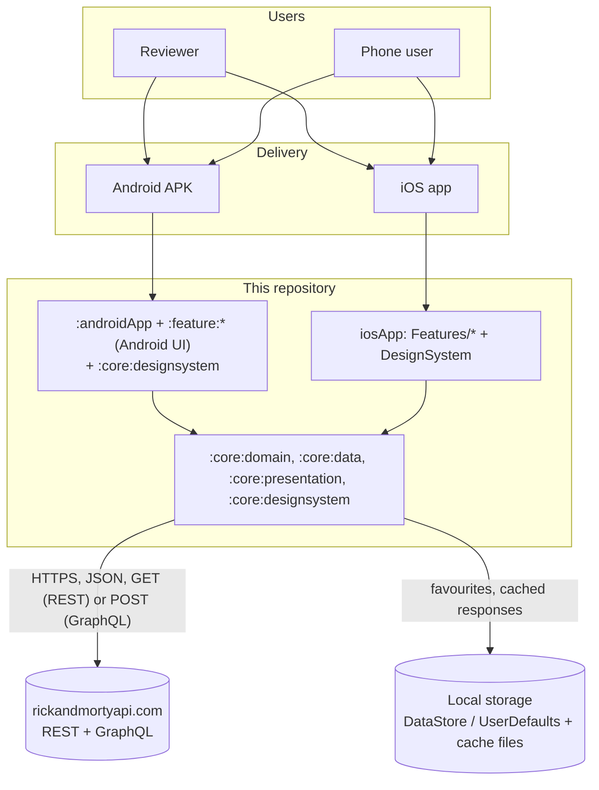
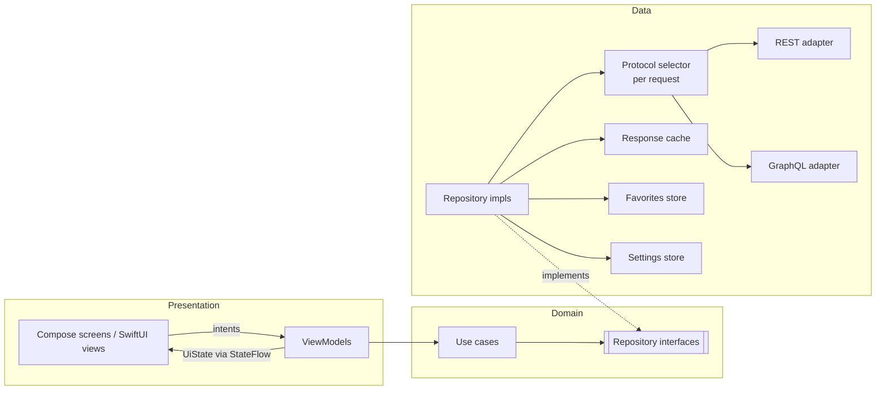
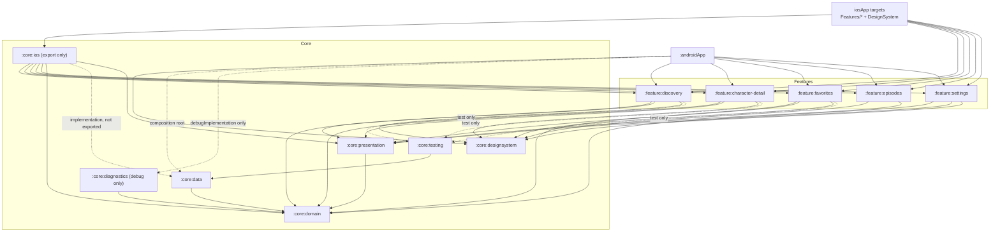
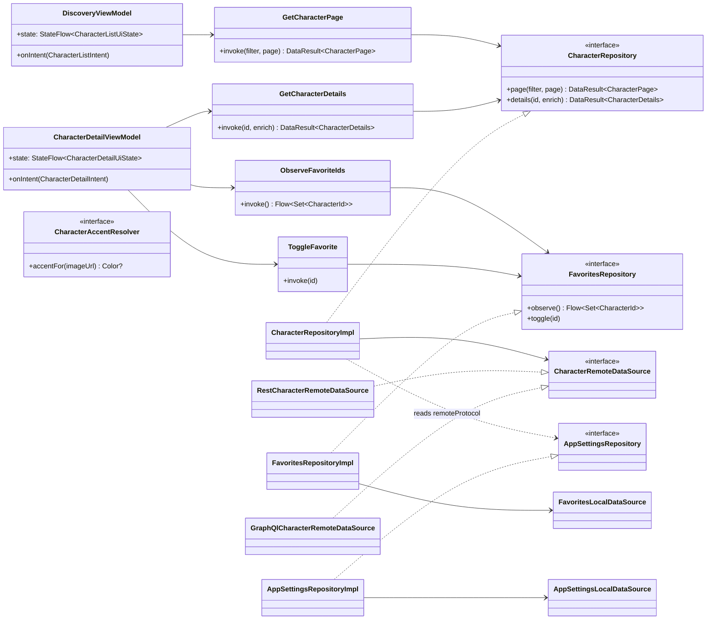

# DESIGN.md - System Architecture Design

- **Status:** Active — the architecture below is target state; the Gradle/KMP build skeleton (TASK-014) and the shared core of B3 — domain, REST adapter, repository with coalescing and retry, pager, logging and the diagnostic API, the favourites store on both platforms, and the presentation primitives with the copy-parity verifier — exist, no feature behaviour does (see `DOCUMENTATION_AUDIT.md` §5 for the drift rule)
- **Last verified:** 2026-10-03
- **Owner:** System Architect (see `AGENTS.md`)
- **Authoritative for:** architecture — layers, module boundaries, dependency direction, navigation ownership, presentation-state data flow, DI.
- **Not authoritative for:** requirement IDs and acceptance criteria (`REQUIREMENTS.md`), internal interface signatures and invariants (`CONTRACTS.md`), the failure→state→copy chain (`ERROR_FLOW.md`), the remote contract (`API_SPECS.md`), visual specification (`UI_SPEC.md`).
- **Inputs:** [`REQUIREMENTS.md`](REQUIREMENTS.md), [`API_SPECS.md`](API_SPECS.md), [`UI_SPEC.md`](UI_SPEC.md), [`CONTRACTS.md`](CONTRACTS.md), [`adr/`](adr/), design briefs in `docs/design/`

## 0. System overview

**Context.** A reviewer or a phone user reaches the public Rick and Morty API through one product: a character browser. There is no backend, no account and no server-side component owned by this project.



**Containers and responsibilities.**

| Container | Responsibility | Technology | Owns |
| --- | --- | --- | --- |
| Shared Kotlin core | Domain model, remote access, cache, paging, favourites, UI-state primitives, formatters, copy keys | Kotlin Multiplatform, Ktor, kotlinx.serialization | `:core:*` modules (§3.1) |
| Feature modules | One module per user-facing capability, each with its own domain, presentation and UI packages | Kotlin Multiplatform + Jetpack Compose / SwiftUI | `:feature:*` modules (§3.2) |
| Android app | App shell, navigation graph, DI wiring, splash, image pipeline, accent extraction | Jetpack Compose, Material 3 Expressive, Coil, Koin | `:androidApp` |
| iOS app | App shell, shared graph bootstrap, navigation composition, image pipeline | SwiftUI, Koin (shared graph), `URLCache` | `iosApp` targets |
| External API | Character, location and episode data | Public REST/GraphQL, HTTPS, unauthenticated | Not owned; contract in `API_SPECS.md` |
| Local storage | Favourites, cached responses | DataStore (Android), `UserDefaults` + files (iOS) | Not sensitive data (`SECURITY.md` §3) |

**Runtime data flow (one screen load).** Screen intent → platform state holder → use case → repository → cache decision → (remote fetch) → mapper → `DataResult` → state object → recomposition/rendering. Error paths follow `ERROR_FLOW.md`.

A full C4-style deployment view is not warranted: there is no server, no queue and no third-party service beyond the public API and the platform app stores.

## 1. Architectural pattern

- **Pattern:** Clean Architecture + MVVM with unidirectional data flow (UDF).
- **Layers:** Data → Domain ← Presentation. Dependencies point inwards: the domain layer knows nothing about HTTP, caches, Compose or SwiftUI.
- **UDF:** screens render an immutable `UiState` and send intents. ViewModels are the only state owners.



## 2. Platform strategy

The design briefs define one product with two native clients:

| Platform | UI stack | Design language | Priority |
| --- | --- | --- | --- |
| Android | Jetpack Compose | Material 3 Expressive | Primary deliverable, milestone M1 (`REQUIREMENTS.md`: Jetpack Compose) |
| iOS | SwiftUI | Liquid Glass on iOS 26+, material fallback below | Milestone M2; the brief frames it as part of a Kotlin Multiplatform (KMP) project |

Platform floors: Android `minSdk` 26, `compileSdk`/`targetSdk` 37; iOS minimum deployment target 18.0 with `glassEffect` guarded by an availability check (DEC-008, DEC-009, `REQ-PLAT-002`, `REQ-PLAT-003`). Phone portrait only (DEC-027). See [`adr/0002-platform-targets.md`](adr/0002-platform-targets.md).

The split between shared and native code:

- **Shared via KMP:** domain, data and the presentation-state contract (`UiState` data classes, display formatters, canonical copy keys). Both designs render the same information architecture (`UI_SPEC.md` §2), so filtering, paging, search debounce, detail enrichment and display formatting must behave identically on both platforms. Only rendering differs. **State holders are not shared** (DEC-013): each platform owns its ViewModel (`:feature:*`, `androidMain`) or `ObservableObject` (SwiftUI) over the shared state types.
- **Native per platform:** UI, design system, navigation, image loading and portrait colour extraction (these depend on platform bitmaps and toolkits).
- **Android stays unblocked:** Android ships alone by building the `:core:*` modules, the Android-side `:feature:*` modules and `:androidApp`. The iOS app is additive (DEC-040, `REQ-PLAT-004`).

**Networking impact (resolved).** The shared data layer uses **Ktor client + kotlinx.serialization**, with the OkHttp engine on Android and the Darwin engine on iOS (DEC-011, [`adr/0004-rest-client.md`](adr/0004-rest-client.md)). Retrofit/OkHttp and Apollo are retired; `API_SPECS.md` §7 and §14 are written against Ktor. Both adapters — `RestCharacterRemoteDataSource` and `GraphQlCharacterRemoteDataSource` — sit behind `CharacterRemoteDataSource`, and the repository resolves one per request from the stored settings, so the engine choice and the protocol choice both stay local to `:core:data` (DEC-056, [`adr/0011-runtime-remote-protocol.md`](adr/0011-runtime-remote-protocol.md)).

## 3. Module boundaries

**Strategy: feature-per-module with Clean Architecture inside each module (DEC-052, [`adr/0001-module-boundaries.md`](adr/0001-module-boundaries.md); the Settings module replaces Locations per DEC-055, [`adr/0010-settings-destination.md`](adr/0010-settings-destination.md)).** Each user-facing capability is its own Gradle/Swift module that contains its own domain, presentation and UI layers as packages. Shared infrastructure lives in `:core:*`. A feature module never depends on another feature module.

**API/IMPL boundary (`DEC-091`, [`adr/0014-api-impl-boundary.md`](adr/0014-api-impl-boundary.md)).** `:core:domain` is the API module and `:core:data` the implementation module. A feature's production code depends on the API (`:core:domain`) and on `:core:presentation`, never on `:core:data`; the composition roots — `:androidApp` and `:core:ios` — are the only production consumers of `:core:data`, and they wire its implementations behind the domain interfaces (§5). A feature's tests reach implementations only through `:core:testing`. `:core:presentation`, `:core:designsystem`, `:core:testing` and the feature modules are not split further: each has nothing to hide behind an interface or no consumer for one (ADR-0014).



### 3.1 Core modules (cross-feature infrastructure)

| Module | Target | Responsibility | Depends on |
| --- | --- | --- | --- |
| `:core:domain` | `commonMain` | Domain models (`CharacterSummary`, `CharacterDetails`, `CharacterStatus`, `CharacterGender`, `LocationSummary`, `EpisodeSummary`, `CharacterId`, `CharacterFilter`), repository interfaces (`CharacterRepository`, `FavoritesRepository`, `AppSettingsRepository`), `AppSettings` and `RemoteProtocol`, `DataResult`, `DataSource`, `ApiFailure`, the pager contract `CharacterPager`/`PagerState` (`IC-014`, `DEC-091`), the logging contract (`IC-024`), and the use cases that are genuinely shared across features (`ObserveFavoriteIds`). **The API module** every feature consumes (ADR-0014). | Kotlin stdlib + `kotlinx-coroutines-core` only (`DEC-066`) |
| `:core:data` | `commonMain` + platform source sets | Ktor client and engines, the REST and GraphQL remote data sources with their DTOs, envelopes and mappers, the per-request protocol selector (ADR-0011), app-level response cache, the shared pager's implementation, favorites and app-settings stores, repository implementations, failure mapping, retry/timeout policy, and the validating logger of `IC-024` (`DEC-087`). **The implementation module**: only the composition roots (`:androidApp`, `:core:ios`) and the test harness consume it (`DEC-091`). | `:core:domain` |
| `:core:presentation` | `commonMain` | Cross-feature presentation primitives only: `LoadState`, `CharacterCardUi`, `DisplayText`, display formatters ("Unknown" through its copy key, status labels, dimension and first-seen derivation), and `CopyKeys`, the canonical key list (`IC-015`…`IC-017`, `DEC-095`). No screen-specific state, no platform type and no string: the strings live in each platform's resources, and the copy-parity verifier of `TEST-UNIT-036` lives in this module's host tests. | `:core:domain` |
| `:core:designsystem` | Android | `MultiverseTheme` (single M3 colour scheme, no light/dark or dynamic-colour variants, Roboto Flex type scale, shapes), `MultiverseColors`, components: `CharacterCard`, `StatusBadge`, `StatTile`, `InfoListItem`, `PortalLogo`, skeletons, empty-state component. | Compose only |
| `:core:ios` | Apple targets only | **Build wiring, no behaviour.** Its only purpose is to produce the single Kotlin framework the iOS app links: it declares the two Apple targets of ADR-0002 and one `binaries.framework` that exports the five `:feature:*` modules, `:core:domain` and `:core:presentation` through `api` (ADR-0012, `DEC-058`, as amended by `DEC-091`). It has no source file, no `androidTarget` and no consumer on the Android side. | every `:feature:*`, `:core:domain`, `:core:presentation` — declared `api`, because `export` admits only `api` dependencies; `:core:data` as an unexported `implementation` (`DEC-091`) |
| `:core:testing` | KMP | Shared fakes (fake repositories, fake `CacheStorage`, fake favorites store, fake clock, fake image loader), JSON fixtures, `TestDispatcher` helpers. Test source sets only — never shipped. | `:core:domain`, `:core:data` |
| `:core:diagnostics` | KMP | The debug-only, read-only diagnostic API (`OBSERVABILITY.md` §5): `DiagnosticsRecorder`, a `LogSink` that folds the validated records into one snapshot — last failure class, current data source, last request timing, pager position — and reports every value nothing in the build produces yet as unavailable, naming its deliverer. No request trigger, no export (`DEC-085`, `DEC-088`, [ADR-0013](adr/0013-observability-placement.md); created by `TASK-047`). Linked by debug configurations only. | `:core:domain` (+ `kotlinx-coroutines-core` for its `StateFlow`) |

### 3.2 Feature modules (one per user-facing capability)

Every feature module repeats the same internal structure: Clean Architecture layers as **packages inside the module**.

```text
:feature:discovery/
├── src/commonMain/kotlin/<app>/feature/discovery/
│   ├── domain/         # feature use cases (for example GetCharacterPage) + feature models
│   ├── presentation/   # CharacterListUiState, CharacterListIntent (IC-018; shared by both platforms)
│   └── navigation/     # the feature's route declaration
├── src/androidMain/kotlin/.../discovery/ui/   # Compose screen + DiscoveryViewModel
├── src/iosMain/ or Swift package                # iOS consumes presentation/ state contract
└── src/commonTest/                              # feature tests, fakes from :core:testing
```

| Module | Responsibility | Notes |
| --- | --- | --- |
| `:feature:discovery` | Character list: paging, 300 ms debounced name search, status filter, loading/empty/stale/error states, the staggered grid, the shared-element source of the card portrait. | Owns `CharacterListUiState`/`CharacterListIntent` (`IC-018`); feature use cases stay here. |
| `:feature:character-detail` | Detail screen: hero, stats, info list, enrichment-aware rows, favourite toggle, the shared-element destination. | Owns `CharacterDetailUiState`/`CharacterDetailIntent`; reads the list-provided header for the instant transition. |
| `:feature:favorites` | Favorites list over the stored ID set, plus its designed empty state. | Reads `ObserveFavoriteIds` from `:core:domain`; renders the same card component as Discovery by consuming `:core:presentation` state types. |
| `:feature:episodes` | Episodes "coming soon" placeholder only. | No data layer in the MVP (DEC-005). |
| `:feature:settings` | Settings screen: Sounds preference, remote data-source choice, "Delete favorites" with its confirmation (`REQ-FUNC-033`…`REQ-FUNC-035`). | Owns `SettingsUiState`/`SettingsIntent` (`IC-023`) and the feature-local use cases; reads and writes preferences through `AppSettingsRepository` and clears favorites through `FavoritesRepository`, both in `:core:domain` (DEC-055, [`adr/0010-settings-destination.md`](adr/0010-settings-destination.md)). |

iOS mirrors the feature split with Swift packages under `iosApp/`: `Features/Discovery`, `Features/CharacterDetail`, `Features/Favorites`, `Features/Episodes`, `Features/Settings`, plus `DesignSystem`. Each Swift feature package holds its views and its `ObservableObject` (or `@Observable`) state holder, consuming the state contract published by the matching Kotlin feature module (DEC-013).

### 3.3 Application shells

| Module | Responsibility |
| --- | --- |
| `:androidApp` | `Application`, Koin graph assembly, app-wide `NavHost` composing every feature's route declaration, splash, Coil `ImageLoader`, adaptive launcher icon (`mipmap-anydpi-v26`). |
| `iosApp` app target | App entry point, shared Koin graph bootstrap, `TabView`/`NavigationStack` composition of the feature packages, app icon (Icon Composer `.icon`). |

### 3.4 Dependency rules (enforced)

**The module set itself is a rule:** `R16` of `verifyModuleBoundaries` asserts that every leaf module of ADR-0001 is present, so a build that has silently lost one fails instead of passing with less to check (`TASK-091`, `GAP-014`). Containers (`:`, `:core`, `:feature`) are not leaves; a `:feature:*` path outside the accepted five is unknown and fails `R13`; `:core:ios` is legal but optional until `TASK-078` promotes it.

1. `:core:domain` depends on no project module and on no platform, HTTP, UI or persistence library; the Kotlin standard library and `kotlinx-coroutines-core` are the only permitted dependencies (the `DEC-066` amendment to [ADR-0001](adr/0001-module-boundaries.md) resolving `CONF-47`).
2. `:core:data` depends only on `:core:domain`, and only the composition roots and `:core:testing` depend on it (`DEC-091`).
3. `:core:presentation` depends only on `:core:domain`.
4. `:core:designsystem` depends on Compose only — never on domain types, and never on a non-Compose external dependency (rule `R15` of `verifyModuleBoundaries`; the Compose families are enumerated in `ModuleDependencyAllowLists.kt`, and the toolchain's implicit `kotlin-stdlib` is not evaluated).
5. `:feature:*` production source sets may depend on `:core:domain`, `:core:presentation` and — from Android UI code only — `:core:designsystem`; never on `:core:data`, the implementation module (`R8`, `DEC-091`). A feature's test source sets may additionally reach `:core:testing` and the shared cores.
6. **No `:feature:*` module may depend on another `:feature:*` module.** Anything a feature needs from another feature moves to `:core:*`.
7. Navigation: each feature declares its own destination; the application shell composes the graph. No feature owns the app-wide `NavHost`.
8. Use-case placement: feature-specific use cases live in the feature's `domain` package; only genuinely cross-feature use cases live in `:core:domain`.
9. Test source sets may depend on `:core:testing`; production source sets may not. This holds for `:core:data` and `:core:presentation` as for every feature (`R2`/`R3`, `DEC-089`). `:core:domain`'s test source sets are the one exception: they may declare the approved test libraries `kotlin-test`, `kotlin-test-junit` and `kotlinx-coroutines-test` (`R14`) but no project module (`R1`), so a domain test never reaches the HTTP-bearing harness.
10. `:core:ios` is the only module that declares a native framework binary, and the only module that depends on all five `:feature:*` modules and on the three shared production `:core:*` modules (`:core:domain`, `:core:data`, `:core:presentation`). It exports the features, `:core:domain` and `:core:presentation`, and links `:core:data` as an unexported `implementation` (`DEC-091`, resolving `CONF-54`); `R12` rejects an `api` edge to `:core:data`. It never depends on `:core:designsystem` (Android-only) or `:core:testing` (test-only). `iosApp` depends on `:core:ios` and on nothing else from the shared core. No Android source set may depend on `:core:ios`, and no other module may depend on it (ADR-0012).
11. `:core:diagnostics` (`DEC-088`, [ADR-0013](adr/0013-observability-placement.md), created by `TASK-047`) depends on `:core:domain` only (`R18`); its test source sets may also reach `:core:testing` and `:core:data`, because the diagnostic API is proved on the real request and pager paths (`DEC-094`). It is declared by debug configurations only: `debugImplementation` in `:androidApp` (`TASK-044`) and the iOS app's Debug configuration (`TASK-051`). `R11` rejects a shell edge from any other configuration, judged on the effective configuration so an inherited edge is caught where it lands, and walks the release closure of `:androidApp` so the module cannot enter a release graph through another module either (`TEST-UNIT-033`). No `:core:*`/`:feature:*` production source set depends on it (`R2`, `R3`, `R8`, `R12`).
12. `:androidApp` is the Android composition root (§5): it composes the five features and `:core:designsystem`, and it is the one Android module that may depend on `:core:data` to wire the implementations behind the domain interfaces (`R11`, `DEC-091`). It declares that edge when `TASK-044` builds the graph.

**Target set.** ADR-0002 as amended by `DEC-079` permits one more target than the
decision first stated: a `:core:*` module MAY declare a JVM target through its own
`multiverse.jvmTarget=true` property when it needs a JVM-only verification path. `:core:domain` and
`:core:data` set it for the scheduled live contract job (`TASK-027`), and `:core:testing` sets it because
`:core:data`'s JVM test compilation compiles `commonTest` against the shared harness (`DEC-089`); no
`:feature:*` module, no `:core:designsystem` and no `:androidApp` does, and `verifyModuleBoundaries`
classifies targets.

**Enforcement:** the executable rule set is `./gradlew verifyModuleBoundaries`, from the dependency-free plugin `multiverse.module.boundaries` (`build-logic/convention/src/main/kotlin/boundaries/`), wired into the root `check` (`TASK-017`, hardened by `TASK-088`; topology completeness `R16` added by `TASK-091`; `TEST-UNIT-017`/`012`/`043`), with its own regression suite under `build-logic/convention/src/test` run by `check` (`TASK-092`). It reads each project's **effective** declared dependencies from the Gradle model — its own plus everything reachable through `extendsFrom`, so an edge hidden in a custom configuration and inherited into a shared source set is still an edge of that source set — classifies the configuration and source set that carry each edge, records the configuration that declared it, and fails on a forbidden edge, on an unrecognised module (fail closed), on an external dependency outside a module's allow-list (`R14` for `:core:domain`, `R15` for `:core:designsystem`), and on the staged, content-aware destination/package rules of `DEC-068`. Diagnostics are collected for every rule, sorted and repository-relative. `dependency-analysis`/`buildHealth` remains the `TASK-029` complement.

**Design-system rule:** `:core:designsystem` and the iOS `DesignSystem` package never depend on domain types. Components take primitives (strings, colours, image URL, status enum mirror), which keeps them previewable, screenshot-testable and 1:1 with the Figma components listed in `UI_SPEC.md` §1.2.

**Shared brand assets:** the Figma page `00 · Shared — Brand & Sample Data` holds the platform-neutral assets (`UI_SPEC.md` §1):
- **Portal logo:** exported once as SVG. It becomes a VectorDrawable in `:core:designsystem` and a vector asset (preserve vector data) in the iOS `DesignSystem` asset catalog. Each platform wraps it in its own `PortalLogo` component, and the splash treatments stay platform-specific.
- **App icons:** both are built on the portal logo but live on the platform pages, because each follows its own platform format (`UI_SPEC.md` §10).
  - Android: the adaptive-icon layers (background and foreground; no monochrome/themed layer) are exported as SVG and converted to vector drawables in `:androidApp`. The same foreground drives the Android 12+ system splash.
  - iOS: the single 1024 px master (no Dark, Clear or Tinted variants) feeds an Icon Composer `.icon` file in the iOS app target.
- **Sample portraits:** mock content only, never bundled in the release apps. The apps always load portraits from the API through the image cache. The same files may be used as local fixtures for previews and screenshot tests (§8), so those never hit the network.

### 3.5 Build toolchain and build logic

Every version below is an exact pin in `gradle/libs.versions.toml`; each was verified against a primary source on the date shown, and none is a range (`REQ-NFR-006`, `AC-REQ-NFR-006-1`). ADR-0008 permits exactly one alpha artifact in the project, and the catalog pins it: `libs.androidx.compose.material3` at `1.5.0-alpha29`. No module declares it yet, and only `:core:designsystem` may (ADR-0008 rule 2); no build tool is taken at an alpha, beta or RC version. The table below is machine-readable: the block between `<!-- dependency-rationale:begin -->` and `<!-- dependency-rationale:end -->` is parsed by `TEST-UNIT-013`, so every catalog entry appears in exactly one row, with its effective version, its concern and solution, a rationale that cites an identifier, a primary-source URL and a verification date.

<!-- dependency-rationale:begin -->

| Component | Catalog entries | Version | Concern | Solution | Rationale | Primary source | Verified |
| --- | --- | --- | --- | --- | --- | --- | --- |
| Gradle (wrapper) | — | `9.7.0` | Build tool | Gradle | Newest stable release inside the range the Kotlin 2.4.20 Multiplatform plugin documents as compatible (7.6.3–9.7.0) and above the 9.5.0 minimum AGP 9.3.1 requires (`REQ-NFR-006`, `AC-REQ-NFR-006-1`). The distribution is pinned by SHA-256 in `gradle/wrapper/gradle-wrapper.properties`. | `https://kotlinlang.org/docs/multiplatform/compatibility-guide.html` (version compatibility table); `https://developer.android.com/build/releases/past-releases/agp-9-3-0-release-notes` (Gradle minimum); `https://services.gradle.org/versions/all` | 2026-09-30 |
| Gradle daemon JVM | — | `25` | Build JDK | Gradle daemon JVM criteria | `gradle/gradle-daemon-jvm.properties` pins the JDK the Gradle daemon selects, written by Gradle's `updateDaemonJvm` task, so no machine path is committed (`REQ-NFR-006`; §3.5 below). The criterion pins the JDK **major** only: observed on 2026-09-30 as "Compatible with Java 25, any vendor", so vendor and patch level are not pinned. | `https://docs.gradle.org/current/userguide/gradle_daemon.html` (daemon JVM criteria); `https://docs.gradle.org/current/userguide/toolchains.html` | 2026-09-30 |
| Android Gradle Plugin | `libs.android.gradle.plugin`, `libs.plugins.android.application`, `libs.plugins.android.library`, `libs.plugins.android.kotlin.multiplatform.library` | `9.3.1` | Android build | Android Gradle Plugin | Newest stable AGP that supports `compileSdk` 37, supports Gradle 9.7.0 (minimum 9.5.0) and sits inside the AGP range documented for Kotlin 2.4.20 (8.5.2–9.3.1). The next stable line, 9.4.x, exceeds that range and is therefore not used (`AC-REQ-NFR-006-1`). | `https://kotlinlang.org/docs/multiplatform/compatibility-guide.html`; `https://developer.android.com/build/releases/past-releases/agp-9-3-0-release-notes` (API level 37 maximum, Gradle 9.5.0, JDK 17); `https://dl.google.com/dl/android/maven2/com/android/tools/build/gradle/maven-metadata.xml` | 2026-09-30 |
| Kotlin and the Kotlin Gradle plugin | `libs.kotlin.gradle.plugin`, `libs.plugins.kotlin.multiplatform` | `2.4.20` | Kotlin compiler | Kotlin | Fixed by ADR-0002 and ADR-0008; the current stable compiler, and the version the Compose compiler plugin and `kotlin-test` follow (`REQ-NFR-006`). | `https://kotlinlang.org/docs/multiplatform/compatibility-guide.html`; `https://repo1.maven.org/maven2/org/jetbrains/kotlin/kotlin-gradle-plugin/maven-metadata.xml` | 2026-09-30 |
| Kotlin serialization plugin | `libs.plugins.kotlin.serialization` | `2.4.20` | Serialization | kotlinx.serialization | Ships with the Kotlin release and must match the compiler version (ADR-0004, `REQ-NFR-006`). | `https://repo1.maven.org/maven2/org/jetbrains/kotlin/plugin/serialization/` | 2026-09-30 |
| kotlinx.serialization runtime | `libs.kotlinx.serialization.core`, `libs.kotlinx.serialization.json` | `1.11.0` | Serialization | kotlinx.serialization | Newest stable release of the runtime; the route declarations of §4.2 are `@Serializable`. The JSON format is the payload codec of both shipped protocols, REST and GraphQL (DEC-011, ADR-0004, ADR-0011). | `https://repo1.maven.org/maven2/org/jetbrains/kotlinx/kotlinx-serialization-core/maven-metadata.xml`; `https://repo1.maven.org/maven2/org/jetbrains/kotlinx/kotlinx-serialization-json/maven-metadata.xml` | 2026-09-30 |
| kotlinx.coroutines | `libs.kotlinx.coroutines.core` | `1.11.0` | Concurrency | kotlinx.coroutines | The concurrency runtime of the shared modules, named by `GUIDELINES.md` §3.3, and required by the `Flow` in `IC-008` (`CONTRACTS.md` §5, `CONF-47`). Ktor 3.6.0 already requires exactly 1.11.0, so the declared version is the version Gradle resolves (`REQ-NFR-002`). | `https://repo1.maven.org/maven2/org/jetbrains/kotlinx/kotlinx-coroutines-core/maven-metadata.xml`; `https://repo1.maven.org/maven2/io/ktor/ktor-client-core/3.6.0/ktor-client-core-3.6.0.pom` | 2026-09-30 |
| kotlinx-coroutines-test | `libs.kotlinx.coroutines.test` | `1.11.0` | Test dispatcher and time control | kotlinx-coroutines-test | `TestDispatcher`, `runTest` and virtual time are the only permitted test execution model (`TESTING.md` §5, `REQ-REL-004`); released with the runtime, so it shares the version. | `https://repo1.maven.org/maven2/org/jetbrains/kotlinx/kotlinx-coroutines-test/maven-metadata.xml` | 2026-09-30 |
| kotlin.test | `libs.kotlin.test` | `2.4.20` | Test framework | kotlin.test | [INFERENCE] the `@Test` and assertion API of the `commonTest` suites; it ships with the Kotlin compiler, so it pins nothing new (`TESTING.md` §3, §13.2; `REQ-NFR-005`). | `https://repo1.maven.org/maven2/org/jetbrains/kotlin/kotlin-test/maven-metadata.xml` | 2026-09-30 |
| JUnit 4 | `libs.junit4` | `4.13.2` | Test framework | JUnit 4 | [INFERENCE] the runner API that Robolectric, Roborazzi and `androidx.compose.ui:ui-test-junit4` execute on; it is Android-host test infrastructure, not a shared-module dependency (DEC-034, `TESTING.md` §8). | `https://repo1.maven.org/maven2/junit/junit/maven-metadata.xml` | 2026-09-30 |
| Ktor client | `libs.ktor.client.core`, `libs.ktor.client.okhttp`, `libs.ktor.client.darwin`, `libs.ktor.utils` | `3.6.0` | HTTP client | Ktor | The single remote stack of `:core:data`, with the OkHttp engine on Android and the Darwin engine on iOS (DEC-011, ADR-0004, ADR-0011; `REQ-PLAT-001`). `ktor-utils` holds the `io.ktor.utils` types the OkHttp and Darwin engines expose on the adapter's own classpath, so dependency analysis asks for the edge where it is used instead of leaving it transitive (`B5`, `DEC-077`); it is the same Ktor release line, so it adds no version. | `https://repo1.maven.org/maven2/io/ktor/ktor-client-core/maven-metadata.xml` | 2026-10-03 |
| Ktor MockEngine | `libs.ktor.client.mock` | `3.6.0` | HTTP test double | Ktor MockEngine | The fixture-driven network seam for `commonTest`; no test opens a socket (DEC-030, `TESTING.md` §4.1). It does not exercise OkHttp's cache, which is why the second double exists. | `https://repo1.maven.org/maven2/io/ktor/ktor-client-mock/maven-metadata.xml` | 2026-09-30 |
| OkHttp | `libs.okhttp` | `5.5.0` | HTTP disk cache (Android engine) | OkHttp | Exactly the OkHttp version `io.ktor:ktor-client-okhttp:3.6.0` requires, read from its POM, so the declared version is the resolved one. Used for the disk cache and the `404` → `Cache-Control: no-store` rewrite on the Android engine only — **engine configuration only**, because ADR-0004 forbids OkHttp as a client (`API_SPECS.md` §7.1, `IC-012`). | `https://repo1.maven.org/maven2/io/ktor/ktor-client-okhttp-jvm/3.6.0/ktor-client-okhttp-jvm-3.6.0.pom`; `https://repo1.maven.org/maven2/com/squareup/okhttp3/okhttp/maven-metadata.xml` | 2026-09-30 |
| OkHttp MockWebServer | `libs.okhttp.mockwebserver` | `5.5.0` | HTTP test double | OkHttp MockWebServer | The artifact of the same release line as `libs.okhttp` (`mockwebserver3` for OkHttp 5.x), and the only harness that exercises OkHttp's own cache and header rewriting (`TEST-INT-001`, `TESTING.md` §4.2). | `https://repo1.maven.org/maven2/com/squareup/okhttp3/mockwebserver3/maven-metadata.xml` | 2026-09-30 |
| Koin | `libs.koin.core`, `libs.koin.android`, `libs.koin.androidx.compose`, `libs.koin.compose`, `libs.koin.core.viewmodel` | `4.2.2` | Dependency injection | Koin | Multiplatform runtime DSL for the shared graph and the Android shells, with no compiler plugin; `koin-android` supplies the Android `Context` the Preferences DataStore needs, `koin-androidx-compose` supplies `koinViewModel()`, and `koin-compose`/`koin-core-viewmodel` carry the Compose resolution and ViewModel DSL the Android feature screens name directly, so each is declared where it is used `B5`, (DEC-014, ADR-0006, ADR-0007; `DESIGN.md` §5). | `https://repo1.maven.org/maven2/io/insert-koin/koin-core/maven-metadata.xml` | 2026-10-03 |
| Compose compiler plugin | `libs.plugins.kotlin.compose` | `2.4.20` | UI toolkit (Android) | Jetpack Compose | The Compose compiler is versioned with the Kotlin compiler, so it pins nothing new; without it the Compose runtime cannot be compiled (`REQ-PLAT-002`; ADR-0008 rule 5). | `https://plugins.gradle.org/m2/org/jetbrains/kotlin/plugin/compose/org.jetbrains.kotlin.plugin.compose.gradle.plugin/maven-metadata.xml` | 2026-09-30 |
| Compose BOM and libraries | `libs.androidx.compose.bom`, `libs.androidx.compose.runtime`, `libs.androidx.compose.ui`, `libs.androidx.compose.ui.graphics`, `libs.androidx.compose.ui.geometry`, `libs.androidx.compose.ui.text`, `libs.androidx.compose.ui.unit`, `libs.androidx.compose.foundation`, `libs.androidx.compose.foundation.layout`, `libs.androidx.compose.animation`, `libs.androidx.compose.animation.core`, `libs.androidx.compose.ui.tooling.preview`, `libs.androidx.compose.ui.tooling` | `2026.09.00` | UI toolkit (Android) | Jetpack Compose | The BOM is the only BOM in the catalog: it is the single governor of the versionless Compose entries, so `:core:designsystem` and the feature screens share one Compose set (DEC-010, ADR-0008; `UI_SPEC.md` §4). `foundation` carries the staggered grid, `animation` the `SharedTransitionLayout` of §4.2, and `ui-graphics` the `Color`/`ColorPainter` a feature placeholder draws with. The `B5` Android screens name `ui-text`, `foundation-layout`, `ui-geometry` and the Compose test surface directly, and those types are a composable's public parameter types, so each artifact is declared where it is used rather than reached transitively. The BOM's mapping constrains the family to Compose 1.12.1, but `androidx.compose.ui:ui-test-junit4:1.13.0-alpha01` states a hard `1.13.0-alpha01` dependency on the UI family, which wins the conflict; Gradle therefore resolves Compose UI to `1.13.0-alpha01` (`B5`, `DEC-077`). | `https://developer.android.com/develop/ui/compose/bom/bom-mapping`; `https://dl.google.com/dl/android/maven2/androidx/compose/compose-bom/2026.09.00/compose-bom-2026.09.00.pom` | 2026-10-03 |
| Activity Compose | `libs.androidx.activity.compose` | `1.13.0` | UI toolkit (Android) | Jetpack Compose | [INFERENCE] `ComponentActivity.setContent` is the entry point of the Compose app shell; the newest stable release, compatible with Compose 1.12.1 and the Compose BOM `2026.09.00` (`DESIGN.md` §3.3, `REQ-PLAT-002`). | `https://dl.google.com/dl/android/maven2/androidx/activity/activity-compose/maven-metadata.xml` | 2026-09-30 |
| Compose UI test | `libs.androidx.compose.ui.test.junit4`, `libs.androidx.compose.ui.test.manifest`, `libs.androidx.compose.ui.test` | `2026.09.00` | UI testing (Android) | Compose UI test | BOM-governed semantics assertions and the host activity Robolectric's `createComposeRule()` needs; the manifest artifact is a debug-only dependency (`TESTING.md` §8.1–§8.2; `REQ-NFR-005`). `ui-test` is the assertion and node-finding surface the host cases call directly, so it is declared where it is used (`B5`, `DEC-077`). | `https://developer.android.com/develop/ui/compose/bom/bom-mapping` | 2026-10-03 |
| Material 3 Expressive | `libs.androidx.compose.material3` | `1.5.0-alpha29` | Design components (Android) | Material 3 Expressive | The single accepted alpha of ADR-0008 (DEC-010): the stable Material 3 line is 1.4.0, and adopting it would make the components specified in `UI_SPEC.md` §4.1 approximations. It keeps its explicit version because the BOM maps `material3` to stable 1.4.0. | `https://dl.google.com/dl/android/maven2/androidx/compose/material3/material3/maven-metadata.xml` | 2026-09-30 |
| Navigation Compose | `libs.androidx.navigation.compose` | `2.10.2` | Navigation (Android) | Navigation Compose | Type-safe routes for the four destinations and the app-wide `NavHost` composed by the shell (§4.2, ADR-0008); its Compose 1.10.5 floor is below the BOM's 1.12.1 (`REQ-FUNC-008`). | `https://dl.google.com/dl/android/maven2/androidx/navigation/navigation-compose/maven-metadata.xml` | 2026-09-30 |
| SplashScreen | `libs.androidx.core.splashscreen` | `1.2.0` | Splash screen (Android) | AndroidX SplashScreen | `installSplashScreen()` hands the system splash to the branded portal splash specified in `UI_SPEC.md` §6.1 and §4.2 (ADR-0008; `REQ-FUNC-007`). | `https://dl.google.com/dl/android/maven2/androidx/core/core-splashscreen/maven-metadata.xml` | 2026-09-30 |
| Lifecycle ViewModel | `libs.androidx.lifecycle.viewmodel`, `libs.androidx.lifecycle.common`, `libs.androidx.lifecycle.runtime.compose`, `libs.androidx.lifecycle.viewmodel.compose` | `2.11.0` | State holder (Android) | AndroidX ViewModel | The Android state holder of every feature's `androidMain` `ui` package (ADR-0006, `DESIGN.md` §5). **Stable only**, and declared from `androidMain` only: ADR-0008 and DEC-013 decline the multiplatform `androidx.lifecycle` 2.12.0-alpha04 because no ViewModel is shared. The `B5` routes call `collectAsStateWithLifecycle`, so the Compose integration (`lifecycle-runtime-compose`/`lifecycle-viewmodel-compose`) and the `lifecycle-common` types those signatures expose are declared where they are used (`DEC-077`); all three share the pinned `androidx-lifecycle` version. | `https://dl.google.com/dl/android/maven2/androidx/lifecycle/lifecycle-viewmodel/maven-metadata.xml` | 2026-10-03 |
| Preferences DataStore | `libs.androidx.datastore.preferences` | `1.2.1` | Local persistence (Android) | Preferences DataStore | The stable Android artifact behind the favourites `expect/actual` seam, declared from `:core:data` `androidMain` only (ADR-0007, `REQ-FUNC-006`; `TASK-040`); its API lives in `datastore-core`/`datastore-preferences-core`, which dependency analysis reads as one bundle with this artifact as primary (root build, `DEC-077`); the multiplatform 1.3.0-alpha11 is declined, because a second alpha would violate ADR-0008. | `https://dl.google.com/dl/android/maven2/androidx/datastore/datastore-preferences/maven-metadata.xml` | 2026-09-30 |
| Coil | `libs.coil.compose`, `libs.coil.network.ktor3` | `3.6.3` | Image loading (Android) | Coil | The Android image pipeline, with the Ktor 3 network layer so the app ships one HTTP stack (DEC-026, ADR-0008; `UI_SPEC.md` §5.2, `REQ-FUNC-021`). | `https://repo1.maven.org/maven2/io/coil-kt/coil3/coil-compose/maven-metadata.xml` | 2026-09-30 |
| Robolectric | `libs.robolectric` | `4.17` | Android host test runtime | Robolectric | The host runtime behind the snapshot suite (DEC-034); its release notes state support for SDK 37, so it covers the project's `compileSdk` without an SDK-level exclusion (`TESTING.md` §8.2). | `https://github.com/robolectric/robolectric/releases/tag/robolectric-4.17`; `https://repo1.maven.org/maven2/org/robolectric/robolectric/maven-metadata.xml` | 2026-09-30 |
| Robolectric shadows | `libs.robolectric.annotations`, `libs.robolectric.shadows.framework` | `4.17` | Android host test runtime | Robolectric | `@Config` is `org.robolectric.annotation.Config` and the sandbox the host cases run in is built from `org.robolectric:shadows-framework`; both are the same release line as `libs.robolectric` and are declared where the host cases use them rather than reached transitively (`DEC-077`, `TESTING.md` §8.2). | `https://repo1.maven.org/maven2/org/robolectric/annotations/maven-metadata.xml`; `https://repo1.maven.org/maven2/org/robolectric/shadows-framework/maven-metadata.xml` | 2026-10-03 |
| AndroidX Test JUnit | `libs.androidx.test.ext.junit` | `1.1.5` | Test runner adapter | AndroidX Test | `AndroidJUnit4` (`androidx.test.ext.junit.runners`) is the runner every Android host-test case executes on, and the version is the one `ui-test-junit4` already resolves (`DEC-077`, `TESTING.md` §8.1). | `https://dl.google.com/dl/android/maven2/androidx/test/ext/junit/maven-metadata.xml` | 2026-10-03 |
| Roborazzi | `libs.roborazzi`, `libs.roborazzi.compose`, `libs.roborazzi.junit.rule`, `libs.plugins.roborazzi` | `1.76.0` | Screenshot testing | Roborazzi | Committed Android baselines on Robolectric, with the plugin providing the `verifyRoborazziDebug` and `recordRoborazziDebug` tasks `README.md` §9 names (DEC-024, DEC-034; `REQ-UX-001`). | `https://repo1.maven.org/maven2/io/github/takahirom/roborazzi/roborazzi/maven-metadata.xml` | 2026-09-30 |
| ktlint (Gradle plugin) | `libs.plugins.ktlint`, `libs.ktlint.gradle` | `14.2.0` | Formatting (Kotlin) | ktlint | Supplies the `ktlintCheck` task `README.md` §9 names and takes formatting out of review (DEC-032); `GUIDELINES.md` §1.3 names ktlint as the owner of Kotlin formatting and import ordering. Its changelog states Kotlin 2.4.0 support and Gradle 9 compatibility; its documented minimums are Gradle 7.4 and AGP 4.1.0. The `libs.ktlint.gradle` artifact is the plugin's own classpath entry, which the convention plugins need because they configure its extension (`TASK-029`). | `https://github.com/JLLeitschuh/ktlint-gradle/blob/main/CHANGELOG.md`; `https://plugins.gradle.org/plugin/org.jlleitschuh.gradle.ktlint` | 2026-10-01 |
| snakeyaml-engine | `libs.snakeyaml.engine` | `2.10` | YAML parsing in the workflow gate | snakeyaml | The workflow gate (`TEST-UNIT-044`, `TASK-098`) parses workflow files structurally instead of searching concatenated text, so it needs a real YAML parser. It is already present on the build's own classpath transitively through the ktlint plugin, which is **not** a declared dependency of this project — relying on it silently is exactly what `REQ-NFR-002` forbids, so it is pinned explicitly. 2.10 is the version the existing classpath already resolves, so the pin adds no version change. | `https://repo1.maven.org/maven2/org/snakeyaml/snakeyaml-engine/maven-metadata.xml` | 2026-10-02 |
| Ktor HTTP core | `libs.ktor.http` | `3.6.0` | HTTP types in the test harness | Ktor | `:core:testing`'s `MockHttp` binds `io.ktor.http` types (`HttpStatusCode`, `headersOf`) directly, so the artifact is declared where it is used instead of reached transitively (`DEC-077`, `TESTING.md` §4). It resolves to the version Ktor's client already pins. | `https://repo1.maven.org/maven2/io/ktor/ktor-http/maven-metadata.xml` | 2026-10-01 |
| kotlin-test JUnit adapter | `libs.kotlin.test.junit` | `2.4.20` | Test runner adapter | kotlin.test | The Android host-test target runs `kotlin.test` assertions on the JUnit 4 platform, so the adapter is declared where the platform executes rather than reached transitively (`DEC-077`). It ships with the Kotlin compiler and pins nothing new. | `https://repo1.maven.org/maven2/org/jetbrains/kotlin/kotlin-test-junit/maven-metadata.xml` | 2026-10-01 |
| Dependency Analysis Gradle Plugin | `libs.plugins.dependency.analysis` | `3.19.2` | Dependency analysis | Dependency Analysis Gradle Plugin | Reports declared-versus-used edges so the §3.4 module rules become a build property; it provides the `buildHealth` task `README.md` §9 and `GUIDELINES.md` §1.3 name (DEC-032, DEC-037; `REQ-NFR-009`). | `https://plugins.gradle.org/plugin/com.autonomousapps.dependency-analysis` | 2026-09-30 |

<!-- dependency-rationale:end -->

**Dependency policy (DEC-060, DEC-061).**

- The catalog holds the **full planned inventory** ahead of first use: an entry may be pinned before the task that first declares it, and each entry is declared later by the task named in the "Planned for" column of `README.md` §15 (DEC-060).
- `README.md` §15, mirrored in `README.es.md` §15, shows each entry's declaration state, derived from the build scripts, so the inventory can be compared with the resolved graph (`AC-REQ-NFR-002-1`).
- The Compose BOM is the only BOM in the catalog; every entry it governs is versionless, and its effective version is the BOM's.
- `./gradlew verifyDependencyPolicy` enforces all three: exact pins, this table and the inventory (DEC-061; `TEST-UNIT-013`, `TEST-UNIT-014`, `TEST-UNIT-051`). It runs as part of `./gradlew check` and `./gradlew build`. The pin check also refuses rich version forms (`strictly`, `prefer`, `reject`) on every entry and enforces DEC-060's single BOM, `androidx.compose:compose-bom`. The inventory check refuses `[bundles]` and catalog lookups by name (`findLibrary`, `findBundle`, `findPlugin`) outside the policy plugin, so each entry's declaration state stays derivable from the module build scripts (DEC-057). The build has one catalog (`libs`), Kotlin DSL scripts only and no `buildSrc`, and the catalog accessor is never aliased (P7, P8, I9). The checks read source text — including the included build's settings file for its catalog declaration — so their known limits, and the exact syntax they support, are recorded as `GAP-011`.
- A pinned entry that ages before it is first used is bumped in its own change, with its verification date and source URL updated here (`SECURITY.md` §9.1); an alpha or BOM bump follows ADR-0008 rule 3 and is never bundled with feature work.

**Not pinned.** These are named or planned artifacts the catalog deliberately does not pin, each for a recorded reason:

| Item | Reason | Blocking reference | Owner |
| --- | --- | --- | --- |
| `androidx.benchmark:benchmark-macro-junit4`, the `com.android.test` plugin, the `androidx.baselineprofile` plugin, `androidx.profileinstaller:profileinstaller` | The Macrobenchmark harness needs a module the authoritative module list does not allow, and `PERFORMANCE.md` §4.1 requires a decision "before any Gradle file is created". Pinning them now would pre-empt that decision. | `PERFORMANCE.md` §4.1 `PERF-Q1`, `CONF-41` | System Architect (decision), Delivery Planner (task) |
| Any `contract-live` tooling | The live-contract job's shape is undecided, and the fixture/replay suite of `TESTING.md` §11 needs no additional artifact. | `CONF-41` | System Architect |
| `com.google.material:material-color-utilities` | No first-party artifact of that coordinate exists on Maven Central or Google Maven — both answer `404` on 2026-09-30 — and the only published coordinates are third-party ports, which would make the `QuantizerCelebi`/`Score`/`TonalPalette` path of §4.4 depend on one. Recorded as `CONF-50`. | `CONF-50`, `DESIGN.md` §4.4 | System Architect, Implementation Engineer (Android) |
| The detekt Gradle plugin (`io.gitlab.arturbosch.detekt` 1.x, `dev.detekt` 2.x) | The newest stable release, 1.23.8, is built against Kotlin 2.0.21, Gradle 8.12.1 and AGP 8.8.1, and the vendor documents no Kotlin 2.4.20 / Gradle 9.7.0 / AGP 9.3.1 support for it. Every 2.x release on the Gradle Plugin Portal is an alpha (`2.0.0-alpha.0`…`2.0.0-alpha.6`, observed 2026-09-30), and ADR-0008 permits exactly one alpha. Under TASK-015 OD-6 it is therefore not pinned. | `CONF-51`, ADR-0008, DEC-032 | QA & Validation Engineer (TASK-029); System Architect (any ADR-0008 change) |
| swift-snapshot-testing | Pinned with the iOS app's Swift sources (`DEC-024`, `DEC-025`). | `TASK-051`, `TASK-059` | Implementation Engineer (iOS) |
| SwiftLint, swift-format, Xcode | Pinned outside the Gradle catalog, at their real locations (`DEC-076`): SwiftLint `0.65.1` with the SHA-256 of its release artifact in `tools/swift-tools.lock`; swift-format by the Xcode version that ships it (Xcode 27.0), because `macos-latest` alone does not fix the toolchain. | `TASK-030`, `TASK-051` | Implementation Engineer (iOS) |

**The `buildHealth` exclusion register (`DEC-077`, amended by `DEC-081`).** `buildHealth` fails on any unused declared dependency, and on a tree whose modules are still placeholders every architecture-mandated edge is "unused". `gradle/dependency-advice-exclusions.txt` therefore carries explicit, reviewed exclusions, one per `module|dependency|removal-task`, and `./gradlew verifyDependencyAdviceRegister` (part of `check`) enforces their lifecycle. **An exclusion expires when the excluded edge's actual consumer consumes it** — in the excluded configuration's own source set, production or test according to that configuration — and *not* when the module merely gains production source, and *not* because an unrelated file mentions the dependency's package. *Consumption* means an import, an alias, a wildcard import or a fully qualified reference to the dependency's package in the relevant sources, with comments and string literals ignored; the guard reads project directories, source roots, dependency configurations and package namespaces from the build model and never derives a package from a Gradle path spelling. A missing ownership or package fact is a diagnostic, not an assumption. The register may not outlive the placeholder state it exists for, and a genuinely unused dependency still fails `buildHealth` (`TASK-105`, `DEC-077`, `DEC-081`; `REQ-NFR-002`, `REQ-NFR-006`).

Artifacts no document names are not pinned either: they are listed in the TASK-015 pull request, and the task that first needs one adds it with its own rationale. The retired stack — Retrofit, Apollo, SKIE, SQLDelight, multiplatform DataStore and the lifecycle KMP alpha — never appears in the catalog (`DECISION_BOARD.md` §3).

SDK levels are `compileSdk`/`targetSdk` 37 and `minSdk` 26, taken from the catalog and set once per module by the convention plugins (ADR-0002, DEC-009). The JVM bytecode target is 17 for **every** Java and Kotlin compilation, set in the convention plugins — including each eligible opt-in JVM target and every custom compilation it carries, so no compilation inherits the daemon's bytecode level (`TASK-101`, `DEC-080`). No `jvmToolchain(...)` and no `org.gradle.java.home` is declared, so the build runs on the JDK the Gradle daemon selects, and that selection is pinned by `gradle/gradle-daemon-jvm.properties` (`toolchainVersion`, generated by Gradle's `updateDaemonJvm` task) rather than by a machine-specific path. The bytecode target and the daemon JDK are therefore independent: the daemon JDK is a build-environment property, and no module may depend on it being any particular version. `README.md` §6 documents JDK 17 as the minimum for a contributor's own toolchain.

**Build logic (DEC-057).** Shared Gradle configuration lives in three convention plugins in the included build `build-logic/`: `multiverse.kmp.library` (a Kotlin Multiplatform library with the Android-KMP target and the two iOS targets), `multiverse.android.library` and `multiverse.android.application`. The included build is Gradle tooling and is not a project module, so it does not change the ADR-0001 module set. Each module's own `build.gradle.kts` declares only its plugins and its dependencies, and **every project-to-project edge is declared in the consuming module's build script** — never inside a convention plugin — so the dependency graph is reviewable per module and a boundary violation is visible in the diff that introduces it.

`:core:ios` is the one module that declares a framework binary, and it uses `id("multiverse.kmp.library")` plus its own framework declaration rather than a fourth convention plugin: it is the only module of its kind, and a plugin for a single consumer would be a second place to look for the same configuration (DEC-057). Its `api` declarations are the only place in the build where a module declares `api` instead of `implementation`, and they exist solely because `export` requires it — the rule for every other module stays `implementation`, as §3.4 states.

The package root and the Android application id are declared exactly once, as `multiverse.packageRoot` in the root `gradle.properties`; every Android namespace, the application id and the Kotlin package directories derive from that single value, and a build without it fails.

## 4. Presentation layer

### 4.1 UI state contract (shared)

**Ownership:** the normative signatures live in [`CONTRACTS.md`](CONTRACTS.md) (`IC-015`, `IC-018`, `IC-019`, and the filter/formatter contracts). This section shows how state flows through the architecture — change a type in `CONTRACTS.md`, never here.

Both platforms consume the same state types unchanged (DEC-013, DEC-015). Each platform wraps them in its own state holder:

| Contract (`CONTRACTS.md`) | Type | Consumed by |
| --- | --- | --- |
| `IC-018` | `CharacterListUiState` | `:feature:discovery` — Android `DiscoveryViewModel`, iOS `Features/Discovery` `ObservableObject` |
| `IC-019` | `CharacterDetailUiState` | `:feature:character-detail` — Android `CharacterDetailViewModel`, iOS `Features/CharacterDetail` `ObservableObject` |
| `IC-015` | `LoadState` | Both state types above |
| `IC-013` | `CharacterFilter` + `StatusFilter` | Discovery filters, used identically by both platforms |
| `IC-016` | `CharacterCardUi` | Cards in Discovery and Favorites, and the detail header |

Intents are sealed types declared with their state (`IC-018`, `IC-019`). Discovery intents: `QueryChanged`, `StatusSelected`, `LoadNextPage`, `Refresh`, `Retry`. Detail intents: `ToggleFavorite`, `Retry`.

The Discovery state holder applies the rules from `API_SPECS.md` §8: 300 ms debounce, `distinctUntilChanged`, cancellation, page reset and single-page prefetch.

### 4.2 Navigation

| Route | Android (Navigation Compose, type-safe routes) | iOS (`NavigationStack(path:)`) |
| --- | --- | --- |
| `Splash` | In-app composable after `installSplashScreen()` | Root view before the stack |
| `CharacterList` | Start destination, bottom navigation "Characters" | `TabView` → "Characters" tab root |
| `CharacterDetail(id)` | `@Serializable data class CharacterDetail(val id: String)` | `Route.detail(CharacterId)` |
| `Episodes` · `Favorites` · `Settings` | Top-level destinations in the navigation bar, in the order Characters · Episodes · Favorites · Settings (DEC-055) | `TabView` tabs, same order |

The card-to-detail transition is part of the architecture, not decoration:
- **Android:** `SharedTransitionLayout` wraps the app-wide `NavHost` in `:androidApp`, composed from each feature's declared destination. The portrait uses the shared key `"portrait-$id"`, and predictive back is supported. The shared element crosses the `:feature:discovery` → `:feature:character-detail` boundary as a keyed modifier supplied by `:core:designsystem`, not as a module dependency between the two features (rule 6 in §3.4).
- **iOS:** a `@Namespace` is passed from the Discovery view to the detail view for `.matchedTransitionSource` / `.navigationTransition(.zoom)`.
- **Both:** to work, the detail must render the pre-filled `header` immediately, before the network responds (`API_SPECS.md` §8: "Reuse list data during navigation"). Discovery publishes the selected `CharacterCardUi` through a shared navigation hand-off in `:core:presentation`, so neither feature depends on the other.

The Episodes, Favorites and Settings destinations are wired in the MVP. Episodes shows a placeholder screen (`UI_SPEC.md` §6.4) and Settings shows the settings screen (`UI_SPEC.md` §6.5). Each platform has one reusable empty-state component with identical copy: `:core:designsystem` (Android) and `iosApp/DesignSystem` (iOS).
- Episodes is a "coming soon" screen with no use case or data layer (DEC-005).
- Settings changes preferences through `AppSettingsRepository`; a data-source change reaches the Discovery pager as an identity change, so the list reloads from page 1 (ADR-0011).
- `:feature:favorites` observes `ObserveFavoriteIds` (§4.5) and shows its empty state while the set is empty.
- "Browse characters" switches to the Characters destination rather than pushing a route.

Real Episodes screens and sound effects remain deferred (DEF-002, DEF-005). Locations has no destination since DEC-055; real Locations screens remain deferred (DEF-003).

### 4.3 Design tokens pipeline

Figma variables are the source of truth. There are three collections:
- `Multiverse · M3 Scheme` (one mode: the app has a single appearance)
- `Multiverse · Brand`
- `Multiverse · Dimensions`

Code syntax is already set on each variable (`MaterialTheme.colorScheme.primary`, `Color.portalGreen`, …).

For the MVP, the tokens are hand-written:
- Android: `MultiverseTokens.kt` in `:core:designsystem` (the colour, dimension and type-scale objects)
- iOS: `Color+Multiverse.swift`, `Font+Multiverse.swift`

#### Committed export (`DEC-022`, `DEC-102`)

The hand-written tokens are checked against a committed export of the Figma variables, so drift fails. The export lives at `docs/figma/tokens.json` — beside the rendered PNG exports, and readable by both platforms (`TASK-052` reads the same file) — and its schema is:

```json
{
  "schemaVersion": 1,
  "source": {
    "fileKey": "nFQdxd23Kk4rNI7G4iHDUr",
    "fileName": "Rick & Morty",
    "fileUrl": "https://www.figma.com/design/…",
    "exportedAt": "YYYY-MM-DD",
    "exportedBy": "…",
    "method": "…",
    "variableCount": 86
  },
  "collections": [
    {
      "name": "Multiverse · M3 Scheme",
      "mode": "Multiverse",
      "variableCount": 49,
      "variables": [
        { "name": "Schemes/Primary", "type": "COLOR", "value": "#A4D661" },
        { "name": "Space/XS", "type": "FLOAT", "value": "4" }
      ]
    }
  ]
}
```

- `collections[].variables[].name` is the Figma variable name verbatim; it is unique across the whole file, which the parity test asserts.
- `type` is the variable's resolved type (`COLOR` or `FLOAT`); `value` is a string, an uppercase `#RRGGBB` or `#RRGGBBAA` for a colour and the number's decimal form for a dimension.
- The export is produced by a **read-only** enumeration of the three local collections through the authenticated Figma connector (`figma.variables.getLocalVariableCollectionsAsync` plus `getVariableByIdAsync`), with alias chains resolved to their final value. It is never hand-typed: a hand-typed file is not an export and would satisfy no parity claim. The export date and method are recorded here and in the `docs/figma/README.md` export log.

`TEST-UNIT-035` compares `docs/figma/tokens.json` with the Kotlin token objects in both directions: a token whose value drifts fails, and an exported variable that no token maps fails unless it sits in the test's reviewed exclusion (the iOS-only glass and label families, which `TASK-052` consumes). Figma wins for values, so a divergence is settled by re-exporting and reconciling `UI_SPEC.md` §3, never by editing one side silently.

Code generation from `tokens.json` can replace the manual step later without changing any call sites.

### 4.4 Portrait accent colour (Android)

The M3 brief asks for card containers tinted from each character's portrait (`UI_SPEC.md` §5.4). Three surfaces render the same card, so the accent is a **design-system** concern, not a discovery-feature one (`DEC-097`, [ADR-0015](adr/0015-image-pipeline-and-accent-placement.md)). `:core:designsystem` owns it:

```kotlin
interface CharacterAccentPolicy {
    /** Tone-30 container colour derived from the pixels, or the Portal Green fallback. */
    suspend fun accentFor(imageUrl: String): Color
}
```

- The policy takes an injectable **pixel source** (`TESTING.md` §7), so a test drives it with synthetic pixels and never touches the network or the filesystem.
- The quantize/score/palette step is a **vendored Apache-2.0 subset of `material-color-utilities`** (`QuantizerCelebi`, `Score`, `TonalPalette`) with its license headers and a `NOTICE`; no first-party artifact exists (`CONF-50`, `TASK-083`). The container is tone 30 with the chroma clamped to `[24.0, 48.0]`, falling back to Portal Green.
- It runs on a caller-supplied dispatcher (`Dispatchers.Default` in production), never on the main thread, and memoizes one result per URL in an LRU, so extraction runs at most once per URL per process.
- Cards render Surface Container High until the accent resolves, then animate the colour.

The **transport** stays in the composition root: `:androidApp` owns Coil and the `ImageLoader`, and implements the Compose-only image seam `:core:designsystem` declares (URL, requested pixel size, dispatcher in; painter or state out). A software bitmap is requested only for extraction, and the fetcher uses a Ktor client built with `rickAndMortyDefaults()`, so an image URL that fails the host allow-list issues no transport call (`SECURITY.md` §5). Favorites renders the same design-system card, so no feature-to-feature edge is needed.

iOS needs no equivalent: its glass surfaces take colour from the portrait by refraction.

### 4.5 Favorites

Both designs add a Favorite action (Android extended FAB, iOS prominent glass button) and a Favorites destination. This is a committed MVP feature (`REQ-FUNC-006`, DEC-004), implemented in its own `:feature:favorites` module with the detail-screen toggle in `:feature:character-detail`.

- **Domain:** `FavoritesRepository` with `ObserveFavoriteIds(): Flow<Set<CharacterId>>` and `ToggleFavorite(id)`; `ObserveFavoriteIds` is cross-feature, so it lives in `:core:domain`, and `ToggleFavorite` is used by the detail feature (contract in [`CONTRACTS.md`](CONTRACTS.md)).
- **Data:** `:core:data` stores the ID set behind `FavoritesLocalDataSource` with `expect/actual` implementations — DataStore on Android, `UserDefaults` on iOS (DEC-017, [`adr/0007-favorites-storage.md`](adr/0007-favorites-storage.md)). Multiplatform DataStore and SQLDelight were rejected as alpha and unnecessary respectively.
- The UI shows the favourite state instantly and re-fetches details through the normal cached path, so no database is required.
- **Delete all:** `:feature:settings` clears the whole set through `FavoritesRepository` after the user confirms (`REQ-FUNC-035`). Every observer receives the empty set, so Favorites and Detail update without a refresh.

### 4.6 App settings

Preferences (Sounds, remote protocol) are exposed by `AppSettingsRepository` in `:core:domain` and persisted by an `expect/actual` store in `:core:data`. On each platform it reuses the store technology favorites already use (DataStore on Android, `UserDefaults` on iOS; DEC-017), so no dependency is added (DEC-055, [`adr/0010-settings-destination.md`](adr/0010-settings-destination.md)). `:core:data` reads the protocol preference to choose the remote data source per request (DEC-056, [`adr/0011-runtime-remote-protocol.md`](adr/0011-runtime-remote-protocol.md)). The store holds only the keys `CONTRACTS.md` `IC-021` names, and nothing personal (`REQ-SEC-003`).

`:core:data` therefore holds three data sources, each with one responsibility, and no fourth is added for a concern that already has one (`REQ-NFR-002`). Only `:core:data` implements a data layer: a feature module consumes `:core:domain` contracts and declares no data source of its own (`adr/0001-module-boundaries.md`).

| Data source | Contract | Responsibility | Selected by |
| --- | --- | --- | --- |
| `RestCharacterRemoteDataSource` | `IC-011` | Character list, detail and episode batch over `GET /api/...` | `remoteProtocol == Rest` (default) |
| `GraphQlCharacterRemoteDataSource` | `IC-011` | The same domain results over `POST /graphql` with the checked-in operations | `remoteProtocol == GraphQl` |
| `AppSettingsLocalDataSource` | `IC-022` | Persists the Settings values, including the choice that selects the two adapters above | n/a — it is the store, not a selectable source |
| `ResponseCache` | `IC-012` | The application-level response cache: identity, the freshness bands and the never-cache rule, over a platform `CacheStorage` the composition root supplies (`TASK-020`) | n/a — it answers a request before the adapters above are reached |

The two remote sources return equal domain values for the same logical request; a protocol switch is an identity change for the pager and the cache, never a mixed-protocol page (`AC-REQ-FUNC-034-2`, `AC-REQ-FUNC-034-4`).

## 5. Dependency injection

- **Framework:** Koin 4.2.2, runtime DSL (DEC-014, [`adr/0006-presentation-state.md`](adr/0006-presentation-state.md)). Koin is multiplatform, so one graph serves Android and iOS; Hilt is Android-only and cannot provide the shared graph (rejected), and the Koin compiler plugin is not used.
- **Graph ownership:** each feature module declares its own Koin module (`discoveryModule`, `characterDetailModule`, `favoritesModule`, `settingsModule`), binding its use cases and state holders against `:core:domain` interfaces only. `:core:data` provides `coreModule`, which binds the implementations (`DEC-091`, ADR-0014). The composition root starts the graph by loading every feature module plus `coreModule` — `:androidApp` on Android, the `:core:ios` bootstrap on iOS — so no feature names an implementation. This keeps a feature's wiring inside the feature.
- **Singletons:** Ktor `HttpClient`, response cache, favorites store, app-settings store, both remote data sources, repositories, Coil `ImageLoader` (Android), `CharacterAccentResolver`.
- **Factories:** feature use cases.
- **Logging and diagnostics (`IC-024`, ADR-0013):** the composition root builds one `ValidatingAppLogger` over the platform sink — `forRelease` from the release source set and `forDebug` from the debug one, so the threshold is chosen by the build variant, never by a runtime flag — and passes it to the remote adapter, the repository and every pager it creates. In a debug build the sink also writes to `:core:diagnostics`' `DiagnosticsRecorder`, which the debug panel reads (`TASK-044` on Android, `TASK-051` on iOS). Neither shell exists yet, so this wiring is target state.
- **Pager scope:** a `RepositoryCharacterPager` is created per state holder with that holder's scope, which owns its loads (`IC-014`).
- **Favourites store (`IC-013`, ADR-0007):** one `LocalFavoritesRepository` per process over the platform store — on Android `DataStoreFavoritesLocalDataSource` over the one Preferences DataStore `preferencesDataStore(file, scope, logger)` builds from a `.preferences_pb` file in the app's files directory (one DataStore per file per process); on iOS `UserDefaultsFavoritesLocalDataSource` over `NSUserDefaults.standardUserDefaults`. `ObserveFavoriteIds` is built over that repository. The composition roots supply the file, the defaults and the scope (`TASK-044`, `TASK-051`); target state until they exist.
- **State-holder scope:** `DiscoveryViewModel` (in `:feature:discovery`, Android) and `CharacterDetailViewModel` (in `:feature:character-detail`, Android) are resolved with `koinViewModel()`. On iOS the shared graph is started from the app target and each feature package resolves its own dependencies into its `ObservableObject`; there is no `StateFlow`-to-Swift bridge (DEC-013).

## 6. Class diagram



`CharacterAccentResolver` is Android-only (`:feature:discovery`, Android UI source set). It is injected into the Compose screen, not into a state holder, because it depends on the image pipeline.

## 7. Failure → state (type mapping only)

**The full failure→state→copy chain is owned by [`ERROR_FLOW.md`](ERROR_FLOW.md)** (DEC-021): the taxonomy, retryability, recovery actions, user-facing copy and the logging of failures live there. This section keeps only the architectural mapping from `ApiFailure` to the `LoadState` a screen renders.

| Failure | With cached data | Without cached data |
| --- | --- | --- |
| `Offline`, `Timeout` | Keep content, `isStale = true` | `LoadState.Error` |
| `NotFound` on a filtered list (REST 404) | — | `LoadState.Empty` (**not** an error) |
| `NotFound` on a detail | — | `LoadState.Error` with a back affordance |
| `RateLimited(retryAfter)` | Keep content; retry after `Retry-After` | `LoadState.Error` |
| `Server`, `MalformedResponse`, `EmptyBody`, `Unknown` | Keep content | `LoadState.Error` |

`CancellationException` is never mapped: obsolete searches and closed screens simply stop.

## 8. Testing hooks

This section covers the architectural testing seams only; `TESTING.md` owns the full strategy and the TDD workflow (DEC-053: red → commit → green → commit → refactor → commit → push).

- **`:core:*` and `:feature:*`:** repository, cache, pager, mapper, formatter and failure-mapping tests with fakes from `:core:testing`; engine-level tests through Ktor `MockEngine` with committed fixtures. No test performs real network I/O. Feature use cases and each feature's shared state contract are testable in that feature module's `commonTest`; the Android ViewModel is tested in the feature's Android unit tests and the iOS `ObservableObject` in its Swift package. State types follow `CONTRACTS.md` (`IC-018`, `IC-019`).
- **`:core:designsystem`:** screenshot tests per component and screen, compared with the Figma frames in `UI_SPEC.md` §1.1. Each is rendered with the system in both light and dark mode, and both results must be identical (single appearance). Semantics tests cover merged card descriptions and status labels.
- **iOS:** snapshot tests of `DesignSystem` views and of each feature's screens, including Reduce Transparency and the largest Dynamic Type size.
- **Tokens:** a parity test against the `tokens.json` export (§4.3).
- **Fixtures:** previews and screenshot tests use the sample portraits from the shared Figma page (§3) as local image fixtures, with a fake image loader instead of the network.
- **Module graph:** a dependency-analysis check asserts the rules in §3.4, including the prohibition on feature-to-feature edges.

## 9. Decisions

Architecture and tooling decisions are recorded with their status in [`DECISION_BOARD.md`](DECISION_BOARD.md) and their rationale in [`adr/`](adr/). The previously open items in this section are resolved:

| Former ID | Question | Resolution |
| --- | --- | --- |
| D1 | REST client for shared data | Ktor + kotlinx.serialization everywhere — DEC-011, [`adr/0004-rest-client.md`](adr/0004-rest-client.md) |
| D2 | DI framework | Koin 4.2.2, runtime DSL — DEC-014, [`adr/0006-presentation-state.md`](adr/0006-presentation-state.md) |
| D3 | Sharing depth | Shared domain/data/state contract; platform-owned state holders; no SKIE — DEC-013, [`adr/0003-ui-sharing-strategy.md`](adr/0003-ui-sharing-strategy.md) |
| D4 | Favorites scope | Committed MVP feature backed by `expect/actual` stores — DEC-004, DEC-017, [`adr/0007-favorites-storage.md`](adr/0007-favorites-storage.md) |
| D5 | Pager | Custom shared pager — DEC-016, [`adr/0009-pagination-strategy.md`](adr/0009-pagination-strategy.md) |
| — | Module structure | Feature-per-module with Clean Architecture per feature — DEC-052, [`adr/0001-module-boundaries.md`](adr/0001-module-boundaries.md) |
| — | Settings destination and preferences store | `:feature:settings` replaces `:feature:locations`; preferences in `:core:domain`/`:core:data` — DEC-055, [`adr/0010-settings-destination.md`](adr/0010-settings-destination.md) |
| — | Remote protocol | REST and GraphQL both ship as `IC-011` data sources, user-selectable, through the one Ktor client; the settings store (`IC-022`) holds the choice and selects one per request — DEC-056, [`adr/0011-runtime-remote-protocol.md`](adr/0011-runtime-remote-protocol.md) |

## 10. Change log

| Date | Change | Decision |
| --- | --- | --- |
| 2026-10-03 | B5 Phase 5.1: §4.6 lists `ResponseCache` in the data-source inventory — the application-level response cache of `IC-012`, with the freshness policy and the never-cache rule that `DEC-012`/`DEC-018` decide (`TASK-020`). | `TASK-020`, `DEC-012`, `DEC-018` |
| 2026-10-03 | B3 Phase 3.3: §3.1 describes `:core:presentation` as implemented (`DEC-095`); §3.5's DataStore row records the dependency-analysis bundle; §5 states how a composition root builds the favourites store on each platform. | `TASK-040`, `TASK-041`, `DEC-095` |
| 2026-10-02 | B3 Phase 3.2: §3.1 lists `:core:diagnostics` and the validating logger in `:core:data`; §3 draws the debug-only edge; §3.4 rule 11 states `R18` and the release closure of `R11` that make the module's exclusion executable (`DEC-094`); §5 states how a composition root picks the logger by build variant and creates a pager per state holder. | `TASK-039`, `TASK-047`, `DEC-088`, `DEC-094` |
| 2026-10-02 | §3.5 states the exclusion register's lifecycle as the owner decided it (`DEC-081`): per-edge consumption, read from the build model, with a missing package fact a diagnostic rather than an assumption. The JVM bytecode rule now covers every eligible opt-in compilation, so none inherits the daemon level (`DEC-080`). | `TASK-101`, `TASK-105`, `DEC-080`, `DEC-081` |
| 2026-10-01 | §3.4 rule 4 gains the Compose-only enforcement (`R15`) and the enforcement statement now describes effective (inherited) edges and the toolchain-implicit exclusion, after `TASK-088` closed `GAP-012`. | `TASK-088`, `DEC-066`, `DEC-068` |
| 2026-10-01 | §3.4's enforcement statement names the executable check: `verifyModuleBoundaries` from `multiverse.module.boundaries` in the root `check`, its rule set (project edges, source-set kinds, the `:core:domain` allow-list, the staged `DEC-068` rules) and its fail-closed behaviour (`TASK-017`). | `TASK-017`, `DEC-066`, `DEC-068`, `REQ-NFR-009` |
| 2026-09-29 | Restructured to feature-per-module with Clean Architecture inside each feature module; platform floors, Ktor, Koin, favorites and pager questions resolved into decisions; failure chain delegated to `ERROR_FLOW.md`; system overview added. | DEC-011…DEC-021, DEC-052 |
| 2026-09-30 | `:feature:settings` replaces `:feature:locations`; navigation order Characters · Episodes · Favorites · Settings; §4.6 app settings added; `:core:data` carries both remote protocols. | DEC-055, DEC-056 |
| 2026-09-30 | Data-source inventory made explicit: §1 and §2 show the per-request protocol selector over the two `IC-011` adapters; §4.6 adds the three-data-source table including the `IC-022` settings store; §6 class diagram gains the GraphQL adapter and the settings store. | DEC-056, DEC-055 |
| 2026-09-30 | §3 diagram gains the `FE --> CP`, `FS --> CD` and `FS --> CP` edges the module table requires (CONF-38); new §3.5 records the build toolchain pins, the SDK levels and the DEC-057 convention-plugin layout. | DEC-052, DEC-057, TASK-014 |
| 2026-09-30 | §3.5 records that the daemon JDK is pinned by `gradle/gradle-daemon-jvm.properties` and is independent of the JVM bytecode target. | DEC-057, TASK-014 |
| 2026-09-30 | `:core:ios` added to §3, §3.1, the §3.4 rules and §3.5 as the single framework producer for the iOS app (ADR-0012, `DEC-058`); `CONF-40` resolved. | DEC-058, ADR-0012, TASK-078 |
| 2026-09-30 | §3.5 rewritten for TASK-015: the machine-checked rationale table (one row per catalog entry), the dependency-policy paragraph and the "Not pinned" register (material-color-utilities, `CONF-50`; detekt, moved there on review, `CONF-51`); the policy checks enforce exact plain pins, the single Compose BOM, no bundles and no catalog lookups by name outside the policy plugin. | DEC-060, DEC-061, TASK-015 |
| 2026-10-01 | `TASK-029` added the ktlint plugin, `ktor-http` and `kotlin-test-junit` rows; dependency analysis is applied per module and blocks with the `DEC-077` exclusion register. | `DEC-075`, `DEC-077`, `TASK-029` |
| 2026-10-01 | §3.1 and §3.4 rule 1 realigned to the `DEC-066` amendment of ADR-0001: `:core:domain` permits the Kotlin stdlib and `kotlinx-coroutines-core` and forbids every project, platform, HTTP, UI and persistence dependency, so the `Flow` signatures of `IC-008`/`IC-009` are implementable (`CONF-47` resolved). | DEC-066, ADR-0001 |
