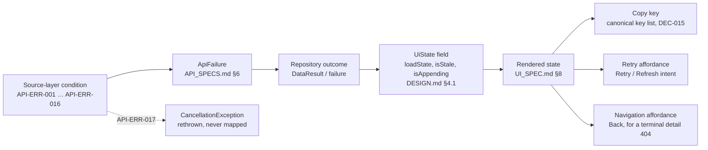

# ERROR_FLOW.md - Failure to State to Copy Chain

- **Status:** Active - target state (DEC-046; the Gradle/KMP build skeleton exists as of TASK-014, no error path is implemented yet, see `AGENTS.md` §1)
- **Last verified:** 2026-10-05
- **Owner:** System Architect (see `AGENTS.md` §3.3)
- **Authoritative for:** the canonical chain from a remote/transport failure to a domain failure (`ApiFailure`), to a UI-state field, to an on-screen state, to the copy key and the retry affordance. This is the only place where that chain is stated (DEC-021).
- **Inputs:** [`REQUIREMENTS.md`](REQUIREMENTS.md) · [`API_SPECS.md`](API_SPECS.md) §6, §7, §8 · [`DESIGN.md`](DESIGN.md) §4, §7 · [`UI_SPEC.md`](UI_SPEC.md) §8 · [`DECISION_BOARD.md`](DECISION_BOARD.md) · [`TESTING.md`](TESTING.md) · [`OBSERVABILITY.md`](OBSERVABILITY.md) · [`SECURITY.md`](SECURITY.md)
- **Normative terms:** `MUST` mandatory · `SHOULD` strong recommendation · `MAY` optional.

> No failure-to-state-to-copy statement may be defined in another document. `DESIGN.md` §7 keeps the type contracts only, `UI_SPEC.md` §8 keeps the visuals only (DEC-021). This file references copy strings; it never owns them.

## 1. Scope and ownership

### 1.1 Owned here

| Owned | Detail |
| --- | --- |
| Source-layer error taxonomy | `API-ERR-###` identifiers for every condition that can fail a request, with retryability (§2). |
| Failure mapping | `ApiFailure` ([`API_SPECS.md`](API_SPECS.md) §6) to `LoadState` (`IC-015`) or a `UiState` field ([`CONTRACTS.md`](CONTRACTS.md) `IC-018`…`IC-023`) to rendered state (§4). |
| Copy binding | Which canonical copy key each rendered state uses (§4, §9). The key names are registered once in the canonical key list, `CopyKeys` in `:core:presentation` (`CONTRACTS.md` `IC-017`, DEC-015, DEC-020); the English and Spanish values are authored in each platform's resource files and held identical per locale by `TEST-UNIT-036` (`DEC-095`); the rendered form of each state is specified in [`UI_SPEC.md`](UI_SPEC.md) §8. This file binds state to key and never redefines either. |
| Retry affordances and recovery actions | Per failure class, including the fresh-attempt-budget rule (§10). |
| Non-error outcomes | Filtered `404`, paging `404`, GraphQL empty results, unknown field values (§5). |
| Cancellation policy | `CancellationException` handling (§6). |
| Enrichment and refresh failure policy | §7, §8. |
| Failure logging and redaction | Which fields each failure may log (§11). |

### 1.2 Delegated elsewhere - reference, never restate

| Topic | Owner |
| --- | --- |
| `ApiFailure` sealed interface, `DataResult`, retry policy (attempt count, backoff, jitter), timeout values, cache policy | [`API_SPECS.md`](API_SPECS.md) §3, §6.3, §7 |
| `LoadState`, `CharacterListUiState`, `CharacterDetailUiState`, `FavoritesUiState`, `SettingsUiState` and their intents | [`CONTRACTS.md`](CONTRACTS.md) `IC-015` (cross-feature primitive in `:core:presentation`), `IC-018`/`IC-019` (`:feature:discovery`, `:feature:character-detail`), `IC-020` (`:feature:favorites`), `IC-023` (`:feature:settings`); ownership map in `CONTRACTS.md` §3, read with DEC-052/DEC-015. |
| Remote conditions and their REST/GraphQL mapping rules | [`API_SPECS.md`](API_SPECS.md) §6.1, §6.2 |
| Visual layout, component choice and platform treatment of the states | [`UI_SPEC.md`](UI_SPEC.md) §8 |
| English/Spanish strings and the canonical key list | canonical key list in `:core:presentation` (DEC-015, DEC-020); rendered form per [`UI_SPEC.md`](UI_SPEC.md) §8 |
| Requirement and acceptance-criteria wording | [`REQUIREMENTS.md`](REQUIREMENTS.md) §5.2 |
| Test identifiers, layers and tooling | [`TESTING.md`](TESTING.md) |
| Log field allow-list, redaction mechanics, debug diagnostics | [`OBSERVABILITY.md`](OBSERVABILITY.md) |
| Persisted-field classification and threat model | [`SECURITY.md`](SECURITY.md) |

## 2. Source-layer error taxonomy

Every condition below is a *source-layer* condition: it is detected in `:core:data`, mapped there to an `ApiFailure`, and never propagated upward as a raw exception (`AGENTS.md` §8). The mapping rules and the retry policy quoted in the `Automatic retry` column are owned by [`API_SPECS.md`](API_SPECS.md) §6.

| ID | Source layer | Condition | Maps to `ApiFailure` | Automatic retry | Verification | Cross-reference |
| --- | --- | --- | --- | --- | --- | --- |
| `API-ERR-001` | Transport | Connectivity, DNS or socket failure (no route, connection refused, reset before response) | `Offline`; `Unknown` when the cause cannot be classified | Yes while the failure is transient inside an attempt; a persistent offline condition is recovered by a user-initiated retry | `TEST-UNIT-010` (mapping), `TEST-UI-011` (no-network first launch) | `API_SPECS.md` §6.1 |
| `API-ERR-002` | Transport | Connect timeout (10 s), read timeout (15 s) or total call timeout (20 s) | `Timeout` | Yes, bounded (at most three attempts in total: the original plus two retries, backoff with jitter; `DEC-084`) | `TEST-UNIT-010`, `TEST-CONTRACT-001` | `API_SPECS.md` §6.1, §6.3 |
| `API-ERR-003` | Transport | TLS handshake or certificate failure | `Unknown` | No automatic retry | `TEST-UNIT-010` | `API_SPECS.md` §6.1 |
| `API-ERR-004` | HTTP | `408 Request Timeout` | `Timeout` | Yes, bounded | `TEST-UNIT-010`, `TEST-CONTRACT-001` | `API_SPECS.md` §6.1 |
| `API-ERR-005` | HTTP | `429 Too Many Requests` | `RateLimited(retryAfterSeconds)` | Only after `Retry-After`, when present | `TEST-UNIT-010`, `TEST-UNIT-022` | `API_SPECS.md` §6.1, §6.3 |
| `API-ERR-006` | HTTP | Any other `4xx` (`400`, `401`, `403`, `405`, `409`, `422`, …), excluding `404`, `408`, `429` | `InvalidRequest(detail)` | No automatic retry; user-initiated retry is permitted | `TEST-UNIT-010`, `TEST-UNIT-022` (single attempt) | `API_SPECS.md` §6.1 |
| `API-ERR-007` | HTTP | `5xx` server error | `Server(statusCode)` | Yes, bounded | `TEST-UNIT-010`, `TEST-CONTRACT-001` | `API_SPECS.md` §6.1 |
| `API-ERR-008` | Payload | `2xx` with an empty body | `EmptyBody` | No automatic retry | `TEST-UNIT-010` | `API_SPECS.md` §6.1 |
| `API-ERR-009` | Payload | Malformed JSON or a schema/decoding mismatch | `MalformedResponse` | No | `TEST-UNIT-010`, `TEST-CONTRACT-003` | `API_SPECS.md` §6.1, `REQ-NFR-004` |
| `API-ERR-010` | GraphQL | Errors-only envelope: HTTP success with `data == null` and non-empty `errors` | `GraphQl(codes, messages)` | No | `TEST-UNIT-010`, `TEST-CONTRACT-003` | `API_SPECS.md` §6.2 step 3 |
| `API-ERR-011` | GraphQL | Partial data plus `errors`, where every field the screen requires is valid | No failure: the data is returned with `ApiWarning` entries; never cached | No | `TEST-UNIT-010`, `TEST-CONTRACT-003`, `TEST-INT-001` (never cached) | `API_SPECS.md` §6.2 step 5 |
| `API-ERR-012` | GraphQL | Validation rejection: HTTP `400` with extension code `GRAPHQL_VALIDATION_FAILED` | `InvalidRequest`; `GraphQl` when the envelope carries the code set | No | `TEST-UNIT-010`, `TEST-CONTRACT-003` | `API_SPECS.md` §6.2 |
| `API-ERR-013` | GraphQL | Query-depth rejection: HTTP `413` with extension code `GCDN_QUERY_DEPTH_LIMIT` (and any future depth/validation rejection) | `InvalidRequest` | No | `TEST-UNIT-010`, `TEST-CONTRACT-003` | `API_SPECS.md` §6.2 |
| `API-ERR-014` | HTTP | `404` on a filtered list request that is the first page of a new filter | Not a failure: success with an empty page | n/a | `TEST-UNIT-005`, `TEST-UI-009` | `API-CHAR-005`, §5.1 |
| `API-ERR-015` | HTTP | `404` on a paging request reached through a valid paging sequence after a page that returned results | Not a failure: end of pagination | n/a | `TEST-UNIT-010` (not mapped as a failure), `TEST-UNIT-001` (pagination stops) | §5.2 |
| `API-ERR-016` | HTTP | `404` on a detail request | `NotFound(resource, id)` | No | `TEST-UNIT-010`, `TEST-UI-002` | `API_SPECS.md` §6.1 |
| `API-ERR-017` | Kotlin | `CancellationException` from any suspending call | Not mapped: rethrown | n/a | `TEST-UNIT-010` (absent from the failure matrix), `TEST-UNIT-016`, `TEST-UNIT-003` | §6 |

Classification notes:

- `API-ERR-001` and `API-ERR-003` both land on `Unknown`/`Offline`; the distinction is the *recovery action* (§10), so the data layer `SHOULD` keep the cause in `ApiFailure.Unknown(cause)` and `MUST NOT` derive user copy from it.
- `API-ERR-012`/`API-ERR-013` are coded against the envelope shape and the HTTP status family, not against the extension strings, because the service may use other strings ([`API_SPECS.md`](API_SPECS.md) §6.2).
- GraphQL rows (`API-ERR-010`…`013`) apply only when a GraphQL adapter is selected; `ApiFailure.GraphQl` exists regardless, and the REST adapter never produces it.
- The `API-ERR-###` identifiers are declared here. The remote conditions and their mapping remain owned by [`API_SPECS.md`](API_SPECS.md) §6; that section SHOULD mirror these identifiers when it is next edited (owner: API Architect). Until then the identifiers are used by [`REQUIREMENTS.md`](REQUIREMENTS.md) and [`TESTING.md`](TESTING.md) and are not yet present in `API_SPECS.md`; that is a documentation gap, not a contract change.
- Unresolved provenance: `API-CHAR-005` is cited by [`REQUIREMENTS.md`](REQUIREMENTS.md) §5.1 (`REQ-FUNC-010`) as the contract id for "filtered list `404` maps to an empty page", but it is not yet declared in [`API_SPECS.md`](API_SPECS.md). This file keeps the citation so the two requirements documents remain consistent; the id MUST be declared in `API_SPECS.md` §4.4/§6.1 (owner: API Architect), or the citation removed from both places, before implementation starts. Recorded as a documentation gap.

## 3. Mapping chain

Chain invariants:

1. A source-layer exception `MUST` be converted to an `ApiFailure` inside `:core:data`; no platform exception type reaches a feature `presentation` package or a view.
2. A rendered error state `MUST` be reachable from a `LoadState.Error` or from `isStale = true` on a `Content` state; there is no third path ([`CONTRACTS.md`](CONTRACTS.md) `IC-018` precedence).
3. Copy `MUST` be selected by the key in §4, resolved from localisable resources; no view builds an error message from a failure field (`REQ-FUNC-013`, `REQ-UX-008`).
4. A retry affordance `MUST` dispatch the intent named in §4; a view `MUST NOT` call the repository directly (`DESIGN.md` §1).

## 4. Full mapping table

`ApiFailure` members are exhaustive from [`API_SPECS.md`](API_SPECS.md) §6. "Cached content" means a previously decoded successful value for the same cache key exists and is inside the 30-day offline window ([`API_SPECS.md`](API_SPECS.md) §7.3).

| `ApiFailure` | With cached content | Without cached content | Retryable | Copy key (registered in `CopyKeys`, `IC-017`) and approved string (authored in the platform resources, DEC-020/`DEC-095`; rendered form in `UI_SPEC.md` §8) | Retry affordance | Test coverage |
| --- | --- | --- | --- | --- | --- | --- |
| `Offline` | `Content` + `isStale = true` + stale banner | `Error` full-surface state | Automatic while transient; otherwise user-initiated | Banner: `state_stale_banner` = "Showing saved results" · Error: `error_title` = "Portal link lost", `error_message_offline`, `action_retry` = "Retry" | Banner Retry · error Retry (`CharacterListIntent.Retry`, `CharacterDetailIntent.Retry`) | `TEST-UNIT-010`, `TEST-UNIT-009`, `TEST-INT-001`, `TEST-UI-011` |
| `Timeout` | `Content` + `isStale = true` + stale banner | `Error` full-surface state | Yes, bounded automatic | Banner: `state_stale_banner` = "Showing saved results" · Error: `error_title` = "Portal link lost", `error_message_timeout`, `action_retry` = "Retry" | Banner Retry · error Retry | `TEST-UNIT-010`, `TEST-CONTRACT-001` |
| `NotFound` on a detail request | Keep the pre-filled `header`, inline error in place of the info list | `Error` state with Back, no Retry | No | `error_message_not_found`, `detail_error_inline`, `action_back` | Back navigation | `TEST-UNIT-002`, `TEST-UI-002` |
| `InvalidRequest` (includes `API-ERR-006`, `API-ERR-012`, `API-ERR-013`) | Keep content, non-blocking error | `Error` full-surface state | No automatic; user-initiated Retry permitted | `error_message_invalid_request`, `action_retry` = "Retry" | Error Retry (fresh budget, §10) | `TEST-UNIT-010`, `TEST-CONTRACT-001`, `TEST-CONTRACT-003` |
| `RateLimited(retryAfterSeconds)` | Keep content; automatic retry after `Retry-After` | `Error` full-surface state with the countdown inside the message | Only after `Retry-After`, when present | `error_message_rate_limited` (parameterised with the countdown), or `error_message_rate_limited_no_countdown` when no usable `Retry-After` was advised (`DEC-123`); `action_retry` = "Retry" | Error Retry (enabled at once; the automatic attempt waits `Retry-After`) | `TEST-UNIT-010`, `TEST-UNIT-022` |
| `Server(statusCode)` | Keep content, non-blocking error | `Error` full-surface state | Yes, bounded automatic | `error_message_server`, `action_retry` = "Retry" | Error Retry | `TEST-UNIT-010`, `TEST-CONTRACT-001` |
| `GraphQl(codes, messages)` | Keep content, non-blocking error | `Error` full-surface state | No automatic | `error_message_graphql`, `action_retry` = "Retry" | Error Retry | `TEST-UNIT-010`, `TEST-CONTRACT-003` |
| `MalformedResponse` | Keep content, non-blocking error | `Error` full-surface state | No | `error_message_malformed`, `action_retry` = "Retry" | Error Retry | `TEST-UNIT-010`, `TEST-CONTRACT-003` |
| `EmptyBody` | Keep content, non-blocking error | `Error` full-surface state | No | `error_message_empty_body`, `action_retry` = "Retry" | Error Retry | `TEST-UNIT-010`, `TEST-CONTRACT-001` |
| `Unknown(cause)` | Keep content, non-blocking error | `Error` full-surface state | No automatic (TLS is terminal); automatic while transient when the cause is a transport failure | `error_message_unknown`, `action_retry` = "Retry" | Error Retry | `TEST-UNIT-010`, `TEST-CONTRACT-001` |

Rendered-state mapping ([`UI_SPEC.md`](UI_SPEC.md) §8 keeps the visuals):

| This file | `UI_SPEC.md` §8 state | Surface | Verification |
| --- | --- | --- | --- |
| Stale banner over `Content` | "Stale / offline with cache" | List and detail: content stays visible; snackbar (Android) / bottom glass banner (iOS) | `TEST-UNIT-009`, `TEST-INT-001`; rendered by `TEST-UI-016` |
| Full-surface `Error` with Retry | "Offline / error (no cache)" | List: portal mark + title + message + Retry | `TEST-UNIT-010`, `TEST-UI-011`; rendered by `TEST-UI-016` |
| Inline error with Retry, header retained | "Detail load failure" | Detail: replaces the info list only | `TEST-UNIT-002`, `TEST-UI-002` |
| `LoadState.Empty` | "Empty search" | List: see §5.1 | `TEST-UNIT-005`, `TEST-UI-009` |
| `LoadState.Loading`, `isAppending` | "Initial loading", "Paging" | List: skeleton cards, contained loading indicator | Rendered by `TEST-UI-016`; the pager transitions that produce `Loading`/`isAppending` are covered by `TEST-UNIT-016` |

"Non-blocking error" in the table means: the previously rendered content stays and the failure is surfaced alongside it; the exact affordance is owned by [`UI_SPEC.md`](UI_SPEC.md) §8. On the list surface the failure travels as `IC-018.contentFailure` and is rendered by the same banner as the stale state — its class-specific message from §4.1 and a Retry that re-attempts the failed load: the failed page for an append, a refresh for a refresh, never discarding loaded pages (§10 rule 4, `DEC-124`).

### 4.1 Copy key register

The key names below are the canonical binding owned by this file, and every one of them is registered in `CopyKeys` (`IC-017`, `TASK-041`); the English and Spanish strings are authored in the platform resource files — never in Kotlin — and the parity test of DEC-020 (`TEST-UNIT-036`) holds the two platforms identical per locale (`DEC-095`). They are rendered per [`UI_SPEC.md`](UI_SPEC.md) §8.

| Key | Source of the string | Status |
| --- | --- | --- |
| `error_title` | [`UI_SPEC.md`](UI_SPEC.md) §8: "Portal link lost" | Fixed |
| `action_retry` | [`UI_SPEC.md`](UI_SPEC.md) §8: "Retry" | Fixed |
| `state_stale_banner` | [`UI_SPEC.md`](UI_SPEC.md) §8: "Showing saved results" | Fixed |
| `empty_search_message` | [`UI_SPEC.md`](UI_SPEC.md) §8: "No one in this dimension matches “query”" | Fixed; `query` is substituted from the active filter |
| `action_clear_filters` | [`UI_SPEC.md`](UI_SPEC.md) §8: "Clear filters" | Fixed |
| `action_back` | Platform navigation affordance | Fixed at the key level; the label is the platform back control |
| `error_message_offline` | [`UI_SPEC.md`](UI_SPEC.md) §8: "You're offline. Reconnect to continue exploring the multiverse." | Fixed |
| `error_message_timeout` | [`UI_SPEC.md`](UI_SPEC.md) §8: "The portal took too long to answer. Give it another try." | Fixed |
| `error_message_not_found` | [`UI_SPEC.md`](UI_SPEC.md) §8: "That character isn't in this dimension." | Fixed |
| `error_message_invalid_request` | [`UI_SPEC.md`](UI_SPEC.md) §8: "That request doesn't fit this dimension. Adjust it and try again." | Fixed |
| `error_message_rate_limited` | [`UI_SPEC.md`](UI_SPEC.md) §8: "Too many jumps. Try again in %d s." (number substituted by the countdown formatter, `IC-017`) | Fixed |
| `error_message_rate_limited_no_countdown` | [`UI_SPEC.md`](UI_SPEC.md) §8: "Too many jumps. Try again shortly." — the rate-limit message when no usable `Retry-After` was advised, so no placeholder is left unfilled (`DEC-123`) | Fixed; Spanish value approved by the owner 2026-10-05 (`LOG-0135`) |
| `error_message_server` | [`UI_SPEC.md`](UI_SPEC.md) §8: "The portal is glitching on its side. Try again shortly." | Fixed |
| `error_message_graphql` | [`UI_SPEC.md`](UI_SPEC.md) §8: "The portal didn't understand that request. Try again." | Fixed |
| `error_message_malformed` | [`UI_SPEC.md`](UI_SPEC.md) §8: "The portal sent back something unreadable. Try again." | Fixed |
| `error_message_empty_body` | [`UI_SPEC.md`](UI_SPEC.md) §8: "The portal answered with nothing. Try again." | Fixed |
| `error_message_unknown` | [`UI_SPEC.md`](UI_SPEC.md) §8: "Something went wrong on the way to this dimension. Try again." | Fixed |
| `detail_error_inline` | [`UI_SPEC.md`](UI_SPEC.md) §8: "Couldn't load these details. Retry." | Fixed |

Rules for this register:

- A key `MUST` exist in every shipped locale before the state that uses it renders; a missing key fails the copy parity test (`AC-REQ-FUNC-013-1`, `AC-REQ-UX-008-1`).
- This file `MUST NOT` gain a second English string table: strings are quoted, never authored, here.
- The countdown in `error_message_rate_limited` is formatted by a `:core:presentation` formatter (DEC-015), so both platforms render the same number. **Delivered by `TASK-022`:** `IC-017.rateLimitCountdown` is the one formatter, `FailureMessage` carries the number as an argument of the key rather than as interpolated text, and a missing or negative `Retry-After` yields no countdown at all instead of an invented zero (`GAP-027`). **Typed since `DEC-123`:** the countdown is a `MessageArgument.Number` that each platform passes to its own resource formatter as a number, and without a countdown the message is `error_message_rate_limited_no_countdown`, which has no placeholder — a template is never rendered with a specifier left in it.

## 5. Non-error outcomes

### 5.1 Filtered `404` is an empty state

`API-ERR-014`: the first page of a filtered list (`name` and/or `status` sent) that returns `404` `MUST` map to `LoadState.Empty`, never to `LoadState.Error` (`API-CHAR-005`, `AC-REQ-FUNC-010-1`).

- Copy: `empty_search_message` ("No one in this dimension matches “query”") and `action_clear_filters` ("Clear filters"). The active query is substituted into the message.
- `Clear filters` restores the unfiltered first page (`AC-REQ-FUNC-010-2`).
- The `404` response `MUST NOT` be stored: the network interceptor replaces its cache headers with `Cache-Control: no-store` before storage is evaluated ([`API_SPECS.md`](API_SPECS.md) §7.1, `RISK-005`).
- An unfiltered first page cannot produce this outcome: the API always returns characters for it.

### 5.2 Paging `404` is end of pagination

`API-ERR-015`: a `404` returned for a request issued through a valid paging sequence, after a page that returned results, `MUST` be treated as the end of pagination — the remote adapter reports it as `NotFound` and the pager (`IC-014`), which knows the sequence, turns it into the end: stop requesting, keep the loaded items, clear `isAppending`, and surface no error ([`API_SPECS.md`](API_SPECS.md) §4.3, §6.1).

A `404` on the first page of an *unfiltered* list is not a valid outcome and maps to `NotFound` → the full-surface error state.

### 5.3 GraphQL empty result

`API_SPECS.md` §5.3: an empty `results` list with nullable `info` fields is a successful empty page. It maps to `LoadState.Empty`, and previously known totals `MUST NOT` be overwritten with `null` or `0` ([`API_SPECS.md`](API_SPECS.md) §5.3).

### 5.4 Unmapped field values

An unknown `status`/`gender` string maps to `CharacterStatus.Unsupported`/`CharacterGender.Unsupported` and renders as its raw value plus the "Unknown" treatment where the design specifies one; it is never an error (`REQ-NFR-004`).

## 6. Cancellation

`API-ERR-017`: `CancellationException` is control flow, not a failure.

- The data layer `MUST` rethrow it unchanged ([`API_SPECS.md`](API_SPECS.md) §6).
- It `MUST NOT` be mapped to `ApiFailure`, `MUST NOT` set `LoadState.Error`, `MUST NOT` produce copy, `MUST NOT` be logged as an error, and `MUST NOT` be surfaced to the user (`AC-REQ-FUNC-022-2`).
- Obsolete work (a superseded search query, a closed detail screen) stops silently; the superseding state is what the user sees (`AC-REQ-FUNC-003-2`).
- Because cancellation is not a failure, `ApiFailure.Unknown` `MUST NOT` ever wrap a `CancellationException`.

## 7. Enrichment failure policy

Applies to `GetCharacterDetails(id, enrich = true)` and the bounded episode batch ([`API_SPECS.md`](API_SPECS.md) §4.6, §8; `REQ-FUNC-023`).

| Situation | Required behaviour | Verification |
| --- | --- | --- |
| Detail request succeeds, episode batch fails | Render the detail screen with everything the detail response supplies. `episodeCount` still renders from `episodeIds.size`. The "First seen in" row is absent because `episodeSummaries == null` (`AC-REQ-FUNC-023-2`). The screen `MUST NOT` blank, `MUST NOT` show a full-surface error, and `MUST NOT` show a placeholder row. | `TEST-UNIT-011`, `TEST-UI-002` |
| Detail request succeeds, episode batch returns fewer resources than requested | Keep the returned summaries, order them by the caller's episode order, and record the missing IDs as `ApiWarning` entries ([`API_SPECS.md`](API_SPECS.md) §6.1). | `TEST-CONTRACT-002` |
| Detail request fails, list data available | Keep the pre-filled `header` (name, image, status) and show the inline retry in place of the info list (`AC-REQ-FUNC-002-3`, §4). | `TEST-UNIT-002`, `TEST-UI-002` |
| Enrichment failed | The resulting detail value is partial and `MUST NOT` be written to the app-level cache, because a cached partial detail would permanently hide the enriched rows (`REQ-FUNC-020-3`, DEC-018). | `TEST-UNIT-009`, `TEST-INT-001` |
| Enrichment not requested | `enrich = false` leaves `episodeSummaries == null`; the dependent rows stay hidden (`REQ-FUNC-023`). The detail response itself remains cacheable. | `TEST-UNIT-011` |

## 8. Refresh failure policy

`CharacterListIntent.Refresh` is network-first ([`API_SPECS.md`](API_SPECS.md) §7.3).

- A refresh always performs a network request, even when the cache is fresh (`AC-REQ-FUNC-012-1`).
- A failed refresh keeps the previously displayed items and does not replace them with an error surface (`AC-REQ-FUNC-012-2`).
- `isStale` reports where the retained items came from, as the results reported it (`IC-003`, `IC-014`): items served stale from a cache keep `isStale = true`, and a failed refresh neither sets nor clears it. Content that came from the network, or from a cache entry inside its fresh window, is not marked stale merely because a refresh failed; the failure itself is surfaced through the non-blocking error for its class in §4 (`CONF-71`).
- A successful refresh replaces the content, sets `isStale = false`, clears the transient failure, and starts pagination from the refreshed first page.

## 9. Stale and offline rendering with cache

- `isStale = true` means "the rendered value came from the cache and the freshness window has passed" ([`API_SPECS.md`](API_SPECS.md) §3, §7.3). It is set by the data layer, never by a view.
- The stale banner binds `state_stale_banner` ("Showing saved results") and carries the Retry action; per [`UI_SPEC.md`](UI_SPEC.md) §8 it is a snackbar on Android and a bottom glass banner on iOS. With no failure to re-attempt, that Retry revalidates page 1 over the network (`refresh()`, `ForceNetwork`), so the banner's action always reaches the network rather than doing nothing; while that refresh is in flight the banner is withheld (`IC-018.isRefreshing`, `DEC-124`).
- Stale content is still content: it renders the full grid or detail, never the error surface, while the entry is inside the 30-day offline window.
- Outside the 30-day window the entry is not usable and the state degrades to the class-specific error for the failure that prevented revalidation.
- An offline detail screen with a cached entry renders and shows the same banner; the header still comes from the list data for an immediate transition.

## 10. Recovery actions and the retry budget

| Failure class | Automatic attempts | Recovery action | Verification | Notes |
| --- | --- | --- | --- | --- |
| `API-ERR-001` transport, `API-ERR-002` timeout, `API-ERR-004` `408`, `API-ERR-007` `5xx` | Up to two retries after the original attempt — at most three attempts in total (`DEC-084`) — with exponential backoff and jitter (≈500 ms, ≈1,500 ms) | Retry in the error state, or the next lifecycle-driven load | `TEST-UNIT-022`, `TEST-UNIT-010` | [`API_SPECS.md`](API_SPECS.md) §6.3 |
| `API-ERR-005` `429` | At most one, and only after `Retry-After` when the header is present | Retry; the message carries the countdown | `TEST-UNIT-022`, `TEST-UNIT-010` | No numeric quota may be assumed ([`API_SPECS.md`](API_SPECS.md) §9) |
| `API-ERR-003` TLS, `API-ERR-006` other `4xx`, `API-ERR-008` empty body, `API-ERR-009` malformed, `API-ERR-010`/`012`/`013` GraphQL | None | Retry in the error state, or Back on the detail surface | `TEST-UNIT-022`, `TEST-UNIT-010` | A retry of an invalid request is a fresh user-visible attempt; it is not expected to succeed without a code or data change |
| `API-ERR-016` detail `404` | None | Back navigation | `TEST-UNIT-010`, `TEST-UI-002` | Terminal for that identifier |
| `API-ERR-014`, `API-ERR-015` | n/a | Clear filters; no retry | `TEST-UNIT-005`, `TEST-UI-009` | §5 |
| `API-ERR-017` | n/a | None | `TEST-UNIT-010`, `TEST-UNIT-016` | §6 |

Rules:

1. A user-initiated retry (`CharacterListIntent.Retry`, `CharacterDetailIntent.Retry`) starts a **fresh attempt budget**: the original attempt plus the two automatic retries are available again for the new user-visible attempt (`REQ-FUNC-011`, `API_SPECS.md` §6.3, `DEC-084`).
2. Retry `MUST` clear `LoadState.Error` on success and `MUST` preserve the active filter and the page position on the list surface.
3. An automatic retry `MUST NOT` be triggered by schema, validation, decoding or cancellation outcomes (`REQ-REL-003`, `AC-REQ-REL-003-1`).
4. A retry of a paging request `MUST NOT` discard already loaded pages; a retry of the first page `MUST` use the same canonical cache key.
5. Concurrent identical requests `MUST` be deduplicated, so a user Retry pressed while an attempt is in flight does not create a second network call (`REQ-REL-002`, [`API_SPECS.md`](API_SPECS.md) §8).

## 11. Failure logging and redaction

`OBSERVABILITY.md` owns the log contract; the allow-list is `REQ-OBS-001`. Release builds log errors only and redact strictly (DEC-039, `REQ-SEC-005`).

| Failure class | MAY be logged | MUST NOT be logged | Verification |
| --- | --- | --- | --- |
| All (`API-ERR-001`…`016`) | Protocol, path template (`/character`, `/character/{id}`), page number, filter *names* (`name`, `status`) and whether each is present, status family (`4xx`, `5xx`), mapped `ApiFailure` type, cache source, duration, correlation id, attempt number | Search text (the value of `name`), full request URLs (their query string embeds the search text), request or response bodies, image bytes, `RestErrorDto.error` text, GraphQL `errors[].message`, credentials, device identifiers | The logging test referenced by `AC-REQ-SEC-005-1` in [`TESTING.md`](TESTING.md) |
| `API-ERR-005` | Status family and whether `Retry-After` was present and its parsed value | The raw header dump | Same logging test, extended to the `429` path |
| `API-ERR-009`, `API-ERR-010`…`013` | Status family and GraphQL extension codes (`GRAPHQL_VALIDATION_FAILED`, `GCDN_QUERY_DEPTH_LIMIT`) | Server-supplied messages, the offending query document, variable values (they contain the search text) | `TEST-UNIT-010` with the GraphQL fixtures of [`TESTING.md`](TESTING.md) §4.3 |
| `API-ERR-017` | Nothing at error level; a debug-only cancellation counter is permitted | Error-level entries, stack traces | `TEST-UNIT-016` (cancellation assertions) |

Additional rules:

- Debug builds MAY log a sanitised throwable (`cause::class` type name) and MAY expose the last failure through the debug-only diagnostic surface, which is absent from release builds (`REQ-OBS-002`).
- Release builds `MUST NOT` log stack traces (`REQ-SEC-005`); no crash or analytics SDK exists to receive them (`REQ-OBS-003`, DEC-038).
- The correlation id `MUST` be generated by the app and `MUST NOT` be derived from user input.
- A test `MUST` assert that a query string never reaches a log sink (`AC-REQ-SEC-005-1`).

## 12. Acceptance criteria

| `AC` | Criterion | Coverage |
| --- | --- | --- |
| `AC-REQ-FUNC-022-1` | Offline, timeout, server, malformed, rate-limited, not-found and invalid-request conditions each render their specified state | Every row of §4; `TEST-UNIT-010` |
| `AC-REQ-FUNC-022-2` | `CancellationException` is never surfaced | §6; `TEST-UNIT-010` (cancellation is absent from the failure matrix), `TEST-UNIT-003`, `TEST-UNIT-016` |
| `AC-REQ-FUNC-010-1` | Filtered REST `404` maps to the empty state | §5.1; `TEST-UNIT-005`, `TEST-UI-009` |
| `AC-REQ-FUNC-002-3` | Detail failure with cached list data keeps the known fields and shows an inline retry | §4, §7; `TEST-UNIT-002`, `TEST-UI-002` |
| `AC-REQ-FUNC-011-1` | Retry issues a new request and clears the error on success | §10; `TEST-UNIT-006` |
| `AC-REQ-FUNC-012-2` | A failed refresh keeps the previously displayed items | §8; `TEST-UNIT-007` |
| `AC-REQ-FUNC-020-2` | Offline with a cached entry shows content plus a stale indicator | §9; `TEST-UNIT-009`, `TEST-INT-001` |
| `AC-REQ-FUNC-020-3` | Errors, empty bodies and partial GraphQL responses are never cached | §7; `TEST-INT-001` |
| `AC-REQ-FUNC-023-2` | With `episodeSummaries == null` the dependent row is absent and the episode count still renders | §7; `TEST-UNIT-011`, `TEST-CONTRACT-002` |
| `AC-REQ-NFR-004-1` | Malformed JSON maps to a designed error state, never a crash | §2, §4; `TEST-CONTRACT-003` |
| `AC-REQ-REL-003-1` | A `4xx` and a decode failure each produce exactly one attempt | §10; `TEST-UNIT-010` |
| `AC-REQ-SEC-005-1` | A query string never reaches a log sink | §11; logging test from `TESTING.md` |
| `AC-REQ-UX-009-1` | Each state in this file corresponds to a rendered state covered by a snapshot test | `TEST-UI-016` is the single id covering every state below; the states are listed here so a new §4 row cannot be added without extending it: initial loading (list), paging indicator (list), empty search (list), offline/error without cache (list), stale banner over content (list), detail load failure with the header retained (detail), detail load failure without cached data (detail). `TEST-UI-011` additionally covers the first launch with no network, and `TEST-UI-002` covers the detail inline retry. |
| `AC-REQ-FUNC-013-1`, `AC-REQ-UX-008-1` | Every copy key exists in both locales and both platforms | §4.1 |

Row coverage rule: adding a row to §2 or §4 without a `TEST-UNIT-*`/`TEST-UI-*` identifier in the same change leaves the row uncovered and the change incomplete (`REQ-NFR-005`, `AGENTS.md` §11). Test identifiers are defined in [`TESTING.md`](TESTING.md); this file references them and never renumbers them (`TEST-UNIT-010` is the failure-mapping test, `TEST-UI-016` is the state-snapshot test).

A test identifier is never cited here as evidence for copy wording. The failure-to-state-to-copy chain is owned by this file (DEC-021) and the strings come from the canonical key list (DEC-015, DEC-020); a snapshot pins rendering, not wording.

## 13. Change log

| Date | Change | Decision |
| --- | --- | --- |
| 2026-09-29 | Created: source-layer error taxonomy with `API-ERR-###` ids, the mapping chain, the full `ApiFailure`→state→copy→retry table, non-error outcomes, cancellation, enrichment/refresh/stale behaviour, recovery and retry-budget rules, failure logging and acceptance coverage. | DEC-021, DEC-022, DEC-015, DEC-020 |
| 2026-09-29 | Module references updated to the feature-per-module layout: `:shared:data` → `:core:data`, `:shared:presentation` → `:core:presentation` (DEC-052, supersedes DEC-019). A `Verification` column was added to every table so each row names the test that covers it (§2, §4 rendered-state mapping, §7, §10, §11), and the copy-wording evidence rule was added. Test coverage corrected to the authoritative `TESTING.md` identifiers (`TEST-UI-011`, `TEST-UI-016`, `TEST-UNIT-022`); `API-CHAR-005` provenance recorded as an open gap. | DEC-052, DEC-021 |
| 2026-10-03 | `TASK-022` delivered the failure chain: `IC-017` gains `failureMessage`, `failureTitle`, `retryAction` and `isAutomaticallyRetryable`, and the rate-limit countdown closes `GAP-027` — the number travels as an argument of `error_message_rate_limited`, so both platforms substitute the same value from their own resource file. The §4 matrix is driven fixture by fixture through the real REST adapter. | `TASK-022`, `GAP-027`, `REQ-FUNC-022`, `DEC-015` |
| 2026-10-03 | §1 and §4.1 state where the copy lives: the key names in `CopyKeys` (`IC-017`), the English and Spanish strings in the platform resource files, held identical by `TEST-UNIT-036`; the earlier wording gave the strings to the key list (`CONF-75`). | `DEC-095`, `TASK-041` |
| 2026-10-05 | §4 and §4.1: the rate-limit message without usable advice is its own key, `error_message_rate_limited_no_countdown`, and the countdown argument is typed (`IC-017`). Android had crashed formatting `%d` with a `String`; iOS rendered a pointer value or a raw `%1$ld`. | `DEC-123`, `TASK-111` |
| 2026-10-05 | §4 and §9: the list surface carries a failure beside displayable content as `IC-018.contentFailure`, rendered by the stale banner's component with its own message and Retry; a Retry over stale content with no failure revalidates over the network. | `DEC-124`, `TASK-111` |
