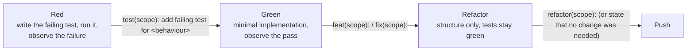

# GUIDELINES.md — Engineering Guidelines

- **Status:** Active — the Gradle/KMP build skeleton exists (TASK-014); every code rule below describes the code that will be written, not code that exists yet
- **Last verified:** 2026-10-02
- **Owner:** Implementation Engineer (see `../AGENTS.md` §3.5)
- **Authoritative for:** the coding rules for Kotlin, Compose and SwiftUI, the source-set and presentation rules a change must apply inside the module layout owned by [`adr/0001-module-boundaries.md`](adr/0001-module-boundaries.md), repository naming and identifier conventions, and — for every rule — the artefact that enforces it. Not for the contribution process (`CONTRIBUTING.md`), the gates (`DEFINITION.md`), the test strategy (`TESTING.md`), the architecture rationale and module graph (`DESIGN.md` §1/§3.4, `adr/`), the interface invariants (`CONTRACTS.md`), the remote contract (`API_SPECS.md`), the visual specification (`UI_SPEC.md`), the failure-to-copy chain (`ERROR_FLOW.md`), the logging contract (`OBSERVABILITY.md`) or security policy (`SECURITY.md`).
- **Inputs:** `../assessment.md`; `REQUIREMENTS.md`; `API_SPECS.md`; `DESIGN.md`; `CONTRACTS.md`; `UI_SPEC.md`; `ERROR_FLOW.md`; `OBSERVABILITY.md`; `SECURITY.md`; `TESTING.md`; `DEFINITION.md`; `CONTRIBUTING.md`; `adr/0001-module-boundaries.md`…`adr/0009-pagination-strategy.md`; `DECISION_BOARD.md` (`DEC-008`, `DEC-010`, `DEC-011`, `DEC-012`, `DEC-013`, `DEC-015`, `DEC-019` superseded by `DEC-052`, `DEC-032`, `DEC-041` as amended by `DEC-053`, `DEC-052`, `DEC-053`, `DEC-054`); verified toolchain and API facts dated 2026-09-29.

> **The first rule of this document is a rule about documents.** Anything a tool enforces mechanically — indentation, line length, import order, wildcard imports, trailing commas, unused code, manifest-level Android rules, module dependency edges — is **not** restated here as prose. The rule is "run the tool", and each section says which tool that is. This document carries only the rules a formatter or analyser cannot decide, plus the mapping from concern to enforcing artefact (`../AGENTS.md` §8, `DEFINITION.md` §3 D5).

## Table of contents

1. [How to read this document](#1-how-to-read-this-document)
2. [Kotlin: language and correctness rules](#2-kotlin-language-and-correctness-rules)
3. [Source sets and module layout](#3-source-sets-and-module-layout)
4. [Presentation conventions](#4-presentation-conventions)
5. [Compose conventions (Android)](#5-compose-conventions-android)
6. [SwiftUI conventions (iOS)](#6-swiftui-conventions-ios)
7. [Naming and identifiers](#7-naming-and-identifiers)
8. [Testing conventions](#8-testing-conventions)
9. [Documentation conventions](#9-documentation-conventions)
10. [Accessibility coding rules](#10-accessibility-coding-rules)
11. [Security-sensitive coding](#11-security-sensitive-coding)
12. [Deviating from a rule](#12-deviating-from-a-rule)
13. [Change log](#13-change-log)

## 1. How to read this document

### 1.1 Ownership and precedence

- A rule in this file states **how code in this repository is written**. Where a topic is owned elsewhere, this file cites the owner and does not repeat its normative content: the cited file wins, and this file is corrected rather than defended.
- Precedence for a code decision: `../assessment.md` → `REQUIREMENTS.md` → `API_SPECS.md` / `DESIGN.md` / `UI_SPEC.md` → `adr/` → this file. A contradiction is reported, never silently resolved (`AGENTS.md` §12).
- The current module layout is `DEC-052` (feature-per-module with Clean Architecture inside each feature), documented in `adr/0001-module-boundaries.md` and `DESIGN.md` §3. It **supersedes** `DEC-019`, whose layer-per-module names (`:shared:domain`, `:shared:data`, `:shared:presentation`, `:android:designsystem`, `:android:feature:characters`) are obsolete and MUST NOT appear in new code, documents or build scripts.
- Angle-bracket forms in this document (`<feature>`, `<AREA>`, `<FAMILY>`, `<type>/<slug>`, `<precondition>`) are **metavariables** naming a class of value, with a concrete example given where the form is introduced. They are template notation inside a specification, not unfilled placeholders; `DEFINITION.md` §6 DOC8 prohibits the latter, and its exception covers an explicitly marked specification form.

### 1.2 Enforcement vocabulary

Every subsection below ends with an **Enforcement** line using exactly one of three forms.

| Form | Meaning | What a reviewer does |
| --- | --- | --- |
| `Tool: <name>` | A tool decides, mechanically and reproducibly. The rule is stated only to name the tool and the tool's concern. | Runs the tool; a finding is not re-argued in prose (`CONTRIBUTING.md` §8.1). |
| `Test: <TEST-###>` | A test in the `TEST-###` namespace decides, per `TESTING.md`. | Checks that the id exists, passes, and is not quarantined (`TESTING.md` §15: a quarantined test is not evidence). |
| `Review: <what>` | A convention a machine cannot decide (design judgement, ordering, clarity). | Reviews it as a finding against the file and line, and states a recommendation (`CONTRIBUTING.md` §8.1). |

A few rules carry both a `Tool:` and a `Review:` line: the tool catches the mechanical subset, review covers the rest.

### 1.3 Tools, their concerns and where they run

The names below are the only tool names used in this document. Exact commands are owned by `README.md` §9 and the required-check list by `CONTRIBUTING.md` §5.3.

| Tool | Owns | Applies to |
| --- | --- | --- |
| Kotlin compiler (Gradle build) | Language level, explicit API mode for shared modules, opt-in requirements, module graph | All Kotlin modules |
| ktlint | Kotlin formatting and import ordering | All Kotlin modules |
| detekt | Kotlin structural analysis: code smells, complexity, unsafe constructs, coroutine misuse | All Kotlin modules |
| Android Lint | Android platform rules: hardcoded text, content descriptions, touch-target size, manifest and resource rules | Android modules |
| dependency-analysis (`buildHealth`) | Declared-versus-used dependencies, unused or undeclared edges, module-graph rules | All Gradle modules |
| Repository hygiene (`verifyRepositoryHygiene`) | Tracked-path hygiene (no build output, IDE/user state, machine-local file or credential carrier tracked) and secret scanning of the commit-eligible working set and all reachable history | The whole repository (root build) |
| Module boundaries (`verifyModuleBoundaries`) | The accepted module graph: the **effective** project and external dependencies of each architecture-relevant configuration (own plus inherited through `extendsFrom`), the configuration and source set that carry each edge and the one that declared it, the `:core:domain` (`R14`) and `:core:designsystem` (`R15`) external allow-lists, the `R16` **required leaf set** of ADR-0001, and the content-aware destination/package rules of `DEC-068` (`DEC-066`, `TASK-091`) | The whole repository (root build) |
| SwiftLint | Swift structural analysis, including force unwrapping (pinned `0.65.1`; the CI step activates with `TASK-051`, `DEC-076`) | Swift packages and the iOS app |
| swift-format | Swift formatting (pinned by the Xcode version that ships it; `tools/swift-lint.sh` runs it with `--strict`, because without that flag a violation still exits 0) | Swift packages and the iOS app |
| Tests (`TEST-*`) | Behaviour, invariants, parity and policy assertions that no analyser can express | See `TESTING.md` §13.1 for layout |

### 1.4 Current state

The build skeleton exists on 2026-09-30 (TASK-014: wrapper, convention plugins, the 11 modules, five route declarations) and the repository-policy verification tasks exist — the dependency policy and the repository/secret hygiene check — but no feature code, product test source set or analyser configuration does, so every `Tool:` and `Test:` line that names a product tool or a product test is still a statement about the target build. Three consequences are stated rather than hidden:

- The dependency-policy checks now exist and run in the root `check` (`verifyDependencyPolicy`: `TEST-UNIT-013`, `TEST-UNIT-014`, `TEST-UNIT-051`; DEC-061, TASK-015), and **every** rule has an observed failing seed (the S1–S63 matrix of `PROJECT_LOG.md` LOG-0033…LOG-0035). The positive seeds fail their owning rule and the negative seeds pass, which is what the matrix is for. The rule set is P1–P8 (pins), R1–R7 (rationale) and I1–I9 (inventory): exact plain pins on comment-masked text matched over the whole file, one Compose BOM and one catalog, Kotlin DSL scripts with no `buildSrc`, toolchain rows checked against their properties files and failing closed when either is missing, and no bundle, no name lookup and no aliased accessor. Every other tool configuration (`ktlint`, detekt, Android Lint, dependency-analysis, Roborazzi) is still target state, and the change that introduces a tool `MUST` prove it blocks a seeded violation the same way (`TECHNICAL_PLAN.md`, phase P2).
- The repository/secret hygiene check exists and runs in the root `check` (`verifyRepositoryHygiene`: `TEST-UNIT-026`; DEC-062, TASK-016) and was proved with seeds: the S1–S14 matrix of `PROJECT_LOG.md` LOG-0036 shows each path rule (`HYG-01`…`HYG-07`) and each credential class (`SEC-026-01`…`SEC-026-12`) failing on its own seed, with the clean state passing again after every seed was removed.
- The earlier module names (`:shared:*`, `:android:designsystem`, `:android:feature:characters`) survive only as history in `DECISION_BOARD.md` §3 and in change-log entries; `adr/0001-module-boundaries.md` and `DESIGN.md` §3 carry the current module set, and `AGENTS.md` §8 is aligned with them.

## 2. Kotlin: language and correctness rules

### 2.1 Toolchain and language level

- Kotlin `2.4.20` (stable, verified 2026-09-29) is the single language version for every module. It is pinned in the version catalog and MUST NOT be a range (`REQ-NFR-006`, `AC-REQ-NFR-006-1`).
- Shared modules (`:core:*` and the `commonMain` source sets of `:feature:*`) are compiled with **explicit API mode** enabled, so every public declaration carries an explicit visibility and an explicit return type. This is what makes a shared declaration's surface reviewable from the Kotlin side and consumable from Swift (`CONTRACTS.md` §7, §8.2).
- A language or compiler opt-in is enabled per module and only when a used API requires it; opt-in annotations are never applied file-wide to silence a class of warnings.

**Enforcement:** `Tool:` Kotlin compiler (explicit API mode); `Tool:` dependency-analysis for the pinned version.

### 2.2 Null safety and untrusted data

- `!!` MUST NOT appear on a value decoded from a response, read from storage, or produced by a remote-shaped input (`ERROR_FLOW.md` §2, `SECURITY.md` §12.2). Absent or null input is handled with an explicit default, an explicit failure mapping or a nullable domain model.
- Unchecked casts (`as`) on decoded data, `error()`, and `require`/`check` on remote input are review blockers: the failure they raise is a crash, and `REQ-NFR-004` forbids crashing on remote data.
- A nullable value that is part of a documented invariant is narrowed once, at the mapping boundary, not re-checked defensively in every consumer.

**Enforcement:** `Tool:` detekt (unsafe-call and potential-bugs rules); `Test:` `TEST-CONTRACT-003`; `Review:` any `!!`/`as`/`error()` on a remote or stored value.

### 2.3 Immutability

- `val` is the default; `var` requires a local, single-writer justification.
- Public and shared signatures expose read-only types (`List`, `Set`, `Map`), never their mutable counterparts. A mutable collection stays private to the function that builds it and is exposed as a read-only view or a copy.
- Data holders are `data class`es with `val` properties. `copy` is the way a state changes; a mutable state object with setters is not.
- A function that produces a new value MUST NOT also mutate an argument.

**Enforcement:** `Tool:` detekt; `Review:` mutable exposure in a public signature.

### 2.4 Sealed hierarchies for state and outcomes

- Every state machine, outcome set and intent set is a `sealed interface`/`sealed class` with `data object` for the stateless cases and `data class` for the parameterised ones. Existing examples: `LoadState` (`IC-015`), `ApiFailure` (`IC-004`), the per-feature intent types (`IC-018`–`IC-020`).
- An exhaustive `when` over a sealed type is written without an `else` branch, so a new variant is a compile error rather than a silently wrong default.
- A boolean flag pair that describes states (`isLoading` + `isError`) is not used when a sealed type can express the same set; flags are added only for information orthogonal to the state machine (for example `isAppending`, `isStale` in `DESIGN.md` §4.1).
- Sealed hierarchies crossing the Kotlin/Swift boundary are read as such by Swift: adding a variant is a breaking change (`CONTRACTS.md` §8.2 B3) and MUST update the Swift consumer and its test in the same change.

**Enforcement:** `Tool:` Kotlin compiler (exhaustiveness); `Test:` `TEST-UNIT-002`; `Review:` flag-pair state.

### 2.5 Errors as values, exceptions at the seams

- Failures are values, not exceptions: a repository returns the sealed `DataResult` (`IC-003`) — `DataResult.Success` or `DataResult.Failure` — whose failure classification is `ApiFailure` (`IC-004`). An expected remote failure MUST NOT be thrown across a seam. The failure → state → copy chain is owned by `ERROR_FLOW.md` and MUST NOT be re-derived in code.
- A platform or HTTP exception (Ktor, `IOException`, a decoding exception, a `SerializationException`) MUST NOT cross a repository seam; it is caught in `:core:data` and mapped to `DataResult.Failure` (`CONTRACTS.md` §3.2).
- A `DataResult.Failure` is never dropped. If the user-visible behaviour is already defined and no state change follows, the failure is logged through the logging contract (`OBSERVABILITY.md` §2); "caught and ignored" is not a pattern. A failure is never silently converted into a successful empty result.
- Retry and cache policy are decided in the data layer (`API_SPECS.md` §6.3, §7.3). A state holder MUST NOT implement its own retry loop or its own freshness check.

**Enforcement:** `Test:` `TEST-UNIT-010`, `TEST-UNIT-022`; `Tool:` detekt (swallowed-exception rules); `Review:` a caught exception with no mapped outcome.

### 2.6 Cancellation

- `CancellationException` is control flow: it is rethrown unchanged, never caught by a broad `catch (e: Exception)`, never mapped to `ApiFailure`, and never surfaced to the user (`REQ-FUNC-022`, `AC-REQ-FUNC-022-2`, `ERROR_FLOW.md` §6).
- A `catch` block that must observe other failures states the cancellation re-throw explicitly before handling anything else, or uses the coroutine-aware helper; a bare `try/catch(Exception)` around a suspending call is a review blocker.
- Obsolete work is cancelled, not ignored: a superseded search, a closed screen or a reset filter cancels its in-flight job (`API_SPECS.md` §8).

**Enforcement:** `Test:` `TEST-UNIT-003`, `TEST-UNIT-016`; `Review:` every broad `catch` around a suspending call.

### 2.7 Coroutines and dispatchers

| Rule | Detail |
| --- | --- |
| Structured concurrency | No coroutine outlives the scope that owns it. `GlobalScope`, `CoroutineScope(...)` created inside a function, and fire-and-forget `launch` on a scope that is not tied to a lifecycle are forbidden. `REQ-NFR-005`, `TESTING.md` §5. |
| Dispatcher injection | Every component that needs a dispatcher takes a dispatcher provider through its constructor; production code MUST NOT reference `Dispatchers.Default`, `Dispatchers.IO` or `Dispatchers.Main` directly outside the single composition root that supplies the provider. |
| No blocking work on `Main` | Network, file, storage, decoding and bitmap work never runs on the main dispatcher: it runs on an injected background dispatcher (`SECURITY.md` §12.2). Compose and SwiftUI recomposition never awaits I/O. |
| `StateFlow` for state, `Flow` for streams | A state holder exposes state as a `StateFlow` with an initial value; a data source exposes a stream as a `Flow`. A cold flow is collected with the correct repeat behaviour rather than being converted to a hot one for convenience. |
| Cancellation-aware waiting | `delay` is used only for a documented policy (the 300 ms search debounce, the bounded retry backoff) and never as a test or synchronisation device. |
| No shared mutable scope | A module exposes no public `CoroutineScope`; the app shell owns scopes. |

**Enforcement:** `Tool:` detekt (coroutine rules); `Test:` `TEST-UNIT-023`, `TEST-UNIT-016`; `Review:` direct dispatcher references and scope ownership.

### 2.8 Style is owned by the tools

Formatting, line length, import order and wildcard imports are decided by ktlint (Kotlin) and swift-format (Swift) and are not specified here. detekt and SwiftLint decide the structural findings they are configured for. A style preference that the tools do not enforce is not a review finding unless it appears as a rule in this document.

**Enforcement:** `Tool:` ktlint, detekt, SwiftLint, swift-format.

## 3. Source sets and module layout

### 3.1 Module set and dependency direction

The module set and the permitted edges are owned by `adr/0001-module-boundaries.md` and `DESIGN.md` §3.4 (`DEC-052`). This section names them so that a code change is written against the right boundary; where the two disagree, the ADR wins.

| Module | Kind | Contains | Depends on |
| --- | --- | --- | --- |
| `:core:domain` | KMP | Domain models, repository interfaces, `ApiFailure`, `DataResult`, cross-feature use cases | nothing |
| `:core:data` | KMP + platform engines | Ktor client, DTOs, mappers, app-level response cache, shared pager, favorites stores, repository implementations | `:core:domain` |
| `:core:presentation` | KMP | Cross-feature presentation primitives only: `LoadState`, display formatters, canonical copy keys | `:core:domain` |
| `:core:designsystem` | Android | M3 Expressive tokens and components | Compose only — no project module |
| `:core:testing` | KMP | Shared fakes, JSON fixtures, dispatcher and clock helpers | test classpath only |
| `:feature:*` | KMP + Android UI | One user-facing capability each: `discovery`, `character-detail`, `favorites`, `episodes`, `settings` | `:core:domain`, `:core:data`, `:core:presentation`, and from Android UI source sets only `:core:designsystem` |
| `:androidApp` | Android | Application, DI graph, `NavHost`, splash, image loader, adaptive icon | all Android modules |
| `iosApp` | iOS app | App target, `iosApp/Features/<Feature>` Swift packages, `iosApp/DesignSystem` | the generated Kotlin framework and `iosApp/DesignSystem` |

Invariants that follow, and are not negotiable in code:

1. Dependencies point inward: presentation → domain ← data. The domain layer knows nothing about HTTP, caches, Compose or SwiftUI.
2. A `:feature:*` module MUST NOT depend on another `:feature:*` module. A need shared by two features moves to `:core:*`.
3. `:core:designsystem` and `iosApp/DesignSystem` MUST NOT depend on domain types; components take primitives (strings, colours, image URL, a mirrored status value).
4. The Android deliverable builds, installs and runs with the iOS modules absent (`REQ-PLAT-004`).

**Enforcement:** `Tool:` `verifyModuleBoundaries` decides the accepted graph (`TEST-UNIT-017`, `TEST-UNIT-043`, `R14` of `TEST-UNIT-012`) and `./gradlew check` runs its own regression suite under `build-logic/convention/src/test` (`TASK-092`), and dependency-analysis (`buildHealth`, `TASK-029`) reports declared-versus-used; both are required checks (`DEC-054`); `Test:` `TEST-UNIT-012`, `TEST-UNIT-017`, `TEST-UNIT-019`; `Review:` a feature declaring a dependency it does not use, or reaching a sibling feature's state class.

### 3.2 Inside a feature module

Layers inside a feature are packages, not modules (`adr/0001-module-boundaries.md`):

| Source set | Package | Contents |
| --- | --- | --- |
| `commonMain` | `<feature>/domain/` | Feature use cases and feature-specific models, composed from `:core:domain` repository interfaces |
| `commonMain` | `<feature>/presentation/` | Feature UI-state classes and intents, shared by both platforms |
| `androidMain` | `<feature>/ui/` | Compose screens and the feature's Android ViewModel |
| `commonTest` and the platform unit-test source sets (`androidHostTest`, `androidDeviceTest`, `iosTest`) | — | Feature tests; may depend on `:core:testing` (`DEC-069`) |

Because the layering here is a package convention rather than a compiler edge, it is partly review-enforced: a `domain` package importing a UI, HTTP or platform type, or a `ui` package importing a DTO, is a defect (`adr/0001-module-boundaries.md`, consequences).

**Enforcement:** `Tool:` detekt (import rules); `Test:` `TEST-UNIT-017`; `Review:` intra-feature direction.

### 3.3 What may live in `commonMain`

`commonMain` may contain only code that is identical on both platforms:

- Domain models, repository and data-source interfaces, use cases, mapping, caching and paging logic, formatters, copy keys (`IC-001`–`IC-020`), and the presentation-state classes and intents.
- Kotlin and multiplatform libraries already justified in the version catalog (`REQ-NFR-002`): Ktor client, kotlinx.serialization, kotlinx.coroutines, Koin.
- Resource *keys*, never resource *values*: localised strings resolve through each platform's own resource files (`DEC-020`).

`commonMain` MUST NOT contain: any platform type (`android.*`, `java.io.File`, `UIKit.*`, `Foundation.*`, `Bitmap`, `Color`, `Modifier`, `UIImage`, `View`), any lifecycle or ViewModel artifact, any Compose or SwiftUI code, or any screen (`AC-REQ-PLAT-001-1`). The one documented exception is `CharacterAccentResolver`, which is Android UI code in `:feature:discovery`, not a shared contract (`DESIGN.md` §4.4).

**Enforcement:** `Test:` `TEST-UNIT-012`, `TEST-UNIT-017`; `Review:` a platform type in a `commonMain` signature.

### 3.4 What may live in a platform source set

- `androidMain`/`iosMain` contain the `actual` declarations required by §3.5, the platform engines (OkHttp, Darwin), the storage implementations, the image pipeline, the state holders and the UI.
- A platform source set MUST NOT contain behaviour that both platforms need. If a rule would have to be re-implemented in the second platform, it belongs in `commonMain` (`DEC-013`, `CONTRACTS.md` §7.1 R5).
- DTOs (`RestCharacterDto`, `RestPageDto`, GraphQL envelopes — `API_SPECS.md` §4.7, §5.1) live in `:core:data` only and MUST NOT appear in a public signature outside it (`REQ-NFR-001`, `AC-REQ-NFR-001-2`). A DTO reaching a screen, a state class or a design-system component is a defect. The exact surface the automated check inspects is defined by the purity assertion in `TESTING.md` §3.2; this rule states the intent.

**Enforcement:** `Test:` `TEST-UNIT-012`, `TEST-UNIT-017`; `Tool:` detekt (import rules); `Review:` duplicated platform behaviour.

### 3.5 `expect/actual` policy

1. **Minimum surface.** `expect` is used only where a platform API is genuinely required and no multiplatform library is already justified. A candidate `expect` MUST state which platform API cannot be avoided and why the existing dependencies cannot serve (`REQ-NFR-002`). Adding one is a contract-visible change and follows `CONTRACTS.md` §8.1.
2. **One declaration per file.** Each `expect` declaration lives in its own file, with the matching `actual` of the same name in each target source set. A file mixing several unrelated `expect` declarations is split, so a missing `actual` is a per-concern compile error and per-concern review.
3. **One meaning, no forks.** An `expect/actual` pair MUST NOT give two meanings to one contract (`CONTRACTS.md` §8.4 C3). The Favorites store (`IC-013`) is the reference case: one meaning, two implementations (DataStore on Android, `UserDefaults` on iOS).
4. **One contract test per `actual`.** Every `actual` is measured against the same shared contract suite so the semantics cannot drift: `TEST-INT-003` (contract, both implementations) and `TEST-INT-004` (platform storage integration). A new `expect/actual` declaration without its contract test is not done (`DEFINITION.md` §3 D3).
5. **No `expect` for convenience.** A constant, a formatter, a copy key or a policy duration is not an `expect`; it is shared code or injectable configuration (`API_SPECS.md` §7.2).

**Enforcement:** `Test:` `TEST-INT-003`, `TEST-INT-004`; `Review:` necessity and file granularity.

### 3.6 Adding a dependency

A new third-party dependency requires, in the same change:

1. **A named rationale** — which concern it serves and what the alternative was (`REQ-NFR-002`, `AC-REQ-NFR-002-2`). The rationale is recorded in `DESIGN.md` §3 or in an ADR; it is never only in a pull-request comment.
2. **No third solution to a settled concern** — `REQ-NFR-002` caps a concern at two solutions, and superseded stacks stay superseded (`DEC-011` retired Retrofit/Apollo; `DEC-013` retired SKIE and shared ViewModels; `DEC-016` rejected Paging 3).
3. **An ADR when it is architectural** — a new library on the data path, a new UI toolkit, a new DI or navigation framework, anything that changes a module boundary or a shipped behaviour: an ADR in `docs/adr/` plus a `DEC-###` row in `DECISION_BOARD.md` (`DECISION_BOARD.md` §1).
4. **An exact pin** in the version catalog, never a range or `latest.release` (`REQ-NFR-006`, `AC-REQ-NFR-006-1`).
5. **A declared usage** — the module that declares the dependency is the module that uses it; `dependency-analysis` reports an unused declaration, and an undeclared transitive use is a violation.
6. **The alpha rule** — an alpha or pre-release artifact is permitted only where an ADR records the accepted risk. `DEC-010`/`ADR-0008` permit exactly one (`material3:1.5.0-alpha29`) and contain it to `:core:designsystem`; its bumps are their own pull request and MUST NOT be applied automatically by the dependency automation of `DEC-037`.
7. **Inventory and rationale in the same change** — pinning a catalog entry that no build script references yet is the recorded policy (DEC-060), and the entry still needs its `DESIGN.md` §3.5 row and its `README.md`/`README.es.md` §15 row. The **first declaration** of such an entry flips its State from `Pinned` to `Declared` and adds the declaring project path in the same change; `./gradlew verifyDependencyPolicy` must pass afterwards. Catalog entries are referenced only through `libs.<alias>` accessors in module build scripts: no `[bundles]` and no lookups by name in build-logic (`DESIGN.md` §3.5, DEC-057, DEC-060). The build keeps one catalog, `libs`, Kotlin DSL scripts only and no `buildSrc`, and never aliases `libs` (P7, P8, I9).

**Enforcement:** `Tool:` dependency-analysis (`buildHealth`); `Test:` `TEST-UNIT-013` (rationale and concern count), `TEST-UNIT-014` (exact pins only), `TEST-UNIT-051` (inventory mirror); `Review:` rationale presence and concern duplication.

### 3.7 Adding a module

- A new module requires an ADR and a `DEC-###` row: the module set is the decision (`DEC-052`, `adr/0001-module-boundaries.md`). A module MUST NOT be added as part of a feature change.
- A `:feature:*` module exists only for a user-facing capability. A module with no capability, or a module that duplicates a `:core:*` concern, MUST NOT be created; removing a capability is likewise an ADR, not a deletion.
- Feature-specific use cases stay in the feature's `domain` package; only genuinely cross-feature use cases move to `:core:domain`.

**Enforcement:** `Review:` every module addition against the ADR; `Tool:` dependency-analysis for the resulting graph.

## 4. Presentation conventions

### 4.1 State classes are immutable and owned by one place

- Cross-feature state primitives (`LoadState`, `CharacterCardUi`, copy keys and formatters) live in `:core:presentation` and are owned by `CONTRACTS.md` as `IC-015`, `IC-016`, `IC-017`.
- Feature state classes and their intents live in that feature's `presentation` package: `IC-018` (`:feature:discovery`), `IC-019` (`:feature:character-detail`), `IC-020` (`:feature:favorites`).
- State classes are immutable `data class`es with `val` properties, defaults where the contract states them, and no platform type in any field (`CONTRACTS.md` §3.2).
- A state class field represents information the UI renders or a flag it branches on. A field that exists only to carry an implementation detail to a test is not added; the implementation is asserted through its observable effect (`TESTING.md` §1 P1).
- Changing a state class is a contract change: `CONTRACTS.md` is edited first, then the Kotlin module, then the platform consumers and the tests (`CONTRACTS.md` §7.1 R6, §8.1).

**Enforcement:** `Tool:` Kotlin compiler; `Review:` immutability and field justification; `Test:` `TEST-UNIT-002`, `TEST-UNIT-005`.

### 4.2 Intents

- Every user action that changes state is an intent in the feature's sealed intent type (`CharacterListIntent`, `CharacterDetailIntent`, `FavoritesIntent`, `IC-018`–`IC-020`), dispatched through one entry point on the state holder.
- An intent carries the user's input as data (`QueryChanged(query)`, `StatusSelected(status)`), never a lambda, a view reference or a platform object.
- Adding an intent variant is a breaking change for the Swift consumer (`CONTRACTS.md` §8.2 B3) and updates that consumer in the same change.

**Enforcement:** `Tool:` Kotlin compiler (exhaustiveness); `Review:` intent granularity; `Test:` `TEST-UNIT-003`, `TEST-UNIT-006`, `TEST-UNIT-007`.

### 4.3 Platform state holders are platform-owned and logic-free

`DEC-013` removed shared ViewModels. The obligations are owned by `CONTRACTS.md` §7.1 (R1–R6) and applied here as coding rules:

- The Android state holder is a `ViewModel` in the feature's `androidMain/<feature>/ui/`; the iOS state holder is an `ObservableObject`/`@Observable` type in `iosApp/Features/<Feature>`. Neither exists in `commonMain`.
- A state holder holds, exposes and forwards the shared state object. It MUST NOT re-declare, copy or shadow a state field with a locally derived value (R1).
- A state holder MUST NOT compute a display string, a status label, a dimension or an episode count; those come from the shared formatters (`IC-017`) or from the state object (R2, `REQ-UX-008`).
- A state holder owns only platform concerns: lifecycle, observation, navigation and the image pipeline (R3).
- A behaviour that changes state (filter applied, page appended, favourite toggled) is implemented in shared Kotlin; the state holder dispatches the intent (R5).
- Business logic in a composable or a view is a defect, not a shortcut.

**Enforcement:** `Test:` the shared behaviour ids `TEST-UNIT-003`, `TEST-UNIT-005`, `TEST-UNIT-006`, `TEST-UNIT-007` and the copy-parity id `TEST-UNIT-036`; `Test:` the platform state-holder tests, whose source-set layout is owned by `TESTING.md` §13.1; `Review:` every state-holder diff against R1–R5.

### 4.4 The UI reads state and emits intents

- A screen is a function of its state: `render(state)` for a given state value renders the same thing, and the only way a screen changes state is by emitting an intent.
- A screen MUST NOT call a repository, a use case, a data source, a cache or a network client; it receives state and an intent callback (or a state holder).
- Derived presentation values are read from the state object; the screen does not recompute formatting (`REQ-UX-008`).
- Failure, empty, stale, loading and partial states are rendered from `LoadState` and the state object's flags; the screen does not infer a state from a raw exception or a null field (`ERROR_FLOW.md` owns the chain, `UI_SPEC.md` §8 the visuals).

**Enforcement:** `Test:` the semantics and snapshot suites (`TEST-UI-###`); `Review:` any repository call reachable from a screen.

### 4.5 Navigation ownership

Each feature declares its own destination; the app shell composes the graph, and no feature owns the app-wide `NavHost` (`DESIGN.md` §3.4 rule 7). Cross-feature navigation hand-off (for example the selected `CharacterCardUi` passed from Discovery to Detail) goes through the shared hand-off in `:core:presentation`, never through a feature-to-feature dependency (`DESIGN.md` §4.2).

**Enforcement:** `Tool:` dependency-analysis (no feature-to-feature edge); `Test:` `TEST-UI-007`; `Review:` route placement.

## 5. Compose conventions (Android)

### 5.1 Material 3 Expressive and the pinned alpha

- The Android UI is built with Material 3 Expressive, pinned at `androidx.compose.material3:material3:1.5.0-alpha29` with Compose BOM `2026.09.00` (`DEC-010`, `ADR-0008`). The pin is exact; no dynamic version is used (`REQ-NFR-006`).
- The alpha artifact is referenced only by `:core:designsystem`. A feature module, the app shell or a test MUST NOT declare `material3` directly; they consume `:core:designsystem`'s tokens and components. This is what keeps a rollback a one-module change.
- An alpha or BOM bump is its own pull request, is never bundled with a feature change, and is never taken automatically (`ADR-0008` rule 3).
- A component from `UI_SPEC.md` §4.1 exists in `:core:designsystem` with the specified name and role; where the pinned alpha forces an approximation, the divergence is stated against `UI_SPEC.md`, not silently absorbed.

**Enforcement:** `Tool:` dependency-analysis (only `:core:designsystem` declares the alpha); `Test:` `TEST-UI-004`; `Review:` any approximation of a specified component.

### 5.2 Colour, typography and shape come from tokens

- Every colour, text style, shape and spacing value used in UI code comes from the theme or the token objects of `:core:designsystem` (`MultiverseTheme`, `MultiverseColors`) which mirror `UI_SPEC.md` §3. An ad-hoc literal — `Color(0xFF…)`, `fontSize = 17.sp`, `RoundedCornerShape(13.dp)` — MUST NOT appear in a composable, a screen or a component (`REQ-UX-002`).
- The single exception is a value the token set does not define and the design does not need, which means the composable does not need it either.
- A token value is changed in the Figma variables and the committed `tokens.json`, then in the theme (`DEC-022`). A token is never "temporarily" hardcoded.
- The theme is the only place that reads the palette; a component asks the theme for a role, not for a hex value.

**Enforcement:** `Test:` the token parity test (`TEST-UNIT-035`, `DEC-022`); `Review:` ad-hoc literals in a UI diff.

### 5.3 One appearance

The app renders one appearance regardless of the system light/dark setting or wallpaper colours (`REQ-UX-001`, `UI_SPEC.md` §3.1, §9): no `isSystemInDarkTheme()` branch, no dynamic-colour source, no alternative colour scheme behind a flag, and no component that renders differently in dark mode. The theme is applied once at the root, and force-dark is disabled.

**Enforcement:** `Test:` `TEST-UI-012` (a screen rendered with the system in light and dark MUST produce byte-identical output); `Review:` any `isSystemInDarkTheme()` reference.

### 5.4 Previews

- Every reusable component in `:core:designsystem` and every screen in a `:feature:*` module has at least one `@Preview` in the same file as the composable. A new component without a preview is not done (`DEFINITION.md` §3 D3 covers the accompanying test; this rule covers the development surface).
- A preview MUST NOT perform network or storage I/O: it is rendered with the local fixtures of `:core:testing` and a fake image loader, never with a real Coil request or a real store (`DESIGN.md` §8).
- Preview coverage includes the states the component can render — loading, content, empty, stale, error, and the largest text scale — not only the happy path (`UI_SPEC.md` §8).
- A preview is rendered with the system in both light and dark mode; both results are expected to be identical (§5.3).

**Enforcement:** `Review:` preview presence, isolation from I/O and state coverage.

### 5.5 `Modifier` order

Modifier order is behaviour, not style. The rules that matter in this codebase:

1. **Constraints first.** `size`, `fillMaxSize`, `fillMaxWidth`, `width`, `height`, `weight`, `aspectRatio` come before anything that paints or clips, so the drawing area is already resolved.
2. **Clip, then paint.** `clip(shape)` before `background(...)`/`border(...)`, so the background cannot paint outside the shape.
3. **Background, then padding.** An outer `padding` after `background` keeps the background covering the padded area; padding placed before the background shrinks the painted area. Choose deliberately and state which is intended when it is ambiguous.
4. **Touch target versus visual bounds.** `clickable`/`combinedClickable` is placed after the padding when the touch target must match the visible surface, and before it when the target must be larger than the surface — in which case the resulting target still meets the minimum size of §10.3.
5. **Semantics last.** `semantics`/`clearAndSetSemantics` is placed after the size and layout modifiers, so the node's announced bounds are the real bounds.
6. **No duplicated effect.** Two `padding`s, two `background`s or the same modifier applied twice is a defect; compose the intended effect explicitly. A `Modifier` parameter is forwarded once, and never replaced.
7. **`offset` paints, `padding` lays out.** `offset` does not change measured bounds, so it is used only for painting (parallax, decoration); layout spacing uses padding or an arrangement.
8. **Lazy item identity.** Every item in a `LazyColumn`/`LazyVerticalStaggeredGrid` carries a stable `key` and a stable `contentType` when items differ in kind, so state and animation stay attached to the item rather than to the index.

**Enforcement:** `Review:` all eight rules; `Test:` the screenshot and semantics suites catch the visible consequences (`TEST-UI-###`).

### 5.6 Accessibility properties on interactive nodes

Owned as a coding rule here and as a verification in `TESTING.md` §9 and `DEFINITION.md` §4.1 M1-5. See §10 for the full set; the Compose-specific requirements are:

- Every clickable, toggleable or otherwise interactive composable exposes a role and a label, and the label comes from a copy key (`IC-017`), never a literal.
- A card is one merged node with a composed description ("Rick Sanchez, Alive, Human, button"); the portrait inside it is decorative (`contentDescription = null`) (`REQ-UX-005`, `AC-REQ-UX-005-1`).
- A toggle exposes its state (`toggleableState`/`stateDescription`) so a screen reader announces marked/unmarked (`AC-REQ-FUNC-006-1`).
- The splash's rotating portal is exposed as an indeterminate progress indicator labelled from the copy list (`AC-REQ-FUNC-007-3`).
- A decorative illustration is hidden from the semantics tree.

**Enforcement:** `Tool:` Android Lint (`ContentDescription`); `Test:` `TEST-UI-013` (merged card node, status label, toggled state), `TEST-A11Y-001` (splash indicator), `TEST-A11Y-004` (accessibility-tree coverage).

### 5.7 Copy comes from resources

- No user-visible string literal appears in Kotlin or Swift source. Every string resolves through the platform resource file from the canonical copy key list; keys are identical on both platforms (`REQ-FUNC-013`, `REQ-UX-008`, `DEC-020`).
- A key with no value in either `en` or `es` fails a test; adding a key means adding both values and updating the canonical list in the same change.
- A string used only in a preview or a test fixture is still a resource key when a user could see it; a fixture-only label that can never ship stays in the test source set.

**Enforcement:** `Tool:` Android Lint (`HardcodedText`); `Test:` `TEST-UNIT-008`, `TEST-UNIT-036`; `Review:` literal copy in a diff.

### 5.8 Composable hygiene

- A composable either renders UI or hoists state; it does not own business rules. Long-lived logic belongs in the state holder (§4.3).
- State a composable needs is passed in or produced by a hoisted holder; a composable MUST NOT create a repository, a client or a store.
- `remember` is used for values that are expensive to recompute or must survive recomposition, and is keyed correctly; state that must survive configuration change is not held in `remember` alone.
- `LaunchedEffect` is used for a lifecycle-bound effect (a one-off navigation, an animation start), never to poll or to emulate a data layer.
- A composable with more than the specified parameters of its component contract (`UI_SPEC.md` §4.1) is a review finding: component APIs stay 1:1 with the specification, so they remain previewable and screenshot-testable.

**Enforcement:** `Review:` all five rules; `Test:` the semantics/snapshot suites.

## 6. SwiftUI conventions (iOS)

### 6.1 Token-only styling

Colour, font, shape and spacing come from the `iosApp/DesignSystem` tokens (`Color+Multiverse.swift`, `Font+Multiverse.swift`), which mirror `UI_SPEC.md` §3 and the same `tokens.json` export as Android (`DEC-022`). A literal `Color(red:…)`, a raw `.system(size:)` outside the editorial display (§6.4) or a hand-picked corner radius MUST NOT appear in a view (`REQ-UX-002`). Corner style is continuous (`.continuous`), per `UI_SPEC.md` §3.3.

**Enforcement:** `Test:` the token parity test (`TEST-UNIT-035`); `Review:` literals in a view diff.

### 6.2 Glass with a fallback: one component, two visual paths

- The minimum deployment target is iOS 18.0; Liquid Glass (`glassEffect`) is available from iOS 26 (`DEC-008`, `REQ-PLAT-003`).
- A component that uses glass implements **one** component with two paths, selected by an availability check (`if #available(iOS 26, *)`), never two components and never a duplicated call site. The fallback is the documented material treatment (`UI_SPEC.md` §4.2) — for Reduce Transparency, the opaque material (§10.5).
- The two paths share the same parameters, the same accessibility properties and the same layout contract, so a caller cannot tell which path rendered; a divergence in the public surface of the two paths is a defect.
- Both paths are covered: glass on iOS 26+, fallback on iOS 18 must render and must be snapshot-tested (`TEST-UI-010`).

**Enforcement:** `Test:` `TEST-UI-010`, `TEST-UI-015`; `Review:` duplicated glass components or an ungated `glassEffect` call.

### 6.3 State ownership

- Each feature's state holder is an `ObservableObject` (or an `@Observable` type where the API allows) in `iosApp/Features/<Feature>`, consuming the Kotlin feature state contract (`IC-018`–`IC-020`) and dispatching its intents. It owns only platform concerns (`CONTRACTS.md` §7.1 R1–R3).
- View state that is purely local presentation (a sheet flag, a scroll position) may live in the view with `@State`; anything a user can observe as data comes from the shared state object.
- A view never mutates the shared state object directly; it dispatches an intent.

**Enforcement:** `Review:` every state-holder diff; iOS state-holder tests per `TESTING.md` §8.3.

### 6.4 Dynamic Type

- Text styles are SwiftUI text styles and scale with Dynamic Type. A fixed size is used only for the editorial display, and then scaled through `@ScaledMetric` (`UI_SPEC.md` §3.4).
- Layouts accommodate the largest accessibility sizes rather than clipping: the detail renders without clipping, and the grid collapses to one column at the largest sizes (`REQ-UX-006`, `AC-REQ-UX-006-1`).
- Text over imagery keeps its legibility treatment (the documented shadow or dim layer) at every scale.
- A frame that would clip text at a large scale is replaced by a flexible container; a fixed height around text is a review finding unless the design fixes it.

**Enforcement:** `Test:` `TEST-UI-014` (largest Dynamic Type snapshot); `Review:` fixed frames around text.

### 6.5 Previews

- Every `DesignSystem` view and every feature screen has a preview in the same file, and the preview variants cover: the default state, the largest Dynamic Type size, Reduce Transparency, and both the glass and fallback paths where the component has them (`DEC-025`).
- A preview MUST NOT perform network or storage I/O; it renders from local fixtures with the fake image loader (`DESIGN.md` §8).
- Previews are the development surface; snapshots (`TESTING.md` §8.3) are the evidence. A preview is not evidence for a visual claim (`TESTING.md` §1 P9).

**Enforcement:** `Review:` preview presence and variant coverage.

### 6.6 View hygiene

- A view renders state and emits intents; it holds no business rule and no formatting logic (§4.4, R2).
- Accessibility modifiers are applied to the interactive node, not to a wrapper that changes the announced bounds (§10).
- A symbol uses SF Symbols with a weight matched to the adjacent text; a custom asset is used only where the design specifies one (`UI_SPEC.md` §3.4).
- Naming for `@Namespace`/transition identifiers follows `UI_SPEC.md` §7 keys so the shared element and its iOS counterpart stay recognisable in both codebases.

**Enforcement:** `Review:` all four rules; `Test:` `TEST-UI-008` for the transition.

## 7. Naming and identifiers

### 7.1 Identifier namespaces

Identifiers are allocated from the namespaces below and from no others. An identifier is never renumbered, reused or retired silently (`DEFINITION.md` §6 DOC4).

| Prefix | Names | Owned by |
| --- | --- | --- |
| `REQ-<AREA>-###` where `<AREA>` is `FUNC`, `NFR`, `PLAT`, `UX`, `REL`, `SEC` or `OBS` | Requirements | `REQUIREMENTS.md` |
| `AC-<REQ-ID>-n` | Acceptance criteria | `REQUIREMENTS.md` |
| `NG-###`, `DEF-###`, `CON-###`, `RISK-###` | Non-goals, deferred items, constraints, risks | `REQUIREMENTS.md` |
| `DEC-###` | Decision status | `DECISION_BOARD.md` |
| `ADR-####` | Decision rationale (file `docs/adr/NNNN-slug.md`) | `docs/adr/` |
| `API-<RES>-###` where `<RES>` is `CHAR`, `LOC`, `EPI`, `CACHE` or `ERR` | Remote contract items | `API_SPECS.md` |
| `IC-###` | Internal Kotlin contracts | `CONTRACTS.md` |
| `TASK-###` | Work items | `BACKLOG.md` |
| `TEST-<FAMILY>-###` where `<FAMILY>` is `UNIT`, `CONTRACT`, `INT`, `UI`, `A11Y` or `PERF` | Tests | `TESTING.md` |
| `SEC-###` | Security findings and advisories | `SECURITY.md` |
| `PERF-###` | Performance budgets and measurements | `PERFORMANCE.md` |
| `LOG-####` | Project log entries | `PROJECT_LOG.md` |
| `CONF-###`, `GAP-###` | Documentation conflicts and gaps | `DOCUMENTATION_AUDIT.md` |

Rules: one id per artefact; an id is quoted verbatim wherever it is cited; an id that stops describing its artefact is retired with a note in its owning file, never repurposed; a new namespace is a documentation decision (`DEC-###`), not a local convenience.

**Enforcement:** `Review:` on every change, against `DEFINITION.md` §6 DOC4.

### 7.2 File naming

- New documentation filenames use letters, digits and `-` only: `REQUIREMENTS.md`-style `UPPER_SNAKE_CASE` for the top-level documents, `kebab-case` for supporting files (`docs/adr/0001-module-boundaries.md`, `docs/templates/backlog-item.md`, `docs/design/01-android-m3-expressive.md`). Spaces, `·`, `—`, parentheses and other punctuation MUST NOT appear in a new documentation filename.
- As part of the documentation audit, the two existing Figma briefs were renamed to satisfy this rule: `docs/design/01 · Android — M3 Expressive.md` → `docs/design/01-android-m3-expressive.md`, and `docs/design/02 · iOS — Liquid Glass.md` → `docs/design/02-ios-liquid-glass.md`. References to the old names are stale links and `MUST` be updated (`DEFINITION.md` §6 DOC2).
- Kotlin source files are named after their primary declaration (PascalCase). One public top-level declaration per file is the default; a sealed hierarchy with its variants, or a state class with its intent type (`IC-018`), may share a file because they change together (`CONTRACTS.md` §2.1).
- Swift source files are named after the primary type (PascalCase); an extension file is named `Type+Feature.swift` (`Color+Multiverse.swift`, `Font+Multiverse.swift`).
- Resource files carry the platform convention (`strings.xml`, `Localizable.strings`) and keys follow the canonical copy list (`DEC-020`); key naming is owned by `UI_SPEC.md`.
- A test file is named after the production type it tests (`TESTING.md` §13.2).

**Enforcement:** `Review:` filenames in every change; link checking per `DEFINITION.md` §6 DOC2.

### 7.3 Code naming

- Kotlin: types and type parameters `PascalCase`; functions, properties and parameters `camelCase`; compile-time constants `UPPER_SNAKE_CASE` in a companion or a top-level `val`; packages lowercase with no underscores and no camel case.
- Package roots follow §3.2: a feature's packages are `<root>.<feature>.domain`, `<root>.<feature>.presentation`, `<root>.<feature>.ui`. The application id and the Kotlin package root are declared once in the build and are not repeated here.
- Swift: types `PascalCase`; functions, properties and enum cases `camelCase`; a Swift name that shadows a Kotlin type name MUST NOT be introduced for a shared value (`CONTRACTS.md` §7.1 R4).
- Kotlin and Swift expose the same name for the same shared concept, so a reviewer can read one codebase against the other.
- A file-private helper is `camelCase` with no leading underscore; a leading underscore MUST NOT be used to signal visibility.

**Enforcement:** `Tool:` ktlint and detekt (Kotlin naming rules), SwiftLint (Swift naming rules).

### 7.4 Test naming

Test naming is owned by `TESTING.md` §13.2 and repeated here only as the rule an author applies while writing:

- The name is `` `TEST-<FAMILY>-### given_<precondition>_when_<action>_then_<outcome>` `` (Kotlin) or `test_TEST_<FAMILY>_###_given_…_when_…_then_…` (Swift), with the `TEST-###` id as the first token so a grep for the id finds exactly one case.
- One id per case and one case per id; a case that asserts several unrelated behaviours is split.
- Test classes are named after the production type under test.

**Enforcement:** `Review:` at review; the `TEST-###` inventory is checked against `TESTING.md` §16 in the same change that adds a case.

### 7.5 Branch and commit conventions

- Branches and commits follow `CONTRIBUTING.md` §2–§3, which owns the process. Rules a code author applies directly:
  - A branch is named `<type>/<slug>` with the type from the allowed set (`AGENTS.md` §4.1); the current documentation branch is `docs/documentation-system`.
  - Commit types are Conventional Commits **carrying the TDD phase meaning**: `test:` is the red phase, `feat:`/`fix:` the green phase, `refactor:` the refactor phase (`DEC-041` as amended by `DEC-053`). The full allowed type list and message grammar are owned by `CONTRIBUTING.md` §3.2–§3.3 and are not restated here.
  - A commit message that does not match the phase it belongs to, or a red-phase message that does not state the observed failure, is a review finding.
  - Phase commits are preserved and the branch is kept: integration uses a merge commit (DEC-059), so no squash, no amend and no force-push of pushed phase commits (`CONTRIBUTING.md` §3.5). The history on `main` is non-linear by design; the rule it replaces required linear history and a rebase merge, which discarded the branch record.
- Version and release mechanics (`VERSION`, tags, release notes) are owned by `DEC-043` and `DEFINITION.md` §5 and are not repeated here.

**Enforcement:** `Review:` in the pull request (`CONTRIBUTING.md` §8.1); branch protection and required checks are repository settings applied by the owner (`DEC-049`, `DEC-054`); a ruleset protects `main` against deletion, force-push and non-linear history, requires a pull request, and names the required status checks (`android`, plus `ios` while the iOS job is not suspended) — `CONTRIBUTING.md` §5.3.

## 8. Testing conventions

`TESTING.md` owns the strategy, the layers, the tooling, the id families, the gate contribution and the traceability matrix. This section states only the rules an author applies while writing a test in this repository. Where a sentence here and a sentence there differ, `TESTING.md` wins.

### 8.1 Test-first is the default workflow

`DEC-053` makes the TDD cycle mandatory. **`CONTRIBUTING.md` §3.1 owns the twelve-step phase-and-commit protocol** (Ready gate, red, green, refactor, evidence, handoff); this subsection states only the shape a reviewer checks.



- The red test exists **before** the implementation; the observed red failure and the observed green pass are the evidence, not the existence of a passing suite (`DEFINITION.md` §3 D2–D4).
- The ordered steps of the cycle, the commit forms and the exception classes are owned by `CONTRIBUTING.md` §3.1 and are referenced, not restated, here (`TASK-072`, `TASK-090`).
- One phase per commit: one red, one green, one refactor commit per behaviour increment.
- Exceptions are explicit and limited to **pure documentation, build/CI configuration and tooling changes**; any other change that skips the red phase states why in the pull request (`DEFINITION.md` §3 D4).
- A snapshot baseline is recorded only after the state it depicts is implemented and correct; a baseline is never used to make a red run green (`TESTING.md` §1.1).

**Enforcement:** `Review:` the phase commits and the red-phase evidence (`CONTRIBUTING.md` §8.1); `DEFINITION.md` §3 D3.

### 8.2 Local test rules

| Rule | Detail |
| --- | --- |
| Naming | §7.4; the id is the first token of the name (`TESTING.md` §13.2). |
| One assertion focus per test | A test asserts one behaviour, boundary, invariant, transition, precedence or error outcome. A test that asserts several unrelated behaviours is split, and each part gets its own id (`TESTING.md` §13.2). |
| Assert the outcome, not the call | Assert the state, the emitted value, the rendered semantics or the persisted result. Asserting that a mock was called, that a lambda was invoked, or that a method "did not throw" is not a test of behaviour (`TESTING.md` §1 P1–P2). |
| No network in tests | No test performs real network I/O. The remote boundary is `MockEngine` with committed fixtures (`DEC-030`); the only code allowed to reach `rickandmortyapi.com` is the `contract-live` source set of the scheduled job, and `TEST-UNIT-024` enforces that by scanning the other test source sets (`TESTING.md` §4.1). |
| Fixtures | Responses come from the committed JSON fixtures in `:core:testing` with their dated sidecars. A fixture is refreshed from a passing scheduled live run, never hand-edited or invented, and a fixture refresh that changes mapped semantics updates the owning document in the same change (`TESTING.md` §4.4). |
| Fake over mock | A seam is modelled with a behaviourally faithful fake (`:core:testing`) — `FakeCacheStorage`, `FakeFavoritesStore`, `FakeClock`, `FakeConnectivity` — not with a mock configured to echo its own arrangement (`TESTING.md` §1 P7, §6.1). A feature MUST NOT re-implement a double `:core:testing` already provides. |
| Determinism | No wall-clock time, no real device clock, no real storage, no real image decoding. Time is advanced with `TestDispatcher` virtual time; freshness uses the injected clock (`REQ-REL-004`, `TESTING.md` §5). |
| No `delay`/`Thread.sleep` in tests | Waiting on real time is a defect in the test, not a cost of testing (`TESTING.md` §5). |
| Deletion over re-pinning | A test that asserts incidental implementation detail — message wording, log phrasing, an internal call sequence, a default no requirement names, source text — MUST be deleted, not re-pinned, when the behaviour legitimately changes (`TESTING.md` §1 P4, P8). When behaviour is removed, its test ids are deleted in the same change. |
| New id, new traceability | A new test id is added to the requirement→test row in `TESTING.md` in the same change (`DEFINITION.md` §3 D12). |

**Enforcement:** `Test:` `TEST-UNIT-024` (no live host in a test source set), `TEST-UNIT-032` and `TEST-UNIT-033` (the single logging contract and its redaction), `TEST-UNIT-041` (the phase sequence in history); `Review:` every test in a diff against the rules above and against the traceability row it must update (`TESTING.md` §16).

### 8.3 Where a test lives

`TESTING.md` §13.1 owns the layout. As a rule while writing: shared logic is tested in the `commonTest` of the module that owns it (`:core:*` or the feature's `commonTest`); platform behaviour in that platform's unit test source set; a screen's semantics and snapshots in the platform UI test source set; a boundary test in the module that owns the boundary. Test doubles, fixtures and the fake clock come from `:core:testing`, which only test source sets may depend on.

**Enforcement:** `Tool:` dependency-analysis (production source sets MUST NOT depend on `:core:testing`).

### 8.4 The gate runs everything, on both platforms

Every pull request requires the full suite on both platforms — shared tests, each platform's unit and state-holder tests, Compose semantics and accessibility tests, Roborazzi screenshot verification, swift-snapshot-testing, static analysis and formatting, and dependency analysis — green on the **final state** of the pull request (`DEC-054`; supersedes `DEC-028`). Two consequences for an author:

- The red commit of a TDD sequence fails by design; the gate evaluates the pull request, not each commit.
- The contract suite runs in fixture/replay mode inside the gate; the live-network mode stays a separate scheduled job that is a signal, not a blocker. "All tests required" is therefore reconciled with "no network-dependent flakiness" by splitting the mode, not by exempting the suite.

A failing check is not resolved by re-running it, narrowing it or deleting the test; the flake path is quarantine with an owner, a tracking issue and a deadline of at most 14 days, and a quarantined test is not evidence. The gate definition, the check list and the quarantine process are owned by `DEFINITION.md` §3/§7, `TESTING.md` §14/§15 and `CONTRIBUTING.md` §5.3.

**Enforcement:** `Review:` the pull request check list; `DEFINITION.md` §3 D2, D13.

## 9. Documentation conventions

These are the rules a code author applies to the documents their change touches. The full documentation gate is `DEFINITION.md` §6; the process requirements are `CONTRIBUTING.md` §7; `AGENTS.md` §10 states the baseline. Where they overlap, they win and this section is corrected.

### 9.1 Header block

Every document starts with exactly this block, in this order (the angle-bracket parts are metavariables to be replaced by real values, per §1.1):

```text
- **Status:** <Active | Draft | Superseded | …> — <one clause on what the status means>
- **Last verified:** YYYY-MM-DD
- **Owner:** <a role from AGENTS.md §3>
- **Authoritative for:** <the topics this file owns>. Not for <the topics it does not>.
- **Inputs:** <the files and decisions it was derived from>
```

A filled example is the header of this file. `Last verified` moves only when the content was verified, not mechanically (`CONTRIBUTING.md` §7).

**Enforcement:** `DEFINITION.md` §6 DOC1; `Review:` at review.

### 9.2 Target state versus current state

Documentation describes the **target state** and carries the header block, and it is updated in the same change that ships a feature (`DEC-046`). Where the current state differs — as it does throughout while only the build skeleton and no feature code exist — the difference is stated explicitly, with the date, rather than left for the reader to infer. A document MUST NOT describe something as shipped when it is not.

**Enforcement:** `Review:` the `Status:` and current-state statements; `DEFINITION.md` §6 DOC8.

### 9.3 One authoritative owner per topic

- Exactly one file is `Authoritative for` a given topic. A second file references it by identifier or section and MUST NOT restate the normative content (`AGENTS.md` §10).
- A conflict between two files is reported, not resolved by writing a third statement (`AGENTS.md` §12); it is recorded in `DOCUMENTATION_AUDIT.md`.
- This document follows the rule: wherever it states a rule that another file owns, the owning file's statement is normative and the sentence here is a pointer.

**Enforcement:** `DEFINITION.md` §6 DOC3; `Review:` duplicated normative statements in a diff.

### 9.4 Identifier stability

- Identifiers are not renumbered, reused or silently retired; a superseded item keeps its id and gains a status (`DEFINITION.md` §6 DOC4, `DECISION_BOARD.md` §1).
- A new identifier is allocated from the namespace table in §7.1 in the file that owns that namespace.
- A document that cites an id is updated when the id's status changes; a dangling reference is a defect (`DEFINITION.md` §6 DOC2).

**Enforcement:** `Review:` at review, against `DEFINITION.md` §6 DOC4.

### 9.5 Links

Links are relative and resolvable from the file that contains them: a sibling in `docs/` is referenced as `API_SPECS.md`, a parent as `../assessment.md` (`AGENTS.md` §10). A markdown link to a sibling file is written as a link with its relative path (the one link in this file, [`adr/0001-module-boundaries.md`](adr/0001-module-boundaries.md), resolves from `docs/`); other cross-references in this document are written as inline code names because they are citations of a document's authoritative content rather than navigational links. An external URL is cited with the date it was verified. A link to a section is written only for a section that exists — a section number that cannot be confirmed is replaced by a file reference.

**Enforcement:** `DEFINITION.md` §3 D9, §6 DOC2; `Review:` at review.

### 9.6 Diagrams

Diagrams use Mermaid, in the document that owns the topic (`DEC-050`). A diagram shows genuine structure or flow (layers, module edges, state machines, the failure chain) and is not decoration; C4 context and container views are written as text, and no diagram tooling beyond Mermaid is added. Existing ownership: the system overview and module diagram in `DESIGN.md` §0, the navigation flow in `UI_SPEC.md` §7.

**Enforcement:** `Review:` at review; `DEC-050`.

### 9.7 Language

Documentation is written in English (`DEC-047`). `README.es.md` is the only translated document, and it changes when `README.md` changes.

**Enforcement:** `Review:` at review (`DEC-047`; language is a review rule, not a mechanical check).

## 10. Accessibility coding rules

Accessibility is part of the implementation, not a follow-up (`AGENTS.md` §8). This section states the rules as code requirements; the **verification** is owned by `TESTING.md` §9 (automated checks plus the recorded manual checklist, `DEC-023`) and `DEFINITION.md` §4.1 M1-5/M2 criteria. The visual specification is `UI_SPEC.md` §9.

### 10.1 Semantics and labels

- Every interactive node exposes a role and a label, and every label comes from the canonical copy key list (`IC-017`, `DEC-020`), never from a literal and never from a remote string.
- Composite items are announced as one node with a composed description ("Rick Sanchez, Alive, Human, button") rather than as several fragments (`AC-REQ-UX-005-1`).
- Toggles and selectable controls expose their current state, not only their label.
- Purely decorative imagery is hidden from the semantics tree; an image that carries meaning gets a description.
- Content is announced in reading order; a visual reordering must not desynchronise the traversal order.
- The splash's rotating portal is an indeterminate progress indicator labelled "Loading characters" (`AC-REQ-FUNC-007-3`).

**Enforcement:** `Tool:` Android Lint (`ContentDescription`); `Test:` `TEST-UI-013`, `TEST-A11Y-001`, `TEST-A11Y-004`; `Review:` label sources.

### 10.2 Status is never colour-only

Every status (Alive/Dead/Unknown, stale data, error, favourite) is conveyed by text as well as by colour: the coloured dot is decorative and the label carries the meaning (`REQ-UX-005`). A state that is legible only by hue — including the stale and error treatments — is a defect.

**Enforcement:** `Test:` `TEST-UI-013`, `TEST-A11Y-002`, `TEST-A11Y-004`; `Review:` a new state's treatment.

### 10.3 Minimum target sizes

Every interactive target is at least 48 dp on Android and 44 pt on iOS (`REQ-UX-004`); a control may look smaller than its target, but the touchable area must not be. A target that is deliberately larger than its visual surface still satisfies §5.5 rule 4.

**Enforcement:** `Tool:` Android Lint (`TouchTargetSizeCheck`); `Test:` `TEST-A11Y-003`; `Review:` measured targets in the checklist.

### 10.4 Text scaling

Text scales with the platform setting: Android styles use `sp`, iOS uses Dynamic Type (§6.4). No text is rendered at a fixed size outside the documented editorial display, and no container clips text at the largest accessibility size; grids collapse to one column at the largest sizes (`REQ-UX-006`).

**Enforcement:** `Test:` `TEST-UI-014`, `TEST-A11Y-005`; `Tool:` Android Lint (`SpUsage`); `Review:` fixed frames around text.

### 10.5 Reduce Motion and Reduce Transparency

- Reduce Motion: the shared-element (Android) and zoom (iOS) transitions become cross-fades, parallax and aurora drift are disabled, and the splash portal pulses instead of spinning (`REQ-UX-007`, `UI_SPEC.md` §7).
- Reduce Transparency: glass is replaced by the documented opaque material (`.thickMaterial` on iOS, Surface Container on Android) (`UI_SPEC.md` §4.2, §9).
- Both preferences are read at render time from the platform environment; a reduced-motion or reduced-transparency variant MUST NOT require a separate component or a duplicated call site.

**Enforcement:** `Test:` `TEST-UI-015`, `TEST-A11Y-006`; `Review:` new animated or glass surfaces.

### 10.6 What is verified where

Automated checks cover the assertions that can be made deterministically (labels, merged nodes, toggled state, target sizes, scaling, the Reduce preferences). The recorded manual checklist covers what automation cannot: traversal order, announcement quality and on-device behaviour (`DEC-023`, `TESTING.md` §9.2). A coding change that adds an interactive element adds its checklist entry and its automated assertion where one applies.

**Enforcement:** `DEFINITION.md` §4.1 M1-5 (the milestone accessibility criterion); `TESTING.md` §9.

## 11. Security-sensitive coding

`SECURITY.md` owns policy and the threat model; `OBSERVABILITY.md` owns what may be logged. This section states the rules an author applies while writing code, and points to those owners for the normative detail.

### 11.1 No secrets

No API key, token, credential or machine-specific configuration is committed; none is required by this product (`REQ-SEC-002`, `SECURITY.md` §4). If a value would differ per machine, it is not in the repository. If a secret is ever exposed, the response path is `SECURITY.md` §4.1, not a silent revert.

**Enforcement:** `Tool:` `./gradlew verifyRepositoryHygiene`; `Test:` `TEST-UNIT-026` (working-set and all-refs history scan, tracked-path hygiene), the required repository-hygiene check (`DEFINITION.md` §7, `TESTING.md` §14.2).

### 11.2 Logging

- No search text, filter value, raw query string, full URL with parameters, response body, decoded field value, image byte, bitmap data or stack trace reaches any sink, at any level, in any build type (`REQ-SEC-005`, `OBSERVABILITY.md` §2.3).
- Logging goes through the single shared logging contract with the permitted fields only (`OBSERVABILITY.md` §2.1–§2.2, `LOG-###` catalogue in §3); platform logging APIs are called only by the app shell's implementation of that contract.
- Release builds emit errors only (`DEC-039`), and the debug diagnostics surface is absent from release builds (`REQ-OBS-002`).
- A correlation id is client-generated and request-scoped; it is never derived from user input.

**Enforcement:** `Test:` `TEST-UNIT-029`, `TEST-UNIT-032`, `TEST-UNIT-033`; `Review:` every new log call.

### 11.3 Deserialization

Every remote value is untrusted (`SECURITY.md` §12.1–§12.2). The coding rules, with the settings owned by `SECURITY.md` §12.2:

- No `!!` and no unchecked cast on a decoded field (§2.2).
- Unknown fields are ignored so an additive server change does not break the client; **missing required** fields are a failure, not a silently defaulted value.
- Input-value coercion, lenient parsing, special floating-point values and polymorphic deserialization are disabled: untrusted input never selects the type the app instantiates.
- Enums are decoded through an explicit mapper that preserves an unknown raw value (displayed as-is, never crashed on); `enumValueOf` on remote input is not acceptable.
- Decoding runs on a background dispatcher (§2.7) and a response exceeding the documented size ceiling is rejected rather than buffered.

**Enforcement:** `Test:` `TEST-CONTRACT-003`, `TEST-UNIT-001`, `TEST-UNIT-010`; `Review:` serialization configuration changes.

### 11.4 Validation of remote values

- Every server-supplied URL — image, `info.next`, `info.prev`, a relation — passes the host allow-list before any request; HTTPS only, configured host only, and a relation or pagination URL pointing elsewhere is rejected (`REQ-SEC-001`, `API_SPECS.md` §9, `SECURITY.md` §5.1).
- Identifiers are opaque strings: an id is never derived from an array index or a batch position, and never numerically coerced (`IC-001`).
- A page index comes from the response, never from arithmetic on a trusted total (`AC-REQ-FUNC-001-3`).
- Server-supplied human-readable text is not control flow and is not rendered as markup; no WebView is shipped (`SECURITY.md` §12.1).
- No runtime permission is requested in M1/M2 (`REQ-SEC-004`); adding one requires a decision and a security review (`AGENTS.md` §15).

**Enforcement:** `Test:` `TEST-UNIT-025`, `TEST-UNIT-027`, `TEST-UNIT-028`; `Review:` any new URL construction.

### 11.5 Review trigger

A change touching networking, decoding, storage, logging or permissions is additionally reviewed by the Security Reviewer role (`SECURITY.md` §12.4). Dependency findings are triaged into the advisory register, not fixed silently (`DEC-036`, `DEC-037`).

**Enforcement:** `Review:` `CONTRIBUTING.md` §8.1; `SECURITY.md` §11–§12.

## 12. Deviating from a rule

The rules here are the default, not a suggestion, and a deviation is never silent (`AGENTS.md` §11 item 8). There are exactly three legitimate routes.

| Situation | Route | Recorded in |
| --- | --- | --- |
| The rule is wrong, or a tool's configuration encodes the wrong threshold | Change the rule, then the code: the owning file is edited in the same change that justifies it (`DEFINITION.md` §8.1 step 3). A tool rule is changed by changing the tool's configuration, never by suppressing the finding at the call site. | The owning file's change log, plus a `DEC-###` row when the change is a decision |
| The rule is right but genuinely does not apply to this change | An ADR when the deviation is architectural (a module boundary, a dependency, a shared contract, a shipped behaviour); otherwise an explicit justification in the pull request naming the rule, the reason, and the review expectation (`CONTRIBUTING.md` §5.2) | ADR plus a `DEC-###` row, or the pull request description |
| A gate cannot be met as configured | Escalate along `DEFINITION.md` §8; a waiver is recorded with an owner, a reason and an expiry, and no waiver may cover a test suite (`DEC-054`, `DEFINITION.md` §3 D14, §8) | The waiver register (`DEFINITION.md` §8.3) |

Rules that constrain deviation:

- The reviewer decides whether the justification is adequate; an unexplained deviation is a blocking finding (`CONTRIBUTING.md` §8.1).
- A deviation is scoped to the change that justified it. It does not set a precedent, and repeating it without a rule change is not permitted.
- A silent deviation discovered later is treated as a defect in the code, not as an informal variation, and the fix is to either apply the rule or amend it.
- Suppressing a tool finding (`@Suppress`, a lint ignore, a disabled rule) is itself a deviation and MUST carry the reason inline next to the suppression and a review note; a suppression without a reason is a review blocker.
- No deviation may contradict `../assessment.md`, a `MUST` requirement or a `MUST` clause in any document listed in §1.1. Those are not deviable; they are renegotiated (`AGENTS.md` §12).

**Enforcement:** `Review:` every deviation in a diff; `DEFINITION.md` §8 for gate waivers.

## 13. Change log

| Date | Change | Decision |
| --- | --- | --- |
| 2026-10-01 | §8.1 points at the twelve-step protocol of `CONTRIBUTING.md` §3.1 instead of implying the cycle is only three commits. | `DEC-053`, `TASK-072` |
| 2026-10-01 | §1.3 and §3.1 record `R16` (the required leaf set of ADR-0001; `GAP-014`, `TASK-091`) and the durable build-logic regression suite run by `check` (`TASK-092`). | `TASK-091`, `TASK-092`, `GAP-014`, `GAP-015` |
| 2026-10-01 | §1.3 and §3.1 name the executable boundary check (`verifyModuleBoundaries`, `TASK-017`) and its rule set, and distinguish it from `buildHealth` (`TASK-029`). | `TASK-017`, `DEC-066`, `DEC-068` |
| 2026-09-29 | Created: Kotlin, source-set, module, presentation, Compose and SwiftUI rules; naming and identifier conventions; test-first workflow and local test rules; documentation, accessibility and security-sensitive coding conventions; the deviation process. Every rule names its enforcing tool, test id or review expectation. | `DEC-052` (feature-per-module layout), `DEC-053` (TDD phase protocol, amending `DEC-041`), `DEC-054` (full both-platform suite blocking on every pull request) |
| 2026-09-30 | Repository hygiene added as a named tool in §1.3 and as existing state in §1.4; §11.1 names `./gradlew verifyRepositoryHygiene` and `TEST-UNIT-026` as the enforcement. | `DEC-062`, TASK-016, `PROJECT_LOG.md` LOG-0036 |
