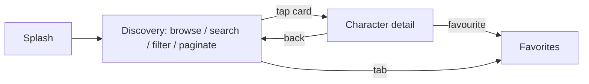

# REQUIREMENTS.md — Product Requirements

- **Status:** Active — target state (see `DOCUMENTATION_AUDIT.md` §5 for the drift rule)
- **Last verified:** 2026-09-29
- **Owner:** Requirements Analyst (see `AGENTS.md`)
- **Authoritative for:** *what* the product must do and *how well*. Not for *how* (see `DESIGN.md`, `API_SPECS.md`, `UI_SPEC.md`).
- **Inputs:** [`assessment.md`](../assessment.md)
- **Normative terms:** `MUST` mandatory · `SHOULD` strong recommendation · `MAY` optional.

> No requirement in this file may be redefined elsewhere. Other documents reference requirements by ID; they do not restate them.

## 1. Scope

### 1.1 In scope (MVP, milestone M1 = Android, M2 = iOS)

A client for the public [Rick and Morty API](https://rickandmortyapi.com/) that lets a user browse every character and inspect a single character, with image-first presentation, resilient networking, response and image caching, and tests.

### 1.2 Non-goals (explicitly out of scope)

| ID | Non-goal | Rationale |
| --- | --- | --- |
| NG-001 | User-authored reviews, ratings or comments | DEC-007: "review" in `assessment.md:2` means *examine*, not *write*. No backend exists for authored content. |
| NG-002 | Accounts, authentication, sign-in | `API_SPECS.md` §4.1: the API has no auth contract; nothing in `assessment.md` requires accounts. |
| NG-003 | Server-side or cross-device sync of favorites | DEC-004 scopes favorites to local storage. |
| NG-004 | Tablet, foldable and landscape layouts | DEC-027: the design baseline is phone portrait (9:19.5) only. |
| NG-005 | Web, desktop, watch or TV targets | DEC-001: two native mobile clients only. |
| NG-006 | Analytics, tracking or advertising SDKs | DEC-038. |
| NG-007 | Offline-first authoring queues or background sync | DEC-012: read-only cache with offline fallback, not a sync engine. |
| NG-008 | Localisation beyond English and Spanish | DEC-006. |

### 1.3 Deferred (agreed, not in MVP)

| ID | Item | Decision | Re-entry condition |
| --- | --- | --- | --- |
| DEF-001 | Voice search (speech-to-text) | DEC-002 | Only if a platform speech path is required; carry `REQ-FUNC-030`. |
| DEF-002 | Real Episodes list and detail screens | DEC-005 | After M2, using `API-EPI-*` batch endpoints already documented. |
| DEF-003 | Real Locations screens | DEC-005 | Same as DEF-002. |
| DEF-004 | Kotlin Swift export instead of the current bridging split | DEC-013 | When Kotlin's Swift export leaves Alpha. |

## 2. Actors and journeys

| Actor | Description | Primary journey |
| --- | --- | --- |
| Reviewer (ZARA interviewer) | Reads the repository and runs the app | Clone → build → run → inspect structure and tests |
| App user | Browses characters on a phone | Splash → browse/search/filter → open a character → favourite |
| Maintainer / AI agent | Changes the code | Read docs by precedence (`AGENTS.md`) → implement → verify |

## 3. Source of truth and precedence

1. [`assessment.md`](../assessment.md) — the assignment. Overrides every other document on conflict.
2. This file — product requirements and acceptance criteria.
3. `API_SPECS.md` (remote contract), `DESIGN.md` (architecture), `UI_SPEC.md` (visual/behavioural spec).
4. ADRs in `docs/adr/` — rationale for decisions referenced here as `DEC-###`.

Conflicts MUST be reported, not silently resolved (see `AGENTS.md`).

## 4. Assessment traceability

| `assessment.md` | Anchor text | Requirements |
| --- | --- | --- |
| l.4 | "review a list of all characters and retrieve information about the selected character" | `REQ-FUNC-001`, `REQ-FUNC-002` |
| l.7 | "use them wisely, each third party library added is a dependency" | `REQ-NFR-002`, `CON-004` |
| l.8 | "how did you structure the project, if you apply things like SOLID" | `REQ-NFR-001`, `REQ-NFR-005` |
| l.9 | "very image oriented company, UX is important" | `REQ-FUNC-005`, `REQ-UX-002` |
| l.10 | "we will talk about performance probably" | `REQ-NFR-003` |
| l.16 | "Use Jetpack compose or SwiftUI" | `REQ-PLAT-002`, `REQ-PLAT-003` |
| l.17 | "Cache images coming from network" | `REQ-FUNC-021` |
| l.18 | "Error handling" | `REQ-FUNC-022` |
| l.19 | "Response caching" | `REQ-FUNC-020` |
| l.20 | "Implement tests" | `REQ-NFR-005` |
| l.21 | "Possibility to filter or search" | `REQ-FUNC-003`, `REQ-FUNC-004` |
| l.15 | "Be creative!" | `REQ-FUNC-007`, `REQ-FUNC-009` |

## 5. Functional requirements

Priority uses MoSCoW. **Must** = MVP (M1/M2). **Should** = committed for the deliverable. **Could** = deferred, see §1.3.

### 5.1 Must have

#### REQ-FUNC-001 — Paginated character list
The app `MUST` display characters from `GET /character`, loading pages incrementally until `info.next` is null, preserving the active filter on every page.

- `AC-REQ-FUNC-001-1` First page renders without fetching later pages.
- `AC-REQ-FUNC-001-2` The list keeps loading on scroll until `info.next == null`, then stops requesting.
- `AC-REQ-FUNC-001-3` The count shown comes from `info.count`; no character total is hardcoded.
- Contract: `API-CHAR-001`, `API-CHAR-002` · Task: `TASK-001` · Tests: `TEST-UNIT-001`, `TEST-CONTRACT-001`, `TEST-UI-001`

#### REQ-FUNC-002 — Character detail
The app `MUST` open a detail view for the selected character showing portrait, name, status, species, gender, origin, last known location, episode count and (when available) first appearance.

- `AC-REQ-FUNC-002-1` The detail renders the list-provided name, image and status immediately, before the network responds.
- `AC-REQ-FUNC-002-2` Unknown values (`"unknown"`) are displayed as "Unknown".
- `AC-REQ-FUNC-002-3` A detail fetch failure with cached list data keeps the known fields and shows an inline retry.
- Contract: `API-CHAR-003`, `API-EPI-002` · Task: `TASK-002` · Tests: `TEST-UNIT-002`, `TEST-UI-002`

#### REQ-FUNC-003 — Name search
The app `MUST` search characters by name, debounced by 300 ms, with a new query resetting pagination to page 1 and cancelling the in-flight request.

- `AC-REQ-FUNC-003-1` Typing produces one request per settled query, not one per keystroke.
- `AC-REQ-FUNC-003-2` Changing the query during a load cancels the previous request and shows only the newest result.
- `AC-REQ-FUNC-003-3` A blank query sends no `name` parameter.
- Contract: `API-CHAR-004` · Task: `TASK-003` · Tests: `TEST-UNIT-003`

#### REQ-FUNC-004 — Status filter
The app `MUST` offer exactly four single-select status options — All, Alive, Dead, Unknown — defaulting to All, where "All" sends no `status` parameter.

- `AC-REQ-FUNC-004-1` Selecting a status resets to page 1 and preserves the active name query.
- `AC-REQ-FUNC-004-2` Species, type and gender filters are not offered.
- Contract: `API-CHAR-004` · Task: `TASK-004` · Tests: `TEST-UNIT-003`, `TEST-UI-003`

#### REQ-FUNC-005 — Image-first presentation
Character portraits `MUST` be the largest element on list and detail surfaces and `MUST` render from the API image URL with a placeholder, a crossfade, and a branded error state (never a broken-image glyph).

- `AC-REQ-FUNC-005-1` Placeholder then image, 200 ms crossfade, cache key equals the image URL.
- `AC-REQ-FUNC-005-2` A failing image shows the portal mark at 40 % opacity.
- `AC-REQ-FUNC-005-3` The UI does not claim or request a resolution above the documented 300×300 source.
- Task: `TASK-005` · Tests: `TEST-UI-004` · Constraint: `CON-002`

#### REQ-FUNC-006 — Favorites
The user `MUST` be able to mark and unmark a character as favourite on the detail screen and `MUST` see the marked set in a Favorites section; the set `MUST` survive app restarts and be stored locally only.

- `AC-REQ-FUNC-006-1` The favourite control reflects the stored state immediately and shows a toggled accessibility state.
- `AC-REQ-FUNC-006-2` After a process restart, the previously marked characters are still marked.
- `AC-REQ-FUNC-006-3` While the set is empty, the Favorites section shows its designed empty state.
- Task: `TASK-006` · Tests: `TEST-UNIT-004`, `TEST-UI-005`

#### REQ-FUNC-007 — Splash with branded loading
The app `MUST` show a branded splash whose portal rotation is the loading indicator, between 1.2 s and 3 s, then cross-fade to Discovery.

- `AC-REQ-FUNC-007-1` The splash lasts at least 1.2 s and no more than 3 s.
- `AC-REQ-FUNC-007-2` With no network, the splash still completes and Discovery shows its error state.
- `AC-REQ-FUNC-007-3` The rotation is exposed as an indeterminate progress indicator labelled "Loading characters".
- Task: `TASK-007` · Tests: `TEST-UI-006`, `TEST-A11Y-001`

#### REQ-FUNC-008 — Navigation and sections
The app `MUST` expose four destinations — Characters, Episodes, Locations, Favorites — where Episodes and Locations present coming-soon placeholders and every placeholder offers an action that returns to Characters.

- `AC-REQ-FUNC-008-1` Every destination is reachable in one tap from any other destination.
- `AC-REQ-FUNC-008-2` "Browse characters" selects the Characters destination without pushing a new screen.
- Task: `TASK-008` · Tests: `TEST-UI-007`

#### REQ-FUNC-009 — Card-to-detail transition
Opening a character `MUST` use a shared-element/zoom transition from the card portrait to the detail hero, with a Reduce Motion fallback.

- `AC-REQ-FUNC-009-1` The portrait animates from card bounds to hero bounds (450 ms on Android).
- `AC-REQ-FUNC-009-2` With Reduce Motion enabled, the transition is replaced by a cross-fade.
- Task: `TASK-009` · Tests: `TEST-UI-008`

#### REQ-FUNC-010 — Empty results state
A search or filter that matches nothing `MUST` render a designed empty state that names the active query and offers a way to clear it — never a generic error.

- `AC-REQ-FUNC-010-1` A filtered REST `404` maps to the empty state, not to an error.
- `AC-REQ-FUNC-010-2` "Clear filters" restores the unfiltered first page.
- Task: `TASK-010` · Tests: `TEST-UNIT-005`, `TEST-UI-009`

#### REQ-FUNC-011 — Retry
Every recoverable failure `MUST` offer a user-initiated retry that starts a fresh attempt budget.

- `AC-REQ-FUNC-011-1` Retry after a failure issues a new request and clears the error on success.
- Task: `TASK-011` · Tests: `TEST-UNIT-006`

#### REQ-FUNC-012 — Manual refresh
The user `MUST` be able to force a network revalidation of the current list, retaining the previous content if the refresh fails.

- `AC-REQ-FUNC-012-1` Refresh performs a network request even when the cache is fresh.
- `AC-REQ-FUNC-012-2` A failed refresh keeps the previously displayed items.
- Task: `TASK-012` · Tests: `TEST-UNIT-007`

#### REQ-FUNC-013 — Localisation
All user-visible copy `MUST` come from localisable resources with English and Spanish translations, and the app `MUST` follow the device locale.

- `AC-REQ-FUNC-013-1` Every key exists in both `en` and `es`; a missing key fails a test.
- `AC-REQ-FUNC-013-2` Switching the device language to Spanish shows Spanish copy without a code change.
- Task: `TASK-013` · Tests: `TEST-UNIT-008`

#### REQ-FUNC-014 — Branch and pull-request delivery
Every change `MUST` be delivered through a branch and a pull request that is reviewed and merged by a human; direct commits to `main` are prohibited.

- `AC-REQ-FUNC-014-1` `main` builds at every commit; work happens on `feat|fix|docs|test|build|chore/<slug>` branches.
- `AC-REQ-FUNC-014-2` An agent may open a pull request but `MUST NOT` merge, tag or release it.
- Task: `TASK-014` · Decision: `DEC-041`, `DEC-049` · Tests: gate configuration in `TESTING.md` §14

### 5.2 Should have

#### REQ-FUNC-020 — Response caching
The app `MUST` cache successfully decoded responses and serve them per the policy in `API_SPECS.md` §7 (app-level policy: 24 h fresh, 7 d stale-while-revalidate, 30 d offline), marking stale data as such.

- `AC-REQ-FUNC-020-1` A repeat visit inside the fresh window renders without a network request.
- `AC-REQ-FUNC-020-2` Offline with a cached entry shows the content plus a stale indicator; offline with no entry shows the offline error.
- `AC-REQ-FUNC-020-3` Errors, empty bodies and partial GraphQL responses are never cached.
- Task: `TASK-020` · Tests: `TEST-UNIT-009`, `TEST-INT-001`

#### REQ-FUNC-021 — Image caching
Images `MUST` be cached in memory and on disk independently of JSON responses.

- `AC-REQ-FUNC-021-1` A second render of the same URL performs no network request.
- `AC-REQ-FUNC-021-2` Image bytes are never stored in the JSON cache.
- Task: `TASK-021` · Tests: `TEST-INT-002`

#### REQ-FUNC-022 — Error handling
Every failure `MUST` map to a domain failure and then to a designed UI state, per `ERROR_FLOW.md`.

- `AC-REQ-FUNC-022-1` Offline, timeout, server, malformed, rate-limited, not-found and invalid-request conditions each render their specified state.
- `AC-REQ-FUNC-022-2` `CancellationException` is never surfaced to the user.
- Task: `TASK-022` · Tests: `TEST-UNIT-010`

#### REQ-FUNC-023 — Detail enrichment
When enrichment is requested, the app `MUST` fetch episode data in batch and derive episode count, dimension and first appearance; when not requested it `MUST` hide the dependent rows rather than show placeholders.

- `AC-REQ-FUNC-023-1` Episode data is fetched in one bounded batch request, never one request per episode.
- `AC-REQ-FUNC-023-2` With `episodeSummaries == null`, "First seen in" is absent and the episode count still renders.
- Task: `TASK-023` · Tests: `TEST-UNIT-011`, `TEST-CONTRACT-002`

### 5.3 Could have (deferred — do not implement in M1/M2)

| ID | Requirement | Status |
| --- | --- | --- |
| REQ-FUNC-030 | Voice search populating the query field on both platforms | Deferred — DEC-002. Must not ship without the permission/privacy work in `SECURITY.md`. |
| REQ-FUNC-031 | Episodes list and detail screens | Deferred — DEC-005 (DEF-002). |
| REQ-FUNC-032 | Locations list and detail screens | Deferred — DEC-005 (DEF-003). |

## 6. Non-functional requirements

#### REQ-NFR-001 — Architecture and separation of concerns
The codebase `MUST` implement layered responsibilities with dependencies pointing inward (presentation → domain ← data), `MUST` keep platform types out of the domain layer, and `MUST` keep DTOs inside the data layer.

- `AC-REQ-NFR-001-1` The `:core:domain` module compiles without any platform, HTTP or UI dependency.
- `AC-REQ-NFR-001-2` No DTO type appears in a public signature outside `:core:data`.
- Reference: `DESIGN.md` §1, §3.4 · ADR: `ADR-0001` · Tests: `TEST-UNIT-012`

#### REQ-NFR-009 — Feature-per-module structure
The codebase `MUST` be organised as one module per user-facing capability (`:feature:discovery`, `:feature:character-detail`, `:feature:favorites`, `:feature:episodes`, `:feature:locations`) with Clean Architecture layers inside each feature module, and shared infrastructure in `:core:domain`, `:core:data`, `:core:presentation`, `:core:designsystem`, `:core:testing`.

- `AC-REQ-NFR-009-1` No feature module depends on another feature module; a dependency-analysis check fails the build on a forbidden edge.
- `AC-REQ-NFR-009-2` Each feature module contains its own `domain` and `presentation` packages and declares its own navigation destination; no feature module owns the app-wide `NavHost`.
- `AC-REQ-NFR-009-3` `:core:domain` depends on nothing, `:core:data` and `:core:presentation` depend only on `:core:domain`, and `:core:designsystem` depends on Compose only.
- Reference: `DESIGN.md` §3, [`adr/0001-module-boundaries.md`](adr/0001-module-boundaries.md) · Decision: `DEC-052` · Tests: `TEST-UNIT-014`

#### REQ-NFR-010 — Test-driven development protocol
Every behaviour change `MUST` follow the TDD protocol: write the failing test and observe the failure, commit the red phase, implement until the test passes, commit the green phase, refactor with the suite green, commit the refactor phase, then push. Squash merging is `MUST NOT` be used, because it would destroy the phase sequence.

- `AC-REQ-NFR-010-1` Each behaviour change has three commits with the `test:`, `feat:`/`fix:` and `refactor:` prefixes, or a recorded justification that a phase produced no change.
- `AC-REQ-NFR-010-2` The pull request records the observed red failure and the observed green pass; a green suite alone is not evidence of the protocol being followed.
- `AC-REQ-NFR-010-3` Documentation, build, CI and tooling changes are exempt and state the exemption explicitly.
- Reference: `CONTRIBUTING.md`, `DEFINITION.md` §3, `TESTING.md` · Decision: `DEC-053` · Tests: `TEST-UNIT-015`

#### REQ-NFR-011 — Mandatory full test suite on every pull request
The complete test suite `MUST` be executed and pass on both platforms before a pull request is approved or merged, and no test suite `MUST` be waived at release time.

- `AC-REQ-NFR-011-1` The required checks include shared and platform unit tests, Compose semantics and accessibility tests, Roborazzi screenshot verification, Swift snapshot tests, formatting, static analysis and dependency analysis.
- `AC-REQ-NFR-011-2` The contract suite runs inside the pull request in fixture/replay mode so the gate never depends on the live service; the live-network run is a separate scheduled signal.
- `AC-REQ-NFR-011-3` The red commit of the TDD protocol is not a gate violation: the gate evaluates the final state of the pull request.
- Reference: `DEFINITION.md` §3, `TESTING.md` §14 · Decision: `DEC-054` · Tests: `TEST-UNIT-016`

#### REQ-NFR-002 — Dependency restraint
Every third-party dependency `MUST` be justified in `DESIGN.md` §3 or an ADR, and `MUST NOT` exceed two solutions for the same concern.

- `AC-REQ-NFR-002-1` The dependency inventory in `README.md` matches the resolved Gradle graph.
- `AC-REQ-NFR-002-2` Each declared dependency has a named rationale.
- Reference: `CON-004`

#### REQ-NFR-003 — Performance budgets
The app `MUST` meet the numeric budgets in `PERFORMANCE.md` on the named reference device, and budgets `MUST` be measured, not asserted.

- `AC-REQ-NFR-003-1` Cold start to Discovery `≤ 2.0 s` p50 on the reference device.
- `AC-REQ-NFR-003-2` Scrolling the populated grid sustains the frame-time budget with no visible jank.
- `AC-REQ-NFR-003-3` A cached page render issues zero network requests.
- Reference: `PERFORMANCE.md` (`PERF-###`) · Tests: `TEST-PERF-001`, `TEST-PERF-002`

#### REQ-NFR-004 — Resilience
Malformed, partial or unexpected remote data `MUST` degrade gracefully and `MUST NOT` crash the app.

- `AC-REQ-NFR-004-1` Malformed JSON maps to a domain failure and a designed error state.
- `AC-REQ-NFR-004-2` An unknown `status`/`gender` value is preserved and displayed without a crash.
- Tests: `TEST-CONTRACT-003`

#### REQ-NFR-005 — Verification depth
Unit, mapping, cache and paging logic `MUST` be covered by automated tests in `commonTest`; UI behaviour and visual regressions `MUST` be covered by platform tests; API contract tests `MUST` exist and run outside the blocking gate.

- `AC-REQ-NFR-005-1` The risky modules (cache, pager, mappers, failure mapping) have direct behavioural tests.
- `AC-REQ-NFR-005-2` Every Must-have requirement in this file maps to at least one test ID in `TESTING.md`.
- Reference: `TESTING.md` · DEC-029, DEC-031

#### REQ-NFR-006 — Reproducible builds
The build `MUST` pin every dependency and toolchain version, and `MUST` build from a clean clone with one documented command.

- `AC-REQ-NFR-006-1` No dynamic version ranges (`+`, `latest.release`) anywhere in the build.
- `AC-REQ-NFR-006-2` `VERSION` is the single source for `versionName` and `CFBundleShortVersionString`.
- Reference: `TECHNICAL_PLAN.md` · DEC-043

#### REQ-NFR-007 — Quality gates
Formatting, static analysis, dependency analysis and the complete test suite for both platforms `MUST` pass before a pull request can be approved.

- `AC-REQ-NFR-007-1` The documented commands in `CONTRIBUTING.md` run the full local gate.
- `AC-REQ-NFR-007-2` Branch protection requires every mandatory check; a failing, skipped or missing check blocks approval.
- Reference: `DEFINITION.md` §3 (DoD) · DEC-032, DEC-054 · Tests: `TEST-UNIT-016`

## 7. Platform requirements

| ID | Requirement | Acceptance criterion | Reference |
| --- | --- | --- | --- |
| REQ-PLAT-001 | Shared domain, data and presentation-state code `MUST` be authored once in Kotlin Multiplatform targets used by both apps. | `AC-REQ-PLAT-001-1` The shared modules contain no platform UI code. | DEC-001, `DESIGN.md` §3 |
| REQ-PLAT-002 | Android `MUST` be a native Jetpack Compose app with `minSdk 26`, `compileSdk`/`targetSdk` 37. | `AC-REQ-PLAT-002-1` The APK installs on API 26 and runs on API 37. | DEC-009, DEC-010 |
| REQ-PLAT-003 | iOS `MUST` be a native SwiftUI app with a minimum deployment target of iOS 18.0, using Liquid Glass where available. | `AC-REQ-PLAT-003-1` On iOS 18 the app runs with the documented non-glass fallback; on iOS 26+ glass is used. | DEC-008 |
| REQ-PLAT-004 | Android `MUST` be deliverable before iOS; each platform `MUST` have its own definition of done. | `AC-REQ-PLAT-004-1` The Android milestone is releasable with the iOS app absent. | DEC-040 |
| REQ-PLAT-005 | The app `MUST` be usable offline for previously viewed content and `MUST NOT` require any account or credential. | `AC-REQ-PLAT-005-1` First launch on a device with no network shows a designed error, not a crash. | `API_SPECS.md` §7.3 |

## 8. UX, accessibility and localisation requirements

| ID | Requirement | Acceptance criterion | Reference |
| --- | --- | --- | --- |
| REQ-UX-001 | The app `MUST` present a single appearance and `MUST NOT` vary with the system light/dark setting or wallpaper colours. | `AC-REQ-UX-001-1` Screenshot comparison in system light and dark mode produces identical output. | `UI_SPEC.md` §3.1, §9 |
| REQ-UX-002 | Colour, typography, shape and spacing `MUST` come from the design tokens in `UI_SPEC.md` §3; no ad-hoc literals in UI code. | `AC-REQ-UX-002-1` A token parity test fails when a token value drifts from the committed export. | DEC-022 |
| REQ-UX-003 | Body text `MUST` reach 4.5:1 contrast and large display text 3:1 on the single palette. | `AC-REQ-UX-003-1` All text/background pairs used in the app are listed with their measured ratio. | `UI_SPEC.md` §9 |
| REQ-UX-004 | Interactive targets `MUST` be at least 48 dp (Android) / 44 pt (iOS). | `AC-REQ-UX-004-1` Every control is measured in the accessibility checklist. | DEC-023 |
| REQ-UX-005 | Status `MUST NOT` be conveyed by colour alone; each status is paired with its text label. | `AC-REQ-UX-005-1` A card is announced as one node: "Rick Sanchez, Alive, Human, button". | `UI_SPEC.md` §9 |
| REQ-UX-006 | Text `MUST` scale with the platform setting, and grids `MUST` drop to one column at the largest accessibility sizes. | `AC-REQ-UX-006-1` Detail renders without clipping at the maximum text size. | `UI_SPEC.md` §9 |
| REQ-UX-007 | Motion `MUST` honour Reduce Motion, and glass `MUST` honour Reduce Transparency. | `AC-REQ-UX-007-1` With Reduce Motion on, shared-element and zoom transitions become cross-fades and the splash pulses instead of spinning. | `UI_SPEC.md` §7 |
| REQ-UX-008 | User-visible copy `MUST` be identical on both platforms and come from the canonical key list. | `AC-REQ-UX-008-1` The copy parity test fails when a platform copy file diverges from the canonical list. | DEC-020 |
| REQ-UX-009 | Loading, empty, stale, error and partial-data states `MUST` exist for both list and detail surfaces. | `AC-REQ-UX-009-1` Each state in `ERROR_FLOW.md` corresponds to a rendered state covered by a snapshot test. | DEC-021, DEC-024 |

## 9. Reliability and offline requirements

| ID | Requirement | Acceptance criterion | Reference |
| --- | --- | --- | --- |
| REQ-REL-001 | The cache `MUST` be keyed by the complete normalized request identity (path, page, filters, protocol), so pages and filters never collide. | `AC-REQ-REL-001-1` Cache isolation tests fail if two filter combinations share an entry. | `API_SPECS.md` §7.3 |
| REQ-REL-002 | Concurrent identical requests `MUST` be deduplicated. | `AC-REQ-REL-002-1` Two simultaneous identical loads produce one network call. | `API_SPECS.md` §8 |
| REQ-REL-003 | Retries `MUST` be bounded to two automatic attempts with backoff and jitter, and `MUST NOT` apply to schema, validation, decoding or cancellation outcomes. | `AC-REQ-REL-003-1` A 4xx and a decode failure each produce exactly one attempt. | `API_SPECS.md` §6.3 |
| REQ-REL-004 | Stale cached data `MUST` be visibly marked, and a client clock change `MUST NOT` break freshness evaluation. | `AC-REQ-REL-004-1` Tests inject a fake clock; no test depends on wall-clock time. | DEC-012, DEC-018 |

## 10. Security and privacy requirements

| ID | Requirement | Acceptance criterion | Reference |
| --- | --- | --- | --- |
| REQ-SEC-001 | Networking `MUST` be HTTPS-only and restricted to the configured API host; relation and pagination URLs pointing at another host `MUST` be rejected. | `AC-REQ-SEC-001-1` A request to a foreign host fails and is covered by a test. | `API_SPECS.md` §9, DEC-035 |
| REQ-SEC-002 | The repository `MUST NOT` contain API keys, tokens or credentials; none are required. | `AC-REQ-SEC-002-1` Secret scanning over the working tree and history finds none. | DEC-035 |
| REQ-SEC-003 | No personal data `MUST` be collected, transmitted or stored; the only persisted data is the local favourite ID set. | `AC-REQ-SEC-003-1` `SECURITY.md` §3 lists every persisted field and its classification. | DEC-035 |
| REQ-SEC-004 | The MVP `MUST NOT` request microphone or speech permissions. | `AC-REQ-SEC-004-1` No `RECORD_AUDIO` and no `NSSpeech*UsageDescription`/`NSMicrophone*UsageDescription` entry exists in the shipped apps. | DEC-002, DEC-035 |
| REQ-SEC-005 | Logs `MUST NOT` contain search text, response bodies, image bytes or stack traces; release builds log errors only. | `AC-REQ-SEC-005-1` A logging test asserts that a query string never reaches a log sink. | DEC-039, `API_SPECS.md` §9 |
| REQ-SEC-006 | Dependencies `MUST` be monitored for advisories, and findings recorded per `SECURITY.md`. | `AC-REQ-SEC-006-1` The advisory register records each finding with severity, mitigation and verification. | DEC-037, DEC-036 |
| REQ-SEC-007 | A private route for reporting vulnerabilities `MUST` be documented. | `AC-REQ-SEC-007-1` `SECURITY.md` and `CONTRIBUTING.md` give the same reporting instructions. | DEC-035 |

## 11. Observability requirements

| ID | Requirement | Acceptance criterion | Reference |
| --- | --- | --- | --- |
| REQ-OBS-001 | Failures and cache outcomes `MUST` be logged through one shared logging contract with the permitted fields only (protocol, path template, page, filter *names*, status family, cache source, duration, correlation id). | `AC-REQ-OBS-001-1` The contract is defined once in `OBSERVABILITY.md` and used by both platforms. | DEC-038 |
| REQ-OBS-002 | A debug-build diagnostic surface `MUST` expose the last failure and the data source (network/memory/disk/stale) for the current screen. | `AC-REQ-OBS-002-1` The surface is absent from release builds. | DEC-038 |
| REQ-OBS-003 | No analytics or tracking SDK `MUST` be included. | `AC-REQ-OBS-003-1` The dependency graph contains no analytics artifact. | DEC-038 |

## 12. Constraints

| ID | Constraint | Consequence |
| --- | --- | --- |
| CON-001 | The remote API is public, unversioned, read-only and requires no authentication. | Contract tests MUST run separately from the merge gate (`API_SPECS.md` §1, §10). |
| CON-002 | Only one 300×300 image per character is published. | No higher-resolution assets may be requested or implied (`API_SPECS.md` §4.7, `UI_SPEC.md` §5.1). |
| CON-003 | `assessment.md` is authoritative and partially truncated (l.4, l.10); its intent is recorded in §4. | Interpretation MUST be cited rather than assumed. |
| CON-004 | One toolchain component is alpha-only: Material 3 Expressive `1.5.0-alpha29` (with Compose BOM 2026.09.00). Multiplatform DataStore `1.3.0-alpha11` and `androidx.lifecycle` KMP `2.12.0-alpha04` are explicitly **not** adopted: DEC-017 keeps the data layer alpha-free and DEC-013 removes shared ViewModels. | The project accepts exactly one pinned-alpha risk on the Android UI path (DEC-010, `adr/0008-alpha-dependencies.md`); any second alpha requires a new decision. |
| CON-005 | The Figma source file requires project access and returns 403 to anonymous clients. | Rendered PNG exports MUST be committed under `docs/figma/` (DEC-045). |
| CON-006 | Repository documentation language is English; `README.es.md` mirrors the README. | Other documents MUST NOT be duplicated per language (DEC-047). |

## 13. Risks

| ID | Risk | Likelihood | Impact | Mitigation | Owner |
| --- | --- | --- | --- | --- | --- |
| RISK-001 | 300×300 portraits look soft in the detail hero (412 dp). | High | Medium | Scrims and the iOS progressive-blur treatment (`UI_SPEC.md` §5.3); stated as a source limit, not a defect. | UX |
| RISK-002 | Pinned alpha toolchain components (`CON-004`) break on upgrade. | Medium | High | Pinned versions, upgrade note in `GUIDELINES.md`, build verification in CI. | IE |
| RISK-003 | Dual-platform delivery doubles verification cost and slips M2. | Medium | High | Android-first milestone (DEC-040); `REQ-PLAT-004` makes M1 releasable alone. | PM |
| RISK-004 | The unversioned API changes shape and silently breaks mapping. | Medium | Medium | Committed fixtures plus a scheduled contract-test job (DEC-029). | QA |
| RISK-005 | The API marks filtered `404` responses cacheable for 90 days. | Certain | High | App-level cache never stores error outcomes; `API_SPECS.md` §7.1 requires `no-store` hardening and a test. | AA |
| RISK-006 | Published totals (`826`/`42`) are quoted as constants and go stale. | Medium | Low | Requirement `AC-REQ-FUNC-001-3` forbids hardcoding; figures appear only as dated observations. | DOC |
| RISK-007 | Liquid Glass fallback path diverges visually from the glass path. | Medium | Low | Both paths screenshot-tested; fallback documented in `UI_SPEC.md` §4.2. | UX |
| RISK-008 | The Figma file is unreachable for a reviewer, making `UI_SPEC.md` references unverifiable. | High | Medium | Committed PNG exports (DEC-045) plus in-app screenshots in `README.md`. | DOC |
| RISK-009 | Reviewer perceives scope as exceeding the assignment ("deliver something"). | Medium | Medium | `REQUIREMENTS.md` §1 fixes MVP boundaries; `TECHNICAL_PLAN.md` sequences a releasable M1 early. | PM |

## 14. Open questions

None blocking. Deferred items are tracked as `DEF-001`…`DEF-004` in §1.3 and as `DEC-###` rows with status `Deferred` in `DECISION_BOARD.md`.

## 15. Traceability summary

Coverage is maintained in [`DOCUMENTATION_AUDIT.md`](DOCUMENTATION_AUDIT.md) §6 (requirement → contract → task → test). Rules enforced there:

- Every Must/Should requirement has at least one acceptance criterion.
- Every Must/Should requirement has at least one task in `BACKLOG.md`.
- Every Must/Should requirement has at least one test ID in `TESTING.md`.

## 16. Change log

| Date | Change | Decision |
| --- | --- | --- |
| 2026-09-29 | Rewritten from the initial 27-line draft: stable IDs, acceptance criteria, MoSCoW rebuilt against `assessment.md`, scope/non-goals, platform, UX, security and observability requirements added. | DEC-002, DEC-004, DEC-007, DEC-046 |
