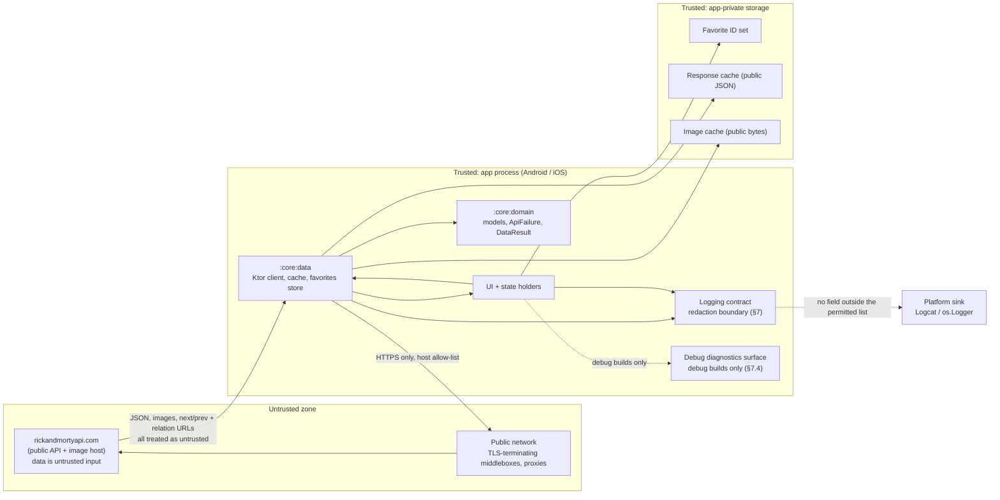

# SECURITY.md — Threat Model, Privacy Policy and Advisory Register

- **Status:** Active — target state; no feature code exists yet. Two security-adjacent checks run locally in the root `check` today (`verifyRepositoryHygiene`, `verifyDependencyPolicy`); see `DOCUMENTATION_AUDIT.md` §5
- **Last verified:** 2026-10-03
- **Owner:** Security Reviewer (see `../AGENTS.md` §3.7)
- **Authoritative for:** the app-level threat model, trust boundaries, data classification, secret/permission/logging *prohibitions*, transport and storage security policy, dependency-security policy, the vulnerability-reporting route and the security advisory register (`SEC-###`).
- **Not authoritative for:** the permitted log field list and the log catalogue (`OBSERVABILITY.md`), the failure→state→copy chain (`ERROR_FLOW.md`), the remote contract (`API_SPECS.md`), implementation conventions (`GUIDELINES.md`), requirement statements (`REQUIREMENTS.md`).
- **Inputs:** [`REQUIREMENTS.md`](REQUIREMENTS.md) §10–§12 (`REQ-SEC-001`…`REQ-SEC-007`, `CON-001`…`CON-006`, `RISK-002`), [`API_SPECS.md`](API_SPECS.md) §4.1, §6, §9, [`OBSERVABILITY.md`](OBSERVABILITY.md), [`AGENTS.md`](../AGENTS.md) §4.2, §15, [`ADR-0008`](adr/0008-alpha-dependencies.md), [`DECISION_BOARD.md`](DECISION_BOARD.md) (DEC-035, DEC-036, DEC-037, DEC-039, DEC-052)
- **Normative terms:** `MUST` mandatory · `SHOULD` strong recommendation · `MAY` optional.

> Requirements are owned by `REQUIREMENTS.md` and are referenced here by ID; this document MUST NOT restate them. Where this document and `REQUIREMENTS.md` disagree, `REQUIREMENTS.md` wins.

## 1. Purpose, scope and threat-model boundary

This document defines the security posture of **Multiverse Explorer**, a read-only client for the public, unauthenticated Rick and Morty API (`CON-001`). It is an **app-level threat model**: it covers the two shipped mobile apps and the shared Kotlin code they run, and nothing else.

Facts that bound the whole model:

| Property | Value | Source |
| --- | --- | --- |
| Data direction | read-only; the app publishes nothing | `API_SPECS.md` §1 |
| Accounts, sessions, credentials | none exist | `NG-002`, `REQ-SEC-002` |
| Server component | none; the app talks directly to a public API | `API_SPECS.md` §1 |
| Authored user content | none | `NG-001` |
| Persisted state | favourite ID set, app preferences (Sounds flag, remote protocol), response cache, image cache | `REQ-SEC-003` |
| Secrets | none required anywhere | `REQ-SEC-002`, DEC-035 |

### 1.1 In scope

- Untrusted **remote input**: JSON bodies, enum-like values (`status`, `gender`), server-supplied URLs (image, `info.next`/`info.prev`, relation URLs) and untrusted human-readable error text.
- **Transport integrity and confidentiality**: HTTPS-only enforcement, host allow-listing, redirection and cleartext-downgrade resistance.
- **Supply chain**: third-party dependencies, pinned pre-release artifacts, CI action pinning, advisory intake.
- **Local data at rest**: what the app writes to app-private storage, in both platforms.
- **Information leakage through diagnostics**: logs, the debug diagnostics surface and crash output (`REQ-SEC-005`).
- **Permission minimisation**: what the apps request from the user and why (`REQ-SEC-004`).
- **Graceful degradation**: untrusted or malformed input must fail safely rather than crash (`REQ-NFR-004`).

### 1.2 Out of scope, and why

| Out of scope | Why |
| --- | --- |
| Account takeover, session fixation, credential theft | No accounts, no sessions and no credentials exist (`NG-002`, `REQ-SEC-002`). |
| Server-side compromise, injection, SSRF, database exposure | The project ships no server, no database and no backend of its own. |
| Confidentiality of the character data | The catalogue is public and identical for every user; there is no confidentiality asset on the wire. |
| Protecting user-authored content | No content is authored (`NG-001`); "review" means read-only browsing (DEC-007). |
| Device compromise, rooted/jailbroken devices, debugger attached to a development build | The threat model assumes the OS sandbox and app-private storage hold on a stock device; there is no high-value local asset whose theft would justify anti-tamper engineering. |
| Other applications on the device | App-private sandboxing is the platform's responsibility. |
| OS-level crash/ANR reporting and analytics performed by the platform or the store | Not collected by the app; the app includes no crash or telemetry SDK (`REQ-OBS-003`). |
| Network traffic analysis of a public catalogue | No confidential traffic exists to analyse. |
| Anti-piracy, DRM, obfuscation beyond R8 size/optimisation | No shipped asset has commercial protection value in this deliverable. |
| GDPR/CCPA data-subject workflows | Not because they were judged unnecessary for a legal opinion, but because the app processes no personal data (§3); this document MUST NOT be read as a compliance, certification or audit claim (`../AGENTS.md` §3.7). |
| Certificate pinning | Deliberately not implemented; rationale and residual risk in §5.4. |
| Formal penetration testing or an external audit | Nothing in the assignment requires it and no such activity has been performed. |

**Assumption A-1** (owner: Security Reviewer, dated 2026-09-29): the API's `image` field resolves to the allow-listed host. Verified only against the API responses summarised in `API_SPECS.md` §1.1's 2026-09-29 probe note, not against a full character set. If a character's `image` URL points to another host, §5.2 applies: the request MUST be rejected and the allow-list extended by decision rather than by trusting the payload.

## 2. Trust boundaries and data flow

Boundary rules:

1. **Everything arriving from the API is untrusted input**, including fields that look like enumerations and URLs the server supplies. Validation and hardening rules are in §12; the mapping contract is in `API_SPECS.md` §6.
2. **The app is the only writer** to app-private storage. No other process is granted access, and no file is written outside the app sandbox.
3. **No third party participates at runtime.** The dependency graph is build-time only; there is no analytics, tracking, advertising or crash-reporting SDK (`REQ-OBS-003`), no push provider and no remote configuration service.
4. **No data leaves the device except the HTTPS request to the allow-listed host.** There is no upload path, no backup path and no export path.
5. **The logging boundary is a redaction boundary**: data crossing it MUST satisfy the permitted field list owned by `OBSERVABILITY.md` §2.

## 3. Data classification and retention

This section lists every piece of data the app handles, including every field that is persisted (`AC-REQ-SEC-003-1`).

| # | Data | Example | Stored? | Transmitted? | Personal? | Retention | Notes |
| --- | --- | --- | --- | --- | --- | --- | --- |
| 1 | Character list/detail JSON | `{"id":1,"name":"Rick Sanchez",...}` | Yes (app-level response cache in `:core:data`) | Yes — received from the API over HTTPS | No — public catalogue | Cache budget with eviction; stale entries are unreachable after the 30 d offline window (DEC-012, `API_SPECS.md` §7) | Never contains images (`REQ-FUNC-021`). |
| 2 | Episode JSON | batch `/episode/1,2,3` payloads | Yes, same response cache | Yes, received | No — public catalogue | Same as row 1 | Used only for detail enrichment (`REQ-FUNC-023`). |
| 3 | Image bytes (portraits) | 300 × 300 JPEG | Yes (memory + disk image cache) | Yes, received from the allow-listed host | No — public asset | Image-cache eviction policy (`UI_SPEC.md` §5.2) | Separated from the JSON cache (`REQ-FUNC-021`). |
| 4 | Favorite ID set | `{"1","42"}` | Yes — persisted user state, with row 4a. Android: the string set `favorite_ids` of the app's Preferences DataStore file; Apple: the sorted string array `multiverse.favorites.ids` in `UserDefaults` (`TASK-040`) | No, never | No — opaque public API identifiers forming a preference set, not an account | Until the user toggles it off, deletes all favorites from Settings (`REQ-FUNC-035`) or clears app data; survives process restart (`REQ-FUNC-006`) | Stored per §6. Only the canonical id strings are written, under that one key; `TEST-INT-004` asserts it on both real stores. |
| 4a | App preferences | `soundsEnabled=false`, `remoteProtocol="rest"` | Yes — persisted user state | No, never; the protocol choice only selects which allow-listed endpoint is called | No — two app-behaviour flags | Until changed in Settings or app data is cleared (`REQ-FUNC-033`, `REQ-FUNC-034`) | Exactly the fields of `CONTRACTS.md` `IC-021`; stored per §6. |
| 5 | Search text | typed or pasted query | No | Yes — only as the `name` query parameter (REST) or the `filter.name` variable (GraphQL) of an HTTPS request to the allow-listed host | Not classified as personal data, but treated as potentially identifying user input: never persisted, never logged (`REQ-SEC-005`) | Transient: in-memory for the request and its cache key; discarded with the process | Voice search is deferred (`REQ-FUNC-030`); re-classification rule in §8.3. |
| 6 | Active status filter, page number, filter parameter *names* | `status=Alive`, `page=2` | Yes, as part of the cache key | Yes — as REST query parameters or GraphQL variables (DEC-056) | No | Same as row 1 (the cache entry) | Filter *names* may be logged; values MUST NOT (`OBSERVABILITY.md` §2). |
| 7 | Cache metadata | cache key, expiry instant, `ETag` | Yes, alongside the cache entry | Inbound only | No | Same as the entry | Freshness uses an injected clock (DEC-018). |
| 8 | Structured log events | see `OBSERVABILITY.md` §3 | Not persisted by the app; emitted to the platform log sink | No | No, by construction (§7) | Process lifetime for in-memory buffers; the platform log buffer is OS-managed and outside app control | Release builds emit errors only (DEC-039). |
| 9 | Debug diagnostics snapshot | last failure class, data source, timings | In memory only, debug builds only | No | No | Process lifetime | Never on disk, never in release (§7.4). |
| 10 | Request correlation id | 16 hex characters from a random source, e.g. `3f9c0a1b7e2d4c56` | No | No — client-side only | No | Request lifetime | MUST NOT be derived from user input (§7.3). |
| 11 | Build/runtime facts | app version, platform, build type | No | No | No | — | Used in log envelopes only. |
| 12 | Device, advertising or account identifiers | — | No | No | — | — | None are read, generated or transmitted. |

**Conclusion.** The app processes **no personal data**. The only persisted data is (a) the favourite ID set, (b) two app preferences and (c) caches of public API payloads and public images. Search text is transient: it is never persisted, never logged and never sent anywhere except as an API query parameter over HTTPS to the allow-listed host. Any future feature that processes personal data MUST first extend this table and obtain an accepted decision (§6.4).

## 4. Secret management

- **No secret is required by the build or at runtime.** The API is public and unauthenticated (`CON-001`); there is no API key, token, client secret, service-account file or environment variable to configure (`REQ-SEC-002`).
- No secret, key, token, keystore or credential of any kind `MUST` be committed to the repository. This is unconditional and applies to test fixtures and documentation as well.
- Release signing material and store credentials are **human-owned**; agents never handle them (DEC-049, `../AGENTS.md` §4.2). No signing material exists in the working tree and none `MUST` be added by an agent.
- Secret scanning is executed by `./gradlew verifyRepositoryHygiene` (`TEST-UNIT-026`; DEC-062), wired into the root `check`. The scan boundary is fixed and stated so a clean run is not read as more than it is:
  - **Working set** — every tracked file plus every untracked, non-ignored file (the commit-eligible set). Ignored local files such as `local.properties`, build output and `prompts/` are outside repository content, and their path classes are instead validated against `.gitignore` by the same task.
  - **History** — every unique blob reachable from all local refs, after the caller has fetched. Unreachable/dangling objects and refs that were never fetched are outside the boundary.
  - **Fail closed** — a shallow checkout, a non-Git directory, a Git error, an incomplete object set, a submodule or a symlink that would leave the repository makes the task fail rather than report zero findings.
  - **Redaction** — a finding reports only the rule id (`HYG-…` or `SEC-026-…`), the root-relative path, a safe line number when available and the blob identity for history. The matched value `MUST NOT` be printed, logged or written.
  - The check is a deterministic scan for a fixed pattern and path registry. It is **not** a proof that no secret can exist; the manual credential review in `TESTING.md` §16.2 remains.
- Scanning `MUST` be re-run whenever a new build file, CI workflow or configuration file is introduced, because those are the realistic carriers of an accidental credential; `verifyRepositoryHygiene` runs on every `check` and `build`, and the future `repository-hygiene` CI check (`TESTING.md` §14.2) runs it with full history on both runners.
- The build `MUST NOT` read secrets from `local.properties`, environment variables or checked-in property files, because nothing in the design needs them; a future need is a decision, not a convenience.

### 4.1 If a secret or credential is ever exposed

If anything sensitive is committed or published, the following order applies. Each step is recorded as a `SEC-###` row in §11.

1. **Contain.** Treat the value as compromised the moment it is pushed. Revoke or rotate it at the source (human-only action) before any history work.
2. **Remove from the tip.** Delete the value from the file in a normal commit; never "fix" it by leaving it and changing the value in place.
3. **Purge history** if the value is still recoverable from any branch or tag. History rewriting is a human-only, prohibited-until-instructed action (`../AGENTS.md` §4.2) and `MUST` be explicitly requested by the repository owner.
4. **Assume it leaked.** Rotation, not deletion, is the mitigation; deletion only reduces further exposure.
5. **Verify.** Re-run the secret scan (`TEST-UNIT-026`) over the working tree and history and record the observed result as the row's verification evidence.
6. **Record.** Add the `SEC-###` row with severity, impact, mitigation, owner, due date and verification evidence, and note whether the §11 promotion rule is triggered.

## 5. Transport security

### 5.1 Rules

- Every network request `MUST` use HTTPS. Cleartext HTTP `MUST NOT` be possible in a shipped build (`REQ-SEC-001`).
- The request host `MUST` be on the allow-list, which contains exactly `rickandmortyapi.com`. The allow-list is a build constant; it `MUST NOT` be discovered from a response (`../README.md` §10 states the base URL as a build constant).
- A relation URL or pagination URL (`info.next`, `info.prev`, a relation URL inside a payload) whose host is not allow-listed `MUST` be **rejected, not followed**. Rejection is a normal, logged outcome (`OBSERVABILITY.md` §3, `LOG-004` with `errorClass`, not a crash).
- A redirect whose target host is not allow-listed `MUST` be rejected rather than followed.
- Android: the manifest `MUST NOT` set `android:usesCleartextTraffic="true"` and the app `MUST NOT` ship a `network_security_config` that permits cleartext for any domain. iOS: the app `MUST NOT` set `NSAllowsArbitraryLoads` or any per-domain exception in the App Transport Security dictionary.
- A TLS failure maps to `ApiFailure.Unknown` and `MUST NOT` be retried automatically (`API_SPECS.md` §6.1). The app `MUST NOT` offer an "ignore certificate" or "continue anyway" affordance.
- The app `MUST NOT` accept a user-installed CA override as a supported configuration, and `MUST NOT` claim to defend against one (§5.4).
- Response headers `MUST NOT` be trusted for security decisions. In particular, the API's `Cache-Control: public, max-age=7776000, immutable` on filtered `404` responses is treated as untrusted data, and the app-level cache never stores error outcomes (`RISK-005`, `API_SPECS.md` §7.1).
- Requests happen only in response to a user action or a screen's own data need. There is no background polling, no prefetch of the whole catalogue and no request driven by a received payload.

### 5.2 Verification

- `TEST-UNIT-025` asserts HTTPS-only enforcement plus the host allow-list and foreign-host rejection (`AC-REQ-SEC-001-1`).
- The REST adapter of `TASK-037` builds every request against the fixed HTTPS host and rejects a pagination or relation URL on another host or scheme before anything is taken from it, so nothing in a response can redirect a request; `TEST-CONTRACT-001`, `TEST-CONTRACT-003` and `TEST-UNIT-001` prove it on fixtures. Its client follows no redirect, and the OkHttp and Darwin engines keep no response cache (`TEST-UNIT-054`). Since `TASK-038` the transport-wide half holds as well: the shared client's `HostAllowList` plugin rejects cleartext, another host, a sub-domain and a non-default port on **every** request before transport, a `3xx` is rejected as an invalid request rather than followed, and the OkHttp engine is built with redirects, TLS redirects and connection retries off (`TEST-UNIT-025`, `TEST-UNIT-054`). A rejection is logged as `LOG-004` with the operation and the failure class only, never the host or the URL (`TEST-UNIT-032`).

### 5.3 Transport assets

There is no credential, cookie, session token or personal data on the wire; the confidentiality asset that TLS normally protects does not exist here. TLS is still required, because integrity and trust-on-first-use matter even for public data: a substituted payload is untrusted input the app must survive (`REQ-NFR-004`), and cleartext would expose search text to the local network (§3 row 5).

### 5.4 Certificate pinning — not implemented

Certificate pinning is **not implemented**, and this section states why it is not required for this product rather than claiming it is impossible to add.

- Pinning protects a client against a man-in-the-middle who holds a certificate that the platform trust store accepts (for example a device owner who installed a proxy CA). The asset at risk here is public catalogue data and a favourite set with no confidentiality value; there is no token to steal and no privileged action a MITM could perform.
- Pinning carries an operational cost out of proportion to that risk: it breaks the app on legitimate certificate rotation and on networks with an enterprise inspection proxy, and it would require a documented rotation and release-fast-path plan.
- If a future change ever transmits a credential, personal data or a mutating request, pinning `MUST` be re-evaluated in the same change that adds it, and the re-evaluation recorded as a decision. Until then, the honest statement is: the residual MITM risk is accepted, it is a content-integrity risk only, and the app's response to untrusted content is defined by §12.

## 6. Storage security

### 6.1 What is stored, and where

| Store | Content | Location | Owner module |
| --- | --- | --- | --- |
| Favorite store | the favourite ID set (row 4 of §3) | Android app-private storage (a `.preferences_pb` DataStore file under the app's `filesDir`, supplied by the composition root); iOS app-private container (`UserDefaults`) | `:core:data`: `DataStoreFavoritesLocalDataSource` and `UserDefaultsFavoritesLocalDataSource` behind `IC-013` (DEC-017, DEC-052, `TASK-040`) |
| Preferences store | the app preferences (row 4a of §3) | same platform stores as the favorite store, with separate keys | `:core:data`, `expect/actual` (DEC-017, DEC-055) |
| Response cache | public JSON payloads and cache metadata | Android app-private cache directory; iOS app container cache directory | `:core:data` (DEC-018) |
| Image cache | public image bytes | the image library's memory + disk caches | Android Coil; iOS `URLCache` + `NSCache` (DEC-026) |
| Debug diagnostics | last failure, data source, timings | process memory only, debug builds only | app shells (§7.4) |

Nothing is stored outside the app sandbox. No external storage, no shared container, no clipboard write, no file picker export.

### 6.2 It is not encrypted, deliberately

The stored data is not encrypted, and this is recorded as an accepted characteristic rather than an oversight:

- The favourite ID set contains public API identifiers, not personal data (§3). Encrypting it would protect nothing that the OS sandbox does not already protect, while adding a dependency, a key-management surface and a failure mode (an unreadable store on reinstall, restore or key invalidation).
- The caches hold the same public payloads any user can fetch from the API.
- The debug snapshot never reaches disk.

The app relies on the platform's own protections and does not change the platform defaults: it does not alter the iOS data-protection class of its files and it does not implement its own disk encryption. Android backup behaviour MUST be revisited if the manifest ever sets an automatic-backup rule that would carry a secret; with today's data there is nothing sensitive to exclude.

### 6.3 Integrity boundaries

- The favourite store is the only writer-owned state. A malformed, truncated or unreadable store `MUST` degrade to an empty or partially readable set plus a logged error, never to a crash (`REQ-NFR-004`, `ERROR_FLOW.md`). Implemented by `TASK-040`: a DataStore file that cannot be decoded is replaced by an empty one, a `UserDefaults` value that is not a list of strings keeps its readable part, and a write the store cannot complete keeps the last consistent set — each logged as `LOG-019`, and proved by `TEST-INT-004` and `TEST-UNIT-004`.
- Cache entries `MUST` be validated before use: an entry that fails to decode is discarded and treated as a miss (`REQ-FUNC-020`, `AC-REQ-FUNC-020-3`).
- Nothing read from storage is trusted as a URL, a host or a control-flow decision without the §5 rules being re-applied.

### 6.4 Rule for adding sensitive storage later

If any future change stores data that is secret, credential-bearing or personal:

1. It requires an accepted decision (and an ADR when it changes architecture) before implementation (`../AGENTS.md` §6).
2. It `MUST` first be added to the §3 classification table with a retention period and a deletion path.
3. The value `MUST` be encrypted at rest, with the key held in the platform keystore (Android Keystore / iOS Keychain) rather than derived from app constants or stored beside the data.
4. It `MUST NOT` be written to a log, a screenshot-test fixture, the debug diagnostics surface or an error message.
5. It `MUST` be excluded from platform backup and from any export path, or the exclusion `MUST` be explicitly justified.
6. It `MUST` ship with the tests that prove points 3–5, and the change `MUST` be reviewed by the Security Reviewer.

## 7. Logging, redaction and diagnostics

- `OBSERVABILITY.md` is the **canonical owner** of the logging contract: the level set, the permitted field list, the prohibited list, the `LOG-###` catalogue and the metrics vocabulary. This section states the security obligations and does not restate that content (`REQ-OBS-001`).
- Logs `MUST NOT` contain search text, filter values, raw query strings, response bodies, image bytes or stack traces (`REQ-SEC-005`, `REQ-OBS-001`).
- Search text and any value typed by the user are prohibited in every field, on both platforms, in every build type, including the debug diagnostics surface.
- Release builds log errors only (DEC-039): the release sink threshold is `Error`. Debug builds `MAY` emit the wider debug catalogue and `MAY` include exception type plus a sanitised message, but `MUST NOT` include a stack trace in a release build, and `MUST NOT` relax the query-string prohibition.
- The app `MUST NOT` install a log collector, crash reporter, remote sink or upload path. Logs stay on the device (`REQ-OBS-003`).

### 7.1 Enforcement

- `TEST-UNIT-029` asserts that a query string never reaches a log sink (`AC-REQ-SEC-005-1`). Implemented by `TASK-047`: a search with a distinctive query and a status filter runs through every event the request, retry, coalescing and pager paths emit at `DEBUG`, and no record carries the value, the status value, a query string or the host.
- `TEST-UNIT-032` asserts that both platforms log through the single shared contract with permitted fields only (`AC-REQ-OBS-001-1`). The shared logger validates each field and drops a value that fails its form; the platform sinks join the assertion when the shells exist (`TASK-044`, `TASK-051`).
- Any new log field is a change to `OBSERVABILITY.md` first; adding a field in code without changing that document is a defect.

### 7.2 Prohibited content

The prohibited list is owned by `OBSERVABILITY.md` §2. This document adds the security rationale: the prohibitions exist because a value that reaches a sink leaves the app's control, may be read by a user or an attached tooling session, and cannot be retracted. Anything unlisted is prohibited by default; there is no "temporary" exception.

### 7.3 Correlation ids

A correlation id is a client-side counter or random value allocated at the request boundary. The implementation (`IC-024`, `TASK-047`) draws 16 hex characters from a random source per request scope and carries them in the coroutine context; the validator drops any other form. It `MUST NOT` be derived from, hashed from or correlated with the user's search text or filter values, because a derived identifier is a weak but real confirmation oracle for guessed input.

### 7.4 Debug diagnostics surface

The debug-only diagnostics surface (`REQ-OBS-002`) exposes the last failure, the current data source, the last request timing and cache state. It is gated out of release builds entirely: it is compiled from a debug-only source set / platform build configuration, not merely hidden at runtime, and it `MUST NOT` be reachable in a release artifact. It follows §7 redaction in full: it `MAY` show filter *names* and the failure class, and `MUST NOT` show filter values, search text or response content.

Since `TASK-047` the read-only API exists in `:core:diagnostics` and the exclusion is a property of the module graph rather than of a flag: `R11` admits the `:androidApp` edge only from a `debug*` configuration and walks the release closure of the shell, and `R18` keeps the module's production code on `:core:domain` (`DEC-088`, `DEC-094`, `TEST-UNIT-033`). It reads only records the validator already accepted. The rendered panels (`TASK-044`, `TASK-051`) are target state.

## 8. Permissions

### 8.1 MVP position

- The MVP `MUST NOT` request microphone or speech permissions (`REQ-SEC-004`). No `RECORD_AUDIO` entry and no `NSSpeechRecognitionUsageDescription`/`NSMicrophoneUsageDescription` entry may exist in a shipped app.
- The MVP declares **no runtime (dangerous) permission** on Android and no usage-description-gated capability on iOS. It requests no camera, location, contacts, calendar, notification, Bluetooth, photo-library or background-execution permission, and it declares no foreground service.
- Android's `android.permission.INTERNET` is install-time and non-runtime. It is the only permission the app's network path requires; it cannot be withheld by the user and grants no access to user data.
- Exported entry points are minimised: the launcher entry point on Android and no exported component that accepts a remote-host URL. The app `MUST NOT` declare a deep link or intent filter that hands an arbitrary URL to the network layer without the §5.1 allow-list checks.
- No permission `MUST` be added for a convenience reason. A new permission is a decision plus a security review (`../AGENTS.md` §15).

Verification: `TEST-UNIT-028` asserts the absence of microphone and speech permission entries in both shipped apps (`AC-REQ-SEC-004-1`).

### 8.2 What the app never asks for

Location, contacts, photos, camera, files, notifications, device identifiers and advertising identifiers are neither requested nor read. There is no permission whose denial changes the app's core read-only flow.

### 8.3 If voice search is ever un-deferred

`REQ-FUNC-030` is deferred (DEC-002). Un-deferring it means shipping a feature that captures the user's voice, which is a materially different privacy position, and it `MUST NOT` ship before all of the following exist in the same approved change:

1. **Decision and security review** (`../AGENTS.md` §6, §15) plus an updated §3 classification: audio is personal data, and the derived query text becomes personal data too. Until the table says so, the feature cannot ship.
2. **Android:** a `RECORD_AUDIO` runtime-permission request with an in-context rationale, a documented denial path that leaves search-by-typing fully functional, and an explicit choice of on-device recognition versus a network recogniser.
3. **iOS:** `NSMicrophoneUsageDescription` and `NSSpeechRecognitionUsageDescription` purpose strings in English and Spanish (`REQ-FUNC-013`), plus the same denial path.
4. **A retention statement**: audio is not stored, not logged and not retained after the query is derived; the diagnostics surface and the log catalogue are extended only with permitted non-content fields.
5. **A disclosure** in the app's own copy stating that speech recognition may be processed by the platform or its service provider, because `SFSpeechRecognizer` and the Android platform recogniser may not be purely on-device.
6. **Tests** covering permission denial, the no-storage rule and the continued absence of search text from logs (`TEST-UNIT-029`).

## 9. Dependency security

### 9.1 Policy

- Every dependency `MUST` be pinned to an exact version; dynamic ranges (`+`, `latest.release`) are forbidden (`REQ-NFR-006`, `AC-REQ-NFR-006-1`).
- Every dependency `MUST` carry a recorded justification in `DESIGN.md` §3 or an ADR, and no concern `MUST` have more than two solutions (`REQ-NFR-002`).
- Advisory monitoring `MUST` be automated with Dependabot or Renovate on the Gradle version catalog, the Swift package manifests and the GitHub Actions workflows (DEC-037).
- GitHub Actions `MUST` be pinned by full commit SHA, never by a moving tag or branch (DEC-037). Pinning is security-relevant because workflow definitions execute with repository permissions.
- A dependency-analysis check (`buildHealth`, DEC-032) `MUST` run in the gate so that unused or undeclared dependency edges are surfaced rather than accumulated.
- Repositories `SHOULD` be limited to the platform and package sources actually needed (`google()`, `mavenCentral()`) rather than an aggregating mirror, so a typo-squatted artifact cannot be resolved from an unintended source.
- A dependency upgrade `MUST` be a separate, reviewable change with a build verification; an upgrade that also changes behaviour is not a hygiene change.
- Findings feed §11. A finding that is not actionable is recorded with a documented acceptance rationale rather than being closed silently.

### 9.2 Pre-release (alpha) exposure

The accepted risk from ADR-0008 is the shipped pre-release artifact list. Today it is:

| Artifact | Pinned version | Consequence for security |
| --- | --- | --- |
| `androidx.compose.material3:material3` | `1.5.0-alpha29`, with Compose BOM `2026.09.00` | Pre-release code has a shorter public-track record and receives API changes without deprecation cycles; it is a UI-only artifact with no network, storage or permission surface. |

`CON-004` also names `androidx.lifecycle` KMP `2.12.0-alpha04` and DataStore KMP `1.3.0-alpha11` **if adopted**. Under the accepted decisions they are not adopted: state holders are platform-owned (DEC-013, so no multiplatform `lifecycle`), and favourites use `expect/actual` stores with the stable Android DataStore artifact and iOS `UserDefaults` (DEC-017). If either artifact ever enters the build, ADR-0008 `MUST` be extended in the same change.

Mitigations for the pinned-alpha surface are those of `RISK-002`: exact pins, a single version catalog, the documented upgrade note in `GUIDELINES.md`, and the mandatory full-suite, both-platform CI gate on every pull request (DEC-054, superseding DEC-028). Because an alpha cannot be relied on to publish timely security fixes, the response to an advisory against it is to move to the nearest fixed version or to remove the artifact, not to wait (DEC-037, DEC-052 module layout keeps the blast radius inside `:core:designsystem`).

### 9.3 Known gaps, stated as gaps

- No Gradle dependency-verification metadata (checksums) and no dependency lockfile is configured. The build exists (TASK-014, merged in PR #6) and TASK-015 pinned the catalog, but the adoption is unowned and recorded as `GAP-010`; the version catalog pins versions, not artifact bytes. Owner: Security Reviewer, dated 2026-09-30. Target state: verification metadata or a lockfile for the Gradle dependency graph, so a re-pointed or tampered artifact fails resolution.
- - No CI exists yet, so none of §9.1's automated checks are running today; they are target state and are tracked as work in `BACKLOG.md` (`TASK-025`). Two do execute locally in the root `check` on every build today: `verifyRepositoryHygiene` (`TEST-UNIT-026`, §4) and `verifyDependencyPolicy` (`TEST-UNIT-013`/`014`/`051`). Nothing else should be read as a claim that it already runs.

## 10. Vulnerability reporting

The block below is the project's vulnerability-reporting route. `CONTRIBUTING.md` `MUST` reproduce it verbatim and `MUST` name this document as authoritative on divergence; the route `MUST NOT` be paraphrased or re-scoped in another document (`REQ-SEC-007`, `AC-REQ-SEC-007-1`, `TEST-UNIT-031`).

> ### Reporting a vulnerability
>
> Report a suspected vulnerability **privately**. Do not open a public issue, discussion or pull request, and do not put details in a commit message, branch name or PR title.
>
> **Route:** use GitHub's Private Vulnerability Reporting form on this repository — open the **Security** tab and choose **Report a vulnerability**. This opens a private advisory visible only to you and the maintainers.
>
> **Include:** what you found and where (file, endpoint or screen); the affected version, tag or commit; the platform and OS version; the steps to reproduce; what you observed and what you expected; whether any part of it is already public; and how you would like to be credited.
>
> **Response:** the maintainer will try to acknowledge a report within 3 working days and will say whether it is accepted as a finding. This project has no bug-bounty programme and promises no remediation timeline. A report that is accepted becomes a row in the advisory register in `SECURITY.md` §11.
>
> **Disclosure:** keep the report private until a fix has been released. There is no fixed embargo period; the maintainer will agree one with you in the private advisory.
>
> **Scope:** this repository ships two read-only mobile clients for a public API. It has no server, no accounts and no user data. A report about the Rick and Morty API service itself belongs with the API's own maintainers, not here.

**Assumption A-2** (owner: Security Reviewer, dated 2026-09-29): GitHub Private Vulnerability Reporting is not verifiable from the working tree, so it is recorded as an assumption that the repository owner enables it in repository settings before the repository is published to external reporters, together with a monitored notification destination (DEC-049 keeps repository settings human-only). If it is not enabled, the route in the block above is unavailable and `MUST` be replaced by a private channel the owner can actually operate — the replacement is a documentation change, not a code change, and it `MUST` be mirrored verbatim into `CONTRIBUTING.md`.

## 11. Security advisory register

This section is the advisory register (DEC-036). It is a section of this document and not a separate file.

### 11.1 The table is empty, and must be

**There are zero rows in this register as of 2026-09-29. No vulnerability has been found, reported or accepted in this project.** The table below is intentionally empty. Any row added to it `MUST` be a **real, evidenced finding**: a row is allowed only when a specific advisory, report or scan result exists that can be cited in the `Detection source` and `Verification evidence` columns. A hypothetical, illustrative, "for example", or template row `MUST NOT` be committed. A row with no evidence is a defect in this document and is removed, not reworded.

### 11.2 Columns

| Column | Meaning |
| --- | --- |
| `Advisory id` | `SEC-###`, allocated sequentially from `SEC-001`. Never reused, never renumbered. |
| `Affected dependency / component` | The exact artifact and version, platform API, or app component. Not a module name alone. |
| `Severity` | One of `Critical`, `High`, `Medium`, `Low` — assessed with rationale in `Impact`, never copied blindly from a vendor score. |
| `Affected versions` | The versions of this project known to be affected (tag, commit or version range). |
| `Detection source` | How it was found: advisory database + id, Renovate/Dependabot PR, `buildHealth` output, review, or a private report. |
| `Impact` | What an attacker could achieve here, in this app, given §1's boundary. "None" is a valid entry only with a reason. |
| `Mitigation` | Upgrade, pin, remove the artifact, configuration change, or explicit acceptance with rationale. |
| `Owner` | A role from `../AGENTS.md`. |
| `Due date` | ISO 8601 date by which the mitigation lands; for `Accepted` risk, the date the acceptance is re-reviewed. |
| `Status` | `Open`, `Mitigating`, `Resolved`, `Accepted`. |
| `Verification evidence` | The command run and the result observed, or the test id that now fails without the fix. Never "verified". |
| `Related issue / PR` | GitHub issue or PR reference, plus the `TASK-###` id. |

### 11.3 Register

| Advisory id | Affected dependency / component | Severity | Affected versions | Detection source | Impact | Mitigation | Owner | Due date | Status | Verification evidence | Related issue / PR |
| --- | --- | --- | --- | --- | --- | --- | --- | --- | --- | --- | --- |

### 11.4 Register rules

1. A finding opens a row in the same change that opens the issue, and the row is updated in the same change that resolves it.
2. `Resolved` requires `Verification evidence`. Without it the row stays `Open`.
3. `Accepted` requires a written rationale in `Mitigation`, an owner and a re-review due date — an accepted risk is a decision, not a dismissal.
4. Severity is assessed against this app's threat model (§1), so a remote-code-execution advisory in a dependency that never parses remote input is not automatically `Critical`; the `Impact` column must say so explicitly.
5. A security advisory against an artifact on the §9.2 pre-release list is recorded here even when no fixed version exists, because "wait for upstream" is a mitigation with a schedule.
6. Verification for register completeness is `TEST-UNIT-030` (`AC-REQ-SEC-006-1`).
7. **Promotion rule:** when the first real finding is added, the register `MUST` be promoted to `docs/SECURITY_ADVISORY_REGISTER.md` — a file owning the `SEC-###` namespace — and this section becomes a link to it. The promotion happens in the same change that adds the first row, and the new file carries the standard header block and this section's column definition. Until then, this section is authoritative and no separate register file may exist (`DECISION_BOARD.md` §3).

## 12. Secure-development expectations

These are the rules a change must satisfy before review. They are target state, because no feature code exists yet (the Gradle/KMP build skeleton of TASK-014 carries no behaviour).

### 12.1 Treat every API value as untrusted

- `status` and `gender` are open strings on the wire. An unknown value `MUST` be preserved and displayed rather than coerced, dropped or allowed to crash (`REQ-NFR-004`, `AC-REQ-NFR-004-2`).
- Server-supplied human-readable error text `MUST NOT` be used as control flow and `MUST NOT` be shown to the user or logged as a field. The app maps status families and error codes to its own copy (`API_SPECS.md` §6.1, `ERROR_FLOW.md`).
- Server-supplied strings are rendered as plain text. The app `MUST NOT` render a remote string as HTML or markup and `MUST NOT` ship a WebView.
- Every server-supplied URL (image, `info.next`, `info.prev`, relation) passes the §5.1 allow-list check before any request is made.
- Numeric and identifier values `MUST` be parsed defensively: an id is an opaque string (`API_SPECS.md` §3), and page indices come from the response rather than from arithmetic on trusted totals.

### 12.2 Decoding rules

- No `!!` and no unchecked cast on a decoded field. Absent or null values are handled with explicit defaults, explicit failure mapping, or a nullable domain model — never with a crash. `REQ-NFR-004` makes graceful degradation a requirement, and a crash from remote input is a defect, not an edge case.
- `kotlinx.serialization` is configured as follows, and each choice is deliberate:
  - `ignoreUnknownKeys = true` — the API is unversioned (`CON-001`) and adds fields without notice; rejecting an unknown field would break the app on a server-side additive change. This setting only affects *extra* fields; it `MUST NOT` be combined with defaults that silently paper over *missing required* fields, because a missing required field is `ApiFailure.MalformedResponse` (`API_SPECS.md` §6.1).
  - `coerceInputValues = false` — coercing an invalid enum would silently rewrite a value the user should see; the tolerant-mapper rule in §12.1 exists precisely so coercion is unnecessary.
  - `isLenient = false` — lenient parsing accepts malformed JSON that should surface as a decoding failure.
  - `allowSpecialFloatingPointValues = false` and no polymorphic deserialization for API input (no `classDiscriminator`-driven type selection, no `SerializersModule` polymorphic registration) — untrusted input never selects the type the app instantiates.
  - Enum decoding uses an explicit mapper that keeps the raw string for unknown values; an enum `valueOf` on remote input is not acceptable.
- Deserialisation happens on a background dispatcher; the UI is never blocked on parsing.
- A body that fails to decode, or that is empty where content is required, maps to a domain failure and a designed state (`API_SPECS.md` §6.1, `ERROR_FLOW.md`). It is never cached (`AC-REQ-FUNC-020-3`).
- Reads are bounded: a response `SHOULD` be rejected once it exceeds a documented size ceiling, so a hostile or broken peer cannot exhaust memory through one response.

### 12.3 Failures degrade, never crash

- Every failure path ends in a domain failure and a designed UI state (`REQ-FUNC-022`, `ERROR_FLOW.md`); the app `MUST NOT` surface a raw exception, a stack trace or an internal type name to the user.
- `CancellationException` is control flow: it is rethrown, never mapped, never logged as an error (`REQ-FUNC-022`, `AC-REQ-FUNC-022-2`).
- Storage read failures, malformed cache entries and a corrupt favourite store degrade to an empty or partial state plus a logged error (§6.3).
- Unexpected failure handling `MUST NOT` swallow an error silently. It either reaches a designed state or is logged through the permitted contract (`OBSERVABILITY.md` §3); "logged and ignored" is acceptable only where the user-visible behaviour is already defined.
- A crash-only path (`!!`, `error()`, unchecked cast, `require` on remote input) in code that touches remote data or storage is a review blocker.

### 12.4 Build and release

- Release builds `MUST NOT` be debuggable, `MUST` be minified and resource-shrunk, and `MUST` keep the R8 mapping file out of the published artifact while retaining it for stack-trace deobfuscation internally.
- Release builds `MUST NOT` include the debug diagnostics surface (§7.4) or a debug-wide log threshold (DEC-039).
- No feature flag, remote config or "kill switch" endpoint exists, so there is no server-driven control path to secure.
- A change that touches networking, decoding, storage, logging or permissions is reviewed by the Security Reviewer.

## 13. Traceability

| Requirement | Owning section here | Supporting document | Test |
| --- | --- | --- | --- |
| `REQ-SEC-001` | §5 | `API_SPECS.md` §4.1, §9 | `TEST-UNIT-025` |
| `REQ-SEC-002` | §4 | `../AGENTS.md` §4.2 | `TEST-UNIT-026` |
| `REQ-SEC-003` | §3 | `DEC-017`, `DEC-018` | `TEST-UNIT-027` |
| `REQ-SEC-004` | §8 | DEC-002, `REQ-FUNC-030` | `TEST-UNIT-028` |
| `REQ-SEC-005` | §7, §7.4 | `OBSERVABILITY.md` §2, §4 | `TEST-UNIT-029` |
| `REQ-SEC-006` | §9, §11 | DEC-037, DEC-036 | `TEST-UNIT-030` |
| `REQ-SEC-007` | §10 | `CONTRIBUTING.md` §10 | `TEST-UNIT-031` |
| `REQ-OBS-001` | §7 | `OBSERVABILITY.md` §2 | `TEST-UNIT-032` |
| `REQ-OBS-002` | §7.4 | `OBSERVABILITY.md` §5 | `TEST-UNIT-033` |
| `REQ-OBS-003` | §2, §7 | `OBSERVABILITY.md` §1 | `TEST-UNIT-034` |
| `REQ-NFR-004` | §12 | `ERROR_FLOW.md` | `TEST-CONTRACT-003` |

## 14. Change log

| Date | Change | Reference |
| --- | --- | --- |
| 2026-10-03 | B3 Phase 3.3: §3 row 4 names the persisted key on each platform and row 10 the implemented correlation-id form (`CONF-77`); §6.1 names the two stores; §6.3 records how an unreadable store or a failed write degrades. | `TASK-040`, `DEC-017` |
| 2026-10-02 | B3 Phase 3.2: §5.2 records the transport-wide host enforcement of `TASK-038` and the `LOG-004` redaction; §7.1, §7.3 and §7.4 record what `TASK-047` implements — the redaction proof on the real search path, the validated correlation id and the graph-level release exclusion of the diagnostic API. | `TASK-038`, `TASK-047`, `DEC-088`, `DEC-094` |
| 2026-10-01 | §9.3 states the observed position: the two policy checks that run locally in `check` are named, `GAP-010` is indexed as `TASK-084`, and the CI prerequisite for artifact verification is recorded (`TASK-034`, DOC1–DOC8 audit). | `TASK-034`, `DEC-046`, `TASK-084` |
| 2026-09-30 | App preferences (row 4a) added to the data inventory and stores; GraphQL variables noted as a transmission path; "Delete favorites" added to row 4 retention. | DEC-055, DEC-056 |
| 2026-09-29 | Created: app-level threat model, trust boundaries, data classification, secret/permission policy, transport and storage policy, redaction obligations, dependency-security policy, vulnerability-reporting route and the empty `SEC-###` register. | DEC-035, DEC-036, DEC-037, DEC-039, DEC-052 |
| 2026-09-30 | §4 states the executable secret-scanning policy: command, working-set and all-refs history boundary, fail-closed shallow/incomplete behaviour and redaction, implemented as `verifyRepositoryHygiene` (`TEST-UNIT-026`). No `SEC-###` row added: the scan finds nothing. | DEC-062, TASK-016, `PROJECT_LOG.md` LOG-0036 |
| 2026-09-30 | §4's policy is now met by the implementation: a review found the first version could skip a reachable blob or carrier path and fail open on a non-zero `cat-file --batch`; the corrected check scans every reachable blob and every unique historical path and fails closed. Contract unchanged; no `SEC-###` row. | DEC-062, TASK-016, `PROJECT_LOG.md` LOG-0037 |
| 2026-09-30 | §4's policy is met by the second-round implementation too: a second review found a ref pointing directly to a tree could expose a carrier path and that a `-z` stream truncated at its final terminator was accepted; the check now enumerates direct-tree refs, requires terminal NUL and an exact record grammar, and streams content without a size ceiling. Contract unchanged; no `SEC-###` row. | DEC-062, TASK-016, `PROJECT_LOG.md` LOG-0038 |
