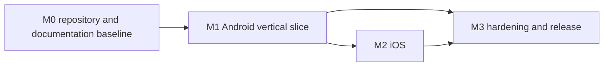

# TECHNICAL_PLAN.md — Milestones, Sequencing and Gates

- **Status:** Active — target state (see `DOCUMENTATION_AUDIT.md` §5 for the drift rule)
- **Last verified:** 2026-10-02
- **Owner:** Delivery Planner (see `AGENTS.md` §3)
- **Authoritative for:** milestone phasing and objectives, build order, sequencing and prerequisite constraints, the phase plan, risk-sequencing consequences, the release readiness checklist and release mechanics, and the milestone → requirement coverage matrix.
- **Inputs:** [`assessment.md`](../assessment.md), [`REQUIREMENTS.md`](REQUIREMENTS.md), [`DECISION_BOARD.md`](DECISION_BOARD.md), [`DEFINITION.md`](DEFINITION.md), [`TESTING.md`](TESTING.md), [`DESIGN.md`](DESIGN.md), [`API_SPECS.md`](API_SPECS.md), [`UI_SPEC.md`](UI_SPEC.md), [`CONTRACTS.md`](CONTRACTS.md), [`adr/0001-module-boundaries.md`](adr/0001-module-boundaries.md)
- **Normative terms:** `MUST` mandatory · `SHOULD` strong recommendation · `MAY` optional.

> **Ownership rule.** This file owns *when* and *in what order* work happens, and *what must be true* for a milestone to close. `BACKLOG.md` owns the atomic `TASK-###` items that carry the work. The gates themselves are owned by `DEFINITION.md` (§2 Ready, §3 Done, §4 milestone exit, §5 release, §6 documentation completeness, §7 quality-gate inventory); the TDD commit protocol is owned by `CONTRIBUTING.md`; the test layers and the CI check list are owned by `TESTING.md` §14. None of them is restated here — this file names the gate that applies at each phase boundary and adds the sequencing that only it can own.

## 1. Purpose and scope

The repository held a documentation-only baseline on 2026-09-29; the Gradle/KMP build skeleton landed on 2026-09-30 (TASK-014, `PROJECT_LOG.md` LOG-0026), `.gitignore` is tracked and TASK-015 pinned the version catalog with its policy checks (`PROJECT_LOG.md` LOG-0032). By 2026-10-01 the B1 technical work had merged as well: `VERSION` exists (`0.1.0`, TASK-018) and the module-boundary check is executable (TASK-017, hardened by TASK-088). There is still no feature code and no launchable app, and the post-merge corrections `TASK-087`…`TASK-090` (PRs #42–#45) are merged. The pull-request gate and the quality toolchain are merged (TASK-025 PR #52, TASK-029 PR #65, TASK-030 PR #63). This plan sequences the work that takes it from that baseline to a released Android app, a released iOS app, and a hardened release, in that order.

In scope: milestone objectives with entry and exit criteria, deliverables and review evidence; architectural build order; the phase plan; prerequisite constraints; the gate that applies at each phase boundary; risk-sequencing consequences; release readiness and release mechanics; ordering without invented dates; and the milestone → requirement coverage matrix.

Out of scope: task-level detail and task acceptance (`BACKLOG.md`), gate definitions (`DEFINITION.md`), test strategy, IDs and required checks (`TESTING.md`), architecture and module boundaries (`DESIGN.md`, `adr/0001-module-boundaries.md`), the internal contracts themselves (`CONTRACTS.md`), the remote contract (`API_SPECS.md`), the visual contract (`UI_SPEC.md`), commit and merge mechanics (`CONTRIBUTING.md`).

Two project rules shape every milestone below and are not repeated per row:

- **TDD is the unit of progress** (DEC-053). A behaviour change is one red → green → refactor cycle, committed per phase, and a task is not started until its first failing test exists. Documentation, build/CI configuration and tooling changes are the only recognised exceptions, and an exception MUST be stated explicitly when used. The protocol itself is owned by `CONTRIBUTING.md`.
- **The full test suite is mandatory on every pull request** (DEC-054). Both platform runners are required on every change, and a pull request is not approvable while any required check is failing, skipped or absent. The check list is owned by `TESTING.md` §14; the gate is owned by `DEFINITION.md` §3. The red commit produced by the TDD protocol is expected to fail tests, so the gate evaluates the final state of the pull request, not each commit.

**Current delivery state (verified 2026-10-01).** The M0 baseline is merged: the documentation baseline (TASK-032 PR #25, TASK-034 PR #32), the Gradle/KMP skeleton (TASK-014, PR #6, LOG-0026), the pinned catalog with its policy checks (TASK-015, PR #10, LOG-0035), the tracked `.gitignore` with its hygiene check (TASK-016, PR #13), the accepted contract baseline `docs/CONTRACTS.md` (TASK-019, PR #31), the executable module-boundary check (TASK-017, PR #33, hardened by TASK-088), and the single `VERSION` source `0.1.0` whose validation every Android artifact task consumes (TASK-018, PR #34; TASK-089). The repository still has **no product test, no feature code and no launchable app**; the both-runner gate and the quality toolchain are merged (TASK-025 PR #52, TASK-029 PR #65, TASK-030 PR #63), so Block 1 is integrated and locally verified, not `Done` under D2 (`DEC-071`); the post-merge corrections `TASK-087`…`TASK-090` are merged (PRs #42–#45). Everything in §2 onward is target state, and no milestone below is reachable until the M0 exit criteria in §2.1 hold.

## 2. Delivery model

Four milestones. M0 and M1 together satisfy what the assignment asks for; M2 adds the second native client and M3 hardens the pair.

| Milestone | Name | Platform scope | Closes when |
| --- | --- | --- | --- |
| M0 | Repository and documentation baseline | none | The build skeleton exists, the documentation set is complete, and CI proves the skeleton |
| M1 | Android vertical slice | Android + shared core | The Android app implements the Must-have requirements end to end and is releasable alone |
| M2 | iOS | iOS + shared core | The SwiftUI app reaches functional and visual parity for the same requirements |
| M3 | Hardening and release | both | Both platforms are hardened, measured and released with the documented artifacts |

**M1 ships alone.** `REQ-PLAT-004` requires Android to be deliverable before iOS and each platform to have its own definition of done; `AC-REQ-PLAT-004-1` and the module rules of DEC-052 require Android to be releasable with the iOS app absent. No M1 exit criterion may depend on an iOS artifact, the iOS app target, or an iOS-only verification step. The two shared obligations that do involve the macOS runner — the TDD cycle for shared modules and the shared test suites required by DEC-054 — run against the shared source sets and their `iosTest` counterparts, which exist without the iOS app target (§5 S11, S14).

M1 feeds M2 (the shared core is exercised first by Android) and both feed M3. M2 does not block M1 (DEC-040). M3 MUST NOT declare a platform hardened before that platform has met its own exit criteria (see `DEFINITION.md` §4).

### 2.1 M0 — Repository and documentation baseline

| | |
| --- | --- |
| **Objective** | Turn a documentation-only repository into a buildable, verifiable, documented baseline that a reviewer can clone and run commands against. |
| **Entry criteria** | The decision interview has concluded and `DECISION_BOARD.md` records the accepted decisions, including DEC-052 (feature-per-module layout), DEC-053 (TDD) and DEC-054 (mandatory CI). The authoritative documents exist: `REQUIREMENTS.md`, `DESIGN.md`, `API_SPECS.md`, `UI_SPEC.md`, `DEFINITION.md`, `TESTING.md`. |
| **Exit criteria** | `DEFINITION.md` §3 holds for each baseline change, except that the recognised TDD exception of DEC-053 applies to the build, CI, tooling and documentation changes that make up M0, and each such change states the exception. No user-facing feature is implemented. |
| **Deliverables** | KMP Gradle skeleton with the DEC-052 module set (`:core:domain`, `:core:data`, `:core:presentation`, `:core:designsystem`, `:core:testing`, `:feature:discovery`, `:feature:character-detail`, `:feature:favorites`, `:feature:episodes`, `:feature:settings`, `:androidApp`) plus the shared `iosTest` source sets (which exist without `iosApp/`; the iOS app target, its Swift packages and the `:core:ios` framework export are M2 work — `TASK-051`, `TASK-078`, `CONF-37`); committed Gradle wrapper; version catalog with every dependency pinned; `.gitignore`; shared `VERSION`; both CI workflows with the full required check set; the module-boundary check; the quality toolchain; `docs/templates/`; `docs/figma/` exports; and the `docs/` document set. |
| **Review evidence** | Green pull-request run of the required check set active at each stage, never an empty or always-green job (`DEC-071`); branch protection configured to name those checks (a human action, DEC-049). Present in part: the both-runner workflow is merged (`TASK-025`, PR #52) and the quality toolchain runs in `check` (`TASK-029`, PR #65); the ruleset names those checks (B2 packet, 2026-10-02; `android` only during the `DEC-083` iOS suspension); the seeded-violation runs (§4 P2); the module-boundary report; the committed `.gitignore`; the documentation completeness gate (`DEFINITION.md` §6) at the M0 commit. One gap is recorded rather than assumed: the Figma file returns 403 to anonymous clients (`CON-005`), so `docs/figma/` exports exist only if project access is granted; otherwise the gap stays open in `DOCUMENTATION_AUDIT.md` and the tasks that require an export are not Ready (`DEFINITION.md` §2, R9). |

### 2.2 M1 — Android vertical slice

| | |
| --- | --- |
| **Objective** | Deliver the complete assignment scope on Android: browse, search, filter, inspect, favourite, offline-tolerant, with a native Material 3 Expressive surface. |
| **Entry criteria** | M0 exit criteria met. `CONTRACTS.md` accepted as the internal interface baseline (S1). `:core:data` cache, pager and failure mapping have their behavioural tests (DEC-031, S4). `:core:designsystem` tokens exist and the token parity test passes (S2). The full required check set runs on every pull request (DEC-054), with the shared and macOS-runner parts operating without the iOS app target (S11). |
| **Exit criteria** | Every Must-have requirement in `REQUIREMENTS.md` §5.1 relevant to Android is verified — the iOS-only requirement `REQ-PLAT-003` is carried to M2 — together with the Should-have group in §5.2, except where §4 explicitly sequences a verification later. `DEFINITION.md` §4.1 holds, and `AC-REQ-PLAT-004-1` holds with no iOS artifact present. |
| **Deliverables** | Releasable Android APK built from a tag; the `:core:*` modules implementing the contracts of `CONTRACTS.md`; `:core:designsystem` and the five `:feature:*` modules; committed screenshot baselines; the recorded accessibility checklist (DEC-023); the published `VERSION`; `README.md` build and run instructions verified against the real build. |
| **Review evidence** | Green required-check run on the pull request that becomes the release commit; the APK attached to the GitHub Release (DEC-043); the screenshot verification result against committed baselines; measurement output compared with the budgets in `PERFORMANCE.md` on the device named there; the accessibility checklist; in-app screenshots added to `README.md`; the manual Figma parity review in `UI_SPEC.md` §11 (DEC-024). |

### 2.3 M2 — iOS

| | |
| --- | --- |
| **Objective** | Deliver the same product on iOS with the Liquid Glass design language, consuming the shared core unchanged apart from additive contracts. |
| **Entry criteria** | M1 exit criteria met — the shared core is proven on one platform before a second consumer exists. The iOS app target compiles against the shared framework. `iosApp/DesignSystem` tokens match `tokens.json`. The iOS suites already run on every pull request (DEC-054, S14). |
| **Exit criteria** | The same requirement set verified on iOS; each Should-have requirement behaves identically to Android per `REQ-UX-008`; `DEFINITION.md` §4.2 holds; both the Liquid Glass path and the iOS 18 material fallback are verified (`REQ-PLAT-003`, DEC-008). |
| **Deliverables** | SwiftUI screens in the DEC-052 Swift packages, bound to the shared presentation-state contracts; `iosApp/DesignSystem`; swift-snapshot-testing baselines including Reduce Transparency and the largest Dynamic Type size; the Icon Composer app icon and asset catalog; the recorded iOS measurement procedure from `PERFORMANCE.md`. |
| **Review evidence** | Green required-check run on the pull request, including the macOS runner; snapshot verification against committed baselines; the copy parity test between platform resource files and the canonical key list (DEC-020); glass-versus-fallback screenshot pairs for the surfaces in `UI_SPEC.md` §4.2; the iOS procedure output compared with `PERFORMANCE.md`; the re-run of the M1 Android evidence to confirm no regression (`DEFINITION.md` §4.2, M2-6). |

### 2.4 M3 — Hardening and release

| | |
| --- | --- |
| **Objective** | Close the gap between "feature complete on two platforms" and "released, measured, documented and maintainable". |
| **Entry criteria** | M1 and M2 exit criteria met. Both platform definitions of done hold. No test is quarantined without the recorded justification of the flaky-test policy (`TESTING.md` §15); a quarantined test backing a `REQ-` row means that requirement is unverified and M3 does not start on it. |
| **Exit criteria** | Every release step in `DEFINITION.md` §5 is satisfied for both platforms; documentation is current in the same change that shipped each feature (DEC-046); the advisory register is current (DEC-036); the traceability rules of `REQUIREMENTS.md` §15 hold for every Must and Should requirement. |
| **Deliverables** | Release notes generated from Conventional Commits (DEC-042); the GitHub Release with the APK (DEC-043); the deferred-work register in `BACKLOG.md` §7 reconciled with `REQUIREMENTS.md` §1.3; the handover document. |
| **Review evidence** | The release notes and the tag on the released commit; the advisory register entries with severity, mitigation and verification; a documentation review confirming no document describes a superseded state; the coverage index in `BACKLOG.md` §8 re-verified against `REQUIREMENTS.md` §5. |

## 3. Architectural milestones

Build order inside M0 and M1. Each item MUST exist and be verified before the work that depends on it starts: the shared contracts and the risky data-layer logic are consumed by both UIs, so a defect there is paid for twice.

| Order | Architectural milestone | What must exist | Depends on | Verification |
| --- | --- | --- | --- | --- |
| A0 | Repository and module skeleton | The DEC-052 layout compiles, with declared source sets and the dependency rules of `adr/0001-module-boundaries.md` enforced by a check rather than by review | — | Gradle build succeeds; the module-boundary check rejects a seeded feature-to-feature dependency |
| A1 | Internal contracts | `CONTRACTS.md` (`IC-###`) accepted as the interface baseline between core and features, and between data and presentation | A0 | Contract review; the interfaces compile in `:core:domain` and `:core:data` without platform types (`REQ-NFR-001`) |
| A2 | Remote, cache and pager core | Ktor client, DTOs, mappers, app-level response cache, shared pager, favorites stores and failure mapping in `:core:data`, each with its behavioural tests (DEC-011, DEC-012, DEC-016, DEC-017, DEC-018) | A1 | The targeted tests for cache, pager, mappers and failure mapping pass (DEC-031, `TESTING.md` §12) |
| A3 | Test infrastructure | Ktor `MockEngine` harness with committed JSON fixtures and sidecars, plus shared fakes in `:core:testing` (DEC-030, `TESTING.md` §4.3, §6.1) | A1 | Fixture-driven tests run with no network access; `TEST-UNIT-024` proves no other test source set reaches the live host |
| A4 | CI gates | The full required check set on every pull request, on both platform runners, per DEC-054 (`TESTING.md` §14): shared suites, both platforms' unit and state-holder suites, Compose semantics and accessibility, screenshot verification, iOS snapshots, static analysis and formatting, dependency analysis, and the contract suite in fixture/replay mode. The live-network contract run stays a separate scheduled signal job | A0 | Every required check observed failing on a seeded violation and green on the clean run; branch protection configured to require them |
| A5 | Design tokens | Hand-written tokens in `:core:designsystem` and `iosApp/DesignSystem`, plus the `tokens.json` export and the parity test (DEC-022) | A1 | The parity test fails on an intentional token drift and passes against the committed export |
| A6 | Design-system components | `CharacterCard`, `StatusBadge`, `StatTile`, `InfoListItem`, `PortalLogo`, skeletons, and their iOS counterparts, bound to primitive inputs only | A5 | Component-level snapshots compared with the frames listed in `UI_SPEC.md` §1.2 |
| A7 | Screen work | Feature screens consuming the contracts of A1 and the components of A6, each developed as TDD cycles (DEC-053) | A2, A3, A4, A6 | The screen's tests plus the milestone evidence of §2.2 |

Two ordering rules follow from the table: no screen work starts before its feature's UI-state contract exists (A1), and no UI refactor starts before the baselines that would detect the regression exist (§5 S7).

## 4. Phase plan

Phases are ordered work packages, not calendar periods. The `REQ-*` column names what the phase is accountable for covering; the gate column names the check that closes the phase and the file that owns it.

| Phase | Milestone | What is built | Requirements covered | Quality gate | Demo and validation evidence |
| --- | --- | --- | --- | --- | --- |
| P0 Repository scaffolding | M0 | Gradle/KMP skeleton for the DEC-052 module set, wrapper, version catalog with exact pinning, `.gitignore`, `VERSION`, module-boundary check | `REQ-NFR-006`, `REQ-PLAT-001` | Build and dependency rules pass from a clean clone (`DEFINITION.md` §3, DEC-053 exception stated for build configuration) | The documented single build command runs; the module-boundary report names no feature-to-feature edge |
| P1 Documentation baseline | M0 | The `docs/` set, `CONTRACTS.md`, the ADR set, `docs/templates/`, `AGENTS.md`, `README.md`, `README.es.md`, `docs/figma/` exports | `REQ-NFR-007` (documented commands), `CON-005`, `CON-006` | Documentation completeness gate (`DEFINITION.md` §6) | A reviewer can follow `README.md` → `TECHNICAL_PLAN.md` → `BACKLOG.md` with no unresolved link |
| P2 CI and quality tooling | M0 | Both platform workflows carrying the full required check set on every pull request, the contract suite in fixture/replay mode, the scheduled live contract job, the flake-quarantine process, ktlint/detekt/Android Lint/dependency-analysis, SwiftLint/swift-format, branch protection (DEC-032, DEC-054, `TESTING.md` §14) | `REQ-NFR-007`, `REQ-NFR-005`, `REQ-SEC-006` | Every required check runs and is proven to block (`DEFINITION.md` §7) | A seeded formatting violation, a seeded failing test and a seeded dependency violation each block the pull request; the quarantine path demonstrated once |
| P3 Shared core | M1 | `:core:domain`, `:core:presentation`, `:core:data` (client, mappers, cache with explicit keys and deduplication, pager, favorites stores, retry policy), `:core:testing` | `REQ-NFR-001`, `REQ-NFR-004`, `REQ-FUNC-020`, `REQ-FUNC-021`, `REQ-FUNC-022`, `REQ-FUNC-023`, `REQ-REL-001`…`REQ-REL-004` | `DEFINITION.md` §3 plus the required-check set; targeted coverage per DEC-031 | Fixture-driven tests for cache, pager, mappers and failure mapping; cache-isolation, coalescing and fake-clock tests |
| P4 Android design system | M1 | Tokens, theme, components, skeleton and empty states in `:core:designsystem`; token parity test | `REQ-UX-001`, `REQ-UX-002`, `REQ-UX-003`, `REQ-UX-005` | Token parity plus component snapshot tests | A demonstrated token-drift failure; component screenshots against the Figma frames |
| P5 Android feature screens | M1 | `:feature:discovery`, `:feature:character-detail`, `:feature:favorites`, `:feature:episodes`, `:feature:settings`, the app shell, splash, and the transition and state work | `REQ-FUNC-001`…`REQ-FUNC-013`, `REQ-UX-009`, `REQ-PLAT-002`, `REQ-PLAT-005` | Required-check set (`DEFINITION.md` §3) | Running APK: browse, search, filter, detail, favourite, restart persistence, offline and stale states |
| P6 Android accessibility and performance | M1 | Semantics, labels, touch targets, text scaling, Reduce Motion (DEC-023); the measurement harness | `REQ-UX-004`, `REQ-UX-006`, `REQ-UX-007`, `REQ-NFR-003` | Automated accessibility checks in the required set; the recorded manual checklist per milestone | The checklist with measured targets; measurement output compared with `PERFORMANCE.md` |
| P7 Observability and security baseline | M1 | Shared logging contract, debug-only diagnostics, redaction, host allow-list, secret scan, permission audit, advisory register | `REQ-OBS-001`…`REQ-OBS-003`, `REQ-SEC-001`…`REQ-SEC-007` | The policy checks in the required set (`TESTING.md` §3.2) | Log samples showing no search text; the audit naming every requested permission; the advisory register |
| P8 Android release | M1 | `VERSION` wiring, release build, tag `vMAJOR.MINOR.PATCH`, GitHub Release with the APK, notes generated from Conventional Commits (DEC-042, DEC-043) | `REQ-NFR-006`, `REQ-PLAT-004` | `DEFINITION.md` §4.1 and §5 | The published release with an installable APK and generated notes |
| P9 iOS design system | M2 | `iosApp/DesignSystem` tokens, glass components, empty states, and the iOS 18 material fallback | `REQ-UX-002`, `REQ-PLAT-003`, `REQ-UX-008` | Required-check set including the iOS snapshot suites; copy parity | Component snapshots in both glass and fallback modes |
| P10 iOS feature screens | M2 | SwiftUI screens in the DEC-052 Swift packages, app shell, tab structure, zoom transitions, launch screen | `REQ-FUNC-001`…`REQ-FUNC-013`, `REQ-PLAT-001` | Required-check set (`DEFINITION.md` §3) | Simulator walkthrough matching the Android journey state for state |
| P11 iOS accessibility and performance | M2 | Dynamic Type, Reduce Motion, Reduce Transparency, VoiceOver labels; the documented iOS measurement procedure | `REQ-UX-004`…`REQ-UX-007`, `REQ-NFR-003` | Snapshot variants at maximum Dynamic Type; the recorded procedure | Procedure output compared with `PERFORMANCE.md`; screenshots at the largest text size |
| P12 Release hardening and handover | M3 | Cross-platform state verification, both-platform performance evidence, documentation synchronisation, advisory review, handover | `REQ-NFR-003`, `REQ-NFR-005`, `REQ-NFR-007`, `REQ-SEC-006`, `REQ-UX-009` | `DEFINITION.md` §4, §5 and §6 for both platforms | Tags, generated release notes, the refreshed coverage index in `BACKLOG.md` §8, and the handover document |

## 5. Sequencing and prerequisite constraints

Hard ordering constraints. A change that violates one MUST be rejected in review with a pointer to this section.

| # | Constraint | Reason |
| --- | --- | --- |
| S1 | `docs/CONTRACTS.md` (`IC-###`) MUST exist and be accepted before either platform's UI work starts. | Both UIs consume the same presentation-state contracts; changing them after two implementations exist doubles the rework. |
| S2 | The `tokens.json` export and the token parity test MUST exist before feature screens are styled. | `REQ-UX-002` and `AC-REQ-UX-002-1` fail once literals are spread across screens instead of tokens. |
| S3 | The `MockEngine` fixtures and their sidecars MUST exist before the first cache, pager or mapper test is written. | DEC-030 fixes fixture-driven network tests; adding fixtures later means rewriting the tests. |
| S4 | The cache and pager MUST have their targeted tests before any screen consumes them. | DEC-031 makes these the highest-risk shared components, and a defect surfaces on both platforms. |
| S5 | The design-system tokens MUST exist before the first screen, and the design-system components before the second screen on that platform. | Prevents a second, competing component convention (S2). |
| S6 | The full required check set (DEC-054) MUST be running on pull requests before the first feature merge; the M0 changes are the last ones that may land while the set is still being assembled, and each such change states its build/CI exception (DEC-053). | `DEFINITION.md` §7 makes the checks the merge precondition, so retrofitting them weakens every earlier merge. |
| S7 | Android screenshot baselines and iOS snapshot baselines MUST be committed before any UI refactor on that platform. | A refactor without baselines cannot be distinguished from a regression. |
| S8 | The `VERSION` source MUST exist before the first release build — it does (`0.1.0`, `TASK-018`); the Android `versionName` MUST be derived from it (`TASK-018`, enforced by `verifyDependencyPins` P9), and from `TASK-051` onward the iOS `CFBundleShortVersionString` MUST be derived from it too, never edited per platform (`AC-REQ-NFR-006-2`, `AC-REQ-NFR-006-3`, `DEC-067`). | `AC-REQ-NFR-006-2`, `AC-REQ-NFR-006-3`, DEC-043, DEC-067. |
| S9 | Rendered PNG exports under `docs/figma/` MUST exist before `README.md` shows Figma screenshots. | `CON-005` makes the export the only reviewer-visible design evidence. |
| S10 | The Android release path — tag, GitHub Release, APK asset — MUST be proven at M1 before M3 attempts a two-platform release. | Proves the release mechanics once, on the simpler artifact set. |
| S11 | The iOS app target and the Swift feature packages MUST NOT be a prerequisite of any M1 exit criterion or of any M1-only required check. | `AC-REQ-PLAT-004-1`, DEC-040, DEC-052. |
| S12 | Documentation owning a feature MUST be updated in the same change that ships it. | DEC-046. |
| S13 | A task MUST NOT be started until its first failing test exists and its red run has been observed; the red, green and refactor phases are committed separately and are never squashed. | DEC-053. |
| S14 | The shared modules' `iosTest` source sets and the macOS runner MUST be part of the pull-request check set before M1's first feature merge. | DEC-054 requires both platform runners on every change, and the shared modules are the only iOS-side artifact M1 depends on. |
| S15 | A change that adds or retires a `TEST-###` id MUST update `TESTING.md` §16 in the same change. | The traceability table is the evidence source for milestone exit criteria. |

## 6. Quality gates per phase

Gate definitions, thresholds and the waiver path are owned by `DEFINITION.md`; the required-check list is owned by `TESTING.md` §14. This section states only which gate applies at which boundary, and what a failure blocks.

| Boundary | Gate applied | Owned by | Blocks |
| --- | --- | --- | --- |
| Before any task starts | Definition of Ready | `DEFINITION.md` §2 | Task start; an unready task stays in the backlog with its blocking item named |
| Task start | TDD red phase observed: the failing test exists, has been run, and its failure is recorded | `CONTRIBUTING.md` (DEC-053) | The implementation commit; a behaviour change with no preceding failing test is incomplete |
| Every pull request | Definition of Done, including the full required check set on both platform runners, evaluated on the final state of the pull request | `DEFINITION.md` §3, §7; `TESTING.md` §14 | Approval and merge |
| M0 exit | `DEFINITION.md` §3 for each baseline change, with the stated build/CI/tooling exception (DEC-053), plus the documentation completeness gate | `DEFINITION.md` §3, §6 | M1 start; no feature work before the skeleton, the harness and CI exist (S6, S14) |
| M1 exit | `DEFINITION.md` §4.1 plus the release steps of §5 | `DEFINITION.md` | The M1 tag; M2 start |
| M2 exit | `DEFINITION.md` §4.2 plus the release steps of §5 | `DEFINITION.md` | The M2 tag; M3 start |
| M3 exit | `DEFINITION.md` §4 and §5 for both platforms, plus the traceability rules of `REQUIREMENTS.md` §15 | `DEFINITION.md` | Final release and handover |

Two consequences of DEC-054 are recorded here because they change the plan's shape:

- The iOS build and its suites are required on every pull request, not only on `main`; the runner cost is accepted. Any phase that would defer an iOS suite to the end of M2 therefore violates DEC-054, and P9 and P10 create their suites as they build.
- The contract suite is required in the pull-request gate in fixture/replay mode, while the live-network contract run stays a separate scheduled signal job (`TESTING.md` §11). This is the reconciliation of "all tests required" with "no network-dependent flakiness in the gate": a scheduled failure raises `RISK-004` for triage and never blocks a merge.

A quarantined test is excluded from the required set only with the owner, tracking issue and deadline required by `TESTING.md` §15, and MUST NOT be cited as evidence for a milestone exit criterion.

## 7. Technical risks

The risk statement, likelihood, impact and owner are owned by `REQUIREMENTS.md` §13 and are not restated here; the `RISK-###` id is the reference. This table records the *mitigation action this plan imposes*, the *sequencing consequence* that follows from it, and the accountable role already recorded for that risk. A risk discovered during delivery that is not already in §13 MUST be added to `REQUIREMENTS.md` §13 first, with its statement, mitigation and owner, and only then scheduled here; this plan MUST NOT carry unregistered risks.

| Risk | Mitigation action this plan imposes | Sequencing consequence | Owner | Milestone |
| --- | --- | --- | --- | --- |
| `RISK-001` | Build the mitigation surfaces — scrims and the progressive-blur treatment — with the design-system work, and treat the source resolution as a stated limit rather than a defect to be fixed later | P4 and P9 land before the hero work in P5 and P10, so no hero is built without its mitigation | UX | M1, M2 |
| `RISK-002` | Pin every version in the version catalog and require the full check set green before any version moves | Versions are pinned in P0 and enforced from P2 onward; no phase may advance an alpha dependency without that evidence | IE | M0, M3 |
| `RISK-003` | Keep every M1 gate independent of the iOS app, and verify the shared core once for both consumers | M1 closes with no iOS app artifact (S11); DEC-054 makes the shared iOS suites a pull-request cost from M0 rather than an end-of-M2 cost | PM | M1 |
| `RISK-004` | Commit fixtures with sidecars and run the contract suite twice: fixture/replay inside the gate, live in the scheduled signal job | Fixtures land in P3 (S3); the scheduled job reports drift without blocking merges | QA | M0, M1 |
| `RISK-005` | Never persist an error outcome, and prove the negative-caching case before the cache has consumers | The regression evidence is part of P3, before any screen consumes the cache (S4) | AA | M1 |
| `RISK-006` | Render totals and page counts from the response only; record observed figures as dated observations, never as constants | No phase treats `count` or `pages` as a build constant; P5 and P10 read them from the response | DOC | M1, M2 |
| `RISK-007` | Build the fallback path alongside the glass path rather than after it, and snapshot both | Both paths are built in P9 and compared side by side in P11, so a divergence is caught before the M2 exit gate | UX | M2 |
| `RISK-008` | Commit PNG exports as an M0 deliverable and make them a readiness condition for UI tasks | PNG exports land in P1 and gate UI readiness (`DEFINITION.md` §2, R9); `README.md` screenshots wait for them (S9) | DOC | M0 |
| `RISK-009` | Sequence a complete, releasable Android milestone first so the deliverable is finished before the second platform starts | M1 is a complete Android app on its own; a reviewer can stop at M1 and still see a finished deliverable | PM | M1 |

## 8. Release readiness and mechanics

### 8.1 Release readiness

Milestone exit criteria are owned by `DEFINITION.md` §4 and the release steps by §5; neither is restated here. The rows below are the additions this plan requires at review time, and they apply in addition to those criteria, not instead of them.

| # | Plan-level release check | M1 | M2 | Evidence |
| --- | --- | --- | --- | --- |
| RR1 | Every screen listed in `UI_SPEC.md` §1.1 for the platform has a committed, verified baseline | Yes | Yes | Screenshot or snapshot verification result, with the baseline diff for any changed image |
| RR2 | Design-system components were compared with the corresponding Figma components, and the parity review was recorded | Yes | Yes | Recorded manual parity review (`UI_SPEC.md` §11, DEC-024) against the exports under `docs/figma/` |
| RR3 | The offline, stale, empty, error and partial-data states were exercised on a real device with connectivity disabled | Yes | Yes | Manual run recorded on the milestone issue |
| RR4 | The reference device named in `PERFORMANCE.md` is finalised, so the budget evidence can be produced | Yes | Yes | The named device in `PERFORMANCE.md`, dated |
| RR5 | The release notes were generated from Conventional Commits and reviewed for accuracy before publishing | Yes | Yes | The draft notes for the tag range |
| RR6 | The documentation completeness gate passes at the release commit, and `README.md` known limitations match what is being released | Yes | Yes | `DOCUMENTATION_AUDIT.md` dated to the commit; read-through of the limitations section |
| RR7 | No test backing a requirement is quarantined at the release commit, or the affected requirement is recorded as unverified | Yes | Yes | Quarantine register in `TESTING.md` §15 cross-checked against `BACKLOG.md` §8 |
| RR8 | The iOS job's required checks were proven against the shared modules before M1 closed, so no M1 check silently depends on the iOS app | Yes | — | The pull-request run of the macOS runner at the M1 release commit |

### 8.2 Release mechanics

- One repository-level `VERSION` file is the single source of the version (DEC-043, `REQ-NFR-006`).
- A release is a tag named `vMAJOR.MINOR.PATCH` on the released commit (DEC-043).
- The GitHub Release for a tag publishes the Android APK as its release asset (DEC-043); no other artifact is attached without a decision.
- Release notes are generated from Conventional Commits for the range since the previous tag; the repository keeps no `CHANGELOG.md` (DEC-042).
- Pull requests are integrated by a **merge commit** and no other method, so the TDD phase commits (`test:`, `feat:`/`fix:`, `refactor:`) stay intact and the branch itself is preserved as the record; squash merges are not used (DEC-053), and rebase merges were disabled by DEC-059, which supersedes the merge-method half of DEC-041. History on `main` is non-linear by design.
- The released commit MUST be reachable from `main`, and the version in `VERSION` MUST match the tag exactly.
- Merging, tagging, publishing releases, and changing repository settings, branch protection or secrets are human-only actions (DEC-049).
- The step-by-step release checklist, including the `VERSION` bump, the tag, the release asset, the log entry and the documentation re-run, is owned by `DEFINITION.md` §5.

## 9. Timeline and ordering

No calendar dates are committed. The reason is a property of this project rather than a preference: the repository carried a documentation-only baseline on 2026-09-29 and has since gained only the build skeleton (2026-09-30), there is no assigned team and no working-hours model, no external deadline, and no historical velocity to extrapolate from (14 commits, all documentation). Any date in this file would be invented, and an invented date would be quoted as a commitment. The commitments are the order below and the dependency chain that enforces it.

| Step | Milestone | Ordering statement | Depends on |
| --- | --- | --- | --- |
| T0 | M0 | Documentation baseline, repository scaffolding, contracts and templates | — |
| T1 | M0 | CI and quality tooling proven to block, with the full required check set on both runners | T0 |
| T2 | M1 | Shared core (`:core:*`) with its targeted tests and fixtures | T1 |
| T3 | M1 | Android design system, token parity and component baselines | T2 |
| T4 | M1 | Android feature modules and the complete Android journey | T3 |
| T5 | M1 | Android accessibility and performance evidence, then the M1 release | T4 |
| T6 | M2 | iOS design system and screens against the frozen shared contracts | T5 |
| T7 | M2 | iOS accessibility, performance and snapshot evidence, then the M2 release | T6 |
| T8 | M3 | Cross-platform hardening, observability and security closure, final release and handover | T7 |

M3 MAY begin its observability, security and documentation work after T5 if the iOS work is delayed, provided no M3 item changes a contract that T6 still depends on and no M3 item claims a platform as hardened before that platform's exit criteria hold. When the project gains a team, a velocity record or an external deadline, this section MUST be replaced by a dated plan in a change that cites the decision introducing the commitment.

The T0–T8 ordering is enforced at task level by `BACKLOG.md` §2.6, which groups the remaining tasks into nine execution blocks (`B1`…`B9`, `DEC-063`) under the rule that **no task may depend on a task in a later block**. The blocks sit inside this ordering: B1–B2 are T0/T1, B3 is T2, B4 is T3, B5–B6 are T4/T5, B7 is T6, B8 is T7 and B9 is T8. A block is an execution grouping only — it changes no milestone objective, entry criterion, exit criterion or required check, and each task inside it still lands as its own pull request under its own id (DEC-053, DEC-054). **B3 is the one exception (`DEC-082`):** its seven tasks land in three sequential phase pull requests — 3.1 (`TASK-036`, `TASK-037`), 3.2 (`TASK-038`, `TASK-039`, `TASK-047`) and 3.3 (`TASK-040`, `TASK-041`) — each started from merged `main` after the owner merges the previous one; every task keeps its own id, acceptance and TDD evidence inside its phase. Within that ordering `TASK-047` precedes `TASK-041`, which is why the logging contract lives in `:core:domain` (`DEC-087`).

## 10. Traceability: milestone and requirement coverage

The coverage rules are owned by `REQUIREMENTS.md` §15 and audited in `DOCUMENTATION_AUDIT.md` §6. This matrix states which milestone is accountable for each requirement group; the task-level mapping is in `BACKLOG.md` §8.

| Milestone | Requirement groups covered | Notes |
| --- | --- | --- |
| M0 | `REQ-FUNC-014`, `REQ-NFR-005`, `REQ-NFR-006`, `REQ-NFR-007`, `REQ-NFR-009`, `REQ-NFR-010`, `REQ-NFR-011`, `REQ-PLAT-001`, `REQ-SEC-006`, `REQ-SEC-007` | Baseline deliverables only; no user-facing requirement is verified here |
| M1 | `REQ-FUNC-001`…`REQ-FUNC-013`, `REQ-FUNC-020`…`REQ-FUNC-023`, `REQ-NFR-001`…`REQ-NFR-011`, `REQ-PLAT-002`, `REQ-PLAT-004`, `REQ-PLAT-005`, `REQ-UX-001`…`REQ-UX-009`, `REQ-REL-001`…`REQ-REL-004`, `REQ-SEC-001`…`REQ-SEC-005`, `REQ-OBS-001`…`REQ-OBS-003` | Verified on Android only, except `REQ-PLAT-003`; the same requirements are re-verified for iOS in M2 |
| M2 | The functional, UX, reliability and platform set of M1, plus `REQ-PLAT-003` and the cross-platform half of `REQ-UX-008` | Adds the iOS-specific platform requirement and copy parity |
| M3 | `REQ-NFR-003`, `REQ-NFR-005`, `REQ-NFR-007`, `REQ-NFR-011`, `REQ-UX-009`, `REQ-SEC-006` | Final measurement, traceability and advisory closure across both platforms |

`REQ-FUNC-030`…`REQ-FUNC-032` and `REQ-FUNC-036` are deferred (`REQUIREMENTS.md` §1.3, `DECISION_BOARD.md` §4) and MUST NOT appear in any milestone scope.

## 11. Change log

| Date | Change | Decision |
| --- | --- | --- |
| 2026-10-02 | §9 records the B3-only three-phase packaging and the resulting order `TASK-047` before `TASK-041`; the milestone objectives, exit criteria and the T0–T8 ordering are unchanged. | `DEC-082`, `DEC-087` |
| 2026-10-01 | §2.1 M0 deliverables corrected (`CONF-37`): the real `iosApp` target, its Swift packages and the framework export are M2 work (`TASK-051`, `TASK-078`); the M0 evidence names the shared `iosTest` source sets, which do not depend on `iosApp/`. | `TASK-019`, `TASK-025`, `DEC-069` |
| 2026-09-29 | Created on branch `docs/documentation-system`: milestones M0–M3 with entry criteria, exit criteria and review evidence; architectural build order; phase plan with requirement coverage per phase; sequencing constraints; gate-to-boundary mapping; risk-sequencing table; release readiness and mechanics; undated ordering table; milestone coverage matrix. Written against the feature-per-module layout, the TDD phase protocol and the mandatory both-platform CI gate. | DEC-040, DEC-042, DEC-043, DEC-044, DEC-046, DEC-050, DEC-052, DEC-053, DEC-054 |
| 2026-10-01 | §9 gains the block-based execution pointer: the remaining work is grouped into nine execution blocks (`B1`…`B9`) owned by `BACKLOG.md` §2.6, under the rule that no task depends on a later block. Milestone objectives, exit criteria and the required check set are unchanged. | DEC-063 |
