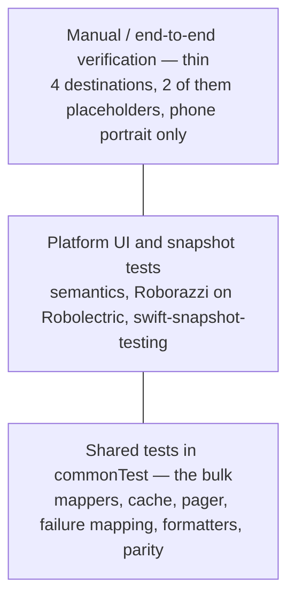

# TESTING.md — Test Strategy and Verification Plan

- **Status:** Active — mixed. The build skeleton (TASK-014), the shared harness with its fixtures (TASK-024), the both-runner gate (TASK-025), the fixture/replay contract entry point (TASK-026) and the scheduled live signal (TASK-027) are merged, and the quality toolchain runs in `check` (TASK-029); there is **no product test yet** — the harness's own tests are the only cases that execute (§Preamble, *Current state vs target state*).
- **Last verified:** 2026-10-02
- **Owner:** QA & Validation Engineer (see `AGENTS.md` §3.6)
- **Authoritative for:** the test strategy, the test-ID inventory, the fixture inventory, the test source-set layout and naming, the test-first workflow as it applies to tests (`DEC-053`), and the requirement → test traceability matrix.
- **Inputs:** [`REQUIREMENTS.md`](REQUIREMENTS.md), [`API_SPECS.md`](API_SPECS.md), [`DESIGN.md`](DESIGN.md), [`UI_SPEC.md`](UI_SPEC.md), [`DECISION_BOARD.md`](DECISION_BOARD.md), `ERROR_FLOW.md`, `CONTRACTS.md`, `PERFORMANCE.md`, `DEFINITION.md`, `CONTRIBUTING.md`, `GUIDELINES.md`, [`../AGENTS.md`](../AGENTS.md)
- **Normative terms:** `MUST` mandatory · `SHOULD` strong recommendation · `MAY` optional.

> This document does not restate requirements, the failure→state→copy chain, performance budgets or the merge gate. Those are owned by `REQUIREMENTS.md`, `ERROR_FLOW.md`, `PERFORMANCE.md` and `DEFINITION.md`; this document references them by identifier.

## Table of contents

1. [Principles](#1-principles)
2. [Test distribution](#2-test-distribution)
3. [Shared tests (`commonTest`)](#3-shared-tests-commontest)
4. [Network testing and fixtures](#4-network-testing-and-fixtures)
5. [Coroutine and time control](#5-coroutine-and-time-control)
6. [Cache and persistence testing](#6-cache-and-persistence-testing)
7. [Image-loading testing](#7-image-loading-testing)
8. [UI tests](#8-ui-tests)
9. [Accessibility testing](#9-accessibility-testing)
10. [Performance testing](#10-performance-testing)
11. [API contract tests](#11-api-contract-tests)
12. [Coverage policy](#12-coverage-policy)
13. [Test organisation, IDs and naming](#13-test-organisation-ids-and-naming)
14. [CI gates](#14-ci-gates)
15. [Flaky-test policy](#15-flaky-test-policy)
16. [Traceability: requirement → test](#16-traceability-requirement--test)
17. [Test case inventory](#17-test-case-inventory)
18. [Change log](#18-change-log)

## Preamble — how this document works

### Test-ID families

| Family | Meaning | Where it runs |
| --- | --- | --- |
| `TEST-UNIT-###` | Deterministic shared-logic tests (`commonTest`) and repository-policy tests (dependency, version, parity, redaction, permission and secret scans). No emulator, no device, no network. | Blocking gate |
| `TEST-CONTRACT-###` | Decoding and mapping tests against committed JSON fixtures (`DEC-030`). `TEST-CONTRACT-007` (`TASK-100`, `B2-R03`) verifies the replay entry point's own selection and report interpretation with disposable TestKit projects. The same IDs also run against the live service in the scheduled non-blocking job (§11). | Blocking gate in fixture/replay mode · scheduled job in live-network mode |
| `TEST-INT-###` | Integration across two or more shared/platform components where a seam is not mocked: transport + cache, image cache independence, `expect/actual` storage. | Blocking gate (both platforms, `DEC-054`) |
| `TEST-UI-###` | Platform UI tests: Compose semantics assertions, Roborazzi snapshots on Robolectric (`DEC-034`), iOS swift-snapshot-testing and preview variants (`DEC-025`). | Blocking gate (Android and iOS, `DEC-054`) |
| `TEST-A11Y-###` | Automated accessibility checks plus the recorded manual checklist entries (`DEC-023`). | Blocking gate (automated) · recorded per milestone (manual) |
| `TEST-PERF-###` | Performance measurements and performance assertions (`DEC-033`). | Non-blocking measurement job · assertions in the gate |

IDs are permanent, like the `REQ-`/`DEC-` namespaces. An ID is never reused for a different behaviour: a test that stops describing its ID is deleted with its ID retired, not repurposed.

### Current state vs target state

- **Current state (2026-10-02):** the Gradle/KMP build skeleton exists (TASK-014, PR #6) with the 11 modules and five route declarations; the repository-policy checks run in the root `check` — `verifyDependencyPolicy` (`TEST-UNIT-013`, `TEST-UNIT-014`, `TEST-UNIT-051`, DEC-061), `verifyRepositoryHygiene` (`TEST-UNIT-026`, DEC-062), `verifyModuleBoundaries` (TASK-017) and `verifyWorkflowGate` (TASK-028); the shared harness with twenty dated fixtures and the `MockEngine`/time-control helpers is merged (TASK-024, PR #52), and its own tests are the only cases that execute today; the fixture/replay contract entry point `:core:data:contractTestReplay` exists and fails on zero cases (TASK-026); the both-runner pull-request gate runs (TASK-025, PR #52) and the quality toolchain is active and blocking — ktlint, Android Lint and `buildHealth` (TASK-029, PR #65), with the Swift toolchain pinned (TASK-030, PR #63). **No product test exists yet**: every `TEST-UNIT-###`/`TEST-CONTRACT-###` case below is the target state until the task that owns it lands its first red test. The activation order is `DEC-071`'s, one harness at a time.
- **Target state:** the layers, IDs, layout and policies defined here, implemented in the Android milestone (M1) and extended in the iOS milestone (M2) (`DEC-040`, `REQ-PLAT-004`).

### Stated assumptions

- **Fixture resources:** Kotlin Multiplatform has no portable resource-access API for tests. Fixtures therefore live in `:core:testing` and are read through one `FixtureLoader` seam with an `actual` per target, which is why `:core:testing` holds them in a main source set rather than a test one. If a platform cannot read packaged fixtures at runtime, the same loader reads them from a per-target test resources directory instead; the loader API does not change. *Assumption — verify when the test source sets are created.*
- **Portrait fixtures:** the committed PNG exports under `docs/figma/` are a pending project task (`CON-005`, `DEC-045`) because the Figma file returns `403` to anonymous clients. Until they land, image-dependent snapshots use one generated neutral test bitmap; the swap to real portrait fixtures is part of that task.

---

## 1. Principles

| # | Principle | Rule |
| --- | --- | --- |
| P1 | Tests exist for behaviour, not for coverage | A test `MUST` assert an observable behaviour, boundary, invariant, state transition, precedence relation or error outcome of the component it names. |
| P2 | No tautological tests | A test `MUST NOT` assert an implementation constant against itself, assert that a mock returned what the mock was configured with, assert only "did not throw", or snapshot an empty or unconfigured tree. |
| P3 | State transitions and precedence are first-class | Where two outcomes can apply, the test `MUST` pin which one wins — for example the `ApiFailure` evaluation order in `API_SPECS.md` §6.1–§6.2 and the `LoadState` precedence owned by `IC-018` in `CONTRACTS.md`. |
| P4 | Incidental behaviour is not pinned | An existing test that pins incidental behaviour (wording, copy of a message, log phrasing, an internal call sequence, a default that no requirement names) `MUST` be deleted, never re-pinned, when the behaviour changes legitimately. |
| P5 | Bugs leave a regression test | A bug fix `SHOULD` leave a failing-before/passing-after test, written as a `TEST-###` case. Where impractical (platform timing, visual drift), the bug report records the manual reproduction that was used instead. |
| P6 | Determinism | Tests `MUST NOT` depend on wall-clock time, real network I/O, real image decoding, real storage or a real device clock (§5). |
| P7 | Fixtures beat hand-rolled mocks at the boundary | The remote boundary is modelled with `MockEngine` + committed fixtures (`DEC-030`), not with hand-written response objects that can drift from the API shape. |
| P8 | Deletion is part of testing | When a behaviour is removed (clean cutover, no shims), its test ids are deleted in the same change. Orphan tests for removed behaviour are dead weight and `MUST NOT` be kept green. |
| P9 | Evidence, not assertions, for budgets and visuals | Snapshots, measurement output and the accessibility checklist are evidence; a passing unit test is not evidence for `AC-REQ-NFR-003-*` (`PERFORMANCE.md`) or for the visual states (`UI_SPEC.md` §8). |
| P10 | Test first | Development follows the red → green → refactor cycle of `DEC-053` (§1.1): the failing test exists before the implementation, and the observed failure is part of the change's evidence. |

### 1.1 Test-first workflow (`DEC-053`)

Development is test-driven, and the commit history preserves the cycle. The process, branching and merge policy are owned by `CONTRIBUTING.md`; the rules that constrain what this document's tests look like are:

| Phase | What happens | Commit |
| --- | --- | --- |
| **Red** | Write the failing test for the next behaviour increment, run it, and observe the failure. The `TEST-###` id, the acceptance criterion and the expected failure are decided here. | `test(<scope>): add failing test for <behaviour>` — the message `MUST` state the observed failure |
| **Green** | The minimal implementation that makes the test pass; run it and observe the pass. | `feat(<scope>): <behaviour>` or `fix(<scope>): <defect>` |
| **Refactor** | Structure only, with the tests still green. If the phase produces no change, say so and commit nothing. | `refactor(<scope>): <change>` |

Rules that follow from `DEC-053` and interact with this plan:

- **Observed red, not implied red.** A change that alters behaviour without a preceding failing test is incomplete; "the test would have failed" is not evidence. The observed red failure and the observed green pass are what `DEFINITION.md` requires for Done — a green suite alone is not proof.
- **The exception is explicit.** Pure documentation, build/CI configuration and tooling changes do not need a red phase. When the exception is used, the change says so.
- **One phase per commit.** Commit granularity follows the phase, not the file: one red commit, one green commit, one refactor commit per behaviour increment. Pushed phase commits are never amended or force-pushed away.
- **Which layer owns the red test** follows §2: shared logic → the owning `:core:*` or `:feature:*` `commonTest`; platform behaviour → that platform's unit test source set; a visual state → the semantics or state test first, with the snapshot baseline recorded only once the state is implemented and correct (§8.2). A baseline `MUST NOT` be recorded from a state that does not yet exist, and no snapshot is ever recorded to make a red run green.
- **Snapshots and measurements are the last step of a behaviour increment, not a substitute for it.** A new screen state needs its state or semantics test before its baseline.
- **Quarantine is not a phase.** A test cannot enter the suite already quarantined; it is quarantined only after failing twice in the blocking set (§15).
- **Interaction with the gate:** `DEC-054` evaluates the **final state** of the pull request, not each commit (§14). The red commit is expected to fail the test suite by design, and that is not a gate violation.

## 2. Test distribution

The pyramid for this project:



| Layer | Source set | Share of test cases | Covers |
| --- | --- | --- | --- |
| Shared logic (the bulk) | `commonTest` of the `:core:*` modules and of each `:feature:*` module | Target ≈ 70 % of cases | Mappers, response cache, pager, `ApiFailure` mapping, formatters, copy/token parity, `IC-###` contracts (§3) |
| Platform unit | Android unit test source sets of `:androidApp` and the feature modules; iOS unit tests in the mirroring Swift packages | Target ≈ 10 % | Android ViewModels, iOS `ObservableObject`s, lifecycle and dispatcher seams, `expect/actual` implementations (§6) |
| Snapshot | `:androidApp` and feature-module Android unit test source sets (Roborazzi); `iosApp/Tests` (swift-snapshot-testing) | Target ≈ 15 % | Component and screen snapshots, state rendering, appearance variants, iOS preview variants (§8) |
| Manual / end-to-end | none (checklists) | Target < 5 % | The flow and the properties no automated layer can own (§2.1) |

The proportions are targets for review judgement, not build gates (`DEC-031`, §12).

### 2.1 Why the top of the pyramid is thin

The product surface is small and bounded by decisions already taken:

- **Four destinations** (`REQ-FUNC-008`): Characters, Episodes, Favorites and Settings. Episodes is a placeholder (`DEC-005`, `DEF-002`) with no data logic to exercise end-to-end; Settings holds three local settings (`REQ-FUNC-033`…`REQ-FUNC-035`, `DEC-055`).
- **One navigable flow:** list → detail → favourite, plus search/filter on the list (`REQUIREMENTS.md` §2).
- **Phone portrait only** (`DEC-027`, `NG-004`): no device matrix, no rotation, no tablet or foldable layouts.
- **No accounts, no authoring, no write paths** (`NG-001`, `NG-002`, `REQ-PLAT-005`).

An automated end-to-end layer would re-exercise what the shared tests and snapshots already prove, while adding a real network, real image decoding and real timers — the three highest-flake ingredients available. It would also add another UI-automation dependency for no acceptance value (`REQ-NFR-002`). It is therefore not built.

**Verified manually instead, on both platforms, recorded per milestone:**

| Manual check | Why it cannot be automated here | Recorded as |
| --- | --- | --- |
| Cold start on a real device with no network → designed error, no crash (`AC-REQ-PLAT-005-1`) | Requires real connectivity state; the automated layers assert the state mapping only | Milestone checklist on the milestone GitHub Issue (`DEC-044`) |
| Card→detail shared-element transition and predictive back (`REQ-FUNC-009`) | Frame-level motion is not asserted reliably by Robolectric or XCUITest | `TEST-UI-008` snapshot plus the manual motion checklist (`TEST-A11Y-006`) |
| Favourites surviving a real process kill (`AC-REQ-FUNC-006-2`) | Process death is a device-level event | `TEST-INT-004` automated where the harness allows, manual entry otherwise |
| Figma parity of every screen | `DEC-024` keeps parity manual; the Figma file is unreachable to anonymous clients (`CON-005`) | `docs/figma/` exports (`DEC-045`) plus milestone review |
| iOS Liquid Glass on iOS 26+ and the material fallback on iOS 18 (`REQ-PLAT-003`) | Glass rendering needs a real device/OS | `TEST-UI-010` snapshot plus manual device entry |
| iOS performance procedure (`DEC-033`) | Documented iOS measurement procedure | `TEST-PERF-001`/`002` counterpart, recorded per `PERFORMANCE.md` |

## 3. Shared tests (`commonTest`)

`commonTest` is the bulk of the suite (§2). It has no Android or Apple types and no network (§4).

### 3.1 Contracts (`IC-###`)

- Every internal contract `IC-###` in `CONTRACTS.md` `MUST` have at least one test in the family that owns its implementation (domain → `TEST-UNIT-###`, data → `TEST-UNIT-###`/`TEST-INT-###`, presentation → `TEST-UNIT-###`).
- The combined requirement → contract → task → test matrix is maintained in `DOCUMENTATION_AUDIT.md` §6; this document owns only the requirement → test half (§16).

### 3.2 What is covered

| Area | Behaviour asserted | Test IDs |
| --- | --- | --- |
| Mappers | DTO → domain for list, detail, episode and error bodies; `species` `"unknown"` → `"Unknown"`; no `type` field used as species; unknown `status`/`gender` values preserved (`AC-REQ-NFR-004-2`); empty `type` and empty reference URL handled | `TEST-UNIT-001`, `TEST-UNIT-002`, `TEST-UNIT-011` |
| Detail model | List-provided header usable before any network response (`AC-REQ-FUNC-002-1`); `episodeSummaries == null` hides "First seen in" while the episode count still renders (`AC-REQ-FUNC-023-2`) | `TEST-UNIT-002`, `TEST-UNIT-011` |
| State holders (shared logic) | Debounce 300 ms, `distinctUntilChanged`, page reset on query/status change, cancellation of the superseded request, blank query sends no `name` parameter, exactly four status options with `All` the default (`REQ-FUNC-003`, `REQ-FUNC-004`) | `TEST-UNIT-003` |
| Favorites logic | Toggle parity, optimistic state, empty set semantics (`REQ-FUNC-006`) | `TEST-UNIT-004` |
| App settings store | `IC-021`/`IC-022` against `FakeAppSettingsStore` and, through the §6.2 suite, both `actual`s: fresh-install defaults (Sounds off, REST), persistence across a simulated restart, atomic `update`, no emission on an equal value, unknown protocol string read as REST, no keys beyond `AppSettings` (`AC-REQ-FUNC-033-2`, `AC-REQ-FUNC-034-1`) | `TEST-UNIT-046` |
| Clear favorites | `clear()` on `IC-008`/`IC-013`: one empty-set emission to every collector, none on an empty store, preferences untouched (`AC-REQ-FUNC-035-2`) | `TEST-UNIT-047` |
| Protocol switch | A `remoteProtocol` change while a page loads cancels it, resets the pager to page 1 and reloads through the other `IC-011` implementation, with no item from the previous protocol ever emitted (`AC-REQ-FUNC-034-2`) | `TEST-UNIT-048` |
| Protocol cache isolation | Same filter and page produce different `CacheKey`s per protocol; a switch neither evicts nor reads the other protocol's entries (`AC-REQ-FUNC-034-4`) | `TEST-UNIT-049` |
| Settings state holder | `IC-023` intent rules: delete confirmation only when favorites exist, exactly one `ClearFavorites` on confirm, none on dismiss, no write for an unchanged protocol (`AC-REQ-FUNC-035-1`, `AC-REQ-FUNC-035-3`) | `TEST-UNIT-050` |
| Failure mapping | Full `ApiFailure` matrix against `ERROR_FLOW.md` and its `API-ERR-###` rows; precedence when several mappings apply; `CancellationException` never surfaced (`AC-REQ-FUNC-022-2`) | `TEST-UNIT-010` |
| Cache | Freshness, stale-while-revalidate and offline windows with an injected fake clock; `DataResult.source` and `isStale`; errors, empty bodies and partial GraphQL responses never cached (`AC-REQ-FUNC-020-3`, `AC-REQ-REL-004-1`) | `TEST-UNIT-009`, `TEST-UNIT-023` |
| Cache identity | Key isolation across pages, filters, protocols and GraphQL field selections (`REQ-REL-001`) | `TEST-UNIT-020` |
| Request coalescing | Two concurrent identical loads produce one network call (`REQ-REL-002`) | `TEST-UNIT-021` |
| Retry boundaries | At most two automatic attempts with backoff and jitter; never retried for schema, validation, decoding, other `4xx` or cancellation (`REQ-REL-003`) | `TEST-UNIT-022` |
| Pager | Reset to page 1; single-page prefetch; dedupe of an in-flight load; cancellation; no `Loading` after `Content` without an explicit reset; stop requesting at `info.next == null` (`AC-REQ-FUNC-001-2`) | `TEST-UNIT-016` |
| Empty results | Filtered REST `404` → `LoadState.Empty`, not an error (`AC-REQ-FUNC-010-1`); clearing filters restores the unfiltered first page (`AC-REQ-FUNC-010-2`) | `TEST-UNIT-005` |
| Retry and refresh intents | Retry starts a fresh attempt budget and clears the error on success (`AC-REQ-FUNC-011-1`); refresh performs a network request even when the cache is fresh and a failed refresh keeps the previous items (`AC-REQ-FUNC-012-1`, `AC-REQ-FUNC-012-2`) | `TEST-UNIT-006`, `TEST-UNIT-007` |
| Formatters | Card and detail formatting including `"unknown"` → `"Unknown"`; episode count and dimension derivation; no platform types in signatures (`AC-REQ-NFR-001-2`) | `TEST-UNIT-001`, `TEST-UNIT-002`, `TEST-UNIT-012` |
| Localisation | Every canonical copy key resolves in `en` and `es` and follows the device locale (`REQ-FUNC-013`) | `TEST-UNIT-008` |
| Copy-key parity | Canonical key list (`DEC-020`) ↔ Android resource file ↔ iOS resource file: no key missing, no extra key, no divergent default (`REQ-UX-008`) | `TEST-UNIT-036` |
| Token parity | Hand-written tokens (`DEC-022`) ↔ committed `tokens.json`: value drift fails (`REQ-UX-002`) | `TEST-UNIT-035` |
| Platform purity and layering | `:core:domain` declares no project module and no platform, HTTP, UI or persistence dependency (Kotlin stdlib + `kotlinx-coroutines-core` only, `DEC-066`; the external half is `R14` of `verifyModuleBoundaries`); no DTO outside `:core:data` and the feature data packages; no platform UI code in shared source sets; no module graph violation of the rules in §13.1 (`REQ-NFR-001`, `REQ-PLAT-001`) | `TEST-UNIT-012`, `TEST-UNIT-017` |
| Security and observability policies | The build, dependency and policy checks of §3.3 — `TEST-UNIT-025`…`034` (host allow-list, secret scan, persisted-field inventory, no mic/speech permission, log redaction, advisory register, reporting route, logging contract, debug surface, no analytics) | `TEST-UNIT-025` … `TEST-UNIT-034` |
| Test-first discipline | Repository-history check used as review evidence for `DEC-053`: a behaviour-changing PR carries a phase sequence whose red commit added the test and whose message states the observed failure; the exception list is documentation, build/CI configuration and tooling | `TEST-UNIT-041` §1.1 |
| Kotlin→Swift parity | The iOS feature packages call every member of the `IC-###` types they consume (a rename or removal fails the iOS build), each sealed-hierarchy and enum case is constructed once in an iOS test so a new case cannot fall through silently, and a bridging test mutates shared state and asserts the Swift-observed value changes (`CONTRACTS.md` §9.4) | `TEST-UNIT-042` |

### 3.3 Build, dependency, platform and policy checks

**Reproduced red evidence (`TASK-088`).** A post-merge review reproduced four false negatives in the first implementation; each was observed here in a disposable full clone before the correction and re-observed as a failure after it: an effective feature→feature edge declared in a custom configuration inherited by `commonMainImplementation` (now `R7`); `:core:designsystem` declaring Ktor directly and through an inherited configuration (now `R15`); a `navigation/` file with no destination, including one whose destination appears only in a comment (now `S1`); and `domain`/`presentation` files declaring a `.wrong` Kotlin package (now `S3`). The complementary controls pass: a permitted Compose dependency, a `NavHost` mention inside a comment or string, correct `domain`/`presentation` packages, the five real destinations, and the clean tree on both a cold and a configuration-cache-reused run. The boundary check has no durable test source set yet (adding one needs a dependency the policy does not currently admit), so the matrix is the recorded evidence (`LOG-0050`).

These run with the shared suites (no emulator, no network) even though several of them inspect build configuration rather than Kotlin behaviour. They are tests, not review conventions, because a policy that is only remembered is a policy that decays.

| Test ID | Assertion |
| --- | --- |
| `TEST-UNIT-012` | `:core:domain` has no dependency on platform, HTTP or UI libraries, and no DTO type appears in a signature outside `:core:data` and the feature data packages (`REQ-NFR-001`) |
| `TEST-UNIT-013` | Every declared dependency has a named rationale, and no concern is served by more than two solutions (`REQ-NFR-002`) |
| `TEST-UNIT-014` | **Implemented** as `./gradlew verifyDependencyPins` (plugin `multiverse.dependency.policy`): P1–P8 own the exact pins, the single catalog and the wrapper checksum; P9 owns the single `VERSION` source — the file exists, holds exactly one `MAJOR.MINOR.PATCH` value, and no second version literal (`versionName`, `versionCode`, `version = "…"`) exists in any build script (`TASK-018`). The Android artifact paths depend on this task (`TASK-089`), and the iOS `CFBundleShortVersionString` wiring is `AC-REQ-NFR-006-3` at `TASK-051` (`AC-REQ-NFR-006-1`, `AC-REQ-NFR-006-2`, `DEC-061`, `DEC-067`) |
| `TEST-UNIT-051` | The dependency inventory in `README.md` §15 lists exactly the version-catalog libraries and plugins, with their pinned versions and their declaration state derived from the build scripts, and `README.es.md` mirrors it (`AC-REQ-NFR-002-1`) |
| `TEST-UNIT-015` | Every documented local gate command resolves to a task the invocation would actually select, and every row's claimed coverage is honoured by that invocation's **effective** (transitive) graph, including the included build's regression suite; the English and Spanish command tables stay aligned (`AC-REQ-NFR-007-1`; hardened by `TASK-103`, `B2-R06`) |

| `TEST-UNIT-017` | **Implemented** as `./gradlew verifyModuleBoundaries` (plugin `multiverse.module.boundaries`, root `check`), rules `R1`–`R16`: no `:feature:*` → `:feature:*` edge; the **required leaf set** of ADR-0001 is asserted (`R16`, `TASK-091`/`GAP-014`), a `:feature:*` path outside the accepted five is unknown, and containers are not leaves; `:core:domain` with no project dependency (`DEC-066`); `:core:data`/`:core:presentation` only `:core:domain`; `:core:designsystem` no project dependency and **Compose-only externals** (`R15`, `DESIGN.md` §3.4 rule 4); `:core:testing` consumed from test source sets only; `:androidApp` composes the features and the design system; `:core:ios` only its ADR-0012 edges and never from an Android source set; an unrecognised module or edge fails closed. Edges are the **effective** project and external dependencies of each architecture-relevant configuration — its own plus everything reachable through `extendsFrom` — with the configuration and source set that carry them and the configuraton that declared them (`REQ-NFR-001`, `REQ-NFR-009`, `DEC-052`, `DEC-057`, `DEC-066`, `DEC-069`); the toolchain's implicit `kotlin-stdlib` is not an architecture choice and is excluded. |
| `TEST-UNIT-018` | Android `minSdk` is 26 and `compileSdk`/`targetSdk` are 37, asserted from the resolved build configuration (`AC-REQ-PLAT-002-1`) |
| `TEST-UNIT-019` | The Android milestone assembles with the iOS app absent (`AC-REQ-PLAT-004-1`) |
| `TEST-UNIT-024` | No test source set outside `contract-live` contains a live API host literal (§4.1) |
| `TEST-UNIT-025` … `TEST-UNIT-034` | The security and observability policies of §3.2, one assertion per row: host allow-list, secret scan, persisted-field inventory, absence of microphone/speech permissions in both shipped apps, log redaction, advisory register, vulnerability-reporting route, single logging contract, debug-only diagnostics, no analytics artefact |
| `TEST-UNIT-026` | **Implemented** as `./gradlew verifyRepositoryHygiene` (`TEST-UNIT-026`, build root, DEC-062). It scans the commit-eligible working set (tracked plus untracked, non-ignored files) and every unique blob reachable from all local refs for twelve credential classes, holds the path rules `HYG-01`…`HYG-07` (ignored sentinels, no tracked ignored or prohibited path, no credential carrier in history, no symlink escape, no submodule), fails closed on a shallow or non-Git checkout, and prints findings without the matched value (`AC-REQ-SEC-002-1`) |
| `TEST-UNIT-035`, `TEST-UNIT-036` | Token parity against `tokens.json`, and copy-key parity across the canonical key list, the Android resources and the iOS resources |
| `TEST-UNIT-041` | The repository history of a behaviour-changing change carries the `DEC-053` phase sequence, used as review evidence and never as a substitute for the observed red failure |
| `TEST-UNIT-043` | **Implemented, staged (`DEC-068`)**, rules `S1`–`S3`, content-aware: `S1` requires a real typed destination (`@Serializable` + `data object`/`data class`, or a `@Serializable` sealed/enum route per `DESIGN.md` §4.2) in the feature's own `navigation` package — a directory name, a comment or a string does not count; `S2` rejects executable code that names the app-wide `NavHost` with comments and string literals masked; `S3` requires the feature's real Kotlin packages `….domain` and `….presentation` once production source exists outside the route declaration. |
| `TEST-UNIT-044` | The required-check set of §14.2 is present and blocking in the workflow configuration, and the contract suite runs in fixture/replay mode rather than live-network mode (`AC-REQ-NFR-011-1`, `AC-REQ-NFR-011-2`) |
| `TEST-UNIT-045` | **Implemented** (`TASK-093`, `DEC-078`). A behaviour change reaches `main` only through a branch and a pull request: `WorkflowGateGuard` rejects any step that merges, tags, releases or pushes (`gh pr merge`, `git tag`, `git push`, release actions, `contents: write`), and reads comment lines as absent, so a command mentioned only in a comment is a missing check (`AC-REQ-FUNC-014-1`, `AC-REQ-FUNC-014-2`) |
| `TEST-UNIT-046` | The Swift quality scripts fail closed (`TASK-099`, `B2-R02`, `GAP-023`): the selected Xcode must equal the locked 27.0, the resolved formatter must belong to that toolchain, an override is validated against the same pin, an unresolvable tool is a failure rather than a warning, the archive SHA-256 is verified before extraction, Bash 3.2 arrays keep paths with whitespace intact, and the exit codes are `0` clean / `1` failure / `2` empty input. Proved by `tools/swift-tools-test.sh` with controlled fake executables (9 seeds) and by the real pinned tools end to end |
| `TEST-UNIT-047` | **Awaiting implementation** (`TASK-104`, `B2-R07`). The observation path offline: the four probe requests and POST serialization, transport-failure classification as status `0`, the timeout configuration, interruption, malformed bodies, every JSON type (string, number, boolean, null, object, array, missing), header preservation, partial persistence after an interrupted probe, and stale-capture prevention. Transport and time are injected; no socket and no real sleep |

Assertions about the build that a Gradle task cannot express (branch protection naming every required check, for example) stay human actions and are recorded as such in §14.2.

## 4. Network testing and fixtures

### 4.1 Rule: no test performs real network I/O

- No test in `commonTest`, `androidHostTest`, `androidDeviceTest` or `iosTest` `MUST` open a socket (`DEC-069`). The remote boundary is always Ktor `MockEngine` (`DEC-030`) or a fake seam.
- The only test code allowed to contact `rickandmortyapi.com` is the `contract-live` source set of the scheduled job (§11). `TEST-UNIT-024` enforces this by scanning the other test source sets for live host literals.
- `MockEngine` responses are served from the committed fixtures in §4.3; a test `MUST NOT` inline a response body, because inlined bodies drift from the captured API shape silently.

### 4.2 Layer split

| Concern | Mechanism | Layer |
| --- | --- | --- |
| DTO decoding, mapping, failure classification, pager behaviour | Ktor `MockEngine` + fixtures | `commonTest` (`TEST-UNIT-###`, `TEST-CONTRACT-###`) |
| HTTP disk-cache policy: freshness headers, revalidation, and the REST `404` → `Cache-Control: no-store` rewrite required by `API_SPECS.md` §7.1 | Android integration test with `MockWebServer` behind the OkHttp engine, because `MockEngine` does not exercise OkHttp's cache | `androidHostTest` (`TEST-INT-001`) |
| Live API shape | Scheduled live-mode run of the same contract IDs plus observation probes | `contract-live` (§11) |

### 4.3 Fixture inventory

Fixtures live in `:core:testing` at `core/testing/src/commonMain/resources/fixtures/` and are read through the single `FixtureLoader` seam (see *Stated assumptions*). Every feature and core test source set gets them through the `:core:testing` test dependency, which is why they are not duplicated per module (`DEC-052`). Each `*.json`/`*.txt` fixture is committed next to a `*.meta.json` sidecar recording: capture date (ISO 8601), request URL, HTTP status, the headers that matter for caching, and the live API observation it pins.

| Fixture | Captured from | What it pins | Used by |
| --- | --- | --- | --- |
| `character-page-01.json` | `GET /character?page=1` | First page: 20 items, non-null `info.next`, `info.count` present | `TEST-CONTRACT-001`, `TEST-UNIT-001`, `TEST-UI-001` |
| `character-page-21.json` | `GET /character?page=21` | Middle page: both `info.prev` and `info.next` non-null | `TEST-CONTRACT-001`, `TEST-UNIT-016` |
| `character-page-42.json` | `GET /character?page=42` | Last page: `info.next == null` terminates pagination | `TEST-CONTRACT-001`, `TEST-UNIT-016` |
| `character-page-beyond-last-404.json` | `GET /character?page=43` | Beyond-the-end `404` error envelope | `TEST-CONTRACT-001`, `TEST-UNIT-016` |
| `character-filter-empty-404.json` | `GET /character?name=zzzznotreal` | Filtered `404` with the error body — maps to `Empty`, never to an error | `TEST-UNIT-005`, `TEST-INT-001` |
| `character-detail.json` | `GET /character/{id}` | Detail object: episode URL list, `origin`/`location` shape, `image` URL | `TEST-UNIT-002`, `TEST-CONTRACT-002`, `TEST-UI-002` |
| `character-detail-empty-type.json` | `GET /character/{id}` (character with `type: ""`) | Empty `type` string does not break mapping or display | `TEST-CONTRACT-002`, `TEST-UNIT-002` |
| `character-detail-unknown-reference.json` | `GET /character/{id}` (origin/location URL `""`) | `unknown` values and an empty reference URL survive mapping | `TEST-CONTRACT-003`, `TEST-UNIT-010` |
| `character-detail-unknown-enums.json` | Synthesised from a live capture, dated in the sidecar | An unknown `status`/`gender` string is preserved, not crashed on (`AC-REQ-NFR-004-2`) | `TEST-CONTRACT-003`, `TEST-UNIT-001` |
| `character-batch-mixed.json` | `GET /character/1,99999` | Batch array containing only the resources that exist | `TEST-CONTRACT-001`, `TEST-UNIT-011` |
| `character-batch-all-invalid.json` | `GET /character/99998,99999` | All-invalid batch: `200` with `[]` | `TEST-CONTRACT-001`, `TEST-UNIT-011` |
| `episode-batch.json` | `GET /episode/{ids}` | Episode batch used for enrichment and `air_date` mapping | `TEST-UNIT-011`, `TEST-CONTRACT-002` |
| `malformed-body.txt` | Truncated JSON, derived from `character-page-01.json` | Malformed JSON → `MalformedResponse` (`AC-REQ-NFR-004-1`) | `TEST-CONTRACT-003`, `TEST-UNIT-010` |
| `empty-body.txt` | Zero-length `200` | Empty body → `EmptyBody`, never cached | `TEST-CONTRACT-003`, `TEST-UNIT-010` |
| `graphql-errors-only.json` | Live GraphQL query | `data == null` with a non-empty `errors` array → `ApiFailure.GraphQl` | `TEST-CONTRACT-004`, `TEST-UNIT-010` |
| `graphql-partial-with-errors.json` | Live GraphQL query | Usable data plus `errors`: mapped with warnings only when every required field is valid, and never cached | `TEST-CONTRACT-004`, `TEST-UNIT-009` |
| `graphql-null-root.json` | `character(id:"99999")` | `{"data":{"character":null}}` with HTTP `200` → `NotFound` | `TEST-CONTRACT-004`, `TEST-UNIT-010` |
| `graphql-empty-filter.json` | Empty-filter GraphQL query | All `info` fields null with `results: []` → empty result, not a malformed response | `TEST-CONTRACT-004` |
| `graphql-validation-error-400.json` | Live GraphQL query with an unknown field | HTTP `400` with `GRAPHQL_VALIDATION_FAILED` → `InvalidRequest`, non-retryable | `TEST-CONTRACT-004`, `TEST-UNIT-022` |

The GraphQL fixtures exist because GraphQL is a shipped, user-selectable protocol (`DEC-056`, `REQ-FUNC-034`): `API_SPECS.md` §5 and §10.2 describe shipped behaviour, and protocol parity (`TEST-CONTRACT-005`) proves both protocols map to equal domain values (`AC-REQ-FUNC-034-3`).

### 4.4 Keeping fixtures in sync with the live API

1. Fixtures are only ever refreshed from a **passing** scheduled live-contract run (§11), never edited by hand and never invented.
2. The refresh is a normal change: the refreshed files, their date-stamped sidecars and the resulting test changes land in one PR.
3. When a live capture changes shape or semantics, the fixture-based contract tests fail first. The PR then either (a) fixes the mapping, or (b) updates the fixture **and** the owning document (`API_SPECS.md`, `REQUIREMENTS.md` or `ERROR_FLOW.md`) in the same change (`DEC-046`). A fixture update with no document update `MUST` be rejected in review.
4. A fixture whose capture date is older than the API's last documented change `SHOULD` be refreshed on the next scheduled run touching that resource.
5. Published totals and headers captured in a sidecar (for example the character count and `Cache-Control` values observed on 2026-09-29) are recorded as dated observations, never as constants in application or test code (`RISK-006`).

## 5. Coroutine and time control

| Rule | Detail |
| --- | --- |
| `TestDispatcher` everywhere | Every suspending subject under test runs on an injected `TestDispatcher`; production code takes a dispatcher provider, never `Dispatchers.Default` directly. |
| Virtual time, not real time | The 300 ms debounce (`REQ-FUNC-003`), backoff (`API_SPECS.md` §6.3) and cache windows are advanced with `advanceTimeBy`/`advanceUntilIdle`. |
| No `delay` and no `Thread.sleep` in tests | A test `MUST NOT` wait on real time. Waiting for a real timeout is a defect in the test, not a cost of testing. |
| Injected clock for freshness | Cache freshness and staleness are computed from an injected clock (`DEC-012`, `DEC-018`). Tests supply a fake clock and move it explicitly; a system-clock change `MUST NOT` alter freshness evaluation (`AC-REQ-REL-004-1`). This is covered by `TEST-UNIT-023`. |
| Cancellation assertions | Cancellation is asserted, not inferred: a superseded search or a closed screen `MUST` cancel its in-flight job. The test asserts that the cancelled work produced no state emission, that the cancellation propagated (`assertFailsWith<CancellationException>` where the seam is a suspend call) and that no `ApiFailure` was emitted (`AC-REQ-FUNC-022-2`). Covered by `TEST-UNIT-003`, `TEST-UNIT-016`. |
| Timeout policy | Connect/read/call timeouts (`API_SPECS.md` §6.3) are configured values; tests assert the configured values are applied to the client builder, and assert the timeout **outcome mapping** through `MockEngine` failure injection rather than by waiting. |
| Structured concurrency | A test `MUST` fail on an unhandled child coroutine; leaked scopes are a defect and surface as a failing test, not a warning. |

## 6. Cache and persistence testing

### 6.1 Shared layer: fakes with contract semantics

| Seam | Fake | Contract the fake `MUST` honour |
| --- | --- | --- |
| `CacheStorage` (bytes/metadata per key) | `FakeCacheStorage` — in-memory map with an injectable clock and an optional failure mode | Reads return exactly what was written; entries never outlive their configured retention; a read for an absent key is a miss, not an exception; write failures surface as a cache miss plus a warning, never as a user-visible failure (`REQ-FUNC-020`). |
| Favorites store | `FakeFavoritesStore` — a `Flow`-backed ID set | Emissions are ordered and conflated per the `IC-###` contract in `CONTRACTS.md`; a toggle is idempotent per ID; observation survives a simulated restart when the fake is reused, which is what makes `AC-REQ-FUNC-006-2` testable without a device. |
| Clock and connectivity | `FakeClock`, `FakeConnectivity` — both live in `:core:testing` so every feature test shares one implementation | Only the fake decides freshness and online/offline; no test reads the host clock or the host network. |

Fakes and fixtures live in `:core:testing` (`DEC-052`), so a feature test adds one test dependency and gets the shared doubles, the JSON fixtures and the dispatcher/clock helpers. A feature `MUST NOT` re-implement a double that `:core:testing` already provides; diverging doubles are how two features end up asserting different semantics for the same `IC-###` contract.

Fakes are behaviourally faithful to the production seam. A fake that returns what it was configured with, with no logic of its own, is not evidence (P2) — it belongs to a throwaway script instead. Under the test-first cycle (§1.1), the fake is written or extended in the red phase together with the failing test, not after the implementation.

### 6.2 `expect/actual` implementations: one shared contract suite

`DEC-017` defines one favorites seam with two implementations (Android DataStore, iOS `UserDefaults`). Both `actual`s `MUST` be measured against **one** shared contract suite so the semantics cannot drift per platform:

- `TEST-INT-003` — the favorites store contract, written once and executed against both implementations: toggle, observe, concurrency of two toggles, empty set, large set, restart persistence, and no leakage of IDs across a simulated reinstall/clear.
- `TEST-INT-004` — platform storage integration: the real Android DataStore file store and the real iOS `UserDefaults`-backed store are exercised from their platform source sets against the same contract, including the persistence-across-restart case.

### 6.3 What cannot be tested in `commonTest`, and what replaces it

| Not testable in `commonTest` | Replaced by |
| --- | --- |
| DataStore's real file I/O, corruption recovery and migration behaviour | `TEST-INT-004` in `androidHostTest` against a real (non-robolectric-mocked) store, or a device test (`androidDeviceTest`) where the harness requires it |
| `UserDefaults` persistence across a real process restart | `TEST-INT-004` in `iosTest`, plus the manual milestone entry in §2.1 |
| Platform `HttpCache`/`URLCache` disk behaviour | `TEST-INT-001` on Android (OkHttp + `MockWebServer`); the iOS side is covered by the same contract executed against `URLCache` in `iosTest` where the harness allows, otherwise by the manual checklist |
| Keychain/Keystore, permissions, background execution | Out of scope — the app stores no secrets and requests no runtime permission (`REQ-SEC-002`, `REQ-SEC-004`) |

### 6.4 Feature-scoped cache and persistence coverage

`:core:data` owns the seams, but each feature owns the policy it applies to them (`DEC-052`). These cases belong to the feature module's own `commonTest`, not to `:core:data`:

- `TEST-UNIT-037` — `:feature:discovery`: a repeat visit inside the fresh window renders without a network request, the stale path sets the stale indicator, and offline with no entry produces the offline state rather than an empty list (`REQ-FUNC-020`, `REQ-PLAT-005`).
- `TEST-UNIT-038` — `:feature:discovery`: a refresh bypasses freshness, and a failed refresh leaves the previously displayed items intact (`REQ-FUNC-012`).
- `TEST-UNIT-039` — `:feature:character-detail`: a cached detail hit performs no network request, and an uncached detail miss loads the detail while the list-provided header stays rendered (`REQ-FUNC-002`, `REQ-FUNC-020`).
- `TEST-UNIT-040` — `:feature:favorites`: the observed favourite ID set drives the list and its empty state, and the detail toggle is reflected in both without a refetch (`REQ-FUNC-006`).

These cases use the `:core:testing` fakes and the injected clock; they `MUST NOT` reach a real store, which is what keeps them deterministic while still proving the feature's caching behaviour.

## 7. Image-loading testing

| Rule | Detail |
| --- | --- |
| No network in tests | Screens take an image loader through a seam. Previews, snapshot tests and semantics tests install a `FakeImageLoader` (or an equivalent in-memory loader) that returns the test bitmap synchronously. Design-system components already take primitives only (`DESIGN.md` §3), so no component test needs the real pipeline. |
| Cache key | The image cache key is the image URL, on both platforms (`UI_SPEC.md` §5.1, `API_SPECS.md` §7.4). Tests assert the key passed to the loader equals the character's `image` URL — for the card, the hero and the accent extraction — so a future transformation of the URL cannot silently split the cache. |
| Placeholder → content → error | `TEST-UI-004` asserts the three states: placeholder, then content after a crossfade, then the branded portal mark at 40 % opacity on failure. The error state is asserted by state, never by a broken-image glyph (`AC-REQ-FUNC-005-2`). |
| Resolution claim | A test asserts the requested decode size stays within the documented 300×300 source; no test or component may request or claim a larger source (`AC-REQ-FUNC-005-3`, `CON-002`). |
| Image bytes never in the JSON cache | `TEST-INT-002` asserts that rendering an image leaves the response cache untouched and that JSON entries contain no image bytes (`AC-REQ-FUNC-021-2`). |
| Second render issues no network request | `TEST-INT-002` asserts the loader performs no network call for an already-cached URL (`AC-REQ-FUNC-021-1`). |
| Accent extraction without real bitmaps | `CharacterAccentResolver` (`DESIGN.md` §4.4, `UI_SPEC.md` §5.4) takes its pixels from an injectable pixel source, so the *policy* is tested with a tiny synthetic bitmap or a stubbed quantizer: that tone 30 is used, that the hue/chroma clamp is applied, that Portal Green is the fallback, and that results are memoised per URL. |
| Accent memoisation | The memoisation test counts invocations of the underlying extraction: two requests for the same URL perform one extraction; distinct URLs perform one each; the LRU evicts in the documented order. A platform test with a real bitmap `MAY` additionally assert the extracted tone against the reference values in `UI_SPEC.md` §5.4, but it is not the primary evidence (P6). |

## 8. UI tests

Both platforms assert the **state** they render against `ERROR_FLOW.md` (canonical failure→state→copy) and `UI_SPEC.md` §8 (visuals). Neither file is restated here.

### 8.1 Android — Compose semantics assertions

| Assertion | Test ID | Notes |
| --- | --- | --- |
| A card is one merged semantics node with description "Rick Sanchez, Alive, Human, button"; the portrait inside it is decorative | `TEST-UI-013` | `AC-REQ-UX-005-1`; the exact string comes from the canonical copy list (`DEC-020`) |
| The status is announced as a text label with its dot, not by colour alone | `TEST-UI-013` | `REQ-UX-005` |
| The favourite control exposes its toggled state | `TEST-UI-005`, `TEST-UI-013` | `AC-REQ-FUNC-006-1` |
| The mic control is absent from the semantics tree | `TEST-UI-013` | `DEC-002`, `REQ-SEC-004`: voice search is deferred and the MVP ships no mic |
| List renders the first page without fetching later pages; the paging indicator is the last item | `TEST-UI-001` | `AC-REQ-FUNC-001-1` |
| Detail renders the list-provided header before the network responds, and shows the inline retry when the detail fetch fails with cached list data | `TEST-UI-002` | `AC-REQ-FUNC-002-1`, `AC-REQ-FUNC-002-3` |
| Filter chips show exactly four options with `All` selected by default, and a selection resets to page 1 | `TEST-UI-003` | `REQ-FUNC-004` |
| Four destinations, in the order Characters · Episodes · Favorites · Settings, are reachable in one tap from any other; "Browse characters" switches destination without pushing a route | `TEST-UI-007` | `AC-REQ-FUNC-008-1`, `AC-REQ-FUNC-008-2` |
| Settings shows Sounds, Data source and Delete favorites in order with the canonical copy; the switch/toggle and the picker expose their state; "Delete favorites" is disabled with no favorites, opens the confirmation otherwise, "Cancel" changes nothing and "Delete" leaves Favorites on its empty state (Android semantics test plus the iOS state-holder and snapshot cases) | `TEST-UI-017` | `AC-REQ-FUNC-033-1`, `AC-REQ-FUNC-034-1`, `AC-REQ-FUNC-035-1`, `AC-REQ-FUNC-035-2`, `AC-REQ-FUNC-035-3` |
| Empty results state names the active query and offers "Clear filters" | `TEST-UI-009` | `REQ-FUNC-010` |
| Splash lasts within its window, exposes an indeterminate progress indicator, and completes with no network | `TEST-UI-006`, `TEST-A11Y-001` | `AC-REQ-FUNC-007-1`, `AC-REQ-FUNC-007-2`, `AC-REQ-FUNC-007-3` |
| First launch with no network shows the designed error state, not a crash | `TEST-UI-011` | `AC-REQ-PLAT-005-1` |
| One rendered state per `ERROR_FLOW.md` state, on both list and detail surfaces | `TEST-UI-016` | `AC-REQ-UX-009-1` |

### 8.2 Android — Roborazzi screenshot tests

- Roborazzi runs on Robolectric (`DEC-034`); no emulator is required for the blocking gate.
- Baselines are **committed** (`DEC-024`). A missing baseline is a failure, not an auto-accept.
- Every screen and component snapshot is captured **twice** — system light and system dark — and the two images `MUST` be byte-identical (`REQ-UX-001`, `AC-REQ-UX-001-1`, `TEST-UI-012`).
- Component snapshots cover `CharacterCard`, `StatusBadge`, `StatTile`, `InfoListItem`, the skeleton states and the error/empty/stale states (`TEST-UI-016`).
- **Baseline update rule:** regenerating a baseline is a deliberate, reviewed change of the visual contract.
  1. The change `MUST` cite the `UI_SPEC.md` section (and the token, component or state) it implements; a baseline update without a corresponding `UI_SPEC.md` change `MUST` be rejected in review.
  2. The PR `MUST` contain the diff images — before and after — for every changed baseline.
  3. A baseline update that is described as "just noise", "flaky" or "to make CI green" `MUST` be rejected: that is a §15 quarantine matter.
  4. Baselines are never regenerated wholesale. A mass regeneration in one commit is treated as an unreviewed visual change.
- Figma parity stays manual (`DEC-024`); the committed PNG exports under `docs/figma/` (`DEC-045`) are the comparison source once they land.

### 8.3 iOS — snapshot tests and previews

- `swift-snapshot-testing` with committed baselines, plus SwiftUI previews as the development-time surface (`DEC-025`).
- Required variants beyond the default:
  - **Reduce Transparency on** — glass is replaced by the opaque material (`REQ-UX-007`, `TEST-UI-015`).
  - **Largest Dynamic Type size** — the detail renders without clipping and the grid collapses to one column (`REQ-UX-006`, `TEST-UI-014`).
  - **Liquid Glass and the pre-iOS-26 material fallback** — both paths snapshot-tested so the fallback cannot drift (`REQ-PLAT-003`, `TEST-UI-010`).
- The Android assertions with no iOS equivalent (Compose semantics tree) are covered on iOS by the recorded accessibility checklist (§9). XCUITest-style UI automation is still not part of the suite: the iOS side of the required gate is the unit, state-holder and snapshot suites (§14, `DEC-054`), and the checklist carries the traversal-order and on-device behaviour claims.

## 9. Accessibility testing

`DEC-023` splits accessibility into automated checks and a recorded manual checklist.

### 9.1 Automated checks

| Check | Platform | Test ID |
| --- | --- | --- |
| Splash loading indicator labelled "Loading characters" and exposed as indeterminate progress (`UI_SPEC.md` §9) | Android semantics, iOS accessibility label with the updates-frequently trait | `TEST-A11Y-001` |
| Merged card node, status label, favourite toggled state present in the accessibility tree | Android semantics (`TEST-UI-013`); iOS via snapshot plus checklist | `TEST-A11Y-004` |
| Every text/background pair used in the app appears in the contrast record with its measured ratio | Both | `TEST-A11Y-002` |
| Contrast ratios meet the body and large-text thresholds of `REQ-UX-003`, including on dynamic tints at tone 30 | Both | `TEST-A11Y-002` |
| Every interactive control's measured target size meets `REQ-UX-004` | Both | `TEST-A11Y-003` |
| Largest text scale and grid collapse behaviour | Both (snapshot variant `TEST-UI-014`) | `TEST-A11Y-005` |
| Reduce Motion and Reduce Transparency behaviour | Both (snapshot variants `TEST-UI-015`) | `TEST-A11Y-006` |

Automated checks cover what a test can assert deterministically: the presence and shape of accessibility metadata, contrast of the recorded pairs, and target sizes from the layout definitions. Automated checks `MUST NOT` claim to prove screen-reader behaviour.

### 9.2 Recorded manual checklist (`DEC-023`)

Completed once per milestone (M1, M2) on a real device and recorded as evidence (§9.3):

| Item | Method |
| --- | --- |
| Contrast ratios | Measured with a colour-picker tool on device screenshots, in addition to the automated `TEST-A11Y-002` record; includes card tints, glass surfaces and the stale banner |
| Touch targets | Measured on device with the accessibility inspection overlay against `REQ-UX-004` |
| Screen-reader traversal order | TalkBack and VoiceOver run of the four destinations: card → filter → list → detail → favourite, in a logical order, with no unreachable control and no unlabelled image |
| Text scaling | System text size at maximum: list, detail, empty and error states checked for clipping, truncation and grid collapse |
| Reduce Motion | System Reduce Motion on: shared-element/zoom transition becomes a cross-fade and the splash pulses instead of spinning (`REQ-UX-007`) |

### 9.3 Where the evidence is stored

| Evidence | Location |
| --- | --- |
| Automated test reports and coverage reports | The CI run that produced them, retained per `DEFINITION.md`; the run is linked from the PR description |
| Snapshot baselines and their diffs | Committed in the repository (`DEC-024`); the diff images live in the PR that changes them |
| Completed accessibility checklist, manual motion checks and performance-procedure results | Recorded on the milestone's GitHub Issue (`DEC-044`) using the test-case template (`DEC-051`), and referenced from the milestone's DoD in `DEFINITION.md` |
| Design-parity comparison images | Committed PNG exports under `docs/figma/` (`DEC-045`, `CON-005`) |

## 10. Performance testing

- **Budgets and reference device are owned by `PERFORMANCE.md` (`PERF-###`).** No budget value, device name or measurement threshold is repeated here; `REQ-NFR-003` and `DEC-033` are the references.
- **Automated (Macrobenchmark, Android):**

  | Test ID | Measurement | Type |
  | --- | --- | --- |
  | `TEST-PERF-001` | Cold start to Discovery, on the reference device, using the method defined in `PERFORMANCE.md` | Measurement |
  | `TEST-PERF-002` | Scroll frame timing over the populated grid | Measurement |

- **Automated (assertion, in the blocking gate):**

  | Test ID | Assertion |
  | --- | --- |
  | `TEST-PERF-003` | A cached page render issues **zero** network requests (`AC-REQ-NFR-003-3`). This is an assertion, so it runs with the shared tests rather than with the measurement job. |

- **Manual:** the documented iOS measurement procedure (`DEC-033`) and iOS startup/scroll evidence, recorded per milestone as in §9.3.
- Measurement jobs run in the same scheduled, non-blocking manner as the live contract job (§11). Whether a budget miss blocks a milestone is decided by `DEFINITION.md` and `PERFORMANCE.md`, not here.

## 11. API contract tests

`DEC-029` split the test layers; `DEC-054` keeps that split while making the contract suite itself part of the required set. The two requirements — "the entire test suite is green before merge" and "no network-dependent flakiness in the gate" — are reconciled by running the same contract IDs in two modes:

- **Fixture/replay mode — required on every pull request.** The contract tests run against the committed fixtures (§4.3) and open no socket. This is deterministic, it is required, and it fails the pull request when the client's decoding or mapping is wrong.
- **Live-network mode — scheduled, non-blocking.** The same IDs run against `rickandmortyapi.com`. `CON-001` is why this mode is not a merge blocker (§11.2).

### 11.1 What runs

| Mode | Test IDs | Asserts against | Blocking |
| --- | --- | --- | --- |
| Fixture mode (gate) | `TEST-CONTRACT-001`…`TEST-CONTRACT-005` | Committed fixtures only (§4.3) | Yes |
| Live mode (scheduled) | The same IDs, executed with a live engine (`TASK-027`, re-scoped by `DEC-074`: the probes and the schedule land now, each case's live replay activates with the task that creates it) | The real service: page decoding, `info.next` termination, single-object vs batch-array shape, filtered `404` → empty result, detail `404` → `NotFound`, combined-filter URL encoding across pages, empty `type`, `unknown` values and empty reference URLs, malformed/empty bodies, `429` and `5xx` mapping, GraphQL envelope cases and REST/GraphQL domain parity | **No** |
| Observation probes (scheduled) | `TEST-CONTRACT-006` | Dated observations that feed fixture refresh: published totals and page count, `Cache-Control`/`ETag` presence, cacheability of filtered `404` responses, batch behaviour with mixed validity, `info.next` type, validation-error shape | **No** |
| Live observation case (scheduled) | `TEST-CONTRACT-006`, executed by `./gradlew :core:data:contractLiveTest` | The observation record carries its date and the request it made, and its status is a real one (or `0` for a transport failure) rather than an invented guarantee (`TASK-027`, `TASK-096`) | **No** |

`TEST-CONTRACT-006` records observations; it `MUST NOT` assert API guarantees that the official documentation does not publish (`API_SPECS.md` §1.1).

The fixture/replay entry point is `./gradlew :core:data:contractTestReplay`: it runs exactly the `TEST-CONTRACT-*` cases on `testAndroidHostTest` and `iosSimulatorArm64Test` and **fails when it executes zero of them** (`TASK-026`, `DEC-073`). A filtered task that never starts is green, so the aggregate reads the JUnit reports and decides on the executed cases rather than on the invocation. A change the **fixture/replay** mode detects means the client no longer decodes or maps the committed fixture and **fails the pull request** (that is the point of the gate's contract check); only the **live** mode is a non-blocking signal to refresh fixtures and the owning document (`TESTING.md` §11.2).

### 11.2 Why only the live mode is non-blocking

The API is unversioned and unauthenticated, its availability is outside the repository's control, and its rate limits are undocumented (`API_SPECS.md` §9). A blocking live job would fail unrelated pull requests and would train the team to ignore red runs. Nothing about the change under review is proven by the live service being reachable.

Fixture mode is therefore the gate's contract check and live mode is a signal, and "all tests required" (in `DEC-054`) refers to the required set of §14.2, of which fixture mode is a member and live mode is not.

The same split is **machine-enforced** by `TEST-UNIT-044` (`TASK-026`, `DEC-073`): `verifyWorkflowGate` rejects any workflow triggered by a pull request or a push that references the live mode (`contract-live`, the live source set, or the live entry point). A live run can therefore never become a merge blocker by accident, and the check is proved in both directions.

`verifyWorkflowGate` establishes more than the presence of strings (`TASK-098`, `B2-R01`): it **parses** every workflow file and reasons about its structure, so a green rollup means the required verification can actually run. It requires both merge-gate triggers (`pull_request` and `push`) with no narrowing filter, binds each required command to an executable step of the job the specification names, reads `runs-on` by job identity rather than by the presence of a runner name anywhere in the directory, and rejects a job or step condition that can skip an active required check — `if: always()` on an artifact upload is the one exception. A command that is merely a comment, a step `name`, an `env` value, an `echo`, a dry run, an `-x` exclusion or a `|| true` suppression does not satisfy it, and malformed YAML is a finding naming its file. The four bypasses `GAP-016` reproduced on `8e837e1` are regression tests: they fail against the previous guard and pass against this one (`WorkflowGateReproductionTest`).

### 11.3 Triaging a failure

1. Confirm the failure reproduces on a manual re-run of the job; a single scheduled-run failure is not yet a finding.
2. Classify: **service outage** (no action; note the window), **contract change** (the API changed shape or semantics), **rate limiting** (reduce the job's request count or schedule), **client defect** (the mapping is wrong).
3. A contract change opens a `TASK-###` item (`DEC-044`) from the bug-report template (`DEC-051`) with `RISK-004` cited, and the owning document is updated in the same change as the code (`DEC-046`).
4. The failing IDs are recorded in the issue; they `MUST NOT` be quarantined (§15) — the job is already non-blocking, so quarantine would only hide the signal.

### 11.4 Refreshing fixtures from a passing run

Only a **passing** live run may refresh fixtures: the job uploads the captured bodies plus sidecars as build artifacts, and a human opens a PR that replaces the fixture files, updates the sidecars' capture dates, and adjusts the mapping or the owning document per §4.4. Fixtures are never copied from a failing run's partial output.

## 12. Coverage policy

- **No global threshold** (`DEC-031`; the global-threshold alternative is explicitly rejected in `DECISION_BOARD.md` §3). A project-wide percentage rewards trivial tests and conflicts with P1–P3.
- **Require-coverage list.** Coverage rules are scoped to the four risk-bearing components named by `DEC-031`, not to the project:

  | Component | Required behavioural coverage |
  | --- | --- |
  | Response cache (`:core:data`) | `TEST-UNIT-009`, `TEST-UNIT-020`, `TEST-UNIT-023`, `TEST-INT-001` |
  | Pager (`:core:data`) | `TEST-UNIT-016`, `TEST-UNIT-021` |
  | Mappers (`:core:data`, consumed by the feature data packages) | `TEST-UNIT-001`, `TEST-UNIT-002`, `TEST-UNIT-011` |
  | Failure mapping (`:core:data` and `:core:domain`, surfaced through `:core:presentation`) | `TEST-UNIT-010`, `TEST-UNIT-022` |

- **Enforcement:** a scoped coverage rule covers exactly those components; adding a new branch or outcome to one of them without a covering test is a review blocker, because the requirement-to-test rows in §16 would otherwise claim coverage that no longer exists.
- **Reporting:** per-module coverage (line and branch) is produced as a CI artifact and, for changes touching the require-coverage list, attached to the PR description. The number is context for review; it is not itself a merge criterion, and no commit `MUST` chase a percentage.

## 13. Test organisation, IDs and naming

### 13.1 Layout

Module names and dependency direction follow `DEC-052` (feature-per-module, Clean Architecture layers inside each feature). The authoritative dependency rules are restated here only where they constrain where tests live; `DESIGN.md` §3 owns the module table.

```text
build-logic/convention/src/main/kotlin/policy/  # repository-policy checks (TEST-UNIT-013, 014, 051), run by the root `check` through
                                          # `verifyDependencyPolicy`: a Gradle verification task carries its test id in its
                                          # description and in every failure line, which is what §13.2 grep-ability requires (DEC-061)
core/
  testing/src/commonMain/kotlin/...          # shared fakes, FixtureLoader, fixtures, TestDispatcher + fake-clock helpers (DEC-052)
  testing/src/commonMain/resources/fixtures/ # committed JSON fixtures + .meta.json sidecars (DEC-030)
  testing/src/commonTest/kotlin/...          # tests for the helpers themselves (rare)
  domain/src/commonTest/kotlin/...           # domain rules, cross-feature use cases
  data/src/commonTest/kotlin/...             # mappers, response cache, pager, remote adapter → contract fixtures
  data/src/androidHostTest/kotlin/...        # DataStore favorites store, OkHttp cache integration (TEST-INT-001)
  data/src/iosTest/kotlin/...                # UserDefaults-backed favorites store, shared contract suite
  presentation/src/commonTest/kotlin/...     # formatters, copy-key parity, state logic
  designsystem/src/test/kotlin/...           # Android component tests and Roborazzi baselines (Compose only)

feature/
  <feature>/src/commonTest/kotlin/...        # feature use cases + feature presentation state
  <feature>/src/androidHostTest/kotlin/...   # Android ViewModel, Compose semantics, Roborazzi tests
  <feature>/src/androidHostTest/snapshots/   # committed Android snapshot baselines
  <feature>/src/iosTest/kotlin/...           # shared-logic tests executed for the iOS target

androidApp/src/test/kotlin/...               # app-shell tests: DI graph wiring, splash timing, navigation entry points
iosApp/Tests/...                             # Swift unit tests, observable-object tests, swift-snapshot-testing baselines
contract-live/src/...                        # live-mode contract tests: the only test code allowed to reach the network
```

Rules that follow from `DEC-052`:

- A feature test `MUST NOT` depend on another feature module. Cross-feature behaviour is asserted in the test of the module that owns the composed behaviour, through `:core:*` seams and the `:core:testing` doubles.
- Feature-scoped tests stay in the feature module. Moving a feature test into `:core:*` to make it easier to run `MUST NOT` be done: it would invert the layering the module graph enforces.
- `:core:testing` is a **test-only** dependency. It `MUST NOT` appear in any production source set, and it `MUST` contain no production logic: a double that grows behaviour the production type does not have is a second implementation of the same contract and is a defect.
- The app shell owns app-wide wiring, so tests of the composed navigation graph, the DI graph and the splash sequence live in `:androidApp` and the `iosApp` test target, not in a feature.

Production source layout and code style are owned by `GUIDELINES.md`; this block defines only where tests live.

### 13.2 Naming convention

- Test names use **`given_<precondition>_when_<action>_then_<outcome>`** (snake_case segments, `Given_When_Then`). This convention is chosen and fixed here so all layers read identically.
- The `TEST-###` id is the first token of the test name, so `grep` for an id finds exactly the case that implements it:

  ```kotlin
  @Test
  fun `TEST-UNIT-020 given_two_filters_when_cached_then_entries_do_not_collide`() { /* … */ }
  ```

  ```swift
  func test_TEST_UI_010_given_iOS18_when_detail_rendered_then_material_fallback_is_used() { /* … */ }
  ```

- For parameterised or grouped cases, the id `MUST` appear in the name of every case, or in a `@DisplayName`/annotation that carries it verbatim; a case whose id cannot be grepped does not exist for traceability purposes.
- One test id per case, one case per id. A case that asserts several unrelated behaviours is split so the id means one thing.
- Test files and classes follow the production type they test (`CharacterPagerTest`, `CharacterCardSemanticsTest`, `CharacterDetailSnapshotTest`).
- Test cases are recorded with the test-case template (`DEC-051`, `docs/templates/`) when they need an author-visible description (contract tests, manual checklist entries).

## 14. CI gates

`DEC-054` supersedes `DEC-028`: CI is mandatory and blocking for every pull request, on both platforms, and the change is not approvable while any required check is failing, skipped or absent. This section is **authoritative for the required-check list**; `DEFINITION.md` §7 classifies the gate and states whether it blocks, and `CONTRIBUTING.md` §5 reproduces the check names for the pull request template, as `DEFINITION.md` §7 requires.

### 14.1 The gate evaluates the final state of the pull request

The TDD protocol (`DEC-053`, §1.1) means the red commit fails the test suite **by design**. The gate evaluates the final state of the pull request, not each individual commit: a red commit in the branch history is expected, and it `MUST NOT` be reported as a violation or used to reject the branch. What must be green is the tip.

### 14.2 Required checks

Every check below runs on **every** pull request (feature branches such as `docs/documentation-system`), on both runners, and every one of them is required:

| Check | Runs | Why it is required |
| --- | --- | --- |
| Shared test suites | All `commonTest` suites of the `:core:*` modules and every `:feature:*` module, across the KMP targets — **active** since `TASK-024`/`TASK-025` (7 harness tests today; each feature's own cases activate with its feature task) | `TEST-UNIT-###`; the bulk of the pyramid (§2) |
| Contract suite in fixture/replay mode | `./gradlew :core:data:contractTestReplay` runs exactly the `TEST-CONTRACT-*` cases on both targets and **fails when it executes zero of them** (`TASK-026`, `DEC-073`). The `TEST-CONTRACT-001`…`005` cases themselves land with `TASK-037`, which also adds this entry point to both CI jobs and to `WorkflowGateGuard.REQUIRED_COMMANDS` in the change that commits the first case | The contract is exercised on every change without depending on a live service (§11.1) |
| Android unit and integration tests | `TEST-INT-###`, `TEST-INT-003`/`004`, state-holder tests, `TEST-PERF-003` — **activates with `TASK-036`** (the first Android host tests) and the M1 feature tasks (`TASK-040`, `TASK-044`) | Repository and storage behaviour, plus the zero-network assertion |
| Android semantics and accessibility tests | `TEST-UI-###` semantics, `TEST-A11Y-001`…`006` automated parts — **activates with `TASK-043`/`TASK-044`** (the design system and the app shell) | Merged card node, status label, favourite state, mic absent, state rendering |
| Android snapshot verification | Roborazzi on Robolectric, committed baselines (`DEC-034`) — **activates with `TASK-045`** (the baselines) | Visual regressions and `REQ-UX-001` |
| iOS unit and state-holder tests | The Swift test targets and the KMP-linked state tests — **activates with `TASK-051`** (the iOS app target); the shared `iosTest` source sets already run on every pull request | `TEST-UNIT-###`, `TEST-INT-###` on iOS |
| iOS snapshot tests | swift-snapshot-testing, committed baselines, including the Reduce Transparency, largest Dynamic Type and glass/fallback variants (`DEC-025`) — **activates with `TASK-052`/`TASK-059`** | Visual regressions and `REQ-PLAT-003`, `REQ-UX-006`, `REQ-UX-007` |
| Static analysis and formatting | ktlint, Android Lint and `buildHealth` are active (`TASK-029`, `DEC-075`, `DEC-077`); SwiftLint and swift-format activate with the first Swift source (`TASK-051`, `DEC-076`); detekt is recorded against a **stable 2.x release** (`DEC-075` — the newest stable, 1.23.8, fails on the pinned toolchain and every 2.x is an alpha) | Quality gate (`REQ-NFR-007`) |
| Dependency analysis | The `DEC-032` dependency-analysis check, plus `./gradlew verifyDependencyPolicy` (`TEST-UNIT-013`, `TEST-UNIT-014`, `TEST-UNIT-051`) — **active** since `TASK-029`/`TASK-025` | `REQ-NFR-002`, `DEC-037` |
| Repository hygiene | `./gradlew verifyRepositoryHygiene` (`TEST-UNIT-026`) — working-set and all-refs history scan, path hygiene and fail-closed shallow detection — **active** since `TASK-016`, in `check` and in both jobs | `REQ-SEC-002`, `DEC-062`; CI must fetch full history (`fetch-depth: 0` or equivalent) on **both** runners (`DEC-054`) |
| Module boundaries | `./gradlew verifyModuleBoundaries` (`TEST-UNIT-017`, `TEST-UNIT-043`, `R14` of `TEST-UNIT-012`) — project edges, source-set kinds, the `:core:domain` external allow-list, the `R16` required leaf set of ADR-0001 and the staged `DEC-068` rules — **active** since `TASK-017`/`TASK-091` | `REQ-NFR-001`, `REQ-NFR-009`; `DEC-066`, `DEC-068`; `TASK-091` |
| Build-logic regression suite | `./gradlew check` pulls `:build-logic:convention:test` — the boundary rules `R1`–`R16`, the staged rules `S1–S3`, the policy parsers, the hygiene path/content rules and `ApplicationVersion`, plus Gradle TestKit fixtures for plugin registration, the artifact→`VERSION` wiring and configuration-cache reuse (`TASK-092`) | `REQ-NFR-005`, `REQ-NFR-009`; `DEC-071` |
| Assemble | Android assemble and the iOS build — **active**: `:androidApp:assembleDebug` on the `android` job and the shared Apple compiles on the `ios` job; the full iOS app build activates with `TASK-051` | The change compiles and links on both platforms |
| Milestone independence | `TEST-UNIT-019` — **activates with `TASK-050`** (the M1 release) | `REQ-PLAT-004`: Android must stay releasable with the iOS app absent |

**Activation (`DEC-071`).** The table above is the complete required set and stays the target. Under the owner decision of 2026-10-01 it is **activated in stages**: a row becomes mandatory and non-empty in the same change that introduces its harness (`TASK-024` for the shared fakes and fixtures, `TASK-025` for the workflows and both runners, the M1/M2 tasks for the snapshot, contract and accessibility suites), and until then it is recorded against its activation task rather than claimed green. The B2 readiness packet fixes the remaining activations: `TASK-029` activates ktlint, Android Lint and `buildHealth` now (`DEC-075`, `DEC-077`); `TASK-026` delivers the fixture-mode entry point and `TASK-037` activates the `contract-fixture` row with the first `TEST-CONTRACT-*` case (`DEC-073`); `TASK-030` commits and proves the Swift toolchain and `TASK-051` activates it with the first Swift source (`DEC-076`); the detekt half waits for a stable 2.x (`DEC-075`). No existing check is ever skipped, and the milestone and release gates still require the complete set. A pull request before CI exists is *integrated and locally verified*, not *Done under D2* (`GAP-002`).

**Observed gate evidence (`TASK-025`).** On 2026-10-01 the workflow ran on pull request #52. A deliberate failing test was committed to the branch and both jobs reported it: the `android` job failed at *Run the local gate* and the `ios` job failed at *Run the shared suites on both Apple targets*, while every other step succeeded — so the gate blocks on a red suite rather than on an unrelated configuration error. The seed was then reverted and the head pushed clean. The same workflow runs on `push` to `main`, which is the evidence for `AC-REQ-FUNC-014-1` (*main* builds at every commit).

**Branch protection** is what makes these checks binding. That is a repository setting and therefore a human action (`DEC-049`); agents open the pull request, and a maintainer configures and verifies the required-check list. The workflow has existed since `TASK-025` (PR #52): both jobs were observed green on the merged head and red on a seeded failure, so the rows above run on every pull request. What remains a human setting is **naming** them in the ruleset — as of 2026-09-30 `main` carries an active ruleset that forbids deletion and force-push and requires a pull request, but it names **no** required status check, so a red run does not yet block a merge through GitHub. A maintainer applies the `CONTRIBUTING.md` §5.3 list; until then the enforcement is procedural rather than repository-enforced.

### 14.3 Scheduled and on-demand work

| Trigger | Test work | Blocking |
| --- | --- | --- |
| Scheduled (nightly/weekly) | Live-network contract run and observation probes (`TEST-CONTRACT-001`…`006` in live mode, §11) — `.github/workflows/contract-live.yml` runs `./gradlew :core:data:contractLiveProbe` and `:core:data:contractLiveTest` weekly and uploads the captures (`TASK-027`, `TASK-096`, `DEC-074`; first run observed 2026-10-02 by `workflow_dispatch`, both steps green); Macrobenchmark measurements (`TEST-PERF-001`, `TEST-PERF-002`), dependency update checks (`DEC-037`) | **No** — a signal to triage (§11.3), never a merge blocker |
| On demand | The performance job, for milestone evidence | No |
| Release | The release-readiness checklist in `DEFINITION.md`, over a green required set | Yes, at release time — a suite may not be waived |
| Quarantine job | Quarantined cases only, with their tracking metadata (§15) | No — quarantined tests are excluded from the required set, with a recorded justification |

### 14.4 What the merge gate means for a requirement

While a test that backs a `REQ-` row is quarantined, failing, or absent, that requirement is **unverified**, and the milestone's Done check in `DEFINITION.md` counts it as such. There is no other exemption: `DEC-054` allows no partial suite and `DEFINITION.md` may not waive a test suite at release.

## 15. Flaky-test policy

| Rule | Detail |
| --- | --- |
| No retry-to-green | Automatic retries are forbidden on the blocking gate, and re-running until a test passes is not an acceptable response to a failure. A test that fails for a reason not explained by the change under review is a **defect in the test**, and the change that surfaced it is not required to fix it. |
| Two strikes | A test that fails non-deterministically twice without a relevant code change `MUST` be quarantined within one working day. Leaving it in the blocking gate degrades the signal for every other change. |
| Quarantine mechanics | The test is annotated with its `TEST-###` id and a link to its tracking issue, and moved out of the blocking job (quarantine source set or an exclusion filter). Its id stays reserved and `MUST NOT` be reassigned. |
| Required-set effect | While quarantined, the case is excluded from the required set of §14.2, and the exclusion is recorded with its justification, owner and deadline. This is the **only** exemption `DEC-054` permits: otherwise a check that is failing, skipped or absent makes the pull request non-approvable. |
| Mandatory metadata | Every quarantined test has: the `TEST-###` id, an `@owner` (a role from `AGENTS.md` §3), a tracking item in `BACKLOG.md` with a GitHub Issue (`DEC-044`) opened from the bug-report template (`DEC-051`), the observed failure evidence, and a **removal deadline of at most 14 days**. |
| No silent expiry | A quarantined test whose deadline passes is escalated: either it is fixed, or it is deleted along with its id and the traceability row in §16 is updated to reflect the loss of coverage. Quarantine is not a parking space. |
| No evidence from quarantine | A quarantined test `MUST NOT` be cited as evidence for any acceptance criterion. While a test that backs a `REQ-` row is quarantined, that requirement is **unverified**, and the milestone DoD in `DEFINITION.md` counts it as such. |
| Quarantine budget | More than five quarantined tests at once `SHOULD` stop new feature work until the count drops, because the suite can no longer be trusted as a gate. |
| Snapshot baselines | "The snapshot is flaky" is not a quarantine reason for a baseline: either the rendering is non-deterministic (a defect to fix) or the baseline is wrong (§8.2). |

### 15.1 Quarantine register

The live register the rules above operate on. A row is **appended**, never edited in place after its
deadline: the table is a record of what was true at the time. A row past its deadline without a fix
is escalated, not renewed.

| `TEST-###` id | Case | Reason | Owner role | Tracking item | Quarantined (ISO 8601) | Deadline (ISO 8601) | Status |
| --- | --- | --- | --- | --- | --- | --- | --- |
| — | No test is quarantined as of 2026-10-01. The register is empty: that is the current state, not a pending entry. | — | — | — | — | — | — |

**Current count:** 0 of the 5 permitted before new feature work stops. A quarantined test is excluded
from the required set of §14.2 and is **never cited as evidence**: while it stays quarantined, the
requirement it backed is unverified and `DEFINITION.md` §3 counts it as such.

## 16. Traceability: requirement → test

Every Must and Should requirement in `REQUIREMENTS.md` maps to at least one test ID. The `Priority` column uses the `REQUIREMENTS.md` section markers: `Must` for §5.1 and §6–§11, `Should` for §5.2. Only `REQ-FUNC-020`…`023` are marked Should there; `DEC-002` commits them to the deliverable (`REQUIREMENTS.md` §1.3), so they are verified by the same gate as the Must rows, and a red test backing any row in this table blocks the merge (§14.2).

| Requirement | Priority | Test IDs |
| --- | --- | --- |
| `REQ-FUNC-001` — Paginated character list | Must | `TEST-UNIT-001`, `TEST-UNIT-016`, `TEST-CONTRACT-001`, `TEST-UI-001`, `TEST-PERF-003` |
| `REQ-FUNC-002` — Character detail | Must | `TEST-UNIT-002`, `TEST-UNIT-039`, `TEST-UI-002`, `TEST-CONTRACT-002` |
| `REQ-FUNC-003` — Name search | Must | `TEST-UNIT-003` |
| `REQ-FUNC-004` — Status filter | Must | `TEST-UNIT-003`, `TEST-UI-003` |
| `REQ-FUNC-005` — Image-first presentation | Must | `TEST-UI-004`, `TEST-INT-002` |
| `REQ-FUNC-006` — Favorites | Must | `TEST-UNIT-004`, `TEST-UNIT-040`, `TEST-INT-003`, `TEST-INT-004`, `TEST-UI-005`, `TEST-UI-013` |
| `REQ-FUNC-007` — Splash with branded loading | Must | `TEST-UI-006`, `TEST-A11Y-001` |
| `REQ-FUNC-008` — Navigation and sections | Must | `TEST-UI-007` |
| `REQ-FUNC-009` — Card-to-detail transition | Must | `TEST-UI-008`, `TEST-A11Y-006` |
| `REQ-FUNC-010` — Empty results state | Must | `TEST-UNIT-005`, `TEST-UI-009` |
| `REQ-FUNC-011` — Retry | Must | `TEST-UNIT-006` |
| `REQ-FUNC-012` — Manual refresh | Must | `TEST-UNIT-007`, `TEST-UNIT-038` |
| `REQ-FUNC-013` — Localisation | Must | `TEST-UNIT-008`, `TEST-UNIT-036` |
| `REQ-FUNC-020` — Response caching | Should | `TEST-UNIT-009`, `TEST-UNIT-020`, `TEST-UNIT-023`, `TEST-UNIT-037`, `TEST-INT-001` |
| `REQ-FUNC-021` — Image caching | Should | `TEST-INT-002` |
| `REQ-FUNC-022` — Error handling | Should | `TEST-UNIT-010` |
| `REQ-FUNC-023` — Detail enrichment | Should | `TEST-UNIT-011`, `TEST-CONTRACT-002` |
| `REQ-FUNC-033` — Settings screen and sounds preference | Should | `TEST-UNIT-046`, `TEST-UNIT-050`, `TEST-UI-017`; `AC-REQ-FUNC-033-3` by the manifest/`Info.plist` and dependency checks `TEST-UNIT-028` |
| `REQ-FUNC-034` — Remote data-source selection | Should | `TEST-UNIT-046`, `TEST-UNIT-048`, `TEST-UNIT-049`, `TEST-CONTRACT-005`, `TEST-UI-017` |
| `REQ-FUNC-035` — Delete all favorites | Should | `TEST-UNIT-047`, `TEST-UNIT-050`, `TEST-UI-017` |
| `REQ-FUNC-014` — Branch and pull-request delivery | Must | `TEST-UNIT-045`, human branch-protection action (§14.2) |
| `REQ-NFR-001` — Architecture and separation of concerns | Must | `TEST-UNIT-012`, `TEST-UNIT-017` |
| `REQ-NFR-002` — Dependency restraint | Must | `TEST-UNIT-013`, `TEST-UNIT-034`, `TEST-UNIT-051` |
| `REQ-NFR-003` — Performance budgets | Must | `TEST-PERF-001`, `TEST-PERF-002`, `TEST-PERF-003` |
| `REQ-NFR-004` — Resilience | Must | `TEST-CONTRACT-003`, `TEST-CONTRACT-004`, `TEST-CONTRACT-005` |
| `REQ-NFR-005` — Verification depth | Must | All `TEST-UNIT-###`, `TEST-CONTRACT-###`, `TEST-INT-###`, `TEST-UI-###` ids in this document, including the test-first discipline check `TEST-UNIT-041`, the Kotlin→Swift parity check `TEST-UNIT-042`, the no-network guard `TEST-UNIT-024` and the live probes `TEST-CONTRACT-006` |
| `REQ-NFR-006` — Reproducible builds | Must | `TEST-UNIT-014` (exact pins, single catalog/BOM, and — after `TASK-018` — the `VERSION` single source) |
| `REQ-NFR-007` — Quality gates | Must | `TEST-UNIT-015`, `TEST-UNIT-044`, every blocking row of §14 (each row's activation per `DEC-071`/`DEC-075`/`DEC-076`/`DEC-077`) |
| `REQ-NFR-009` — Feature-per-module structure | Must | `TEST-UNIT-017`, `TEST-UNIT-043` |
| `REQ-NFR-010` — Test-driven development protocol | Must | `TEST-UNIT-041` |
| `REQ-NFR-011` — Mandatory full test suite on every pull request | Must | `TEST-UNIT-044`, `TEST-UNIT-015` |
| `REQ-PLAT-001` — Shared multiplatform code | Must | `TEST-UNIT-017`, `TEST-UNIT-042` |
| `REQ-PLAT-002` — Native Android app, SDK levels | Must | `TEST-UNIT-018` |
| `REQ-PLAT-003` — Native iOS app, deployment target, Liquid Glass | Must | `TEST-UI-010` |
| `REQ-PLAT-004` — Android before iOS, per-platform DoD | Must | `TEST-UNIT-019` |
| `REQ-PLAT-005` — Offline usability, no account | Must | `TEST-UNIT-009`, `TEST-UNIT-010`, `TEST-UNIT-037`, `TEST-INT-001`, `TEST-UI-011` |
| `REQ-UX-001` — Single appearance | Must | `TEST-UI-012` |
| `REQ-UX-002` — Design tokens from the spec | Must | `TEST-UNIT-035` |
| `REQ-UX-003` — Text contrast | Must | `TEST-A11Y-002` |
| `REQ-UX-004` — Touch target sizes | Must | `TEST-A11Y-003` |
| `REQ-UX-005` — Status not by colour alone | Must | `TEST-UI-013`, `TEST-A11Y-004` |
| `REQ-UX-006` — Text scaling and grid collapse | Must | `TEST-UI-014`, `TEST-A11Y-005` |
| `REQ-UX-007` — Reduce Motion and Reduce Transparency | Must | `TEST-UI-015`, `TEST-A11Y-006` |
| `REQ-UX-008` — Identical copy on both platforms | Must | `TEST-UNIT-036` |
| `REQ-UX-009` — Loading, empty, stale, error and partial states | Must | `TEST-UI-016` |
| `REQ-REL-001` — Cache keyed by complete request identity | Must | `TEST-UNIT-020` |
| `REQ-REL-002` — Concurrent request deduplication | Must | `TEST-UNIT-021` |
| `REQ-REL-003` — Bounded retries and non-retryable outcomes | Must | `TEST-UNIT-022` |
| `REQ-REL-004` — Stale marking and clock-change resilience | Must | `TEST-UNIT-023`, `TEST-UNIT-009` |
| `REQ-SEC-001` — HTTPS-only, configured host only | Must | `TEST-UNIT-025` |
| `REQ-SEC-002` — No secrets in the repository | Must | `TEST-UNIT-026` |
| `REQ-SEC-003` — No personal data; favourites only | Must | `TEST-UNIT-027` |
| `REQ-SEC-004` — No microphone or speech permissions | Must | `TEST-UNIT-028`, `TEST-UI-013` |
| `REQ-SEC-005` — Log redaction | Must | `TEST-UNIT-029` |
| `REQ-SEC-006` — Dependency advisory monitoring | Must | `TEST-UNIT-030` |
| `REQ-SEC-007` — Vulnerability reporting route documented | Must | `TEST-UNIT-031` |
| `REQ-OBS-001` — One logging contract, permitted fields only | Must | `TEST-UNIT-032` |
| `REQ-OBS-002` — Debug-only diagnostic surface | Must | `TEST-UNIT-033` |
| `REQ-OBS-003` — No analytics SDK | Must | `TEST-UNIT-034` |

### 16.1 Gaps and boundaries

- Requirements marked **Could** (`REQ-FUNC-030`, `REQ-FUNC-031`, `REQ-FUNC-032`, `REQ-FUNC-036`) are deferred (`REQUIREMENTS.md` §5.3) and have no tests by design.
- The acceptance criteria themselves are not listed per row here: each `AC-` of a mapped requirement is asserted inside the mapped ids, and the combined requirement → contract → task → acceptance matrix is maintained in `DOCUMENTATION_AUDIT.md` §6.
- Three rows are partly manual by nature and say so in §16.2: `REQ-SEC-002` and `REQ-SEC-006` (secret scanning and advisory review also happen outside the test code) and `REQ-SEC-007` (the test asserts the route is documented and identical in both files; the wording itself is a documentation review). A manual check `MUST NOT` stand in for an automated one where an automated one is possible.
- Adding a test id, or retiring one, is a change to this document in the same commit as the test (`DEC-046`).

### 16.2 Manual verification that supports a row

| Requirement | Automated part | Manual part |
| --- | --- | --- |
| `REQ-SEC-002` | `TEST-UNIT-026` (`./gradlew verifyRepositoryHygiene`) scans the commit-eligible working set **and every blob reachable from all local refs** for the twelve credential classes and the prohibited path classes, failing closed on a shallow or incomplete Git state | Independent credential review before a public push and review of any finding; the check is a fixed-pattern policy, not a proof that no secret can exist |
| `REQ-SEC-006` | `TEST-UNIT-030` asserts the advisory register exists and is current | Reading each advisory, deciding severity and mitigation, recording it in `SECURITY.md` |
| `REQ-SEC-007` | `TEST-UNIT-031` asserts the reporting route is documented and identical in `SECURITY.md` and `CONTRIBUTING.md` | Review that the route actually works (a test message reaches the maintainer) |
| `REQ-UX-003`, `REQ-UX-004` | `TEST-A11Y-002`, `TEST-A11Y-003` assert the recorded ratios and measured sizes | On-device measurement on the rendered surfaces (§9.2) |
| `REQ-PLAT-003` | `TEST-UI-010` snapshots both glass and fallback paths | Running on a real iOS 26 device and on iOS 18 |

## 17. Test case inventory

The complete set of allocated ids and the module that owns each. Level names match the test-case template (`DEC-051`). `TEST-UNIT-013`, `TEST-UNIT-051` and `TEST-UNIT-026` are **implemented** (Gradle verification tasks in `build-logic/`, DEC-061 and DEC-062), `TEST-UNIT-014` is implemented for its exact-pin half, and `TEST-UNIT-017`/`TEST-UNIT-043` (with `R14` of `TEST-UNIT-012`) are implemented by `verifyModuleBoundaries` (`TASK-017`); every other case is `Planned`, because no product test code exists yet.

| Range | Owning module | Level | Contents |
| --- | --- | --- | --- |
| `TEST-UNIT-001`…`004` | `:core:data` (001–002), `:feature:discovery` (003), `:core:data` + feature favorites (004) | unit | Mappers (001–002), search/filter state logic (003), favorites logic (004) |
| `TEST-UNIT-005`…`008` | `:feature:discovery` (005–007), `:core:presentation` (008) | unit | Empty results, retry, refresh, localisation |
| `TEST-UNIT-009`…`016` | `:core:data` (009, 010, 011, 016), build root (012–015) | unit | Cache policy, failure mapping, detail enrichment mappers, pager, layering, dependency restraint, version pinning, quality-gate configuration (`TEST-UNIT-015` is implemented by `TASK-029`; `TEST-UNIT-016` is the pager) |
| `TEST-UNIT-051` | Build root | unit | The README dependency inventory against the catalog and the build scripts (`AC-REQ-NFR-002-1`) |
| `TEST-UNIT-017`…`024` | Build root (017–019), `:core:data` (020–023), build root (024) | unit | Module-boundary graph and destination ownership (`TEST-UNIT-017`, `TEST-UNIT-043`, both from the `multiverse.module.boundaries` plugin of `TASK-017`), SDK configuration, milestone independence, cache identity, request coalescing, retry boundaries, freshness with a fake clock, no-network guard |
| `TEST-UNIT-025`…`034` | Build root (025, 026, 030), `:core:data` (027), both app shells (028, 033), `:core:presentation` + `:core:data` (029, 032, 034) | unit | Security and observability policy checks: host allow-list, secret scan, persisted-field inventory, microphone/speech absence, log redaction, advisory register, reporting route, logging contract, debug surface, analytics absence |
| `TEST-UNIT-043`…`045` | Build root | unit | Destination/package rules (`TASK-017`), the workflow required set (`TASK-028`), and the branch/PR delivery guard (`TEST-UNIT-045`, implemented by `TASK-093`, `DEC-078`) |
| `TEST-UNIT-035`…`042` | `:core:designsystem` + iOS `DesignSystem` (035), `:core:presentation` (036), `:feature:discovery` (037–038), `:feature:character-detail` (039), `:feature:favorites` (040), build root (041), `iosApp/Tests` (042) | unit | Token parity, copy-key parity, feature cache policies, feature favorites, test-first discipline, Kotlin→Swift contract parity |
| `TEST-CONTRACT-001`…`005` | `:core:data` common test (001–004), parity suite (005) | contract | REST page/detail/batch decoding, detail edge cases, resilience bodies, GraphQL envelopes, REST↔GraphQL domain parity |
| `TEST-CONTRACT-006` | `contract-live` | contract | Live observation probes |
| `TEST-INT-001`…`004` | `:core:data` platform test source sets | integration | HTTP cache policy and `404` hardening, image cache independence, favorites store contract, platform storage |
| `TEST-UI-001`…`016` | `:feature:*` Android unit test source sets and the iOS feature packages | ui | Semantics assertions (001–009, 011, 013), appearance and platform variants (010, 012, 014, 015), state rendering (016) |
| `TEST-A11Y-001`…`006` | Both platforms | a11y | Splash progress semantics, contrast record, target sizes, accessibility tree, text scaling, Reduce Motion/Transparency |
| `TEST-PERF-001`…`003` | `:androidApp` (001–003) plus the iOS procedure | perf | Cold start (001), scroll frame timing (002), zero-network cached render (003) |

Ids are allocated here and nowhere else. A new case takes the next free number in its family; a retired case keeps its number retired (§1 P8, preamble).

## 18. Change log

| Date | Change | Decision |
| --- | --- | --- |
| 2026-10-02 | §11.1 now states that a **fixture/replay** detection fails the pull request and only the live mode is a non-blocking signal; the remediation audit's new test families (`TEST-UNIT-046`, `TEST-UNIT-047`, `TEST-CONTRACT-007`) land with `TASK-099`/`TASK-104`/`TASK-100`. | `GAP-017`, `GAP-021`, `GAP-023`, `TASK-098`…`TASK-105` |
| 2026-10-02 | `TASK-097`: every §14.2 row now names its owner or its activation task (the block's §11.2 condition); §14.3 records the first observed run of the scheduled job; the header names the merged contract paths and toolchain. | `TASK-097`, `DEC-071`, `DEC-046` |
| 2026-10-02 | **Block 2 closed:** the fixture/replay entry point is merged (PR #67) and the scheduled live signal is merged (PR #70), so the required-check table's contract row names its entry point and the live row names its workflow. `TASK-037` still activates the CI wiring with the first `TEST-CONTRACT-*` case. | `TASK-026`, `TASK-027`, `DEC-071`, `DEC-073`, `DEC-074` |
| 2026-10-02 | `TASK-027` (`DEC-074`, `DEC-079`): the live source set compiles on an opt-in JVM target, `:core:data:contractLiveProbe` records `TEST-CONTRACT-006` observations weekly from a schedule-only workflow, and the guard proves no merge-gate trigger can reach it. | `TASK-027`, `DEC-079`, `AC-REQ-NFR-011-2` |
| 2026-10-02 | `TASK-105` (`B2-R08`, `GAP-022`, `DEC-081`): the exclusion register is decided per edge on the edge's own consumer, with the build's canonical namespace and test consumption honoured; missing facts, malformed entries, duplicates and a `Done` removal task are findings. `DependencyAdviceRegisterFunctionalTest` covers the six rules. | `TASK-105`, `GAP-022`, `CONF-62`, `DEC-081` |
| 2026-10-02 | `TASK-100` (`B2-R03`, `GAP-017`): `verifyContractCases` decides per target on executed cases — `skipped`/`failure`/`error` are findings, a declared target with no report fails even when the other passed, and a malformed report is named. The contract filter reaches the Kotlin/Native simulator task as well as the JVM `Test` type. | `TASK-100`, `GAP-017`, `DEC-054`, `DEC-071` |
| 2026-10-02 | `TASK-099` (`B2-R02`, `GAP-023`): the Swift gate fails closed — an unresolvable SwiftLint exits 1 where the shipped script exited 0 on a nonempty set — and enforces the lock: Xcode 27.0 is established from `xcodebuild -version`, the formatter must live in that toolchain, overrides are version-checked, and the archive checksum is verified before extraction. `tools/swift-tools-test.sh` is the harness (`TEST-UNIT-046`). | `TASK-099`, `GAP-023`, `DEC-076` |
| 2026-10-02 | `TASK-103` (`B2-R06`, `GAP-020`): `TEST-UNIT-015` decides on the effective selected graph (transitive, included build included), accepts an included-build task only when the build holds the reference, requires the shared suites a row claims, rejects a row that prints its command, and keeps the two READMEs' active rows aligned. `README.md` §9's false `./gradlew test` row is corrected. | `TASK-103`, `GAP-020`, `DEC-047`, `AC-REQ-NFR-007-1` |
| 2026-10-02 | `TASK-098` (`B2-R01`, `GAP-016`): `TEST-UNIT-044` now asserts structure rather than text — per-file parsing, trigger completeness and non-narrowing, job-bound runners and conditions, executable-step binding for every required command (no comment, `name`, `env`, `echo`, dry run, `-x` or `|| true`), and malformed-YAML failure with its path. The four `GAP-016` bypasses are regression tests that fail against the previous guard. | `TASK-098`, `GAP-016`, `AC-REQ-NFR-011-1` |
| 2026-10-02 | `TASK-026` (`DEC-073`): the fixture/replay entry point `:core:data:contractTestReplay` exists and fails on zero executed `TEST-CONTRACT-*` cases; `TEST-UNIT-044` gained the clause that no pull-request- or push-triggered workflow may reference the live mode; `TEST-UNIT-024` now sees the `contractLive` source set, so its exemption is a decision rather than an omission. | `TASK-026`, `DEC-073`, `AC-REQ-NFR-011-2` |
| 2026-10-01 | `TEST-UNIT-045` implemented by `TASK-093`: observed red without the rule (3 failures) and green with it (10 tests). The guard reads comment lines as absent, closing a false negative in its own command-reachability rule. | `TASK-093`, `DEC-078`, `AC-REQ-FUNC-014-2` |
| 2026-10-01 | B2 readiness packet recorded (`DEC-073`…`DEC-078`): the `contract-fixture` row's activation moves to `TASK-037` while `TASK-026` delivers the non-empty entry point; the live workflow, `contract-live` and `TEST-CONTRACT-006` are `TASK-027`'s now; the `static-analysis` row activates for ktlint, Android Lint and `buildHealth` (`TASK-029`), with detekt recorded against a stable 2.x (`DEC-075`) and SwiftLint/swift-format against `TASK-051` (`DEC-076`); `TEST-UNIT-015` is owned by `TASK-029` and `TEST-UNIT-045` by `TASK-093`. | `DEC-073`…`DEC-078`, `CONF-51`, `CONF-56`…`CONF-60` |
| 2026-10-01 | §15.1 quarantine register created by `TASK-028`: the mechanics stay owned by §15, and the state lives in the register the milestone gate (RR7) and the release checklist read. The register is empty, which is the current state rather than a pending entry. | `TASK-028`, `DEC-054` |
| 2026-10-01 | §14.2 states the staged activation of the required set (`DEC-071`, `CONF-53`): every row keeps its owner, a suite becomes mandatory in the change that creates its harness, and no existing check may be skipped. | `DEC-071`, `DEC-054` |
| 2026-10-01 | `TEST-UNIT-017`/`TEST-UNIT-043` extended with `R16` (the required leaf set of ADR-0001; `GAP-014`) and a durable build-logic regression suite (`TASK-092`) wired into the root `check`; the suite runs without network, clock or machine paths. | `TASK-091`, `TASK-092`, `GAP-014`, `GAP-015` |
| 2026-10-01 | `TEST-UNIT-017`/`TEST-UNIT-043` restated after `TASK-088`: effective (inherited) project and external dependencies, the `:core:designsystem` Compose-only rule `R15`, and content-aware `S1`–`S3`; the reproduced red matrix and its controls recorded. | `TASK-088`, `GAP-012` |
| 2026-10-01 | `TEST-UNIT-014` records `TASK-089`'s red evidence (the artifact path bypassed the validator) and its fix (every Android artifact task depends on the canonical validation). | `TASK-089`, `GAP-013`, `DEC-067` |
| 2026-10-01 | `TEST-UNIT-017` and `TEST-UNIT-043` marked **implemented** as `./gradlew verifyModuleBoundaries` (plugin `multiverse.module.boundaries`, root `check`, `TASK-017`), with the rule ids `R1`–`R14`/`S1`–`S3` and the fail-closed behaviour stated; `R14` is the external half of `TEST-UNIT-012`; §14.2 gains the module-boundary required check. Seeded violations observed for S1–S11 in a disposable worktree. | `TASK-017`, `DEC-066`, `DEC-068` |
| 2026-10-01 | `TEST-UNIT-014`'s `VERSION` half marked implemented by P9 of `verifyDependencyPins` (`TASK-018`): the file's shape, the single line, the exact SemVer form and the absence of a second version literal in any build script; `AC-REQ-NFR-006-3` remains with `TASK-051` (`DEC-067`). | `TASK-018`, `DEC-061`, `DEC-067` |
| 2026-10-01 | Current-state line re-dated after the B1 merges; `TASK-034`'s DOC1–DOC8 audit found no drift in this document's headers, links, ids or traceability rows. | `TASK-034`, `DEC-046` |
| 2026-09-29 | Document created: test principles, layer distribution, shared/network/coroutine/cache/image/UI/accessibility/performance/contract test plans, coverage policy, organisation and naming, CI gates, flaky-test policy and the requirement → test traceability matrix. | `DEC-023`, `DEC-024`, `DEC-025`, `DEC-028`, `DEC-029`, `DEC-030`, `DEC-031`, `DEC-033`, `DEC-034` |
| 2026-09-29 | Module names, source-set layout and coverage scopes moved to the feature-per-module layout; `:core:testing` owns the shared fakes and fixtures; `TEST-UNIT-037`…`041` added and wired into the matrix. §13.1 now carries the dependency rules that constrain tests. | `DEC-052` (supersedes `DEC-019`) |
| 2026-09-29 | Test-first workflow added (§1.1, P10): observed red before green, phase-per-commit, which layer owns the red test, and how the cycle interacts with snapshots and the quarantine policy. | `DEC-053` |
| 2026-09-29 | CI section rewritten: the full suite is required on every pull request on both platforms, contract tests run in fixture/replay mode in the gate with live-network mode as a scheduled signal, branch protection is named as the human action, and quarantine is the only permitted exclusion. | `DEC-054` (supersedes `DEC-028`) |
| 2026-09-29 | Cross-document alignment after the sibling documents landed: `TEST-UNIT-042` allocated for the Kotlin→Swift contract-parity check that `CONTRACTS.md` §9.4 asked this document to own; §1 P3 now cites the `LoadState` precedence that `IC-018` owns instead of `DESIGN.md` §4.1; `TEST-UNIT-010` is stated against the `API-ERR-###` rows of `ERROR_FLOW.md`. | `DEC-052`, `DEC-053`, `DEC-054` |
| 2026-09-30 | Round-3 hardening of the `TEST-UNIT-013`/`014`/`051` checks: rich catalog source forms (`{ require = … }`) and duplicate BOM entries refused, both Gradle builds covered for catalogs and Groovy/`buildSrc`, inventory owners taken from `Project.path`, and the Markdown tables validated for structure, catalog order and exact cell grammar (`LOG-0035`, S54–S63). | `DEC-057`, `DEC-060`, `DEC-061`, TASK-015 |
| 2026-09-30 | Round-2 hardening of the `TEST-UNIT-013`/`014`/`051` checks: scanned files taken from the build model (P8: Kotlin DSL, no `buildSrc`), mask lexing fixed, dynamic and multi-line inline versions caught, multi-line chains seen and aliasing refused (I9), one catalog (P7), fail-closed toolchain rows (R7); remaining limits `GAP-011` (`LOG-0034`). | `DEC-057`, `DEC-060`, `DEC-061`, TASK-015 |
| 2026-09-30 | `TEST-UNIT-014` and `TEST-UNIT-051` checks hardened on review: rich version forms refused on every entry, BOM self-governance closed, the DEC-060 single BOM enforced, seven inline-version forms detected on comment-masked text, references derived from code only, bundles and name lookups refused; `TEST-UNIT-013` checks the toolchain rows (`LOG-0033`). | `DEC-057`, `DEC-060`, `DEC-061`, TASK-015 |
| 2026-09-30 | `TEST-UNIT-051` allocated for the README dependency inventory check, `TEST-UNIT-013` and `TEST-UNIT-014` marked implemented for the halves the `multiverse.dependency.policy` tasks cover, the policy-check layout added to §13.1 and the `verifyDependencyPolicy` command added to §14.2. | `DEC-061`, `DEC-060`, TASK-015 |
| 2026-09-29 | §14 declared authoritative for the required-check list, which is what `DEFINITION.md` §7 and `HANDOFF.md` already assign to this document; `DEFINITION.md` §7 keeps the gate classification. Header `Owner:` corrected to the `AGENTS.md` §3.6 role name used by the sibling documents. | `DEC-054` |
| 2026-09-30 | `TEST-UNIT-026` marked implemented as `./gradlew verifyRepositoryHygiene` (build root, `multiverse.repository.hygiene`): §3.3 gained its explicit row, §14.2 a required repository-hygiene check (full history on both runners), §16.2 now states the all-refs history boundary, and §17 lists it as implemented. No other id changed state. | `DEC-062`, TASK-016, `PROJECT_LOG.md` LOG-0036 |
| 2026-09-30 | `TEST-UNIT-026`'s implementation was corrected on review: the scan now covers every reachable blob (including pathless directly referenced ones) and every unique historical path, and fails closed on a non-zero or malformed `cat-file --batch` stream; the §3.3/§14.2/§16.2/§17 contract is unchanged and no id was reallocated. | `DEC-062`, TASK-016, `PROJECT_LOG.md` LOG-0037 |
| 2026-09-30 | `TEST-UNIT-026`'s implementation was corrected again after the second review: refs that peel directly to a tree are enumerated, every `-z` stream must be terminally NUL-terminated with an exact record grammar, content is streamed without a whole-object ceiling, and findings render escaped on one line. The contract is unchanged and no id was reallocated. | `DEC-062`, TASK-016, `PROJECT_LOG.md` LOG-0038 |
| 2026-10-01 | `TEST-UNIT-017`'s assertion restated as the full module-graph rule set including the `DEC-066` `:core:domain` rule; `TEST-UNIT-043` scoped as a **staged** `TASK-017` enforcement (destination ownership, no app-wide `NavHost` reference, package presence only once a feature declares production source) resolving `CONF-42`; `TEST-UNIT-044`/`TEST-UNIT-018` unchanged; the `REQ-NFR-006` traceability row re-checked and corrected to `TEST-UNIT-014` alone (`CONF-48`), with `TEST-UNIT-018` back in its SDK-levels row. No id was reallocated. | `DEC-066`, `DEC-068`, TASK-017, TASK-018, `PROJECT_LOG.md` LOG-0042 |
