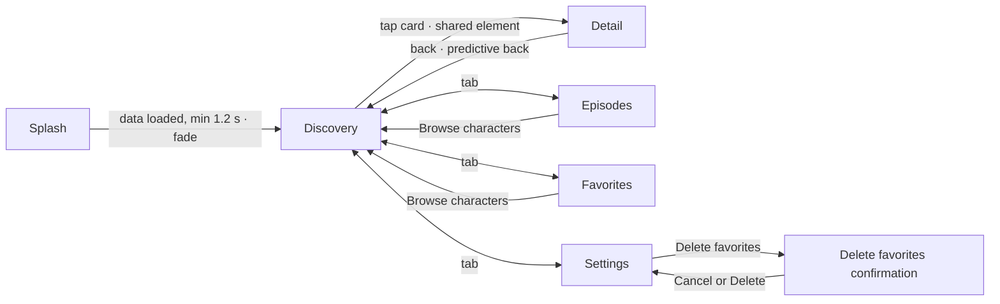

# UI_SPEC.md - UI/UX Visual Specification

- **Status:** Active — implemented on both platforms with known visual deviations, which the code reviews of 2026-10-05 list and `TASK-113` (Android) and `TASK-114` (iOS) remediate; the drift rule is `DOCUMENTATION_AUDIT.md` §5
- **Last verified:** 2026-09-30
- **Owner:** UI/UX Designer (see `AGENTS.md`)
- **Authoritative for:** the visual and interaction specification — tokens, component specs per platform, screen specs, motion, states, accessibility, iconography, canonical user-visible copy.
- **Not authoritative for:** behaviour requirements (`REQUIREMENTS.md`), architecture (`DESIGN.md`), failure handling (`ERROR_FLOW.md`), the remote contract (`API_SPECS.md`).
- **Inputs:** [`REQUIREMENTS.md`](REQUIREMENTS.md), [`DESIGN.md`](DESIGN.md), [`API_SPECS.md`](API_SPECS.md), design briefs in `docs/design/`, committed exports in `docs/figma/`
- **Source of truth:** Figma file [Rick & Morty](https://www.figma.com/design/nFQdxd23Kk4rNI7G4iHDUr/Rick---Morty). It requires project access; rendered exports live in [`docs/figma/`](figma/README.md).

This document translates the "image-oriented" requirement into an implementable visual spec for two native clients of **Multiverse Explorer**:

| Platform | Design language | Brief | Figma page |
| --- | --- | --- | --- |
| Android (Jetpack Compose) | Material 3 Expressive | [`01-android-m3-expressive.md`](design/01-android-m3-expressive.md) (historical input) | [01 · Android — M3 Expressive](https://www.figma.com/design/nFQdxd23Kk4rNI7G4iHDUr/Rick---Morty?node-id=0-1) |
| iOS (SwiftUI) | Liquid Glass (iOS 26+, material fallback below) | [`02-ios-liquid-glass.md`](design/02-ios-liquid-glass.md) (historical input) | [02 · iOS — Liquid Glass](https://www.figma.com/design/nFQdxd23Kk4rNI7G4iHDUr/Rick---Morty?node-id=4-134) |

When this document and Figma disagree, Figma variables and styles win for values; this document wins for behavior.

## 1. Figma file map

| Page | Contents |
| --- | --- |
| [00 · Shared — Brand & Sample Data](https://www.figma.com/design/nFQdxd23Kk4rNI7G4iHDUr/Rick---Morty?node-id=52-240) | `Brand/Portal logo` component and the sample character portraits used by both platforms |
| [01 · Android — M3 Expressive](https://www.figma.com/design/nFQdxd23Kk4rNI7G4iHDUr/Rick---Morty?node-id=0-1) | Android screens, components, and the [launcher icon board](https://www.figma.com/design/nFQdxd23Kk4rNI7G4iHDUr/Rick---Morty?node-id=59-240) |
| [02 · iOS — Liquid Glass](https://www.figma.com/design/nFQdxd23Kk4rNI7G4iHDUr/Rick---Morty?node-id=4-134) | iOS screens, components, and the [app icon board](https://www.figma.com/design/nFQdxd23Kk4rNI7G4iHDUr/Rick---Morty?node-id=59-930) |

The portraits on the shared page (`13:130`) are **sample data only**: ten 300 × 300 API avatars used as mock content. The apps load images from the API at runtime (§5). Image fills are shared across the whole file, so screens on every page reference the portraits by image hash, not through these frames.

### 1.1 Screens

Both flows are wired as clickable prototypes: open a page and press **Present**. The Splash simulates a 2 s data load (the portal spins as the loading indicator), then moves to Discovery. Tap Rick's card to open Detail. The navigation tabs switch between Discovery, the Episodes placeholder, Favorites and Settings; "Browse characters" on a placeholder returns to Discovery. On Settings, "Delete favorites" opens the confirmation frame, whose buttons return to Settings.

| Screen | Android (412 × 892 dp) | iOS (402 × 874 pt, iPhone 17 Pro) |
| --- | --- | --- |
| 01 · Splash | [`20:1620`](https://www.figma.com/design/nFQdxd23Kk4rNI7G4iHDUr/Rick---Morty?node-id=20-1620) | [`29:291`](https://www.figma.com/design/nFQdxd23Kk4rNI7G4iHDUr/Rick---Morty?node-id=29-291) |
| 02 · Discovery (list) | [`20:1735`](https://www.figma.com/design/nFQdxd23Kk4rNI7G4iHDUr/Rick---Morty?node-id=20-1735) | [`29:381`](https://www.figma.com/design/nFQdxd23Kk4rNI7G4iHDUr/Rick---Morty?node-id=29-381) |
| 03 · Detail | [`21:1217`](https://www.figma.com/design/nFQdxd23Kk4rNI7G4iHDUr/Rick---Morty?node-id=21-1217) | [`26:452`](https://www.figma.com/design/nFQdxd23Kk4rNI7G4iHDUr/Rick---Morty?node-id=26-452) |
| 04 · Episodes (placeholder) | [`101:499`](https://www.figma.com/design/nFQdxd23Kk4rNI7G4iHDUr/Rick---Morty?node-id=101-499) | [`102:269`](https://www.figma.com/design/nFQdxd23Kk4rNI7G4iHDUr/Rick---Morty?node-id=102-269) |
| 05 · Settings | [`101:568`](https://www.figma.com/design/nFQdxd23Kk4rNI7G4iHDUr/Rick---Morty?node-id=101-568) | [`102:322`](https://www.figma.com/design/nFQdxd23Kk4rNI7G4iHDUr/Rick---Morty?node-id=102-322) |
| 05b · Settings · Delete favorites (confirmation) | [`122:1293`](https://www.figma.com/design/nFQdxd23Kk4rNI7G4iHDUr/Rick---Morty?node-id=122-1293) | [`123:529`](https://www.figma.com/design/nFQdxd23Kk4rNI7G4iHDUr/Rick---Morty?node-id=123-529) |
| 06 · Favorites (empty state) | [`101:637`](https://www.figma.com/design/nFQdxd23Kk4rNI7G4iHDUr/Rick---Morty?node-id=101-637) | [`102:375`](https://www.figma.com/design/nFQdxd23Kk4rNI7G4iHDUr/Rick---Morty?node-id=102-375) |

Both frames are 9:19.5. The app has a **single appearance** with no light/dark variants (§3.1, §9).

### 1.2 Local components

| Component | Node | Notes |
| --- | --- | --- |
| `Brand/Portal logo` | `16:13` | On the shared page; instanced by both splash screens. |
| `Android/Status badge` | `16:23` | Variants `Status = Alive · Dead · Unknown`. |
| `Android/Character card` | `16:40` | Variants `Height = Regular · Tall`; props `Name`, `Species`; nested `Status badge` exposed. |
| `Android/Info list item` | `16:41` | Props `Label`, `Value`, `Icon` (instance swap). |
| `Android/Stat tile` | `16:48` | Props `Value`, `Label`; color and corners overridden per tile. |
| `iOS/Glass character card` | `22:264` | Variants `Status = Alive · Dead · Unknown`; props `Name`, `Subtitle`. |
| `iOS/Glass info row` | `22:265` | Props `Symbol` (SF Symbol glyph), `Label`, `Value`. |
| `iOS/Glass segmented control` | `22:271` | All · Alive · Dead · Unknown. |
| `iOS/Glass search field` | `22:281` | Prop `Placeholder`. |
| `iOS/Glass icon button` | `25:287` | Variants `Style = Glass · Prominent`; prop `Symbol`. |
| `iOS/Glass tab bar` | `102:255` | Variants `Selected = Characters · Episodes · Favorites · Settings`; each variant is four `iOS/Glass tab item` instances over the `Liquid Glass – Regular – Small` capsule. |
| `iOS/Glass tab item` | `117:1369` | Variants `State = Selected · Unselected`; props `Symbol` (SF Symbol glyph), `Label`. The only definition of a tab's look (§4.2). |
| `iOS/Glass text button` | `102:197` | Capsule glass prominent button (Portal Green); prop `Label`. |
| `iOS/Empty state` | `102:256` | Props `Symbol`, `Heading`, `Body`; includes the glass text button (§6.4). |
| `Android/Empty state` | `101:483` | Props `Heading`, `Body`, `Icon` (instance swap); Cookie-9 illustration + M3 filled button (§6.4). |
| `Android/Navigation bar` | `117:887` | Variants `Selected = Characters · Episodes · Favorites · Settings`. Wraps the Material 3 kit navigation bar with the scheme colours bound once, plus the 24 dp gesture-inset area (412 × 88 dp). Every screen uses an instance; never override item colours on a screen (§4.1). |
| `Android/Launcher icon/Background` · `/Foreground` | `59:242` · `59:263` | Adaptive icon layers, 108 dp canvas (see §10.1). |
| `Android/Launcher icon` | `59:282` | Composite of background + foreground. |
| `Android/Play Store icon` | `59:515` | 512 × 512 store listing icon. |
| `iOS/App icon` | `59:844` | Single 1024 × 1024 master (see §10.2). |

Library kits attached to the file and used as building blocks:

- **Material 3 Design Kit:** status bar, app bar (Search), filter chip, navigation bar, icon button, extended FAB, list item, switch, connected button group, button, basic dialog, icons.
- **iOS and iPadOS 27:** status bar, home indicator, the `Liquid Glass – Regular – Small` material, `Row`, `Row - Button`, `Toggle - Switch`, `Segmented Control`, `Alert`, and the `App Icon/iPhone` template (Home Screen preview). iOS kit instances inherit the screen's explicit `Colors = Dark` mode; nested parts that expose a `Mode` property are set to `Dark`.

Every Material 3 kit instance is re-bound to the local `Multiverse · M3 Scheme` variables, so kit components carry the brand palette.

> **Font note:** iOS text uses Apple's SF Pro; Android uses Roboto Flex (Google Fonts). If SF Pro shows as a missing font in your Figma client, install Apple's SF Pro fonts locally. Card names are single-line and end in "…" when too long. Other full-width text (info-row label and value, search placeholder, episodes accessory title) wraps within its container width; it never shrinks to fit its content.

The Android component reference captures render each catalogue subject in a separate row on Surface,
with enough viewport height to show the entire catalogue; image loading, content and failure variants
are shown separately. This makes each specified component visible for comparison with the exports
above. Screenshot tooling and baseline review rules remain owned by `TESTING.md` §8.2.

## 2. Brand and design principles

- **Sci-fi meets minimalism.** Space-black canvas, two brand accents (Portal Green, Cosmic Violet), with imagery doing the heavy lifting.
- **Images first.** Character portraits are the largest element on every list and detail surface. Colour around a portrait is derived from the portrait (§5).
- **Depth without borders.** Android uses tonal surfaces plus elevation. iOS uses blur, light and Z-layering (glass). Neither uses heavy strokes; iOS uses only a 1 pt light-catching rim.
- **Status is never colour-only.** Every status dot is paired with a text label.
- **One information architecture, two native skins.** Both platforms show the same content, hierarchy and flow; only the design language changes.

## 3. Design tokens

All tokens exist as Figma variables. Code syntax is pre-filled (`ANDROID`: `MaterialTheme.colorScheme.*` / `MultiverseColors.*`; `iOS`: `Color.*`).

### 3.1 Android colour scheme — `Multiverse · M3 Scheme` (single mode: `Multiverse`)

The app has **one visual appearance**. There are no light/dark variants, and the colour scheme does not follow the system setting or the wallpaper (no Material You dynamic colour).

The scheme was generated with Google's `material-color-utilities` (DynamicScheme, spec **2025**, variant Tonal Spot, dark tones) and is used as a fixed palette:

| Palette | Hue source | Chroma |
| --- | --- | --- |
| Primary | Portal Green `#97CE4C` | 56 |
| Secondary | Portal Green hue + 20° | 18 |
| Tertiary | Cosmic Violet `#7B4DFF` | 64 |
| Neutral | Cosmic Violet hue | 5 |
| Neutral variant | Cosmic Violet hue | 9 |

The slightly violet neutral hue gives the "Space Black" surfaces. The collection holds 49 roles, all mapped by `:core:designsystem`; the roles used by the designs are:

| Role | Value | Used for |
| --- | --- | --- |
| Primary | `#A4D661` | FAB, selected nav, splash wordmark accent |
| On Primary | `#2C4800` | FAB label/icon |
| Primary Container | `#497401` | Splash cookie shape, launcher icon foreground, "Episodes" stat tile |
| On Primary Container | `#FFFFFF` | Text on primary container |
| Secondary | `#B5CDB4` | Navigation bar selected label (`UI_SPEC.md` §4.1) |
| On Secondary | `#314532` | Text on Secondary |
| Secondary Container | `#2C402E` | Selected chip, list-item icon container, loading indicator container |
| On Secondary Container | `#AEC5AD` | Icons on secondary container |
| Secondary Fixed Dim | `#C3DBC1` | "Species" stat tile |
| On Secondary Fixed | `#304431` | Text on secondary fixed dim |
| Tertiary | `#A68CFF` | Splash nebula |
| Tertiary Container | `#997BFE` | "Dimension" stat tile |
| On Tertiary Container | `#12003E` | Text on tertiary container |
| Surface | `#0F0E12` | Screen background |
| Surface Container Low | `#141318` | — |
| Surface Container | `#1A191F` | Detail info list, bottom navigation |
| Surface Container High | `#211E26` | Default card container (before dynamic colour resolves) |
| Surface Container Highest | `#27242D` | Status badge (90%), hero icon buttons (72%) |
| On Surface | `#E9E3EF` | Primary text |
| On Surface Variant | `#AEA9B4` | Secondary text |
| Outline Variant | `#494650` | Dividers |
| Error | `#F97758` | Error states (§8) |

### 3.2 Brand, status and glass — `Multiverse · Brand`

| Token | Value | Notes |
| --- | --- | --- |
| `Brand/Portal Green` | `#97CE4C` | Seed colour; iOS accent/tint |
| `Brand/Portal Glow` | `#C6FF6B` | iOS selected tab, SF Symbol accents |
| `Brand/Cosmic Violet` | `#7B4DFF` | Seed colour; ambient glows |
| `Brand/Nebula Violet` | `#B69CFF` | Splash aurora |
| `Brand/Space Black` | `#07060B` | iOS background |
| `Status/Alive` | `#7EE06A` | Dot has a soft glow; paired with the label "Alive" |
| `Status/Dead` | `#FF6B6B` | Paired with the label "Dead" |
| `Status/Unknown` | `#B8B4BF` | Paired with the label "Unknown" |
| `Glass/Fill` | `#FFFFFF` @ 8% | Base fill under glass effects |
| `Glass/Fill Strong` | `#FFFFFF` @ 16% | Selected capsules, status capsule |
| `Glass/Stroke Highlight` | `#FFFFFF` @ 42% | Top edge of the light-catching rim |
| `Glass/Stroke Edge` | `#FFFFFF` @ 10% | Middle of the rim |
| `Glass/Tint Green` | `#97CE4C` @ 30% | Selected segment, symbol wells |
| `Glass/Tint Violet` | `#7B4DFF` @ 40% | Reserved |
| `Glass/Shadow` | `#000000` @ 35% | Glass drop shadow |
| `Label/Primary` | `#FFFFFF` | iOS primary label |
| `Label/Secondary` | `#EBEBF5` @ 68% | iOS secondary label |
| `Label/Tertiary` | `#EBEBF5` @ 36% | — |

The rim is a vertical gradient: white 55% → 6% → 25%. It gives each glass surface a lit top edge.

### 3.3 Shape and spacing — `Multiverse · Dimensions`

| Token | Value | Token | Value |
| --- | --- | --- | --- |
| `Space/XS` | 4 | `Shape/Corner Extra Small` | 4 |
| `Space/S` | 8 | `Shape/Corner Small` | 8 |
| `Space/M` | 12 | `Shape/Corner Medium` | 12 |
| `Space/L` | 16 | `Shape/Corner Large` | 16 |
| `Space/XL` | 24 | `Shape/Corner Large Increased` | 20 |
| `Space/2XL` | 32 | `Shape/Corner Extra Large` | 28 |
| `Space/3XL` | 48 | `Shape/Corner Extra Large Increased` | 32 |
| `Radius/Glass Control` | full | `Shape/Corner Extra Extra Large` | 48 |
| `Radius/Glass Card` | 26 | `Shape/Corner Full` | full |
| `Radius/Glass Panel` | 34 | | |

- Screen margins are 16 on both platforms; grid gutters are 12 (Android) and 16 (iOS).
- iOS shapes are continuous-curvature squircles (Figma corner smoothing 60% = SwiftUI `.continuous`).
- **Concentric corners:** inner radius = outer radius − inset. For example, the card is 28 with a 6 inset, so the portrait is 20 on Android; the glass card is 26 with a 6 inset, so the glass bar is 20.

### 3.4 Typography

**Android — Roboto Flex (M3 Expressive type scale).** "Emphasized" styles are the heavier M3 Expressive variants used for hierarchy contrast.

| Style | Weight | Size / line height | Tracking | Used for |
| --- | --- | --- | --- | --- |
| Display Medium Emphasized | Black | 45 / 52 | −0.5 | Splash wordmark, Detail name |
| Display Small Emphasized | ExtraBold | 36 / 44 | −0.25 | "Characters" headline |
| Headline Small Emphasized | Bold | 24 / 32 | 0 | Stat values |
| Title Medium Emphasized | Bold | 16 / 24 | 0.15 | Card name |
| Title Medium | Medium | 16 / 24 | 0.15 | List-item value, detail meta |
| Title Small | Medium | 14 / 20 | 0.1 | Reserved (section headers); not used on current screens |
| Body Medium | Regular | 14 / 20 | 0.25 | Supporting text |
| Body Small | Regular | 12 / 16 | 0.4 | Card species |
| Label Large Emphasized | Bold | 14 / 20 | 0.1 (+8 px on "EXPLORER") | Splash sub-wordmark |
| Label Medium | Medium | 12 / 16 | 0.5 | Badges, list labels, stat labels |

Also defined but not yet used: Display Large, Headline Large Emphasized, Headline Medium, Title Large, Body Large, Label Large, Label Small.

**iOS — SF Pro (Dynamic Type, default "Large" size).** Styles must scale with Dynamic Type; use SwiftUI text styles, not fixed sizes, except for the editorial display.

| Style | Weight | Size / line height | Tracking | SwiftUI |
| --- | --- | --- | --- | --- |
| Editorial Display | SF Pro Expanded Heavy | 40 / 44 | −0.6 | `.system(size: 40, weight: .heavy, width: .expanded)` scaled with `@ScaledMetric` |
| Large Title | Bold | 34 / 41 | 0.4 | `.largeTitle.bold()` |
| Title 2 | Bold | 22 / 28 | −0.26 | `.title2.bold()` |
| Title 3 | Semibold | 20 / 25 | −0.45 | `.title3.weight(.semibold)` |
| Headline | Semibold | 17 / 22 | −0.43 | `.headline` |
| Body | Regular | 17 / 22 | −0.43 | `.body` |
| Subheadline (Emphasized) | Regular (Semibold) | 15 / 20 | −0.23 | `.subheadline` |
| Footnote (Emphasized) | Regular (Semibold) | 13 / 18 | −0.08 | `.footnote` |
| Caption 1 | Medium | 12 / 16 | 0 | `.caption.weight(.medium)` |
| Caption 2 Emphasized | Semibold | 11 / 13 | 0.06 (+7 px on "EXPLORER") | `.caption2.weight(.semibold)` |

Icons are **SF Symbols** on iOS (hierarchical rendering, weight matched to adjacent text) and **Material Symbols Rounded** on Android.

### 3.5 Elevation and effects

| Style | Definition | Used on |
| --- | --- | --- |
| `M3/Elevation 1` | y1 b2 @30% + y1 b3 s1 @15% | Character cards |
| `M3/Elevation 2`, `M3/Elevation 3` | M3 levels 2 and 3 | Reserved (scrolled app bar, menus) |
| `M3/Portal Glow` | Portal Green @45%, y8, blur 28 | Primary FAB, splash logo |
| `Liquid Glass/Regular` | Glass: refraction .7, depth 16, dispersion .25, frost 14, light −45° @ .55; drop shadow y12 b32 @28% | Search field, segmented control, card glass bar, accessory |
| `Liquid Glass/Clear` | Glass: refraction .9, depth 22, dispersion .4, frost 3; shadow y8 b24 @22% | Splash lens, status capsule |
| `Liquid Glass/Panel` | Glass: refraction .55, depth 24, dispersion .2, frost 28; shadow y18 b48 @32% | Detail information panel |
| `Liquid Glass/Text Shadow` | y1 b6 @45% | Text over imagery |

Figma's glass effect approximates the SwiftUI `glassEffect` material. In code, use the system material rather than hand-built blur plus stroke.

## 4. Component specifications

### 4.1 Android (Compose, Material 3 Expressive)

| Component | Spec | Compose implementation |
| --- | --- | --- |
| Top app bar with search | 64 dp. Search bar only: 380 dp wide with 16 dp margins, leading `search` icon, placeholder "Search characters" (`search_characters`; corrected 2026-10-05, `CONF-85`). No trailing mic while voice search is deferred (§6.2). No navigation icon (the navigation bar covers top-level destinations) and no avatar (the app has no user accounts) | M3 `SearchBar` in the top app bar slot; expands to full-screen search |
| Filter chips | Elevated style, 32 dp, 16 dp start inset. Exactly four single-select options: **All** (selected, check icon) · Alive · Dead · Unknown. They fit the screen width, so no scrolling. Equivalent to the iOS segmented control | `ElevatedFilterChip`s in a `Row`; selecting one deselects the others |
| Character card | 184 dp wide; container corner 28, 6 dp inset; portrait corner 20. Regular portrait 172 dp, Tall 224 dp. Shows exactly photo, name, status (badge) and species (§6.2). Name in Title Medium Emphasized, up to 2 lines so the full name fits (ellipsis only beyond that); species in Body Small, On Surface @80%. Container colour = dynamic accent (§5), Elevation 1 | `Card(shape = RoundedCornerShape(28.dp))` + `AsyncImage`; status badge overlaid top-start at (10, 10) |
| Status badge | Pill; 8 dp dot + Label Medium; Surface Container Highest @90%; Alive dot glows | Custom `StatusBadge(status)` |
| Staggered grid | 2 columns below font scale 1.5, 1 column from 1.5 (including the maximum 2.0), 12 dp gutters; Tall and Regular cards mixed so the two lanes never line up | `LazyVerticalStaggeredGrid(MultiverseGrid.columns())` places each item in the shorter lane. Use Tall when `index % 4` is 0 or 3; the Figma frame shows one possible arrangement |
| Navigation bar | 4 destinations in this order: Characters (`groups`), Episodes (`play_arrow`), Favorites (`favorite`), Settings (`settings`, outlined); container Surface Container. Selected item: Secondary Container indicator, On Secondary Container icon, Secondary label; unselected items: On Surface Variant icon and label. Figma component `Android/Navigation bar` (§1.2) | `NavigationBar`; the selected item follows the current section. Episodes opens its placeholder, Favorites its list or empty state (§6.4), Settings the settings screen (§6.5). At font scale ≥1.5, arrange the same ordered destinations in two rows so each label fits |
| Detail icon buttons | 48 dp touch target, 40 dp container at Surface Container Highest @72% over the image | `FilledTonalIconButton` with custom container colour |
| Stat tiles | Row of 3 below font scale 1.5, vertical connected group from 1.5, with each tile filling the available width and a 76 dp minimum height that grows with its text. 4 dp gaps ("connected group"). Shapes: start tile 28/8/8/28, middle 8, end 8/28/28/8. Colours: Primary Container / Tertiary Container / Secondary Fixed Dim | Custom `StatTile`; `RoundedCornerShape` per position |
| Info list | Surface Container, corner 28. Items: 72 dp min height, 48 dp leading icon container (Secondary Container, corner 16), label in Label Medium, value in Title Medium | `ListItem` inside `Surface` |
| Extended FAB | Medium (80 dp), Primary colour, "Favorite" label, Portal Glow shadow. 16 dp from the end, 16 dp above the gesture area. Unmarked (as drawn): outline `favorite` icon. Marked: filled heart | M3 Expressive medium extended FAB |
| Loading indicator | 48 dp contained indicator, Secondary Container; the active shape morphs. Used only for paging (§8), not on the splash | `ContainedLoadingIndicator` |
| Settings group | Section header in Title Small, Primary, 16 dp start inset; below it a Surface Container group, corner 28, 380 dp wide, 24 dp between sections (§6.5) | `Text` + `Surface(shape = RoundedCornerShape(28.dp))` holding the rows |
| Settings row | M3 two-line list item, 72 dp: leading 24 dp icon (On Surface Variant), headline Body Large, supporting text Body Medium On Surface Variant; transparent container over the group | `ListItem` |
| Sounds switch | M3 Expressive switch: off by default (as drawn); when on, the handle shows the check icon on a Primary track | `Switch(thumbContent = { Icon(Icons.Filled.Check) })` as the row's trailing content |
| Data-source picker | M3 Expressive connected button group, Small, two segments filling the row width minus 16 dp insets: "REST API" · "GraphQL". Selected segment Secondary with On Secondary label; unselected Secondary Container with On Secondary Container label; no icons | `ButtonGroup` with `ToggleButton`s in connected (single-select, selection-required) mode |
| Delete favorites button | Filled button, Medium (56 dp), full group width, leading `delete` icon; container Error Container, content On Error Container | `Button(colors = ButtonDefaults.buttonColors(containerColor = errorContainer, contentColor = onErrorContainer))` |
| Confirmation dialog | M3 basic dialog, no icon, over a Scrim @32% scrim: headline Headline Small Emphasized, supporting text Body Medium, text buttons "Cancel" (Primary) and "Delete" (Error) | `AlertDialog` with `TextButton`s; "Delete" uses `colorScheme.error` |

### 4.2 iOS (SwiftUI, Liquid Glass)

| Component | Spec | SwiftUI implementation |
| --- | --- | --- |
| Large title | "Characters" + "{count} across the multiverse" (Subheadline, secondary). The count comes from `info.count` at runtime and is never hardcoded; the Figma frame shows the value observed on 2026-09-29 | `.navigationTitle` + `.navigationBarTitleDisplayMode(.large)` |
| Glass search field | 370 × 48 capsule; `magnifyingglass`, placeholder "Search characters". No trailing `mic.fill` while voice search is deferred (§6.2) | `.searchable(text:placement: .navigationBarDrawer(displayMode: .always))` |
| Glass segmented control | 370 × 44 capsule, 4 pt inset; the selected segment is a clear-glass capsule tinted Portal Green | Custom control in a `GlassEffectContainer`; `.glassEffect(.regular.tint(.portalGreen.opacity(0.3)).interactive(), in: .capsule)`; selection uses `matchedGeometryEffect` |
| Glass character card | 177 × 236 pt, continuous corner 26. The portrait fills the card and is overscanned by 14 pt for parallax. Shows exactly photo, name, status and species (§6.2). Glass bar: full width minus a 6 pt inset, corner 20, anchored to the bottom and growing upwards. It holds the name (Headline, up to 2 lines so the full name fits) and a status row (7 pt dot + "Status · Species", Caption 1). Light-catching 1 pt rim; drop shadow y14 b30 @40% | `LazyVGrid(columns: 2, spacing: 16)`; the image uses `.visualEffect`/`.scrollTransition` offset (0.85× scroll); the bar uses `.glassEffect(in: .rect(cornerRadius: 20, style: .continuous))` |
| Glass tab bar | Floating capsule, 4 tabs in this order: Characters (`person.2.fill`), Episodes (`play.tv.fill`), Favorites (`heart.fill`), Settings (`gearshape.fill`); each tab is an `iOS/Glass tab item` (§1.2); selected tab (symbol + label) in Portal Glow, every unselected tab always in white (`Label/Primary`), never dimmed or black (one variant per selected tab) | `TabView` with `Tab(...)` items (system Liquid Glass tab bar); `.tint(.portalGlow)`; unselected items forced to white through `UITabBarAppearance` (`normal.iconColor` and `normal.titleTextAttributes`), because the system default is a dimmed secondary colour |
| Glass icon button | 50 pt; Glass (white symbol) or Prominent (Portal Green tint, Space Black symbol). Favorite uses Glass + `heart` when unmarked (as drawn) and Prominent + `heart.fill` when marked | `.buttonStyle(.glass)` / `.buttonStyle(.glassProminent).tint(.portalGreen)` |
| Glass status capsule | Dot + "Alive" (Footnote Emphasized), clear glass | `Label` + `.glassEffect(.clear, in: .capsule)` |
| Settings section | Header in Subheadline Emphasized, `Label/Secondary`, 16 pt start inset; below it a `Liquid Glass – Regular – Small` panel, continuous corner 26, 370 pt wide, 24 pt between sections; optional footer in Footnote, `Label/Secondary` (§6.5) | `Form`/`List` with `.listStyle(.insetGrouped)` and `.scrollContentBackground(.hidden)` over the tinted canvas; sections use `Section(header:footer:)` |
| Settings row | iOS kit `Row`, Tall (68 pt): SF Symbol in Portal Glow, Body title, Subheadline subtitle in secondary; separators hidden on the last row of a panel | `LabeledContent` / `Label` inside the section |
| Sounds toggle | iOS kit `Toggle - Switch`, off by default (as drawn); on-state track in Portal Green | `Toggle(isOn:)` with `.tint(.portalGreen)` |
| Data-source picker | iOS kit `Segmented Control`, Large, two options "REST API" · "GraphQL", enabled, filling the panel width minus 16 pt insets | `Picker(selection:)` with `.pickerStyle(.segmented)` |
| Delete favorites row | iOS kit `Row - Button`, Destructive: "Delete favorites" in system red, no symbol | `Button(role: .destructive)` in its own section |
| Confirmation alert | iOS kit `Alert`, side-by-side buttons, dark: title, message, "Cancel" (cancel role) and "Delete" (destructive role) over a 40% black dimming layer | `.alert(_:isPresented:actions:message:)` with `Button(role: .cancel)` and `Button(role: .destructive)` |
| Frosted panel | 370 wide, continuous corner 34, 20 pt padding. Stats row (3 columns: Title 2 value, Caption 1 label, 1 pt separators), divider, then 3 `Glass info row`s | `.glassEffect(in: .rect(cornerRadius: 34, style: .continuous))` |
| Glass info row | 38 pt symbol well (Glass/Tint Green, symbol in Portal Glow) + label (Footnote, secondary) + value (Headline) | `LabeledContent` / custom `HStack` |
| Episode count line | Informative only: `play.rectangle.on.rectangle.fill` + "Appears in N episodes", Subheadline in `Label/Secondary`, aligned with the panel content. No glass container, no chevron, not interactive | Plain `Label` below the panel (not a `Button`) |

## 5. Imagery and dynamic colour

### 5.1 Source and loading

- The API provides one **300 × 300** image per character (see `API_SPECS.md` §7.4). The UI must not claim or request a higher resolution.
- Portraits use `ContentScale.Crop` / `.scaledToFill()` with face-safe top-centre alignment.
- **Placeholder:** a Surface Container High box (Android) or `Glass/Fill` box (iOS), with a 1 s shimmer.
- **Error:** the same container with a centred `Brand/Portal logo` at 40% opacity. Never show a broken-image glyph.
- **Crossfade:** 200 ms. The cache key is always the image URL.

### 5.2 Cache configuration

| Platform | Library | Policy |
| --- | --- | --- |
| Android | Coil (memory + disk cache) | Memory → disk → network. Default Coil memory budget; the disk byte budget is a configuration value settled during implementation (`API_SPECS.md` §14). Decode at native 300 px (card and hero sizes exceed the source at xxhdpi). |
| iOS | `URLCache` (≈ 50 MB memory / 200 MB disk) + `NSCache` for decoded `UIImage`s | Memory → disk → network. No third-party loader is needed for the MVP (dependency restraint). |

### 5.3 Upscaling mitigation

The Android hero shows a 300 px source at 412 dp. Its top and bottom scrims hide softness at the edges.

The iOS detail uses the image twice:
- a sharp hero (alpha-masked, with progressive blur from 55% of its height down)
- a full-bleed copy blurred at 64 pt with a 38% Space Black dim, which acts as the Liquid Glass backdrop

This makes the resolution limit a stylistic choice rather than a defect.

### 5.4 Dynamic colour (character accent)

Android card containers are tinted from each character's portrait, as the M3 brief requires.

1. Quantize the decoded bitmap (`QuantizerCelebi`, 128 colours), then `Score` it to get the source colour. Fall back to Portal Green.
2. Build `TonalPalette.fromHueAndChroma(hue, chroma.coerceIn(24.0, 48.0))`.
3. Container = **tone 30**. Text stays On Surface; meta uses On Surface @80%, which keeps it at 4.5:1 or better.
4. Compute off the main thread and memoize per image URL (LRU). Show Surface Container High until it resolves, then animate the colour over 300 ms.
5. Coil hardware bitmaps can't be read. Request a software bitmap only for extraction (`allowHardware(false)` on that request), or copy it once.

Reference values extracted in Figma (tone 30):

| Character | Accent | Character | Accent |
| --- | --- | --- | --- |
| Rick Sanchez | `#544519` | Krombopulos Michael | `#204D55` |
| Morty Smith | `#4A4900` | Mr. Meeseeks | `#5A4302` |
| Birdperson | `#424B23` | Squanchy | `#7B2F07` |

On iOS, glass surfaces do not need an accent: the glass picks up the portrait's colour by refraction. The detail's ambient glows use brand colours.

## 6. Screen specifications

### 6.1 Splash

| | Android | iOS |
| --- | --- | --- |
| Background | Surface, violet (Tertiary) and green (Primary) radial nebula glows, sparse starfield | Space Black, three aurora orbs (Cosmic Violet, Portal Green, Nebula Violet), starfield |
| Mark | Portal logo (160 dp) on an M3 Expressive **Cookie-9** shape (240 dp, Primary Container), Portal Glow | Portal logo (176 pt) seen through a 212 pt **Liquid Glass lens** (continuous corner 60, `Liquid Glass/Clear`) that refracts it |
| Wordmark | "Multiverse" (Display Medium Emphasized) / "EXPLORER" (Label Large Emphasized, Primary, +8 tracking) / tagline "Every Rick. Every Morty. Every dimension." (Body Medium) | "Multiverse" (Editorial Display) / "EXPLORER" (Caption 2, Portal Green, +7 tracking) / tagline (Subheadline) |
| Loading indicator | The rotating portal: it starts very slowly, accelerates, then spins at a constant speed until the data has loaded (§7). No other progress UI | Same: the portal rotates behind the glass lens (§7). No other progress UI |
| Implementation | `installSplashScreen()` for the system icon phase (it shows the launcher icon's foreground, see §10.1), then an in-app composable for the branded animation | Launch screen (static background) → SwiftUI splash view |

The splash stays on screen while the first page of characters loads, with the spinning portal as the loading indicator.
- **Timing:** it lasts at least 1.2 s so the acceleration completes, and at most 3 s; then it cross-fades (350–400 ms) to Discovery.
- **Prototype:** both Figma prototypes simulate a 2 s load.
- **No network on a cold start:** go to Discovery and show its error state (§8).

### 6.2 Discovery (character list)

Content order, top to bottom:

| | Android | iOS |
| --- | --- | --- |
| 1 | Status bar | Status bar |
| 2 | App bar with search | Large title + count |
| 3 | Headline + count | Glass search field |
| 4 | Filter chips | Glass segmented control |
| 5 | Staggered grid | Grid of glass cards |
| 6 | Navigation bar | Floating glass tab bar |

Neither platform has top-bar action buttons: no menu or avatar on Android, and no toolbar buttons on iOS.

Behaviour:

- **Identical copy on both platforms:**

  | Element | Text |
  | --- | --- |
  | Title | "Characters" |
  | Count line | "{count} characters across the multiverse" (`count` from `info.count`) |
  | Search placeholder | "Search characters" |
  | Filter options | "All" · "Alive" · "Dead" · "Unknown" |
  | Navigation | "Characters" · "Episodes" · "Favorites" · "Settings" |

- **Card data:** every card shows exactly the same four items on both platforms. Only the layout differs.

  | Item | Content |
  | --- | --- |
  | Photo | Character image |
  | Name | Full name, including the surname when there is one, never cut short. Long names wrap to a second line |
  | Status | Alive / Dead / Unknown |
  | Species | The API `species` field, never `type`; "unknown" is shown as "Unknown" |

  No gender, type or origin on the cards.
- **Prototype content:** both prototypes show the same six characters in the same order: Rick Sanchez, Morty Smith, Birdperson, Krombopulos Michael, Mr. Meeseeks, Squanchy. At runtime both apps render the same API data.
- **Filters are identical on both platforms:**
  - the same four single-select options (All · Alive · Dead · Unknown)
  - the same default (All)
  - Android shows them as filter chips, iOS as a segmented control
- **Filters map directly to API query parameters:**
  - status → `status`
  - search → `name`
  - "All" sends no `status`
- **Not offered:** species and gender filters. The API supports them (`API_SPECS.md` §4.4), but the UI deliberately limits filtering to status plus name search.
- **The selected filter must match the content.** Both designs show "All" selected with mixed statuses.
- **Paging:** incremental; prefetch the next page near the end.
- **Search:** 300 ms debounce; a new query resets to page 1.
- **Voice search (speech-to-text) — DEFERRED (`DEC-002`, `REQ-FUNC-030`), not part of M1/M2.** The specification below is retained so the design is not lost, but the mic affordance `MUST NOT` be rendered and no microphone or speech permission `MUST` be requested (`REQ-SEC-004`) until a new decision reactivates it. Both search-field specifications in §4.1/§4.2 therefore ship without the trailing `mic` control.
  - **When implemented, Android:** launch the system recognizer with `RecognizerIntent.ACTION_RECOGNIZE_SPEECH` via `rememberLauncherForActivityResult`. The system UI records the audio, so the app needs no `RECORD_AUDIO` permission. Hide the mic when `SpeechRecognizer.isRecognitionAvailable()` is false. On Android 11+ that check needs a `<queries>` entry for the `android.speech.RecognitionService` intent in the manifest.
  - **When implemented, iOS:** use the Speech framework (`SFSpeechRecognizer` + `AVAudioEngine`), on-device when `supportsOnDeviceRecognition` is true. It requires `NSSpeechRecognitionUsageDescription` and `NSMicrophoneUsageDescription`. While listening, `mic.fill` animates with `.symbolEffect(.variableColor)`; tapping again stops. Hide the mic if the recognizer is unavailable or permission is denied.
  - Recognition uses the device language. Character names are proper nouns, so an imperfect transcript is corrected by typing; no custom vocabulary.
  - The transcript replaces the query text and follows the same debounce and page reset as typing.
- **Scroll:**
  - Android: the app bar gets a Surface Container fill on scroll (Elevation "On-scroll").
  - iOS: the large title collapses into the inline title, and glass content scrolls under the tab bar.
- **Card tap:** opens Detail with a shared-element transition (§7).

### 6.3 Detail

| Area | Android | iOS |
| --- | --- | --- |
| Hero | Full-bleed portrait (412 × 468 dp), top scrim (black 55%→0) and bottom fade to Surface. Collapsing: 0.5× parallax, collapses into a small app bar showing the name | Full-screen blurred portrait backdrop plus a sharp hero (402 × 520) dissolving into it (alpha mask + progressive blur) |
| Top controls | Back and Share icon buttons (tonal, over the image) | Glass Back; trailing Share (Glass) and **Favorite** (Glass Prominent, `heart.fill`) |
| Title | Status badge, name (Display Medium Emphasized), "Species · Gender · Origin" | Glass status capsule, name (Editorial Display + text shadow), "Species · Gender" |
| Stats | Connected tiles: Episodes count · Dimension (from origin) · Species | Stats row inside the frosted panel |
| Info | Info list with no section heading: Origin (`language`), Last known location (`location_on`), First seen in (`play_arrow`) | Glass info rows: `globe.americas.fill`, `mappin.and.ellipse`, `play.tv.fill` |
| Favorite | Medium Extended FAB "Favorite", Primary + Portal Glow; collapses to an icon FAB on scroll. Drawn **unmarked** (outline heart); marked = filled heart | Integrated glass button (top-right). Drawn **unmarked** (Glass + `heart`); marked = Prominent Portal Green + `heart.fill` |
| Extra | — | Informative line "Appears in N episodes" below the panel. It isn't tappable and repeats the Episodes stat |

Data binding (see the domain model in `API_SPECS.md` §3):

- `Episodes` = `episodeIds.size`
- `Dimension`: show `origin.dimension` when enriched; otherwise the text in parentheses of `origin.name` (e.g. "C-137"); otherwise hide the tile.
- `First seen in` requires episode enrichment (`episodeSummaries[0]`): shown as "*name* · *code*". Hide the row if enrichment was not requested.
- Unknown values (`"unknown"`) are displayed as "Unknown", never as raw lowercase API values.

On iOS, the title block, panel and accessory are a bottom-anchored stack, so the layout adapts to Dynamic Type sizes.

Top-control actions (`DEC-125`):

- **Back** returns to the screen that opened the Detail (`popBackStack` on Android; the navigation stack's `dismiss` on iOS).
- **Share** offers one line through the platform's own sheet (an `ACTION_SEND` chooser on Android, the system share sheet on iOS): `share_character_text` = "%1$s on Multiverse Explorer: %2$s", with the character's name and its API resource URL `https://rickandmortyapi.com/api/character/{id}`, which `:core:data` builds from the configured host. Share names the character, so on Android it is disabled (M3 disabled colours) while a deep-linked Detail has no header yet. Spanish value, approved by the owner 2026-10-05: "%1$s en Multiverse Explorer: %2$s" (`LOG-0135`).

### 6.4 Episodes and Favorites (placeholders)

These two tabs don't have their final content yet:
- Episodes shows a "coming soon" placeholder.
- Favorites shows its empty state, because the Favorite action already exists on Detail.

The text and information are **identical on both platforms**:

| Screen | Title | Heading | Body | Button |
| --- | --- | --- | --- | --- |
| Episodes | "Episodes" | "Episodes are on their way" | "Soon you'll be able to browse every episode, from the Pilot to the latest season." | "Browse characters" |
| Favorites | "Favorites" | "No favorites yet" | "Tap the heart on a character's page to keep them here." | "Browse characters" |

Presentation per platform:

| | Android (`Android/Empty state`) | iOS (`iOS/Empty state`) |
| --- | --- | --- |
| Title | Display Small Emphasized, same position as the Discovery headline | Large Title, same position as Discovery |
| Illustration | M3 Expressive Cookie-9 (160 dp) with the section's icon (64 dp). Container colour per section: Episodes Secondary Container, Favorites Primary Container | 120 pt glass symbol well (`Liquid Glass/Regular`) with a 48 pt SF Symbol in Portal Glow: `play.tv.fill`, `heart` |
| Heading / body | Headline Small Emphasized / Body Medium, centred, 320 dp wide | Title 2 / Subheadline (secondary), centred, 320 pt wide |
| Button | M3 filled button, Medium | `iOS/Glass text button` (glass prominent, Portal Green) |
| Navigation | Navigation bar with the section's item selected | Glass tab bar variant for the section |

Behaviour:
- **Browse characters:** selects the Characters tab (Discovery). It doesn't push a new screen.
- **Favorites:** when the user has favourites, this screen becomes the list of favourite characters, using the same cards as Discovery. The empty state only shows while the list is empty.
- **When Episodes is built:** its placeholder is replaced by a real screen with the same title and navigation.
- **Accessibility:** the illustration is decorative. The heading and body are read in order, followed by the button.

### 6.5 Settings

Settings holds three settings, in this order: Sounds, Data source and Delete favorites (`REQ-FUNC-033`…`REQ-FUNC-035`). Each platform draws them with its own controls: M3 Expressive on Android, Liquid Glass on iOS (§4.1, §4.2). There is no placeholder and no "Browse characters" button.

The text is **identical on both platforms**:

| Element | Text |
| --- | --- |
| Title | "Settings" |
| Section headers | "Preferences" · "Data" · "Favorites" |
| Sounds row | "Sounds" / "Play sound effects in the app" |
| Data source row | "Data source" / "How the app fetches characters" |
| Data source options | "REST API" · "GraphQL" |
| Delete action | "Delete favorites" |
| Delete explanation | "Remove every character you've saved. This can't be undone." |
| Confirmation title | "Delete all favorites?" |
| Confirmation message | "This removes every character from Favorites. You can't undo this." |
| Confirmation buttons | "Cancel" · "Delete" |

Presentation per platform:

| | Android (Figma `101:568`, `122:1293`) | iOS (Figma `102:322`, `123:529`) |
| --- | --- | --- |
| Title | Display Small Emphasized, same position as the Discovery headline | Large Title, same position as Discovery |
| Sections | Settings group per section (§4.1), starting 24 dp below the title | Settings section per section (§4.2), starting 16 pt below the title |
| Sounds | Settings row, `volume_up`, trailing Sounds switch | Settings row, `speaker.wave.2.fill`, trailing Sounds toggle |
| Data source | Settings row, `swap_horiz`, with the data-source picker below it inside the same group | Settings row, `arrow.left.arrow.right`, with the segmented picker below it inside the same panel |
| Delete favorites | Explanation (Body Medium) above the full-width Delete favorites button, inside the group | Destructive row button in its own panel; the explanation is the section footer |
| Confirmation | M3 dialog over the scrim (§4.1) | Alert over the dimming layer (§4.2) |
| Navigation | Navigation bar with Settings selected | Glass tab bar with Settings selected |

Behaviour:
- **Sounds:** defaults to off and persists. It plays nothing until the sound set is defined (`REQ-FUNC-036`, `DEF-005`).
- **Data source:** "REST API" is selected on a fresh install. Changing it applies at once: the character list reloads from page 1 through the chosen protocol (`REQ-FUNC-034`, `ADR-0011`). Nothing else on the screen changes.
- **Delete favorites:** opens the confirmation. "Delete" clears every favorite and closes the confirmation, and Favorites then shows its empty state. "Cancel", a tap outside (Android) or the system dismiss gesture changes nothing. The action is disabled while there are no favorites: on Android the button uses the M3 disabled colours, and on iOS the row uses the kit's `Disabled` value. The disabled state is not drawn in Figma yet (§8).
- **Accessibility:** each control is labelled by its row title. The switch and toggle announce their on/off state, the picker announces the selected option, and the confirmation takes focus when it opens and returns it to the action when it closes.

## 7. Navigation and motion

Android:

| Moment | Motion spec |
| --- | --- |
| Card → Detail | Container transform: card portrait → hero, 450 ms, Emphasized Decelerate; corner radius 20 → 0. The rest of the card fades through. Compose: `SharedTransitionLayout` + `Modifier.sharedElement(key = "portrait-$id")` |
| Detail → Card | Reverse; supports predictive back (the hero scales with the gesture) |
| Favorite | `favorite` outline → filled; spring (stiffness ≈ 380, damping 0.6); one-off Primary ripple |
| Splash | Portal rotates clockwise, starting very slowly and accelerating: 360° over 1.2 s, ease-in cubic `CubicBezierEasing(0.32f, 0f, 0.67f, 0f)`. It then keeps spinning at that final speed (≈ 900°/s) until the data has loaded. This rotation is the splash loading indicator. Prototype keyframes: 0° → −360° at 1.2 s (ease-in) → −1080° at 2 s (linear) |
| Chips / filters | Grid content cross-fades; items animate placement (`Modifier.animateItem()`) |

iOS:

| Moment | Motion spec |
| --- | --- |
| Card → Detail | Zoom transition: `.matchedTransitionSource(id:in:)` on the card, `.navigationTransition(.zoom(sourceID:in:))` on Detail |
| Card parallax | Portrait translates at 0.85× scroll within its 14 pt overscan |
| Segmented control | Selection capsule glides with a spring (response 0.35, damping 0.8); glass morphs between segments |
| Favorite | `.symbolEffect(.bounce, value: isFavorite)` + `.sensoryFeedback(.success, trigger:)` |
| Splash | Same rotation as Android: the portal spins clockwise behind the glass lens, 360° over 1.2 s, `.timingCurve(0.32, 0, 0.67, 0, duration: 1.2)`, then constant speed until the data has loaded (a `TimelineView` drives the angle). It is the loading indicator. Aurora orbs drift slowly (20 s loop, ease-in-out) |

**Reduce Motion (both platforms):**
- Replace shared-element and zoom transitions with cross-fades.
- Disable parallax and aurora drift.
- The splash portal doesn't spin; because it's the loading indicator, it pulses its opacity gently (0.6 ↔ 1, 1.2 s) instead.

## 8. States (not drawn in Figma yet)

These states are required by `REQUIREMENTS.md` (Should-Have: error handling) and `API_SPECS.md` §6–8. They use the same components:

| State | Android | iOS |
| --- | --- | --- |
| Initial loading | 6 skeleton cards (Tall/Regular pattern) with shimmer; filters disabled | 6 glass skeleton cards; `.redacted(reason: .placeholder)` |
| Paging | Contained loading indicator as the last grid item | `ProgressView` in a glass capsule as the last item |
| Empty search | Portal logo (40%) + "No one in this dimension matches “query”" + "Clear filters" button | Same content in `ContentUnavailableView` |
| Offline / error (no cache) | Portal logo + "Portal link lost" + `ApiFailure`-specific message + "Retry" | `ContentUnavailableView` + Retry glass button |
| Stale / offline with cache | Content visible; snackbar "Showing saved results" with Retry | Content visible; glass banner at the bottom with the same copy and Retry |
| Failed page or refresh over content (`DEC-124`) | Content visible; the same snackbar with the failure's own message (`ERROR_FLOW.md` §4.1) and Retry | Content visible; the same bottom glass banner with the failure's message and Retry |
| Detail load failure | Keep list data (name, image, status) and show inline retry in place of the info list | Same, inside the frosted panel |
| Settings: no favorites | "Delete favorites" button in the M3 disabled colours; the explanation stays | `Row - Button` `Disabled` value (`.disabled(true)`); the footer stays |

#### Canonical failure-chain copy (`DEC-101`)

The `ApiFailure`-specific messages of `ERROR_FLOW.md` §4.1 were reserved but unenumerated; these are the approved English strings. They are canonical here and carried by the platform resource files (`CopyKeys` registers the names, never the values). The rate-limit message takes the countdown as a number; when the server advised none, `error_message_rate_limited_no_countdown` is shown instead (`DEC-123`).

| Key | English string |
| --- | --- |
| `error_title` | Portal link lost |
| `action_retry` | Retry |
| `action_back` | Back |
| `state_stale_banner` | Showing saved results |
| `empty_search_message` | No one in this dimension matches “%s” |
| `action_clear_filters` | Clear filters |
| `error_message_offline` | You're offline. Reconnect to continue exploring the multiverse. |
| `error_message_timeout` | The portal took too long to answer. Give it another try. |
| `error_message_not_found` | That character isn't in this dimension. |
| `error_message_invalid_request` | That request doesn't fit this dimension. Adjust it and try again. |
| `error_message_rate_limited` | Too many jumps. Try again in %d s. |
| `error_message_rate_limited_no_countdown` | Too many jumps. Try again shortly. |
| `error_message_server` | The portal is glitching on its side. Try again shortly. |
| `error_message_graphql` | The portal didn't understand that request. Try again. |
| `error_message_malformed` | The portal sent back something unreadable. Try again. |
| `error_message_empty_body` | The portal answered with nothing. Try again. |
| `error_message_unknown` | Something went wrong on the way to this dimension. Try again. |
| `detail_error_inline` | Couldn't load these details. Retry. |
| `status_alive` · `status_dead` · `value_unknown` | Alive · Dead · Unknown |
| `gender_female` · `gender_male` · `gender_genderless` | Female · Male · Genderless (`DEC-131`; an unknown gender is `value_unknown`) |

The app name (`app_name`) is canonical too and reads "Multiverse Explorer". Spanish values live in each platform's Spanish resources; the Android set ships them and the phase pull request lists them for owner review.

## 9. Accessibility

- **Splash loading:** the spinning portal is exposed as an indeterminate progress indicator labelled "Loading characters". On Android use `Modifier.semantics { progressBarRangeInfo = ProgressBarRangeInfo.Indeterminate }`; on iOS use `.accessibilityLabel` with the `.updatesFrequently` trait.
- **Contrast:** body text is at least 4.5:1 (checked on dynamic tints at tone 30 and on Surface). Large display text is at least 3:1. On iOS glass over imagery, rely on the text shadow and dim layer. With **Reduce Transparency**, swap glass for an opaque `.thickMaterial` (iOS) / Surface Container (Android).
  - The measured record is `TEST-A11Y-002`, whose pair list is the single owner of the list and lives beside the tokens in `:core:designsystem` (`ContrastRecordTest`). A new surface adds its pair there in the same change; this section names the thresholds, not a second list. The tone-30 dynamic accent pairs join that record with `TASK-005`.
- **Touch targets:** 48 dp (Android) / 44 pt (iOS) minimum. Glass buttons are 50 pt.
- **Status:** always a text label with the dot, announced as "Status: Alive".
- **Voice search:** deferred with the feature (`DEC-002`). When implemented, the mic buttons are labelled "Search by voice" and announce when listening starts and stops.
- **Screen readers:** each card is one merged node, "Rick Sanchez, Alive, Human, button". The portrait is decorative within the card. The Favorite control exposes its toggled state.
- **Text scaling:**
  - Android styles use `sp`.
  - iOS uses Dynamic Type, including the editorial display via `@ScaledMetric`.
  - Grids drop to 1 column at the largest accessibility sizes.
- **Single appearance:** the app looks the same regardless of the system light/dark setting.
  - Android: `MultiverseTheme` always applies the one colour scheme, never the wallpaper's Material You colours. Draw edge-to-edge with light system-bar icons (`SystemBarStyle.dark(...)`) and turn off force-dark (`android:forceDarkAllowed="false"`).
  - iOS: `.preferredColorScheme(.dark)` at the root plus `UIUserInterfaceStyle = Dark` in `Info.plist`. Glass materials, the status bar and system sheets then always render light-on-dark.
  - Contrast checks therefore cover a single palette.

## 10. App icons

Both icons are built on the portal mark (`Brand/Portal logo`), so the app is recognisable on both platforms and each icon matches its platform's splash screen.

### 10.1 Android — adaptive launcher icon

The masters are 432 px, which is the 108 dp canvas at xxxhdpi. Launchers show only the central 72 dp, cropped to their own mask shape. Anything essential stays inside the 66 dp safe circle.

| Layer | Figma | Content | Export |
| --- | --- | --- | --- |
| Background | `Android/Launcher icon/Background` | Space Black `#07060B`, Cosmic Violet and Portal Green nebula glows, sparse stars; full bleed | SVG → `res/drawable/ic_launcher_background.xml` |
| Foreground | `Android/Launcher icon/Foreground` | M3 Expressive Cookie-9 shape (`#497401`, 66 dp) with the portal (44 dp); transparent elsewhere | SVG → `res/drawable/ic_launcher_foreground.xml` |

- **Wiring:** `mipmap-anydpi-v26/ic_launcher.xml` (and `ic_launcher_round.xml`) is an `<adaptive-icon>` with `<background>` and `<foreground>` only. With `minSdk` 26 or higher, no legacy PNG mipmaps are needed.
- **No monochrome layer (decision):** the app ships no themed icon, in line with its single appearance. When the user turns on themed icons (Android 13+), launchers keep showing the full-colour icon; some newer Android versions may generate a tinted version automatically.
- **Mask previews:** circle, squircle, rounded square and teardrop, so the design is checked against common launcher shapes.
- **System splash (Android 12+):** set `windowSplashScreenAnimatedIcon` to the foreground drawable and `windowSplashScreenBackground` to `#0F0E12`. The cookie and portal fit inside the 160 dp splash icon circle, so the handoff to the in-app splash (§6.1) is seamless.
- **Play Store:** `Android/Play Store icon`, a 512 × 512 32-bit PNG. It is a full-bleed square; Google Play applies the rounded mask and shadow, so the file must not include them.

### 10.2 iOS — app icon (iOS 26+ Liquid Glass)

`iOS/App icon` is a single square, unmasked 1024 × 1024 master. The system applies the rounded mask and the glass lighting.

**Design:** a Cosmic Violet → Space Black gradient with a Portal Green aurora and stars. The portal fills about 70% of the tile and sits under a glass dome with a specular sheen and rim.

- **One appearance only (decision):** the app ships no Dark, Clear or Tinted variants. The icon is already dark, so it is used on both light and dark Home Screens. If the user picks the Clear or Tinted Home Screen style, iOS derives those versions from this icon automatically.
- **Build with Icon Composer (Xcode 26):** create a `.icon` file with three layers: Background, Portal and Dome. Icon Composer adds the real Liquid Glass lighting. The Figma master is the source for each layer. If you use an `AppIcon` asset catalog instead, fill only the Any slot.
- **Previews on the board:**
  - a squircle-masked tile
  - a Home Screen row using the iOS 27 kit `App Icon/iPhone` template, placing the icon next to the Photos, Weather and Music icons

## 11. Implementation checklist

- [ ] Android theme generated from `Multiverse · M3 Scheme` (single scheme, no dynamic colour), `Multiverse · Brand` and the type scale (§3)
- [ ] Single appearance enforced on both platforms (§9)
- [ ] iOS `Color`/`Font` extensions matching the §3 tokens
- [ ] Coil / URLCache image pipeline per §5.2; dynamic-colour extraction per §5.4
- [ ] Discovery with filters wired to the API, paging and search debounce
- [ ] Detail with the enrichment-aware rows (§6.3)
- [ ] Shared-element (Android) and zoom (iOS) transitions with Reduce Motion fallbacks
- [ ] §8 states, then drawn in Figma for sign-off
- [ ] Screenshot tests compared with the Figma frames in §1.1
- [ ] Launcher icons: Android adaptive icon (background + foreground, with system splash wiring) and single-appearance iOS Icon Composer icon, per §10

### PR #153 accessibility remediation (2026-10-04)

The Android shell applies safe drawing insets to interactive destinations. Empty/error surfaces scroll when their copy exceeds the available viewport; their action has a 48 dp minimum layout height. The reduced-motion splash uses an opacity-only frame-clock pulse, keeping the specified 1.2 s signal alive even when animator duration scale is zero. The shell selects the reduced crossfade policy in its actual NavHost. Validation artifacts are in [the PR #153 review record](evidence/pr153/README.md).
