# ADR-0001 — Module boundaries: feature-per-module with Clean Architecture inside each feature

- **Status:** Accepted (module set amended by [ADR-0010](0010-settings-destination.md))
- **Date:** 2026-09-29
- **Last verified:** 2026-09-29
- **Owner:** System Architect (see [`../../AGENTS.md`](../../AGENTS.md))
- **Owners:** decision owner System Architect; implementers Implementation Engineer (Android) and Implementation Engineer (iOS); consulted UI/UX Designer (design-system boundary)
- **Authoritative for:** the module set, the source-set layout inside a feature module, and the permitted dependency edges between modules. Not the layer responsibilities themselves (`DESIGN.md` §1) and not the class-level contracts (`CONTRACTS.md`).
- **Inputs:** `DEC-052` in [`DECISION_BOARD.md`](../DECISION_BOARD.md) (supersedes `DEC-019`); `DEC-001` (ADR-0002), `DEC-013` (ADR-0003), `DEC-015` (ADR-0006), `DEC-016` (ADR-0009), `DEC-017` (ADR-0007); `REQ-NFR-001`, `REQ-NFR-002`, `REQ-PLAT-001`, `REQ-PLAT-004`, `REQ-FUNC-001`…`REQ-FUNC-008` in [`REQUIREMENTS.md`](../REQUIREMENTS.md); [`DESIGN.md`](../DESIGN.md) §1, §3, §4; repository-owner directive of 2026-09-29 replacing the three-shared-module layout

> `DEC-019` (keep the eight-module structure) is **Superseded** by `DEC-052`. The module names in this ADR are authoritative; `DESIGN.md` §3 is being realigned to them and currently still shows the superseded layout.

> **Amended 2026-09-30 by [ADR-0010](0010-settings-destination.md) (`DEC-055`):** `:feature:settings` and `iosApp/Features/Settings` replace `:feature:locations` and `iosApp/Features/Locations` wherever this ADR lists them. ADR-0010 is authoritative for that one module. Every other boundary, rule and rationale below is unchanged.

## Owners

- **Decision owner:** System Architect — accountable for the boundary rules and the review trigger below.
- **Implementation owners:** Implementation Engineer (Android) for `:core:*` and the Android feature modules; Implementation Engineer (iOS) for `iosApp/Features/*` and `iosApp/DesignSystem`.
- **Consulted:** UI/UX Designer for the design-system independence rule (`DESIGN.md` §3); Requirements Analyst for `REQ-NFR-001`.

## Decision

The project is organised feature-per-module, with Clean Architecture layers as packages inside each feature module and cross-feature infrastructure in `:core:*`.

**Core modules** — one implementation per concern:

| Module | Kind | Responsibility | Depends on |
| --- | --- | --- | --- |
| `:core:domain` | KMP | Domain models, repository interfaces, `ApiFailure`, `DataResult`, genuinely cross-feature use cases | nothing |
| `:core:data` | KMP | Ktor client, DTOs, mappers, app-level response cache, shared pager, favorites stores, repository implementations | `:core:domain` |
| `:core:presentation` | KMP | Cross-feature presentation primitives only: `LoadState`, display formatters, canonical copy keys | `:core:domain` |
| `:core:designsystem` | Android | Material 3 Expressive tokens and components (`MultiverseTheme`, `MultiverseColors`, `CharacterCard`, `StatusBadge`, `StatTile`, `InfoListItem`, `PortalLogo`, skeletons) | Compose only |
| `:core:testing` | KMP | Shared fakes, JSON fixtures, `TestDispatcher` and fake-clock helpers used by feature tests | test classpath only |

**Feature modules** — one per user-facing capability:

| Module | Capability | Requirement |
| --- | --- | --- |
| `:feature:discovery` | List, search, status filter, paging | `REQ-FUNC-001`, `REQ-FUNC-003`, `REQ-FUNC-004`, `REQ-FUNC-010`, `REQ-FUNC-012` |
| `:feature:character-detail` | Detail screen and favourite toggle | `REQ-FUNC-002`, `REQ-FUNC-006`, `REQ-FUNC-009`, `REQ-FUNC-023` |
| `:feature:favorites` | Favorites list and empty state | `REQ-FUNC-006`, `REQ-FUNC-008` |
| `:feature:episodes` | Placeholder screen only | `REQ-FUNC-008`, `REQ-FUNC-031` (deferred) |
| `:feature:locations` | Placeholder screen only | `REQ-FUNC-008`, `REQ-FUNC-032` (deferred) |

**Inside every feature module** the layers are packages in one Gradle module:

| Source set | Package root inside the module | Contents |
| --- | --- | --- |
| `commonMain` | the feature's own `domain` package | Feature use cases and feature-specific models, composed from `:core:domain` repository interfaces |
| `commonMain` | the feature's own `presentation` package | Feature UI-state classes and intents, shared by both platforms |
| `androidMain` | the feature's own `ui` package | Compose screens and the Android ViewModel for the feature |
| `commonTest` + platform test source sets | — | Feature tests; may depend on `:core:testing` |

**App shells:** `:androidApp` (Application, DI graph, `NavHost`, splash, Coil `ImageLoader`, adaptive launcher icon) and the `iosApp` application target.

**Dependency rules** (normative):

- A feature module MAY depend on `:core:domain`, `:core:data`, `:core:presentation` and, from Android UI source sets only, `:core:designsystem`. Test source sets MAY depend on `:core:testing`.
- A feature module MUST NOT depend on another feature module. Cross-feature needs go through `:core:*`.
- `:core:domain` MUST depend on nothing; `:core:data` and `:core:presentation` MUST depend only on `:core:domain`.
- `:core:designsystem` MUST NOT depend on any project module; its components take primitives only (strings, colours, image URL, a mirrored status value).
- Navigation: each feature declares its own route/destination; the app shell composes the graph. No feature owns the app-wide `NavHost`.
- Feature-specific use cases stay in the feature's `domain` package; only genuinely cross-feature use cases live in `:core:domain`.
- `:androidApp` plus `:core:*` plus `:feature:*` MUST build, install and run with the iOS modules absent.

- **Board entry:** `DEC-052` — Accepted, in [`DECISION_BOARD.md`](../DECISION_BOARD.md). Supersedes `DEC-019`.

```mermaid
flowchart TD
    subgraph Shells
        androidApp[":androidApp"]
        iosApp["iosApp (app target)"]
    end
    subgraph Features
        discovery[":feature:discovery"]
        detail[":feature:character-detail"]
        favorites[":feature:favorites"]
        episodes[":feature:episodes"]
        locations[":feature:locations"]
    end
    subgraph Core
        corePres[":core:presentation"]
        coreData[":core:data"]
        coreDomain[":core:domain"]
        coreDS[":core:designsystem"]
        coreTesting[":core:testing"]
    end
    subgraph IOSFeatures["iosApp/Features"]
        iosDiscovery["Discovery"]
        iosDetail["CharacterDetail"]
        iosFavorites["Favorites"]
        iosEpisodes["Episodes"]
        iosLocations["Locations"]
        iosDS["iosApp/DesignSystem"]
    end

    androidApp --> discovery
    androidApp --> detail
    androidApp --> favorites
    androidApp --> episodes
    androidApp --> locations
    androidApp --> coreDS
    discovery --> coreDS
    detail --> coreDS
    favorites --> coreDS
    episodes --> coreDS
    locations --> coreDS
    discovery --> corePres
    detail --> corePres
    favorites --> corePres
    episodes --> corePres
    locations --> corePres
    discovery --> coreData
    detail --> coreData
    favorites --> coreData
    discovery --> coreDomain
    detail --> coreDomain
    favorites --> coreDomain
    coreData --> coreDomain
    corePres --> coreDomain
    iosApp --> iosDiscovery
    iosApp --> iosDetail
    iosApp --> iosFavorites
    iosApp --> iosEpisodes
    iosApp --> iosLocations
    iosDiscovery --> iosDS
    iosDetail --> iosDS
    iosFavorites --> iosDS
    iosDiscovery --> corePres
    iosDetail --> corePres
    iosFavorites --> corePres
    iosDiscovery --> coreDomain
    iosDetail --> coreDomain
    iosFavorites --> coreDomain
    coreTesting -. "test source sets only" .-> discovery
    coreDS -. "primitives only" .-> androidApp
```

No `:feature:*` → `:feature:*` edge appears in the diagram because none is permitted. The diagram is this decision's shape, not a second source of truth; the overview diagram is owned by `DESIGN.md` §0 (DEC-050).

## Context

The repository contains documentation only: no source code, no build files, no CI and no `.gitignore` as of 2026-09-29, so the module structure is a target-state decision that the first build files materialise, and structure is one of the artefacts the assignment explicitly asks to review (`assessment.md:8`).

The product has five user-facing capabilities (`REQUIREMENTS.md` §5.1: Discovery with search, filter and paging; Detail with the favourite toggle; Favorites; two placeholder destinations) on two native clients (DEC-001) sharing one Kotlin core (`REQ-PLAT-001`) while Android remains independently releasable (`REQ-PLAT-004`). These five capabilities change at different rates, are reviewable separately, and are the natural unit of ownership and of verification — which is what motivates giving each its own module rather than one module per technical layer.

A feature-per-module split has one known failure mode: each feature re-implementing the networking, caching and formatting it needs. The layout therefore pairs features with a fixed `:core:*` set, and the dependency rules forbid the reverse (feature-to-feature) direction that would otherwise let duplication hide as reuse.

## Decision drivers

- Boundaries enforced by the compiler rather than by review — `REQ-NFR-001`, `AC-REQ-NFR-001-1`, `AC-REQ-NFR-001-2`.
- One implementation per cross-feature concern, no duplication across features — `REQ-NFR-002`, `assessment.md:7`.
- Each user-facing capability reviewable, testable and changeable in isolation (depth on code and architecture quality, DEC-003) — `assessment.md:8`.
- Android-only buildability and additive iOS — `REQ-PLAT-004`, `AC-REQ-PLAT-004-1`, DEC-040.
- Design-system independence so components map 1:1 to the Figma component list and stay previewable and screenshot-testable — `DESIGN.md` §3, `UI_SPEC.md` §1.2, DEC-024, DEC-034.
- Parallel workstreams across the shared core, the Android UI and the iOS UI without a module owning two capabilities.

## Considered options

| Option | Shape | Trade-offs | Outcome |
| --- | --- | --- | --- |
| Single module | One Android application module with source-set packages for everything | Cheapest scaffold and fastest compile graph; no compiler-enforced boundary, so domain code may import Compose, DTOs may reach screens, and nothing prevents a feature from reaching into another feature; the iOS core has no boundary to attach to | Rejected: `AC-REQ-NFR-001-1`, `AC-REQ-NFR-001-2` and `REQ-PLAT-004` become review-only claims |
| Two modules | `:shared` (all non-UI code) + `:androidApp` | One enforced boundary and minimal Gradle overhead; `:shared` becomes a single bag where a cache change recompiles every feature, per-capability ownership disappears, and the iOS boundary is undefined | Rejected: no separation between concerns, and feature isolation is impossible to express |
| Layer-first modules (superseded DEC-019 shape) | `:shared:domain`, `:shared:data`, `:shared:presentation`, one Android feature module, one Android design system | Clean layering and a small module count; every screen lives in one feature module, so Discovery, Detail and Favorites share an owner, a test setup and a compile unit, and a change to one screen's UI invalidates the others | Rejected as `DEC-052`: the module set does not follow the capability seams that ownership, verification and review actually use |
| Feature modules owning their own infrastructure | Each `:feature:*` carries its own HTTP, cache and mapping code | Maximum independence and no shared-infrastructure coupling; duplicates the networking, caching and mapping stack five times, which `REQ-NFR-002` forbids and which makes the cache and failure-mapping behaviour impossible to keep uniform | Rejected: the duplication is exactly what the `:core:*` set exists to prevent |
| `:core:*` plus feature-per-module with layers inside the feature (chosen) | Core infrastructure modules; one module per capability with `domain`/`presentation` packages in `commonMain` and `ui` in `androidMain`; per-feature iOS Swift packages mirroring the split | Each capability has one owner, its own tests and its own module boundary, while all shared behaviour lives once in `:core:*`; costs a larger build graph, per-module DI wiring, and intra-feature layering that is convention rather than a compiler edge | Chosen: satisfies `REQ-NFR-001`, `REQ-NFR-002` and `REQ-PLAT-004` at the same time and matches how the work is actually divided |

## Consequences

**Positive**

- `:core:domain` compiles with no platform, HTTP or UI dependency, making `AC-REQ-NFR-001-1` a property of the build.
- DTOs can only escape through `:core:data`, which is what `AC-REQ-NFR-001-2` checks.
- A feature change touches one feature module plus the app shell's DI wiring, so Discovery, Detail and Favorites can be owned, tested and reviewed independently.
- The five platform-neutral capabilities share the same feature state contracts on both clients (ADR-0003, ADR-0006), so behaviour parity is testable in `commonTest`.
- The Android deliverable is complete without any iOS module (`REQ-PLAT-004`).
- `:core:testing` keeps fixtures and fakes in one place for all feature tests, which supports the fixture policy of DEC-030.
- Design-system components stay free of domain types, so they remain previewable and screenshot-testable without domain fixtures (DEC-024, DEC-034).

**Negative**

- The build graph is larger (twelve Gradle modules/source-set groups) and Gradle configuration time grows with it; every module needs its own build script and test setup, and since the whole suite is blocking on every pull request (DEC-054) the larger graph is paid on every CI run, not only nightly.
- Layers inside a feature module are packages, not modules, so `REQ-NFR-001` is only partly compiler-enforced there; the intra-feature rule (UI must not import `:core:data` DTOs, domain packages must stay platform-free) relies on static analysis and review.
- Cross-feature refactors are forced through `:core:*`, which is deliberate but adds ceremony when two features would otherwise have shared a helper directly.
- Feature modules that need each other's routes must compose through the app shell, so navigation changes are app-shell changes.
- DI wiring in `:androidApp` and in the iOS app grows with the feature count.
- `DESIGN.md` §3 and any tooling that refers to the superseded module names MUST be realigned in the same change (DEC-046).

## Risks

- **`RISK-003`** (dual-platform delivery doubles verification cost) — mitigated by DEC-040 and by keeping the Android milestone releasable with the iOS modules absent.
- **Local:** duplicated logic appearing across features instead of being promoted to `:core:*` (formatters, paging helpers, error mapping) — mitigated by the `:core:presentation` and `:core:data` ownership rules and by the dependency-analysis gate check (DEC-032).
- **Local:** boundary erosion, typically a feature importing another feature's state class or a design-system component importing a domain type — mitigated by the explicit dependency rules above and by the dependency-analysis check.
- **Local:** intra-feature layering drifting because it is package-based — mitigated by detekt rules on imports and by review of the feature's dependency declaration.
- **Local:** a feature module that stops having a user-facing capability (for example if the Episodes placeholder is folded back into the shell) would leave an empty module — the module set MUST NOT grow beyond the list above, and removing a capability is a new ADR.

## Validation criteria

- `TEST-UNIT-012` — domain purity: the domain module compiles and its tests run without any platform, HTTP or UI dependency.
- **Observable:** no `:feature:*` module declares a dependency on another `:feature:*` module — observed in the dependency-analysis report (DEC-032).
- **Observable:** `:core:domain` declares no project dependency, `:core:data` and `:core:presentation` declare only `:core:domain`, and `:core:designsystem` declares no project dependency — observed in the same report.
- **Observable:** no DTO type appears in a public signature outside `:core:data` — observed by the domain-purity test (`AC-REQ-NFR-001-2`).
- **Observable:** a clean clone builds and runs the Android app with the iOS directories removed — observed by a smoke run of the app from that tree (`AC-REQ-PLAT-004-1`).
- **Observable:** the dependency inventory in `README.md` matches the resolved Gradle graph (`AC-REQ-NFR-002-1`).
- **Observable:** the dependency-analysis check is part of the required pull-request check set, so a boundary violation blocks the merge — observed in the required-checks list and on a pull request (DEC-054).
- **Verification protocol (DEC-053):** each behaviour increment lands as a red commit (a test run and observed to fail), then a green commit, then an optional refactor commit, with history preserved (no squash; DEC-041 amended). For this ADR the red-phase artefact is the boundary test or the dependency declaration of the new module: the commit that introduces a module MUST be preceded by the failing check it satisfies (a purity, an import or a dependency-analysis assertion). Build, CI and tooling changes are the stated exception and MUST say so in the commit body.

## Related requirements

- `REQ-NFR-001` (`AC-REQ-NFR-001-1`, `AC-REQ-NFR-001-2`): layer separation and DTO containment; the reason the core boundary is compiler-enforced.
- `REQ-NFR-002`: one implementation per cross-feature concern; no duplicated infrastructure per feature.
- `REQ-PLAT-001` (`AC-REQ-PLAT-001-1`): shared modules carry no platform UI code.
- `REQ-PLAT-004` (`AC-REQ-PLAT-004-1`): Android is deliverable before iOS.
- `REQ-FUNC-001`, `REQ-FUNC-003`, `REQ-FUNC-004`, `REQ-FUNC-010`, `REQ-FUNC-012`: owned by `:feature:discovery`.
- `REQ-FUNC-002`, `REQ-FUNC-006`, `REQ-FUNC-009`, `REQ-FUNC-023`: owned by `:feature:character-detail` (favourite toggle shared with `:feature:favorites` through `:core:data`).
- `REQ-FUNC-008`: owned by the app shell plus the two placeholder feature modules.
- `REQ-NFR-005` (`AC-REQ-NFR-005-1`): the risky modules have direct behavioural tests in `commonTest`, supported by `:core:testing`.
- `REQ-NFR-006`: module and dependency versions are declared once in the version catalog.

## Related implementation areas

- `:core:domain`, `:core:data`, `:core:presentation`, `:core:designsystem`, `:core:testing`, `:feature:discovery`, `:feature:character-detail`, `:feature:favorites`, `:feature:episodes`, `:feature:locations`, `:androidApp`, `iosApp` with `iosApp/Features/Discovery`, `CharacterDetail`, `Favorites`, `Episodes`, `Locations`, and `iosApp/DesignSystem`.
- [`DESIGN.md`](../DESIGN.md) §1 (layers), §3 (module table being realigned to this ADR), §4.2 (navigation ownership).
- [`UI_SPEC.md`](../UI_SPEC.md) §1.2 for the Figma component list `:core:designsystem` mirrors.
- DEC-024 / DEC-034 (screenshot-test placement per feature), DEC-053 (TDD phase-and-commit protocol), DEC-054 (full suite required on every pull request), DEC-030 (`:core:testing` fixtures), DEC-032 (dependency-analysis check), DEC-050 (diagram ownership).
- Decision status index: [`DECISION_BOARD.md`](../DECISION_BOARD.md).

## Superseded and superseding ADRs

- **Supersedes:** none. This ADR supersedes decision `DEC-019` (keep the eight-module structure), which is marked `Superseded` on the board; `DEC-019` never had a separate ADR file.
- **Superseded by:** none as of 2026-09-30.
- **Amended by:** ADR-0010 (Settings replaces Locations in the module set), 2026-09-30.
- **Related:** ADR-0002 (platform targets and the shells), ADR-0003 (where sharing stops), ADR-0005 (response cache in `:core:data`), ADR-0006 (presentation-state ownership and DI), ADR-0007 (favorites store placement), ADR-0009 (shared pager in `:core:data`).
