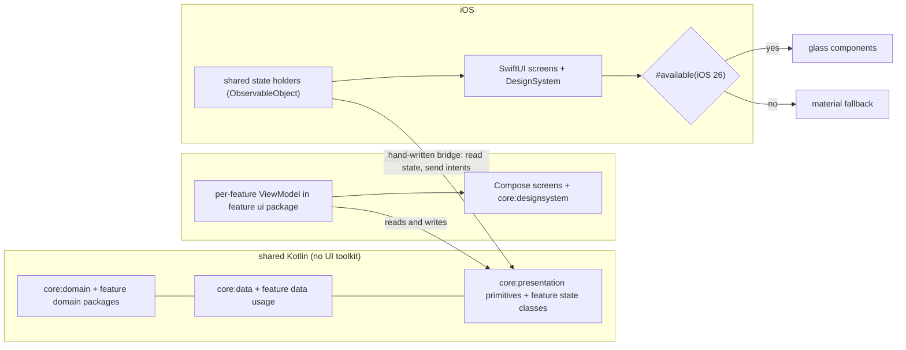

# ADR-0003 — UI sharing strategy

- **Status:** Accepted
- **Date:** 2026-09-29
- **Last verified:** 2026-09-29
- **Owner:** System Architect (see [`../../AGENTS.md`](../../AGENTS.md))
- **Owners:** decision owner System Architect; implementers Implementation Engineer (Android) and Implementation Engineer (iOS); consulted UI/UX Designer (glass and material paths)
- **Authoritative for:** where code sharing stops, which interop mechanism carries shared behaviour into Swift, and where the iOS glass/material split sits. Not the state classes themselves (`CONTRACTS.md`, `DESIGN.md` §4.1), not the visual specification (`UI_SPEC.md`), and not the alpha-policy for the artifacts involved (ADR-0008).
- **Inputs:** `DEC-013`, `DEC-008`, `DEC-015`, `DEC-026` in [`DECISION_BOARD.md`](../DECISION_BOARD.md); `DEC-001` (ADR-0002), `DEC-015` (ADR-0006), `DEC-010` (ADR-0008); `REQ-PLAT-001`, `REQ-PLAT-003`, `REQ-UX-001`, `REQ-UX-007`, `REQ-UX-008`, `REQ-UX-009`, `DEF-004` in [`REQUIREMENTS.md`](../REQUIREMENTS.md); [`DESIGN.md`](../DESIGN.md) §2, §4; verified facts checked 2026-09-29: `androidx.lifecycle` KMP latest 2.12.0-alpha04 (no stable), Kotlin Swift export Alpha, Liquid Glass `glassEffect` iOS 26.0+

## Owners

- **Decision owner:** System Architect — accountable for the sharing boundary and the interop mechanism.
- **Implementation owners:** Implementation Engineer (Android) and Implementation Engineer (iOS); `:core:presentation` is jointly owned, and each `:feature:*` module owns its own `presentation` package.
- **Consulted:** UI/UX Designer for the glass path and its fallback; Implementation Engineer (iOS) for the observation bridging consumed by SwiftUI.

## Decision

Sharing stops below the UI toolkit. In Kotlin Multiplatform, the shared core — `:core:domain`, `:core:data`, `:core:presentation` and each feature module's `commonMain` state classes (UI-state data classes, formatters, canonical copy keys) — is shared. Native per platform: the UI toolkit, the design system, navigation, image loading, and portrait accent extraction.

The interop and ownership rules are part of the decision:

- **No SKIE.** The Swift binding MUST be hand-written: a small Kotlin helper exposes shared state and intents to SwiftUI, and Swift observes the state without a third-party compiler plugin on the critical path. Kotlin Swift export is not used either; it is Alpha (checked 2026-09-29) and is tracked as `DEF-004`.
- **No shared ViewModels.** No module in the shared core MUST depend on a lifecycle/ViewModel artifact. State holders are per platform — an Android ViewModel in the feature's own `ui` package under `androidMain`, an iOS `ObservableObject` in the mirroring `iosApp/Features` package for that feature — and both drive the same shared state classes and intents (`DESIGN.md` §4.1).
- **Glass behind availability.** On iOS, Liquid Glass components MUST be gated by an availability check for iOS 26 and MUST fall back to a materials-based implementation on iOS 18/19/20/21; Reduce Transparency MUST swap glass for its opaque fallback.

- **Board entry:** `DEC-013` (sharing depth), `DEC-008` (iOS glass availability) — Accepted, in [`DECISION_BOARD.md`](../DECISION_BOARD.md).

## Context

The two design briefs describe one information architecture rendered in two native design languages (`docs/design/`, `UI_SPEC.md` §2, §4), and the behaviours that must not diverge — filtering, paging, debounce, enrichment, formatting, canonical copy — live in shared Kotlin (`REQ-PLAT-001`, `REQ-UX-008`, DEC-020). The two candidate mechanisms for pushing more of the presentation layer into Kotlin both rest on artifacts that were not stable on 2026-09-29: `androidx.lifecycle` KMP had no stable release (latest 2.12.0-alpha04) and Kotlin's Swift export was Alpha. SKIE 0.10.15 does support Kotlin 2.4.20, so it is technically available; the question is whether a compiler plugin belongs on the critical path of a two-platform deliverable whose stated evaluation axis is architecture quality (DEC-003).

The repository has no source code as of 2026-09-29, so this decision fixes the shape of the per-feature `presentation` packages and of the Swift binding before either exists.

## Decision drivers

- Sharing must stop where the design languages diverge — DEC-001, `UI_SPEC.md` §2, §4; `assessment.md:9`.
- No alpha artifact and no third-party compiler plugin on the critical path — DEC-013, `CON-004`, `REQ-NFR-002`.
- One behaviour for filtering, paging, formatting and copy on both platforms — `REQ-UX-008`, `AC-REQ-UX-008-1`, DEC-020.
- iOS 18 floor with Liquid Glass where available — DEC-008, `REQ-PLAT-003`, `REQ-UX-007`.
- Native image pipelines: Coil on Android, `URLCache`+`NSCache` on iOS; accent extraction is Android-only — DEC-026, `DESIGN.md` §4.4.
- The shared layer must be testable in `commonTest` without a platform test runner — `REQ-NFR-005`, DEC-030.

## Considered options

| Option | Shape | Trade-offs | Outcome |
| --- | --- | --- | --- |
| SKIE + shared ViewModels | `androidx.lifecycle` KMP ViewModels in `:core:presentation`, `StateFlow` bridged to Swift by SKIE | One state-holder implementation for both platforms; puts a second compiler plugin on the critical path, pins an alpha lifecycle artifact (`CON-004`), and couples every shared state change to SKIE's Kotlin-version support | Rejected: DEC-013; two simultaneous alpha/third-party risks for a benefit the shared state classes already provide. Also see ADR-0008 |
| Kotlin Swift export | Export shared Kotlin as a Swift package instead of the Objective-C bridging header | Best long-term interop and idiomatic Swift API; officially Alpha as of 2026-09-29, so the iOS milestone would wait on an unreleased toolchain feature | Rejected for the MVP: `DEF-004` keeps it as the re-entry path when it leaves Alpha |
| Shared Compose UI | Compose Multiplatform screens rendered by both apps | One UI and one UI test suite; erases Material 3 Expressive and Liquid Glass and makes the two Figma pages unimplementable (`UI_SPEC.md` §4) | Rejected: contradicts DEC-001 and DECISION_BOARD.md §3 |
| Per-platform state holders over shared state classes (chosen) | `:core:presentation` and each feature module's `presentation` package hold state classes, intents, formatters and copy keys; each platform holds its own state holder and renders natively | No plugin, no alpha lifecycle artifact, each platform's idioms intact, and the divergence-prone logic stays shared; costs a hand-written Swift binding and two state holders that must be kept behaviourally aligned by tests | Chosen: satisfies DEC-013 and `REQ-PLAT-001`, and keeps the alpha risk surface where ADR-0008 already documents it |

## Consequences

**Positive**

- The shared core compiles and is tested in `commonTest` with no lifecycle, Compose or SwiftUI dependency (DEC-030, `REQ-NFR-005`).
- Formatters and copy keys have exactly one implementation, so `AC-REQ-UX-008-1` (copy parity) has a single source to compare against.
- The Android client is not blocked by any iOS-specific toolchain, which preserves `REQ-PLAT-004`.
- Behavioural parity between the two state holders is verifiable with the same shared fixtures, because both consume the same state classes and intents (`DESIGN.md` §8).
- No third-party compiler plugin has to track the Kotlin version, so a Kotlin upgrade is a version-catalog change (see ADR-0008's upgrade policy).

**Negative**

- The Swift binding is hand-written: state observation, cancellation and intent dispatch from SwiftUI are project code and MUST be covered by an iOS test, not assumed.
- Two state holders exist for the same screen, so a behaviour change is two edits; the pair can drift unless the shared state class remains the only place where the rules live.
- SKIE's convenience (native `Flow` → Swift `AsyncSequence` semantics, sealed-class ergonomics) is given up; Swift call sites are more verbose.
- The iOS glass path and the material fallback are two rendering paths that must both be snapshot-tested (`RISK-007`).

## Risks

- **`RISK-007`** (fallback diverges visually from the glass path) — mitigated by DEC-025 snapshot tests on both paths and by `UI_SPEC.md` §4.2 specifying the fallback.
- **Local:** hand-written bridging bugs that silently stop state updates in SwiftUI — mitigated by an iOS test that drives the shared state and asserts the observed Swift value changes.
- **Local:** shared state classes drift into platform concerns (a lifecycle type, a UI colour), which would defeat the boundary — mitigated by `AC-REQ-PLAT-001-1` and the feature `presentation` dependency check in ADR-0001.
- **Local:** Kotlin Swift export matures and makes this decision look conservative — mitigated by `DEF-004`, which names the re-entry condition (Swift export leaves Alpha) and the ADR that would supersede this one.

## Validation criteria

- **Observable:** no SKIE or Swift-export toolchain entry and no lifecycle/ViewModel artifact appears in the shared modules' dependency declarations or in the version catalog — observed in the dependency-analysis report (DEC-032).
- **Observable:** the iOS app reflects a change to shared state — observed by driving the shared state in an iOS test and asserting the Swift-observed value updates; Android state holders are covered by the ViewModel tests that consume the same fixtures (DEC-030).
- **Observable:** on an iOS 18 simulator the app renders the material fallback and on iOS 26+ the glass components, with committed snapshots for both — observed by running both configurations (DEC-025, `AC-REQ-PLAT-003-1`).
- **Observable:** with Reduce Motion and Reduce Transparency enabled, transitions become cross-fades and glass becomes its opaque fallback — observed in the UI test run (`REQ-UX-007`, `TEST-UI-008`).
- **Observable:** the user-visible copy on both platforms matches the canonical key list (`AC-REQ-UX-008-1`, `TEST-UNIT-008`).
- **Observable:** the iOS suites (including the hand-written bridge test) and the Android suites are both part of the required pull-request check set — observed in the required-checks list and on a pull request (DEC-054).
- **Verification protocol (DEC-053):** each behaviour increment lands as a red commit (a test run and observed to fail), then a green commit, then an optional refactor commit, with history preserved (no squash; DEC-041 amended). The bridge test and the fallback snapshot above MUST begin as a failing test; a missing red phase is only acceptable for build, CI and tooling changes, and MUST be stated in the commit body.

## Related requirements

- `REQ-PLAT-001` (`AC-REQ-PLAT-001-1`): shared modules carry no platform UI code.
- `REQ-PLAT-003` (`AC-REQ-PLAT-003-1`): iOS 18 fallback versus iOS 26+ glass.
- `REQ-UX-001` (`AC-REQ-UX-001-1`): one appearance on both platforms regardless of the system setting.
- `REQ-UX-007` (`AC-REQ-UX-007-1`): motion honours Reduce Motion; glass honours Reduce Transparency.
- `REQ-UX-008` (`AC-REQ-UX-008-1`): copy parity against the canonical key list.
- `REQ-UX-009` (`AC-REQ-UX-009-1`): loading, empty, stale, error and partial states exist on both surfaces.
- `REQ-NFR-005` (`AC-REQ-NFR-005-2`): shared risky logic is tested in `commonTest`; platform UI in platform tests.
- `DEF-004`: the re-entry condition for Kotlin Swift export.

## Related implementation areas

- `:core:presentation` and the per-feature `presentation` packages (state classes and intents), each feature's `androidMain` `ui` package (Android ViewModels), `iosApp/Features/*` (iOS state holders and the Swift binding), `iosApp/DesignSystem` (glass/material split).
- [`DESIGN.md`](../DESIGN.md) §2 (shared/native split), §4.1 (state contract), §4.2 (navigation), §4.4 (accent extraction is Android-only).
- [`UI_SPEC.md`](../UI_SPEC.md) §4.2 (glass components), §7 (motion), §9 (Reduce Transparency fallback).
- DEC-026 (image pipeline per platform), DEC-030 (MockEngine fixtures in `commonTest`).
- Decision status index: [`DECISION_BOARD.md`](../DECISION_BOARD.md).

## Superseded and superseding ADRs

- **Supersedes:** none.
- **Superseded by:** none as of 2026-09-29. A future ADR supersedes this one if Kotlin Swift export leaves Alpha (`DEF-004`) or if a stable lifecycle KMP artifact makes shared ViewModels viable.
- **Related:** ADR-0002 (platform targets), ADR-0006 (presentation-state ownership and DI), ADR-0008 (alpha dependency policy, including the artifacts rejected here).
