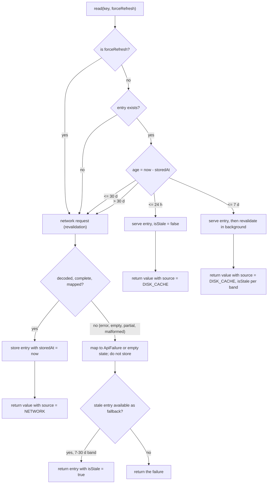

# ADR-0005 — Response caching: an app-level cache with explicit freshness

- **Status:** Accepted
- **Date:** 2026-09-29
- **Last verified:** 2026-09-29
- **Owner:** System Architect (see [`../../AGENTS.md`](../../AGENTS.md))
- **Owners:** decision owner System Architect; implementation owner Implementation Engineer (Android); consulted Implementation Engineer (iOS) for the device-clock and storage behaviour
- **Authoritative for:** cache identity, the freshness bands, what may be stored, and how freshness is evaluated. Not the wire contract (`API_SPECS.md` §6–§7) and not the HTTP-cache behaviour of the underlying engine, which this decision deliberately does not rely on.
- **Inputs:** `DEC-012`, `DEC-018` in [`DECISION_BOARD.md`](../DECISION_BOARD.md); `DEC-011` (ADR-0004), `DEC-052` (ADR-0001); `REQ-FUNC-020`, `REQ-FUNC-012`, `REQ-FUNC-010`, `REQ-REL-001`…`REQ-REL-004`, `RISK-005`, `RISK-006` in [`REQUIREMENTS.md`](../REQUIREMENTS.md); [`API_SPECS.md`](../API_SPECS.md) §7.1, §7.2, §7.3, §10.3; [`DESIGN.md`](../DESIGN.md) §7; live probe 2026-09-29: `GET /api/character?page=1` returns `Cache-Control: public, max-age=7776000, immutable` with an `ETag`, and a filtered-empty search returns a `404` carrying the same cacheable headers

## Owners

- **Decision owner:** System Architect — accountable for the cache identity, the freshness bands and the never-cache rule.
- **Implementation owners:** Implementation Engineer (Android) for the store, the key builder and the read policy in `:core:data`; Implementation Engineer (iOS) for the storage path used by the same module.
- **Consulted:** API Architect for `API_SPECS.md` §7 and for the `RISK-005` mitigation.

## Decision

The project ships an **application-level response cache in `:core:data`**, keyed explicitly, evaluated against an injected clock, and independent of the HTTP engine's cache.

**Cache identity.** The key MUST be built from the complete normalized request identity, and MUST contain all four components:

```
key = protocol + "|" + method + "|" + pathTemplate + "|" + canonicalQuery
```

- `protocol` — the selected remote protocol: `rest` (default) or `graphql`. Included so the two shipped protocols can never collide with each other, and so a future protocol variant cannot collide with either (`API_SPECS.md` §7.2, ADR-0011).
- `method` — `GET` for REST; `POST` for GraphQL, whose request is a JSON envelope.
- `pathTemplate` — the request path without query, e.g. `/api/character`, `/api/character/{id}` or `/graphql`.
- `canonicalQuery` — the parameters actually sent, lower-cased where the contract fixes the case (status, gender), trimmed, URL-encoded once, written in a fixed alphabetical order, with blank values omitted entirely. `page` is included as sent, so page 1 with a filter and page 1 without one are different entries. For GraphQL it is the operation name plus the SHA-256 of the checked-in document plus the canonical variables (ADR-0011, `API_SPECS.md` §7.2).

Two keys MUST never collide across pages, filters, IDs or protocols (`REQ-REL-001`). The image URL is never part of this cache and images are never stored here (`REQ-FUNC-021`, `AC-REQ-FUNC-021-2`).

**Freshness.** The policy is explicit, injectable configuration, evaluated as the age of the entry against the injected clock:

| Age of the entry | Online | Offline |
| --- | --- | --- |
| `≤ 24 h` (fresh) | Serve from cache; no network request. A manual refresh still performs one | Serve from cache, `isStale = false` |
| `> 24 h` and `≤ 7 d` (stale-while-revalidate) | Serve the cached content immediately and revalidate in the background; never block the first render | Serve from cache with `isStale = true` |
| `> 7 d` and `≤ 30 d` (offline fallback) | Network first; the cached entry is kept as the fallback if the request fails | Serve from cache with `isStale = true` |
| `> 30 d`, or no entry | Network; on failure surface the `Offline`/error state | No entry: surface the `Offline`/error state, never an empty list |

Manual refresh MUST always perform a network request and MUST retain the previously displayed content if it fails (`REQ-FUNC-012`). Stale data MUST be visibly marked (`REQ-REL-004`).

**Never cached.** An entry MUST be written only for a complete, successfully decoded, fully mapped response. The following MUST NOT create or refresh an entry: any `ApiFailure` outcome (including filtered and detail `404`, `429`, `5xx`, timeouts, offline and TLS failures); an empty body (`EmptyBody`); a malformed or unsupported payload (`MalformedResponse`); a partial response carrying warnings (`ApiWarning`); a decode failure; and an out-of-range page reached through a pagination walk (it is an artefact of the walk, not data). A filtered `404` that maps to a normal empty page is a successful outcome under `REQ-FUNC-010` and MAY be cached under the same key.

**Server headers are not followed.** The app's freshness bands override the server's `Cache-Control`. The observed `max-age=7776000` (90 days) MUST NOT be honoured, and no `ETag`/`304` round trip MUST be assumed: the shipped REST adapter does not serve JSON from the HTTP engine's disk cache, because that cache would otherwise retain the cacheable filtered `404` for 90 days (`RISK-005`). The engine MUST therefore be configured so JSON responses are excluded from its cache, and `API_SPECS.md` §7.1's requirement that REST `404` responses have their cache headers rewritten to `no-store` MUST be implemented at the network-response interceptor regardless; both layers matter, because a transport cache can serve a page without any application code running.

**Clock.** Freshness MUST be evaluated with an injected clock, and the policy thresholds MUST be injectable configuration (`API_SPECS.md` §7.2). Entries record `storedAt` as epoch milliseconds; a negative age (device clock moved backwards) MUST be clamped to zero rather than treated as fresh forever.

- **Board entry:** `DEC-012` (freshness policy), `DEC-018` (app-level cache, explicit keys, injected clock) — Accepted, in [`DECISION_BOARD.md`](../DECISION_BOARD.md).



## Context

The API is a slowly changing catalogue and the app must work for previously viewed content without an account (`REQ-PLAT-005`), so some client-side caching is required by `REQ-FUNC-020` and `assessment.md:19`. Two facts discovered on 2026-09-29 made the server's own caching policy unusable as the app's policy:

1. The server marks a filtered-empty result — a `404` with an error body — with the same `Cache-Control: public, max-age=7776000, immutable` headers as a real page. A standard HTTP disk cache would therefore persist a transient empty result for 90 days and later serve it as a valid answer (`RISK-005`).
2. A 90-day freshness window is wrong for the product: the list count and the character set change, the user expects a manual refresh to mean something (`REQ-FUNC-012`), and the app must be able to tell the user that what is on screen came from disk, which a transport-level cache does not expose.

Caching at the application level makes identity, freshness and "never cache an error" explicit and testable, and it produces the `DataResult.source`/`isStale` metadata the UI needs (`API_SPECS.md` §3). The repository has no source code as of 2026-09-29; the store, the key builder and the read policy are target-state and land with the first `:core:data` implementation.

## Decision drivers

- Errors and partial responses must never become the served answer — `REQ-FUNC-020`, `AC-REQ-FUNC-020-3`, `RISK-005`.
- Identity must not collide across page, filters or protocol — `REQ-REL-001`, `AC-REQ-REL-001-1`.
- Deterministic tests without wall-clock dependence — `REQ-REL-004`, `AC-REQ-REL-004-1`, DEC-018, `API_SPECS.md` §10.3.
- The UI must be able to mark stale content and keep prior content on a failed refresh — `REQ-FUNC-012`, `AC-REQ-FUNC-012-2`, `REQ-REL-004`, `DESIGN.md` §7.
- Cached renders must cost zero network requests — `AC-REQ-NFR-003-3`, `AC-REQ-FUNC-020-1`.
- Dependency restraint: no extra caching framework, one HTTP client — `REQ-NFR-002`, ADR-0004.

## Considered options

| Option | Shape | Trade-offs | Outcome |
| --- | --- | --- | --- |
| HTTP-cache-based | Rely on the OkHttp engine disk cache on Android and `URLCache` on iOS, with no app-level store | Least code and no new storage; freshness and identity are the server's, the cacheable filtered `404` is retained for 90 days (`RISK-005`), no `source`/`isStale` metadata is exposed to the UI, platform cache semantics differ, and the policy is not testable without a transport harness | Rejected: cannot satisfy `AC-REQ-FUNC-020-3`, `REQ-REL-004` or `AC-REQ-FUNC-012-1`, and makes the product's freshness policy a property of two different platform caches |
| App-level cache with explicit keys and freshness (chosen) | A bounded on-disk entry store in `:core:data`, keyed by the normalized request identity, read through an injected clock, never fed a failure outcome | Identity, freshness, staleness metadata and the never-cache rule are explicit, platform-independent and unit-testable; costs a store, a key builder, an eviction policy and one more thing to keep correct, and leaves the engine cache to be disabled for JSON | Chosen: the only option that satisfies `REQ-REL-001`, `REQ-REL-004` and `AC-REQ-FUNC-020-3` together |
| Network-first only | Always fetch; keep an in-memory list for the current session | Simplest possible model and no disk format to version; no offline support at all (`REQ-PLAT-005`), no fresh-window guarantee (`AC-REQ-FUNC-020-1`), and a cold start on a weak connection shows nothing | Rejected: removes `REQ-FUNC-020` and the offline acceptance criteria from the product |

Storage note: the cache is persisted through a dedicated `expect/actual` blob store in `:core:data` — one serialized entry per key under the app's private cache directory, evicted by bounded size at the same 20 MiB order of magnitude that `API_SPECS.md` §7.1 budgets for the HTTP cache. This store is deliberately not the favorites store of ADR-0007: the two have different sizes, lifetimes and eviction rules, and the OS may evict a cache directory at any time, which is acceptable here (a missing entry degrades to the offline error state) but not for favorites (DEC-004).

## Consequences

**Positive**

- `DataResult.source` and `isStale` are produced by the cache rather than inferred, so `DESIGN.md` §7 can map them to designed states directly.
- A repeat visit inside the fresh window performs no network request, which `AC-REQ-FUNC-020-1` and `AC-REQ-NFR-003-3` check.
- The cache is testable in `commonTest` with an injected clock and fixture responses, and needs no platform cache behaviour to verify (DEC-030).
- Deduplication of concurrent identical requests (`REQ-REL-002`) and the retry budget (`REQ-REL-003`) sit in the same layer as the cache, so one repository call sequence owns network, dedup and freshness.
- The filtered-404 hazard is closed by construction: a failure outcome has no code path that writes an entry.

**Negative**

- The store, the key builder and the eviction policy are project code that must be written and tested, on both platforms, where a transport cache would have been configuration.
- Freshness is a client concept, so the app may show content the server would have refreshed earlier; the `isStale` marker and the manual refresh are the compensation.
- Two caches now exist in the process (the app-level entry store and the image cache of DEC-026) plus a disabled engine cache, which MUST be documented so that "response caching" and "image caching" are not conflated (`REQ-FUNC-021`).
- Because JSON responses are excluded from the engine cache, no HTTP revalidation (`ETag`/`304`) happens; freshness is entirely app-side, and the engine MUST be explicitly configured to make that true rather than assumed.
- The chosen storage mechanism means a cold cache after OS eviction is normal, so "offline without an entry shows the offline error" (`AC-REQ-FUNC-020-2`) may be reached after a successful earlier session.

## Risks

- **`RISK-005`** (the API marks filtered `404` responses cacheable for 90 days) — this decision is the mitigation: failure outcomes are never stored, and JSON is kept out of the platform HTTP cache entirely.
- **`RISK-006`** (published totals quoted as constants go stale) — the cache stores the server's `count`/`pages` with the entry rather than any constant, and the UI reads it from the response (`AC-REQ-FUNC-001-3`).
- **Local:** unbounded growth if eviction is not implemented — mitigated by a bounded store with a size budget and by an eviction test.
- **Local:** a cache key missing one filter dimension would serve one query's page for another (`REQ-REL-001`) — mitigated by the canonical-query builder and by the isolation test.
- **Local:** a device clock change moving entries between bands — mitigated by storing `storedAt` and clamping a negative age to zero; the clock is injected, so tests do not depend on the platform clock.

## Validation criteria

- `TEST-UNIT-009` — freshness bands, stale marking, never-cache-on-failure and key isolation, with an injected fake clock and no wall-clock dependency.
- `TEST-INT-001` — a cached page renders with zero network requests; offline with an entry shows content plus the stale indicator; offline without an entry surfaces the offline error.
- `TEST-UNIT-007` — a failed refresh retains the previously displayed items (`AC-REQ-FUNC-012-2`).
- **Observable:** two filter combinations, two pages and two protocols never share an entry — observed by the cache-isolation test (`AC-REQ-REL-001-1`).
- **Observable:** a filtered `404` is rewritten to `no-store` and is never served from the HTTP engine cache — observed by the integration test required by `API_SPECS.md` §7.1 and §10.3, which is part of the required pull-request suite (DEC-054).
- **Observable:** a successful JSON `GET` leaves no entry in the HTTP engine cache, so no response can be served without the app cache's freshness check — observed in the same integration test.
- **Observable:** an error, empty body, malformed payload or partial response never creates or refreshes an entry — observed by the never-cache test (`AC-REQ-FUNC-020-3`).
- **Observable:** a manual refresh issues a network request while the entry is fresh, and a failed one keeps the previous items (`AC-REQ-FUNC-012-1`).
- **Verification protocol (DEC-053):** the read policy, the key builder and the never-cache rule land as a red commit (tests observed to fail against the injected clock and fixtures), then a green commit, then an optional refactor commit, with history preserved (no squash; DEC-041 amended). Build or tooling changes MAY skip the red phase and MUST state the exception in the commit body.

## Related requirements

- `REQ-FUNC-020` (`AC-REQ-FUNC-020-1`, `AC-REQ-FUNC-020-2`, `AC-REQ-FUNC-020-3`): fresh, stale-while-revalidate and offline fallback bands; never cache errors or partial responses.
- `REQ-FUNC-012` (`AC-REQ-FUNC-012-1`, `AC-REQ-FUNC-012-2`): manual refresh bypasses freshness and retains content on failure.
- `REQ-FUNC-010` (`AC-REQ-FUNC-010-1`): a filtered `404` is an empty state, not an error, and is not stored as a failure.
- `REQ-FUNC-021` (`AC-REQ-FUNC-021-2`): image bytes are never stored in the JSON cache.
- `REQ-REL-001` (`AC-REQ-REL-001-1`): cache identity by path, page, filters and protocol.
- `REQ-REL-002` (`AC-REQ-REL-002-1`): concurrent identical requests are deduplicated in the same layer.
- `REQ-REL-004` (`AC-REQ-REL-004-1`): stale data is marked and freshness is evaluated with an injected clock.
- `REQ-PLAT-005` (`AC-REQ-PLAT-005-1`): previous content is available offline and no account is needed.
- `REQ-NFR-003`: cached renders issue zero network requests and cold start stays within budget.

## Related implementation areas

- `:core:data` (entry store, key builder, read policy, dedup, `DataResult` metadata), `:core:domain` (`DataResult`, `ApiFailure`), `:core:testing` (fake clock, fixtures).
- [`API_SPECS.md`](../API_SPECS.md) §7.1, §7.2, §7.3 (the contract this implements) and §10.3 (the cache test list).
- [`DESIGN.md`](../DESIGN.md) §7 (failure-to-state mapping that consumes `isStale`) and §4.1 (`isStale` in the shared list state).
- DEC-026 (image cache, deliberately separate), DEC-030 (fixtures), DEC-054 (cache integration tests are part of the required pull-request suite), DEC-053 (TDD protocol).
- Decision status index: [`DECISION_BOARD.md`](../DECISION_BOARD.md).

## Superseded and superseding ADRs

- **Supersedes:** none.
- **Superseded by:** none as of 2026-09-30.
- **Amended by:** [ADR-0011](0011-runtime-remote-protocol.md) (`DEC-056`), 2026-09-30: the `protocol` component is now `rest` or `graphql`, and `method` is `POST` for the GraphQL adapter. The freshness bands, the never-cache rule and the injected clock are unchanged.
- **Related:** ADR-0004 (the client this cache sits behind, and the engine-cache exclusion it requires), ADR-0009 (the pager whose pages are the cache's units), ADR-0001 (`:core:data` ownership), ADR-0007 (the separate favorites store).
