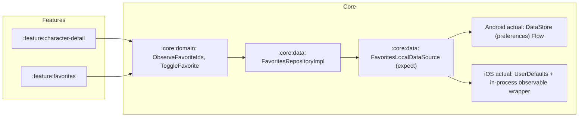

# ADR-0007 — Favorites persistence

- **Status:** Accepted
- **Date:** 2026-09-29
- **Last verified:** 2026-09-29
- **Owner:** System Architect (see [`../../AGENTS.md`](../../AGENTS.md))
- **Owners:** decision owner System Architect; implementation owner Implementation Engineer (Android); consulted Implementation Engineer (iOS) for the `UserDefaults` store and the Security Reviewer for the persisted-data inventory
- **Authoritative for:** how the favourite ID set is persisted, which module owns it, and which storage artifacts are excluded. Not the favorite UI (`UI_SPEC.md` §6.3), not the use-case contract (`CONTRACTS.md`) and not the cache (ADR-0005).
- **Inputs:** `DEC-004`, `DEC-017` in [`DECISION_BOARD.md`](../DECISION_BOARD.md); `DEC-052` (ADR-0001), `DEC-015` (ADR-0006); `REQ-FUNC-006`, `REQ-SEC-003`, `REQ-PLAT-005`, `REQ-NFR-002`, `REQ-NFR-005`, `NG-003` in [`REQUIREMENTS.md`](../REQUIREMENTS.md); [`DESIGN.md`](../DESIGN.md) §4.5, §6; verified on 2026-09-29: DataStore KMP latest 1.3.0-alpha11 (no stable), AndroidX DataStore for Android is stable

## Owners

- **Decision owner:** System Architect — accountable for the storage choice and for the exclusion list.
- **Implementation owners:** Implementation Engineer (Android) for the `expect` declaration and the Android `DataStore` actual; Implementation Engineer (iOS) for the `UserDefaults` actual and its observation wrapper.
- **Consulted:** Security Reviewer for `REQ-SEC-003` (the persisted-field inventory); Requirements Analyst for the MVP scope of `REQ-FUNC-006`.

## Decision

Favorites are **local-only and never synchronised**, and they are persisted through `expect/actual` stores behind one data-source interface.

- `:core:domain` MUST own `FavoritesRepository` with `observe(): Flow<Set<CharacterId>>` and `toggle(id)`, plus the `ObserveFavoriteIds` and `ToggleFavorite` use cases (they are consumed by two features, so they are cross-feature and live in the core by ADR-0001).
- `:core:data` MUST own `FavoritesLocalDataSource` as the only persistence seam, with an `expect` declaration in `commonMain` and one `actual` per platform. No other module MUST touch platform storage for favourites.
- **Android:** the actual store MUST use stable `androidx.datastore:datastore-preferences` in the application's files directory, exposing the set as a `Flow`. Preferences DataStore is appropriate because the payload is a small set of strings and the API is already reactive.
- **iOS:** the actual store MUST use `UserDefaults` with a namespaced key holding the ID set. Because `UserDefaults` is not itself reactive, the actual MUST keep an in-process observable wrapper: the flow is seeded from `UserDefaults` at creation and updated on every write. Writes from outside the process are explicitly out of scope; the app is single-process.
- The persisted payload MUST be the character IDs only. No names, images, search text, timestamps or any other field MUST be stored (`REQ-SEC-003`), and favourite IDs MUST NOT be sent to the network — the detail screen fetches a favourite through the normal cached path (ADR-0005).
- Toggling MUST take effect in memory immediately and MUST survive a process restart; a write failure MUST be logged through the observability contract and MUST NOT crash the app, leaving the last known consistent set.
- **Rejected artifacts:** multiplatform DataStore `1.3.0-alpha11` and any SQLDelight version MUST NOT be added for favourites (`CON-004` records the alpha option; this ADR is the reason it is not taken).

- **Board entry:** `DEC-004` (scope: favorites in MVP, local only), `DEC-017` (expect/actual stores) — Accepted, in [`DECISION_BOARD.md`](../DECISION_BOARD.md).

## Context

The Favorite action is drawn in both Figma pages and is committed to the MVP on both platforms (DEC-002, DEC-004), and `REQUIREMENTS.md` `REQ-FUNC-006` requires the marked set to survive an app restart, stored locally only (also `NG-003`: no server-side or cross-device sync). The payload is a set of opaque identifiers — a few dozen strings at most over the app's life.

Two plausible implementations were available and both were rejected on dependency grounds. Multiplatform DataStore would give one implementation with a single API, but every published version was alpha on 2026-09-29 (latest 1.3.0-alpha11), and the project's alpha budget is already spent on the Material 3 Expressive artifact that is on the Android UI path (ADR-0008). SQLDelight would give transactional, queryable storage, schema migrations and generated code, which is a large machinery for one set of strings and would require a driver per platform plus a code generator in the build.

This decision fixes the seam before the code exists: the repository, the use cases and the data source are target state in `:core:data`, and the two `actual` implementations are small by design.

## Decision drivers

- The set must survive a process restart and stay local — `REQ-FUNC-006`, `AC-REQ-FUNC-006-2`, `NG-003`, DEC-004.
- Only one persisted artifact may exist, and it must be classifiable as non-personal data — `REQ-SEC-003`, `AC-REQ-SEC-003-1`, DEC-035.
- No alpha artifact for a trivial concern; the alpha budget is spent elsewhere — `CON-004`, DEC-010, ADR-0008.
- Dependency restraint: no database for a set of IDs — `REQ-NFR-002`, `assessment.md:7`.
- One persistence seam so the feature layer never sees platform storage — `REQ-NFR-001`, ADR-0001.
- Immediate UI echo of the toggled state, including for accessibility — `AC-REQ-FUNC-006-1`.
- The store must be replaceable without touching features — `DEC-052` (features depend on `:core:*`, never on platform APIs).

## Considered options

| Option | Shape | Trade-offs | Outcome |
| --- | --- | --- | --- |
| Multiplatform DataStore | One `commonMain` implementation on `androidx.datastore:datastore:1.3.0-alpha11` | One code path, one API, file-based with corruption handling; pins an alpha artifact, adds its transitive multiplatform dependencies, and couples the favorites store to an artifact whose API may change under it | Rejected: DEC-017; an alpha dependency for a set of strings, when the alpha budget is committed to material3 (DEC-010) |
| SQLDelight | One schema with a favourites table, generated queries, per-platform drivers | Transactions, indexes, migrations and compile-time-checked queries; introduces a database, a Gradle plugin, generated sources and native drivers for a payload of a few dozen IDs, and makes the reviewer read schema code to find "a set of strings" | Rejected: DEC-017 and `REQ-NFR-002`; the concern does not need a relational store and the dependency surface is large |
| Android `SharedPreferences` + iOS `UserDefaults`, one `expect` seam | Both platforms use their oldest key-value store | No new dependency at all and both APIs are universally known; `SharedPreferences` has no reactive API and its async commit semantics invite inconsistency, and it is the store DataStore was introduced to replace | Rejected: the Android side would need hand-rolled observation and change notification for a flow-based domain contract |
| `expect/actual` stores: Android DataStore (stable) + iOS `UserDefaults` (chosen) | One interface in `:core:data`, a stable DataStore actual on Android, a `UserDefaults` actual plus an in-process observable wrapper on iOS | Both artifacts are stable and platform-idiomatic, the domain contract is reactive on both platforms, and features never see platform storage; costs two implementations to test and an explicitly documented limitation that external writes are not observed on iOS (irrelevant for a single-process app) | Chosen: satisfies `REQ-FUNC-006`, `REQ-SEC-003` and `REQ-NFR-002` without adding an alpha artifact or a database |

## Consequences

**Positive**

- Both storage dependencies are stable, so favorites are not exposed to the alpha-risk process of ADR-0008.
- The domain contract is a `Flow<Set<CharacterId>>`, so the UI can reflect a toggle immediately (`AC-REQ-FUNC-006-1`) and the Favorites tab and the detail screen read the same state.
- Two features consume one store through `:core:domain` use cases, so toggling in Detail updates the Favorites tab without either feature knowing about the other (ADR-0001).
- The persisted payload is a set of IDs, which keeps the `REQ-SEC-003` inventory trivially auditable and free of personal data.
- Replacing the storage later (for example if multiplatform DataStore ships stable) is a change to one `actual` per platform plus the data-source tests, with no feature edits.

**Negative**

- Two implementations exist, so the store contract MUST be covered by a shared behavioural test on both platforms, otherwise the two can diverge on edge cases such as rapid toggles or a corrupted payload.
- The interface is reactive, but `UserDefaults` is not: the iOS actual maintains the flow in process, so an external writer (an app extension, a settings UI, another process) would not be reflected. This is accepted and MUST be documented in the iOS package.
- iOS `UserDefaults` is included in device backups and restored on a new device, so the favourite set may travel with a backup; this is the intended "survives restart" behaviour, and the IDs are not personal data, but it MUST be listed in the `SECURITY.md` persisted-data inventory.
- Android's automatic backup may carry the DataStore file for the same reason, with identical classification.
- A write failure is intentionally non-fatal, so a failed write can diverge the in-memory view from the disk state until the next read; the logging contract is the only signal (ADR-0006's observability boundary, `OBSERVABILITY.md`).

## Risks

- **Local:** divergence between the two actual implementations — mitigated by one behavioural test suite run against both (shared fixtures plus a platform store harness).
- **Local:** accidentally persisting more than IDs (a name, an image URL) — mitigated by the data-source contract taking `Set<CharacterId>` only and by the `REQ-SEC-003` inventory test.
- **Local:** a feature reading platform storage directly instead of the repository — mitigated by the ADR-0001 dependency rules and the dependency-analysis check (DEC-032).
- **Local:** favourite IDs leaking into logs or requests — mitigated by `REQ-SEC-005` (no search text, bodies or stack traces in logs) and by the rule above that IDs are never sent to the network.
- **Local:** the alpha multiplatform DataStore becoming stable and tempting a migration mid-milestone — a migration is only acceptable with a superseding ADR; otherwise the stable pair stands.

## Validation criteria

- `TEST-UNIT-004` — toggle, re-toggle, read-back from a freshly constructed store over the same backing storage, and an empty-set read; proves `AC-REQ-FUNC-006-1` and `AC-REQ-FUNC-006-2` at the data layer.
- `TEST-UI-005` — the favourite control reflects the stored state on first render and exposes a toggled accessibility state (`AC-REQ-FUNC-006-1`), and the Favorites section shows its empty state while the set is empty (`AC-REQ-FUNC-006-3`).
- **Observable:** after a process restart the previously marked characters are still marked on both platforms — observed by relaunching the app on an Android device/emulator and an iOS simulator.
- **Observable:** toggling a favourite performs no network request — observed in the client's request log (`API_SPECS.md` §9) during the UI test.
- **Observable:** the persisted payload contains IDs only — observed by inspecting the DataStore file and the `UserDefaults` entry, and recorded in the `SECURITY.md` §3 persisted-field inventory (`AC-REQ-SEC-003-1`).
- **Observable:** the resolved dependency graph contains no multiplatform-DataStore alpha artifact and no SQLDelight artifact — observed in the dependency-analysis report and in `README.md`'s dependency inventory.
- **Verification protocol (DEC-053):** the store contract, the toggle path and the empty-state behaviour land as a red commit (a test observed to fail against a store stub), then a green commit, then an optional refactor commit, with history preserved (no squash; DEC-041 amended). Build or tooling changes MAY skip the red phase and MUST state the exception in the commit body.

## Related requirements

- `REQ-FUNC-006` (`AC-REQ-FUNC-006-1`, `AC-REQ-FUNC-006-2`, `AC-REQ-FUNC-006-3`): mark/unmark, survive restart, local only, designed empty state.
- `REQ-SEC-003` (`AC-REQ-SEC-003-1`): the favourite ID set is the only persisted data and is documented in `SECURITY.md` §3.
- `REQ-PLAT-005` (`AC-REQ-PLAT-005-1`): no account or credential; favourites remain local.
- `REQ-NFR-002` (`AC-REQ-NFR-002-2`): each dependency has a named rationale; no database, no alpha store.
- `REQ-NFR-005` (`AC-REQ-NFR-005-1`): the risky modules have direct behavioural tests in `commonTest`.
- `NG-003`: no server-side or cross-device sync of favourites.
- `CON-004`: records the multiplatform-DataStore alpha that this decision declines to adopt.

## Related implementation areas

- `:core:domain` (`FavoritesRepository`, `ObserveFavoriteIds`, `ToggleFavorite`), `:core:data` (`FavoritesLocalDataSource` `expect`/`actual`, `FavoritesRepositoryImpl`), `:feature:character-detail` (toggle surface), `:feature:favorites` (list and empty state), `:core:testing` (store harness and fixtures).
- [`DESIGN.md`](../DESIGN.md) §4.5 (the favourites flow this ADR implements) and §6 (the class diagram entries for the repository and data source).
- [`UI_SPEC.md`](../UI_SPEC.md) §6.3 (Favorite control) and §6.4 (Favorites empty state).
- DEC-035 (`SECURITY.md` persisted-data inventory), DEC-053 (TDD protocol), DEC-054 (both platform suites required on every pull request).
- Decision status index: [`DECISION_BOARD.md`](../DECISION_BOARD.md).

## Superseded and superseding ADRs

- **Supersedes:** none. This ADR closes `DESIGN.md` §9 decision D4 (favorites scope and storage) in favour of the `expect/actual` stores.
- **Superseded by:** none as of 2026-09-29. A superseding ADR would be required to adopt multiplatform DataStore once it is stable, or to move favorites to any synchronised store (which would also reopen `NG-003`).
- **Related:** ADR-0005 (the response cache, deliberately a separate store with different lifetime and eviction), ADR-0001 (`:core:data` ownership and the feature-to-core rule), ADR-0006 (the state contract the toggle feeds), ADR-0008 (the alpha budget this decision declines to spend).
